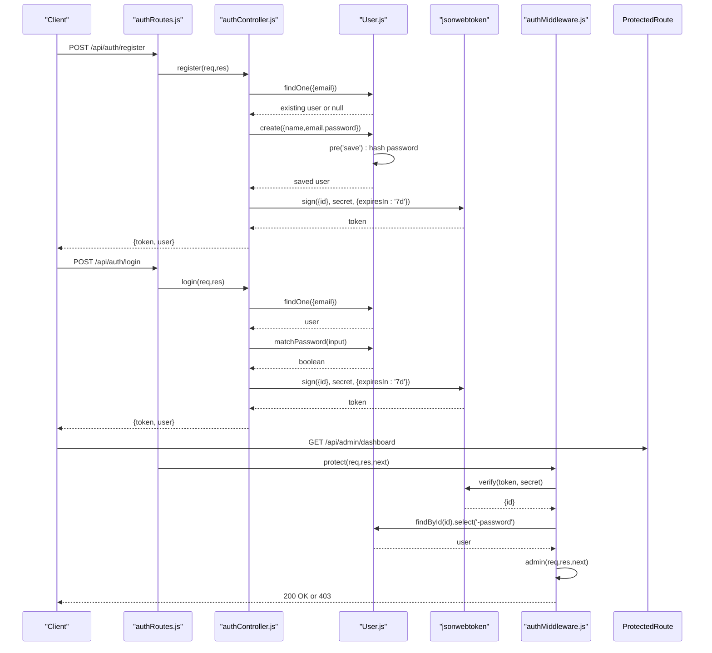
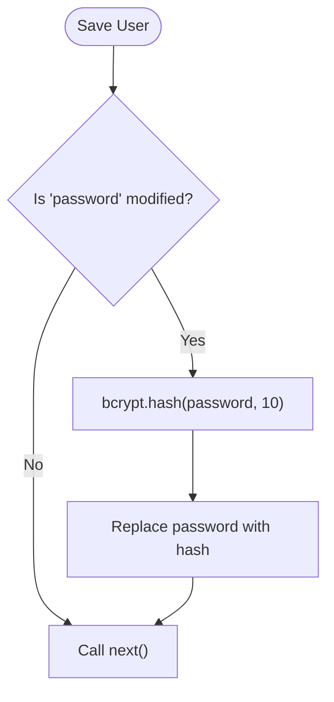
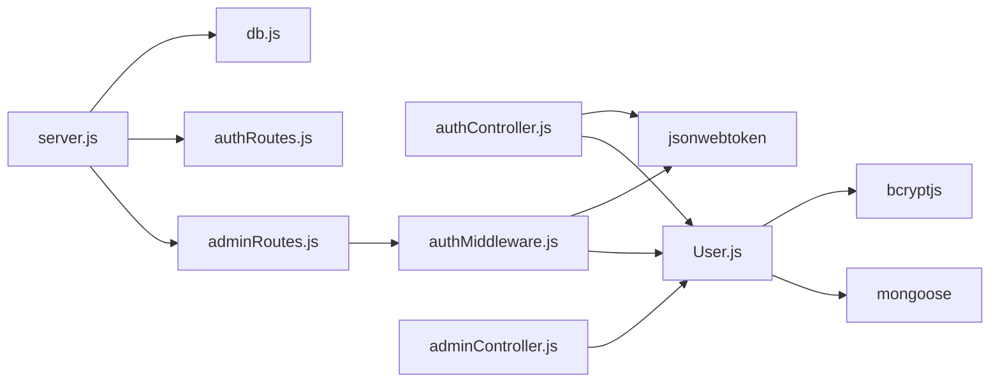

# User Model

<cite>
**Referenced Files in This Document**
- [User.js](file://backend/models/User.js)
- [authController.js](file://backend/controllers/authController.js)
- [authMiddleware.js](file://backend/middleware/authMiddleware.js)
- [authRoutes.js](file://backend/routes/authRoutes.js)
- [adminRoutes.js](file://backend/routes/adminRoutes.js)
- [adminController.js](file://backend/controllers/adminController.js)
- [db.js](file://backend/config/db.js)
- [server.js](file://backend/server.js)
- [package.json](file://backend/package.json)
</cite>

## Table of Contents
1. [Introduction](#introduction)
2. [Project Structure](#project-structure)
3. [Core Components](#core-components)
4. [Architecture Overview](#architecture-overview)
5. [Detailed Component Analysis](#detailed-component-analysis)
6. [Dependency Analysis](#dependency-analysis)
7. [Performance Considerations](#performance-considerations)
8. [Troubleshooting Guide](#troubleshooting-guide)
9. [Conclusion](#conclusion)

## Introduction
This document provides comprehensive data model documentation for the User model used in the authentication and authorization subsystem. It covers the schema definition, validation rules, password hashing with bcryptjs, authentication flow, role-based access control (RBAC), and security considerations. It also documents the pre-save middleware for password encryption, timestamp functionality, and practical examples of user creation and role checks.

## Project Structure
The User model and related authentication components are organized as follows:
- Model: defines the Mongoose schema, validation, hashing, and helper methods
- Controllers: handle registration and login requests, issue JWT tokens, and manage user sessions
- Middleware: enforce protected routes and admin-only access
- Routes: expose endpoints for authentication
- Config: initialize database connection and environment variables
- Server: configure Express app, CORS, routes, and error handling

```mermaid
graph TB
subgraph "Config"
DB["db.js"]
end
subgraph "Models"
UserModel["User.js"]
end
subgraph "Controllers"
AuthCtrl["authController.js"]
AdminCtrl["adminController.js"]
end
subgraph "Middleware"
AuthMW["authMiddleware.js"]
end
subgraph "Routes"
AuthRoutes["authRoutes.js"]
AdminRoutes["adminRoutes.js"]
end
subgraph "Server"
Server["server.js"]
end
DB --> UserModel
UserModel --> AuthCtrl
AuthCtrl --> AuthMW
AuthMW --> AdminRoutes
AdminRoutes --> AdminCtrl
AuthRoutes --> AuthCtrl
Server --> DB
Server --> AuthRoutes
Server --> AdminRoutes
```

**Diagram sources**
- [db.js:1-14](file://backend/config/db.js#L1-L14)
- [User.js:1-20](file://backend/models/User.js#L1-L20)
- [authController.js:1-27](file://backend/controllers/authController.js#L1-L27)
- [authMiddleware.js:1-20](file://backend/middleware/authMiddleware.js#L1-L20)
- [authRoutes.js:1-9](file://backend/routes/authRoutes.js#L1-L9)
- [adminRoutes.js:1-14](file://backend/routes/adminRoutes.js#L1-L14)
- [adminController.js:1-24](file://backend/controllers/adminController.js#L1-L24)
- [server.js:1-102](file://backend/server.js#L1-L102)

**Section sources**
- [server.js:57-63](file://backend/server.js#L57-L63)
- [db.js:5-13](file://backend/config/db.js#L5-L13)

## Core Components
- User model schema with fields: name, email, password, role
- Validation rules: required fields, unique email, enum role values
- Password hashing via bcryptjs in a pre-save hook
- Authentication helper method to compare passwords
- Timestamps enabled on the model
- JWT-based authentication and RBAC enforcement

Key implementation references:
- Schema and validations: [User.js:4-9](file://backend/models/User.js#L4-L9)
- Pre-save password hashing: [User.js:11-14](file://backend/models/User.js#L11-L14)
- Password comparison method: [User.js:16-18](file://backend/models/User.js#L16-L18)
- Timestamps: [User.js:9](file://backend/models/User.js#L9)

**Section sources**
- [User.js:4-18](file://backend/models/User.js#L4-L18)

## Architecture Overview
The authentication flow spans the route handlers, controller logic, model hooks, and middleware. The following sequence diagram maps the end-to-end user registration and login process.



**Diagram sources**
- [authRoutes.js:6-7](file://backend/routes/authRoutes.js#L6-L7)
- [authController.js:6-26](file://backend/controllers/authController.js#L6-L26)
- [User.js:11-18](file://backend/models/User.js#L11-L18)
- [authMiddleware.js:4-15](file://backend/middleware/authMiddleware.js#L4-L15)
- [adminRoutes.js:8](file://backend/routes/adminRoutes.js#L8)

## Detailed Component Analysis

### User Model Schema and Validation
- Fields and types:
  - name: String, required
  - email: String, required, unique
  - password: String, required
  - role: String, enum ['user','admin'], default 'user'
- Validation constraints:
  - Required fields enforced at schema level
  - Unique constraint on email to prevent duplicates
  - Enum constraint ensures role is either 'user' or 'admin'
- Timestamps:
  - Automatic createdAt and updatedAt fields managed by Mongoose

Security and correctness considerations:
- Unique email prevents account takeover via duplicate accounts
- Enum role restricts unauthorized elevation
- Pre-save hook ensures plaintext passwords are never persisted

**Section sources**
- [User.js:4-9](file://backend/models/User.js#L4-L9)

### Password Hashing with bcryptjs
- Pre-save middleware:
  - Triggers only when the password field is modified
  - Hashes the password with a salt round of 10
  - Replaces the plaintext password with the hashed value
- Authentication helper:
  - Compares an entered password against the stored hash
  - Returns a boolean indicating match

Operational flow:


**Diagram sources**
- [User.js:11-14](file://backend/models/User.js#L11-L14)

**Section sources**
- [User.js:11-18](file://backend/models/User.js#L11-L18)

### Role-Based Access Control (RBAC)
- Roles:
  - user: default role for regular users
  - admin: administrative role for privileged access
- Middleware enforcement:
  - protect: verifies JWT and attaches user (without password) to request
  - admin: checks that the attached user has role 'admin'

Usage pattern:
- Wrap admin routes with protect followed by admin
- Access control occurs in middleware, not route handlers

**Section sources**
- [User.js:8](file://backend/models/User.js#L8)
- [authMiddleware.js:17-20](file://backend/middleware/authMiddleware.js#L17-L20)
- [adminRoutes.js:8](file://backend/routes/adminRoutes.js#L8)

### Authentication Flow and Token Management
- Registration:
  - Validates absence of existing email
  - Creates user record (hashed password applied automatically)
  - Issues JWT with expiration of seven days
- Login:
  - Finds user by email
  - Verifies password using matchPassword
  - Issues JWT upon successful authentication
- Token verification:
  - Authorization header expected as Bearer token
  - Decodes JWT and loads user excluding password
  - Enforces admin-only access when required

Endpoints:
- POST /api/auth/register
- POST /api/auth/login

**Section sources**
- [authController.js:6-26](file://backend/controllers/authController.js#L6-L26)
- [authRoutes.js:6-7](file://backend/routes/authRoutes.js#L6-L7)
- [authMiddleware.js:4-15](file://backend/middleware/authMiddleware.js#L4-L15)

### Timestamp Functionality
- Enabled via Mongoose timestamps option
- Provides automatic createdAt and updatedAt fields
- Useful for audit trails and sorting

**Section sources**
- [User.js:9](file://backend/models/User.js#L9)

### Practical Examples

- User creation (registration):
  - Endpoint: POST /api/auth/register
  - Request body includes name, email, password
  - Response includes token and user profile (excluding sensitive fields)
  - Reference: [authController.js:6-16](file://backend/controllers/authController.js#L6-L16), [authRoutes.js:6](file://backend/routes/authRoutes.js#L6)

- Authentication (login):
  - Endpoint: POST /api/auth/login
  - Request body includes email and password
  - Response includes token and user profile
  - Reference: [authController.js:18-26](file://backend/controllers/authController.js#L18-L26), [authRoutes.js:7](file://backend/routes/authRoutes.js#L7)

- Role checking:
  - Admin-only routes are protected by protect and admin middleware
  - Example: GET /api/admin/dashboard
  - Reference: [adminRoutes.js:10](file://backend/routes/adminRoutes.js#L10), [authMiddleware.js:17-20](file://backend/middleware/authMiddleware.js#L17-L20)

- Admin dashboard data:
  - Aggregates counts and revenue for admin metrics
  - Reference: [adminController.js:5-14](file://backend/controllers/adminController.js#L5-L14)

## Dependency Analysis
External libraries and their roles:
- bcryptjs: password hashing and comparison
- jsonwebtoken: JWT signing and verification
- mongoose: ODM schema, middleware, and timestamps
- dotenv: environment configuration loading



**Diagram sources**
- [User.js:1-2](file://backend/models/User.js#L1-L2)
- [authController.js:1](file://backend/controllers/authController.js#L1)
- [authMiddleware.js:1](file://backend/middleware/authMiddleware.js#L1)
- [adminRoutes.js:3](file://backend/routes/adminRoutes.js#L3)
- [adminController.js:1](file://backend/controllers/adminController.js#L1)
- [server.js:6](file://backend/server.js#L6)
- [db.js:1](file://backend/config/db.js#L1)

**Section sources**
- [package.json:8-22](file://backend/package.json#L8-L22)

## Performance Considerations
- Password hashing cost: bcryptjs uses a fixed salt round of 10 in the current implementation. Adjusting rounds increases security but also CPU usage during registration/login.
- Middleware overhead: JWT verification and user lookup occur on every protected route; ensure efficient database indexing on email and ID fields.
- Token expiration: Shorter-lived tokens reduce risk but increase re-authentication frequency.

## Troubleshooting Guide
Common issues and resolutions:
- Email already exists during registration:
  - Cause: Duplicate email detected by unique constraint
  - Resolution: Use a different email address
  - Reference: [authController.js:9-11](file://backend/controllers/authController.js#L9-L11)

- Invalid credentials on login:
  - Cause: Email not found or password mismatch
  - Resolution: Verify email and password; ensure bcrypt hashing is functioning
  - Reference: [authController.js:20-22](file://backend/controllers/authController.js#L20-L22), [User.js:16-18](file://backend/models/User.js#L16-L18)

- Not authorized (missing or invalid token):
  - Cause: Missing Authorization header or invalid/expired token
  - Resolution: Include a valid Bearer token; ensure JWT_SECRET is configured
  - Reference: [authMiddleware.js:5-6](file://backend/middleware/authMiddleware.js#L5-L6), [authMiddleware.js:12-14](file://backend/middleware/authMiddleware.js#L12-L14)

- Access denied (not admin):
  - Cause: Non-admin user attempts admin-only endpoint
  - Resolution: Authenticate as an admin user or adjust permissions
  - Reference: [authMiddleware.js:17-20](file://backend/middleware/authMiddleware.js#L17-L20)

- Database connection errors:
  - Cause: MONGO_URI misconfiguration or unreachable database
  - Resolution: Verify environment variables and connectivity
  - Reference: [db.js:5-13](file://backend/config/db.js#L5-L13), [server.js:17-18](file://backend/server.js#L17-L18)

## Conclusion
The User model enforces strong validation and security through unique email constraints, enum-based roles, bcryptjs hashing, and JWT-based authentication. The pre-save middleware guarantees secure password storage, while middleware layers provide robust RBAC for protected routes. Following the documented examples and best practices ensures reliable user management and secure access control across the application.