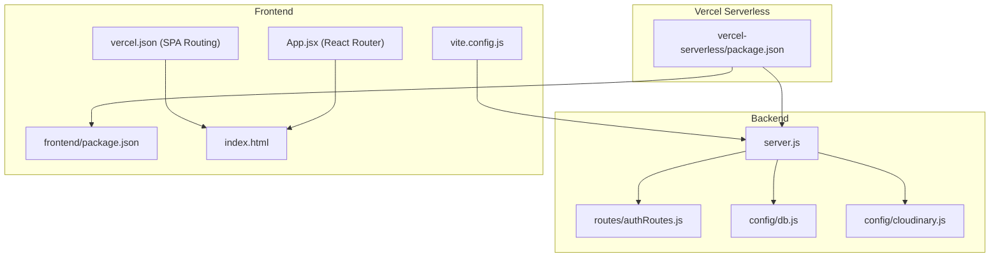
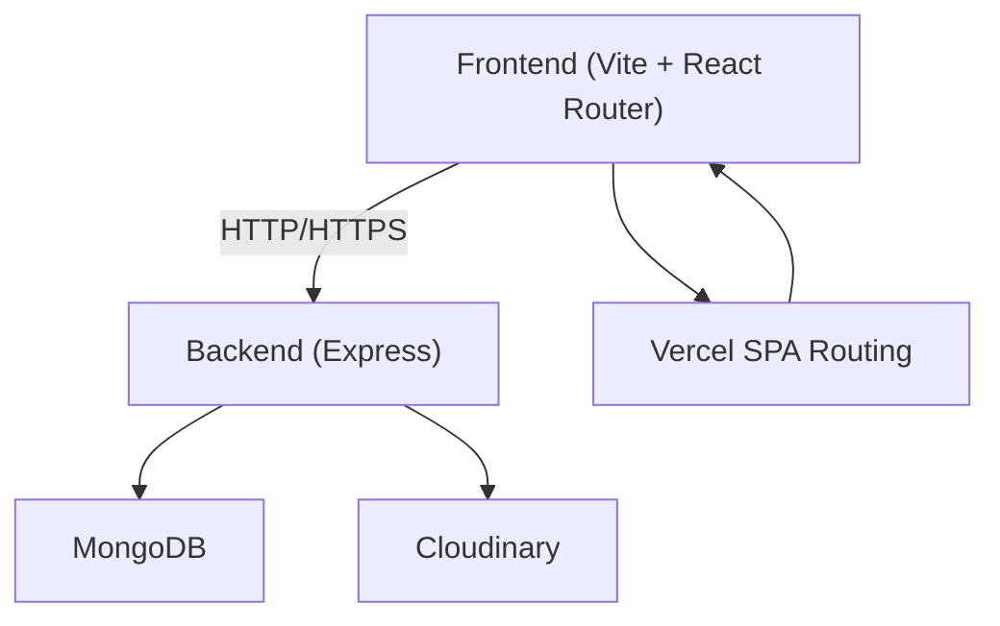
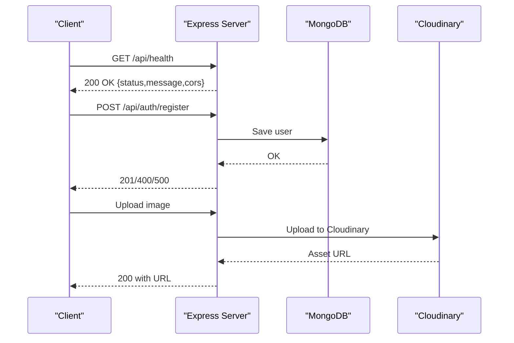
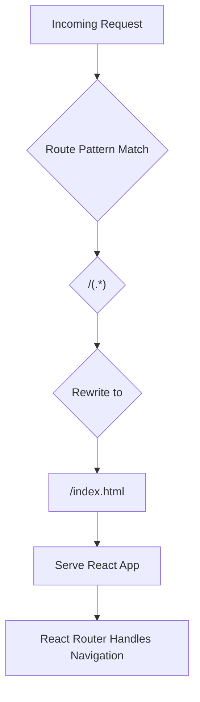
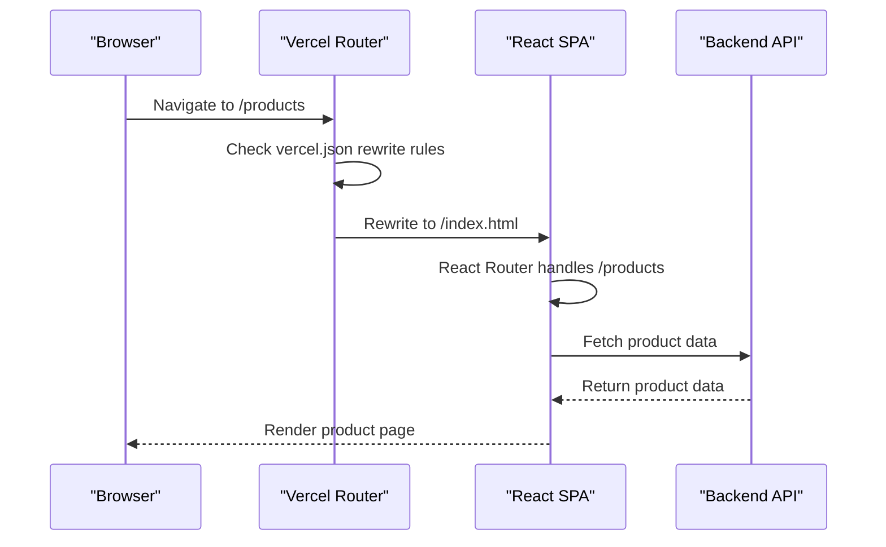

# Deployment & Configuration

<cite>
**Referenced Files in This Document**
- [backend/package.json](file://backend/package.json)
- [backend/Dockerfile](file://backend/Dockerfile)
- [backend/railway.toml](file://backend/railway.toml)
- [backend/nixpacks.toml](file://backend/nixpacks.toml)
- [backend/server.js](file://backend/server.js)
- [backend/config/db.js](file://backend/config/db.js)
- [backend/config/cloudinary.js](file://backend/config/cloudinary.js)
- [backend/routes/authRoutes.js](file://backend/routes/authRoutes.js)
- [backend/.gitignore](file://backend/.gitignore)
- [vercel-serverless/package.json](file://vercel-serverless/package.json)
- [frontend/package.json](file://frontend/package.json)
- [frontend/vite.config.js](file://frontend/vite.config.js)
- [frontend/tailwind.config.js](file://frontend/tailwind.config.js)
- [frontend/vercel.json](file://frontend/vercel.json)
- [frontend/index.html](file://frontend/index.html)
- [frontend/src/App.jsx](file://frontend/src/App.jsx)
</cite>

## Update Summary
**Changes Made**
- Added Vercel SPA routing configuration section
- Updated Vercel Serverless Deployment section to include SPA routing requirements
- Enhanced Frontend SPA configuration documentation
- Added React Router integration details for proper SPA deployment

## Table of Contents
1. [Introduction](#introduction)
2. [Project Structure](#project-structure)
3. [Core Components](#core-components)
4. [Architecture Overview](#architecture-overview)
5. [Detailed Component Analysis](#detailed-component-analysis)
6. [Environment Variable Management](#environment-variable-management)
7. [Docker Containerization](#docker-containerization)
8. [Railway Deployment](#railway-deployment)
9. [Vercel Serverless Deployment](#vercel-serverless-deployment)
10. [CI/CD Pipeline Setup](#cicd-pipeline-setup)
11. [Security Considerations](#security-considerations)
12. [Monitoring and Observability](#monitoring-and-observability)
13. [Performance Optimization](#performance-optimization)
14. [Troubleshooting Guide](#troubleshooting-guide)
15. [Conclusion](#conclusion)

## Introduction
This document provides comprehensive deployment and configuration guidance for the E-commerce App. It covers containerization with Docker, platform deployments on Railway and Vercel, environment variable management across development, staging, and production, security hardening, monitoring, performance tuning, CI/CD setup, and troubleshooting. The goal is to enable reliable, scalable, and secure deployments for local development, cloud hosting, and serverless architectures.

## Project Structure
The project consists of three primary parts:
- Backend service: Express-based API with MongoDB connectivity, Cloudinary integration, and route modules.
- Frontend: React SPA built with Vite, configured with a proxy to the backend API and SPA routing support.
- Vercel serverless wrapper: A monorepo-style setup enabling local development and potential serverless packaging.

**Diagram sources**
- [backend/server.js:1-102](file://backend/server.js#L1-L102)
- [backend/routes/authRoutes.js:1-9](file://backend/routes/authRoutes.js#L1-L9)
- [backend/config/db.js:1-14](file://backend/config/db.js#L1-L14)
- [backend/config/cloudinary.js:1-13](file://backend/config/cloudinary.js#L1-L13)
- [frontend/vite.config.js:1-15](file://frontend/vite.config.js#L1-L15)
- [frontend/package.json:1-25](file://frontend/package.json#L1-L25)
- [frontend/vercel.json:1-9](file://frontend/vercel.json#L1-L9)
- [frontend/index.html:1-23](file://frontend/index.html#L1-L23)
- [frontend/src/App.jsx:1-67](file://frontend/src/App.jsx#L1-L67)
- [vercel-serverless/package.json:1-29](file://vercel-serverless/package.json#L1-L29)

**Section sources**
- [backend/server.js:1-102](file://backend/server.js#L1-L102)
- [frontend/vite.config.js:1-15](file://frontend/vite.config.js#L1-L15)
- [vercel-serverless/package.json:1-29](file://vercel-serverless/package.json#L1-L29)

## Core Components
- Express server initializes CORS, JSON parsing, static uploads, and mounts API routes.
- Database connection uses Mongoose with environment-driven URI.
- Cloudinary SDK is configured via environment variables for media storage.
- Authentication routes are mounted under /api/auth.
- Frontend proxies API calls to the backend during development.
- React Router handles client-side routing for SPA navigation.

Key runtime behaviors:
- Health endpoint at /api/health for readiness checks.
- CORS allowlisted origins plus environment override.
- Static file serving for uploaded images.
- SPA routing support through Vercel rewrite configuration.

**Section sources**
- [backend/server.js:1-102](file://backend/server.js#L1-L102)
- [backend/config/db.js:1-14](file://backend/config/db.js#L1-L14)
- [backend/config/cloudinary.js:1-13](file://backend/config/cloudinary.js#L1-L13)
- [backend/routes/authRoutes.js:1-9](file://backend/routes/authRoutes.js#L1-L9)
- [frontend/vite.config.js:1-15](file://frontend/vite.config.js#L1-L15)
- [frontend/src/App.jsx:1-67](file://frontend/src/App.jsx#L1-L67)

## Architecture Overview
The system comprises:
- Frontend (React/Vite) communicating with the backend API and handling client-side routing.
- Backend (Express) connecting to MongoDB and Cloudinary.
- Optional Vercel serverless packaging for deployment orchestration with SPA routing support.

[No sources needed since this diagram shows conceptual workflow, not actual code structure]

## Detailed Component Analysis

### Backend Server Configuration
- CORS policy is production-ready with allowlist and credentials support.
- JSON and URL-encoded bodies are parsed.
- Static route serves uploaded images from the backend uploads directory.
- API routes are mounted under /api/*.
- Health check endpoint returns operational status.
- Error handling middleware logs errors and returns generic 500 response.

**Diagram sources**
- [backend/server.js:57-78](file://backend/server.js#L57-L78)
- [backend/config/db.js:5-13](file://backend/config/db.js#L5-L13)
- [backend/config/cloudinary.js:6-11](file://backend/config/cloudinary.js#L6-L11)
- [backend/routes/authRoutes.js:6-7](file://backend/routes/authRoutes.js#L6-L7)

**Section sources**
- [backend/server.js:22-78](file://backend/server.js#L22-L78)
- [backend/config/db.js:5-13](file://backend/config/db.js#L5-L13)
- [backend/config/cloudinary.js:6-11](file://backend/config/cloudinary.js#L6-L11)
- [backend/routes/authRoutes.js:1-9](file://backend/routes/authRoutes.js#L1-L9)

### Database Connectivity
- Mongoose connects to the database using MONGO_URI from environment variables.
- On connection failure, the process exits to prevent running in a broken state.

**Section sources**
- [backend/config/db.js:5-13](file://backend/config/db.js#L5-L13)

### Cloudinary Integration
- Configured with cloud_name, api_key, api_secret, and secure flag.
- Used for media uploads and asset management.

**Section sources**
- [backend/config/cloudinary.js:6-11](file://backend/config/cloudinary.js#L6-L11)

### Frontend Proxy and Build
- Vite proxy forwards /api requests to http://localhost:5000 during development.
- Tailwind CSS is configured for content paths.
- Frontend build script produces optimized assets.
- React Router handles client-side navigation between routes.

**Section sources**
- [frontend/vite.config.js:8-12](file://frontend/vite.config.js#L8-L12)
- [frontend/tailwind.config.js:1-6](file://frontend/tailwind.config.js#L1-L6)
- [frontend/package.json:4-6](file://frontend/package.json#L4-L6)
- [frontend/src/App.jsx:1-67](file://frontend/src/App.jsx#L1-L67)

### Vercel SPA Routing Configuration
**Updated** Added comprehensive SPA routing support for React Router-based applications.

Vercel's `vercel.json` configuration enables Single Page Application (SPA) routing by rewriting all routes to point to `index.html`. This prevents server-side routing conflicts and allows deep links and direct navigation to work properly.

Key configuration features:
- Rewrite pattern `/` matches all routes
- Destination points to `/index.html` for client-side routing
- Enables React Router to handle navigation without server intervention
- Essential for proper deployment of React Router-based applications

**Diagram sources**
- [frontend/vercel.json:1-9](file://frontend/vercel.json#L1-L9)

**Section sources**
- [frontend/vercel.json:1-9](file://frontend/vercel.json#L1-L9)
- [frontend/index.html:1-23](file://frontend/index.html#L1-L23)
- [frontend/src/App.jsx:1-67](file://frontend/src/App.jsx#L1-L67)

### Vercel Serverless Wrapper
- Monorepo-style scripts coordinate backend and frontend development.
- Node engine requirement ensures compatibility.
- Dependencies include Express, Mongoose, JWT, Multer, and Razorpay.

**Section sources**
- [vercel-serverless/package.json:1-29](file://vercel-serverless/package.json#L1-L29)

## Environment Variable Management
Critical environment variables used across components:
- MONGO_URI: MongoDB connection string.
- FRONTEND_URL: Dynamic allowlist origin for CORS.
- CLOUDINARY_*: Cloudinary configuration (cloud_name, api_key, api_secret).
- PORT: Backend listening port (default 5000).
- NODE_ENV: Controls logging and behavior differences across environments.

Recommended practice:
- Maintain separate .env files per environment (development, staging, production).
- Store secrets in platform-provided secret managers (Railway, Vercel, Docker secrets).
- Never commit secrets to version control.

**Section sources**
- [backend/server.js:17-30](file://backend/server.js#L17-L30)
- [backend/config/db.js:3-7](file://backend/config/db.js#L3-L7)
- [backend/config/cloudinary.js:4-10](file://backend/config/cloudinary.js#L4-L10)
- [backend/.gitignore:2-5](file://backend/.gitignore#L2-L5)

## Docker Containerization
Dockerfile overview:
- Uses node:18-alpine base image.
- Copies package files first for better cache efficiency.
- Installs production dependencies only.
- Copies application source and exposes port 5000.
- Starts with node server.js.

Multi-stage considerations:
- Current single-stage Dockerfile is suitable for production but can be optimized further by:
  - Using a builder stage to compile/transpile assets (if applicable).
  - Separating dev and prod dependencies to reduce attack surface.
  - Adding a non-root user and minimal filesystem exposure.

Volume mounting for persistence:
- Mount backend/uploads to persist uploaded images across container restarts.
- Mount backend/.env to inject environment-specific secrets at runtime.

Health checks:
- Add HEALTHCHECK instruction to verify application readiness.

**Section sources**
- [backend/Dockerfile:1-18](file://backend/Dockerfile#L1-L18)
- [backend/server.js:65-72](file://backend/server.js#L65-L72)

## Railway Deployment
Railway configuration:
- NIXPACKS builder is used for building the application.
- Start command runs node server.js.
- Health check path is set to "/" with a 100ms timeout.

Practical steps:
- Connect your repository to Railway.
- Set environment variables in Railway dashboard (MONGO_URI, FRONTEND_URL, CLOUDINARY_*).
- Provision MongoDB and Cloudinary resources via Railway integrations or external providers.
- Configure auto-scaling based on CPU/memory metrics.
- Enable automatic deploys on branch pushes.

**Section sources**
- [backend/railway.toml:1-7](file://backend/railway.toml#L1-L7)
- [backend/nixpacks.toml:1-11](file://backend/nixpacks.toml#L1-L11)

## Vercel Serverless Deployment
**Updated** Enhanced with SPA routing configuration for React Router support.

Vercel serverless setup:
- The vercel-serverless package.json coordinates backend/frontend development.
- For production serverless deployment, place backend server.js and routes under vercel-serverless/api/*.
- Configure environment variables in Vercel dashboard (MONGO_URI, FRONTEND_URL, CLOUDINARY_*).
- Use Vercel's serverless runtime with Node.js 18+.

API routing:
- Map incoming requests to backend routes (e.g., /api/auth/* -> auth controller).
- Ensure static assets are served from the frontend build output.

SPA Routing Implementation:
- Vercel's `vercel.json` configuration enables client-side routing by rewriting all routes to `index.html`.
- This prevents server-side routing conflicts and allows deep links to work properly.
- Essential for React Router-based applications with dynamic routes.

Performance optimization:
- Enable Vercel Edge Functions for latency-sensitive endpoints.
- Use Next.js ISR or static generation for frontend pages where appropriate.
- Leverage Vercel's global CDN for assets.

**Diagram sources**
- [frontend/vercel.json:1-9](file://frontend/vercel.json#L1-L9)
- [frontend/src/App.jsx:48-58](file://frontend/src/App.jsx#L48-L58)

**Section sources**
- [vercel-serverless/package.json:5-8](file://vercel-serverless/package.json#L5-L8)
- [backend/server.js:57-63](file://backend/server.js#L57-L63)
- [frontend/vercel.json:1-9](file://frontend/vercel.json#L1-L9)

## CI/CD Pipeline Setup
Recommended pipeline stages:
- Test: Run unit and integration tests using Node.js runner.
- Build: Build frontend assets and container images.
- Deploy: Deploy to Railway (staging) and Vercel (serverless), gated by approvals.
- Notify: Send deployment status to team channels.

Automated testing:
- Add test scripts in backend/package.json and run via CI job.
- Use headless browser tests for frontend if needed.

Deployment automation:
- Use GitHub Actions or similar to trigger builds on push/PR.
- Tag releases and promote to production after successful staging validation.

[No sources needed since this section provides general guidance]

## Security Considerations
Production hardening checklist:
- Enforce HTTPS/TLS termination at the edge (Railway/Vercel) and within containers.
- Rotate secrets regularly and restrict access to environment variables.
- Sanitize uploaded files and limit file types/size via multer configuration.
- Rate-limit API endpoints to mitigate abuse.
- Use strong CORS policies and avoid wildcard origins in production.
- Enable audit logging for authentication and admin actions.
- Scan container images for vulnerabilities.

[No sources needed since this section provides general guidance]

## Monitoring and Observability
Implementation suggestions:
- Application metrics: Track response times, error rates, and throughput.
- Logs: Centralize backend logs and correlate with frontend network traces.
- Uptime monitoring: Use health checks (/api/health) for automated monitoring.
- Distributed tracing: Add OpenTelemetry for request tracing across services.

[No sources needed since this section provides general guidance]

## Performance Optimization
Optimization strategies:
- Database: Use connection pooling, indexes, and aggregation pipelines efficiently.
- CDN: Serve images via Cloudinary and leverage browser caching.
- Frontend: Bundle splitting, lazy loading, and minification.
- Caching: Use Redis/Memcached for session/state caching (add as needed).
- Container: Optimize image size, reduce cold starts, and tune resource limits.

[No sources needed since this section provides general guidance]

## Troubleshooting Guide
Common issues and resolutions:
- CORS errors: Verify FRONTEND_URL and allowlist origins match client URLs.
- Database connection failures: Confirm MONGO_URI and network ACLs.
- Health check timeouts: Increase healthcheckTimeout or optimize startup time.
- File uploads failing: Check Cloudinary credentials and permissions.
- Port conflicts: Ensure PORT is not blocked by other processes.
- Missing environment variables: Validate .env presence and Railway/Vercel variable sets.
- SPA routing issues: Verify vercel.json rewrite rules are properly configured for React Router.

**Updated** Added SPA routing troubleshooting guidance

**Section sources**
- [backend/server.js:22-49](file://backend/server.js#L22-L49)
- [backend/config/db.js:5-13](file://backend/config/db.js#L5-L13)
- [backend/railway.toml:6-7](file://backend/railway.toml#L6-L7)
- [frontend/vercel.json:1-9](file://frontend/vercel.json#L1-L9)

## Conclusion
By following this guide, you can deploy the E-commerce App reliably across Docker, Railway, and Vercel serverless environments. The addition of Vercel SPA routing configuration ensures proper client-side routing for React Router-based applications. Use environment variables for configuration, implement robust security and monitoring, and establish CI/CD automation to streamline updates. Apply the troubleshooting tips to resolve common issues quickly and maintain high availability.