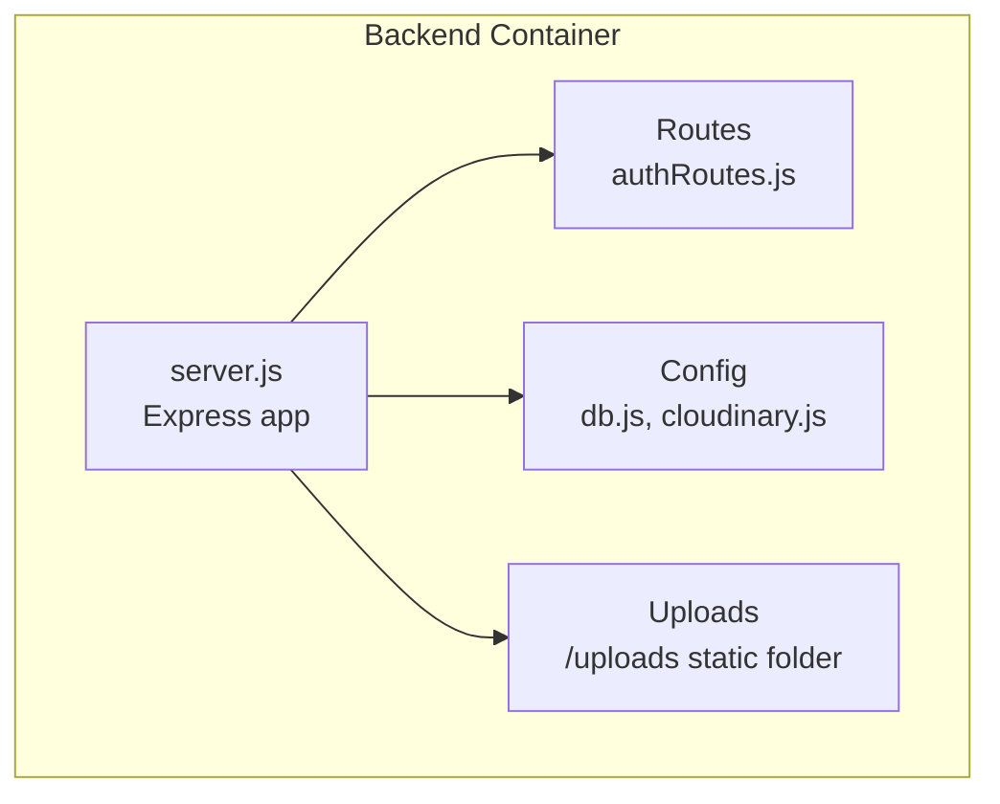
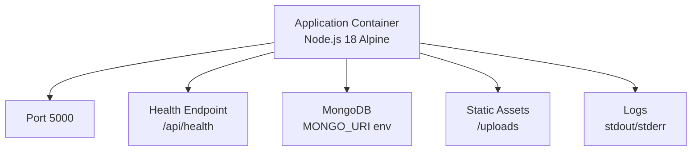
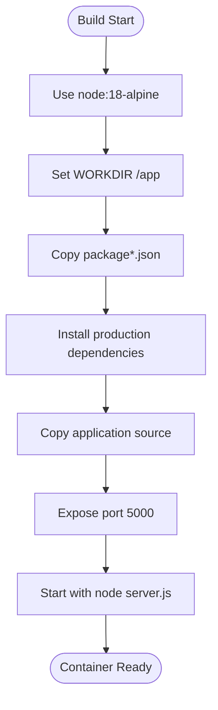
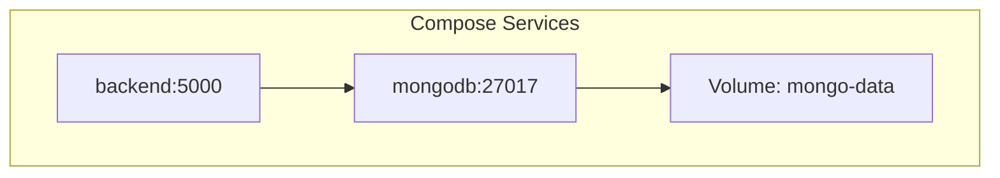
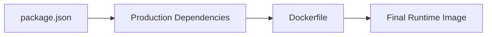

# Docker Containerization

<cite>
**Referenced Files in This Document**
- [Dockerfile](file://backend/Dockerfile)
- [Dockerfile.yaml](file://backend/Dockerfile.yaml)
- [server.js](file://backend/server.js)
- [db.js](file://backend/config/db.js)
- [cloudinary.js](file://backend/config/cloudinary.js)
- [railway.toml](file://backend/railway.toml)
- [nixpacks.toml](file://backend/nixpacks.toml)
- [.gitignore](file://backend/.gitignore)
- [package.json](file://backend/package.json)
- [authRoutes.js](file://backend/routes/authRoutes.js)
</cite>

## Table of Contents
1. [Introduction](#introduction)
2. [Project Structure](#project-structure)
3. [Core Components](#core-components)
4. [Architecture Overview](#architecture-overview)
5. [Detailed Component Analysis](#detailed-component-analysis)
6. [Dependency Analysis](#dependency-analysis)
7. [Performance Considerations](#performance-considerations)
8. [Troubleshooting Guide](#troubleshooting-guide)
9. [Conclusion](#conclusion)
10. [Appendices](#appendices)

## Introduction
This document provides comprehensive Docker deployment guidance for the E-commerce App backend. It covers multi-stage Dockerfile configuration, environment variable management, volume mounting for persistent data, network configuration, orchestration with Docker Compose (conceptual), health checks, logging, resource limits, image optimization, security best practices, registry integration, deployment commands, troubleshooting, performance monitoring, and scaling patterns. The backend service exposes a health endpoint and serves static uploads, while connecting to MongoDB via environment-driven configuration.

## Project Structure
The backend service is a Node.js/Express application with the following Docker-related artifacts:
- Production Dockerfile for minimal runtime image
- Development Dockerfile variant for local builds
- Nixpacks configuration for platform deployments
- Railway configuration for managed deployments
- Environment-driven configuration for database and Cloudinary
- Static uploads served under a dedicated route

**Diagram sources**
- [server.js:57-63](file://backend/server.js#L57-L63)
- [authRoutes.js:1-9](file://backend/routes/authRoutes.js#L1-L9)
- [db.js:1-14](file://backend/config/db.js#L1-L14)
- [cloudinary.js:1-13](file://backend/config/cloudinary.js#L1-L13)

**Section sources**
- [Dockerfile:1-18](file://backend/Dockerfile#L1-L18)
- [Dockerfile.yaml:1-18](file://backend/Dockerfile.yaml#L1-L18)
- [server.js:54-55](file://backend/server.js#L54-L55)
- [db.js:1-14](file://backend/config/db.js#L1-L14)
- [cloudinary.js:1-13](file://backend/config/cloudinary.js#L1-L13)

## Core Components
- Application container: Node.js 18 Alpine base image, production dependencies only, port 5000, health endpoint at /api/health
- Database connectivity: MongoDB URI from environment variable
- Asset serving: Static uploads directory mounted at /uploads
- Environment configuration: Dotenv loading for secrets and configuration
- Optional external asset storage: Cloudinary configured via environment variables

Key implementation references:
- Container startup and port exposure
  - [Dockerfile:14-18](file://backend/Dockerfile#L14-L18)
  - [Dockerfile.yaml:14-18](file://backend/Dockerfile.yaml#L14-L18)
  - [server.js:97-102](file://backend/server.js#L97-L102)
- Health endpoint
  - [server.js:65-73](file://backend/server.js#L65-L73)
- Database connection
  - [db.js:5-13](file://backend/config/db.js#L5-L13)
- Static uploads
  - [server.js:54-55](file://backend/server.js#L54-L55)
- Environment variables
  - [server.js:17](file://backend/server.js#L17)
  - [db.js:2-3](file://backend/config/db.js#L2-L3)
  - [cloudinary.js:4](file://backend/config/cloudinary.js#L4)

**Section sources**
- [Dockerfile:14-18](file://backend/Dockerfile#L14-L18)
- [Dockerfile.yaml:14-18](file://backend/Dockerfile.yaml#L14-L18)
- [server.js:65-73](file://backend/server.js#L65-L73)
- [server.js:97-102](file://backend/server.js#L97-L102)
- [db.js:5-13](file://backend/config/db.js#L5-L13)
- [cloudinary.js:6-11](file://backend/config/cloudinary.js#L6-L11)

## Architecture Overview
The backend container encapsulates the Express server, routes, and configuration modules. It connects to MongoDB using an environment variable and serves static assets from the uploads directory. The application listens on port 5000 and exposes a health endpoint for monitoring.

**Diagram sources**
- [Dockerfile:1-18](file://backend/Dockerfile#L1-L18)
- [server.js:65-73](file://backend/server.js#L65-L73)
- [server.js:97-102](file://backend/server.js#L97-L102)
- [db.js:7](file://backend/config/db.js#L7)
- [server.js:54-55](file://backend/server.js#L54-L55)

## Detailed Component Analysis

### Multi-Stage Dockerfile Configuration
- Base image: node:18-alpine for a small footprint
- Build optimization:
  - Copy package files first to leverage layer caching
  - Install production dependencies only for runtime image
  - Copy source code after dependency installation
- Port exposure and command:
  - EXPOSE 5000
  - CMD node server.js

**Diagram sources**
- [Dockerfile:1-18](file://backend/Dockerfile#L1-L18)

**Section sources**
- [Dockerfile:1-18](file://backend/Dockerfile#L1-L18)

### Environment Variable Configuration
- Database connection:
  - MONGO_URI is loaded via dotenv and passed to mongoose
  - Reference: [db.js:7](file://backend/config/db.js#L7)
- Application behavior:
  - PORT defaults to 5000 if not set
  - FRONTEND_URL influences CORS allowed origins
  - Reference: [server.js:17](file://backend/server.js#L17), [server.js:97](file://backend/server.js#L97)
- Cloudinary integration:
  - Cloud name, API key, and secret are read from environment variables
  - Reference: [cloudinary.js:6-11](file://backend/config/cloudinary.js#L6-L11)

Best practices:
- Store sensitive values in a .env file outside version control
- Use Docker secrets or orchestration secret stores for production
- Validate required environment variables at startup

**Section sources**
- [db.js:7](file://backend/config/db.js#L7)
- [server.js:17](file://backend/server.js#L17)
- [server.js:97](file://backend/server.js#L97)
- [cloudinary.js:6-11](file://backend/config/cloudinary.js#L6-L11)

### Volume Mounting for Persistent Data Storage
- Uploads directory:
  - The server serves static files from the uploads directory
  - Mount a host directory to /app/uploads to persist images across container restarts
  - Reference: [server.js:54-55](file://backend/server.js#L54-L55)
- MongoDB:
  - For local development, mount a persistent volume to the MongoDB container’s data directory
  - For production, use managed MongoDB or external volumes with backups

Note: The backend Dockerfile copies the uploads directory into the image. To persist uploads across runs, mount a volume at runtime.

**Section sources**
- [server.js:54-55](file://backend/server.js#L54-L55)

### Network Configuration and Communication
- Port binding:
  - Backend listens on port 5000; expose it when running the container
  - Reference: [Dockerfile:15](file://backend/Dockerfile#L15), [server.js:97](file://backend/server.js#L97)
- CORS:
  - Origins include localhost ports and a configurable FRONTEND_URL
  - Reference: [server.js:23-30](file://backend/server.js#L23-L30)
- Health endpoint:
  - Use GET /api/health for readiness/liveness checks
  - Reference: [server.js:65-73](file://backend/server.js#L65-L73)

**Section sources**
- [Dockerfile:15](file://backend/Dockerfile#L15)
- [server.js:23-30](file://backend/server.js#L23-L30)
- [server.js:65-73](file://backend/server.js#L65-L73)

### Docker Compose Orchestration (Conceptual)
While a docker-compose.yml is not present in the repository, here is a conceptual setup pattern for orchestrating the backend with MongoDB and optional Redis:

Implementation guidance:
- Define a backend service with environment variables for MONGO_URI and PORT
- Define a MongoDB service with a named volume for persistence
- Link services via a user-defined bridge network
- Add health checks and restart policies

[No sources needed since this diagram shows conceptual workflow, not actual code structure]

### Health Checks, Logging, and Resource Limits
- Health checks:
  - Use GET /api/health for liveness/readiness
  - Reference: [server.js:65-73](file://backend/server.js#L65-L73)
- Logging:
  - Application logs to stdout/stderr; capture with container logs
  - Reference: [server.js:98](file://backend/server.js#L98)
- Resource limits:
  - Set CPU and memory limits in compose or container runtime
  - Example: deploy.resources.limits for Compose or --memory/--cpus flags

[No sources needed since this section provides general guidance]

### Image Optimization Techniques
- Multi-stage builds:
  - Separate build and runtime stages to reduce final image size
- Layer caching:
  - Copy package files before source code
  - Reference: [Dockerfile:5-12](file://backend/Dockerfile#L5-L12)
- Minimal base image:
  - Use node:18-alpine
  - Reference: [Dockerfile:1](file://backend/Dockerfile#L1)
- Production-only dependencies:
  - Install with --production flag
  - Reference: [Dockerfile:9](file://backend/Dockerfile#L9)

**Section sources**
- [Dockerfile:5-12](file://backend/Dockerfile#L5-L12)
- [Dockerfile:9](file://backend/Dockerfile#L9)
- [Dockerfile:1](file://backend/Dockerfile#L1)

### Security Best Practices
- Secrets management:
  - Use environment variables or secret stores; avoid hardcoding in images
  - Reference: [db.js:7](file://backend/config/db.js#L7), [cloudinary.js:6-11](file://backend/config/cloudinary.js#L6-L11)
- Least privilege:
  - Run as a non-root user inside the container
  - Drop unnecessary capabilities
- Network policies:
  - Restrict inbound ports; only expose 5000
  - Reference: [Dockerfile:15](file://backend/Dockerfile#L15)
- Registry integration:
  - Push to a private registry with vulnerability scanning
  - Pin image digests for reproducibility

[No sources needed since this section provides general guidance]

### Registry Integration and Deployment Commands
- Build:
  - docker build -t ecommerce-backend .
- Tag:
  - docker tag ecommerce-backend:latest your-registry/backend:tag
- Push:
  - docker push your-registry/backend:tag
- Run:
  - docker run -d --name backend -p 5000:5000 \
    -e MONGO_URI=your-mongo-uri \
    -e FRONTEND_URL=https://your-frontend.example.com \
    -v /host/uploads:/app/uploads \
    ecommerce-backend:latest
- Verify:
  - curl http://localhost:5000/api/health

[No sources needed since this section provides general guidance]

### Step-by-Step Deployment Commands
1. Prepare environment variables:
   - MONGO_URI, FRONTEND_URL, CLOUDINARY_* (if used)
2. Build the image:
   - docker build -f backend/Dockerfile -t ecommerce-backend .
3. Run the container:
   - docker run -d --name backend -p 5000:5000 \
     -e MONGO_URI="$MONGO_URI" \
     -e FRONTEND_URL="$FRONTEND_URL" \
     -v "$PWD/backend/uploads:/app/uploads" \
     ecommerce-backend:latest
4. Validate health:
   - curl http://localhost:5000/api/health
5. View logs:
   - docker logs backend

**Section sources**
- [Dockerfile:14-18](file://backend/Dockerfile#L14-L18)
- [server.js:65-73](file://backend/server.js#L65-L73)

## Dependency Analysis
Runtime and build-time dependencies are declared in package.json. The Dockerfile installs production dependencies only for the runtime image.

**Diagram sources**
- [package.json:8-22](file://backend/package.json#L8-L22)
- [Dockerfile:9](file://backend/Dockerfile#L9)

**Section sources**
- [package.json:8-22](file://backend/package.json#L8-L22)
- [Dockerfile:9](file://backend/Dockerfile#L9)

## Performance Considerations
- Use production-grade Node.js flags and environment variables for performance tuning
- Monitor container resource usage and scale horizontally based on demand
- Enable keep-alive and optimize static asset delivery
- Use CDN for static assets if needed

[No sources needed since this section provides general guidance]

## Troubleshooting Guide
Common issues and resolutions:
- Database connection failures:
  - Verify MONGO_URI correctness and network accessibility
  - Reference: [db.js:7](file://backend/config/db.js#L7)
- CORS errors:
  - Ensure FRONTEND_URL matches the origin making requests
  - Reference: [server.js:23-30](file://backend/server.js#L23-L30)
- Health check failures:
  - Confirm port 5000 is mapped and the container is reachable
  - Reference: [Dockerfile:15](file://backend/Dockerfile#L15), [server.js:65-73](file://backend/server.js#L65-L73)
- Uploads not persisting:
  - Mount a volume to /app/uploads
  - Reference: [server.js:54-55](file://backend/server.js#L54-L55)
- Missing environment variables:
  - Ensure .env is loaded or passed via runtime
  - Reference: [server.js:17](file://backend/server.js#L17)

**Section sources**
- [db.js:7](file://backend/config/db.js#L7)
- [server.js:23-30](file://backend/server.js#L23-L30)
- [Dockerfile:15](file://backend/Dockerfile#L15)
- [server.js:65-73](file://backend/server.js#L65-L73)
- [server.js:54-55](file://backend/server.js#L54-L55)
- [server.js:17](file://backend/server.js#L17)

## Conclusion
The backend service is container-ready with a concise Dockerfile, environment-driven configuration, and a health endpoint. By applying the recommended practices—secrets management, volume mounting, health checks, and resource limits—you can deploy a secure, observable, and scalable containerized application. For orchestration, consider extending the setup with Docker Compose to manage MongoDB and optional Redis alongside the backend.

[No sources needed since this section summarizes without analyzing specific files]

## Appendices

### Appendix A: Platform Deployment Notes
- Nixpacks build configuration:
  - References: [nixpacks.toml:10](file://backend/nixpacks.toml#L10)
- Railway deployment configuration:
  - References: [railway.toml:4-7](file://backend/railway.toml#L4-L7)

**Section sources**
- [nixpacks.toml:10](file://backend/nixpacks.toml#L10)
- [railway.toml:4-7](file://backend/railway.toml#L4-L7)

### Appendix B: Route and Endpoint Reference
- Health check:
  - GET /api/health
  - Reference: [server.js:65-73](file://backend/server.js#L65-L73)
- Authentication routes:
  - POST /api/auth/register, POST /api/auth/login
  - Reference: [authRoutes.js:6-7](file://backend/routes/authRoutes.js#L6-L7)

**Section sources**
- [server.js:65-73](file://backend/server.js#L65-L73)
- [authRoutes.js:6-7](file://backend/routes/authRoutes.js#L6-L7)