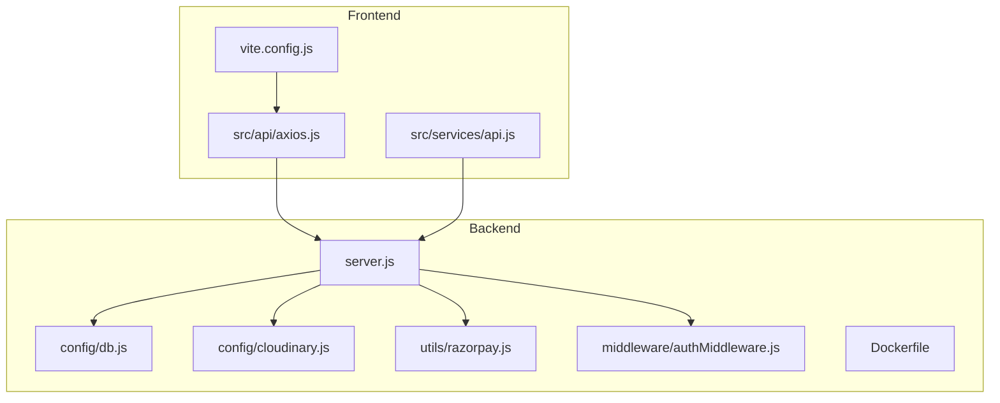
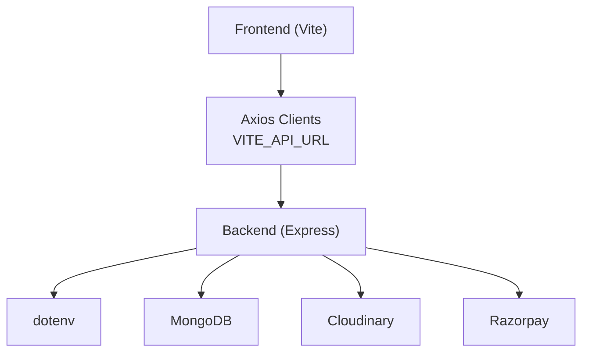
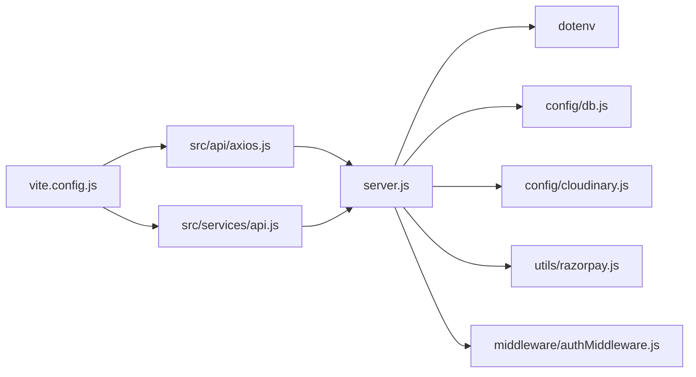

# Environment Configuration

<cite>
**Referenced Files in This Document**
- [server.js](file://backend/server.js)
- [db.js](file://backend/config/db.js)
- [cloudinary.js](file://backend/config/cloudinary.js)
- [razorpay.js](file://backend/utils/razorpay.js)
- [authMiddleware.js](file://backend/middleware/authMiddleware.js)
- [axios.js](file://frontend/src/api/axios.js)
- [api.js](file://frontend/src/services/api.js)
- [vite.config.js](file://frontend/vite.config.js)
- [Dockerfile](file://backend/Dockerfile)
- [package.json](file://backend/package.json)
- [package.json](file://frontend/package.json)
</cite>

## Table of Contents
1. [Introduction](#introduction)
2. [Project Structure](#project-structure)
3. [Core Components](#core-components)
4. [Architecture Overview](#architecture-overview)
5. [Detailed Component Analysis](#detailed-component-analysis)
6. [Dependency Analysis](#dependency-analysis)
7. [Performance Considerations](#performance-considerations)
8. [Troubleshooting Guide](#troubleshooting-guide)
9. [Conclusion](#conclusion)
10. [Appendices](#appendices)

## Introduction
This document provides comprehensive environment configuration guidance for the E-commerce App across development, staging, and production environments. It covers environment variable management, database connections, third-party API keys, service endpoints, CORS and security headers, feature flags, configuration validation, secret management, encryption strategies, logging and monitoring, configuration templates, naming conventions, deployment overrides, hot-reloading, environment switching, backups, troubleshooting, and best practices.

## Project Structure
The application consists of:
- Backend: Express server with environment-driven configuration via dotenv, MongoDB connectivity, Cloudinary, and Razorpay integrations.
- Frontend: React/Vite client using environment variables for API base URLs and authentication tokens.
- Deployment: Docker containerization for the backend; Vite dev server with proxy for local development.

**Diagram sources**
- [server.js:17-18](file://backend/server.js#L17-L18)
- [db.js:1-14](file://backend/config/db.js#L1-L14)
- [cloudinary.js:1-13](file://backend/config/cloudinary.js#L1-L13)
- [razorpay.js:1-10](file://backend/utils/razorpay.js#L1-L10)
- [authMiddleware.js:1-20](file://backend/middleware/authMiddleware.js#L1-L20)
- [axios.js:1-17](file://frontend/src/api/axios.js#L1-L17)
- [api.js:1-8](file://frontend/src/services/api.js#L1-L8)
- [vite.config.js:1-15](file://frontend/vite.config.js#L1-L15)
- [Dockerfile:1-18](file://backend/Dockerfile#L1-L18)

**Section sources**
- [server.js:17-18](file://backend/server.js#L17-L18)
- [package.json:1-27](file://backend/package.json#L1-L27)
- [package.json:1-25](file://frontend/package.json#L1-L25)
- [Dockerfile:1-18](file://backend/Dockerfile#L1-L18)

## Core Components
- Environment loading: dotenv is used in multiple modules to load environment variables at runtime.
- Database: MongoDB connection configured via MONGO_URI.
- Cloudinary: Media storage configured via CLOUDINARY_CLOUD_NAME, CLOUDINARY_API_KEY, CLOUDINARY_API_SECRET.
- Payments: Razorpay configured via RAZORPAY_KEY_ID and RAZORPAY_KEY_SECRET.
- Authentication: JWT verification using JWT_SECRET.
- CORS: Production-ready CORS configuration with dynamic allowed origins and credentials support.
- Frontend API base URL: Controlled via VITE_API_URL; defaults to localhost in development.

**Section sources**
- [server.js:17-18](file://backend/server.js#L17-L18)
- [db.js:1-14](file://backend/config/db.js#L1-L14)
- [cloudinary.js:1-13](file://backend/config/cloudinary.js#L1-L13)
- [razorpay.js:1-10](file://backend/utils/razorpay.js#L1-L10)
- [authMiddleware.js:1-20](file://backend/middleware/authMiddleware.js#L1-L20)
- [axios.js:1-17](file://frontend/src/api/axios.js#L1-L17)
- [api.js:1-8](file://frontend/src/services/api.js#L1-L8)

## Architecture Overview
The environment configuration architecture integrates backend and frontend components with external services and deployment targets.

**Diagram sources**
- [axios.js:1-17](file://frontend/src/api/axios.js#L1-L17)
- [api.js:1-8](file://frontend/src/services/api.js#L1-L8)
- [server.js:17-18](file://backend/server.js#L17-L18)
- [db.js:1-14](file://backend/config/db.js#L1-L14)
- [cloudinary.js:1-13](file://backend/config/cloudinary.js#L1-L13)
- [razorpay.js:1-10](file://backend/utils/razorpay.js#L1-L10)

## Detailed Component Analysis

### Environment Variable Management
- Backend loads environment variables centrally and per-module:
  - Global load via dotenv in server.js and db.js.
  - Module-specific loads for Cloudinary and Razorpay.
- Frontend uses Vite’s import.meta.env for environment variables, with VITE_API_URL controlling the backend base URL.

Recommended naming conventions:
- MONGO_URI: Database connection string
- JWT_SECRET: Secret for JWT signing
- CLOUDINARY_CLOUD_NAME, CLOUDINARY_API_KEY, CLOUDINARY_API_SECRET: Cloudinary credentials
- RAZORPAY_KEY_ID, RAZORPAY_KEY_SECRET: Payment provider credentials
- FRONTEND_URL: Dynamic CORS origin override
- PORT: Server port (default 5000)

Validation checklist:
- Ensure all required variables are present before startup.
- Validate database URI format and connectivity.
- Verify JWT secret length and entropy.
- Confirm payment provider keys are set and active.

Secret management and encryption:
- Store secrets in environment variables or platform-managed secret stores.
- Encrypt at rest using platform capabilities (e.g., Docker secrets, CI/CD secret managers).
- Rotate regularly and revoke compromised keys immediately.

Feature flags:
- Use environment variables to toggle features (e.g., ENABLE_DEBUG=true).
- Gate feature logic behind environment checks.

Configuration templates:
- Development (.env.development): Minimal variables; local MongoDB and payment test keys.
- Staging (.env.staging): Separate DB; production-like Cloudinary and payment keys.
- Production (.env.production): Strict secrets; hardened CORS and security headers.

Deployment-specific overrides:
- Docker: Set environment variables via docker run -e or compose env vars.
- Vercel/Railway: Use platform dashboards to set environment variables.
- Kubernetes: Use ConfigMaps and Secrets.

Hot-reloading and environment switching:
- Backend: Restart the process after changing environment variables.
- Frontend: Rebuild Vite app when changing VITE_* variables.
- For dynamic toggles, implement feature flags that can be re-evaluated without restart.

Configuration backup:
- Maintain encrypted backups of environment variables in secret storage.
- Version control only non-sensitive templates (.env.*.example), not actual secrets.

**Section sources**
- [server.js:17-18](file://backend/server.js#L17-L18)
- [db.js:1-14](file://backend/config/db.js#L1-L14)
- [cloudinary.js:1-13](file://backend/config/cloudinary.js#L1-L13)
- [razorpay.js:1-10](file://backend/utils/razorpay.js#L1-L10)
- [axios.js:1-17](file://frontend/src/api/axios.js#L1-L17)
- [api.js:1-8](file://frontend/src/services/api.js#L1-L8)
- [Dockerfile:1-18](file://backend/Dockerfile#L1-L18)

### Database Connections
- MongoDB connection string is loaded via MONGO_URI.
- Connection is established early in server startup.

Environment-specific considerations:
- Development: Local MongoDB or a lightweight hosted option.
- Staging: Dedicated staging cluster with read replicas.
- Production: Replica set or sharded cluster with TLS and authentication.

Health checks:
- Use the /api/health endpoint to verify connectivity and runtime status.

**Section sources**
- [db.js:1-14](file://backend/config/db.js#L1-L14)
- [server.js:66-73](file://backend/server.js#L66-L73)

### Third-Party Integrations
- Cloudinary: Configured via dedicated module using environment variables for cloud name, API key, and API secret.
- Razorpay: Initialized with key ID and key secret for payment processing.

Environment-specific considerations:
- Use test keys in development and staging; live keys in production.
- Enable secure media delivery and signed URLs where applicable.

**Section sources**
- [cloudinary.js:1-13](file://backend/config/cloudinary.js#L1-L13)
- [razorpay.js:1-10](file://backend/utils/razorpay.js#L1-L10)

### Authentication and Security Headers
- JWT verification uses JWT_SECRET.
- CORS configuration supports credentials, specific methods, and headers, with dynamic allowed origins.

Security hardening:
- Restrict allowed origins to known frontend domains.
- Enforce HTTPS in production.
- Add HSTS, CSP, and other security headers at the reverse proxy or middleware level if needed.

**Section sources**
- [authMiddleware.js:1-20](file://backend/middleware/authMiddleware.js#L1-L20)
- [server.js:22-49](file://backend/server.js#L22-L49)

### Frontend API Base URL
- The frontend constructs API base URLs using VITE_API_URL with a sensible fallback for development.
- Proxy configuration in Vite simplifies local development by routing /api requests to the backend.

Environment-specific considerations:
- Point VITE_API_URL to the appropriate backend domain per environment.
- Ensure CORS allows the frontend origin in each environment.

**Section sources**
- [axios.js:1-17](file://frontend/src/api/axios.js#L1-L17)
- [api.js:1-8](file://frontend/src/services/api.js#L1-L8)
- [vite.config.js:1-15](file://frontend/vite.config.js#L1-L15)

### Logging, Error Reporting, and Monitoring
- Basic console logging is used for errors in the error handling middleware.
- Recommended enhancements:
  - Use structured logging libraries (e.g., Winston) with environment-specific log levels.
  - Integrate with error reporting services (e.g., Sentry) and APM tools (e.g., DataDog).
  - Configure metrics collection for latency, error rates, and throughput.

Environment-specific levels:
- Development: verbose logs for debugging.
- Staging: info with selective debug.
- Production: warn/error with sampling.

**Section sources**
- [server.js:91-95](file://backend/server.js#L91-L95)

## Dependency Analysis
The backend depends on dotenv for environment variables, and several modules independently load configuration. The frontend depends on Vite’s environment injection.

**Diagram sources**
- [server.js:17-18](file://backend/server.js#L17-L18)
- [db.js:1-14](file://backend/config/db.js#L1-L14)
- [cloudinary.js:1-13](file://backend/config/cloudinary.js#L1-L13)
- [razorpay.js:1-10](file://backend/utils/razorpay.js#L1-L10)
- [authMiddleware.js:1-20](file://backend/middleware/authMiddleware.js#L1-L20)
- [axios.js:1-17](file://frontend/src/api/axios.js#L1-L17)
- [api.js:1-8](file://frontend/src/services/api.js#L1-L8)
- [vite.config.js:1-15](file://frontend/vite.config.js#L1-L15)

**Section sources**
- [package.json:1-27](file://backend/package.json#L1-L27)
- [package.json:1-25](file://frontend/package.json#L1-L25)

## Performance Considerations
- Centralize environment loading to avoid redundant dotenv calls.
- Cache parsed configuration values where safe and appropriate.
- Use connection pooling for MongoDB and external APIs.
- Monitor and alert on configuration drift or missing variables.

## Troubleshooting Guide
Common environment-related issues and resolutions:
- CORS errors:
  - Ensure FRONTEND_URL is set and included in allowed origins.
  - Verify credentials and exposed headers match frontend requests.
- Database connection failures:
  - Validate MONGO_URI format and network accessibility.
  - Check replica set configuration and authentication in production.
- Missing environment variables:
  - Confirm dotenv is loaded before accessing process.env.
  - Use explicit validation and graceful shutdown if required variables are absent.
- Payment provider errors:
  - Verify RAZORPAY_KEY_ID and RAZORPAY_KEY_SECRET are set and valid.
  - Use test keys in development and live keys in production.
- Frontend API timeouts:
  - Confirm VITE_API_URL points to the correct backend host and port.
  - Check Vite proxy configuration for local development.

**Section sources**
- [server.js:22-49](file://backend/server.js#L22-L49)
- [db.js:1-14](file://backend/config/db.js#L1-L14)
- [razorpay.js:1-10](file://backend/utils/razorpay.js#L1-L10)
- [axios.js:1-17](file://frontend/src/api/axios.js#L1-L17)
- [api.js:1-8](file://frontend/src/services/api.js#L1-L8)

## Conclusion
By adopting strict environment variable management, robust secret storage, environment-specific templates, and clear validation and monitoring practices, the E-commerce App can operate securely and reliably across development, staging, and production environments. Implement the recommended practices to minimize misconfiguration risks and streamline deployment workflows.

## Appendices

### Environment Variable Reference
- MONGO_URI: MongoDB connection string
- JWT_SECRET: Secret key for JWT verification
- CLOUDINARY_CLOUD_NAME: Cloudinary cloud name
- CLOUDINARY_API_KEY: Cloudinary API key
- CLOUDINARY_API_SECRET: Cloudinary API secret
- RAZORPAY_KEY_ID: Razorpay key identifier
- RAZORPAY_KEY_SECRET: Razorpay key secret
- FRONTEND_URL: Allowed CORS origin
- PORT: Server port (default 5000)
- VITE_API_URL: Backend API base URL for the frontend

### Naming Conventions
- Use UPPERCASE with underscores for environment variables.
- Prefix provider-specific variables (e.g., CLOUDINARY_*, RAZORPAY_*).
- Keep sensitive variables out of version control.

### Configuration Templates
- Development template: Local database, test payment keys, minimal CORS.
- Staging template: Isolated database, production-like keys, restricted CORS.
- Production template: Hardened security, strict CORS, encrypted secrets.

### Deployment Overrides
- Docker: Pass environment variables via -e or docker-compose env vars.
- Vercel/Railway: Set variables in platform dashboards.
- Kubernetes: Use ConfigMaps for non-secret values and Secrets for sensitive data.

### Hot-Reloading and Backups
- Hot-reloading: Restart backend processes and rebuild frontend after changing environment variables.
- Backups: Maintain encrypted backups of secrets in secure storage; keep non-sensitive templates under version control.