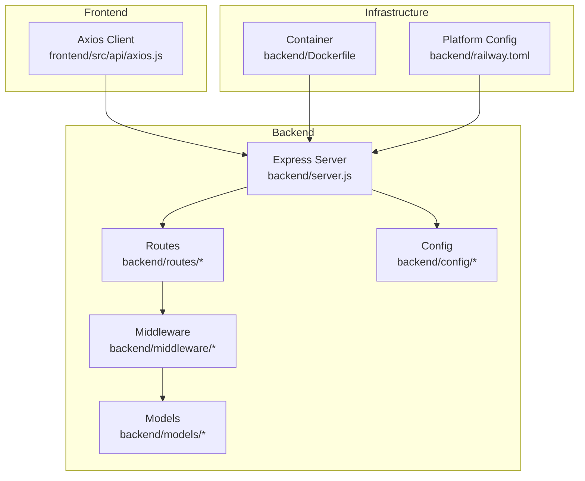
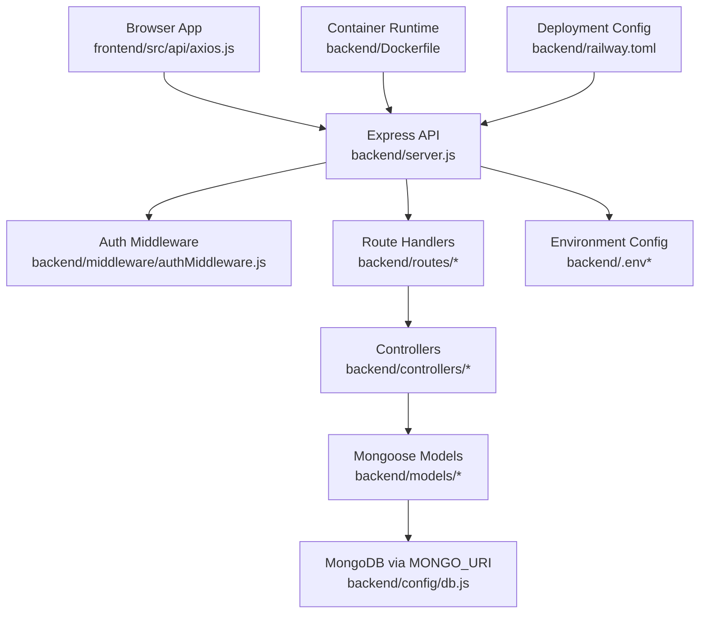
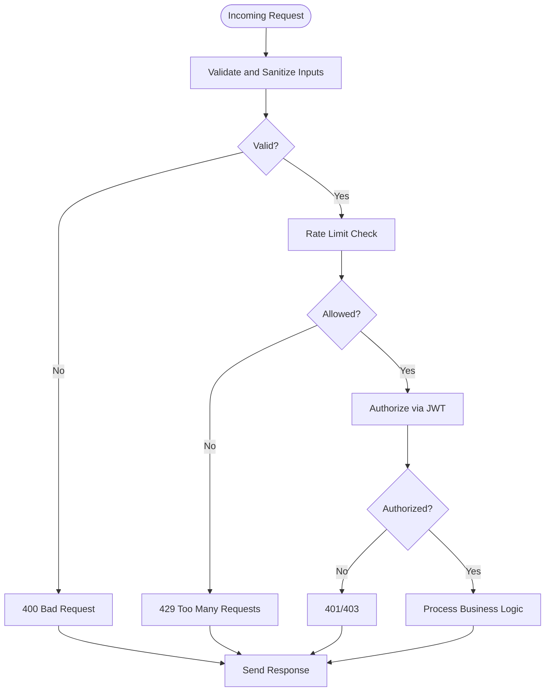
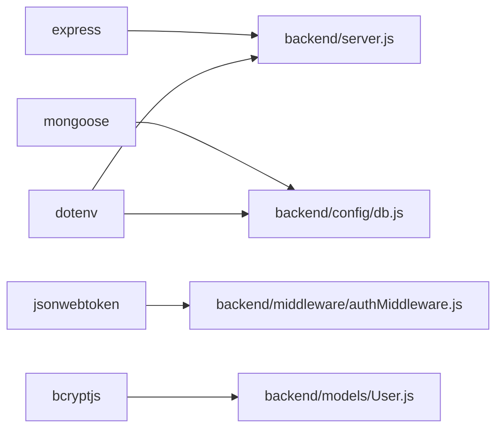

# Production Security & Monitoring

<cite>
**Referenced Files in This Document**
- [server.js](file://backend/server.js)
- [db.js](file://backend/config/db.js)
- [authMiddleware.js](file://backend/middleware/authMiddleware.js)
- [authController.js](file://backend/controllers/authController.js)
- [authRoutes.js](file://backend/routes/authRoutes.js)
- [User.js](file://backend/models/User.js)
- [axios.js](file://frontend/src/api/axios.js)
- [Dockerfile](file://backend/Dockerfile)
- [railway.toml](file://backend/railway.toml)
- [.gitignore](file://backend/.gitignore)
- [package.json](file://backend/package.json)
</cite>

## Table of Contents
1. [Introduction](#introduction)
2. [Project Structure](#project-structure)
3. [Core Components](#core-components)
4. [Architecture Overview](#architecture-overview)
5. [Detailed Component Analysis](#detailed-component-analysis)
6. [Dependency Analysis](#dependency-analysis)
7. [Performance Considerations](#performance-considerations)
8. [Troubleshooting Guide](#troubleshooting-guide)
9. [Conclusion](#conclusion)
10. [Appendices](#appendices)

## Introduction
This document provides production-grade security and monitoring guidance for the E-commerce App. It focuses on securing the backend API, protecting user data, enforcing HTTPS and secure headers, hardening database connections, implementing robust authentication and authorization, adding rate limiting and DDoS protections, establishing monitoring and logging, and preparing incident response and compliance strategies. Where applicable, this guide references actual implementation points in the codebase and highlights areas requiring explicit production hardening.

## Project Structure
The application follows a clear separation of concerns:
- Backend: Express server, routes, controllers, middleware, models, and configuration
- Frontend: React client using Vite, with Axios for API communication
- Deployment: Docker containerization and platform configuration for hosting

**Diagram sources**
- [server.js:1-102](file://backend/server.js#L1-L102)
- [axios.js:1-17](file://frontend/src/api/axios.js#L1-L17)
- [Dockerfile:1-18](file://backend/Dockerfile#L1-L18)
- [railway.toml:1-7](file://backend/railway.toml#L1-L7)

**Section sources**
- [server.js:1-102](file://backend/server.js#L1-L102)
- [axios.js:1-17](file://frontend/src/api/axios.js#L1-L17)
- [Dockerfile:1-18](file://backend/Dockerfile#L1-L18)
- [railway.toml:1-7](file://backend/railway.toml#L1-L7)

## Core Components
- Express server initializes environment, connects to the database, applies CORS, JSON parsing, static asset serving, routes, health checks, and centralized error handling.
- Authentication middleware enforces JWT-based authorization and admin-only access control.
- User model implements password hashing and comparison.
- Frontend Axios client injects Authorization headers and handles 401 responses.

Security-relevant observations:
- CORS is configured with allow-listed origins and credentials support.
- No explicit HTTPS enforcement or security headers are applied in the server.
- Database connection uses environment variables without TLS options.
- Rate limiting, input validation, and DDoS protections are not present.
- Logging is basic and does not include structured audit trails.

**Section sources**
- [server.js:1-102](file://backend/server.js#L1-L102)
- [authMiddleware.js:1-20](file://backend/middleware/authMiddleware.js#L1-L20)
- [User.js:1-20](file://backend/models/User.js#L1-L20)
- [axios.js:1-17](file://frontend/src/api/axios.js#L1-L17)

## Architecture Overview
The runtime architecture integrates the frontend and backend with environment-driven configuration and deployment orchestration.

**Diagram sources**
- [server.js:1-102](file://backend/server.js#L1-L102)
- [authMiddleware.js:1-20](file://backend/middleware/authMiddleware.js#L1-L20)
- [authRoutes.js:1-9](file://backend/routes/authRoutes.js#L1-L9)
- [authController.js:1-27](file://backend/controllers/authController.js#L1-L27)
- [User.js:1-20](file://backend/models/User.js#L1-L20)
- [db.js:1-14](file://backend/config/db.js#L1-L14)
- [Dockerfile:1-18](file://backend/Dockerfile#L1-L18)
- [railway.toml:1-7](file://backend/railway.toml#L1-L7)

## Detailed Component Analysis

### SSL/TLS Certificate Configuration and HTTPS Enforcement
Current state:
- The server listens on HTTP without explicit HTTPS configuration.
- No HSTS, CSP, or other security headers are set.
- Frontend base URL is configurable via environment variables.

Recommendations:
- Enforce HTTPS at the platform/proxy level (e.g., Vercel Edge Functions or CDN) and redirect HTTP to HTTPS.
- Configure SSL/TLS certificates through the hosting provider or a managed certificate service.
- Add security headers (Strict-Transport-Security, Content-Security-Policy, X-Frame-Options, X-Content-Type-Options, Referrer-Policy) in the Express server.
- Ensure all cookies are marked Secure and SameSite where applicable.

Production hardening checklist:
- Verify HTTPS termination at ingress/proxy.
- Confirm certificate chain and expiration monitoring.
- Implement automatic certificate renewal and rotation.
- Add HSTS header with preload considerations after stabilization.

**Section sources**
- [server.js:97-102](file://backend/server.js#L97-L102)
- [axios.js:1-17](file://frontend/src/api/axios.js#L1-L17)

### HTTPS Enforcement and Security Headers Implementation
Current state:
- No explicit HTTPS enforcement or security headers in the Express server.

Recommended implementation pattern:
- Use a reverse proxy or CDN to enforce HTTPS and terminate TLS.
- Apply security headers centrally in the Express server for all routes.
- Ensure headers are consistently applied to both API and static assets.

Example header categories:
- Strict-Transport-Security: enforce HTTPS
- Content-Security-Policy: restrict script/style sources
- X-Frame-Options: prevent clickjacking
- X-Content-Type-Options: prevent MIME sniffing
- Referrer-Policy: control referrer leakage
- Permissions-Policy: limit device features

**Section sources**
- [server.js:22-49](file://backend/server.js#L22-L49)

### Production Database Security (Connection Encryption, Backup, Access Controls)
Current state:
- Database connection uses MONGO_URI without TLS options.
- Backups and access control policies are not implemented in the codebase.

Recommendations:
- Enable TLS for MongoDB connections using driver options.
- Store MONGO_URI with TLS parameters and require strong authentication.
- Implement network-level access restrictions (VPC/firewall rules).
- Use database user roles with least privilege and audit logs.
- Automate encrypted backups with retention policies and regular restore tests.
- Monitor connection attempts and suspicious activity.

**Section sources**
- [db.js:1-14](file://backend/config/db.js#L1-L14)

### Application Security Measures (Input Validation, Rate Limiting, DDoS Protection)
Current state:
- Minimal input validation in controllers; no rate limiting or DDoS protections.
- Authentication middleware verifies JWT but does not enforce rate limits.

Recommendations:
- Add input validation and sanitization libraries at the route/controller boundary.
- Implement rate limiting per IP and per token with sliding windows.
- Integrate DDoS protections via CDN/WAF or platform-level rate limiting.
- Add circuit breakers and timeouts for upstream integrations.
- Log and alert on anomalous request patterns.

**Diagram sources**
- [authController.js:1-27](file://backend/controllers/authController.js#L1-L27)
- [authMiddleware.js:1-20](file://backend/middleware/authMiddleware.js#L1-L20)

**Section sources**
- [authController.js:1-27](file://backend/controllers/authController.js#L1-L27)
- [authMiddleware.js:1-20](file://backend/middleware/authMiddleware.js#L1-L20)

### Monitoring Setup (Metrics, Error Tracking, Uptime)
Current state:
- Basic health endpoint exists; no structured metrics or error tracking.

Recommendations:
- Add Prometheus-compatible metrics endpoint for latency, throughput, error rates.
- Integrate application performance monitoring (APM) for error tracking and tracing.
- Set up uptime monitoring with synthetic checks and real-user monitoring.
- Centralize logs with structured JSON and forward to a log aggregation platform.
- Alert on latency SLO breaches, error spikes, and security events.

**Section sources**
- [server.js:65-89](file://backend/server.js#L65-L89)

### Logging Configuration, Log Aggregation, Security Audit Trails
Current state:
- Console logging for DB errors and server startup.
- No structured audit logs for authentication, admin actions, or sensitive operations.

Recommendations:
- Switch to structured logging with Bunyan/Pino and include correlation IDs.
- Forward logs to a centralized system (e.g., ELK, Cloud Logging).
- Implement audit trails for login, registration, admin actions, payment attempts, and data access.
- Retain logs per policy and encrypt at rest and in transit.

**Section sources**
- [server.js:91-95](file://backend/server.js#L91-L95)
- [db.js:1-14](file://backend/config/db.js#L1-L14)

### Incident Response Procedures, Vulnerability Scanning, Compliance
Current state:
- No incident response playbook or vulnerability scanning pipeline visible in the codebase.

Recommendations:
- Define incident response roles, escalation paths, and playbooks.
- Integrate automated dependency scanning and SCA tools.
- Perform periodic penetration testing and maintain a bug bounty program.
- Align with compliance frameworks (e.g., GDPR) with data protection impact assessments and privacy notices.
- Establish change management and security reviews for deployments.

[No sources needed since this section provides general guidance]

### Firewall Configuration, Network Security, Cloud Provider Features
Current state:
- No explicit firewall or network security configuration in the codebase.

Recommendations:
- Restrict inbound ports to necessary ones only (e.g., 443 for HTTPS).
- Use private subnets and NAT gateways for outbound traffic.
- Enable WAF/CDN protections and DDoS mitigation at the cloud provider level.
- Use managed secrets stores for tokens and rotate regularly.
- Enable VPC flow logs and integrate with SIEM for threat detection.

**Section sources**
- [Dockerfile:1-18](file://backend/Dockerfile#L1-L18)
- [railway.toml:1-7](file://backend/railway.toml#L1-L7)

### Security Checklists, Penetration Testing, Update Management
Current state:
- No documented security checklists or update management process.

Recommendations:
- Maintain a pre-deployment security checklist covering secrets, headers, rate limits, and backups.
- Automate dependency updates and security patches with PRs and approvals.
- Schedule quarterly penetration tests and annual compliance audits.
- Maintain an inventory of third-party libraries and monitor advisories.

**Section sources**
- [package.json:1-27](file://backend/package.json#L1-L27)

### GDPR Compliance, Data Protection, Privacy
Current state:
- Password hashing is implemented; no explicit privacy controls or data subject request handling.

Recommendations:
- Implement data minimization and purpose limitation for collected fields.
- Add user rights mechanisms (access, rectification, erasure, data portability).
- Encrypt personal data at rest and in transit; apply pseudonymization where feasible.
- Maintain records of processing activities and data retention schedules.
- Provide transparent privacy notices and obtain lawfully compliant consent.

**Section sources**
- [User.js:1-20](file://backend/models/User.js#L1-L20)

## Dependency Analysis
Key runtime dependencies and their security implications:
- Express: web framework; ensure latest patch versions to mitigate known vulnerabilities.
- Mongoose: ODM; enable TLS connections and review connection options.
- bcryptjs/jsonwebtoken: cryptography primitives; keep updated and use secure defaults.
- dotenv: environment loading; restrict permissions on .env files and avoid committing secrets.

**Diagram sources**
- [package.json:8-22](file://backend/package.json#L8-L22)
- [server.js:1-102](file://backend/server.js#L1-L102)
- [db.js:1-14](file://backend/config/db.js#L1-L14)
- [authMiddleware.js:1-20](file://backend/middleware/authMiddleware.js#L1-L20)
- [User.js:1-20](file://backend/models/User.js#L1-L20)

**Section sources**
- [package.json:1-27](file://backend/package.json#L1-L27)

## Performance Considerations
- Implement request timeouts and circuit breakers for external integrations.
- Use connection pooling and optimize database queries.
- Cache safe-to-cache data with appropriate invalidation.
- Monitor memory usage and garbage collection in containerized environments.

[No sources needed since this section provides general guidance]

## Troubleshooting Guide
Common production issues and mitigations:
- CORS errors: Verify allowed origins and credentials configuration.
- 401 Unauthorized: Check JWT presence, signature, and expiration.
- Database connection failures: Validate MONGO_URI, TLS options, and network ACLs.
- Health check failures: Confirm platform healthcheck path and timeout settings.

**Section sources**
- [server.js:22-49](file://backend/server.js#L22-L49)
- [authMiddleware.js:1-20](file://backend/middleware/authMiddleware.js#L1-L20)
- [db.js:1-14](file://backend/config/db.js#L1-L14)
- [railway.toml:1-7](file://backend/railway.toml#L1-L7)

## Conclusion
The E-commerce App demonstrates foundational security practices such as JWT-based authentication and password hashing. To operate securely in production, the system requires HTTPS enforcement, comprehensive security headers, robust rate limiting, DDoS protections, hardened database connectivity, structured logging and monitoring, and adherence to compliance frameworks. Implementing the recommendations above will significantly strengthen the application’s resilience and operational hygiene.

[No sources needed since this section summarizes without analyzing specific files]

## Appendices

### Appendix A: Environment Variables and Secrets Management
- Ensure MONGO_URI includes TLS parameters and strong credentials.
- Store JWT_SECRET and other secrets in a managed secrets store.
- Restrict .env file permissions and exclude from version control.

**Section sources**
- [db.js:1-14](file://backend/config/db.js#L1-L14)
- [.gitignore:1-9](file://backend/.gitignore#L1-L9)