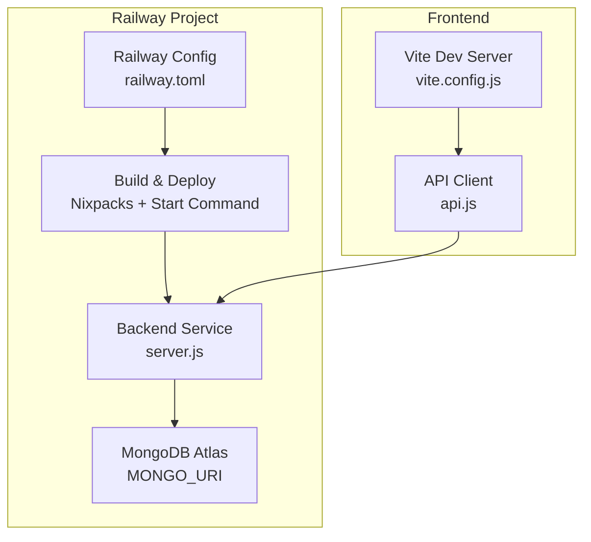
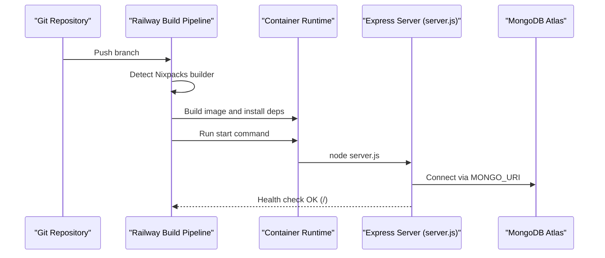
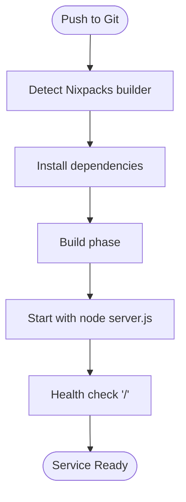
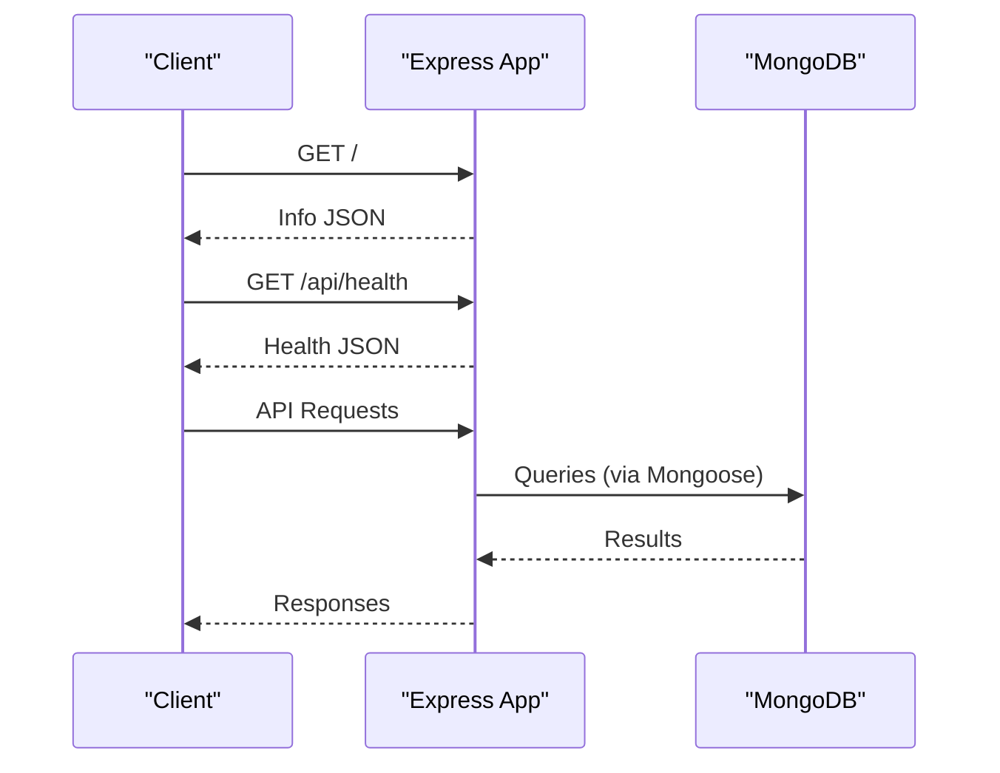
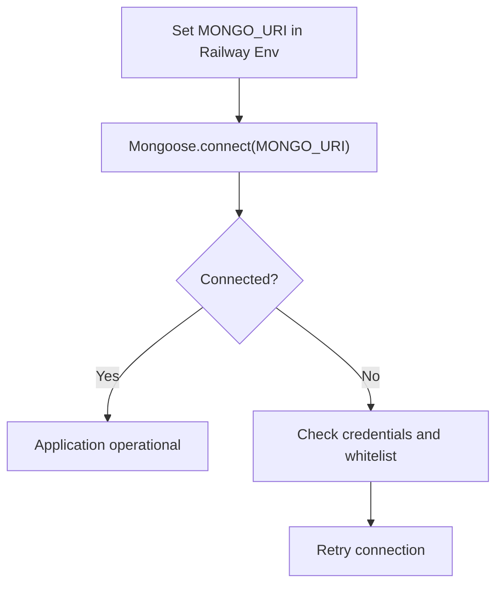
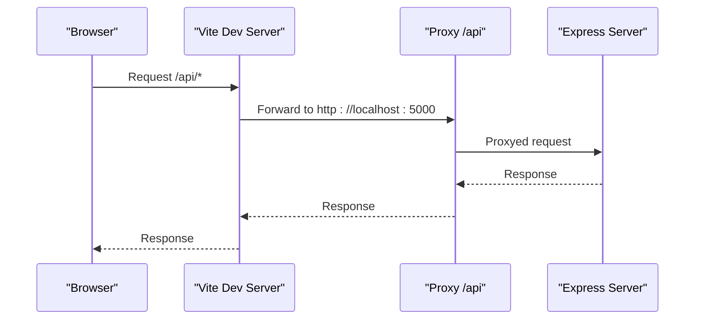
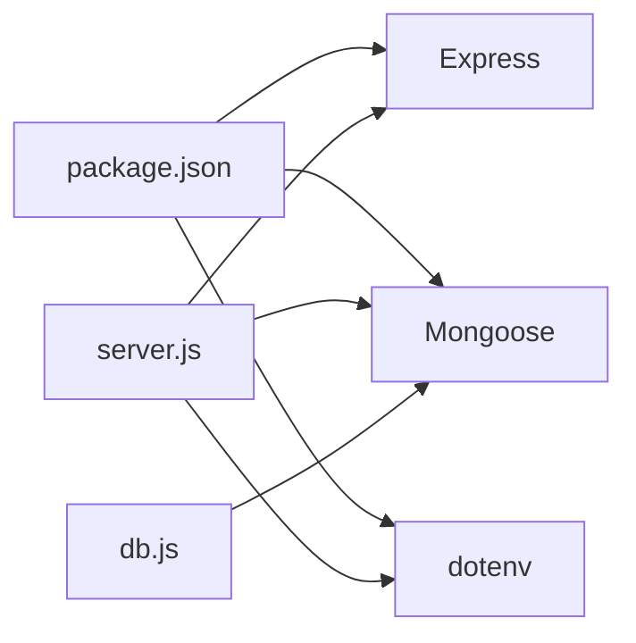
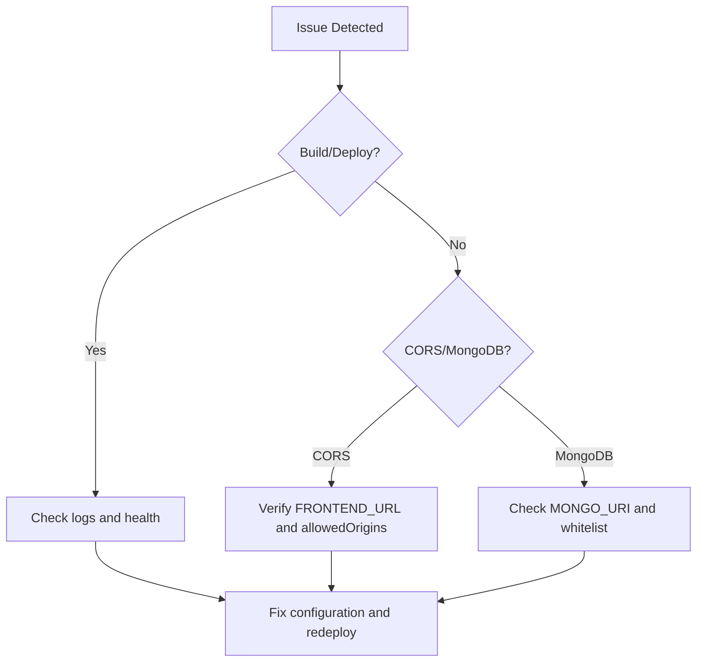

# Railway Platform Deployment

<cite>
**Referenced Files in This Document**
- [railway.toml](file://backend/railway.toml)
- [Dockerfile](file://backend/Dockerfile)
- [Dockerfile.yaml](file://backend/Dockerfile.yaml)
- [nixpacks.toml](file://backend/nixpacks.toml)
- [package.json](file://backend/package.json)
- [server.js](file://backend/server.js)
- [db.js](file://backend/config/db.js)
- [test-mongo.js](file://backend/test-mongo.js)
- [api.js](file://frontend/src/services/api.js)
- [vite.config.js](file://frontend/vite.config.js)
- [createAdmin.js](file://backend/createAdmin.js)
</cite>

## Table of Contents
1. [Introduction](#introduction)
2. [Project Structure](#project-structure)
3. [Core Components](#core-components)
4. [Architecture Overview](#architecture-overview)
5. [Detailed Component Analysis](#detailed-component-analysis)
6. [Dependency Analysis](#dependency-analysis)
7. [Performance Considerations](#performance-considerations)
8. [Troubleshooting Guide](#troubleshooting-guide)
9. [Conclusion](#conclusion)
10. [Appendices](#appendices)

## Introduction
This document provides end-to-end Railway platform deployment guidance for the E-commerce App. It covers the Railway configuration, build and deploy settings, environment variables, database connectivity with MongoDB Atlas, monitoring and logging, domain and SSL configuration, scaling, rollbacks, and troubleshooting. The backend is Node.js/Express with MongoDB via Mongoose, and the frontend is a React/Vite application.

## Project Structure
The deployment spans three primary areas:
- Backend service (Node.js/Express) configured for Railway using Nixpacks builder and a health check endpoint
- MongoDB Atlas for persistent data storage
- Frontend (React/Vite) served via a hosting provider (as referenced by CORS origins)

**Diagram sources**
- [railway.toml:1-7](file://backend/railway.toml#L1-L7)
- [nixpacks.toml:1-11](file://backend/nixpacks.toml#L1-L11)
- [server.js:1-102](file://backend/server.js#L1-L102)
- [db.js:1-14](file://backend/config/db.js#L1-L14)
- [vite.config.js:1-15](file://frontend/vite.config.js#L1-L15)
- [api.js:1-8](file://frontend/src/services/api.js#L1-L8)

**Section sources**
- [railway.toml:1-7](file://backend/railway.toml#L1-L7)
- [nixpacks.toml:1-11](file://backend/nixpacks.toml#L1-L11)
- [server.js:1-102](file://backend/server.js#L1-L102)
- [db.js:1-14](file://backend/config/db.js#L1-L14)
- [vite.config.js:1-15](file://frontend/vite.config.js#L1-L15)
- [api.js:1-8](file://frontend/src/services/api.js#L1-L8)

## Core Components
- Railway configuration defines the Nixpacks builder and start command, enabling automated builds and health checks.
- Backend startup script and Express server handle environment loading, CORS configuration, static asset serving, API routes, and health endpoints.
- Database connectivity uses Mongoose with a URI from environment variables.
- Frontend communicates with the backend API using a base URL from environment variables.

Key deployment artifacts:
- Build and start: [railway.toml:1-7](file://backend/railway.toml#L1-L7), [nixpacks.toml:1-11](file://backend/nixpacks.toml#L1-L11), [package.json:1-27](file://backend/package.json#L1-L27)
- Runtime entrypoint: [server.js:1-102](file://backend/server.js#L1-L102)
- Database connection: [db.js:1-14](file://backend/config/db.js#L1-L14)
- Frontend API client: [api.js:1-8](file://frontend/src/services/api.js#L1-L8)

**Section sources**
- [railway.toml:1-7](file://backend/railway.toml#L1-L7)
- [nixpacks.toml:1-11](file://backend/nixpacks.toml#L1-L11)
- [package.json:1-27](file://backend/package.json#L1-L27)
- [server.js:1-102](file://backend/server.js#L1-L102)
- [db.js:1-14](file://backend/config/db.js#L1-L14)
- [api.js:1-8](file://frontend/src/services/api.js#L1-L8)

## Architecture Overview
The Railway deployment pipeline builds the backend using Nixpacks, starts the Node.js server, and exposes a health check endpoint. The frontend consumes the backend API through a configured base URL.

**Diagram sources**
- [railway.toml:1-7](file://backend/railway.toml#L1-L7)
- [nixpacks.toml:1-11](file://backend/nixpacks.toml#L1-L11)
- [server.js:1-102](file://backend/server.js#L1-L102)
- [db.js:1-14](file://backend/config/db.js#L1-L14)

## Detailed Component Analysis

### Railway Configuration and Build Pipeline
- Builder: Nixpacks
- Start command: node server.js
- Health check: root path with a 100-second timeout
- Port exposure: 5000 (from Dockerfile and server defaults)

**Diagram sources**
- [railway.toml:1-7](file://backend/railway.toml#L1-L7)
- [nixpacks.toml:1-11](file://backend/nixpacks.toml#L1-L11)
- [server.js:65-73](file://backend/server.js#L65-L73)

**Section sources**
- [railway.toml:1-7](file://backend/railway.toml#L1-L7)
- [nixpacks.toml:1-11](file://backend/nixpacks.toml#L1-L11)
- [server.js:65-73](file://backend/server.js#L65-L73)

### Backend Startup and Routing
- Loads environment variables and connects to MongoDB
- Configures CORS for development and production origins
- Serves static uploads and registers API routes
- Provides health endpoint and root info endpoint
- Error handling middleware responds with generic errors

**Diagram sources**
- [server.js:1-102](file://backend/server.js#L1-L102)
- [db.js:1-14](file://backend/config/db.js#L1-L14)

**Section sources**
- [server.js:1-102](file://backend/server.js#L1-L102)
- [db.js:1-14](file://backend/config/db.js#L1-L14)

### Database Setup with MongoDB Atlas
- Connection uses MONGO_URI from environment variables
- Test script demonstrates Atlas SRV connection and common troubleshooting steps
- Admin creation script initializes a default admin user for bootstrap

**Diagram sources**
- [db.js:1-14](file://backend/config/db.js#L1-L14)
- [test-mongo.js:1-28](file://backend/test-mongo.js#L1-L28)
- [createAdmin.js:1-41](file://backend/createAdmin.js#L1-L41)

**Section sources**
- [db.js:1-14](file://backend/config/db.js#L1-L14)
- [test-mongo.js:1-28](file://backend/test-mongo.js#L1-L28)
- [createAdmin.js:1-41](file://backend/createAdmin.js#L1-L41)

### Environment Variables Management
- Backend expects MONGO_URI and optional FRONTEND_URL for CORS
- Frontend reads VITE_API_URL for the backend base URL
- Railway supports environment variables per environment (development, staging, production)

Recommended variables:
- MONGO_URI: MongoDB Atlas connection string
- FRONTEND_URL: Origin for CORS (e.g., production frontend domain)
- PORT: Service port (defaults to 5000)
- VITE_API_URL: Base URL for API calls in the frontend

**Section sources**
- [server.js:17-18](file://backend/server.js#L17-L18)
- [server.js:23-30](file://backend/server.js#L23-L30)
- [db.js:1-14](file://backend/config/db.js#L1-L14)
- [api.js:1-8](file://frontend/src/services/api.js#L1-L8)

### Frontend Integration and Proxy
- Vite dev server proxies API requests to the backend during local development
- Frontend uses a base URL from VITE_API_URL for production builds

**Diagram sources**
- [vite.config.js:1-15](file://frontend/vite.config.js#L1-L15)
- [api.js:1-8](file://frontend/src/services/api.js#L1-L8)

**Section sources**
- [vite.config.js:1-15](file://frontend/vite.config.js#L1-L15)
- [api.js:1-8](file://frontend/src/services/api.js#L1-L8)

### Monitoring, Logging, and Alerting
Railway provides built-in observability:
- Logs: View real-time logs for the service
- Metrics: CPU, memory, and request metrics
- Alerts: Configure alerts for unhealthy deployments or timeouts

Operational tips:
- Monitor health check failures and slow response times
- Watch for MongoDB connection errors and retry patterns
- Track CORS-related blocked requests in logs

[No sources needed since this section provides general guidance]

### Scaling Configuration
Railway autoscaling is environment-dependent:
- Scale up replicas for high traffic periods
- Use horizontal scaling to distribute load across instances
- Pair with MongoDB Atlas auto-scaling for database capacity

[No sources needed since this section provides general guidance]

### Rollback Procedures
- Use Railway’s deployment history to select a previous successful build
- Trigger a rollback to restore the prior healthy release
- Validate rollback via health checks and smoke tests

[No sources needed since this section provides general guidance]

### Custom Domains, SSL, and CDN
- Custom domains: Add domain records in Railway and configure DNS
- SSL: Railway provisions certificates automatically for custom domains
- CDN: Integrate a CDN for static assets (images, uploads) and cache API responses

[No sources needed since this section provides general guidance]

## Dependency Analysis
Runtime and build dependencies are declared in the backend package manifest. The application depends on Express for routing, Mongoose for MongoDB, and environment-driven configuration.

**Diagram sources**
- [package.json:1-27](file://backend/package.json#L1-L27)
- [server.js:1-102](file://backend/server.js#L1-L102)
- [db.js:1-14](file://backend/config/db.js#L1-L14)

**Section sources**
- [package.json:1-27](file://backend/package.json#L1-L27)
- [server.js:1-102](file://backend/server.js#L1-L102)
- [db.js:1-14](file://backend/config/db.js#L1-L14)

## Performance Considerations
- Keep dependencies lean and update regularly
- Enable connection pooling with Mongoose options for MongoDB
- Use environment-specific timeouts and limits for requests
- Cache frequently accessed data and leverage CDN for static resources

[No sources needed since this section provides general guidance]

## Troubleshooting Guide
Common Railway deployment issues and resolutions:
- Build fails due to missing dependencies: Verify Nixpacks install commands and lockfiles
- Health check failing: Confirm the root path returns a valid response and adjust timeout if needed
- CORS blocked requests: Ensure FRONTEND_URL matches the origin and includes wildcard ports for local dev
- MongoDB connection errors: Validate MONGO_URI, user credentials, and IP whitelist; confirm Atlas cluster availability
- Static uploads not served: Verify uploads directory and static route configuration

**Diagram sources**
- [server.js:23-30](file://backend/server.js#L23-L30)
- [db.js:1-14](file://backend/config/db.js#L1-L14)
- [test-mongo.js:1-28](file://backend/test-mongo.js#L1-L28)

**Section sources**
- [server.js:23-30](file://backend/server.js#L23-L30)
- [db.js:1-14](file://backend/config/db.js#L1-L14)
- [test-mongo.js:1-28](file://backend/test-mongo.js#L1-L28)

## Conclusion
The E-commerce App is configured for streamlined deployment on Railway using Nixpacks, a health check, and environment-driven configuration. MongoDB Atlas integration is supported via MONGO_URI, while CORS and static assets are handled in the backend. Use Railway’s observability features to monitor and troubleshoot, and apply the recommended scaling and domain practices for production readiness.

[No sources needed since this section summarizes without analyzing specific files]

## Appendices

### Railway Configuration Reference
- Builder: Nixpacks
- Start command: node server.js
- Health check path: /
- Health check timeout: 100 seconds

**Section sources**
- [railway.toml:1-7](file://backend/railway.toml#L1-L7)
- [nixpacks.toml:1-11](file://backend/nixpacks.toml#L1-L11)

### Environment Variables Reference
- MONGO_URI: MongoDB Atlas connection string
- FRONTEND_URL: Allowed origin for CORS
- PORT: Application port (default 5000)
- VITE_API_URL: Base URL for frontend API calls

**Section sources**
- [server.js:17-18](file://backend/server.js#L17-L18)
- [server.js:23-30](file://backend/server.js#L23-L30)
- [db.js:1-14](file://backend/config/db.js#L1-L14)
- [api.js:1-8](file://frontend/src/services/api.js#L1-L8)