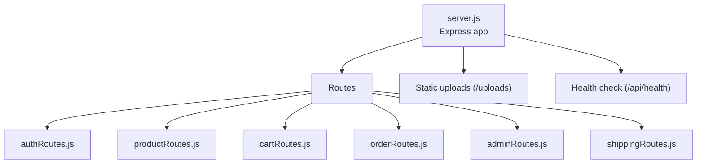
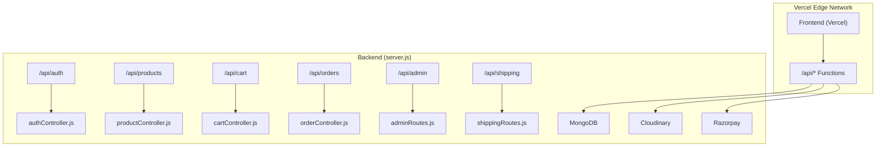
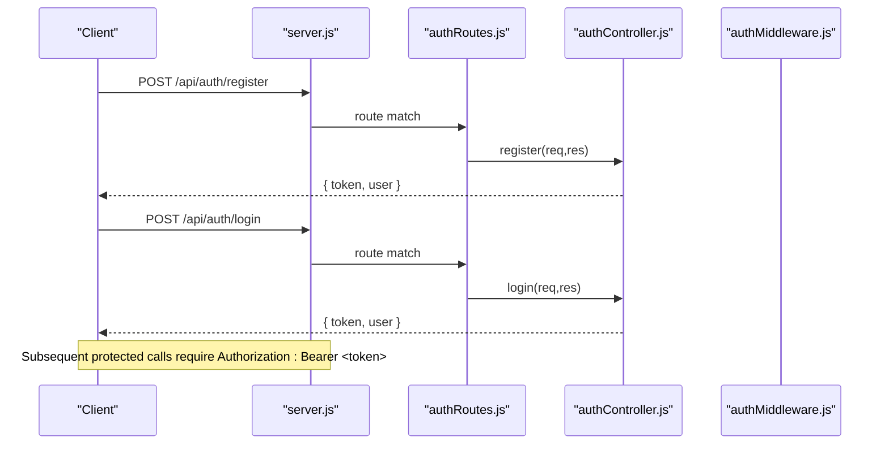
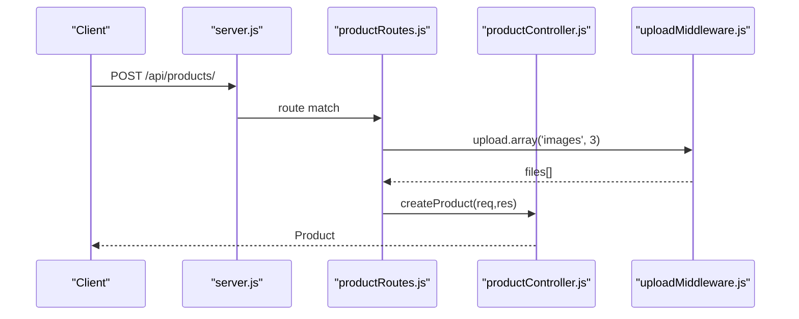
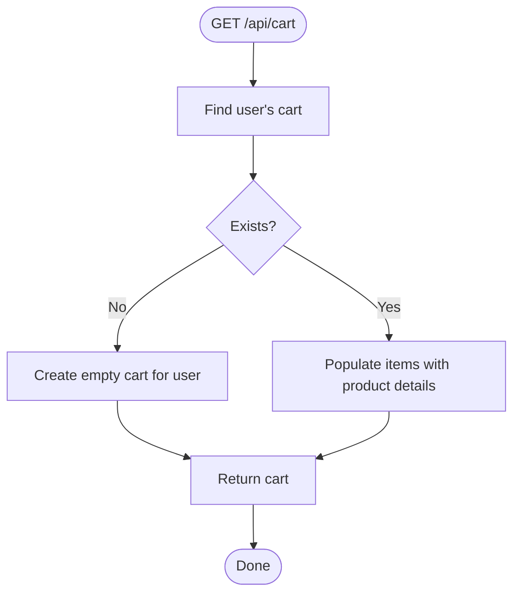
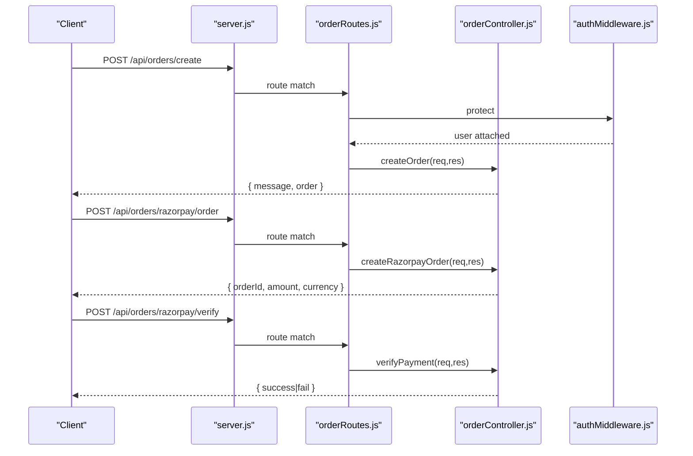
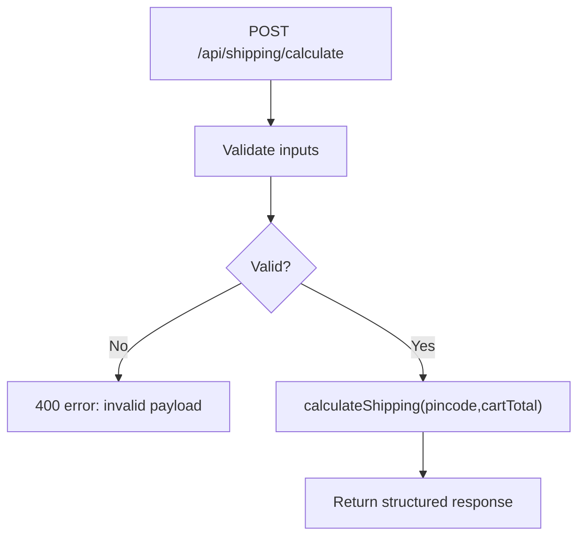
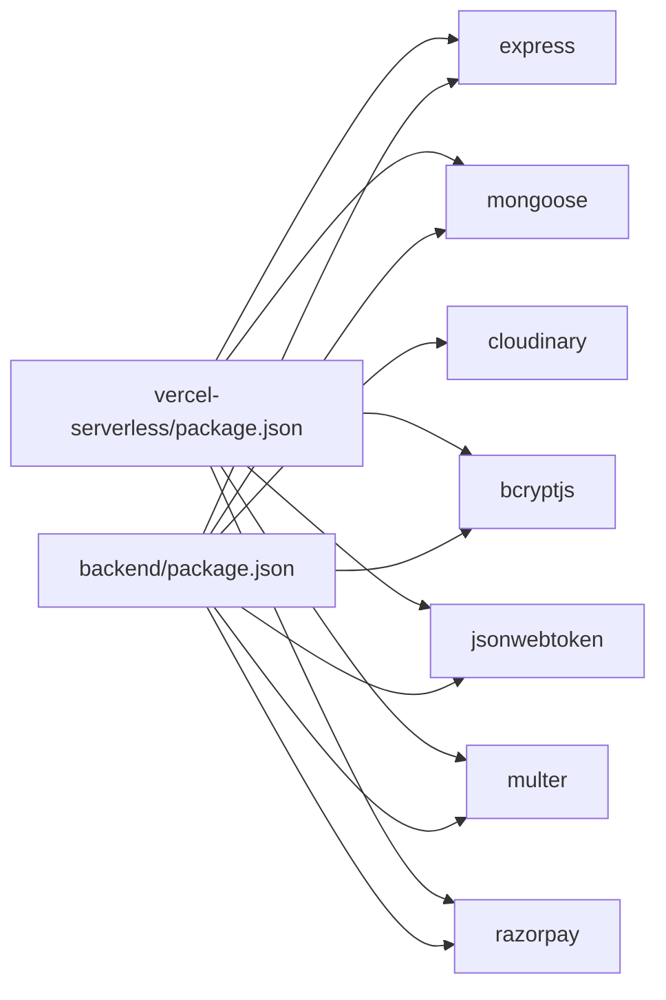

# Vercel Serverless Deployment

<cite>
**Referenced Files in This Document**
- [package.json](file://backend/package.json)
- [server.js](file://backend/server.js)
- [db.js](file://backend/config/db.js)
- [cloudinary.js](file://backend/config/cloudinary.js)
- [shipping.js](file://backend/config/shipping.js)
- [authRoutes.js](file://backend/routes/authRoutes.js)
- [productRoutes.js](file://backend/routes/productRoutes.js)
- [cartRoutes.js](file://backend/routes/cartRoutes.js)
- [orderRoutes.js](file://backend/routes/orderRoutes.js)
- [adminRoutes.js](file://backend/routes/adminRoutes.js)
- [shippingRoutes.js](file://backend/routes/shippingRoutes.js)
- [authMiddleware.js](file://backend/middleware/authMiddleware.js)
- [uploadMiddleware.js](file://backend/middleware/uploadMiddleware.js)
- [authController.js](file://backend/controllers/authController.js)
- [productController.js](file://backend/controllers/productController.js)
- [cartController.js](file://backend/controllers/cartController.js)
- [orderController.js](file://backend/controllers/orderController.js)
- [package.json](file://vercel-serverless/package.json)
</cite>

## Table of Contents
1. [Introduction](#introduction)
2. [Project Structure](#project-structure)
3. [Core Components](#core-components)
4. [Architecture Overview](#architecture-overview)
5. [Detailed Component Analysis](#detailed-component-analysis)
6. [Dependency Analysis](#dependency-analysis)
7. [Performance Considerations](#performance-considerations)
8. [Troubleshooting Guide](#troubleshooting-guide)
9. [Conclusion](#conclusion)
10. [Appendices](#appendices)

## Introduction
This document explains how to deploy the E-commerce App backend as Vercel serverless functions. It covers the serverless API structure, route organization, function naming conventions, request/response handling, environment configuration, database and external service integrations, middleware and error handling, preview and production deployments, function limits and performance, monitoring and debugging, and troubleshooting.

## Project Structure
The backend is organized around Express routes and controllers. For Vercel serverless, each route group maps naturally to a serverless function path under the vercel-serverless/api directory. The backend server.js wires routes and serves static uploads, while Vercel’s platform handles runtime scaling and edge distribution.

**Diagram sources**
- [server.js:57-63](file://backend/server.js#L57-L63)
- [server.js:54-55](file://backend/server.js#L54-L55)
- [server.js:65-73](file://backend/server.js#L65-L73)

**Section sources**
- [server.js:17-18](file://backend/server.js#L17-L18)
- [server.js:57-63](file://backend/server.js#L57-L63)
- [server.js:54-55](file://backend/server.js#L54-L55)
- [server.js:65-73](file://backend/server.js#L65-L73)

## Core Components
- Express server bootstrapped in server.js, loads environment variables, connects to MongoDB, configures CORS, JSON parsing, static uploads, and registers routes.
- Route groups define API namespaces under /api/{resource}.
- Middleware enforces authentication and admin permissions.
- Controllers encapsulate business logic and integrate with models and external services.
- Environment-driven configuration for MongoDB, JWT, Cloudinary, and payment providers.

Key serverless-friendly characteristics:
- Stateless route handlers and middleware.
- Minimal filesystem writes (local disk storage configured via multer).
- Centralized error handling middleware.

**Section sources**
- [server.js:17-18](file://backend/server.js#L17-L18)
- [server.js:22-49](file://backend/server.js#L22-L49)
- [server.js:51-52](file://backend/server.js#L51-L52)
- [server.js:54-55](file://backend/server.js#L54-L55)
- [server.js:57-63](file://backend/server.js#L57-L63)
- [server.js:91-95](file://backend/server.js#L91-L95)

## Architecture Overview
The Vercel serverless architecture leverages Express routes as function endpoints. Each route file becomes a serverless function path under vercel-serverless/api. Static assets are served from the backend uploads directory.

**Diagram sources**
- [server.js:57-63](file://backend/server.js#L57-L63)
- [authRoutes.js:1-9](file://backend/routes/authRoutes.js#L1-L9)
- [productRoutes.js:1-23](file://backend/routes/productRoutes.js#L1-L23)
- [cartRoutes.js:1-12](file://backend/routes/cartRoutes.js#L1-L12)
- [orderRoutes.js:1-28](file://backend/routes/orderRoutes.js#L1-L28)
- [adminRoutes.js:1-14](file://backend/routes/adminRoutes.js#L1-L14)
- [shippingRoutes.js:1-32](file://backend/routes/shippingRoutes.js#L1-L32)

## Detailed Component Analysis

### Authentication API
- Endpoints: POST /api/auth/register, POST /api/auth/login
- Request/response: JSON bodies for credentials; responses include JWT tokens and user info.
- Security: Authorization header with Bearer token validated by authMiddleware; protected routes enforce admin role when required.

**Diagram sources**
- [authRoutes.js:6-7](file://backend/routes/authRoutes.js#L6-L7)
- [authController.js:6-16](file://backend/controllers/authController.js#L6-L16)
- [authController.js:18-26](file://backend/controllers/authController.js#L18-L26)
- [server.js:57-58](file://backend/server.js#L57-L58)

**Section sources**
- [authRoutes.js:1-9](file://backend/routes/authRoutes.js#L1-L9)
- [authController.js:1-27](file://backend/controllers/authController.js#L1-L27)
- [authMiddleware.js:4-15](file://backend/middleware/authMiddleware.js#L4-L15)

### Products API
- Endpoints: GET /api/products/, GET /api/products/:id, POST /api/products/ (admin), PUT /api/products/:id (admin), DELETE /api/products/:id (admin)
- Uploads: Admin can attach up to 3 images via uploadMiddleware; images stored locally under uploads/.
- Search/filter/pagination: Query parameters support search and category filtering.

**Diagram sources**
- [productRoutes.js:19-21](file://backend/routes/productRoutes.js#L19-L21)
- [uploadMiddleware.js:14-28](file://backend/middleware/uploadMiddleware.js#L14-L28)
- [productController.js:52-73](file://backend/controllers/productController.js#L52-L73)

**Section sources**
- [productRoutes.js:1-23](file://backend/routes/productRoutes.js#L1-L23)
- [productController.js:1-127](file://backend/controllers/productController.js#L1-L127)
- [uploadMiddleware.js:1-30](file://backend/middleware/uploadMiddleware.js#L1-L30)

### Cart API
- Endpoints: GET /api/cart/, POST /api/cart/add, PUT /api/cart/update, DELETE /api/cart/clear
- Behavior: Creates cart if missing; updates quantities or removes items; clears cart and reinitializes.

**Diagram sources**
- [cartController.js:3-7](file://backend/controllers/cartController.js#L3-L7)

**Section sources**
- [cartRoutes.js:1-12](file://backend/routes/cartRoutes.js#L1-L12)
- [cartController.js:1-38](file://backend/controllers/cartController.js#L1-L38)

### Orders API
- Endpoints: POST /api/orders/create, GET /api/orders/my, GET /api/orders/:id, POST /api/orders/razorpay/order, POST /api/orders/razorpay/verify, GET /api/admin/orders (admin), PUT /api/admin/orders/:id/status (admin)
- Payment: Integrates with Razorpay for order creation and payment verification.
- Permissions: Admin-only routes enforced by authMiddleware.

**Diagram sources**
- [orderRoutes.js:16-22](file://backend/routes/orderRoutes.js#L16-L22)
- [orderController.js:83-146](file://backend/controllers/orderController.js#L83-L146)
- [orderController.js:39-50](file://backend/controllers/orderController.js#L39-L50)
- [orderController.js:52-67](file://backend/controllers/orderController.js#L52-L67)

**Section sources**
- [orderRoutes.js:1-28](file://backend/routes/orderRoutes.js#L1-L28)
- [orderController.js:1-146](file://backend/controllers/orderController.js#L1-L146)
- [authMiddleware.js:17-20](file://backend/middleware/authMiddleware.js#L17-L20)

### Admin API
- Endpoints: GET /api/admin/dashboard, GET /api/admin/orders, PUT /api/admin/orders/:id/status
- Protection: All routes protected by combined protect and admin middleware.

**Section sources**
- [adminRoutes.js:1-14](file://backend/routes/adminRoutes.js#L1-L14)
- [authMiddleware.js:4-20](file://backend/middleware/authMiddleware.js#L4-L20)

### Shipping API
- Endpoint: POST /api/shipping/calculate
- Input: { pincode, cartTotal }
- Output: { success, shippingCharge, zone, message, estimatedDays, isFree }
- Logic: Zone detection and free-shipping thresholds based on pincode.

**Diagram sources**
- [shippingRoutes.js:8-30](file://backend/routes/shippingRoutes.js#L8-L30)
- [shipping.js:31-73](file://backend/config/shipping.js#L31-L73)

**Section sources**
- [shippingRoutes.js:1-32](file://backend/routes/shippingRoutes.js#L1-L32)
- [shipping.js:1-73](file://backend/config/shipping.js#L1-L73)

### Middleware and Error Handling
- Authentication: Extracts Bearer token, verifies JWT, attaches user to request.
- Admin: Enforces role-based access.
- Upload: Multer disk storage with size and type limits.
- Global error handler: Catches unhandled errors and returns 500.

**Section sources**
- [authMiddleware.js:1-20](file://backend/middleware/authMiddleware.js#L1-L20)
- [uploadMiddleware.js:1-30](file://backend/middleware/uploadMiddleware.js#L1-L30)
- [server.js:91-95](file://backend/server.js#L91-L95)

## Dependency Analysis
Runtime dependencies include Express, Mongoose, bcrypt, JWT, Multer, Cloudinary, Stripe/Razorpay. These are declared in backend/package.json and mirrored in vercel-serverless/package.json for development and build parity.

**Diagram sources**
- [backend/package.json:8-22](file://backend/package.json#L8-L22)
- [vercel-serverless/package.json:10-19](file://vercel-serverless/package.json#L10-L19)

**Section sources**
- [backend/package.json:1-27](file://backend/package.json#L1-L27)
- [vercel-serverless/package.json:1-29](file://vercel-serverless/package.json#L1-L29)

## Performance Considerations
- Cold starts: Keep server.js minimal; avoid heavy synchronous work during module initialization. Move expensive initializations inside route handlers or lazy-load modules.
- Database connection: Ensure a single persistent connection is established at startup; avoid reconnect loops per request.
- Static assets: Serve images from uploads via Express static; consider offloading to a CDN for production.
- File uploads: Multer stores to disk; for serverless scale, consider migrating to Cloudinary signed uploads or a blob storage CDN.
- Payload sizes: Validate and cap request body sizes; leverage built-in Express limits and multer file size limits.
- Caching: Use Vercel caching headers for read-heavy endpoints (products, categories).
- Monitoring: Enable Vercel logs and external APM for latency and error rates.

[No sources needed since this section provides general guidance]

## Troubleshooting Guide
Common issues and resolutions:
- CORS blocked: Verify allowed origins and credentials in server.js; ensure frontend URL matches environment.
- 401 Unauthorized: Confirm Authorization header format and token validity; check JWT secret.
- 403 Access denied: Ensure requesting user has admin role for admin routes.
- Multer upload errors: Validate file types and size limits; confirm uploads directory write permissions.
- MongoDB connection failures: Check MONGO_URI; ensure environment is loaded before connecting.
- Razorpay verification failures: Verify shared secret and HMAC signature generation.
- Shipping calculation errors: Validate pincode length and numeric cartTotal.

**Section sources**
- [server.js:22-49](file://backend/server.js#L22-L49)
- [authMiddleware.js:4-15](file://backend/middleware/authMiddleware.js#L4-L15)
- [authMiddleware.js:17-20](file://backend/middleware/authMiddleware.js#L17-L20)
- [uploadMiddleware.js:14-28](file://backend/middleware/uploadMiddleware.js#L14-L28)
- [db.js:5-13](file://backend/config/db.js#L5-L13)
- [orderController.js:52-67](file://backend/controllers/orderController.js#L52-L67)
- [shippingRoutes.js:12-14](file://backend/routes/shippingRoutes.js#L12-L14)

## Conclusion
The backend is structured to align with Vercel serverless conventions: route-per-function, middleware-driven auth, and modular controllers. By configuring environment variables, optimizing static and media delivery, and leveraging Vercel’s edge network, you can achieve low-latency, scalable APIs for the E-commerce App.

[No sources needed since this section summarizes without analyzing specific files]

## Appendices

### Environment Variables
Required variables (examples):
- MONGO_URI: MongoDB connection string
- JWT_SECRET: Secret for JWT signing
- FRONTEND_URL: Allowed origin for CORS
- CLOUDINARY_CLOUD_NAME, CLOUDINARY_API_KEY, CLOUDINARY_API_SECRET: Cloudinary credentials
- RAZORPAY_KEY_ID, RAZORPAY_KEY_SECRET: Razorpay credentials

Set these in Vercel project settings under Environment Variables.

**Section sources**
- [db.js:7](file://backend/config/db.js#L7)
- [authMiddleware.js:9](file://backend/middleware/authMiddleware.js#L9)
- [cloudinary.js:6-11](file://backend/config/cloudinary.js#L6-L11)
- [orderController.js:5](file://backend/controllers/orderController.js#L5)

### Database Connections
- Connection: Established once at startup via connectDB.
- Recommendations: Use connection pooling, retry on transient failures, and monitor connection health.

**Section sources**
- [db.js:5-13](file://backend/config/db.js#L5-L13)
- [server.js:17-18](file://backend/server.js#L17-L18)

### External Service Integrations
- Cloudinary: Configured for secure uploads; adjust storage strategy for serverless scale.
- Razorpay: Used for order creation and payment verification; ensure secrets are set.

**Section sources**
- [cloudinary.js:1-13](file://backend/config/cloudinary.js#L1-L13)
- [orderController.js:5](file://backend/controllers/orderController.js#L5)
- [orderController.js:40-50](file://backend/controllers/orderController.js#L40-L50)
- [orderController.js:52-67](file://backend/controllers/orderController.js#L52-L67)

### API Endpoint Reference
- Auth: POST /api/auth/register, POST /api/auth/login
- Products: GET /api/products/, GET /api/products/:id, POST/PUT/DELETE /api/products/ (admin)
- Cart: GET /api/cart/, POST /api/cart/add, PUT /api/cart/update, DELETE /api/cart/clear
- Orders: POST /api/orders/create, GET /api/orders/my, GET /api/orders/:id, POST /api/orders/razorpay/order, POST /api/orders/razorpay/verify, GET/PUT /api/admin/orders (admin)
- Shipping: POST /api/shipping/calculate

**Section sources**
- [authRoutes.js:6-7](file://backend/routes/authRoutes.js#L6-L7)
- [productRoutes.js:15-21](file://backend/routes/productRoutes.js#L15-L21)
- [cartRoutes.js:7-10](file://backend/routes/cartRoutes.js#L7-L10)
- [orderRoutes.js:16-26](file://backend/routes/orderRoutes.js#L16-L26)
- [shippingRoutes.js:8](file://backend/routes/shippingRoutes.js#L8)

### Vercel Deployment Workflow
- Preview deployments: Triggered automatically from pull requests/branches.
- Production deployments: Deploy from the production branch.
- Branch-based deployments: Configure project settings to map branches to environments.
- Build and start scripts: Use vercel-serverless/package.json scripts for local dev and builds.

Note: Ensure vercel-serverless/package.json engines specify Node.js version compatible with Vercel’s runtime.

**Section sources**
- [vercel-serverless/package.json:6-8](file://vercel-serverless/package.json#L6-L8)
- [vercel-serverless/package.json:26-28](file://vercel-serverless/package.json#L26-L28)

### Function Limits and Cost Management
- Concurrency: Vercel scales automatically; keep functions stateless to maximize throughput.
- Timeout: Keep handlers fast; offload long tasks to background jobs.
- Storage: Prefer CDN-backed media; avoid writing to local disk in serverless.
- Requests: Monitor per-endpoint usage; cache read-heavy responses.

[No sources needed since this section provides general guidance]

### Monitoring and Debugging
- Logs: Use Vercel dashboard logs for request traces and errors.
- Metrics: Track invocations, duration, and error rates.
- Debugging: Add structured logging in controllers; wrap handlers with async error boundaries.

[No sources needed since this section provides general guidance]