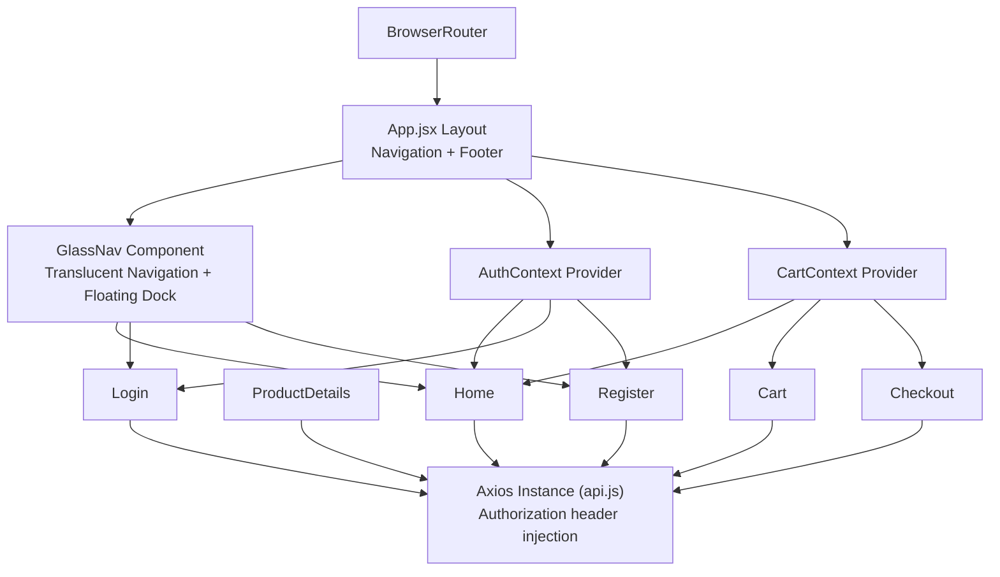
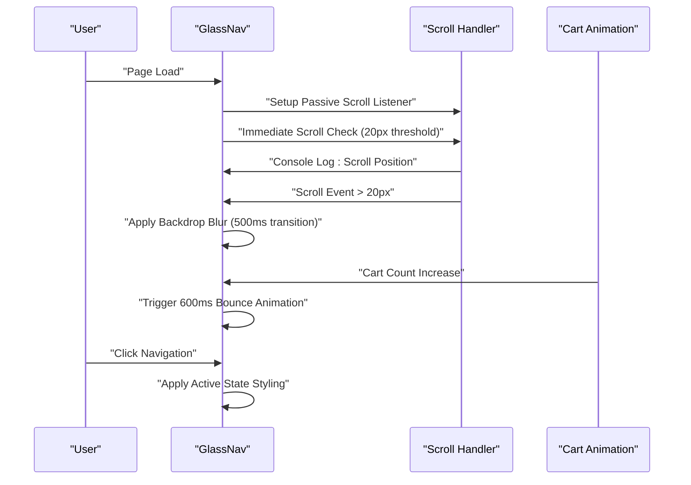
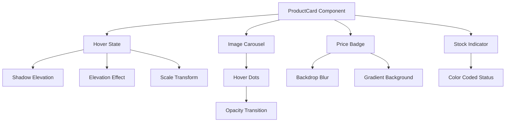
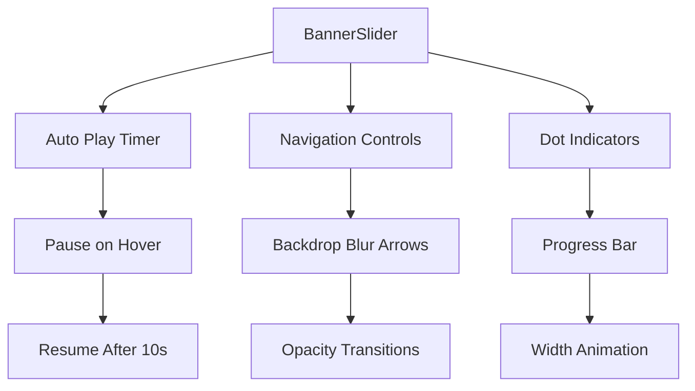
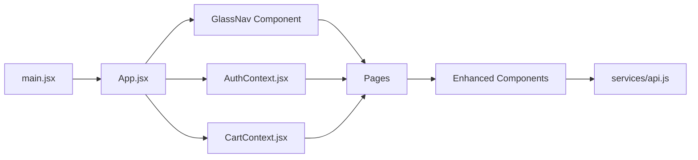

# Frontend Components & UI

<cite>
**Referenced Files in This Document**
- [App.jsx](file://frontend/src/App.jsx)
- [main.jsx](file://frontend/src/main.jsx)
- [AuthContext.jsx](file://frontend/src/context/AuthContext.jsx)
- [CartContext.jsx](file://frontend/src/context/CartContext.jsx)
- [Home.jsx](file://frontend/src/pages/Home.jsx)
- [ProductDetails.jsx](file://frontend/src/pages/ProductDetails.jsx)
- [Cart.jsx](file://frontend/src/pages/Cart.jsx)
- [Checkout.jsx](file://frontend/src/pages/Checkout.jsx)
- [Login.jsx](file://frontend/src/pages/Login.jsx)
- [Register.jsx](file://frontend/src/pages/Register.jsx)
- [ProductCard.jsx](file://frontend/src/components/ProductCard.jsx)
- [navbar.jsx](file://frontend/src/components/navbar.jsx)
- [Footer.jsx](file://frontend/src/components/Footer.jsx)
- [BannerSlider.jsx](file://frontend/src/components/BannerSlider.jsx)
- [ImageCarousel.jsx](file://frontend/src/components/ImageCarousel.jsx)
- [api.js](file://frontend/src/services/api.js)
- [index.css](file://frontend/src/index.css)
- [tailwind.config.js](file://frontend/tailwind.config.js)
</cite>

## Update Summary
**Changes Made**
- Enhanced GlassNav component with improved scroll responsiveness (threshold reduced to 20px)
- Added debug logging for scroll position tracking in GlassNav
- Implemented performance optimization with passive event listeners
- Enhanced visual styling with longer transitions (500ms vs 300ms)
- Improved backdrop blur effects and refined border styling
- Immediate execution on mount for GlassNav scroll state
- Enhanced cart animation timing with 600ms bounce duration

## Table of Contents
1. [Introduction](#introduction)
2. [Project Structure](#project-structure)
3. [Core Components](#core-components)
4. [Architecture Overview](#architecture-overview)
5. [Detailed Component Analysis](#detailed-component-analysis)
6. [Dependency Analysis](#dependency-analysis)
7. [Performance Considerations](#performance-considerations)
8. [Troubleshooting Guide](#troubleshooting-guide)
9. [Conclusion](#conclusion)
10. [Appendices](#appendices)

## Introduction
This document describes the frontend React components and user interface of the E-commerce App featuring a complete UI redesign with glassmorphism navigation, enhanced product cards, and improved user interface components. The redesign emphasizes modern aesthetics with translucent backgrounds, backdrop blur effects, and sophisticated animations while maintaining full functionality across all e-commerce operations.

## Project Structure
The frontend is a Vite-managed React application with enhanced UI components:
- Pages under src/pages for route-level views with glassmorphism navigation
- Reusable UI components under src/components featuring glassmorphism effects
- Context providers under src/context for global state management
- Shared services and utilities under src/services and src/utils
- Global styles and Tailwind configuration with glassmorphism themes

```mermaid
graph TB
subgraph "Entry"
MAIN["main.jsx"]
APP["App.jsx"]
GLASS_NAV["GlassNav Component"]
END
subgraph "Routing"
HOME["Home.jsx"]
PDETAILS["ProductDetails.jsx"]
CART["Cart.jsx"]
CHECKOUT["Checkout.jsx"]
LOGIN["Login.jsx"]
REGISTER["Register.jsx"]
END
subgraph "Enhanced UI Components"
BANNER["BannerSlider.jsx"]
IMG_CAROUSEL["ImageCarousel.jsx"]
PRODUCT_CARD["ProductCard.jsx"]
FOOTER["Footer.jsx"]
END
subgraph "Context Providers"
AUTHCTX["AuthContext.jsx"]
CARTCTX["CartContext.jsx"]
END
subgraph "Services"
API["services/api.js"]
END
MAIN --> APP
APP --> GLASS_NAV
APP --> HOME
APP --> PDETAILS
APP --> CART
APP --> CHECKOUT
APP --> LOGIN
APP --> REGISTER
APP --> FOOTER
HOME --> BANNER
HOME --> IMG_CAROUSEL
HOME --> PRODUCT_CARD
PDETAILS --> IMG_CAROUSEL
CART --> IMG_CAROUSEL
CHECKOUT --> IMG_CAROUSEL
CHECKOUT --> GLASS_NAV
AUTHCTX --> APP
CARTCTX --> HOME
CARTCTX --> CART
CARTCTX --> CHECKOUT
API --> HOME
API --> PDETAILS
API --> CART
API --> CHECKOUT
API --> LOGIN
API --> REGISTER
```

**Diagram sources**
- [main.jsx:1-10](file://frontend/src/main.jsx#L1-L10)
- [App.jsx:22-186](file://frontend/src/App.jsx#L22-L186)
- [Home.jsx:1-108](file://frontend/src/pages/Home.jsx#L1-L108)
- [ProductDetails.jsx:1-204](file://frontend/src/pages/ProductDetails.jsx#L1-L204)
- [Cart.jsx:1-152](file://frontend/src/pages/Cart.jsx#L1-L152)
- [Checkout.jsx:1-301](file://frontend/src/pages/Checkout.jsx#L1-L301)
- [Login.jsx:1-83](file://frontend/src/pages/Login.jsx#L1-L83)
- [Register.jsx:1-86](file://frontend/src/pages/Register.jsx#L1-L86)
- [BannerSlider.jsx:1-154](file://frontend/src/components/BannerSlider.jsx#L1-L154)
- [ImageCarousel.jsx:1-54](file://frontend/src/components/ImageCarousel.jsx#L1-L54)
- [ProductCard.jsx:1-48](file://frontend/src/components/ProductCard.jsx#L1-L48)
- [Footer.jsx:1-155](file://frontend/src/components/Footer.jsx#L1-L155)

**Section sources**
- [main.jsx:1-10](file://frontend/src/main.jsx#L1-L10)
- [App.jsx:188-217](file://frontend/src/App.jsx#L188-L217)

## Core Components
- **Glassmorphism Navigation**: Complete replacement of traditional navbar with translucent top navigation and floating mobile dock featuring animated cart indicators and backdrop blur effects.
- **Enhanced ProductCard**: Advanced product cards with hover animations, backdrop blur price badges, stock indicators, and sophisticated image transitions.
- **Modern BannerSlider**: Hero banner with gradient overlays, backdrop blur navigation controls, progress indicators, and smooth slide transitions.
- **Improved ImageCarousel**: Refined image carousel with better hover controls, indicator styling, and responsive design.
- **Updated Footer**: Enhanced footer with improved social media integration, contact information, and responsive layout.
- **Context providers**: AuthContext and CartContext with enhanced state management and UI integration.

**Section sources**
- [App.jsx:22-186](file://frontend/src/App.jsx#L22-L186)
- [ProductCard.jsx:1-48](file://frontend/src/components/ProductCard.jsx#L1-L48)
- [BannerSlider.jsx:1-154](file://frontend/src/components/BannerSlider.jsx#L1-L154)
- [ImageCarousel.jsx:1-54](file://frontend/src/components/ImageCarousel.jsx#L1-L54)
- [Footer.jsx:1-155](file://frontend/src/components/Footer.jsx#L1-L155)

## Architecture Overview
The app features a hybrid navigation system combining glassmorphism desktop navigation with floating mobile dock. The glass navigation provides animated backdrop blur effects, scroll-aware styling, and real-time cart count animations. All components utilize TailwindCSS for consistent styling with glassmorphism themes.



**Diagram sources**
- [App.jsx:188-217](file://frontend/src/App.jsx#L188-L217)
- [App.jsx:22-186](file://frontend/src/App.jsx#L22-L186)
- [AuthContext.jsx:1-33](file://frontend/src/context/AuthContext.jsx#L1-L33)
- [CartContext.jsx:1-53](file://frontend/src/context/CartContext.jsx#L1-L53)
- [api.js:1-8](file://frontend/src/services/api.js#L1-L8)

## Detailed Component Analysis

### Glassmorphism Navigation System

**Updated** Complete replacement of traditional navbar with sophisticated glassmorphism design featuring dual navigation modes for desktop and mobile.

The GlassNav component provides:
- **Desktop Navigation**: Fixed translucent navigation bar with backdrop blur, gradient backgrounds, and animated cart counter with bounce effects
- **Mobile Navigation**: Floating bottom dock with rounded corners, backdrop blur, and intuitive icon-based navigation
- **Responsive Design**: Automatic switching between desktop and mobile layouts based on viewport size
- **Real-time Updates**: Scroll-aware styling, animated cart count transitions, and user state detection

**Enhanced Performance Features**:
- **Reduced Scroll Threshold**: Scroll responsiveness threshold lowered to 20px for more sensitive navigation activation
- **Debug Logging**: Added console logging for scroll position tracking and navigation state debugging
- **Passive Event Listeners**: Implemented performance optimization with passive scroll listeners
- **Immediate Execution**: GlassNav now executes scroll handler immediately on mount for accurate initial state
- **Enhanced Transitions**: Extended transition duration from 300ms to 500ms for smoother visual effects
- **Improved Backdrop Effects**: Enhanced backdrop blur with improved visual quality and performance
- **Refined Border Styling**: Added refined border styling with white/20 opacity for better visual separation



**Diagram sources**
- [App.jsx:22-186](file://frontend/src/App.jsx#L22-L186)

**Section sources**
- [App.jsx:22-186](file://frontend/src/App.jsx#L22-L186)

### Enhanced ProductCard Component

**Updated** Advanced product card with sophisticated hover effects, backdrop blur styling, and animated price badges.

Key improvements:
- **Hover Animations**: Smooth shadow transitions, elevation effects, and subtle scaling
- **Backdrop Effects**: Glassmorphism price badges with blur and transparency
- **Stock Management**: Real-time stock status indicators with color-coded feedback
- **Image Handling**: Advanced image carousel integration with hover dots
- **Category Tags**: Styled category badges with rounded corners and background effects



**Diagram sources**
- [ProductCard.jsx:10-48](file://frontend/src/components/ProductCard.jsx#L10-L48)

**Section sources**
- [ProductCard.jsx:1-48](file://frontend/src/components/ProductCard.jsx#L1-L48)

### Modern BannerSlider Component

**Updated** Sophisticated hero banner with gradient overlays, backdrop blur navigation, and progress indicators.

Advanced features:
- **Gradient Overlays**: Multi-layered gradient effects from dark slate to transparent backgrounds
- **Backdrop Controls**: Navigation arrows with backdrop blur and smooth opacity transitions
- **Progress Tracking**: Animated progress bar indicating current slide position
- **Auto-play Management**: Intelligent pause/resume behavior during user interaction
- **Responsive Design**: Optimized for various screen sizes with appropriate typography scaling



**Diagram sources**
- [BannerSlider.jsx:67-154](file://frontend/src/components/BannerSlider.jsx#L67-L154)

**Section sources**
- [BannerSlider.jsx:1-154](file://frontend/src/components/BannerSlider.jsx#L1-L154)

### Improved ImageCarousel Component

**Updated** Refined image carousel with enhanced hover controls and improved visual feedback.

Enhancements:
- **Hover Controls**: Refined navigation buttons with backdrop blur and opacity transitions
- **Indicator Styling**: Improved dot indicators with active state highlighting
- **Responsive Height**: Configurable height settings for different use cases
- **Error Handling**: Graceful fallback for missing images with placeholder styling

**Section sources**
- [ImageCarousel.jsx:1-54](file://frontend/src/components/ImageCarousel.jsx#L1-L54)

### Page-Level Components

#### Home
- **Enhanced Layout**: Improved product grid with glassmorphism cards and hover effects
- **Search Interface**: Refined search input with modern styling and focus effects
- **Category Filtering**: Enhanced category selection with active state highlighting
- **Product Display**: Sophisticated product cards with advanced image handling

**Section sources**
- [Home.jsx:1-108](file://frontend/src/pages/Home.jsx#L1-L108)

#### ProductDetails
- **Glassmorphism Layout**: Modern two-column layout with rounded corners and shadows
- **Enhanced Image Display**: Large product images with improved carousel integration
- **Delivery Information**: Refined delivery checking interface with visual feedback
- **Trust Badges**: Modern trust indicators with icon integration

**Section sources**
- [ProductDetails.jsx:1-204](file://frontend/src/pages/ProductDetails.jsx#L1-L204)

#### Cart
- **Modern Summary Panel**: Glassmorphism order summary with sticky positioning
- **Enhanced Delivery Check**: Improved pincode validation and shipping calculation
- **Visual Feedback**: Better state indicators for shipping availability

**Section sources**
- [Cart.jsx:1-152](file://frontend/src/pages/Cart.jsx#L1-L152)

#### Checkout
- **Streamlined Process**: Simplified checkout interface with glassmorphism panels
- **Payment Methods**: Enhanced payment method selection with visual indicators
- **Form Styling**: Modern form inputs with focus effects and validation feedback

**Section sources**
- [Checkout.jsx:1-301](file://frontend/src/pages/Checkout.jsx#L1-L301)

#### Login and Register
- **Modern Forms**: Enhanced form styling with improved input handling
- **Password Visibility**: Refined password toggle with better visual feedback
- **Responsive Layout**: Optimized for various screen sizes

**Section sources**
- [Login.jsx:1-83](file://frontend/src/pages/Login.jsx#L1-L83)
- [Register.jsx:1-86](file://frontend/src/pages/Register.jsx#L1-L86)

### Footer Component

**Updated** Enhanced footer with improved social media integration and responsive design.

Features:
- **Social Media Integration**: Refined social media links with hover effects
- **Contact Information**: Improved contact details with icon integration
- **Responsive Grid**: Optimized layout for various screen sizes
- **Brand Identity**: Enhanced brand presentation with typography improvements

**Section sources**
- [Footer.jsx:1-155](file://frontend/src/components/Footer.jsx#L1-L155)

## Dependency Analysis
- **Navigation System**: GlassNav replaces traditional navbar with enhanced functionality
- **Component Styling**: All components utilize glassmorphism effects and backdrop blur
- **Responsive Design**: Components automatically adapt to different screen sizes
- **State Management**: Enhanced integration with context providers for real-time updates



**Diagram sources**
- [main.jsx:1-10](file://frontend/src/main.jsx#L1-L10)
- [App.jsx:188-217](file://frontend/src/App.jsx#L188-L217)
- [App.jsx:22-186](file://frontend/src/App.jsx#L22-L186)
- [AuthContext.jsx:1-33](file://frontend/src/context/AuthContext.jsx#L1-L33)
- [CartContext.jsx:1-53](file://frontend/src/context/CartContext.jsx#L1-L53)
- [api.js:1-8](file://frontend/src/services/api.js#L1-L8)

**Section sources**
- [main.jsx:1-10](file://frontend/src/main.jsx#L1-L10)
- [App.jsx:188-217](file://frontend/src/App.jsx#L188-L217)
- [App.jsx:22-186](file://frontend/src/App.jsx#L22-L186)
- [AuthContext.jsx:1-33](file://frontend/src/context/AuthContext.jsx#L1-L33)
- [CartContext.jsx:1-53](file://frontend/src/context/CartContext.jsx#L1-L53)
- [api.js:1-8](file://frontend/src/services/api.js#L1-L8)

## Performance Considerations
- **Glassmorphism Optimization**: Efficient backdrop blur rendering with hardware acceleration
- **Animation Performance**: Smooth transitions using transform properties instead of layout-affecting CSS
- **Component Rendering**: Optimized re-rendering with proper state management and memoization
- **Image Loading**: Efficient image handling with lazy loading and optimized formats
- **Mobile Performance**: Reduced bundle size for mobile navigation with conditional rendering
- **Scroll Performance**: Enhanced with passive event listeners and immediate execution for optimal responsiveness

## Troubleshooting Guide
- **Glassmorphism Issues**: Verify browser support for backdrop-filter property; fallback styling available
- **Navigation Responsiveness**: Ensure proper viewport meta tag configuration for mobile navigation
- **Animation Performance**: Monitor for jank during hover effects; optimize transition durations
- **Component Styling**: Verify TailwindCSS configuration supports glassmorphism utilities
- **Mobile Navigation**: Test floating dock positioning across different mobile devices and orientations
- **Scroll Threshold Issues**: Verify 20px scroll threshold is appropriate for target devices and adjust if needed

**Section sources**
- [App.jsx:22-186](file://frontend/src/App.jsx#L22-L186)
- [ProductCard.jsx:10-48](file://frontend/src/components/ProductCard.jsx#L10-L48)
- [BannerSlider.jsx:67-154](file://frontend/src/components/BannerSlider.jsx#L67-L154)

## Conclusion
The e-commerce app now features a comprehensive UI redesign with glassmorphism navigation, enhanced product cards, and improved user interface components. The modern aesthetic combines sophisticated visual effects with practical functionality, providing users with an engaging and responsive shopping experience. The glassmorphism design language creates depth and visual interest while maintaining excellent usability across all device types.

## Appendices

### Responsive Design Guidelines
- **Glassmorphism Adaptation**: Ensure backdrop blur effects work across different devices and browsers
- **Mobile Navigation**: Test floating dock positioning and touch interaction on various screen sizes
- **Component Scaling**: Verify glassmorphism effects scale appropriately from mobile to desktop
- **Performance Optimization**: Monitor animation performance on lower-end devices

### Accessibility Compliance
- **Contrast Ratios**: Verify sufficient contrast for glassmorphism elements with varying transparency
- **Motion Preferences**: Consider reduced motion settings for animation-heavy components
- **Keyboard Navigation**: Ensure glassmorphism navigation remains fully accessible via keyboard
- **Screen Reader Support**: Maintain semantic HTML structure despite visual enhancements

### Cross-Browser Compatibility
- **Backdrop Filter Support**: Test glassmorphism effects across different browser versions
- **CSS Grid/Flex**: Verify responsive layouts work consistently across browsers
- **Mobile Browser**: Test floating navigation on various mobile browsers and operating systems
- **Fallback Styles**: Implement graceful degradation for unsupported CSS properties

### Animations and Transitions
- **Hardware Acceleration**: Utilize transform and opacity for smooth animations
- **Performance Budget**: Limit simultaneous animations to maintain 60fps performance
- **Transition Timing**: Use appropriate easing functions for natural motion perception
- **Accessibility Considerations**: Respect reduced motion preferences and provide alternatives

### Style Customization with TailwindCSS and Theming
- **Glassmorphism Utilities**: Extend Tailwind configuration with custom glass effect utilities
- **Color System**: Maintain consistent color palette supporting glassmorphism aesthetics
- **Spacing Scale**: Use consistent spacing units for layered visual effects
- **Typography Hierarchy**: Ensure readability with translucent backgrounds and varied opacities

**Section sources**
- [tailwind.config.js:1-6](file://frontend/tailwind.config.js#L1-L6)
- [index.css:1-3](file://frontend/src/index.css#L1-L3)