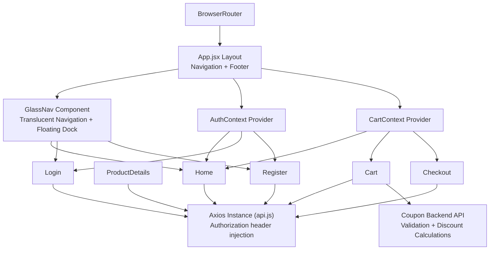
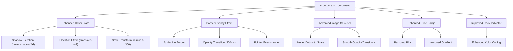
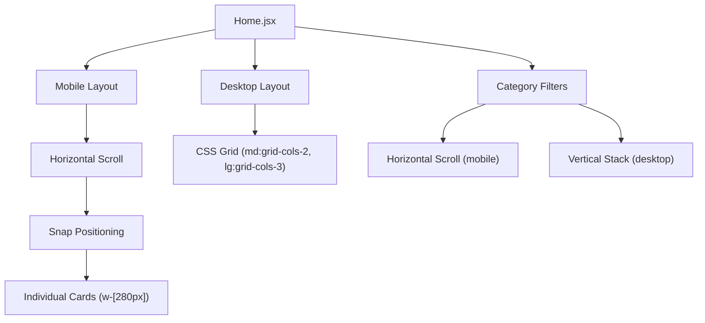
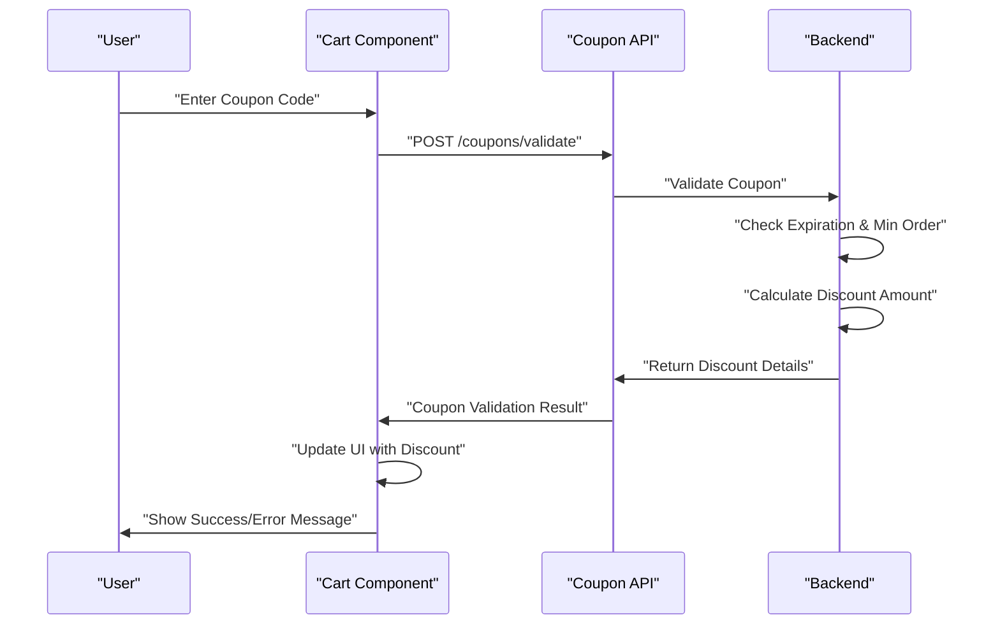
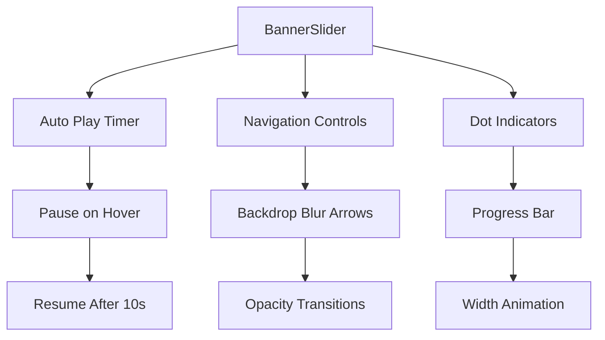
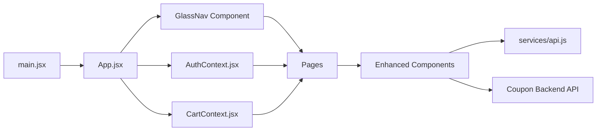

# Frontend Components & UI

<cite>
**Referenced Files in This Document**
- [App.jsx](file://frontend/src/App.jsx)
- [main.jsx](file://frontend/src/main.jsx)
- [AuthContext.jsx](file://frontend/src/context/AuthContext.jsx)
- [CartContext.jsx](file://frontend/src/context/CartContext.jsx)
- [Home.jsx](file://frontend/src/pages/Home.jsx)
- [ProductDetails.jsx](file://frontend/src/pages/ProductDetails.jsx)
- [Cart.jsx](file://frontend/src/pages/Cart.jsx)
- [Checkout.jsx](file://frontend/src/pages/Checkout.jsx)
- [Login.jsx](file://frontend/src/pages/Login.jsx)
- [Register.jsx](file://frontend/src/pages/Register.jsx)
- [ProductCard.jsx](file://frontend/src/components/ProductCard.jsx)
- [navbar.jsx](file://frontend/src/components/navbar.jsx)
- [Footer.jsx](file://frontend/src/components/Footer.jsx)
- [BannerSlider.jsx](file://frontend/src/components/BannerSlider.jsx)
- [ImageCarousel.jsx](file://frontend/src/components/ImageCarousel.jsx)
- [couponController.js](file://backend/controllers/couponController.js)
- [couponRoutes.js](file://backend/routes/couponRoutes.js)
- [api.js](file://frontend/src/services/api.js)
- [index.css](file://frontend/src/index.css)
- [tailwind.config.js](file://frontend/tailwind.config.js)
</cite>

## Update Summary
**Changes Made**
- Enhanced ProductCard component with sophisticated hover animations, overlay effects, and improved styling
- Integrated comprehensive coupon system with validation, discount calculations, and UI feedback
- Updated Home page with mobile-responsive horizontal scrolling capabilities using snap positioning
- Enhanced Cart page with coupon application functionality and improved order summary display
- Added backend support for coupon validation with percentage and fixed amount discounts

## Table of Contents
1. [Introduction](#introduction)
2. [Project Structure](#project-structure)
3. [Core Components](#core-components)
4. [Architecture Overview](#architecture-overview)
5. [Detailed Component Analysis](#detailed-component-analysis)
6. [Dependency Analysis](#dependency-analysis)
7. [Performance Considerations](#performance-considerations)
8. [Troubleshooting Guide](#troubleshooting-guide)
9. [Conclusion](#conclusion)
10. [Appendices](#appendices)

## Introduction
This document describes the frontend React components and user interface of the E-commerce App featuring a complete UI redesign with glassmorphism navigation, enhanced product cards, and improved user interface components. The redesign emphasizes modern aesthetics with translucent backgrounds, backdrop blur effects, and sophisticated animations while maintaining full functionality across all e-commerce operations.

## Project Structure
The frontend is a Vite-managed React application with enhanced UI components:
- Pages under src/pages for route-level views with glassmorphism navigation
- Reusable UI components under src/components featuring glassmorphism effects
- Context providers under src/context for global state management
- Shared services and utilities under src/services and src/utils
- Global styles and Tailwind configuration with glassmorphism themes

```mermaid
graph TB
subgraph "Entry"
MAIN["main.jsx"]
APP["App.jsx"]
GLASS_NAV["GlassNav Component"]
END
subgraph "Routing"
HOME["Home.jsx"]
PDETAILS["ProductDetails.jsx"]
CART["Cart.jsx"]
CHECKOUT["Checkout.jsx"]
LOGIN["Login.jsx"]
REGISTER["Register.jsx"]
END
subgraph "Enhanced UI Components"
BANNER["BannerSlider.jsx"]
IMG_CAROUSEL["ImageCarousel.jsx"]
PRODUCT_CARD["ProductCard.jsx"]
FOOTER["Footer.jsx"]
END
subgraph "Context Providers"
AUTHCTX["AuthContext.jsx"]
CARTCTX["CartContext.jsx"]
END
subgraph "Services"
API["services/api.js"]
COUPON_API["Coupon API Integration"]
END
MAIN --> APP
APP --> GLASS_NAV
APP --> HOME
APP --> PDETAILS
APP --> CART
APP --> CHECKOUT
APP --> LOGIN
APP --> REGISTER
APP --> FOOTER
HOME --> BANNER
HOME --> IMG_CAROUSEL
HOME --> PRODUCT_CARD
PDETAILS --> IMG_CAROUSEL
CART --> IMG_CAROUSEL
CHECKOUT --> IMG_CAROUSEL
CHECKOUT --> GLASS_NAV
AUTHCTX --> APP
CARTCTX --> HOME
CARTCTX --> CART
CARTCTX --> CHECKOUT
API --> HOME
API --> PDETAILS
API --> CART
API --> CHECKOUT
API --> LOGIN
API --> REGISTER
COUPON_API --> CART
```

**Diagram sources**
- [main.jsx:1-10](file://frontend/src/main.jsx#L1-L10)
- [App.jsx:188-217](file://frontend/src/App.jsx#L188-L217)
- [Home.jsx:1-87](file://frontend/src/pages/Home.jsx#L1-L87)
- [ProductDetails.jsx:1-204](file://frontend/src/pages/ProductDetails.jsx#L1-L204)
- [Cart.jsx:1-238](file://frontend/src/pages/Cart.jsx#L1-L238)
- [Checkout.jsx:1-301](file://frontend/src/pages/Checkout.jsx#L1-L301)
- [Login.jsx:1-83](file://frontend/src/pages/Login.jsx#L1-L83)
- [Register.jsx:1-86](file://frontend/src/pages/Register.jsx#L1-L86)
- [BannerSlider.jsx:1-154](file://frontend/src/components/BannerSlider.jsx#L1-L154)
- [ImageCarousel.jsx:1-54](file://frontend/src/components/ImageCarousel.jsx#L1-L54)
- [ProductCard.jsx:1-103](file://frontend/src/components/ProductCard.jsx#L1-L103)
- [Footer.jsx:1-155](file://frontend/src/components/Footer.jsx#L1-L155)

**Section sources**
- [main.jsx:1-10](file://frontend/src/main.jsx#L1-L10)
- [App.jsx:188-217](file://frontend/src/App.jsx#L188-L217)

## Core Components
- **Glassmorphism Navigation**: Complete replacement of traditional navbar with translucent top navigation and floating mobile dock featuring animated cart indicators and backdrop blur effects.
- **Enhanced ProductCard**: Advanced product cards with sophisticated hover animations, overlay effects, backdrop blur price badges, stock indicators, and improved image transitions.
- **Modern BannerSlider**: Hero banner with gradient overlays, backdrop blur navigation controls, progress indicators, and smooth slide transitions.
- **Improved ImageCarousel**: Refined image carousel with better hover controls, indicator styling, and responsive design.
- **Updated Footer**: Enhanced footer with improved social media integration, contact information, and responsive layout.
- **Coupon System Integration**: Comprehensive coupon validation system with percentage and fixed amount discounts, integrated into the Cart page.
- **Mobile-Responsive Home**: Enhanced Home page with horizontal scrolling capabilities for mobile devices using snap positioning.
- **Context providers**: AuthContext and CartContext with enhanced state management and UI integration.

**Section sources**
- [App.jsx:22-186](file://frontend/src/App.jsx#L22-L186)
- [ProductCard.jsx:1-103](file://frontend/src/components/ProductCard.jsx#L1-L103)
- [BannerSlider.jsx:1-154](file://frontend/src/components/BannerSlider.jsx#L1-L154)
- [ImageCarousel.jsx:1-54](file://frontend/src/components/ImageCarousel.jsx#L1-L54)
- [Footer.jsx:1-155](file://frontend/src/components/Footer.jsx#L1-L155)
- [Cart.jsx:68-89](file://frontend/src/pages/Cart.jsx#L68-L89)
- [Home.jsx:71-78](file://frontend/src/pages/Home.jsx#L71-L78)

## Architecture Overview
The app features a hybrid navigation system combining glassmorphism desktop navigation with floating mobile dock. The glass navigation provides animated backdrop blur effects, scroll-aware styling, and real-time cart count animations. All components utilize TailwindCSS for consistent styling with glassmorphism themes. The enhanced ProductCard component now features sophisticated hover effects and overlay animations, while the Cart page integrates a comprehensive coupon system with backend validation.



**Diagram sources**
- [App.jsx:188-217](file://frontend/src/App.jsx#L188-L217)
- [App.jsx:22-186](file://frontend/src/App.jsx#L22-L186)
- [AuthContext.jsx:1-33](file://frontend/src/context/AuthContext.jsx#L1-L33)
- [CartContext.jsx:1-53](file://frontend/src/context/CartContext.jsx#L1-L53)
- [api.js:1-8](file://frontend/src/services/api.js#L1-L8)
- [couponController.js:1-98](file://backend/controllers/couponController.js#L1-L98)

## Detailed Component Analysis

### Enhanced ProductCard Component

**Updated** Advanced product card with sophisticated hover animations, overlay effects, and improved styling.

Key improvements:
- **Enhanced Hover Effects**: Sophisticated shadow elevation, scaling transformations, and elevation effects with 300ms transition timing
- **Overlay Animation**: New border overlay effect with indigo accent color that appears on hover with 300ms opacity transitions
- **Improved Image Handling**: Advanced image carousel integration with hover dots, smooth opacity transitions, and scale animations
- **Enhanced Styling**: Refined typography with hover color transitions, improved spacing, and better visual hierarchy
- **Stock Management**: Real-time stock status indicators with color-coded feedback and improved badge styling



**Diagram sources**
- [ProductCard.jsx:12-100](file://frontend/src/components/ProductCard.jsx#L12-L100)

**Section sources**
- [ProductCard.jsx:1-103](file://frontend/src/components/ProductCard.jsx#L1-L103)

### Mobile-Responsive Home Page

**Updated** Enhanced Home page with mobile-responsive horizontal scrolling capabilities using snap positioning.

Key improvements:
- **Horizontal Scrolling**: Mobile-first design with horizontal scrolling using `overflow-x-auto` and `scrollbar-hide`
- **Snap Positioning**: Implementation of CSS snap points with `snap-x`, `snap-mandatory`, and `snap-start` for precise control
- **Flexible Grid**: Desktop grid layout with `md:grid-cols-2` and `lg:grid-cols-3` for optimal desktop experience
- **Responsive Sizing**: Individual product cards sized at `w-[280px]` for mobile horizontal scrolling
- **Cross-Browser Compatibility**: Proper scrollbar hiding with `-webkit-scrollbar` for Safari compatibility



**Diagram sources**
- [Home.jsx:71-78](file://frontend/src/pages/Home.jsx#L71-L78)

**Section sources**
- [Home.jsx:1-87](file://frontend/src/pages/Home.jsx#L1-L87)

### Comprehensive Coupon System Integration

**New** Integrated comprehensive coupon system with backend validation and frontend UI integration.

Key features:
- **Coupon Validation**: Real-time coupon validation with backend API integration
- **Discount Calculation**: Support for both percentage and fixed amount discounts
- **Minimum Order Requirements**: Validation against minimum order value thresholds
- **Maximum Discount Limits**: Cap maximum discount amounts for percentage coupons
- **UI Feedback**: Comprehensive success/error messaging and visual feedback
- **Coupon Removal**: Ability to remove applied coupons and recalculate totals



**Diagram sources**
- [Cart.jsx:68-89](file://frontend/src/pages/Cart.jsx#L68-L89)
- [couponController.js:4-51](file://backend/controllers/couponController.js#L4-L51)

**Section sources**
- [Cart.jsx:12-89](file://frontend/src/pages/Cart.jsx#L12-L89)
- [couponController.js:1-98](file://backend/controllers/couponController.js#L1-L98)
- [couponRoutes.js:1-17](file://backend/routes/couponRoutes.js#L1-L17)

### Modern BannerSlider Component

**Updated** Sophisticated hero banner with gradient overlays, backdrop blur navigation, and progress indicators.

Advanced features:
- **Gradient Overlays**: Multi-layered gradient effects from dark slate to transparent backgrounds
- **Backdrop Controls**: Navigation arrows with backdrop blur and smooth opacity transitions
- **Progress Tracking**: Animated progress bar indicating current slide position
- **Auto-play Management**: Intelligent pause/resume behavior during user interaction
- **Responsive Design**: Optimized for various screen sizes with appropriate typography scaling



**Diagram sources**
- [BannerSlider.jsx:67-154](file://frontend/src/components/BannerSlider.jsx#L67-L154)

**Section sources**
- [BannerSlider.jsx:1-154](file://frontend/src/components/BannerSlider.jsx#L1-L154)

### Improved ImageCarousel Component

**Updated** Refined image carousel with enhanced hover controls and improved visual feedback.

Enhancements:
- **Hover Controls**: Refined navigation buttons with backdrop blur and opacity transitions
- **Indicator Styling**: Improved dot indicators with active state highlighting
- **Responsive Height**: Configurable height settings for different use cases
- **Error Handling**: Graceful fallback for missing images with placeholder styling

**Section sources**
- [ImageCarousel.jsx:1-54](file://frontend/src/components/ImageCarousel.jsx#L1-L54)

### Page-Level Components

#### Home
- **Enhanced Layout**: Improved product grid with glassmorphism cards and sophisticated hover effects
- **Search Interface**: Refined search input with modern styling and focus effects
- **Category Filtering**: Enhanced category selection with active state highlighting and horizontal scrolling
- **Product Display**: Sophisticated product cards with advanced image handling and overlay effects

**Section sources**
- [Home.jsx:1-87](file://frontend/src/pages/Home.jsx#L1-L87)

#### ProductDetails
- **Glassmorphism Layout**: Modern two-column layout with rounded corners and shadows
- **Enhanced Image Display**: Large product images with improved carousel integration
- **Delivery Information**: Refined delivery checking interface with visual feedback
- **Trust Badges**: Modern trust indicators with icon integration
- **Enhanced Error Handling**: Improved error message display and user feedback mechanisms

**Section sources**
- [ProductDetails.jsx:1-204](file://frontend/src/pages/ProductDetails.jsx#L1-L204)

#### Cart
- **Modern Summary Panel**: Glassmorphism order summary with sticky positioning
- **Enhanced Delivery Check**: Improved pincode validation and shipping calculation
- **Coupon System Integration**: Comprehensive coupon application with validation and feedback
- **Visual Feedback**: Better state indicators for shipping availability and coupon application
- **Enhanced Shipping Logic**: Improved free delivery thresholds and zone-based pricing

**Section sources**
- [Cart.jsx:1-238](file://frontend/src/pages/Cart.jsx#L1-L238)

#### Checkout
- **Streamlined Process**: Simplified checkout interface with glassmorphism panels
- **Payment Methods**: Enhanced payment method selection with visual indicators
- **Form Styling**: Modern form inputs with focus effects and validation feedback
- **Enhanced Validation**: Improved address validation and error handling

**Section sources**
- [Checkout.jsx:1-301](file://frontend/src/pages/Checkout.jsx#L1-L301)

#### Login and Register
- **Modern Forms**: Enhanced form styling with improved input handling
- **Password Visibility**: Refined password toggle with better visual feedback
- **Responsive Layout**: Optimized for various screen sizes

**Section sources**
- [Login.jsx:1-83](file://frontend/src/pages/Login.jsx#L1-L83)
- [Register.jsx:1-86](file://frontend/src/pages/Register.jsx#L1-L86)

### Footer Component

**Updated** Enhanced footer with improved social media integration and responsive design.

Features:
- **Social Media Integration**: Refined social media links with hover effects
- **Contact Information**: Improved contact details with icon integration
- **Responsive Grid**: Optimized layout for various screen sizes
- **Brand Identity**: Enhanced brand presentation with typography improvements

**Section sources**
- [Footer.jsx:1-155](file://frontend/src/components/Footer.jsx#L1-L155)

### Authentication Context

**Updated** Enhanced authentication context with comprehensive logout functionality and state management.

Key improvements:
- **Centralized State Management**: Unified authentication state across all components
- **Enhanced Logout**: Proper token and user data cleanup with state updates
- **Role-Based Access**: Support for admin user roles with separate access patterns
- **Automatic Session Management**: Integration with localStorage for persistent sessions

**Section sources**
- [AuthContext.jsx:1-33](file://frontend/src/context/AuthContext.jsx#L1-L33)

## Dependency Analysis
- **Navigation System**: GlassNav replaces traditional navbar with enhanced functionality
- **Component Styling**: All components utilize glassmorphism effects and backdrop blur
- **Responsive Design**: Components automatically adapt to different screen sizes with enhanced mobile support
- **State Management**: Enhanced integration with context providers for real-time updates
- **Authentication Flow**: Centralized authentication state management across all components
- **Coupon System**: Bidirectional integration between frontend Cart component and backend coupon validation
- **Mobile Responsiveness**: Enhanced horizontal scrolling capabilities for optimal mobile experience



**Diagram sources**
- [main.jsx:1-10](file://frontend/src/main.jsx#L1-L10)
- [App.jsx:188-217](file://frontend/src/App.jsx#L188-L217)
- [App.jsx:22-186](file://frontend/src/App.jsx#L22-L186)
- [AuthContext.jsx:1-33](file://frontend/src/context/AuthContext.jsx#L1-L33)
- [CartContext.jsx:1-53](file://frontend/src/context/CartContext.jsx#L1-L53)
- [api.js:1-8](file://frontend/src/services/api.js#L1-L8)

**Section sources**
- [main.jsx:1-10](file://frontend/src/main.jsx#L1-L10)
- [App.jsx:188-217](file://frontend/src/App.jsx#L188-L217)
- [App.jsx:22-186](file://frontend/src/App.jsx#L22-L186)
- [AuthContext.jsx:1-33](file://frontend/src/context/AuthContext.jsx#L1-L33)
- [CartContext.jsx:1-53](file://frontend/src/context/CartContext.jsx#L1-L53)
- [api.js:1-8](file://frontend/src/services/api.js#L1-L8)

## Performance Considerations
- **Glassmorphism Optimization**: Efficient backdrop blur rendering with hardware acceleration
- **Animation Performance**: Smooth transitions using transform properties instead of layout-affecting CSS
- **Component Rendering**: Optimized re-rendering with proper state management and memoization
- **Image Loading**: Efficient image handling with lazy loading and optimized formats
- **Mobile Performance**: Reduced bundle size for mobile navigation with conditional rendering
- **Scroll Performance**: Enhanced with passive event listeners and immediate execution for optimal responsiveness
- **Authentication Performance**: Efficient localStorage operations and minimal re-renders during state changes
- **Coupon Validation**: Debounced API calls and efficient error handling to prevent excessive network requests
- **Horizontal Scrolling**: Optimized snap positioning for smooth mobile scrolling experience

## Troubleshooting Guide
- **Glassmorphism Issues**: Verify browser support for backdrop-filter property; fallback styling available
- **Navigation Responsiveness**: Ensure proper viewport meta tag configuration for mobile navigation
- **Animation Performance**: Monitor for jank during hover effects; optimize transition durations
- **Component Styling**: Verify TailwindCSS configuration supports glassmorphism utilities
- **Mobile Navigation**: Test floating dock positioning across different mobile devices and orientations
- **Horizontal Scrolling**: Verify snap positioning works correctly across different mobile browsers
- **Coupon Validation**: Test coupon codes with various discount types and minimum order values
- **ProductCard Hover Effects**: Ensure overlay animations don't interfere with click events
- **Logout Functionality**: Ensure localStorage cleanup occurs properly and navigation redirects work correctly
- **Shipping Calculation**: Verify pincode validation and zone-based pricing logic works across all scenarios

**Section sources**
- [App.jsx:22-186](file://frontend/src/App.jsx#L22-L186)
- [ProductCard.jsx:12-100](file://frontend/src/components/ProductCard.jsx#L12-L100)
- [BannerSlider.jsx:67-154](file://frontend/src/components/BannerSlider.jsx#L67-L154)
- [Home.jsx:71-78](file://frontend/src/pages/Home.jsx#L71-L78)

## Conclusion
The e-commerce app now features a comprehensive UI redesign with glassmorphism navigation, enhanced product cards, and improved user interface components. The modern aesthetic combines sophisticated visual effects with practical functionality, providing users with an engaging and responsive shopping experience. The enhanced ProductCard component with sophisticated hover effects, the comprehensive coupon system integration, and the mobile-responsive horizontal scrolling capabilities demonstrate a mature and user-focused development approach. The glassmorphism design language creates depth and visual interest while maintaining excellent usability across all device types.

## Appendices

### Responsive Design Guidelines
- **Glassmorphism Adaptation**: Ensure backdrop blur effects work across different devices and browsers
- **Mobile Navigation**: Test floating dock positioning and touch interaction on various screen sizes
- **Component Scaling**: Verify glassmorphism effects scale appropriately from mobile to desktop
- **Horizontal Scrolling**: Test snap positioning across different mobile devices and orientations
- **Performance Optimization**: Monitor animation performance on lower-end devices

### Accessibility Compliance
- **Contrast Ratios**: Verify sufficient contrast for glassmorphism elements with varying transparency
- **Motion Preferences**: Consider reduced motion settings for animation-heavy components
- **Keyboard Navigation**: Ensure glassmorphism navigation remains fully accessible via keyboard
- **Screen Reader Support**: Maintain semantic HTML structure despite visual enhancements
- **Touch Targets**: Ensure horizontal scrolling elements have appropriate touch target sizes

### Cross-Browser Compatibility
- **Backdrop Filter Support**: Test glassmorphism effects across different browser versions
- **CSS Grid/Flex**: Verify responsive layouts work consistently across browsers
- **Mobile Browser**: Test floating navigation and horizontal scrolling on various mobile browsers
- **Fallback Styles**: Implement graceful degradation for unsupported CSS properties
- **Snap Positioning**: Verify CSS snap features work across different browser implementations

### Animations and Transitions
- **Hardware Acceleration**: Utilize transform and opacity for smooth animations
- **Performance Budget**: Limit simultaneous animations to maintain 60fps performance
- **Transition Timing**: Use appropriate easing functions for natural motion perception
- **Accessibility Considerations**: Respect reduced motion preferences and provide alternatives
- **Hover Effects**: Ensure animations don't interfere with click events or accessibility features

### Style Customization with TailwindCSS and Theming
- **Glassmorphism Utilities**: Extend Tailwind configuration with custom glass effect utilities
- **Color System**: Maintain consistent color palette supporting glassmorphism aesthetics
- **Spacing Scale**: Use consistent spacing units for layered visual effects
- **Typography Hierarchy**: Ensure readability with translucent backgrounds and varied opacities
- **Mobile-First Design**: Implement responsive breakpoints for optimal mobile experience

### Authentication and Security
- **Token Management**: Secure storage and handling of authentication tokens
- **Session Handling**: Proper session cleanup and expiration management
- **Role-Based Access**: Implement secure role-based navigation and functionality
- **Security Best Practices**: Follow industry standards for client-side authentication

### Coupon System Integration
- **Backend Validation**: Ensure coupon codes are validated server-side with proper error handling
- **Discount Calculation**: Implement accurate discount calculations with minimum and maximum limits
- **Client-Side Caching**: Cache coupon validation results to reduce API calls
- **Error Handling**: Provide clear error messages for invalid or expired coupon codes
- **UI Feedback**: Implement comprehensive success and error messaging for user experience

**Section sources**
- [tailwind.config.js:1-6](file://frontend/tailwind.config.js#L1-L6)
- [index.css:1-3](file://frontend/src/index.css#L1-L3)
- [couponController.js:24-46](file://backend/controllers/couponController.js#L24-L46)
- [Cart.jsx:68-89](file://frontend/src/pages/Cart.jsx#L68-L89)