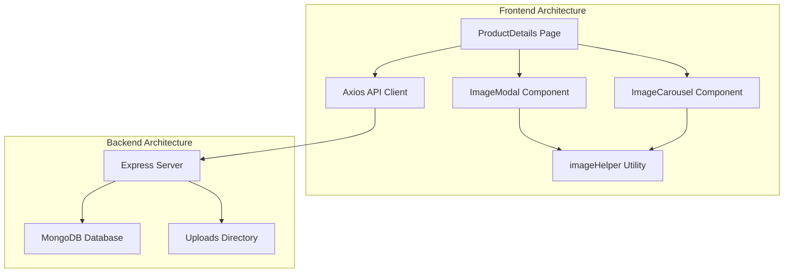
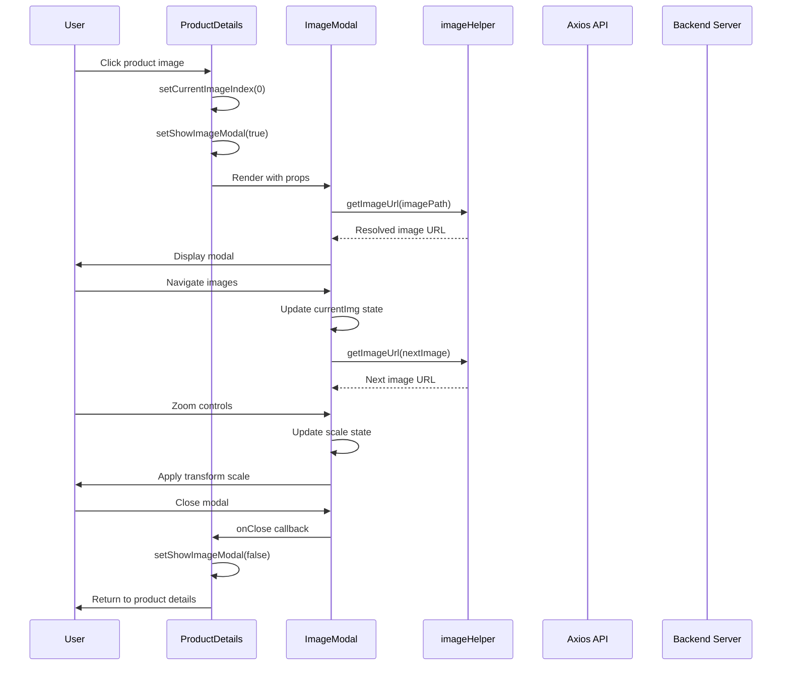
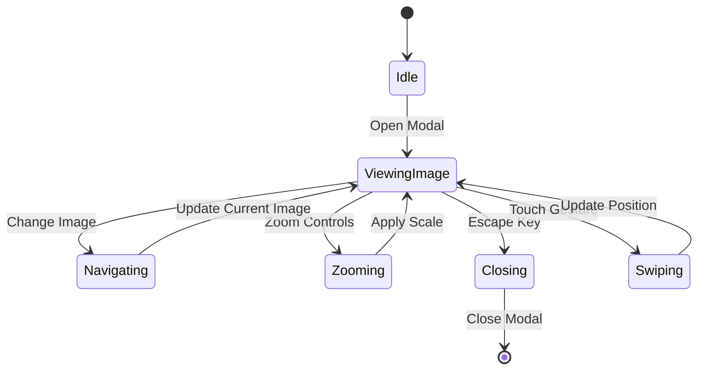
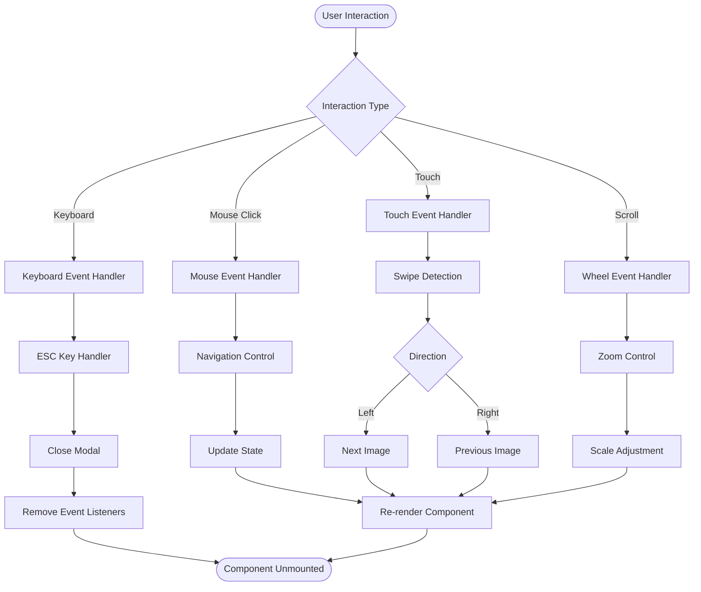
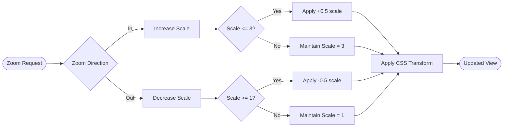
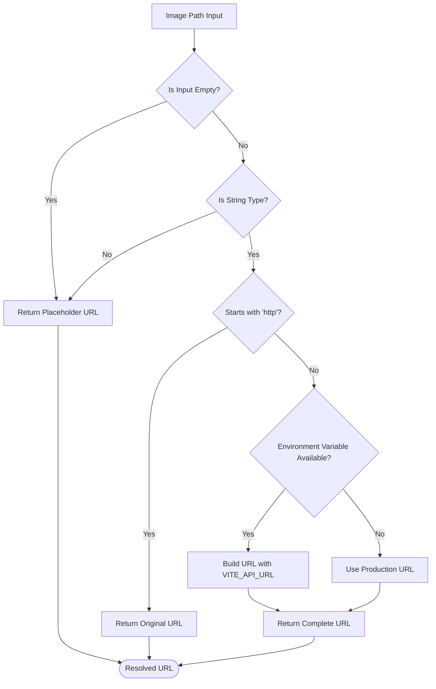
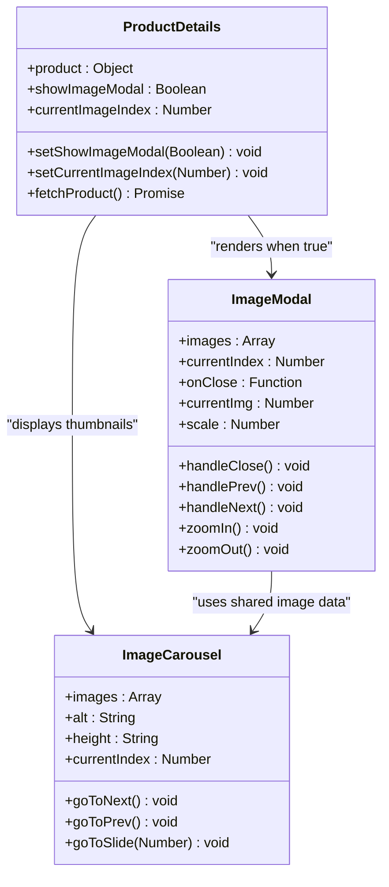
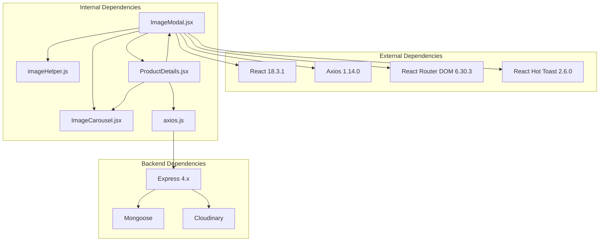

# Image Modal Component

<cite>
**Referenced Files in This Document**
- [ImageModal.jsx](file://frontend/src/components/ImageModal.jsx)
- [imageHelper.js](file://frontend/src/utils/imageHelper.js)
- [ProductDetails.jsx](file://frontend/src/pages/ProductDetails.jsx)
- [ImageCarousel.jsx](file://frontend/src/components/ImageCarousel.jsx)
- [axios.js](file://frontend/src/api/axios.js)
- [server.js](file://backend/server.js)
- [db.js](file://backend/config/db.js)
</cite>

## Table of Contents
1. [Introduction](#introduction)
2. [Project Structure](#project-structure)
3. [Core Components](#core-components)
4. [Architecture Overview](#architecture-overview)
5. [Detailed Component Analysis](#detailed-component-analysis)
6. [Dependency Analysis](#dependency-analysis)
7. [Performance Considerations](#performance-considerations)
8. [Troubleshooting Guide](#troubleshooting-guide)
9. [Conclusion](#conclusion)

## Introduction

The Image Modal Component is a sophisticated React component designed to provide an enhanced image viewing experience for e-commerce applications. This component serves as a full-screen modal interface that allows users to view product images in high resolution with advanced navigation controls, zoom functionality, and responsive design capabilities.

The component integrates seamlessly with the broader e-commerce platform, providing users with an intuitive way to examine product details through interactive image manipulation. It supports multiple interaction modes including mouse navigation, keyboard shortcuts, and touch gestures for mobile devices.

## Project Structure

The Image Modal Component is part of a larger e-commerce application architecture with clear separation of concerns between frontend and backend components.

**Diagram sources**
- [ProductDetails.jsx:1-195](file://frontend/src/pages/ProductDetails.jsx#L1-L195)
- [ImageModal.jsx:1-166](file://frontend/src/components/ImageModal.jsx#L1-L166)
- [server.js:1-120](file://backend/server.js#L1-L120)

**Section sources**
- [ProductDetails.jsx:1-195](file://frontend/src/pages/ProductDetails.jsx#L1-L195)
- [ImageModal.jsx:1-166](file://frontend/src/components/ImageModal.jsx#L1-L166)
- [server.js:1-120](file://backend/server.js#L1-L120)

## Core Components

The Image Modal Component consists of several interconnected parts that work together to provide a comprehensive image viewing experience:

### Primary Components

1. **ImageModal Component**: Main modal interface with navigation controls
2. **ImageCarousel Component**: Thumbnail carousel for quick image selection
3. **imageHelper Utility**: Image URL resolution and formatting
4. **ProductDetails Page**: Integration point and state management

### Key Features

- **Full-screen Modal Display**: Covers entire viewport for immersive viewing
- **Multi-image Navigation**: Previous/next navigation with keyboard support
- **Zoom Functionality**: Incremental zoom controls with scale limits
- **Touch Gesture Support**: Swipe navigation for mobile devices
- **Responsive Design**: Adapts to different screen sizes and orientations
- **Accessibility Features**: Keyboard navigation and screen reader support

**Section sources**
- [ImageModal.jsx:4-166](file://frontend/src/components/ImageModal.jsx#L4-L166)
- [ImageCarousel.jsx:1-54](file://frontend/src/components/ImageCarousel.jsx#L1-L54)
- [imageHelper.js:1-8](file://frontend/src/utils/imageHelper.js#L1-L8)

## Architecture Overview

The Image Modal Component follows a component-based architecture with clear data flow and event handling patterns.

**Diagram sources**
- [ProductDetails.jsx:67-72](file://frontend/src/pages/ProductDetails.jsx#L67-L72)
- [ImageModal.jsx:135-140](file://frontend/src/components/ImageModal.jsx#L135-L140)
- [imageHelper.js:1-8](file://frontend/src/utils/imageHelper.js#L1-L8)

The architecture demonstrates a unidirectional data flow where the parent component manages state and passes down props to child components. The modal component handles local state for image navigation and user interactions while delegating image URL resolution to utility functions.

**Section sources**
- [ProductDetails.jsx:186-192](file://frontend/src/pages/ProductDetails.jsx#L186-L192)
- [ImageModal.jsx:4-22](file://frontend/src/components/ImageModal.jsx#L4-L22)

## Detailed Component Analysis

### ImageModal Component Implementation

The ImageModal Component is built using React hooks and functional components, implementing a comprehensive image viewing interface.

#### State Management

**Diagram sources**
- [ImageModal.jsx:5-13](file://frontend/src/components/ImageModal.jsx#L5-L13)
- [ImageModal.jsx:24-47](file://frontend/src/components/ImageModal.jsx#L24-L47)

The component maintains four primary states:
- **currentImg**: Tracks the currently displayed image index
- **scale**: Controls the zoom level of the main image
- **touchStart/touchEnd**: Manages touch gesture detection for mobile devices

#### Event Handling System

The component implements multiple event handling mechanisms for different interaction types:

**Diagram sources**
- [ImageModal.jsx:16-22](file://frontend/src/components/ImageModal.jsx#L16-L22)
- [ImageModal.jsx:25-47](file://frontend/src/components/ImageModal.jsx#L25-L47)
- [ImageModal.jsx:49-58](file://frontend/src/components/ImageModal.jsx#L49-L58)

#### Navigation Controls

The component provides multiple navigation methods:

1. **Arrow Buttons**: Positioned on the sides for easy thumb access
2. **Thumbnail Strip**: Horizontal strip at the bottom for quick selection
3. **Keyboard Shortcuts**: Arrow keys for accessibility
4. **Touch Gestures**: Swipe left/right for mobile devices

#### Zoom Functionality

The zoom system implements a controlled scaling mechanism:

**Diagram sources**
- [ImageModal.jsx:49-50](file://frontend/src/components/ImageModal.jsx#L49-L50)

**Section sources**
- [ImageModal.jsx:1-166](file://frontend/src/components/ImageModal.jsx#L1-L166)

### Image Helper Utility

The imageHelper module provides centralized image URL resolution and formatting functionality.

#### URL Resolution Logic

**Diagram sources**
- [imageHelper.js:1-8](file://frontend/src/utils/imageHelper.js#L1-L8)

**Section sources**
- [imageHelper.js:1-8](file://frontend/src/utils/imageHelper.js#L1-L8)

### Integration with Product Details

The Image Modal integrates with the Product Details page through a clean prop-based interface:

**Diagram sources**
- [ProductDetails.jsx:9-52](file://frontend/src/pages/ProductDetails.jsx#L9-L52)
- [ImageModal.jsx:4-58](file://frontend/src/components/ImageModal.jsx#L4-L58)
- [ImageCarousel.jsx:4-13](file://frontend/src/components/ImageCarousel.jsx#L4-L13)

**Section sources**
- [ProductDetails.jsx:67-72](file://frontend/src/pages/ProductDetails.jsx#L67-L72)
- [ProductDetails.jsx:186-192](file://frontend/src/pages/ProductDetails.jsx#L186-L192)

## Dependency Analysis

The Image Modal Component has a well-defined dependency structure that promotes modularity and maintainability.

**Diagram sources**
- [package.json:8-24](file://frontend/package.json#L8-L24)
- [server.js:1-120](file://backend/server.js#L1-L120)

### Component Dependencies

The Image Modal Component depends on several key modules:

1. **React Ecosystem**: Core React functionality and hooks
2. **Axios**: HTTP client for API communication
3. **React Router**: Navigation and routing
4. **React Hot Toast**: Notification system
5. **Custom Utilities**: Image helper functions

### Backend Integration Points

The component interacts with the backend through the following integration points:

- **Image Storage**: Backend uploads directory for static images
- **API Endpoints**: Product data retrieval
- **Authentication**: Token-based access control

**Section sources**
- [package.json:8-24](file://frontend/package.json#L8-L24)
- [axios.js:1-17](file://frontend/src/api/axios.js#L1-L17)
- [server.js:69-70](file://backend/server.js#L69-L70)

## Performance Considerations

The Image Modal Component implements several performance optimization strategies:

### Memory Management

- **Event Listener Cleanup**: Automatic removal of keyboard and resize listeners
- **State Optimization**: Minimal state updates to prevent unnecessary re-renders
- **Lazy Loading**: Images loaded only when modal is opened

### Rendering Optimization

- **CSS Transitions**: Hardware-accelerated transforms for smooth animations
- **Debounced Events**: Touch gesture handling prevents excessive state updates
- **Conditional Rendering**: Thumbnail strip only rendered when multiple images exist

### Network Optimization

- **Image URL Caching**: Resolved URLs cached during component lifecycle
- **Efficient API Calls**: Minimal network requests for image data
- **CDN Integration**: Backend serves images from optimized storage

**Section sources**
- [ImageModal.jsx:11-22](file://frontend/src/components/ImageModal.jsx#L11-L22)
- [ImageModal.jsx:128-140](file://frontend/src/components/ImageModal.jsx#L128-L140)

## Troubleshooting Guide

### Common Issues and Solutions

#### Image Loading Problems

**Issue**: Images fail to load in modal
**Solution**: Verify backend URL configuration and image paths

**Issue**: Placeholder images displayed instead of actual content
**Solution**: Check imageHelper URL resolution logic

#### Navigation Issues

**Issue**: Navigation buttons disabled unexpectedly
**Solution**: Verify images array length and current index bounds

**Issue**: Touch gestures not working on mobile
**Solution**: Test touch event handler implementation

#### Performance Issues

**Issue**: Slow modal opening/closing
**Solution**: Optimize image sizes and implement lazy loading

**Issue**: Memory leaks after component unmount
**Solution**: Ensure proper cleanup of event listeners

### Debugging Strategies

1. **Console Logging**: Add debug statements for state changes
2. **Network Inspection**: Monitor image loading requests
3. **Performance Profiling**: Use browser developer tools
4. **Component Inspection**: Verify prop passing and state updates

**Section sources**
- [imageHelper.js:1-8](file://frontend/src/utils/imageHelper.js#L1-L8)
- [ImageModal.jsx:16-22](file://frontend/src/components/ImageModal.jsx#L16-L22)

## Conclusion

The Image Modal Component represents a well-architected solution for enhanced image viewing in e-commerce applications. Its modular design, comprehensive feature set, and performance optimizations make it a valuable addition to the product presentation system.

Key strengths of the implementation include:

- **User Experience**: Intuitive navigation with multiple interaction modes
- **Accessibility**: Keyboard support and screen reader compatibility  
- **Performance**: Optimized rendering and memory management
- **Integration**: Seamless integration with existing e-commerce workflows
- **Scalability**: Modular design supports future enhancements

The component successfully balances functionality with simplicity, providing users with a premium image viewing experience while maintaining clean code architecture and optimal performance characteristics.