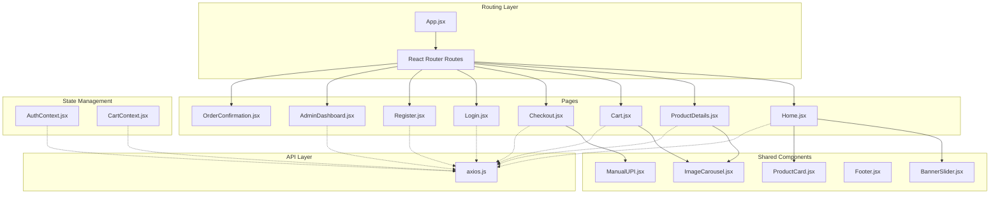
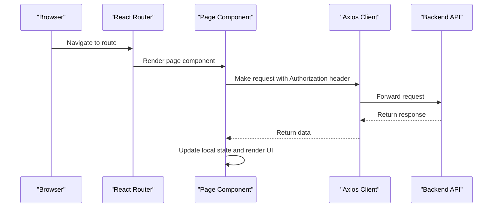
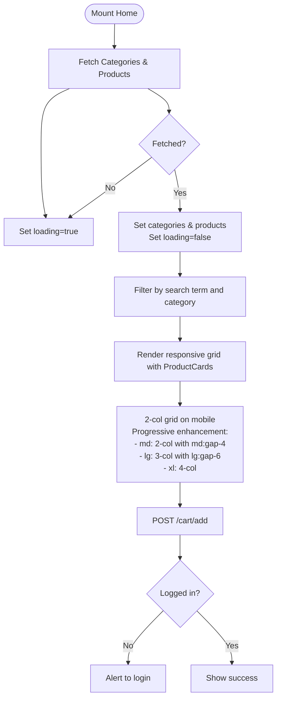
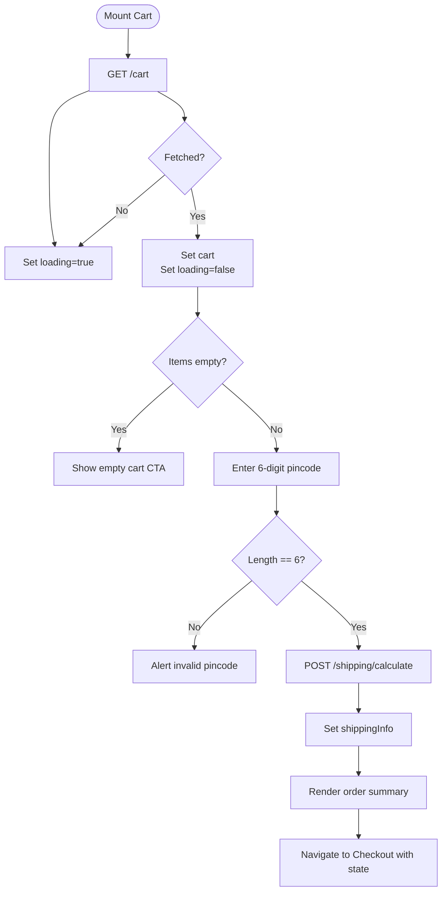
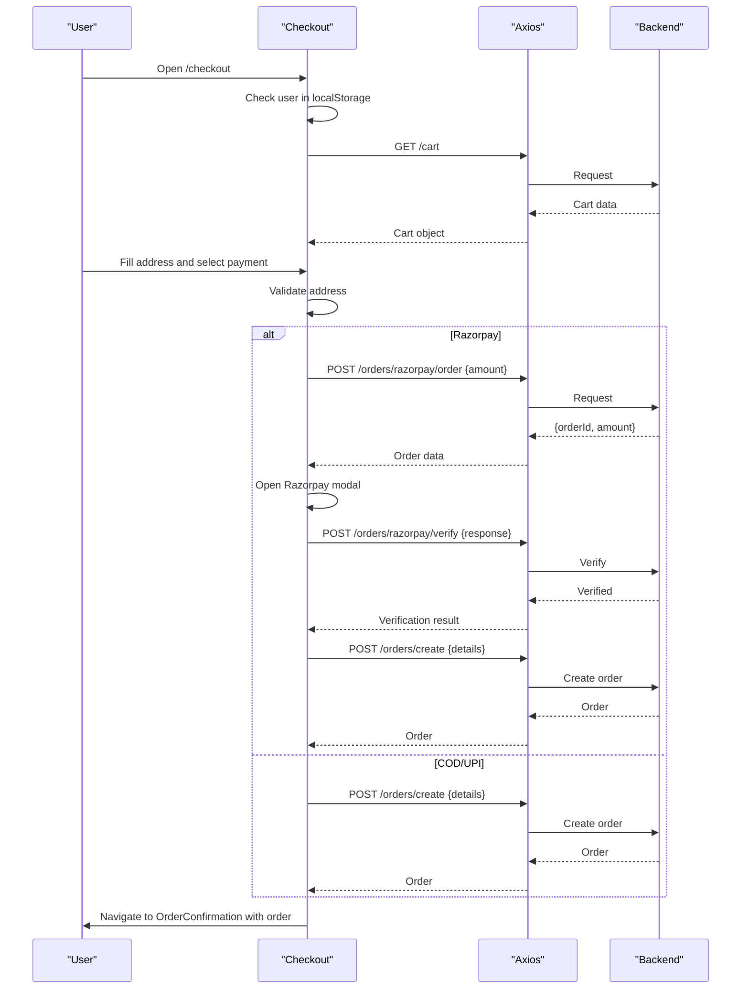
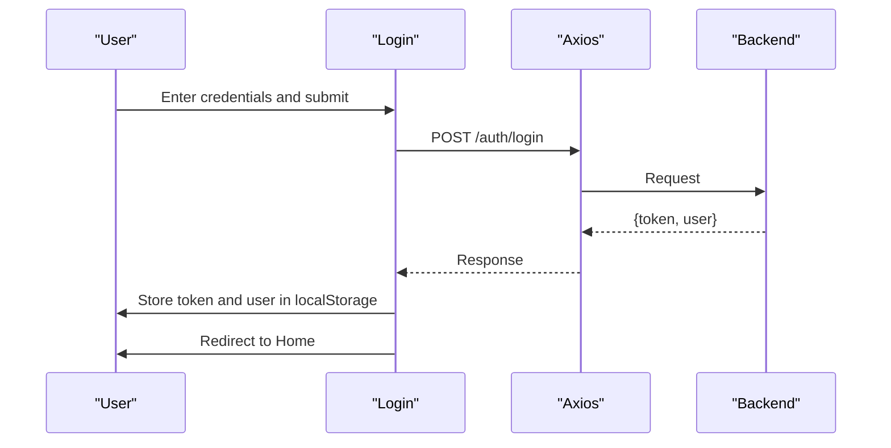
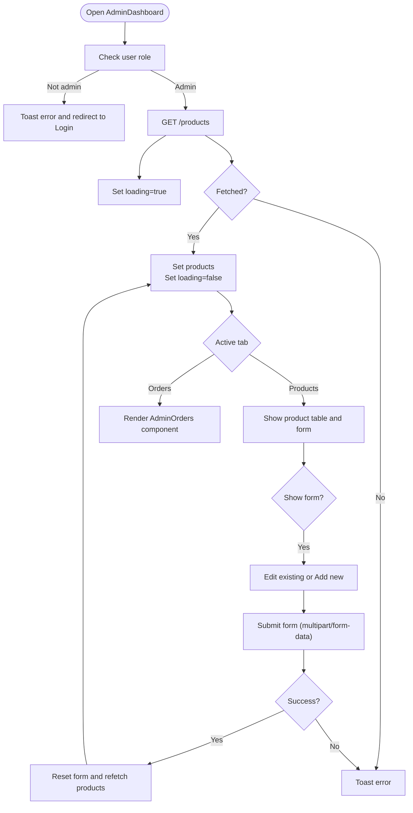
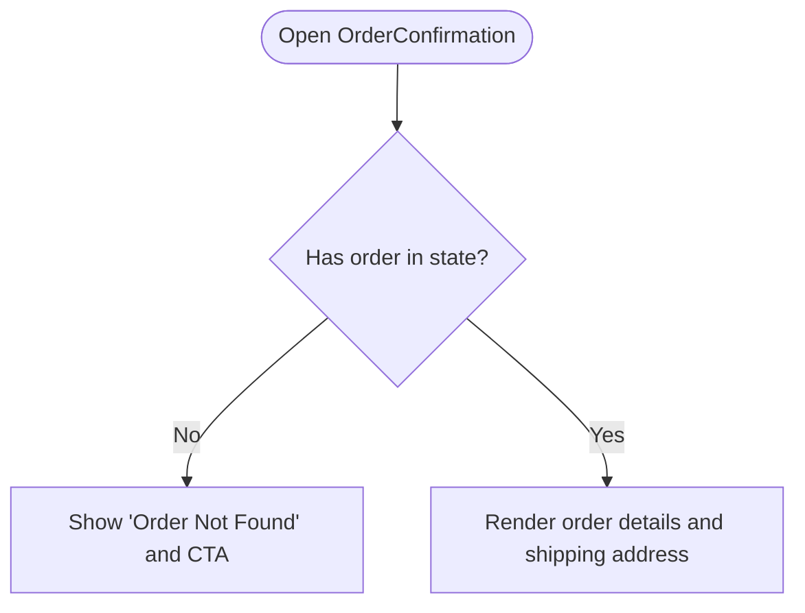
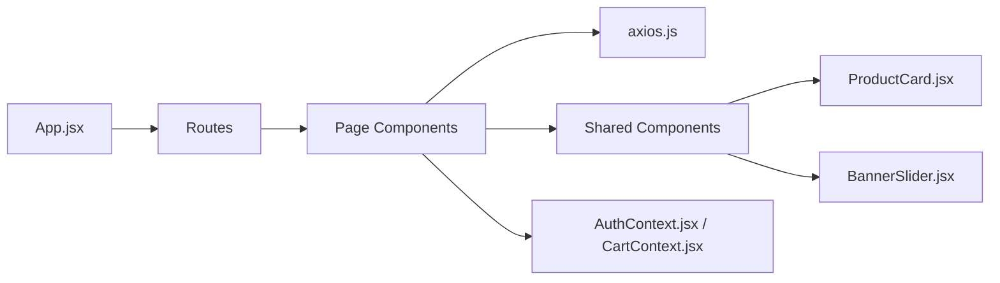

# Page Components

<cite>
**Referenced Files in This Document**
- [App.jsx](file://frontend/src/App.jsx)
- [Home.jsx](file://frontend/src/pages/Home.jsx)
- [ProductDetails.jsx](file://frontend/src/pages/ProductDetails.jsx)
- [Cart.jsx](file://frontend/src/pages/Cart.jsx)
- [Checkout.jsx](file://frontend/src/pages/Checkout.jsx)
- [Login.jsx](file://frontend/src/pages/Login.jsx)
- [Register.jsx](file://frontend/src/pages/Register.jsx)
- [AdminDashboard.jsx](file://frontend/src/pages/AdminDashboard.jsx)
- [OrderConfirmation.jsx](file://frontend/src/pages/OrderConfirmation.jsx)
- [axios.js](file://frontend/src/api/axios.js)
- [AuthContext.jsx](file://frontend/src/context/AuthContext.jsx)
- [CartContext.jsx](file://frontend/src/context/CartContext.jsx)
- [ImageCarousel.jsx](file://frontend/src/components/ImageCarousel.jsx)
- [BannerSlider.jsx](file://frontend/src/components/BannerSlider.jsx)
- [ManualUPI.jsx](file://frontend/src/components/ManualUPI.jsx)
- [Footer.jsx](file://frontend/src/components/Footer.jsx)
- [ProductCard.jsx](file://frontend/src/components/ProductCard.jsx)
</cite>

## Update Summary
**Changes Made**
- Updated Home page documentation to reflect responsive grid system implementation
- Added detailed explanation of mobile-first grid layout with 2-column design
- Updated grid spacing and responsive breakpoint information
- Enhanced product card styling documentation for mobile optimization

## Table of Contents
1. [Introduction](#introduction)
2. [Project Structure](#project-structure)
3. [Core Components](#core-components)
4. [Architecture Overview](#architecture-overview)
5. [Detailed Component Analysis](#detailed-component-analysis)
6. [Dependency Analysis](#dependency-analysis)
7. [Performance Considerations](#performance-considerations)
8. [Troubleshooting Guide](#troubleshooting-guide)
9. [Conclusion](#conclusion)

## Introduction
This document provides comprehensive documentation for the e-commerce app's page-level React components. It covers the Home, ProductDetails, Cart, Checkout, Login, Register, AdminDashboard, and OrderConfirmation pages. For each page, we explain component structure, props handling, state management, backend integration, routing configuration, navigation patterns, and user flows. We also detail page-specific features such as product filtering, cart operations, checkout validation, and admin functionality. Responsive design considerations, loading states, and UX patterns are addressed to help developers and stakeholders understand how the frontend behaves and integrates with the backend.

## Project Structure
The frontend is organized around pages, shared components, contexts for global state, and API configuration. Pages are routed under the main App shell, which renders a navigation bar and footer. Shared components encapsulate reusable UI elements like carousels and banners. Context providers manage authentication and cart state globally.



**Diagram sources**
- [App.jsx:19-66](file://frontend/src/App.jsx#L19-L66)
- [Home.jsx:1-107](file://frontend/src/pages/Home.jsx#L1-L107)
- [ProductDetails.jsx:1-80](file://frontend/src/pages/ProductDetails.jsx#L1-L80)
- [Cart.jsx:1-152](file://frontend/src/pages/Cart.jsx#L1-L152)
- [Checkout.jsx:1-301](file://frontend/src/pages/Checkout.jsx#L1-L301)
- [Login.jsx:1-56](file://frontend/src/pages/Login.jsx#L1-L56)
- [Register.jsx:1-67](file://frontend/src/pages/Register.jsx#L1-L67)
- [AdminDashboard.jsx:1-259](file://frontend/src/pages/AdminDashboard.jsx#L1-L259)
- [OrderConfirmation.jsx:1-73](file://frontend/src/pages/OrderConfirmation.jsx#L1-L73)
- [ImageCarousel.jsx:1-54](file://frontend/src/components/ImageCarousel.jsx#L1-L54)
- [BannerSlider.jsx:1-153](file://frontend/src/components/BannerSlider.jsx#L1-L153)
- [ManualUPI.jsx:1-125](file://frontend/src/components/ManualUPI.jsx#L1-L125)
- [Footer.jsx:1-155](file://frontend/src/components/Footer.jsx#L1-L155)
- [axios.js:1-17](file://frontend/src/api/axios.js#L1-L17)
- [AuthContext.jsx:1-33](file://frontend/src/context/AuthContext.jsx#L1-L33)
- [CartContext.jsx:1-53](file://frontend/src/context/CartContext.jsx#L1-L53)
- [ProductCard.jsx:1-111](file://frontend/src/components/ProductCard.jsx#L1-L111)

**Section sources**
- [App.jsx:19-66](file://frontend/src/App.jsx#L19-L66)

## Core Components
This section summarizes the primary page components and their responsibilities:
- Home: Renders hero banner, product listing with responsive grid system, search, and category filtering; integrates with product and cart APIs.
- ProductDetails: Fetches and displays a single product with image carousel and add-to-cart action.
- Cart: Lists cart items, calculates totals, checks shipping availability by pincode, and navigates to checkout.
- Checkout: Collects shipping address, selects payment method (Razorpay online, UPI manual, Cash on Delivery), validates inputs, and places orders.
- Login/Register: Handles user authentication and stores tokens/users in localStorage.
- AdminDashboard: Manages products (CRUD) and views orders; enforces admin role.
- OrderConfirmation: Displays order summary and shipping address after successful order placement.

**Section sources**
- [Home.jsx:7-107](file://frontend/src/pages/Home.jsx#L7-L107)
- [ProductDetails.jsx:6-80](file://frontend/src/pages/ProductDetails.jsx#L6-L80)
- [Cart.jsx:6-152](file://frontend/src/pages/Cart.jsx#L6-L152)
- [Checkout.jsx:7-301](file://frontend/src/pages/Checkout.jsx#L7-L301)
- [Login.jsx:5-56](file://frontend/src/pages/Login.jsx#L5-L56)
- [Register.jsx:5-67](file://frontend/src/pages/Register.jsx#L5-L67)
- [AdminDashboard.jsx:8-259](file://frontend/src/pages/AdminDashboard.jsx#L8-L259)
- [OrderConfirmation.jsx:3-73](file://frontend/src/pages/OrderConfirmation.jsx#L3-L73)

## Architecture Overview
The pages integrate with a centralized Axios client that injects Authorization headers from localStorage. Authentication and cart state are optionally managed via context providers. Routing is handled by React Router with a main App shell that includes navigation and footer.



**Diagram sources**
- [App.jsx:48-57](file://frontend/src/App.jsx#L48-L57)
- [axios.js:4-16](file://frontend/src/api/axios.js#L4-L16)

**Section sources**
- [App.jsx:19-66](file://frontend/src/App.jsx#L19-L66)
- [axios.js:1-17](file://frontend/src/api/axios.js#L1-L17)

## Detailed Component Analysis

### Home Page
- Purpose: Display promotional banner, searchable product grid with responsive layout, and category filters; enable adding items to cart.
- State:
  - categories: fetched category list
  - productsByCategory: grouped products by category
  - loading: indicates initial fetch
  - searchTerm: controlled input for search
- Data fetching: GET /categories and GET /categories/slug/:slug/products on mount; sets loading and products.
- Filtering: client-side filter by name/description and category.
- Grid System: **Updated** Responsive 2-column grid on mobile with increased spacing (gap-3), 3-column on tablet (md:gap-4), and 4-column on desktop (lg:gap-6).
- Cart integration: POST /cart/add with productId and quantity; handles unauthenticated users.
- UI: BannerSlider, ProductCard components with mobile-optimized design, category headers with gradient dividers.

**Updated** The Home page has been optimized with a responsive grid system that replaces horizontal scrolling. The new implementation uses Tailwind CSS grid classes with progressive enhancement:
- Mobile: `grid grid-cols-2` with `gap-3` spacing
- Tablet: `md:grid-cols-2` with `md:gap-4` spacing  
- Desktop: `lg:grid-cols-3` with `lg:gap-6` spacing
- Large screens: `xl:grid-cols-4` for optimal desktop experience



**Diagram sources**
- [Home.jsx:15-41](file://frontend/src/pages/Home.jsx#L15-L41)
- [Home.jsx:87-96](file://frontend/src/pages/Home.jsx#L87-L96)

**Section sources**
- [Home.jsx:7-107](file://frontend/src/pages/Home.jsx#L7-L107)
- [BannerSlider.jsx:31-153](file://frontend/src/components/BannerSlider.jsx#L31-L153)
- [ProductCard.jsx:35-111](file://frontend/src/components/ProductCard.jsx#L35-L111)

### ProductDetails Page
- Purpose: Show detailed product information and allow adding to cart.
- State:
  - product: fetched product object
  - loading: indicates initial fetch
- Data fetching: GET /products/:id on id change; sets loading and product.
- Cart integration: POST /cart/add with productId and quantity; handles unauthenticated users.
- UI: ImageCarousel, availability badge, add-to-cart button disabled when out of stock.

```mermaid
sequenceDiagram
participant User as "User"
participant Details as "ProductDetails"
participant API as "Axios"
participant Backend as "Backend"
User->>Details : Open product URL
Details->>API : GET /products/ : id
API->>Backend : Request
Backend-->>API : Product data
API-->>Details : Product object
Details->>Details : Set loading=false and render
User->>Details : Click "Add to Cart"
Details->>API : POST /cart/add {productId, quantity}
API->>Backend : Request
Backend-->>API : Success/Error
API-->>Details : Result
Details->>User : Show alert based on outcome
```

**Diagram sources**
- [ProductDetails.jsx:11-24](file://frontend/src/pages/ProductDetails.jsx#L11-L24)
- [ProductDetails.jsx:26-33](file://frontend/src/pages/ProductDetails.jsx#L26-L33)

**Section sources**
- [ProductDetails.jsx:6-80](file://frontend/src/pages/ProductDetails.jsx#L6-L80)
- [ImageCarousel.jsx:4-54](file://frontend/src/components/ImageCarousel.jsx#L4-L54)

### Cart Page
- Purpose: List cart items, compute totals, estimate shipping by pincode, and proceed to checkout.
- State:
  - cart: items and derived totals
  - loading: initial fetch
  - pincode: input for shipping estimation
  - shippingInfo: calculated shipping details
  - checkingShipping: loading flag during estimation
- Data fetching:
  - GET /cart on mount
  - POST /shipping/calculate with pincode and cartTotal
- Totals: subtotal from items, shippingCharge from shippingInfo, total = subtotal + shipping.
- UI: Item list with thumbnails, order summary panel, pincode checker, and proceed-to-checkout button.



**Diagram sources**
- [Cart.jsx:13-26](file://frontend/src/pages/Cart.jsx#L13-L26)
- [Cart.jsx:35-53](file://frontend/src/pages/Cart.jsx#L35-L53)
- [Cart.jsx:136-144](file://frontend/src/pages/Cart.jsx#L136-L144)

**Section sources**
- [Cart.jsx:6-152](file://frontend/src/pages/Cart.jsx#L6-L152)

### Checkout Page
- Purpose: Collect shipping address, select payment method, validate inputs, and place orders.
- State:
  - cart: items loaded from API
  - loading: initial fetch
  - processing: prevents duplicate submissions
  - paymentMethod: selected option (razorpay, upi, cod)
  - address: form state for shipping address
- Precondition: Requires user to be logged in; otherwise redirects to Login.
- Data fetching:
  - GET /cart to ensure cart integrity
  - Razorpay: POST /orders/razorpay/order to create order, verify with /orders/razorpay/verify
  - COD/UPI: POST /orders/create with shippingAddress and totals
- Validation: Required fields, phone length, and shippingInfo presence.
- UI: Address form, order summary with shipping info, payment method radios, ManualUPI component for UPI.



**Diagram sources**
- [Checkout.jsx:22-43](file://frontend/src/pages/Checkout.jsx#L22-L43)
- [Checkout.jsx:88-137](file://frontend/src/pages/Checkout.jsx#L88-L137)
- [Checkout.jsx:139-165](file://frontend/src/pages/Checkout.jsx#L139-L165)

**Section sources**
- [Checkout.jsx:7-301](file://frontend/src/pages/Checkout.jsx#L7-L301)
- [ManualUPI.jsx:4-125](file://frontend/src/components/ManualUPI.jsx#L4-L125)

### Login and Register Pages
- Login:
  - State: email, password
  - On submit: POST /auth/login, store token and user in localStorage, redirect to Home
  - Error handling: alerts on invalid credentials
- Register:
  - State: name, email, password
  - On submit: POST /auth/register, store token and user in localStorage, redirect to Home
  - Error handling: alerts on failure



**Diagram sources**
- [Login.jsx:10-21](file://frontend/src/pages/Login.jsx#L10-L21)

**Section sources**
- [Login.jsx:5-56](file://frontend/src/pages/Login.jsx#L5-L56)
- [Register.jsx:5-67](file://frontend/src/pages/Register.jsx#L5-L67)

### AdminDashboard Page
- Purpose: Admin-only product management and order viewing.
- Access control: Reads user from localStorage; redirects non-admins to Login.
- State:
  - activeTab: products/orders
  - products: fetched product list
  - showForm/editingProduct: controls product form visibility
  - formData: form state for product creation/edit
  - images/imagePreviews: image upload handling
  - uploading/loading
- Data fetching: GET /products for product list.
- Actions: Add/Edit/Delete products; enforce image limits; toast notifications; refetch list after changes.
- UI: Tabbed interface, product table with edit/delete, image preview, and form.



**Diagram sources**
- [AdminDashboard.jsx:27-51](file://frontend/src/pages/AdminDashboard.jsx#L27-L51)
- [AdminDashboard.jsx:69-95](file://frontend/src/pages/AdminDashboard.jsx#L69-L95)
- [AdminDashboard.jsx:97-120](file://frontend/src/pages/AdminDashboard.jsx#L97-L120)

**Section sources**
- [AdminDashboard.jsx:8-259](file://frontend/src/pages/AdminDashboard.jsx#L8-L259)

### OrderConfirmation Page
- Purpose: Display order details and shipping address after successful order placement.
- State: order retrieved from location state.
- Behavior: If no order in state, prompt to continue shopping; otherwise render order summary and shipping info.



**Diagram sources**
- [OrderConfirmation.jsx:3-14](file://frontend/src/pages/OrderConfirmation.jsx#L3-L14)
- [OrderConfirmation.jsx:16-72](file://frontend/src/pages/OrderConfirmation.jsx#L16-L72)

**Section sources**
- [OrderConfirmation.jsx:3-73](file://frontend/src/pages/OrderConfirmation.jsx#L3-L73)

## Dependency Analysis
- Routing: App defines routes for all pages and renders them conditionally.
- API: All pages depend on a shared Axios client configured with base URL and Authorization header injection.
- Context:
  - AuthContext: optional provider for login/logout and user state; pages can use it or rely on localStorage.
  - CartContext: optional provider for cart operations and totals; pages can use it or call API directly.
- Shared components: ProductCard and BannerSlider are reused across pages to maintain consistent UX with responsive grid layouts.



**Diagram sources**
- [App.jsx:48-57](file://frontend/src/App.jsx#L48-L57)
- [axios.js:1-17](file://frontend/src/api/axios.js#L1-L17)
- [ProductCard.jsx:35-111](file://frontend/src/components/ProductCard.jsx#L35-L111)
- [BannerSlider.jsx:31-153](file://frontend/src/components/BannerSlider.jsx#L31-L153)
- [AuthContext.jsx:6-31](file://frontend/src/context/AuthContext.jsx#L6-L31)
- [CartContext.jsx:7-50](file://frontend/src/context/CartContext.jsx#L7-L50)

**Section sources**
- [App.jsx:19-66](file://frontend/src/App.jsx#L19-L66)
- [axios.js:1-17](file://frontend/src/api/axios.js#L1-L17)

## Performance Considerations
- Client-side filtering: Home page filters products locally; keep product lists reasonably sized to avoid heavy computations on large datasets.
- Responsive grid optimization: **Updated** The new grid system reduces layout thrashing by using CSS Grid instead of horizontal scrolling, improving performance on mobile devices.
- Lazy loading images: Use lazy attributes on images rendered in grids and carousels to improve initial load performance.
- Debounced search: Consider debouncing search input to reduce frequent re-renders and API calls.
- Memoization: For frequently changing UI, memoize derived values like totals to prevent unnecessary recalculations.
- Minimize re-renders: Use stable references for callbacks and avoid inline function definitions inside render where possible.
- Toast usage: Limit concurrent toasts to reduce layout thrashing.

## Troubleshooting Guide
- Authentication errors:
  - 401 responses automatically remove token from localStorage; ensure pages handle redirects gracefully.
  - Login/Register should display user-friendly alerts on failures.
- Cart operations:
  - If adding to cart fails, verify user is logged in; fallback alerts guide users to login.
  - Cart totals should be recalculated after updates; ensure UI reflects changes.
- Checkout validation:
  - Validate required fields and phone length before placing orders.
  - Ensure shippingInfo is present before enabling "Proceed to Checkout".
- Razorpay integration:
  - Load the checkout script dynamically; handle modal dismissal and verification errors.
- UPI manual payments:
  - Require transaction ID; provide QR generation fallback and copy-to-clipboard.
- Admin access:
  - Enforce admin role checks; redirect unauthorized users to Login.
- **Updated** Grid layout issues:
  - Verify Tailwind CSS is properly configured for responsive breakpoints.
  - Check that grid classes are applied correctly: `grid grid-cols-2 md:grid-cols-2 lg:grid-cols-3 xl:grid-cols-4`.
  - Ensure adequate spacing with `gap-3 md:gap-4 lg:gap-6` for optimal mobile and desktop experience.

**Section sources**
- [axios.js:10-16](file://frontend/src/api/axios.js#L10-L16)
- [Login.jsx:18-21](file://frontend/src/pages/Login.jsx#L18-L21)
- [Register.jsx:19-22](file://frontend/src/pages/Register.jsx#L19-L22)
- [Cart.jsx:35-53](file://frontend/src/pages/Cart.jsx#L35-L53)
- [Checkout.jsx:167-177](file://frontend/src/pages/Checkout.jsx#L167-L177)
- [Checkout.jsx:88-137](file://frontend/src/pages/Checkout.jsx#L88-L137)
- [AdminDashboard.jsx:34-40](file://frontend/src/pages/AdminDashboard.jsx#L34-L40)
- [Home.jsx:87-96](file://frontend/src/pages/Home.jsx#L87-L96)

## Conclusion
The e-commerce app's page components are structured around clear responsibilities, consistent data fetching patterns, and robust error handling. Routing, shared components, and optional context providers enable scalable development. **Updated** The Home page optimization with responsive grid system significantly improves mobile usability while maintaining desktop performance. By following the documented patterns for state management, API integration, and user flows, teams can extend functionality while maintaining a cohesive user experience across devices.