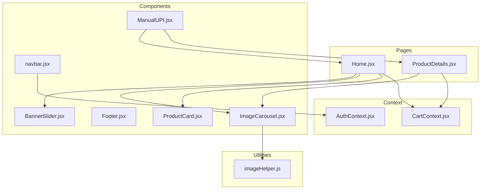
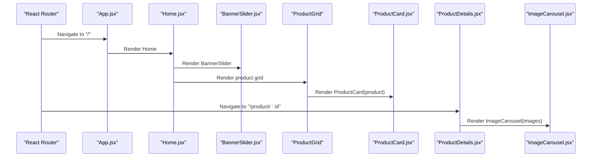
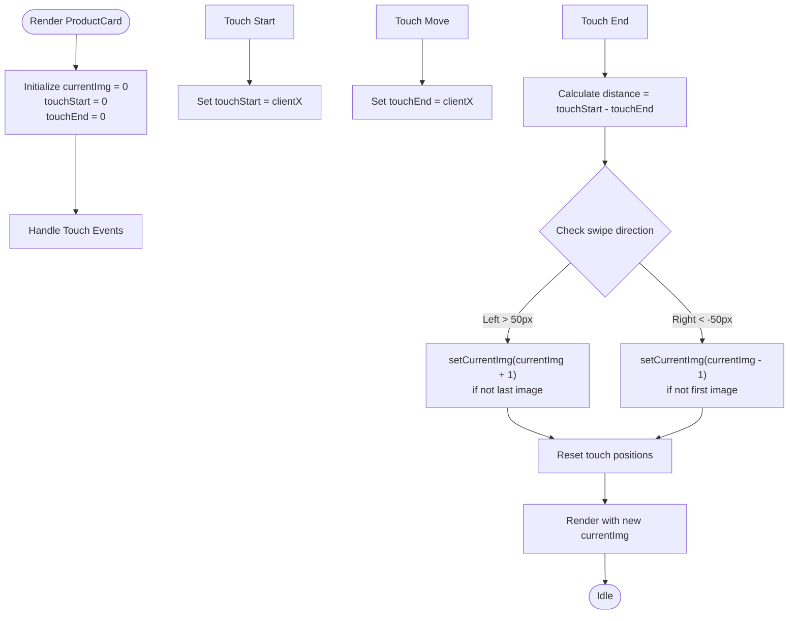
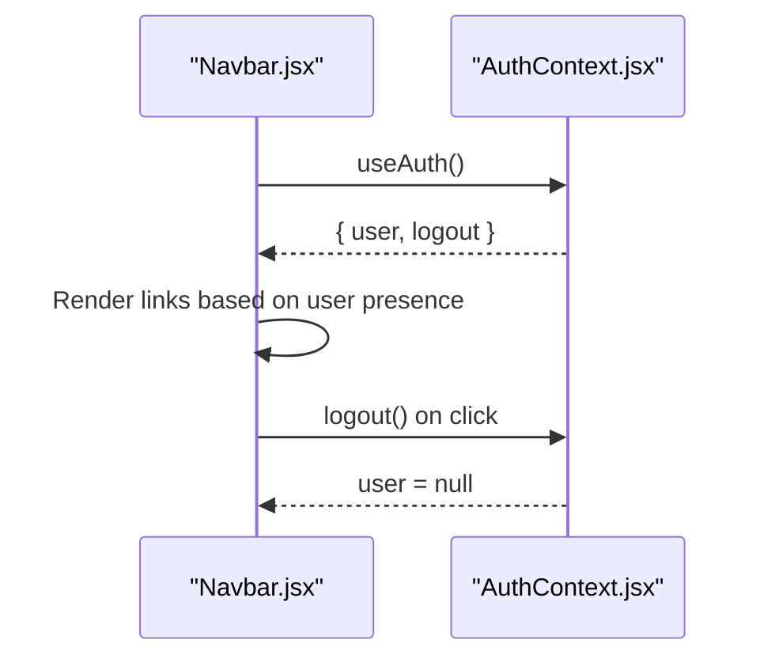
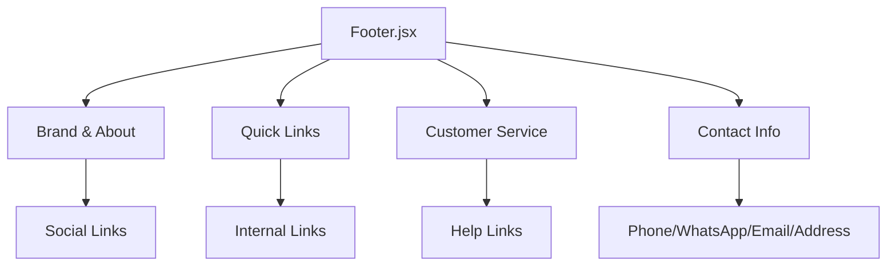
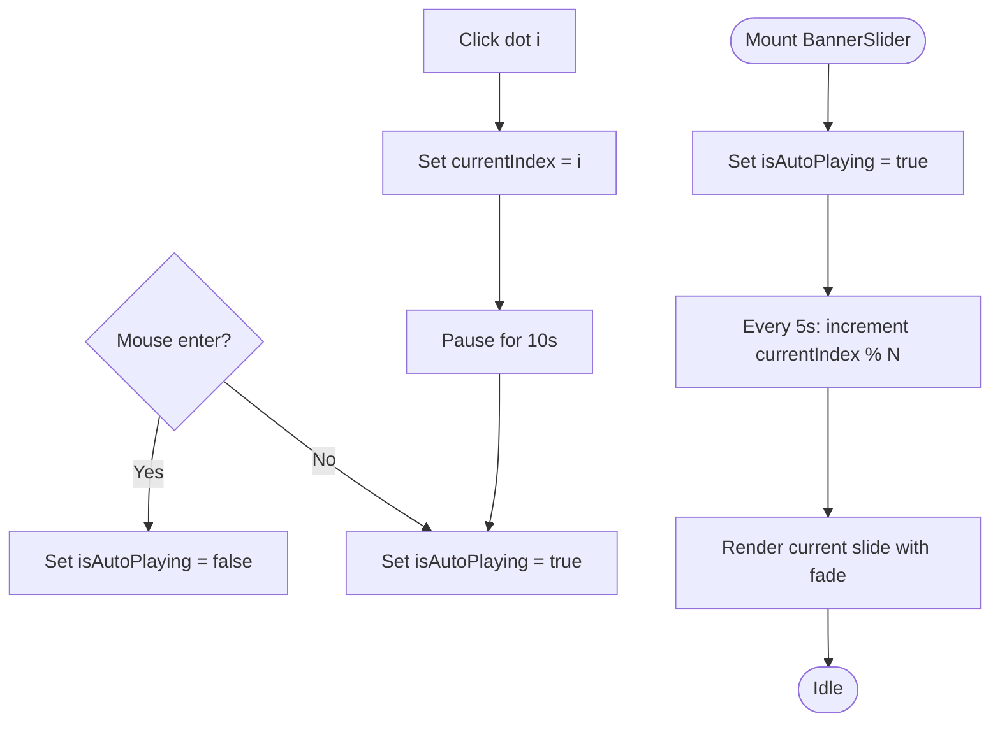
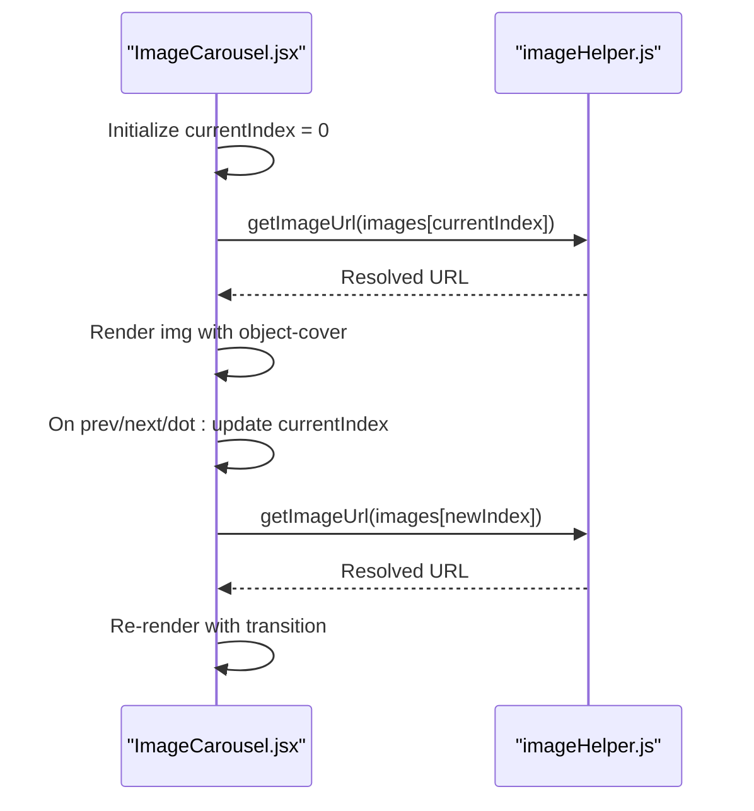
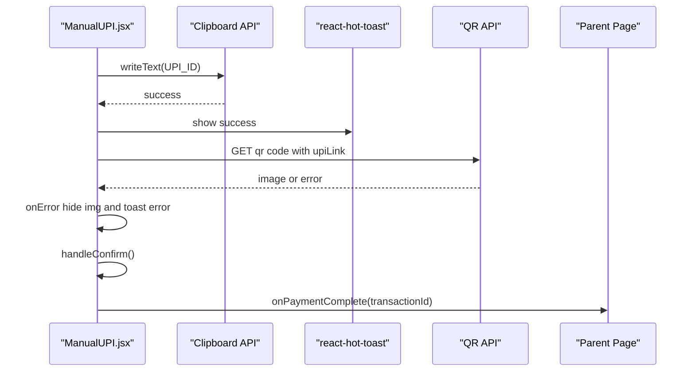
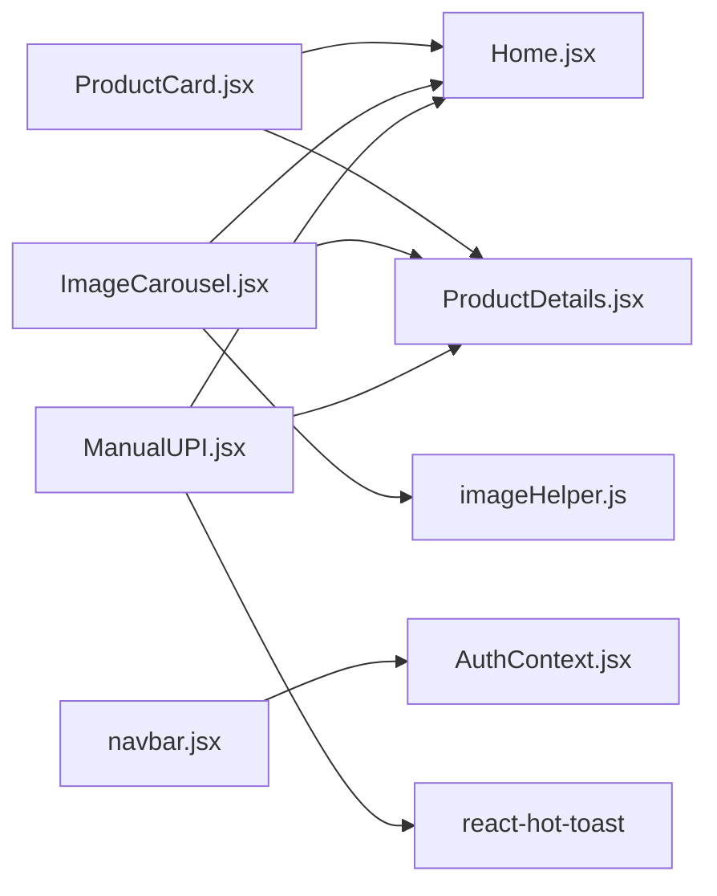

# Reusable UI Components

<cite>
**Referenced Files in This Document**
- [ProductCard.jsx](file://frontend/src/components/ProductCard.jsx)
- [navbar.jsx](file://frontend/src/components/navbar.jsx)
- [Footer.jsx](file://frontend/src/components/Footer.jsx)
- [BannerSlider.jsx](file://frontend/src/components/BannerSlider.jsx)
- [ImageCarousel.jsx](file://frontend/src/components/ImageCarousel.jsx)
- [ManualUPI.jsx](file://frontend/src/components/ManualUPI.jsx)
- [AuthContext.jsx](file://frontend/src/context/AuthContext.jsx)
- [CartContext.jsx](file://frontend/src/context/CartContext.jsx)
- [Home.jsx](file://frontend/src/pages/Home.jsx)
- [ProductDetails.jsx](file://frontend/src/pages/ProductDetails.jsx)
- [App.jsx](file://frontend/src/App.jsx)
- [imageHelper.js](file://frontend/src/utils/imageHelper.js)
- [index.css](file://frontend/src/index.css)
- [tailwind.config.js](file://frontend/tailwind.config.js)
</cite>

## Update Summary
**Changes Made**
- Enhanced ProductCard component with native touch swipe functionality for mobile devices
- Replaced hover-based image navigation system with touch gesture support
- Updated styling optimizations for mobile responsiveness including reduced padding
- Simplified stock badges for better mobile experience
- Improved lazy loading implementation with better image handling

## Table of Contents
1. [Introduction](#introduction)
2. [Project Structure](#project-structure)
3. [Core Components](#core-components)
4. [Architecture Overview](#architecture-overview)
5. [Detailed Component Analysis](#detailed-component-analysis)
6. [Dependency Analysis](#dependency-analysis)
7. [Performance Considerations](#performance-considerations)
8. [Troubleshooting Guide](#troubleshooting-guide)
9. [Conclusion](#conclusion)
10. [Appendices](#appendices)

## Introduction
This document describes the reusable React UI components used across the e-commerce application's frontend. It focuses on:
- ProductCard for displaying product tiles with enhanced mobile touch swipe functionality
- Navbar for navigation
- Footer for site footer
- BannerSlider for hero sections
- ImageCarousel for product galleries
- ManualUPI for payment methods

For each component, we explain props, event handlers, styling patterns using TailwindCSS, reusability across pages, accessibility features, responsive design, and performance considerations. We also provide usage examples with code snippet paths and show how components integrate with context providers and page layouts.

## Project Structure
The reusable components live under frontend/src/components and are consumed by page components under frontend/src/pages. Styling is powered by TailwindCSS configured in tailwind.config.js and enabled via index.css. Utility helpers (like image URL normalization) reside under frontend/src/utils.

**Diagram sources**
- [Home.jsx](file://frontend/src/pages/Home.jsx)
- [ProductDetails.jsx](file://frontend/src/pages/ProductDetails.jsx)
- [ProductCard.jsx](file://frontend/src/components/ProductCard.jsx)
- [navbar.jsx](file://frontend/src/components/navbar.jsx)
- [Footer.jsx](file://frontend/src/components/Footer.jsx)
- [BannerSlider.jsx](file://frontend/src/components/BannerSlider.jsx)
- [ImageCarousel.jsx](file://frontend/src/components/ImageCarousel.jsx)
- [ManualUPI.jsx](file://frontend/src/components/ManualUPI.jsx)
- [AuthContext.jsx](file://frontend/src/context/AuthContext.jsx)
- [CartContext.jsx](file://frontend/src/context/CartContext.jsx)
- [imageHelper.js](file://frontend/src/utils/imageHelper.js)

**Section sources**
- [index.css](file://frontend/src/index.css)
- [tailwind.config.js](file://frontend/tailwind.config.js)

## Core Components
This section summarizes each component's purpose, props, events, styling patterns, and reusability.

- ProductCard
  - Purpose: Render a single product tile with enhanced mobile touch swipe functionality, image gallery, pricing, and action buttons.
  - Props: product (object with images[], name, price, _id, stock).
  - Events: "Details" link navigates to product route; "Add to Cart" button triggers cart action; touch gestures enable image navigation on mobile devices.
  - Styling: Tailwind utilities for borders, shadows, hover effects, transitions, and opacity/visibility toggles with mobile-optimized padding and simplified stock badges.
  - Reusability: Used inside Home page product grid and ProductDetails page promotional cards.

- Navbar
  - Purpose: Site navigation bar with brand identity, links, and auth-aware actions.
  - Props: none (consumes AuthContext).
  - Events: Logout handler via AuthContext; conditional rendering for logged-in/admin users.
  - Styling: Tailwind for layout, spacing, hover states, and color accents.
  - Reusability: Included at the top of the main App shell.

- Footer
  - Purpose: Multi-column footer with branding, quick links, customer service, and contact info.
  - Props: none.
  - Events: External links open in new tabs; internal links via React Router.
  - Styling: Responsive grid layout with Tailwind; hover transitions and accent colors.
  - Reusability: Included at the bottom of the main App shell.

- BannerSlider
  - Purpose: Auto-rotating hero banner with overlay content, CTA, arrows, dots, and progress indicator.
  - Props: none.
  - Events: Previous/next navigation; dot selection; pause/resume on hover.
  - Styling: Gradient overlays, centered content, backdrop blur, transitions, and hover-triggered visibility.
  - Reusability: Used on Home page hero area.

- ImageCarousel
  - Purpose: Single-product image viewer with navigation arrows, indicators, and lazy image resolution.
  - Props: images (array), alt (string), height (Tailwind height class).
  - Events: Previous/next navigation; dot selection.
  - Styling: Tailwind for container sizing, transitions, and hover-triggered controls.
  - Reusability: Used on Home and ProductDetails pages.

- ManualUPI
  - Purpose: UPI-based manual payment method with QR toggle, transaction ID capture, and help link.
  - Props: amount (number), onPaymentComplete(transactionId) callback.
  - Events: Copy UPI ID; show/hide QR; confirm payment; open WhatsApp help.
  - Styling: Card layout with Tailwind; disabled states; feedback via toast.
  - Reusability: Used on Checkout and Order Confirmation pages.

**Section sources**
- [ProductCard.jsx](file://frontend/src/components/ProductCard.jsx)
- [navbar.jsx](file://frontend/src/components/navbar.jsx)
- [Footer.jsx](file://frontend/src/components/Footer.jsx)
- [BannerSlider.jsx](file://frontend/src/components/BannerSlider.jsx)
- [ImageCarousel.jsx](file://frontend/src/components/ImageCarousel.jsx)
- [ManualUPI.jsx](file://frontend/src/components/ManualUPI.jsx)

## Architecture Overview
The components are composed within page layouts and connected to global contexts for authentication and cart state. The main App sets up routing and renders shared UI (Navbar and Footer). Page components import and pass data to reusable components.

**Diagram sources**
- [App.jsx](file://frontend/src/App.jsx)
- [Home.jsx](file://frontend/src/pages/Home.jsx)
- [ProductDetails.jsx](file://frontend/src/pages/ProductDetails.jsx)
- [BannerSlider.jsx](file://frontend/src/components/BannerSlider.jsx)
- [ProductCard.jsx](file://frontend/src/components/ProductCard.jsx)
- [ImageCarousel.jsx](file://frontend/src/components/ImageCarousel.jsx)

## Detailed Component Analysis

### ProductCard
- Purpose: Display a product card with enhanced mobile touch swipe functionality, image gallery, pricing, and actions.
- Props:
  - product: object with images[], name, price, _id, stock.
- State:
  - currentImg: index of currently visible image.
  - touchStart: initial touch position for swipe detection.
  - touchEnd: current touch position during swipe movement.
- Interactions:
  - **Enhanced**: Native touch swipe functionality for mobile devices with horizontal gesture detection.
  - **Legacy**: Hover group reveals navigation dots; clicking a dot switches the image.
  - "Details" navigates to product route; "Add to Cart" triggers cart action.
  - Touch swipe gestures: left swipe advances to next image, right swipe goes to previous image.
- Styling:
  - Tailwind classes for border, padding, shadow, hover elevation, transitions, and opacity-based image switching.
  - **Mobile Optimized**: Reduced padding (p-3) for better mobile screen utilization.
  - **Simplified Stock Badges**: Compact badge design with reduced font size (text-[10px]) for better mobile readability.
- Accessibility:
  - Images use descriptive alt text derived from product name with slide number indication.
  - Touch targets sized appropriately for mobile interaction.
- Reusability:
  - Used in Home page product grid and ProductDetails promotional cards.

**Updated** Enhanced with native touch swipe functionality for mobile devices, replacing hover-based image navigation system. Added mobile-optimized styling with reduced padding and simplified stock badges.

**Diagram sources**
- [ProductCard.jsx](file://frontend/src/components/ProductCard.jsx)

**Section sources**
- [ProductCard.jsx](file://frontend/src/components/ProductCard.jsx)
- [Home.jsx](file://frontend/src/pages/Home.jsx)
- [ProductDetails.jsx](file://frontend/src/pages/ProductDetails.jsx)

### Navbar
- Purpose: Provide primary navigation and auth-aware actions.
- Props: none.
- State: Consumes AuthContext (user, login, logout).
- Interactions:
  - Conditional links for anonymous/logged-in users.
  - Admin-only "Admin" link when user.role === 'admin'.
  - Logout handler clears local storage and updates context.
- Styling:
  - Tailwind for layout, spacing, hover accents, and responsive alignment.
- Accessibility:
  - Uses semantic Link components for navigation.
- Reusability:
  - Included in App shell and can be extended per-page.

**Diagram sources**
- [navbar.jsx](file://frontend/src/components/navbar.jsx)
- [AuthContext.jsx](file://frontend/src/context/AuthContext.jsx)

**Section sources**
- [navbar.jsx](file://frontend/src/components/navbar.jsx)
- [AuthContext.jsx](file://frontend/src/context/AuthContext.jsx)
- [App.jsx](file://frontend/src/App.jsx)

### Footer
- Purpose: Multi-column footer with branding, links, and contact info.
- Props: none.
- Interactions:
  - External links open in new tabs with rel="noopener noreferrer".
  - Internal links via React Router.
- Styling:
  - Responsive grid (1 column on small screens, 4 on large).
  - Hover transitions for links and social icons.
- Accessibility:
  - Semantic headings and lists; external links include appropriate attributes.
- Reusability:
  - Included at the bottom of the main App shell.

**Diagram sources**
- [Footer.jsx](file://frontend/src/components/Footer.jsx)

**Section sources**
- [Footer.jsx](file://frontend/src/components/Footer.jsx)
- [App.jsx](file://frontend/src/App.jsx)

### BannerSlider
- Purpose: Hero banner with auto-rotation, manual controls, and progress indicator.
- Props: none.
- State:
  - currentIndex: active slide index.
  - isAutoPlaying: pause/resume flag.
- Interactions:
  - Previous/Next buttons; dot indicators; mouse enter/leave pauses/resumes.
  - Auto-advance every 5 seconds; resumes after user interaction delay.
- Styling:
  - Gradient overlay, centered content, backdrop blur, transitions, and hover-triggered controls.
- Accessibility:
  - Buttons include aria-label attributes.
- Reusability:
  - Used on Home page hero area.

**Diagram sources**
- [BannerSlider.jsx](file://frontend/src/components/BannerSlider.jsx)

**Section sources**
- [BannerSlider.jsx](file://frontend/src/components/BannerSlider.jsx)
- [Home.jsx](file://frontend/src/pages/Home.jsx)

### ImageCarousel
- Purpose: Single-product image carousel with navigation and indicators.
- Props:
  - images: array of image paths/URLs.
  - alt: string for alt text.
  - height: Tailwind height class (default h-64).
- State:
  - currentIndex: current slide index.
- Interactions:
  - Previous/Next buttons; dot indicators; safe wrap-around.
  - Uses imageHelper to resolve image URLs.
- Styling:
  - Tailwind for container sizing, transitions, and hover-triggered controls.
- Accessibility:
  - Buttons include aria-label; alt text includes slide number.
- Reusability:
  - Used on Home and ProductDetails pages.

**Diagram sources**
- [ImageCarousel.jsx](file://frontend/src/components/ImageCarousel.jsx)
- [imageHelper.js](file://frontend/src/utils/imageHelper.js)

**Section sources**
- [ImageCarousel.jsx](file://frontend/src/components/ImageCarousel.jsx)
- [imageHelper.js](file://frontend/src/utils/imageHelper.js)
- [Home.jsx](file://frontend/src/pages/Home.jsx)
- [ProductDetails.jsx](file://frontend/src/pages/ProductDetails.jsx)

### ManualUPI
- Purpose: Manual UPI payment method with QR toggle, transaction ID capture, and help link.
- Props:
  - amount: number (payment amount).
  - onPaymentComplete(transactionId): callback invoked on confirm.
- State:
  - showQR: boolean to toggle QR display.
  - transactionId: string input for UTR.
- Interactions:
  - Copy UPI ID to clipboard with toast feedback.
  - Generate QR via third-party API; fallback on error.
  - Validate transaction ID before confirming.
  - Open WhatsApp help with prefilled message.
- Styling:
  - Card layout with Tailwind; disabled states; feedback via toast.
- Accessibility:
  - Input has label semantics; buttons include aria-labels.
- Reusability:
  - Used on Checkout and Order Confirmation pages.

**Diagram sources**
- [ManualUPI.jsx](file://frontend/src/components/ManualUPI.jsx)

**Section sources**
- [ManualUPI.jsx](file://frontend/src/components/ManualUPI.jsx)
- [App.jsx](file://frontend/src/App.jsx)

## Dependency Analysis
- Component coupling:
  - ProductCard depends on product shape; used in Home and ProductDetails.
  - ImageCarousel depends on imageHelper for URL normalization.
  - Navbar depends on AuthContext for user state and logout.
  - ManualUPI depends on react-hot-toast for notifications and external QR API.
- Cohesion:
  - Each component encapsulates its own state and styling, promoting high cohesion.
- External dependencies:
  - TailwindCSS for styling.
  - react-router-dom for navigation.
  - react-hot-toast for notifications.

**Diagram sources**
- [ProductCard.jsx](file://frontend/src/components/ProductCard.jsx)
- [ImageCarousel.jsx](file://frontend/src/components/ImageCarousel.jsx)
- [imageHelper.js](file://frontend/src/utils/imageHelper.js)
- [navbar.jsx](file://frontend/src/components/navbar.jsx)
- [AuthContext.jsx](file://frontend/src/context/AuthContext.jsx)
- [ManualUPI.jsx](file://frontend/src/components/ManualUPI.jsx)
- [Home.jsx](file://frontend/src/pages/Home.jsx)
- [ProductDetails.jsx](file://frontend/src/pages/ProductDetails.jsx)

**Section sources**
- [ProductCard.jsx](file://frontend/src/components/ProductCard.jsx)
- [ImageCarousel.jsx](file://frontend/src/components/ImageCarousel.jsx)
- [imageHelper.js](file://frontend/src/utils/imageHelper.js)
- [navbar.jsx](file://frontend/src/components/navbar.jsx)
- [AuthContext.jsx](file://frontend/src/context/AuthContext.jsx)
- [ManualUPI.jsx](file://frontend/src/components/ManualUPI.jsx)
- [Home.jsx](file://frontend/src/pages/Home.jsx)
- [ProductDetails.jsx](file://frontend/src/pages/ProductDetails.jsx)

## Performance Considerations
- Lazy image resolution:
  - ImageCarousel resolves image URLs via imageHelper, avoiding broken paths and enabling CDN-friendly URLs.
  - **Enhanced**: ProductCard uses lazy loading attribute (loading="lazy") for improved mobile performance.
- Minimal re-renders:
  - Components rely on local state and props; avoid unnecessary context subscriptions where not needed.
- Transitions and animations:
  - Use short durations and hardware-accelerated properties (opacity, transform) to keep animations smooth.
  - **Optimized**: ProductCard uses efficient CSS transitions with duration-300 for smooth image switching.
- Auto-play pausing:
  - BannerSlider pauses on hover and after user interaction to reduce CPU usage and improve UX.
- Mobile touch optimization:
  - **New**: Native touch swipe functionality reduces reliance on hover events, improving mobile user experience.
  - Touch gesture detection uses threshold-based approach (50px minimum swipe distance) for reliable interaction.
- Accessibility and responsiveness:
  - Tailwind utilities provide responsive breakpoints; ensure sufficient contrast and touch targets.
  - **Improved**: Reduced padding and simplified stock badges enhance mobile readability.
- Cross-browser compatibility:
  - Tailwind's default theme and unprefixed transitions offer broad support; test on target browsers.

## Troubleshooting Guide
- ImageCarousel shows placeholder or fails to load:
  - Verify images array is passed and imageHelper resolves valid URLs.
  - Ensure images are served from the expected origin/path.
- **ProductCard touch swipe not working**:
  - Verify touch event handlers are properly attached to the image container.
  - Check that product.images array contains valid image paths.
  - Ensure minimum swipe distance threshold (50px) is met for reliable gesture detection.
- **ProductCard mobile styling issues**:
  - Verify mobile-optimized padding (p-3) is applied correctly.
  - Check that simplified stock badges (text-[10px]) display properly on smaller screens.
- BannerSlider does not auto-advance:
  - Confirm isAutoPlaying is true and useEffect cleanup runs properly.
  - Check for hover interactions that pause the slider.
- ManualUPI QR fails to render:
  - The component hides the image and shows an error toast on error; retry or use UPI ID copy.
- Navbar logout not working:
  - Ensure AuthContext provider wraps the app and logout clears local storage keys.
- Toast notifications not appearing:
  - Confirm react-hot-toast Toaster is rendered at the root level.

**Section sources**
- [ProductCard.jsx](file://frontend/src/components/ProductCard.jsx)
- [ImageCarousel.jsx](file://frontend/src/components/ImageCarousel.jsx)
- [imageHelper.js](file://frontend/src/utils/imageHelper.js)
- [BannerSlider.jsx](file://frontend/src/components/BannerSlider.jsx)
- [ManualUPI.jsx](file://frontend/src/components/ManualUPI.jsx)
- [AuthContext.jsx](file://frontend/src/context/AuthContext.jsx)
- [App.jsx](file://frontend/src/App.jsx)

## Conclusion
These reusable components form the backbone of the e-commerce UI. They are:
- Prop-driven and self-contained
- Styled with TailwindCSS for consistency and responsiveness
- Integrated with context providers for authentication and cart state
- Designed with accessibility and performance in mind
- **Enhanced** with native mobile touch swipe functionality for improved user experience

By composing these components thoughtfully across pages, teams can maintain a cohesive, scalable, and user-friendly interface that works seamlessly across desktop and mobile devices.

## Appendices

### Usage Examples (with code snippet paths)
- Using ProductCard in Home page product grid:
  - [Home.jsx](file://frontend/src/pages/Home.jsx)
- Rendering BannerSlider on Home:
  - [Home.jsx](file://frontend/src/pages/Home.jsx)
  - [BannerSlider.jsx](file://frontend/src/components/BannerSlider.jsx)
- Using ImageCarousel in ProductDetails:
  - [ProductDetails.jsx](file://frontend/src/pages/ProductDetails.jsx)
  - [ImageCarousel.jsx](file://frontend/src/components/ImageCarousel.jsx)
- Integrating Navbar with AuthContext:
  - [navbar.jsx](file://frontend/src/components/navbar.jsx)
  - [AuthContext.jsx](file://frontend/src/context/AuthContext.jsx)
- Implementing ManualUPI in Checkout:
  - [ManualUPI.jsx](file://frontend/src/components/ManualUPI.jsx)
  - [App.jsx](file://frontend/src/App.jsx)

### Styling Patterns with TailwindCSS
- Spacing and layout:
  - Use gap, p, m utilities for consistent spacing; flex/grid for layout.
  - **Mobile Optimized**: Reduced padding (p-3) for better mobile screen utilization.
- Responsive design:
  - Apply sm:, md:, lg: prefixes to adjust layout and typography across breakpoints.
  - **Enhanced**: ProductCard uses mobile-first design with reduced padding and simplified badges.
- Transitions and animations:
  - Utilize transition-* and hover:* variants for smooth interactions.
  - **Optimized**: Duration-300 transitions for smooth image switching and hover effects.
- Accessibility:
  - Provide aria-labels for interactive elements; ensure sufficient color contrast.
  - **Improved**: Touch targets sized appropriately for mobile interaction.

**Section sources**
- [index.css](file://frontend/src/index.css)
- [tailwind.config.js](file://frontend/tailwind.config.js)
- [ProductCard.jsx](file://frontend/src/components/ProductCard.jsx)
- [BannerSlider.jsx](file://frontend/src/components/BannerSlider.jsx)
- [ImageCarousel.jsx](file://frontend/src/components/ImageCarousel.jsx)
- [ManualUPI.jsx](file://frontend/src/components/ManualUPI.jsx)
- [Footer.jsx](file://frontend/src/components/Footer.jsx)
- [navbar.jsx](file://frontend/src/components/navbar.jsx)