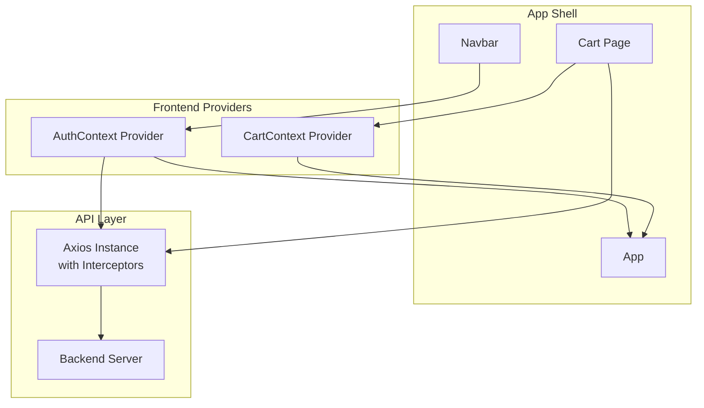
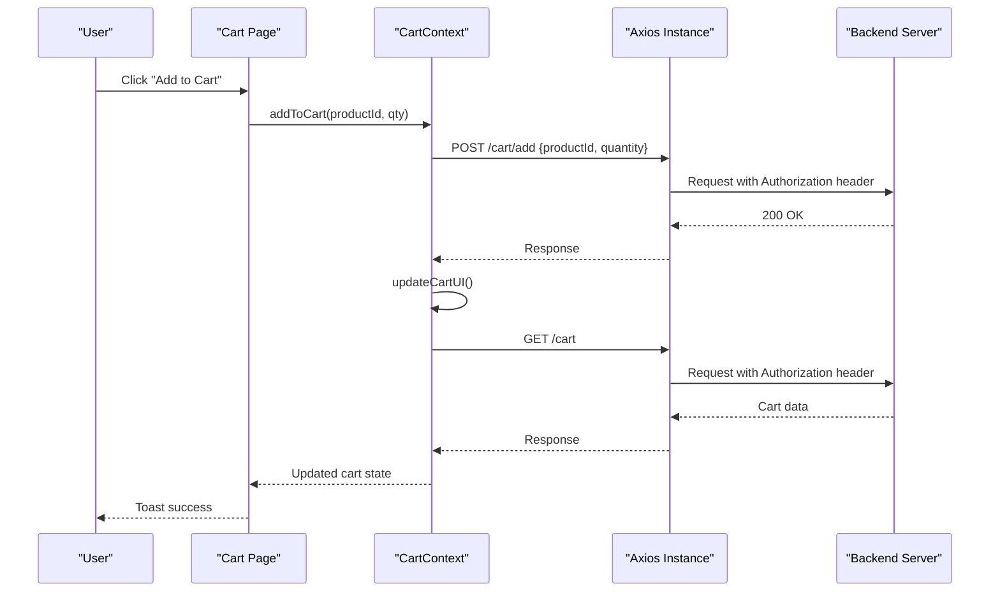
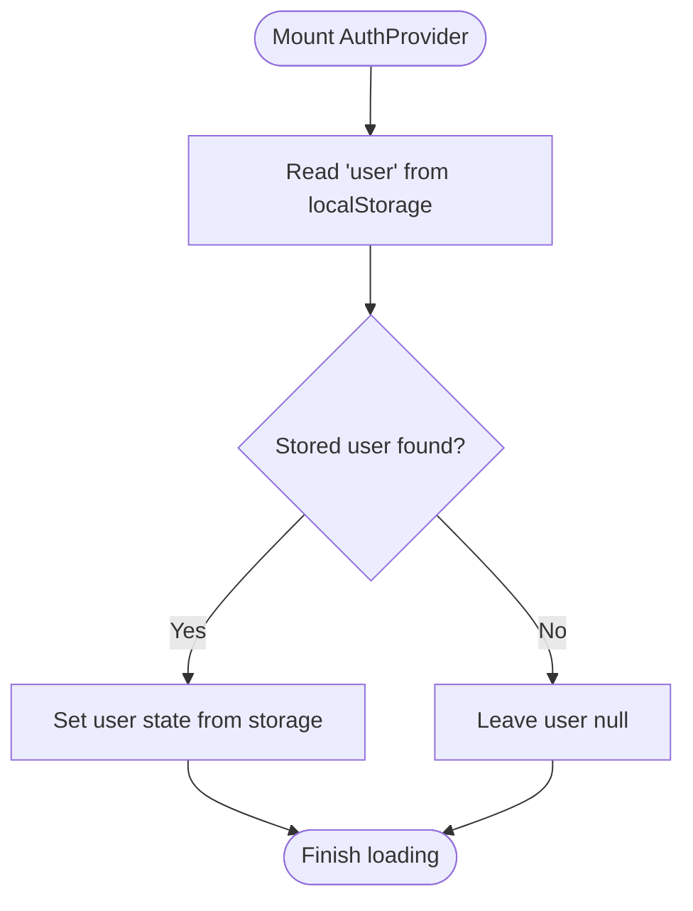
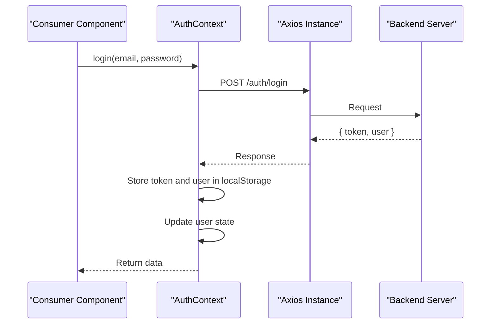
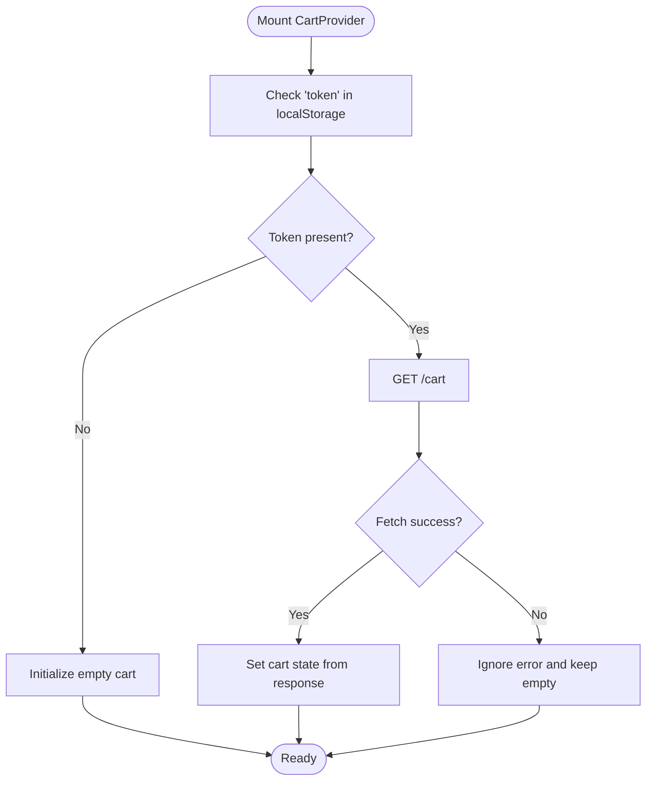
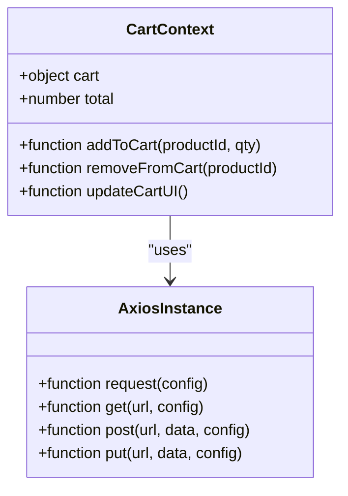
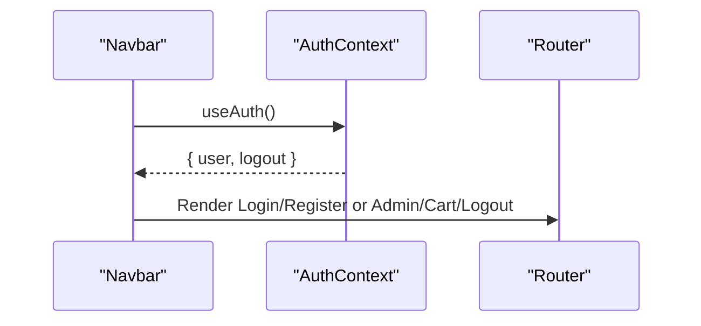
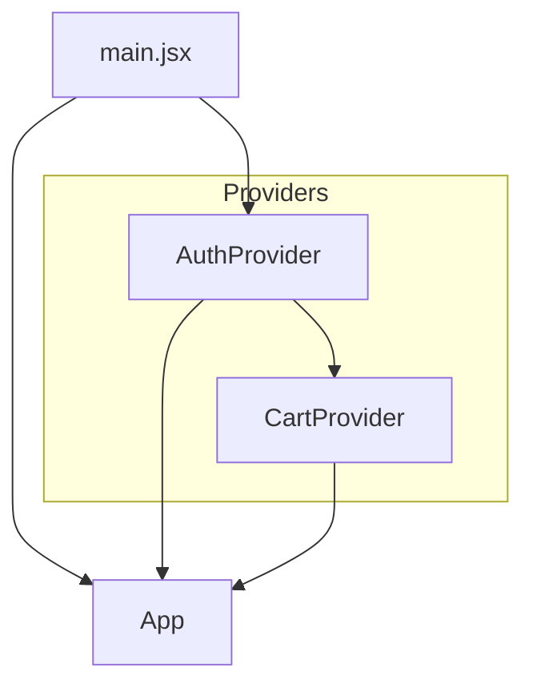
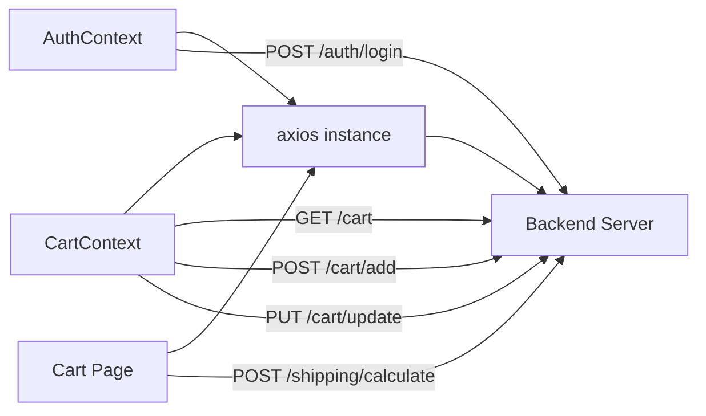

# State Management & Context

<cite>
**Referenced Files in This Document**
- [AuthContext.jsx](file://frontend/src/context/AuthContext.jsx)
- [CartContext.jsx](file://frontend/src/context/CartContext.jsx)
- [axios.js](file://frontend/src/api/axios.js)
- [App.jsx](file://frontend/src/App.jsx)
- [main.jsx](file://frontend/src/main.jsx)
- [navbar.jsx](file://frontend/src/components/navbar.jsx)
- [Cart.jsx](file://frontend/src/pages/Cart.jsx)
- [Login.jsx](file://frontend/src/pages/Login.jsx)
- [server.js](file://backend/server.js)
</cite>

## Table of Contents
1. [Introduction](#introduction)
2. [Project Structure](#project-structure)
3. [Core Components](#core-components)
4. [Architecture Overview](#architecture-overview)
5. [Detailed Component Analysis](#detailed-component-analysis)
6. [Dependency Analysis](#dependency-analysis)
7. [Performance Considerations](#performance-considerations)
8. [Troubleshooting Guide](#troubleshooting-guide)
9. [Conclusion](#conclusion)

## Introduction
This document explains the e-commerce app’s state management architecture built with React Context API. It focuses on two primary contexts:
- AuthContext: handles authentication state, JWT token lifecycle, and protected route readiness.
- CartContext: manages shopping cart operations, persistence, and totals computation.

It documents provider setup, consumer patterns, state update mechanisms, integration with backend APIs, and practical guidance for composition, error handling, and debugging.

## Project Structure
The frontend uses a minimal provider setup pattern:
- Providers are declared in dedicated context modules.
- The App component composes routes and UI; providers are not currently wrapped around the App in the provided entry file.
- Consumers exist across components (e.g., navbar, Cart page) that use hooks to subscribe to context values.

**Diagram sources**
- [AuthContext.jsx:1-33](file://frontend/src/context/AuthContext.jsx#L1-L33)
- [CartContext.jsx:1-53](file://frontend/src/context/CartContext.jsx#L1-L53)
- [App.jsx:19-66](file://frontend/src/App.jsx#L19-L66)
- [navbar.jsx:1-26](file://frontend/src/components/navbar.jsx#L1-L26)
- [Cart.jsx:1-152](file://frontend/src/pages/Cart.jsx#L1-L152)
- [axios.js:1-17](file://frontend/src/api/axios.js#L1-L17)
- [server.js:79-102](file://backend/server.js#L79-L102)

**Section sources**
- [main.jsx:1-10](file://frontend/src/main.jsx#L1-L10)
- [App.jsx:19-66](file://frontend/src/App.jsx#L19-L66)

## Core Components
- AuthContext
  - State: user profile, loading flag.
  - Actions: login, logout.
  - Persistence: stores JWT token and user profile in localStorage.
  - Interop: leverages axios interceptors for Authorization header injection.
- CartContext
  - State: cart object with items and cart ID.
  - Actions: addToCart, removeFromCart, updateCartUI, computed total.
  - Persistence: syncs with backend via GET /cart and mutation endpoints.
  - UX: integrates toast notifications for user feedback.

Key usage patterns:
- Consumers call useAuth/useCart to subscribe to state.
- Components trigger actions that update local state and synchronize with backend.
- Axios interceptors automatically attach tokens to outgoing requests.

**Section sources**
- [AuthContext.jsx:6-33](file://frontend/src/context/AuthContext.jsx#L6-L33)
- [CartContext.jsx:7-53](file://frontend/src/context/CartContext.jsx#L7-L53)
- [axios.js:4-16](file://frontend/src/api/axios.js#L4-L16)

## Architecture Overview
The state management flow connects UI consumers to backend APIs through context providers and axios interceptors.

**Diagram sources**
- [Cart.jsx:31-38](file://frontend/src/pages/Cart.jsx#L31-L38)
- [CartContext.jsx:31-38](file://frontend/src/context/CartContext.jsx#L31-L38)
- [axios.js:4-8](file://frontend/src/api/axios.js#L4-L8)
- [server.js:79-102](file://backend/server.js#L79-L102)

## Detailed Component Analysis

### AuthContext
AuthContext manages authentication state and JWT lifecycle:
- Initialization: reads persisted user from localStorage on mount.
- Login: posts credentials, stores token and user, updates context.
- Logout: clears token and user, resets context.
- Loading: indicates initialization phase until persisted user is restored.

**Diagram sources**
- [AuthContext.jsx:10-14](file://frontend/src/context/AuthContext.jsx#L10-L14)

**Diagram sources**
- [AuthContext.jsx:16-22](file://frontend/src/context/AuthContext.jsx#L16-L22)
- [axios.js:4-8](file://frontend/src/api/axios.js#L4-L8)
- [server.js:79-102](file://backend/server.js#L79-L102)

**Section sources**
- [AuthContext.jsx:6-33](file://frontend/src/context/AuthContext.jsx#L6-L33)
- [axios.js:4-16](file://frontend/src/api/axios.js#L4-L16)

### CartContext
CartContext orchestrates cart operations and persistence:
- Initialization: fetches cart from backend if a token exists; otherwise initializes empty cart.
- Add/Remove: dispatches mutations and refreshes UI via updateCartUI.
- Totals: computes total from current items.
- Notifications: uses toast for user feedback.

**Diagram sources**
- [CartContext.jsx:10-20](file://frontend/src/context/CartContext.jsx#L10-L20)

**Diagram sources**
- [CartContext.jsx:1-53](file://frontend/src/context/CartContext.jsx#L1-L53)
- [axios.js:1-17](file://frontend/src/api/axios.js#L1-L17)

**Section sources**
- [CartContext.jsx:7-53](file://frontend/src/context/CartContext.jsx#L7-L53)

### Consumer Patterns and Protected Access
- Navbar subscribes to AuthContext to conditionally render links and show logout.
- Cart page demonstrates dual patterns:
  - Uses CartContext for cart operations and totals.
  - Also performs direct API calls for shipping estimation, complementing context-managed cart state.

**Diagram sources**
- [navbar.jsx:2-5](file://frontend/src/components/navbar.jsx#L2-L5)

**Section sources**
- [navbar.jsx:1-26](file://frontend/src/components/navbar.jsx#L1-L26)
- [Cart.jsx:1-152](file://frontend/src/pages/Cart.jsx#L1-L152)

### Provider Setup and Composition
- Current entry renders App directly without wrapping providers.
- Recommended composition: wrap App with AuthProvider and CartProvider so consumers can reliably access context values.

**Diagram sources**
- [main.jsx:6-9](file://frontend/src/main.jsx#L6-L9)
- [AuthContext.jsx:6-31](file://frontend/src/context/AuthContext.jsx#L6-L31)
- [CartContext.jsx:46-51](file://frontend/src/context/CartContext.jsx#L46-L51)

**Section sources**
- [main.jsx:1-10](file://frontend/src/main.jsx#L1-L10)
- [AuthContext.jsx:6-31](file://frontend/src/context/AuthContext.jsx#L6-L31)
- [CartContext.jsx:46-51](file://frontend/src/context/CartContext.jsx#L46-L51)

## Dependency Analysis
- Axios interceptors inject Authorization headers for all requests, enabling seamless protected route access.
- Backend exposes endpoints used by contexts:
  - /auth/login for authentication.
  - /cart, /cart/add, /cart/update for cart operations.
  - /shipping/calculate for shipping estimation (used directly in Cart page).

**Diagram sources**
- [axios.js:4-16](file://frontend/src/api/axios.js#L4-L16)
- [AuthContext.jsx:16-22](file://frontend/src/context/AuthContext.jsx#L16-L22)
- [CartContext.jsx:14-29](file://frontend/src/context/CartContext.jsx#L14-L29)
- [Cart.jsx:35-53](file://frontend/src/pages/Cart.jsx#L35-L53)
- [server.js:79-102](file://backend/server.js#L79-L102)

**Section sources**
- [axios.js:1-17](file://frontend/src/api/axios.js#L1-L17)
- [server.js:79-102](file://backend/server.js#L79-L102)

## Performance Considerations
- Current implementation computes totals on-demand in components. For large carts, consider memoizing totals using useMemo to avoid unnecessary recalculation.
- CartContext recomputes total from items each render; consider deriving total from a selector or memoized value if performance becomes a concern.
- Axios interceptors are efficient; ensure network calls are batched where appropriate to reduce re-renders.
- Consumers can subscribe to only the parts of context they need to minimize re-renders.

[No sources needed since this section provides general guidance]

## Troubleshooting Guide
Common issues and resolutions:
- Unauthorized requests after logout
  - Symptom: 401 errors despite logout.
  - Cause: Token remains in memory or localStorage.
  - Resolution: Verify axios interceptor removes token and rejects unauthorized responses; ensure logout clears token and user.
  - References:
    - [axios.js:10-16](file://frontend/src/api/axios.js#L10-L16)
    - [AuthContext.jsx:24-28](file://frontend/src/context/AuthContext.jsx#L24-L28)
- Cart not persisting across sessions
  - Symptom: Cart resets after reload.
  - Cause: No token present or fetch failed silently.
  - Resolution: Confirm token exists; ensure CartProvider fetches /cart on mount and handles errors gracefully.
  - References:
    - [CartContext.jsx:10-20](file://frontend/src/context/CartContext.jsx#L10-L20)
- Toast messages not appearing
  - Symptom: No feedback on add/remove.
  - Cause: Missing Toaster or toast library configuration.
  - Resolution: Ensure Toaster is rendered near the root and toast is imported in CartContext.
  - References:
    - [CartContext.jsx:3-4](file://frontend/src/context/CartContext.jsx#L3-L4)
    - [App.jsx:22](file://frontend/src/App.jsx#L22)
- Provider not wrapping components
  - Symptom: useAuth/useCart throw “context not wrapped” errors.
  - Cause: Providers missing in main.jsx.
  - Resolution: Wrap App with AuthProvider and CartProvider in main.jsx.
  - References:
    - [main.jsx:6-9](file://frontend/src/main.jsx#L6-L9)
    - [AuthContext.jsx:6-31](file://frontend/src/context/AuthContext.jsx#L6-L31)
    - [CartContext.jsx:46-51](file://frontend/src/context/CartContext.jsx#L46-L51)

**Section sources**
- [axios.js:10-16](file://frontend/src/api/axios.js#L10-L16)
- [AuthContext.jsx:24-28](file://frontend/src/context/AuthContext.jsx#L24-L28)
- [CartContext.jsx:10-20](file://frontend/src/context/CartContext.jsx#L10-L20)
- [CartContext.jsx:3-4](file://frontend/src/context/CartContext.jsx#L3-L4)
- [App.jsx:22](file://frontend/src/App.jsx#L22)
- [main.jsx:6-9](file://frontend/src/main.jsx#L6-L9)

## Conclusion
The e-commerce app employs a clean, minimal context-based state management approach:
- AuthContext centralizes authentication state and JWT handling.
- CartContext encapsulates cart operations and persistence.
- Axios interceptors streamline protected API access.
- Consumers use hooks to subscribe to context values and trigger actions.

Recommended enhancements:
- Wrap App with providers in main.jsx to ensure global availability.
- Introduce useMemo for cart totals and consider a shared selector pattern for derived state.
- Add error boundaries and logging around context consumers for robust debugging.
- Consider migrating to useReducer for complex state transitions in CartContext to improve predictability and testability.

[No sources needed since this section summarizes without analyzing specific files]