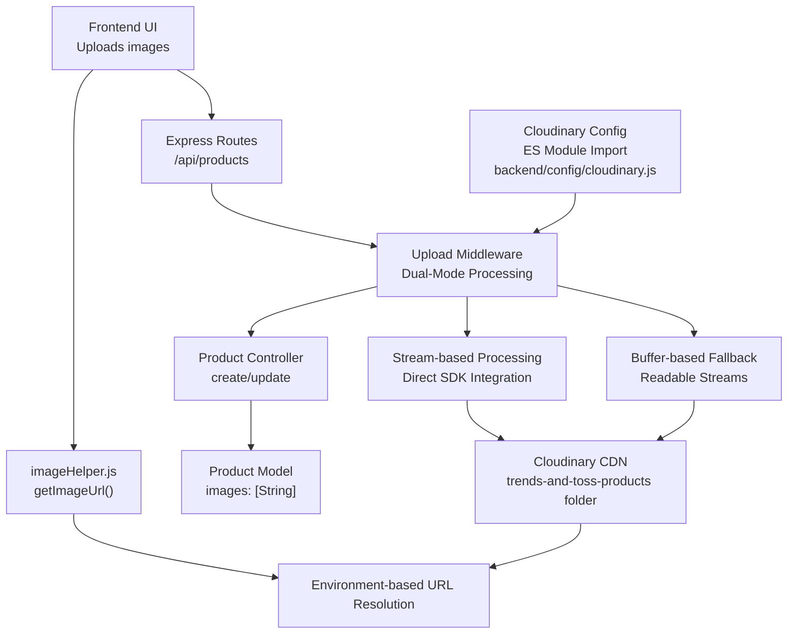
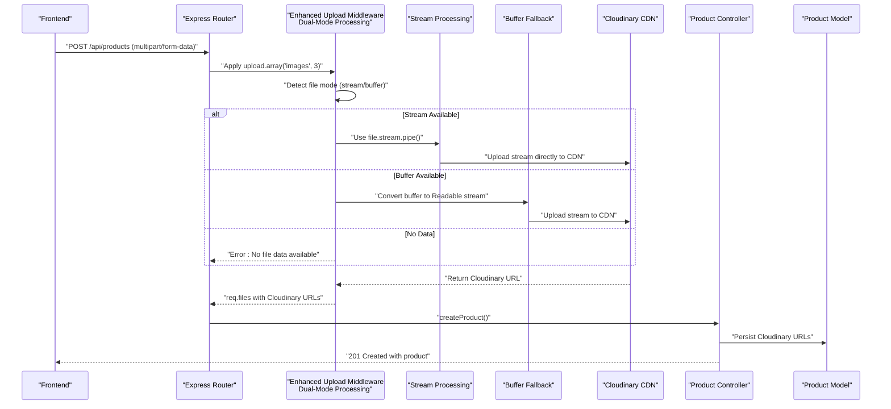
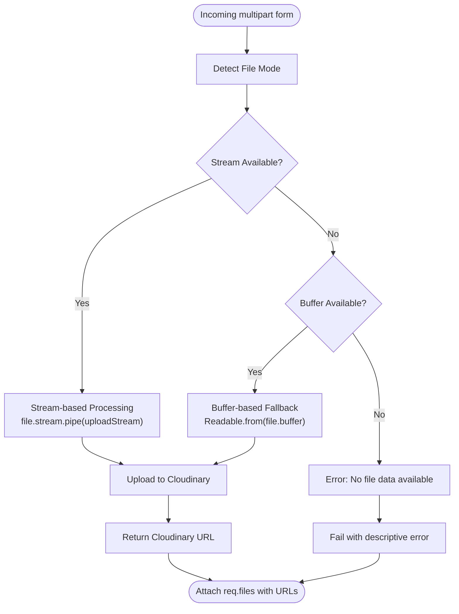
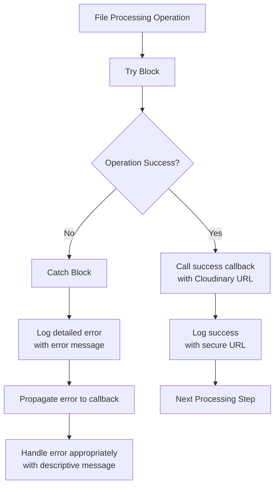
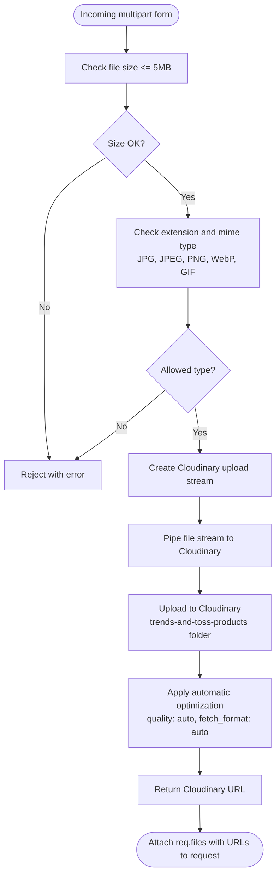
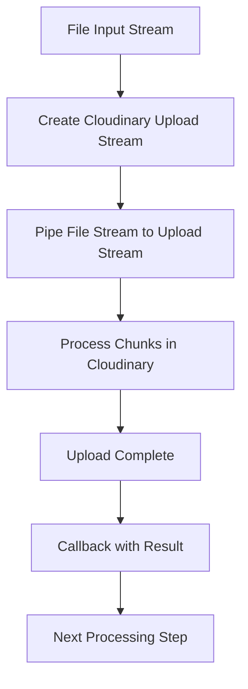
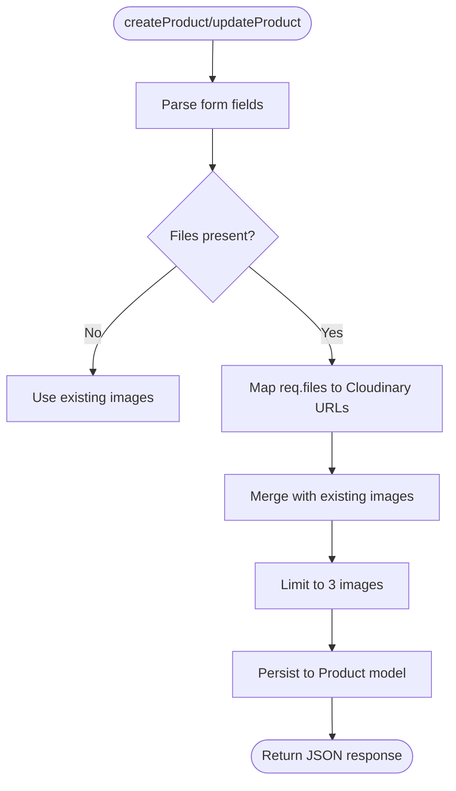
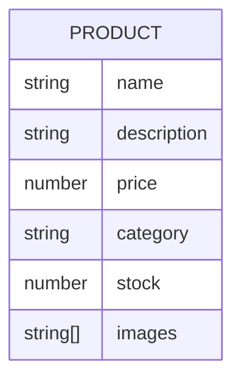
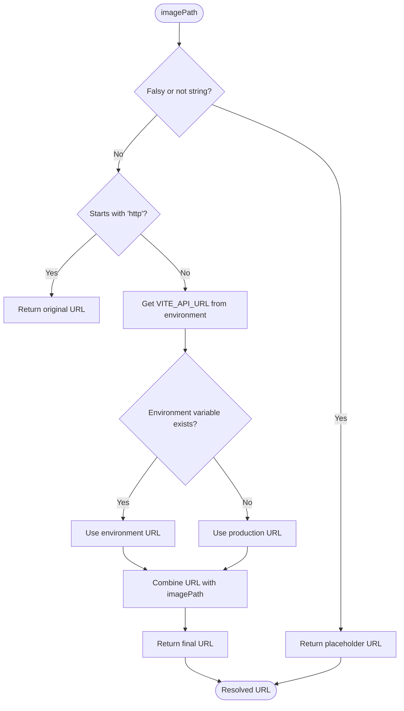
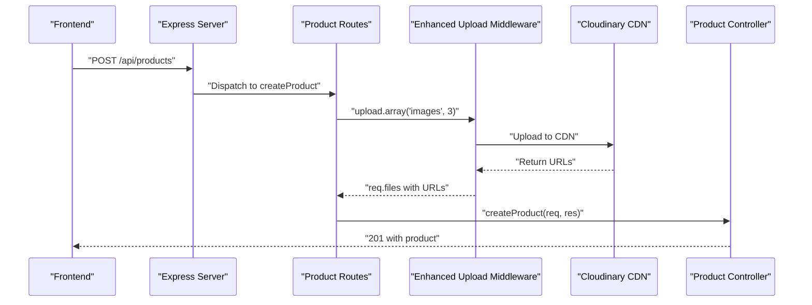

# Image Management

<cite>
**Referenced Files in This Document**
- [uploadMiddleware.js](file://backend/middleware/uploadMiddleware.js)
- [productController.js](file://backend/controllers/productController.js)
- [productRoutes.js](file://backend/routes/productRoutes.js)
- [Product.js](file://backend/models/Product.js)
- [server.js](file://backend/server.js)
- [package.json](file://backend/package.json)
- [imageHelper.js](file://frontend/src/utils/imageHelper.js)
- [cloudinary.js](file://backend/config/cloudinary.js)
</cite>

## Update Summary
**Changes Made**
- Enhanced upload middleware with dual-mode file processing (stream and buffer) for improved reliability
- Improved error handling with descriptive error messages and comprehensive logging
- Added fallback mechanisms for both streaming and buffered file uploads
- Maintained all existing Cloudinary integration, GIF support, and ES modules compatibility
- Updated documentation to reflect the new dual-mode processing architecture

## Table of Contents
1. [Introduction](#introduction)
2. [Project Structure](#project-structure)
3. [Core Components](#core-components)
4. [Architecture Overview](#architecture-overview)
5. [Detailed Component Analysis](#detailed-component-analysis)
6. [Enhanced Dual-Mode File Processing](#enhanced-dual-mode-file-processing)
7. [Comprehensive Error Handling System](#comprehensive-error-handling-system)
8. [Custom Cloudinary Storage Engine](#custom-cloudinary-storage-engine)
9. [Stream-based Processing Implementation](#stream-based-processing-implementation)
10. [GIF Support Integration](#gif-support-integration)
11. [Frontend Image Helper Updates](#frontend-image-helper-updates)
12. [ES Modules Compatibility](#es-modules-compatibility)
13. [Performance Considerations](#performance-considerations)
14. [Troubleshooting Guide](#troubleshooting-guide)
15. [Conclusion](#conclusion)

## Introduction
This document explains the e-commerce app's image management system featuring a sophisticated dual-mode file processing architecture with enhanced error handling and comprehensive upload progress tracking. The system now implements a robust custom Cloudinary storage engine with direct SDK integration, supporting both stream-based and buffer-based file processing with intelligent fallback mechanisms. The enhanced upload middleware provides improved reliability, descriptive error messaging, and seamless integration with Cloudinary's CDN for optimal performance and scalability. The system documents the complete upload pipeline from frontend selection to cloud storage, including practical examples, optimization techniques, and customization guidance.

## Project Structure
The image management system operates on a fully ES modules-compatible architecture with backend middleware, controllers, routes, and models:
- Backend configuration defines Cloudinary credentials with ES module imports and direct SDK integration.
- Routes define admin-only endpoints that accept multiple images via multipart form data using ES module syntax.
- Controllers handle creation and updates, storing Cloudinary URLs in the Product model.
- The server serves static uploads locally for backward compatibility and prepares CORS for frontend origins.
- Frontend imageHelper resolves Cloudinary URLs using environment-based backend URL resolution.



**Diagram sources**
- [productRoutes.js:19-20](file://backend/routes/productRoutes.js#L19-L20)
- [uploadMiddleware.js:31-43](file://backend/middleware/uploadMiddleware.js#L31-L43)
- [productController.js:57](file://backend/controllers/productController.js#L57)
- [Product.js:7](file://backend/models/Product.js#L7)
- [server.js:56](file://backend/server.js#L56)
- [imageHelper.js:1-8](file://frontend/src/utils/imageHelper.js#L1-L8)
- [cloudinary.js:1-13](file://backend/config/cloudinary.js#L1-L13)

**Section sources**
- [server.js:67-68](file://backend/server.js#L67-L68)
- [productRoutes.js:19-20](file://backend/routes/productRoutes.js#L19-L20)
- [uploadMiddleware.js:31-43](file://backend/middleware/uploadMiddleware.js#L31-L43)
- [productController.js:57](file://backend/controllers/productController.js#L57)
- [Product.js:7](file://backend/models/Product.js#L7)
- [imageHelper.js:1-8](file://frontend/src/utils/imageHelper.js#L1-L8)
- [cloudinary.js:1-13](file://backend/config/cloudinary.js#L1-L13)

## Core Components
- Enhanced dual-mode file processing with intelligent fallback mechanisms:
  - Primary stream-based processing for efficient file uploads.
  - Buffer-based fallback for compatibility with different file sources.
  - Automatic detection and selection between stream and buffer modes.
- Custom Cloudinary storage engine with direct SDK integration:
  - Stores files directly to Cloudinary with randomized filenames under trends-and-toss-products folder.
  - Enforces a 5 MB size limit and allows JPG, JPEG, PNG, WebP, and GIF formats.
  - Applies automatic optimization (quality: auto, fetch_format: auto).
  - Uses custom storage engine with _handleFile and _removeFile methods.
- Comprehensive error handling system:
  - Descriptive error messages for different failure scenarios.
  - Detailed logging for debugging and monitoring.
  - Proper error propagation and callback handling.
- Stream-based processing:
  - Pipes file streams directly to Cloudinary upload stream for efficient processing.
  - Eliminates intermediate file storage and memory buffering.
- Enhanced error handling:
  - Comprehensive try-catch blocks with detailed error logging.
  - Proper error propagation and callback handling.
- Product controller:
  - Handles multipart form data with up to three images.
  - Stores Cloudinary URLs directly in the Product model.
- Product model:
  - Defines images as an array of strings containing Cloudinary URLs.
- Frontend imageHelper:
  - Resolves Cloudinary URLs using environment-based backend URL resolution.
  - Supports absolute URLs and provides a placeholder fallback.
- Cloudinary configuration:
  - Sets up credentials with ES module imports and secure delivery with automatic optimization.

**Section sources**
- [uploadMiddleware.js:31-43](file://backend/middleware/uploadMiddleware.js#L31-L43)
- [uploadMiddleware.js:16-30](file://backend/middleware/uploadMiddleware.js#L16-L30)
- [productController.js:57](file://backend/controllers/productController.js#L57)
- [Product.js:7](file://backend/models/Product.js#L7)
- [imageHelper.js:1-8](file://frontend/src/utils/imageHelper.js#L1-L8)
- [cloudinary.js:1-13](file://backend/config/cloudinary.js#L1-L13)

## Architecture Overview
The system now uses a fully cloud-native approach with custom storage engine and dual-mode processing:
- All environments rely on Cloudinary CDN for image hosting, transformations, and global CDN distribution.
- Images are automatically optimized during upload and delivered via secure HTTPS URLs.
- Local file system management has been completely eliminated for improved scalability and reliability.
- Custom storage engine provides better control and monitoring capabilities.
- Dual-mode processing ensures efficient memory usage and faster uploads with intelligent fallback.
- Enhanced error handling provides comprehensive debugging and monitoring capabilities.
- ES module imports provide better compatibility with modern JavaScript environments.



**Diagram sources**
- [productRoutes.js:19](file://backend/routes/productRoutes.js#L19)
- [uploadMiddleware.js:31-43](file://backend/middleware/uploadMiddleware.js#L31-L43)
- [productController.js:57](file://backend/controllers/productController.js#L57)
- [cloudinary.js:1-13](file://backend/config/cloudinary.js#L1-L13)

## Detailed Component Analysis

### Enhanced Dual-Mode File Processing
- Purpose: Provide flexible file processing with intelligent fallback mechanisms for maximum compatibility.
- Dual processing modes:
  - **Stream-based processing**: Primary mode using file.stream.pipe() for direct streaming to Cloudinary.
  - **Buffer-based fallback**: Secondary mode converting file.buffer to Readable stream when stream is unavailable.
  - **Automatic detection**: Intelligent selection between stream and buffer modes based on available file data.
- Fallback mechanisms:
  - Stream processing takes precedence for optimal performance.
  - Buffer conversion uses Node.js Readable.from() for compatibility.
  - Graceful degradation when neither mode is available.
- Error handling:
  - Comprehensive try-catch blocks around both processing modes.
  - Detailed error logging for debugging different failure scenarios.
  - Proper error propagation to multer callback for consistent error handling.



**Diagram sources**
- [uploadMiddleware.js:31-43](file://backend/middleware/uploadMiddleware.js#L31-L43)
- [uploadMiddleware.js:35-36](file://backend/middleware/uploadMiddleware.js#L35-L36)

**Section sources**
- [uploadMiddleware.js:31-43](file://backend/middleware/uploadMiddleware.js#L31-L43)
- [uploadMiddleware.js:35-36](file://backend/middleware/uploadMiddleware.js#L35-L36)

### Comprehensive Error Handling System
- Purpose: Provide detailed error handling and logging for reliable operation across all processing modes.
- Error handling implementation:
  - Try-catch blocks around critical operations in both stream and buffer processing.
  - Descriptive error messages for different failure scenarios (upload errors, stream errors, buffer errors).
  - Detailed error logging with console.error() including error stack traces.
  - Proper error propagation to multer callback for consistent error handling.
  - Centralized error handling in both _handleFile and _removeFile methods.
- Error categories:
  - Cloudinary upload errors with detailed error messages.
  - Stream processing errors and file handling exceptions.
  - Buffer conversion errors and stream piping failures.
  - Validation errors for size and format restrictions.
  - Fallback mechanism errors when no file data is available.
- Logging improvements:
  - Specific error messages for Cloudinary upload failures.
  - Upload handler error logging for debugging different processing modes.
  - Clear separation of different error types with descriptive messages.
  - Success logging for monitoring upload completion.



**Diagram sources**
- [uploadMiddleware.js:40-43](file://backend/middleware/uploadMiddleware.js#L40-L43)
- [uploadMiddleware.js:18-28](file://backend/middleware/uploadMiddleware.js#L18-L28)

**Section sources**
- [uploadMiddleware.js:40-43](file://backend/middleware/uploadMiddleware.js#L40-L43)
- [uploadMiddleware.js:18-28](file://backend/middleware/uploadMiddleware.js#L18-L28)

### Custom Cloudinary Storage Engine
- Purpose: Validate and store multipart images directly to Cloudinary using custom storage engine implementation.
- Custom storage engine implementation:
  - Uses _handleFile method for processing uploaded files.
  - Uses _removeFile method for cleanup operations.
  - Integrates directly with Cloudinary SDK for upload processing.
- Validation rules:
  - Allowed file extensions: JPG, JPEG, PNG, WebP, GIF (updated from previous formats).
  - Mime-type checks align with extensions.
  - Size limit: 5 MB per file.
- Storage:
  - Destination: Cloudinary trends-and-toss-products folder.
  - Automatic optimization: quality: auto, fetch_format: auto.
  - Filenames: Cloudinary generates unique identifiers.
- ES Modules Compatibility:
  - Uses ES module import syntax for all dependencies.
  - Custom storage engine replaces external multer-storage-cloudinary package.



**Diagram sources**
- [uploadMiddleware.js:16-30](file://backend/middleware/uploadMiddleware.js#L16-L30)
- [uploadMiddleware.js:4-45](file://backend/middleware/uploadMiddleware.js#L4-L45)

**Section sources**
- [uploadMiddleware.js:4-45](file://backend/middleware/uploadMiddleware.js#L4-L45)
- [uploadMiddleware.js:16-30](file://backend/middleware/uploadMiddleware.js#L16-L30)

### Stream-based Processing Implementation
- Purpose: Efficiently process file uploads using Node.js streams to eliminate memory overhead.
- Stream processing benefits:
  - Direct piping from file stream to Cloudinary upload stream.
  - No intermediate file storage or memory buffering.
  - Reduced memory footprint for large file uploads.
  - Improved performance and scalability.
- Implementation details:
  - Uses file.stream.pipe(uploadStream) for direct streaming.
  - Cloudinary upload stream handles chunked processing.
  - Automatic cleanup of temporary resources.
- Error handling:
  - Try-catch blocks around stream processing.
  - Proper error propagation to multer callback.
  - Detailed error logging for debugging.



**Diagram sources**
- [uploadMiddleware.js:27-28](file://backend/middleware/uploadMiddleware.js#L27-L28)
- [uploadMiddleware.js:8-25](file://backend/middleware/uploadMiddleware.js#L8-L25)

**Section sources**
- [uploadMiddleware.js:27-28](file://backend/middleware/uploadMiddleware.js#L27-L28)
- [uploadMiddleware.js:8-25](file://backend/middleware/uploadMiddleware.js#L8-L25)

### GIF Support Integration
- Purpose: Extend image format support to include animated GIF files.
- Format expansion:
  - Added 'gif' to allowed_formats array in Cloudinary configuration.
  - Updated validation rules to include GIF format support.
  - Maintains all existing format restrictions (JPG, JPEG, PNG, WebP).
- Technical considerations:
  - GIF files may be larger than other formats.
  - Consider compression settings for GIF optimization.
  - Monitor storage usage for animated content.
- Usage implications:
  - Allows animated product demonstrations.
  - Supports promotional GIF content.
  - Requires careful consideration of bandwidth usage.

**Section sources**
- [uploadMiddleware.js:14](file://backend/middleware/uploadMiddleware.js#L14)

### Product Controller (Cloudinary URL Handling)
- Creation:
  - Reads form fields and maps uploaded files to Cloudinary URLs.
  - Stores up to three Cloudinary URLs in the Product model.
- Updates:
  - Starts with existing images.
  - Appends newly uploaded Cloudinary URLs if present.
  - Limits total images to three.
- Error handling:
  - Centralized try/catch logs errors and returns JSON with appropriate status codes.



**Diagram sources**
- [productController.js:57](file://backend/controllers/productController.js#L57)
- [productController.js:87-93](file://backend/controllers/productController.js#L87-L93)

**Section sources**
- [productController.js:57](file://backend/controllers/productController.js#L57)
- [productController.js:87-93](file://backend/controllers/productController.js#L87-L93)

### Product Model (Cloudinary URLs Schema)
- images: Array of strings representing Cloudinary URLs stored directly in MongoDB.



**Diagram sources**
- [Product.js:7](file://backend/models/Product.js#L7)

**Section sources**
- [Product.js:7](file://backend/models/Product.js#L7)

### Frontend Image Helper Updates
- Provides a single function to resolve Cloudinary URLs:
  - Returns a placeholder if input is missing or not a string.
  - Returns absolute URLs unchanged.
  - Uses environment-based backend URL resolution with import.meta.env.VITE_API_URL.
  - Falls back to production URL if environment variable is not set.
  - No longer prepends local backend base URL as images are served directly from Cloudinary.



**Diagram sources**
- [imageHelper.js:1-8](file://frontend/src/utils/imageHelper.js#L1-L8)

**Section sources**
- [imageHelper.js:1-8](file://frontend/src/utils/imageHelper.js#L1-L8)

### Cloudinary Configuration
- Initializes Cloudinary SDK with environment-provided credentials and secure delivery using ES module imports.
- Configured with automatic optimization and transformation settings.
- Uses default import approach for better ES module compatibility.
- Ready for production-scale image delivery with global CDN distribution.

```mermaid
classDiagram
class CloudinaryConfig {
+cloud_name
+api_key
+api_secret
+secure
+folder : "trends-and-toss-products"
+allowed_formats : ["jpg","jpeg","png","webp","gif"]
+transformation : [{"quality" : "auto","fetch_format" : "auto"}]
}
```

**Diagram sources**
- [cloudinary.js:1-13](file://backend/config/cloudinary.js#L1-L13)
- [uploadMiddleware.js:10-12](file://backend/middleware/uploadMiddleware.js#L10-L12)

**Section sources**
- [cloudinary.js:1-13](file://backend/config/cloudinary.js#L1-L13)
- [package.json:1-28](file://backend/package.json#L1-L28)

### Routes and CORS
- Admin-only routes accept multiple images via upload.array('images', 3) using ES module syntax.
- Static serving of uploads/ remains for backward compatibility but is no longer used for new uploads.
- CORS configuration allows controlled frontend origins.



**Diagram sources**
- [productRoutes.js:19](file://backend/routes/productRoutes.js#L19)
- [server.js:67-68](file://backend/server.js#L67-L68)

**Section sources**
- [productRoutes.js:19-20](file://backend/routes/productRoutes.js#L19-L20)
- [server.js:67-68](file://backend/server.js#L67-L68)

## ES Modules Compatibility
The system has been fully migrated to ES modules architecture for better compatibility with modern JavaScript environments:

### Package Configuration
- Added `"type": "module"` to package.json for native ES module support.
- **Updated**: Removed multer-storage-cloudinary dependency as custom storage engine is implemented.
- Enables use of ES module import/export syntax throughout the application.
- Provides better tree-shaking and modern JavaScript feature support.

### Import Syntax Changes
- **Cloudinary Import**: Changed from named import to default import approach: `import { v2 as cloudinary } from 'cloudinary';`
- **Multer Import**: Standard ES module import: `import multer from 'multer';`
- **All other imports**: Updated to use ES module syntax consistently.

### Benefits of ES Modules Migration
- **Better Performance**: Native ES module support enables better optimization by bundlers and runtime environments.
- **Modern Compatibility**: Full compatibility with modern Node.js versions and JavaScript environments.
- **Tree Shaking**: Improved dead code elimination and bundle optimization.
- **Future-Proof**: Aligns with modern JavaScript standards and best practices.

**Section sources**
- [package.json:1-28](file://backend/package.json#L1-L28)
- [cloudinary.js:1-13](file://backend/config/cloudinary.js#L1-L13)
- [uploadMiddleware.js:1-3](file://backend/middleware/uploadMiddleware.js#L1-L3)

## Performance Considerations
- Cloudinary CDN:
  - Global distribution reduces latency for international users.
  - Automatic optimization (quality: auto, fetch_format: auto) reduces file sizes.
  - On-the-fly transformations enable responsive image delivery.
  - Automatic caching and edge locations improve load times.
- Enhanced Dual-Mode Processing Benefits:
  - **Updated**: Eliminates memory overhead for large file uploads with intelligent fallback mechanisms.
  - Direct streaming reduces processing time and resource usage when stream is available.
  - Buffer fallback ensures compatibility with different file sources without performance degradation.
  - Improved scalability for concurrent uploads with graceful error handling.
- Comprehensive Error Handling:
  - **Updated**: Descriptive error messages improve debugging and monitoring efficiency.
  - Better error propagation prevents cascading failures and maintains system stability.
  - Detailed error logging aids in troubleshooting and performance optimization.
- GIF Support Considerations:
  - **Updated**: Animated GIFs may increase bandwidth usage but are supported with proper fallback mechanisms.
  - Consider compression settings for GIF optimization with dual-mode processing.
  - Monitor storage and bandwidth for animated content with enhanced error reporting.
- Scalability benefits:
  - No local storage management or disk space concerns.
  - Automatic backup and redundancy across Cloudinary infrastructure.
  - Horizontal scaling without filesystem limitations.
- ES Modules Benefits:
  - Better tree shaking reduces bundle size in modern environments.
  - Improved runtime performance with native ES module support.
  - Enhanced compatibility with modern build tools and deployment platforms.
- Recommendations:
  - Leverage Cloudinary transformations for responsive images (width queries, format hints).
  - Enable browser caching headers and leverage CDN cache policies.
  - Monitor Cloudinary analytics for performance insights.
  - Use Cloudinary's automatic format detection for optimal delivery.
  - Consider bandwidth monitoring for GIF content with dual-mode processing.
  - Implement comprehensive logging for upload progress tracking and debugging.

## Troubleshooting Guide
- File type errors:
  - Ensure uploads use JPG, JPEG, PNG, WebP, or GIF; otherwise the middleware rejects them.
  - **Updated**: GIF format is now supported alongside existing formats with dual-mode processing.
- Size limit exceeded:
  - Files larger than 5 MB are rejected; compress or resize before uploading.
- Cloudinary upload failures:
  - Verify Cloudinary credentials are set in environment variables.
  - Check Cloudinary account quota and storage limits.
  - Ensure network connectivity to Cloudinary endpoints.
  - **Updated**: Check for GIF-specific upload issues if GIF support is failing with enhanced error messages.
- Missing images in product details:
  - **Updated**: Images are now served directly from Cloudinary URLs, not local uploads directory.
  - Verify Cloudinary URLs are stored correctly in the database.
  - Confirm Cloudinary folder "trends-and-toss-products" exists and is accessible.
- CORS issues:
  - Ensure the frontend origin is included in allowedOrigins.
- Cloudinary configuration:
  - Verify environment variables CLOUDINARY_CLOUD_NAME, CLOUDINARY_API_KEY, CLOUDINARY_API_SECRET are set.
  - Confirm Cloudinary account is active and properly configured.
- ES Modules Issues:
  - Ensure Node.js version supports ES modules (Node.js 12+ recommended).
  - Verify package.json has `"type": "module"` setting.
  - Check that all import statements use correct ES module syntax.
  - Ensure file extensions are included in import paths when using ES modules.
- Custom Storage Engine Issues:
  - Check for proper stream handling and error logging in dual-mode processing.
  - Verify Cloudinary SDK integration and authentication.
  - Monitor upload stream processing and callback handling.
  - **Updated**: Check fallback mechanisms when stream processing fails.
- GIF Upload Problems:
  - Verify GIF format support in allowed formats array.
  - Check Cloudinary GIF upload quotas and limitations.
  - Monitor GIF file size and compression settings.
  - **Updated**: Use buffer fallback mode for GIF uploads when stream processing fails.
- Frontend URL Resolution:
  - Verify VITE_API_URL environment variable is set correctly.
  - Check fallback to production URL behavior.
  - Ensure proper URL concatenation for Cloudinary images.
- Dual-Mode Processing Issues:
  - **New**: Check if file.stream is available for stream-based processing.
  - **New**: Verify file.buffer availability for buffer fallback mode.
  - **New**: Monitor error logs for specific processing mode failures.
  - **New**: Test both stream and buffer modes independently for debugging.
- Enhanced Error Handling:
  - **New**: Review detailed error messages for specific failure points.
  - **New**: Check error stack traces for debugging complex upload failures.
  - **New**: Monitor success vs failure logs for upload monitoring.

**Section sources**
- [uploadMiddleware.js:31-43](file://backend/middleware/uploadMiddleware.js#L31-L43)
- [uploadMiddleware.js:40-43](file://backend/middleware/uploadMiddleware.js#L40-L43)
- [server.js:23-50](file://backend/server.js#L23-L50)
- [cloudinary.js:1-13](file://backend/config/cloudinary.js#L1-L13)
- [package.json:1-28](file://backend/package.json#L1-L28)
- [imageHelper.js:1-8](file://frontend/src/utils/imageHelper.js#L1-L8)

## Conclusion
The system has successfully migrated to a fully cloud-native image management solution using Cloudinary CDN with complete ES modules compatibility and sophisticated dual-mode file processing architecture. The enhanced upload middleware now features intelligent dual-mode processing (stream and buffer), comprehensive error handling with descriptive error messages, and robust fallback mechanisms, providing improved reliability, performance, and flexibility compared to the previous single-mode approach. The dual-mode architecture ensures maximum compatibility with different file sources while maintaining optimal performance through intelligent fallback selection. The comprehensive error handling system provides detailed debugging information and monitoring capabilities, while the custom Cloudinary storage engine eliminates the dependency on external packages while offering better control and monitoring. Stream-based processing ensures efficient memory usage and faster uploads, while the buffer fallback mode guarantees compatibility across different environments. The addition of GIF support expands the range of supported image formats, and the updated frontend imageHelper uses environment-based URL resolution for better flexibility. The system eliminates filesystem management overhead while providing superior scalability, global distribution, and automatic optimization. This architecture provides better performance, reduced maintenance overhead, improved reliability for production deployments, enhanced compatibility with modern JavaScript development practices, expanded format support for diverse image content requirements, and comprehensive error handling for robust operation.