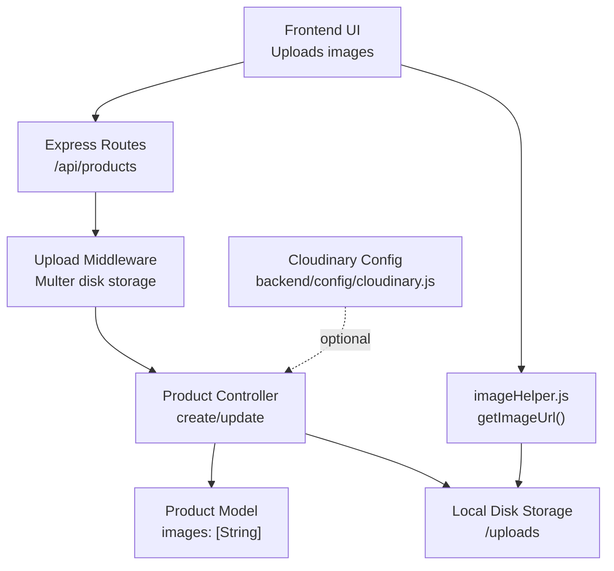
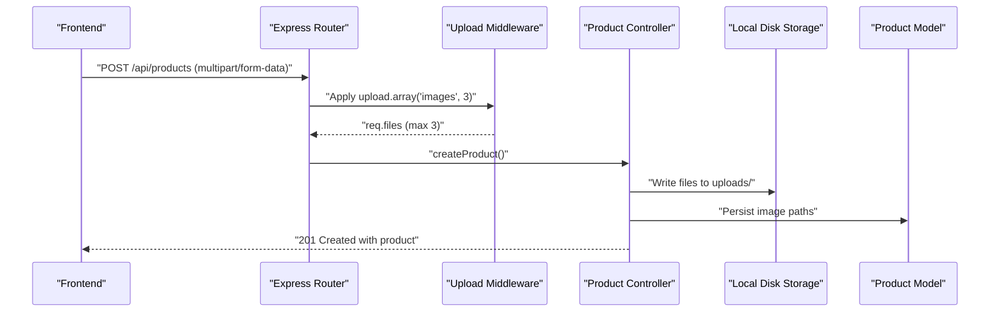
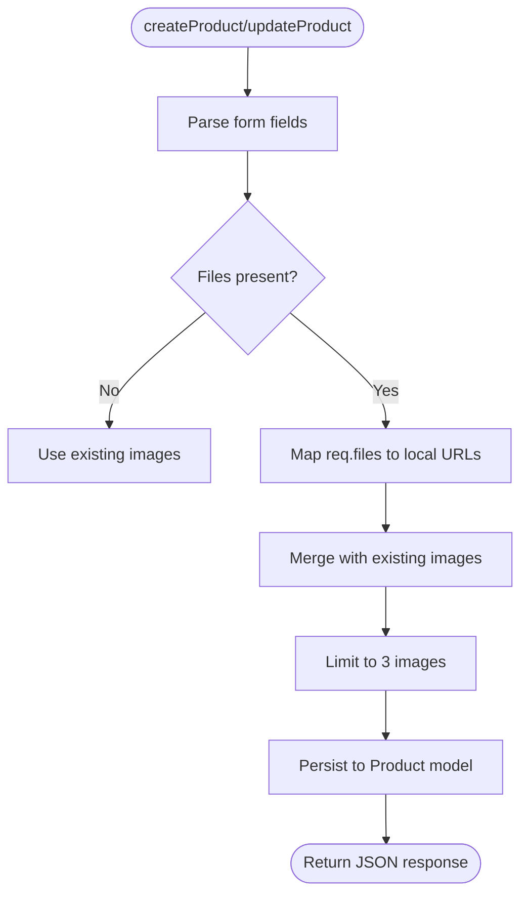
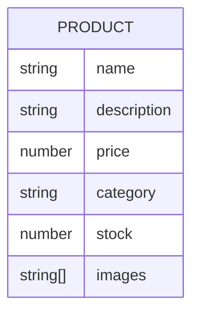
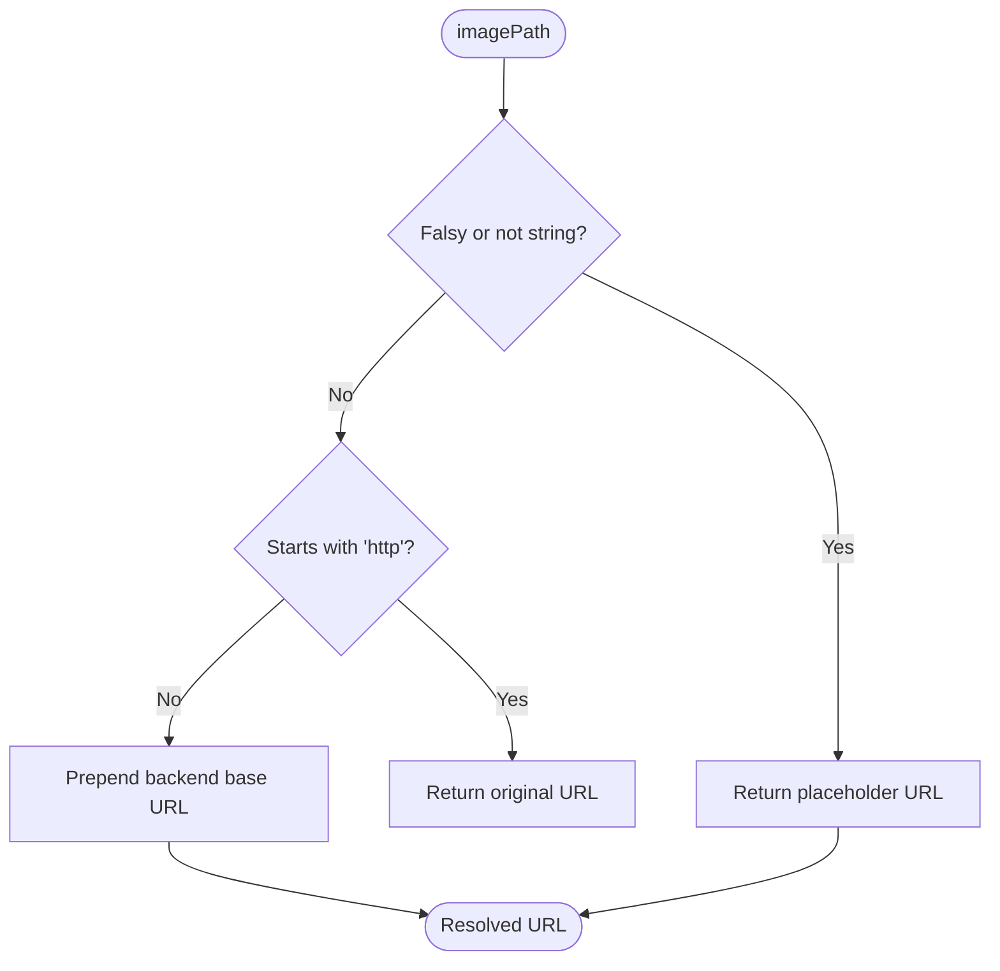
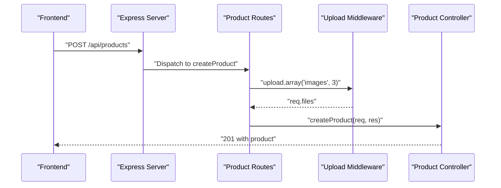
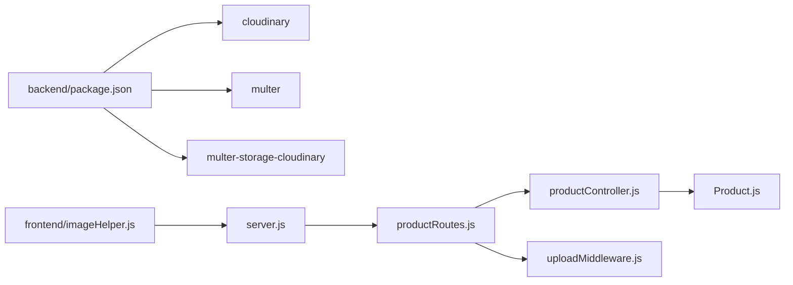

# Image Management

<cite>
**Referenced Files in This Document**
- [cloudinary.js](file://backend/config/cloudinary.js)
- [uploadMiddleware.js](file://backend/middleware/uploadMiddleware.js)
- [productController.js](file://backend/controllers/productController.js)
- [productRoutes.js](file://backend/routes/productRoutes.js)
- [Product.js](file://backend/models/Product.js)
- [server.js](file://backend/server.js)
- [package.json](file://backend/package.json)
- [imageHelper.js](file://frontend/src/utils/imageHelper.js)
</cite>

## Table of Contents
1. [Introduction](#introduction)
2. [Project Structure](#project-structure)
3. [Core Components](#core-components)
4. [Architecture Overview](#architecture-overview)
5. [Detailed Component Analysis](#detailed-component-analysis)
6. [Dependency Analysis](#dependency-analysis)
7. [Performance Considerations](#performance-considerations)
8. [Troubleshooting Guide](#troubleshooting-guide)
9. [Conclusion](#conclusion)

## Introduction
This document explains the e-commerce app’s image management system with a dual approach: local disk storage for development and testing, and Cloudinary CDN integration prepared for production scaling. It documents the upload middleware for multipart form handling, validation, and size limits; the Cloudinary configuration and its intended role; the imageHelper utility for frontend image resolution; and the end-to-end upload pipeline from frontend selection to backend processing and storage. Practical examples, optimization techniques, fallback mechanisms, security considerations, and customization guidance are included.

## Project Structure
The image management system spans backend middleware, controllers, routes, models, and frontend helpers:
- Backend configuration defines Cloudinary credentials and Multer-based local storage.
- Routes define admin-only endpoints that accept multiple images via multipart form data.
- Controllers handle creation and updates, storing local file paths in the Product model.
- The server serves static uploads locally and prepares CORS for frontend origins.
- Frontend imageHelper resolves image URLs consistently, including fallback placeholders.

**Diagram sources**
- [productRoutes.js:14-21](file://backend/routes/productRoutes.js#L14-L21)
- [uploadMiddleware.js:4-28](file://backend/middleware/uploadMiddleware.js#L4-L28)
- [productController.js:51-113](file://backend/controllers/productController.js#L51-L113)
- [Product.js:3-10](file://backend/models/Product.js#L3-L10)
- [server.js:54-55](file://backend/server.js#L54-L55)
- [imageHelper.js:1-5](file://frontend/src/utils/imageHelper.js#L1-L5)
- [cloudinary.js:6-11](file://backend/config/cloudinary.js#L6-L11)

**Section sources**
- [server.js:54-55](file://backend/server.js#L54-L55)
- [productRoutes.js:14-21](file://backend/routes/productRoutes.js#L14-L21)
- [uploadMiddleware.js:4-28](file://backend/middleware/uploadMiddleware.js#L4-L28)
- [productController.js:51-113](file://backend/controllers/productController.js#L51-L113)
- [Product.js:3-10](file://backend/models/Product.js#L3-L10)
- [imageHelper.js:1-5](file://frontend/src/utils/imageHelper.js#L1-L5)
- [cloudinary.js:6-11](file://backend/config/cloudinary.js#L6-L11)

## Core Components
- Upload middleware (local disk storage):
  - Stores files on disk with randomized filenames under uploads/.
  - Enforces a 5 MB size limit and allows only JPG, JPEG, PNG, and WebP.
- Product controller:
  - Handles multipart form data with up to three images.
  - Stores image paths as local URLs in the Product model.
- Product model:
  - Defines images as an array of strings.
- Frontend imageHelper:
  - Normalizes image URLs, supports absolute URLs, and provides a placeholder fallback.
- Cloudinary configuration:
  - Sets up credentials and secure delivery; currently unused in the product upload flow.

**Section sources**
- [uploadMiddleware.js:4-28](file://backend/middleware/uploadMiddleware.js#L4-L28)
- [productController.js:51-113](file://backend/controllers/productController.js#L51-L113)
- [Product.js:3-10](file://backend/models/Product.js#L3-L10)
- [imageHelper.js:1-5](file://frontend/src/utils/imageHelper.js#L1-L5)
- [cloudinary.js:6-11](file://backend/config/cloudinary.js#L6-L11)

## Architecture Overview
The system uses a hybrid approach:
- Development and local environments rely on local disk storage served statically.
- Cloudinary is configured and ready for production use to offload image hosting, transformations, and global CDN distribution.

**Diagram sources**
- [productRoutes.js:19](file://backend/routes/productRoutes.js#L19)
- [uploadMiddleware.js:14-28](file://backend/middleware/uploadMiddleware.js#L14-L28)
- [productController.js:51-73](file://backend/controllers/productController.js#L51-L73)
- [server.js:54-55](file://backend/server.js#L54-L55)

## Detailed Component Analysis

### Upload Middleware (Local Disk Storage)
- Purpose: Validate and store multipart images locally.
- Validation rules:
  - Allowed file extensions: JPG, JPEG, PNG, WebP.
  - Mime-type checks align with extensions.
  - Size limit: 5 MB per file.
- Storage:
  - Destination: uploads/.
  - Filenames: timestamp + random number + original extension.

**Diagram sources**
- [uploadMiddleware.js:14-28](file://backend/middleware/uploadMiddleware.js#L14-L28)

**Section sources**
- [uploadMiddleware.js:4-28](file://backend/middleware/uploadMiddleware.js#L4-L28)

### Product Controller (Image Handling)
- Creation:
  - Reads form fields and maps uploaded files to local URLs.
  - Stores up to three image paths in the Product model.
- Updates:
  - Starts with existing images.
  - Appends newly uploaded images if present.
  - Limits total images to three.
- Error handling:
  - Centralized try/catch logs errors and returns JSON with appropriate status codes.

**Diagram sources**
- [productController.js:51-113](file://backend/controllers/productController.js#L51-L113)

**Section sources**
- [productController.js:51-113](file://backend/controllers/productController.js#L51-L113)

### Product Model (Images Schema)
- images: Array of strings representing local URLs stored under uploads/.

**Diagram sources**
- [Product.js:3-10](file://backend/models/Product.js#L3-L10)

**Section sources**
- [Product.js:3-10](file://backend/models/Product.js#L3-L10)

### Frontend imageHelper Utility
- Provides a single function to resolve image URLs:
  - Returns a placeholder if input is missing or not a string.
  - Returns absolute URLs unchanged.
  - Prepends local backend base URL for relative paths.

**Diagram sources**
- [imageHelper.js:1-5](file://frontend/src/utils/imageHelper.js#L1-L5)

**Section sources**
- [imageHelper.js:1-5](file://frontend/src/utils/imageHelper.js#L1-L5)

### Cloudinary Configuration
- Initializes Cloudinary SDK with environment-provided credentials and secure delivery.
- Ready for integration to replace local storage with CDN-hosted assets and transformations.

**Diagram sources**
- [cloudinary.js:6-11](file://backend/config/cloudinary.js#L6-L11)

**Section sources**
- [cloudinary.js:6-11](file://backend/config/cloudinary.js#L6-L11)
- [package.json:10-19](file://backend/package.json#L10-L19)

### Routes and CORS
- Admin-only routes accept multiple images via upload.array('images', 3).
- Static serving of uploads/ enables local retrieval of stored images.
- CORS configuration allows controlled frontend origins.

**Diagram sources**
- [productRoutes.js:19](file://backend/routes/productRoutes.js#L19)
- [server.js:54-55](file://backend/server.js#L54-L55)

**Section sources**
- [productRoutes.js:14-21](file://backend/routes/productRoutes.js#L14-L21)
- [server.js:54-55](file://backend/server.js#L54-L55)

## Dependency Analysis
- Backend dependencies:
  - Cloudinary SDK and multer-storage-cloudinary are declared but not used in the current product upload flow.
  - Multer handles local disk storage for uploads.
- Frontend dependency:
  - imageHelper.js depends on a consistent backend base URL for resolving relative paths.

**Diagram sources**
- [package.json:10-19](file://backend/package.json#L10-L19)
- [productController.js:51-113](file://backend/controllers/productController.js#L51-L113)
- [productRoutes.js:14-21](file://backend/routes/productRoutes.js#L14-L21)
- [uploadMiddleware.js:4-28](file://backend/middleware/uploadMiddleware.js#L4-L28)
- [server.js:54-55](file://backend/server.js#L54-L55)
- [imageHelper.js:1-5](file://frontend/src/utils/imageHelper.js#L1-L5)

**Section sources**
- [package.json:10-19](file://backend/package.json#L10-L19)
- [productController.js:51-113](file://backend/controllers/productController.js#L51-L113)
- [productRoutes.js:14-21](file://backend/routes/productRoutes.js#L14-L21)
- [uploadMiddleware.js:4-28](file://backend/middleware/uploadMiddleware.js#L4-L28)
- [server.js:54-55](file://backend/server.js#L54-L55)
- [imageHelper.js:1-5](file://frontend/src/utils/imageHelper.js#L1-L5)

## Performance Considerations
- Local disk storage:
  - Simple and low-latency for development.
  - Single-region availability; not ideal for global traffic.
- CDN with Cloudinary:
  - Offloads bandwidth and improves global latency.
  - Enables on-the-fly transformations (resize, format conversion, compression).
  - Automatic caching and optimized delivery.
- Recommendations:
  - Introduce Cloudinary for production; keep local storage for development/testing.
  - Use Cloudinary transformations for responsive images (width queries, format hints).
  - Enable browser caching headers and leverage CDN cache policies.
  - Compress images before upload to reduce payload sizes.

[No sources needed since this section provides general guidance]

## Troubleshooting Guide
- File type errors:
  - Ensure uploads use JPG, JPEG, PNG, or WebP; otherwise the middleware rejects them.
- Size limit exceeded:
  - Files larger than 5 MB are rejected; compress or resize before uploading.
- Missing images in product details:
  - Verify uploads/ directory exists and is writable.
  - Confirm static serving is enabled and the frontend base URL matches the backend host.
- CORS issues:
  - Ensure the frontend origin is included in allowedOrigins.
- Cloudinary integration:
  - If switching to Cloudinary, confirm environment variables are set and transformations are configured.

**Section sources**
- [uploadMiddleware.js:14-28](file://backend/middleware/uploadMiddleware.js#L14-L28)
- [server.js:32-49](file://backend/server.js#L32-L49)
- [server.js:54-55](file://backend/server.js#L54-L55)
- [cloudinary.js:6-11](file://backend/config/cloudinary.js#L6-L11)

## Conclusion
The current implementation uses local disk storage for simplicity and ease of deployment, with Cloudinary configured and ready for production-scale image delivery. The upload middleware enforces validation and size limits, while the controller and model persist image paths reliably. The frontend imageHelper ensures consistent URL resolution with fallbacks. To optimize for production, integrate Cloudinary for CDN and transformations, implement responsive image strategies, and maintain strict validation and access controls.

[No sources needed since this section summarizes without analyzing specific files]