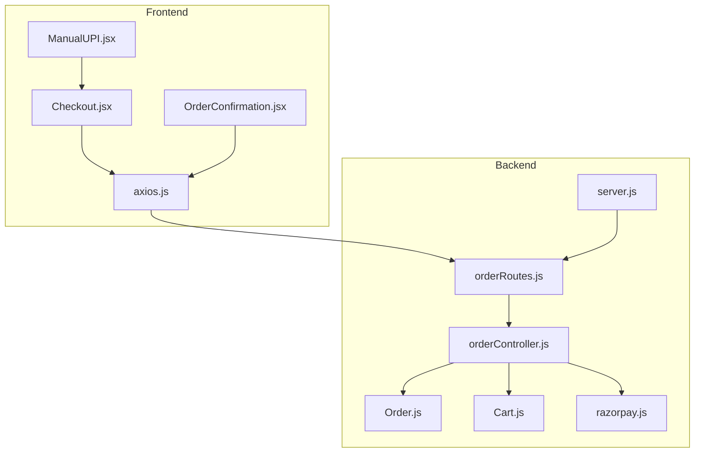
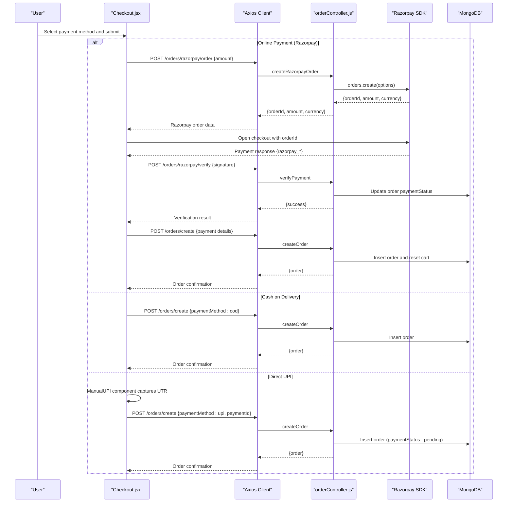
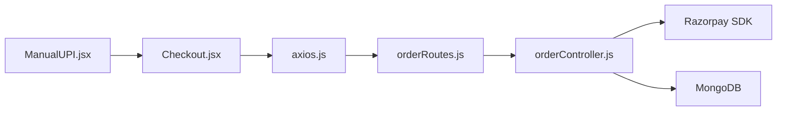
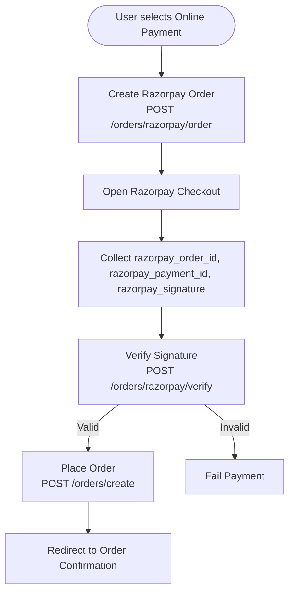
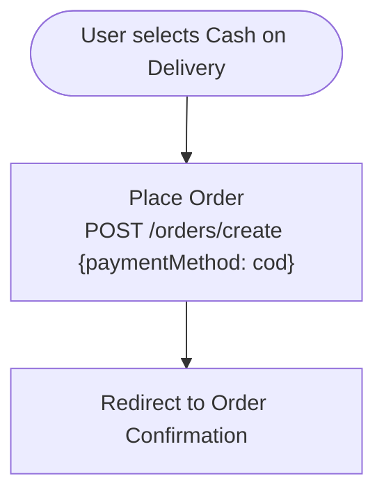
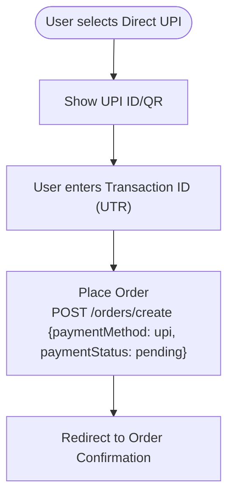
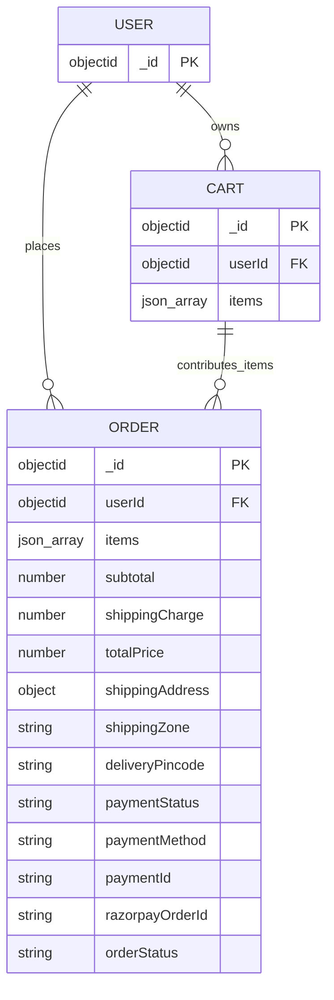

# Payment Integration

<cite>
**Referenced Files in This Document**
- [razorpay.js](file://backend/utils/razorpay.js)
- [orderController.js](file://backend/controllers/orderController.js)
- [orderRoutes.js](file://backend/routes/orderRoutes.js)
- [Order.js](file://backend/models/Order.js)
- [Cart.js](file://backend/models/Cart.js)
- [Checkout.jsx](file://frontend/src/pages/Checkout.jsx)
- [ManualUPI.jsx](file://frontend/src/components/ManualUPI.jsx)
- [OrderConfirmation.jsx](file://frontend/src/pages/OrderConfirmation.jsx)
- [axios.js](file://frontend/src/api/axios.js)
- [server.js](file://backend/server.js)
- [package.json](file://backend/package.json)
</cite>

## Table of Contents
1. [Introduction](#introduction)
2. [Project Structure](#project-structure)
3. [Core Components](#core-components)
4. [Architecture Overview](#architecture-overview)
5. [Detailed Component Analysis](#detailed-component-analysis)
6. [Dependency Analysis](#dependency-analysis)
7. [Performance Considerations](#performance-considerations)
8. [Security and Compliance](#security-and-compliance)
9. [Troubleshooting Guide](#troubleshooting-guide)
10. [Conclusion](#conclusion)
11. [Appendices](#appendices)

## Introduction
This document explains the e-commerce app’s payment integration using Razorpay, covering configuration, API key setup, transaction processing, and the checkout flow. It documents order creation, payment initiation, transaction confirmation, manual UPI handling, verification, and error management. It also outlines security considerations, PCI compliance, and production deployment practices for payment systems.

## Project Structure
The payment system spans frontend React components and backend Node.js/Express controllers and models:
- Backend
  - Payment gateway client initialization
  - Order creation and verification controllers
  - Express routes for payment and order APIs
  - Mongoose models for orders and carts
- Frontend
  - Checkout page orchestrating payment methods
  - Manual UPI component for UPI payments
  - Axios client with auth interceptor
  - Order confirmation page

**Diagram sources**
- [Checkout.jsx:1-301](file://frontend/src/pages/Checkout.jsx#L1-L301)
- [ManualUPI.jsx:1-125](file://frontend/src/components/ManualUPI.jsx#L1-L125)
- [axios.js:1-17](file://frontend/src/api/axios.js#L1-L17)
- [server.js:1-85](file://backend/server.js#L1-L85)
- [orderRoutes.js:1-28](file://backend/routes/orderRoutes.js#L1-L28)
- [orderController.js:1-146](file://backend/controllers/orderController.js#L1-L146)
- [Order.js:1-33](file://backend/models/Order.js#L1-L33)
- [Cart.js:1-12](file://backend/models/Cart.js#L1-L12)
- [razorpay.js:1-10](file://backend/utils/razorpay.js#L1-L10)

**Section sources**
- [server.js:1-85](file://backend/server.js#L1-L85)
- [orderRoutes.js:1-28](file://backend/routes/orderRoutes.js#L1-L28)
- [orderController.js:1-146](file://backend/controllers/orderController.js#L1-L146)
- [razorpay.js:1-10](file://backend/utils/razorpay.js#L1-L10)
- [Order.js:1-33](file://backend/models/Order.js#L1-L33)
- [Cart.js:1-12](file://backend/models/Cart.js#L1-L12)
- [Checkout.jsx:1-301](file://frontend/src/pages/Checkout.jsx#L1-L301)
- [ManualUPI.jsx:1-125](file://frontend/src/components/ManualUPI.jsx#L1-L125)
- [axios.js:1-17](file://frontend/src/api/axios.js#L1-L17)
- [OrderConfirmation.jsx:1-73](file://frontend/src/pages/OrderConfirmation.jsx#L1-L73)

## Core Components
- Razorpay client initialization and environment variables
- Order creation controller supporting multiple payment methods
- Razorpay order creation and signature verification
- Frontend checkout orchestration and manual UPI component
- Axios client with bearer token injection

Key responsibilities:
- Backend initializes Razorpay SDK with environment keys and exposes endpoints for order creation, Razorpay order creation, and verification.
- Frontend loads the Razorpay checkout script, collects shipping and billing details, and triggers payment flows based on selected method.
- Manual UPI component generates UPI links and QR codes and captures transaction IDs for order placement.

**Section sources**
- [razorpay.js:1-10](file://backend/utils/razorpay.js#L1-L10)
- [orderController.js:39-146](file://backend/controllers/orderController.js#L39-L146)
- [orderRoutes.js:15-27](file://backend/routes/orderRoutes.js#L15-L27)
- [Checkout.jsx:45-137](file://frontend/src/pages/Checkout.jsx#L45-L137)
- [ManualUPI.jsx:1-125](file://frontend/src/components/ManualUPI.jsx#L1-L125)
- [axios.js:1-17](file://frontend/src/api/axios.js#L1-L17)

## Architecture Overview
End-to-end payment flow:
- Frontend validates address, calculates totals, and selects payment method.
- For online payment, it creates a Razorpay order server-side, opens the Razorpay checkout, and verifies the payment server-side.
- For COD and manual UPI, it places the order directly with appropriate payment status and method.
- On success, the frontend navigates to the order confirmation page.

**Diagram sources**
- [Checkout.jsx:88-165](file://frontend/src/pages/Checkout.jsx#L88-L165)
- [orderController.js:39-146](file://backend/controllers/orderController.js#L39-L146)
- [orderRoutes.js:20-22](file://backend/routes/orderRoutes.js#L20-L22)
- [Order.js:23-27](file://backend/models/Order.js#L23-L27)

## Detailed Component Analysis

### Backend: Razorpay Client Initialization
- Initializes the Razorpay SDK using environment variables for key ID and secret.
- Exports a configured client instance for use in controllers.

Implementation highlights:
- Loads environment variables via dotenv.
- Creates a Razorpay instance with key_id and key_secret.

**Section sources**
- [razorpay.js:1-10](file://backend/utils/razorpay.js#L1-L10)

### Backend: Order Controller
Endpoints and logic:
- Create Razorpay order: accepts amount, constructs options with currency and capture, calls Razorpay SDK, returns orderId and amount.
- Verify payment: computes HMAC-SHA256 signature from received order and payment IDs, compares with provided signature, updates order to paid and confirmed if valid.
- Create order: builds items from cart, determines payment and order statuses based on method, persists order, clears cart, and returns order details.

Data model integration:
- Uses Order model for payment and status fields.
- Uses Cart model to populate items and clear after order creation.

**Section sources**
- [orderController.js:39-146](file://backend/controllers/orderController.js#L39-L146)
- [Order.js:23-30](file://backend/models/Order.js#L23-L30)
- [Cart.js:1-12](file://backend/models/Cart.js#L1-L12)

### Backend: Routes
- Exposes endpoints for:
  - Creating orders
  - Fetching user orders and a specific order
  - Creating Razorpay orders
  - Verifying Razorpay payments
  - Admin-only endpoints for listing orders and updating order status

Protection:
- Uses auth middleware to protect user routes and admin routes.

**Section sources**
- [orderRoutes.js:1-28](file://backend/routes/orderRoutes.js#L1-L28)

### Frontend: Checkout Page
Responsibilities:
- Loads Razorpay checkout script dynamically.
- Calculates subtotal and total, validates address, and handles three payment methods:
  - Online payment: creates Razorpay order, opens checkout, verifies signature, then creates order.
  - Cash on delivery: posts order with cod method.
  - Direct UPI: delegates to ManualUPI component and posts order with upi method and pending status.

Error handling:
- Displays toast notifications for validation and API errors.
- Prevents submission until shipping info is available.

**Section sources**
- [Checkout.jsx:1-301](file://frontend/src/pages/Checkout.jsx#L1-L301)

### Frontend: Manual UPI Component
Features:
- Displays UPI ID and amount.
- Generates UPI payment link and optional QR code.
- Copies UPI ID to clipboard.
- Captures transaction ID (UTR) and invokes parent callback to place order with pending payment status.

**Section sources**
- [ManualUPI.jsx:1-125](file://frontend/src/components/ManualUPI.jsx#L1-L125)

### Frontend: Axios Client and Authentication
- Base URL configured from environment variable.
- Injects Authorization header with Bearer token if present.
- Handles 401 responses by removing token.

**Section sources**
- [axios.js:1-17](file://frontend/src/api/axios.js#L1-L17)

### Frontend: Order Confirmation Page
- Renders order details and status after successful order placement.

**Section sources**
- [OrderConfirmation.jsx:1-73](file://frontend/src/pages/OrderConfirmation.jsx#L1-L73)

### Backend: Server Configuration and CORS
- Enables CORS for allowed origins, credentials, and methods.
- Serves static uploads and mounts API routes.
- Includes health check endpoint.

**Section sources**
- [server.js:22-72](file://backend/server.js#L22-L72)

## Dependency Analysis
External libraries and integrations:
- Backend depends on Razorpay SDK for payment processing.
- Frontend depends on Razorpay checkout script loaded at runtime.
- Both sides rely on environment variables for API keys and base URLs.

**Diagram sources**
- [Checkout.jsx:1-301](file://frontend/src/pages/Checkout.jsx#L1-L301)
- [axios.js:1-17](file://frontend/src/api/axios.js#L1-L17)
- [orderRoutes.js:1-28](file://backend/routes/orderRoutes.js#L1-L28)
- [orderController.js:1-146](file://backend/controllers/orderController.js#L1-L146)
- [package.json:8-22](file://backend/package.json#L8-L22)

**Section sources**
- [package.json:8-22](file://backend/package.json#L8-L22)
- [Checkout.jsx:45-50](file://frontend/src/pages/Checkout.jsx#L45-L50)
- [orderController.js:4-5](file://backend/controllers/orderController.js#L4-L5)

## Performance Considerations
- Minimize synchronous work in controllers; leverage async/await and streaming where applicable.
- Cache frequently accessed shipping zones and rates at the application level if needed.
- Use connection pooling and limit concurrent Razorpay API calls.
- Keep frontend bundles lean; lazy-load Razorpay script only when needed.
- Monitor API latency and implement retry/backoff for transient failures.

## Security and Compliance
- PCI DSS: Do not store cardholder data; rely on Razorpay for tokenization and PCI-compliant processing.
- Secrets management:
  - Store RAZORPAY_KEY_ID and RAZORPAY_KEY_SECRET in environment variables.
  - Avoid committing secrets to version control.
- Transport security:
  - Enforce HTTPS in production.
  - Use secure cookies and strict SameSite attributes for session tokens.
- Input validation:
  - Validate amounts, addresses, and UPI transaction IDs on both frontend and backend.
- Signature verification:
  - Always recompute HMAC-SHA256 on backend using stored secret and reject invalid signatures.
- CORS and CSRF:
  - Configure CORS strictly for trusted origins.
  - Use CSRF tokens for state-changing requests if forms are used.
- Logging and monitoring:
  - Log payment events and verification outcomes; avoid logging sensitive data.
  - Set up alerts for failed verifications and unusual patterns.

## Troubleshooting Guide
Common issues and resolutions:
- Razorpay order creation fails:
  - Verify environment variables and network connectivity.
  - Check backend logs for error messages.
- Payment verification fails:
  - Confirm RAZORPAY_KEY_SECRET matches the dashboard secret.
  - Ensure signature computation uses the exact concatenation format.
- Frontend crashes on payment:
  - Ensure Razorpay script is loaded before instantiating checkout.
  - Validate amount and currency match backend expectations.
- Manual UPI order not updating:
  - Admin must manually confirm orders with pending UPI status.
- CORS errors:
  - Add frontend origin to allowedOrigins and ensure credentials are enabled.

Debugging techniques:
- Inspect browser network tab for request/response payloads.
- Enable backend logging for payment endpoints.
- Use order IDs to correlate frontend events with backend records.

Testing strategies:
- Unit tests for signature verification and order creation logic.
- Integration tests for end-to-end flows (online, COD, UPI).
- Load tests to validate payment throughput under concurrency.

**Section sources**
- [orderController.js:52-67](file://backend/controllers/orderController.js#L52-L67)
- [Checkout.jsx:94-132](file://frontend/src/pages/Checkout.jsx#L94-L132)
- [server.js:22-49](file://backend/server.js#L22-L49)

## Conclusion
The payment integration leverages Razorpay for secure online transactions, supports COD and manual UPI as alternative methods, and ensures robust verification and order management. By following the outlined security practices, error handling, and testing strategies, the system remains reliable and compliant for production use.

## Appendices

### Payment Flow: Online (Razorpay)

**Diagram sources**
- [Checkout.jsx:88-137](file://frontend/src/pages/Checkout.jsx#L88-L137)
- [orderController.js:39-67](file://backend/controllers/orderController.js#L39-L67)
- [orderRoutes.js:20-22](file://backend/routes/orderRoutes.js#L20-L22)

### Payment Flow: COD

**Diagram sources**
- [Checkout.jsx:67-86](file://frontend/src/pages/Checkout.jsx#L67-L86)
- [orderController.js:83-146](file://backend/controllers/orderController.js#L83-L146)

### Payment Flow: Manual UPI

**Diagram sources**
- [ManualUPI.jsx:19-25](file://frontend/src/components/ManualUPI.jsx#L19-L25)
- [Checkout.jsx:139-165](file://frontend/src/pages/Checkout.jsx#L139-L165)
- [orderController.js:83-146](file://backend/controllers/orderController.js#L83-L146)

### Data Model: Order

**Diagram sources**
- [Order.js:1-33](file://backend/models/Order.js#L1-L33)
- [Cart.js:1-12](file://backend/models/Cart.js#L1-L12)