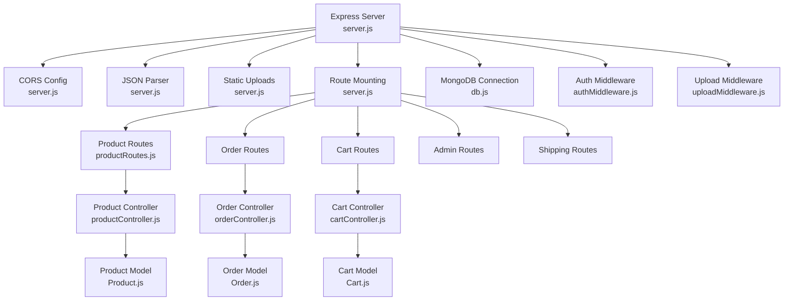
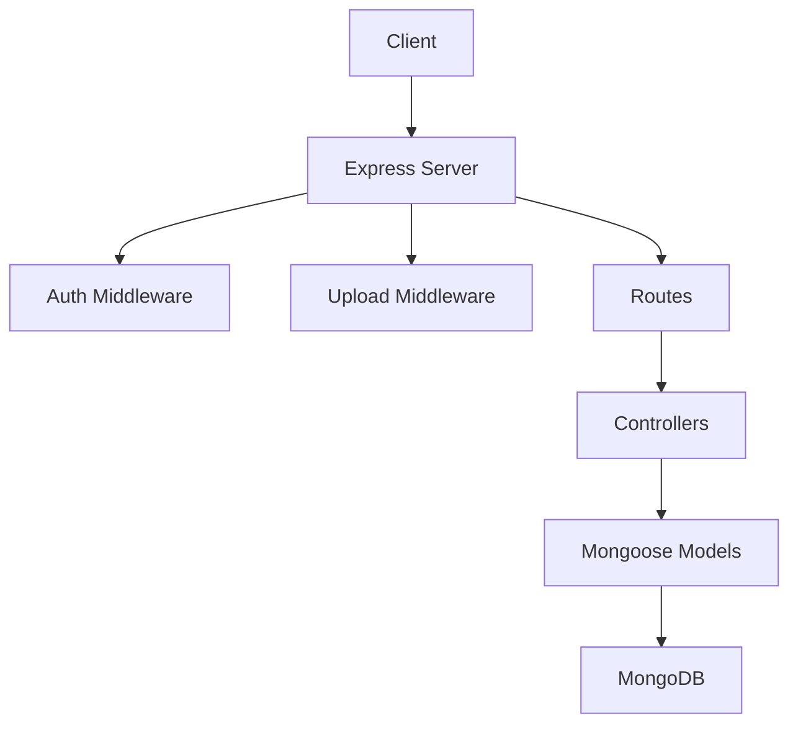
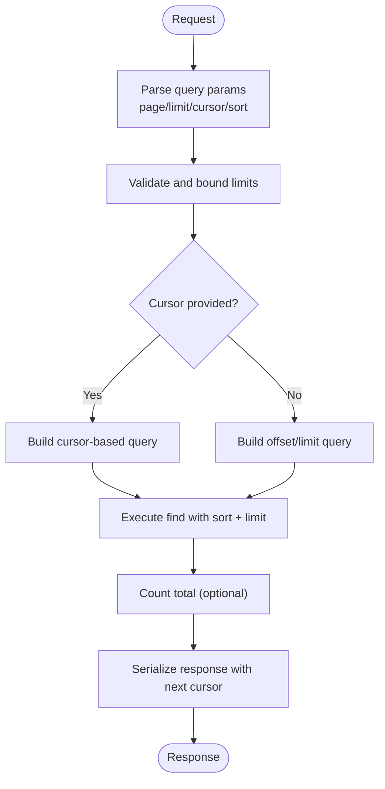
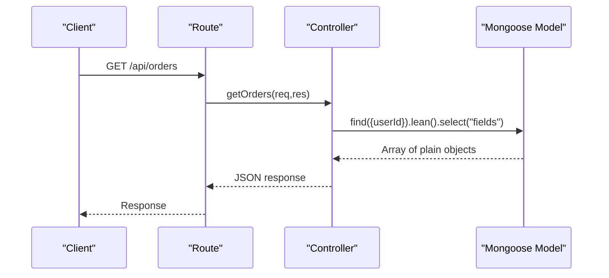
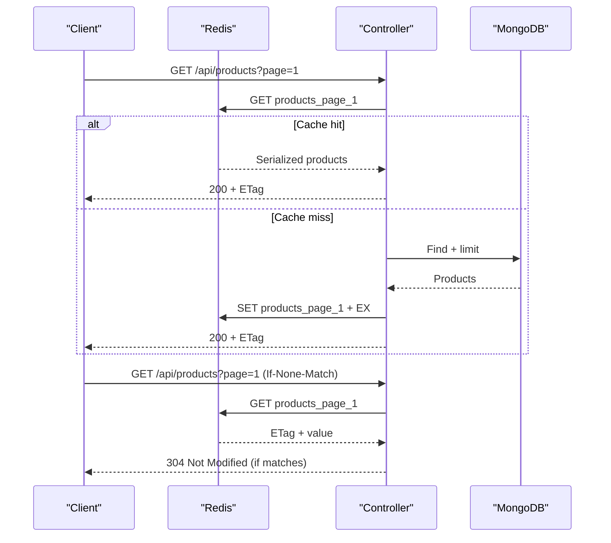
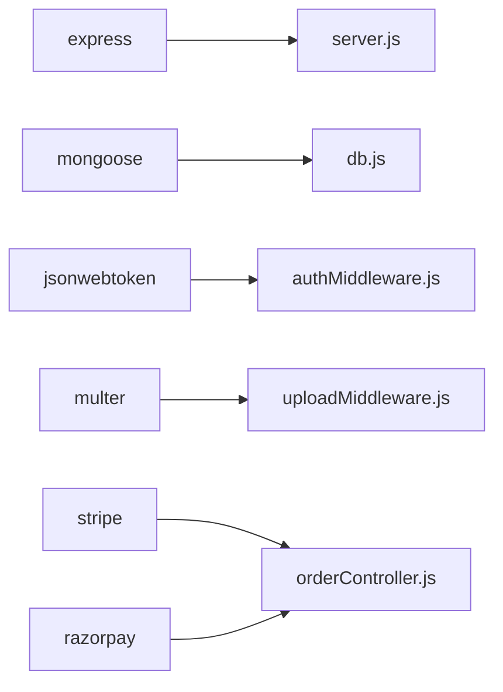

# API Response Optimization

<cite>
**Referenced Files in This Document**
- [server.js](file://backend/server.js)
- [package.json](file://backend/package.json)
- [db.js](file://backend/config/db.js)
- [authMiddleware.js](file://backend/middleware/authMiddleware.js)
- [uploadMiddleware.js](file://backend/middleware/uploadMiddleware.js)
- [productController.js](file://backend/controllers/productController.js)
- [orderController.js](file://backend/controllers/orderController.js)
- [cartController.js](file://backend/controllers/cartController.js)
- [productRoutes.js](file://backend/routes/productRoutes.js)
- [Product.js](file://backend/models/Product.js)
- [Order.js](file://backend/models/Order.js)
- [Cart.js](file://backend/models/Cart.js)
</cite>

## Table of Contents
1. [Introduction](#introduction)
2. [Project Structure](#project-structure)
3. [Core Components](#core-components)
4. [Architecture Overview](#architecture-overview)
5. [Detailed Component Analysis](#detailed-component-analysis)
6. [Dependency Analysis](#dependency-analysis)
7. [Performance Considerations](#performance-considerations)
8. [Troubleshooting Guide](#troubleshooting-guide)
9. [Conclusion](#conclusion)
10. [Appendices](#appendices)

## Introduction
This document provides comprehensive API response optimization guidance for the e-commerce RESTful backend. It focuses on pagination strategies, server-side filtering, data serialization optimization, caching, request optimization, compression, monitoring, and rate limiting. The goal is to help you build scalable, responsive APIs while maintaining simplicity and clarity.

## Project Structure
The backend is organized around Express.js with modular controllers, routes, middleware, and Mongoose models. Key areas for optimization include:
- Request pipeline: server initialization, CORS, JSON parsing, static assets, routes, and error handling
- Controllers: product, order, and cart operations
- Middleware: authentication and file upload
- Data access: Mongoose models and database connection

**Diagram sources**
- [server.js:1-102](file://backend/server.js#L1-L102)
- [productRoutes.js:1-23](file://backend/routes/productRoutes.js#L1-L23)
- [productController.js:1-127](file://backend/controllers/productController.js#L1-L127)
- [orderController.js:1-146](file://backend/controllers/orderController.js#L1-L146)
- [cartController.js:1-38](file://backend/controllers/cartController.js#L1-L38)
- [Product.js:1-12](file://backend/models/Product.js#L1-L12)
- [Order.js:1-33](file://backend/models/Order.js#L1-L33)
- [Cart.js:1-12](file://backend/models/Cart.js#L1-L12)
- [db.js:1-14](file://backend/config/db.js#L1-L14)
- [authMiddleware.js:1-20](file://backend/middleware/authMiddleware.js#L1-L20)
- [uploadMiddleware.js:1-30](file://backend/middleware/uploadMiddleware.js#L1-L30)

**Section sources**
- [server.js:1-102](file://backend/server.js#L1-L102)
- [productRoutes.js:1-23](file://backend/routes/productRoutes.js#L1-L23)

## Core Components
- Express server with CORS, JSON parsing, static uploads, and health endpoint
- Product catalog with search, filter, and pagination
- Order lifecycle with payment integration and status updates
- Shopping cart with item manipulation
- Authentication middleware and upload middleware
- Mongoose models for Product, Order, and Cart

Optimization opportunities:
- Pagination: switch from offset-based to cursor-based pagination for deep paging
- Filtering: add server-side filters and projections to reduce payload sizes
- Serialization: apply lean queries and projections to avoid unnecessary fields
- Caching: integrate Redis for hot reads and cache headers for clients
- Compression: enable gzip/deflate and content negotiation
- Monitoring: track response times, throughput, and error rates
- Rate limiting: implement request throttling and abuse prevention

**Section sources**
- [server.js:1-102](file://backend/server.js#L1-L102)
- [productController.js:1-127](file://backend/controllers/productController.js#L1-L127)
- [orderController.js:1-146](file://backend/controllers/orderController.js#L1-L146)
- [cartController.js:1-38](file://backend/controllers/cartController.js#L1-L38)
- [authMiddleware.js:1-20](file://backend/middleware/authMiddleware.js#L1-L20)
- [uploadMiddleware.js:1-30](file://backend/middleware/uploadMiddleware.js#L1-L30)
- [Product.js:1-12](file://backend/models/Product.js#L1-L12)
- [Order.js:1-33](file://backend/models/Order.js#L1-L33)
- [Cart.js:1-12](file://backend/models/Cart.js#L1-L12)

## Architecture Overview
The API follows a layered architecture:
- Entry point initializes Express, connects to MongoDB, mounts routes, and defines middleware
- Controllers handle business logic and interact with models
- Models define schemas and indexes
- Middleware enforces auth and handles uploads

**Diagram sources**
- [server.js:1-102](file://backend/server.js#L1-L102)
- [authMiddleware.js:1-20](file://backend/middleware/authMiddleware.js#L1-L20)
- [uploadMiddleware.js:1-30](file://backend/middleware/uploadMiddleware.js#L1-L30)
- [productController.js:1-127](file://backend/controllers/productController.js#L1-L127)
- [orderController.js:1-146](file://backend/controllers/orderController.js#L1-L146)
- [cartController.js:1-38](file://backend/controllers/cartController.js#L1-L38)
- [Product.js:1-12](file://backend/models/Product.js#L1-L12)
- [Order.js:1-33](file://backend/models/Order.js#L1-L33)
- [Cart.js:1-12](file://backend/models/Cart.js#L1-L12)
- [db.js:1-14](file://backend/config/db.js#L1-L14)

## Detailed Component Analysis

### Pagination Strategies
Current implementation uses offset/limit with sort and count. To scale:
- Replace with cursor-based pagination using last seen IDs/timestamps
- Enforce strict limit bounds and reject oversized requests
- Add reverse pagination for historical traversal
- Use sparse indexes on sort fields for performance

**Diagram sources**
- [productController.js:4-37](file://backend/controllers/productController.js#L4-L37)

**Section sources**
- [productController.js:4-37](file://backend/controllers/productController.js#L4-L37)

### Efficient Limit/Oversized Requests
- Enforce maximum limit per request (e.g., cap at 100)
- Reject requests exceeding limits with 400
- Provide a note in responses about recommended limit sizes

**Section sources**
- [productController.js:6](file://backend/controllers/productController.js#L6)

### Server-Side Filtering
- Add category, price range, availability filters
- Support boolean flags (e.g., inStock)
- Index filtered fields for fast lookups

**Section sources**
- [productController.js:8-17](file://backend/controllers/productController.js#L8-L17)
- [Product.js:3-10](file://backend/models/Product.js#L3-L10)

### Data Serialization Optimization
- Use lean queries to avoid Mongoose overhead
- Apply projections to exclude unused fields
- Avoid N+1 queries via populate and aggregation pipelines
- Normalize nested arrays and objects to reduce payload size

**Diagram sources**
- [orderController.js:19-27](file://backend/controllers/orderController.js#L19-L27)

**Section sources**
- [orderController.js:10](file://backend/controllers/orderController.js#L10)
- [orderController.js:22](file://backend/controllers/orderController.js#L22)
- [orderController.js:32](file://backend/controllers/orderController.js#L32)

### API Caching Strategies
- Integrate Redis for session, product lists, and cart snapshots
- Use cache headers (ETag, Last-Modified) for client-side caching
- Implement cache invalidation on write operations
- Use stale-while-revalidate for improved perceived latency

**Diagram sources**
- [productController.js:4-37](file://backend/controllers/productController.js#L4-L37)
- [server.js:46](file://backend/server.js#L46)

**Section sources**
- [server.js:46](file://backend/server.js#L46)

### Request Optimization: Batch and Bulk Operations
- Batch endpoints: combine multiple product reads into one request
- Bulk updates: allow updating multiple cart items in one call
- Efficient fetching: use query parameters to request minimal fields

**Section sources**
- [cartController.js:9-32](file://backend/controllers/cartController.js#L9-L32)

### Response Compression
- Enable gzip/deflate globally
- Respect Accept-Encoding header
- Prefer compression for JSON payloads

**Section sources**
- [server.js:51-52](file://backend/server.js#L51-L52)

### Content Negotiation
- Honor Accept and Content-Type headers
- Return appropriate media types
- Provide structured error responses

**Section sources**
- [server.js:44](file://backend/server.js#L44)

### API Monitoring and Metrics
- Track response time per endpoint
- Measure throughput (requests/sec)
- Monitor error rates and 5xx failures
- Export metrics to Prometheus or similar

**Section sources**
- [server.js:91-95](file://backend/server.js#L91-L95)

### Rate Limiting and Abuse Prevention
- Implement sliding window or token bucket rate limiting
- Differentiate by IP, user ID, and route
- Return standard headers (e.g., X-RateLimit-Limit, X-RateLimit-Remaining)
- Block suspicious bursts with 429

**Section sources**
- [authMiddleware.js:5](file://backend/middleware/authMiddleware.js#L5)

## Dependency Analysis
Key dependencies and their roles:
- Express: web framework
- Mongoose: ODM for MongoDB
- Dotenv: environment configuration
- JWT: authentication
- Multer: file uploads
- Stripe/Razorpay: payments

**Diagram sources**
- [package.json:8-22](file://backend/package.json#L8-L22)
- [server.js:1-102](file://backend/server.js#L1-L102)
- [db.js:1-14](file://backend/config/db.js#L1-L14)
- [authMiddleware.js:1-20](file://backend/middleware/authMiddleware.js#L1-L20)
- [uploadMiddleware.js:1-30](file://backend/middleware/uploadMiddleware.js#L1-L30)
- [orderController.js:1-146](file://backend/controllers/orderController.js#L1-L146)

**Section sources**
- [package.json:8-22](file://backend/package.json#L8-L22)

## Performance Considerations
- Database indexing: ensure compound indexes on sort/filter fields (e.g., category + createdAt)
- Query normalization: avoid regex searches on large collections; prefer exact matches or text indexes
- Projection: always select only required fields
- Aggregation: use aggregation pipelines for complex analytics
- Connection pooling: configure Mongoose pool size appropriately
- CDN: serve static images via CDN for product thumbnails

[No sources needed since this section provides general guidance]

## Troubleshooting Guide
Common issues and resolutions:
- CORS errors: verify allowed origins and credentials
- 500 errors: centralized error handler logs stack traces
- Authentication failures: missing/expired tokens return 401
- Upload errors: invalid file types or size exceeded

**Section sources**
- [server.js:32-49](file://backend/server.js#L32-L49)
- [server.js:91-95](file://backend/server.js#L91-L95)
- [authMiddleware.js:4-15](file://backend/middleware/authMiddleware.js#L4-L15)
- [uploadMiddleware.js:14-28](file://backend/middleware/uploadMiddleware.js#L14-L28)

## Conclusion
By adopting cursor-based pagination, lean queries, targeted projections, Redis caching, compression, and robust monitoring, the API can achieve significant improvements in latency, throughput, and scalability. Implement rate limiting and abuse controls to protect the system under load. These changes will yield a more responsive and reliable e-commerce backend.

[No sources needed since this section summarizes without analyzing specific files]

## Appendices

### Practical Examples and Best Practices
- Pagination
  - Use cursor-based pagination for deep navigation
  - Cap limit and enforce minimum/maximum bounds
- Filtering
  - Add category, price range, and availability filters
  - Index filtered fields
- Serialization
  - Use lean queries and projections
  - Avoid N+1 queries; denormalize where beneficial
- Caching
  - Cache product lists and cart snapshots
  - Use ETags and stale-while-revalidate
- Compression
  - Enable gzip/deflate globally
- Monitoring
  - Track response time, throughput, and error rates
- Rate Limiting
  - Implement sliding window or token bucket
  - Return standard rate limit headers

[No sources needed since this section provides general guidance]