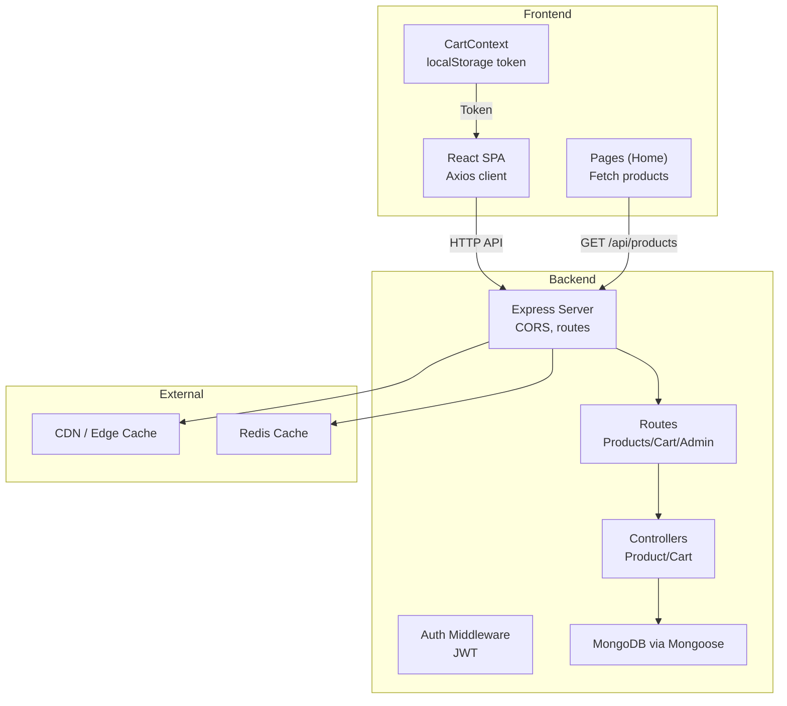
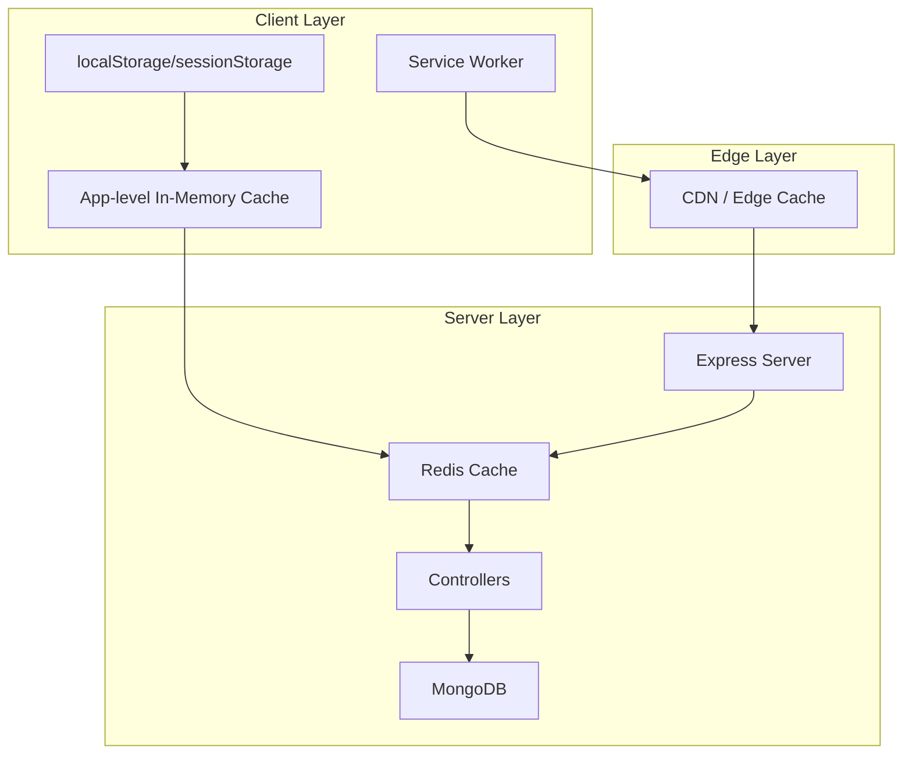
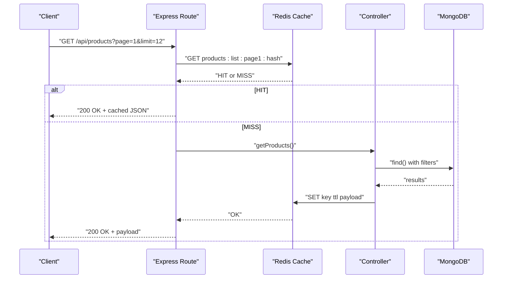
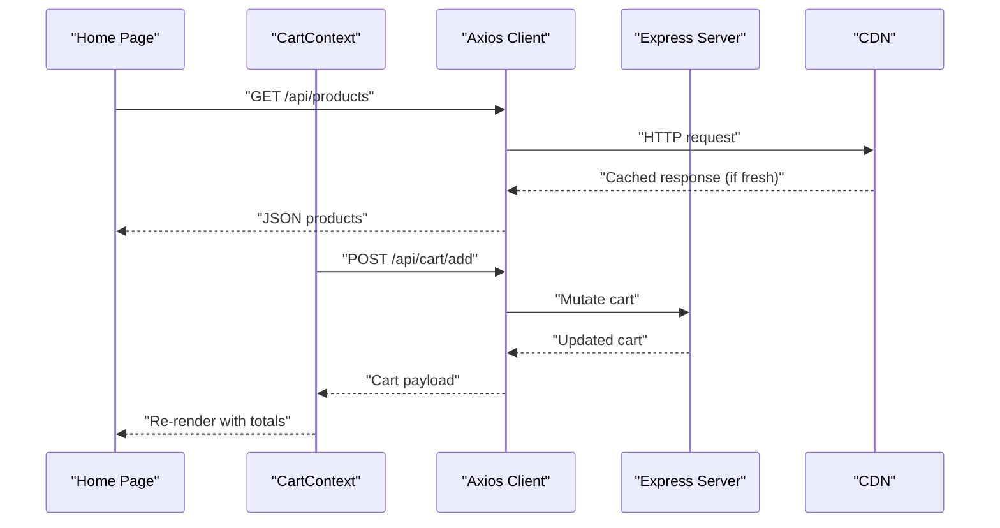
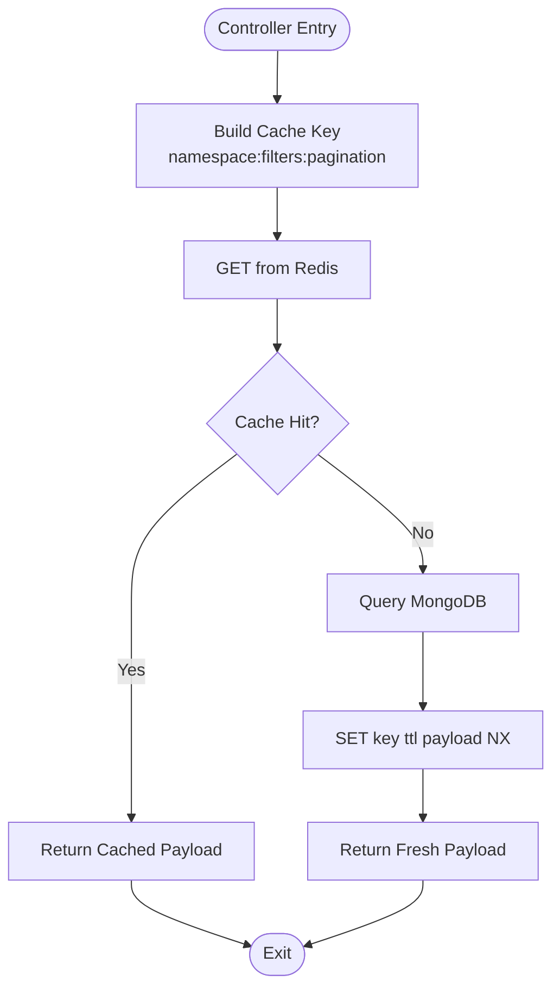
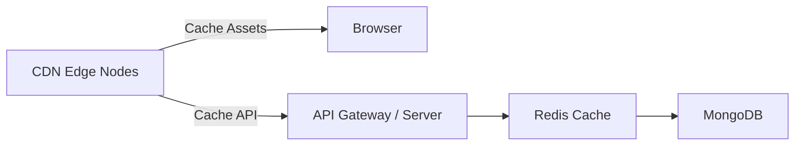
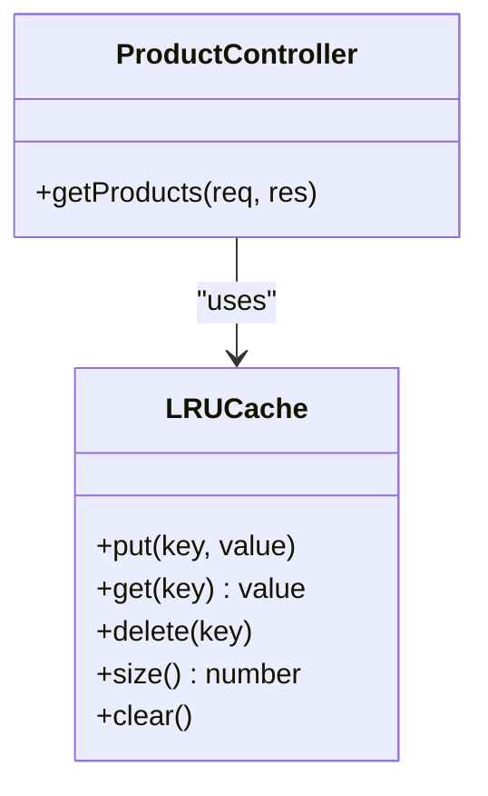
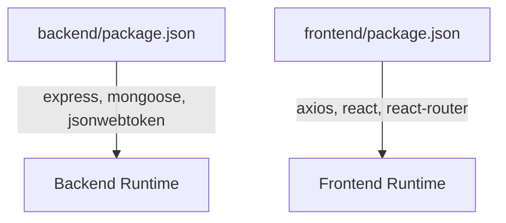

# Caching Strategies

<cite>
**Referenced Files in This Document**
- [server.js](file://backend/server.js)
- [db.js](file://backend/config/db.js)
- [authMiddleware.js](file://backend/middleware/authMiddleware.js)
- [productController.js](file://backend/controllers/productController.js)
- [cartController.js](file://backend/controllers/cartController.js)
- [productRoutes.js](file://backend/routes/productRoutes.js)
- [axios.js](file://frontend/src/api/axios.js)
- [CartContext.jsx](file://frontend/src/context/CartContext.jsx)
- [Home.jsx](file://frontend/src/pages/Home.jsx)
- [package.json](file://backend/package.json)
- [package.json](file://frontend/package.json)
</cite>

## Table of Contents
1. [Introduction](#introduction)
2. [Project Structure](#project-structure)
3. [Core Components](#core-components)
4. [Architecture Overview](#architecture-overview)
5. [Detailed Component Analysis](#detailed-component-analysis)
6. [Dependency Analysis](#dependency-analysis)
7. [Performance Considerations](#performance-considerations)
8. [Troubleshooting Guide](#troubleshooting-guide)
9. [Conclusion](#conclusion)
10. [Appendices](#appendices)

## Introduction
This document defines a comprehensive, multi-layered caching strategy for the E-commerce App. It covers server-side caching with Redis, client-side caching via localStorage/sessionStorage and service workers, database query caching, CDN caching for static assets and API responses, and application-level in-memory caches. It also documents cache key design, expiration policies, cache warming, invalidation triggers, consistency strategies, monitoring, and practical optimization techniques tailored to the app’s current stack and usage patterns.

## Project Structure
The app comprises:
- Backend: Express server, MongoDB via Mongoose, JWT-protected routes, and static asset serving.
- Frontend: React SPA using Axios for API calls, local state and localStorage for session tokens, and React contexts for cart state.
- Deployment: The backend runs as a Node.js/Express service; the frontend is built and served statically; the repository includes a Vercel serverless folder indicating potential edge deployment.

**Diagram sources**
- [server.js:1-102](file://backend/server.js#L1-L102)
- [productRoutes.js:1-23](file://backend/routes/productRoutes.js#L1-L23)
- [productController.js:1-127](file://backend/controllers/productController.js#L1-L127)
- [cartController.js:1-38](file://backend/controllers/cartController.js#L1-L38)
- [axios.js:1-17](file://frontend/src/api/axios.js#L1-L17)
- [CartContext.jsx:1-53](file://frontend/src/context/CartContext.jsx#L1-L53)
- [Home.jsx:1-108](file://frontend/src/pages/Home.jsx#L1-L108)

**Section sources**
- [server.js:1-102](file://backend/server.js#L1-L102)
- [productRoutes.js:1-23](file://backend/routes/productRoutes.js#L1-L23)
- [axios.js:1-17](file://frontend/src/api/axios.js#L1-L17)
- [CartContext.jsx:1-53](file://frontend/src/context/CartContext.jsx#L1-L53)
- [Home.jsx:1-108](file://frontend/src/pages/Home.jsx#L1-L108)

## Core Components
- Express server with CORS and static asset serving.
- MongoDB/Mongoose for persistence.
- JWT-based authentication middleware.
- Controllers for product and cart operations.
- Frontend Axios client with token injection and automatic logout on 401.
- React context managing cart state and localStorage token.

Key observations:
- No Redis or in-memory cache libraries are currently installed or used.
- Static assets are served via Express; no explicit CDN caching headers are configured.
- Client-side caching is minimal: localStorage token and React context state.

**Section sources**
- [server.js:1-102](file://backend/server.js#L1-L102)
- [db.js:1-14](file://backend/config/db.js#L1-L14)
- [authMiddleware.js:1-20](file://backend/middleware/authMiddleware.js#L1-L20)
- [productController.js:1-127](file://backend/controllers/productController.js#L1-L127)
- [cartController.js:1-38](file://backend/controllers/cartController.js#L1-L38)
- [axios.js:1-17](file://frontend/src/api/axios.js#L1-L17)
- [CartContext.jsx:1-53](file://frontend/src/context/CartContext.jsx#L1-L53)

## Architecture Overview
The current architecture is a straightforward request-response pipeline. To implement multi-layered caching, we propose adding:
- Application-level in-memory cache for hot data.
- Redis-backed cache for shared state and expensive queries.
- Browser caching via cache-control headers and service workers.
- CDN caching for static assets and API responses.
- Database query caching with normalized keys and invalidation hooks.

[No sources needed since this diagram shows conceptual architecture, not actual code structure]

## Detailed Component Analysis

### Server-Side Caching with Redis
Proposed implementation outline:
- Install Redis client library and configure connection pooling.
- Centralized cache wrapper with:
  - Key design: namespace:resourceId:queryHash
  - TTL policy: short-lived for user-scoped data, longer for product catalogs
  - Cache warming: pre-load popular product lists and category filters
- Cache invalidation:
  - Write-through on product updates/deletes
  - Event-driven invalidation on inventory changes
  - Purge by pattern for admin actions

[No sources needed since this diagram shows conceptual Redis flow, not actual code structure]

### Client-Side Caching Patterns
Current client behavior:
- Token stored in localStorage and injected into requests.
- Cart state maintained in React context and refreshed after mutations.

Recommended enhancements:
- localStorage for immutable metadata (e.g., categories, banners).
- sessionStorage for ephemeral UI state.
- Service worker for:
  - Stale-while-revalidate for product listings
  - Cache-first for static assets
  - Network error fallbacks
- Axios interceptors to attach cache-control hints for browser cache.

**Diagram sources**
- [Home.jsx:1-108](file://frontend/src/pages/Home.jsx#L1-L108)
- [CartContext.jsx:1-53](file://frontend/src/context/CartContext.jsx#L1-L53)
- [axios.js:1-17](file://frontend/src/api/axios.js#L1-L17)

**Section sources**
- [axios.js:1-17](file://frontend/src/api/axios.js#L1-L17)
- [CartContext.jsx:1-53](file://frontend/src/context/CartContext.jsx#L1-L53)
- [Home.jsx:1-108](file://frontend/src/pages/Home.jsx#L1-L108)

### Database Query Caching
Current controller behavior:
- Products listing uses find/sort/skip/limit without caching.
- Cart retrieval and mutation operate on user-scoped collections.

Recommended approach:
- Normalize query parameters (sort, filters, pagination) into a stable hash.
- Cache key pattern: products:list:{hash}
- Invalidate on product create/update/delete and stock changes.
- Use Redis SET with EXpiry and NX to avoid thundering herds.

[No sources needed since this diagram shows conceptual caching logic, not actual code structure]

### CDN Caching Strategies
Current static serving:
- Images served via Express static middleware.

Recommendations:
- Configure cache-control headers for long-term caching of immutable assets.
- Use far-future expires for hashed filenames.
- Apply edge caching for API responses behind cacheable keys.
- Implement cache invalidation via cache tag invalidation or cache-busting URLs.

[No sources needed since this diagram shows conceptual CDN flow, not actual code structure]

### Application-Level Caching
Current state:
- No in-memory cache in the backend.
- Frontend maintains transient UI state in React context.

Recommendations:
- In-memory LRU cache for hot endpoints (e.g., product categories).
- Partition cache by tenant/user scope to prevent cross-user leakage.
- Evict least-used entries on threshold; monitor hit ratio.

[No sources needed since this diagram shows conceptual cache class, not actual code structure]

### Cache Consistency and Coherency
- Eventual consistency: client-side optimistic updates with server reconciliation.
- Cache coherency: invalidate related keys on write operations.
- Cache partitioning: per-user keys for cart and per-resource keys for products.

[No sources needed since this section provides general guidance]

## Dependency Analysis
- Backend depends on Express, Mongoose, and JWT for auth.
- Frontend depends on Axios and React ecosystem.
- No Redis or CDN dependencies are currently declared.

**Diagram sources**
- [package.json:1-27](file://backend/package.json#L1-L27)
- [package.json:1-25](file://frontend/package.json#L1-L25)

**Section sources**
- [package.json:1-27](file://backend/package.json#L1-L27)
- [package.json:1-25](file://frontend/package.json#L1-L25)

## Performance Considerations
- Reduce round-trips: batch cart updates, prefetch product thumbnails.
- Tune pagination limits and cursor-based pagination for large datasets.
- Use compression (gzip/deflate) and efficient serialization.
- Monitor latency and throughput; adjust cache TTLs based on change frequency.

[No sources needed since this section provides general guidance]

## Troubleshooting Guide
Common issues and remedies:
- 401 responses clearing localStorage token automatically; re-authenticate to restore token.
- Cart not updating after add/remove: ensure server returns populated cart and UI refreshes state.
- CORS preflight caching: verify maxAge setting and allowed origins.

**Section sources**
- [axios.js:10-16](file://frontend/src/api/axios.js#L10-L16)
- [CartContext.jsx:31-42](file://frontend/src/context/CartContext.jsx#L31-L42)
- [server.js:32-49](file://backend/server.js#L32-L49)

## Conclusion
The app currently lacks explicit caching layers. By integrating Redis for server-side caching, implementing CDN and browser caching, adding application-level in-memory caches, and establishing robust invalidation and consistency strategies, the system can achieve significant performance gains and improved scalability. Start with low-hanging fruits like product listing caching and static asset caching, then expand to user-scoped caches and advanced invalidation patterns.

[No sources needed since this section summarizes without analyzing specific files]

## Appendices

### Practical Implementation Examples (by file reference)
- Server-side cache key design and TTL policy
  - Reference: [server.js:54-63](file://backend/server.js#L54-L63)
- Cache warming for product listings
  - Reference: [productController.js:4-37](file://backend/controllers/productController.js#L4-L37)
- Client-side token caching and interceptor behavior
  - Reference: [axios.js:1-17](file://frontend/src/api/axios.js#L1-L17)
- Cart state caching and refresh flow
  - Reference: [CartContext.jsx:10-29](file://frontend/src/context/CartContext.jsx#L10-L29)
- Product listing fetch in Home page
  - Reference: [Home.jsx:19-28](file://frontend/src/pages/Home.jsx#L19-L28)

[No additional sources needed beyond those listed above]