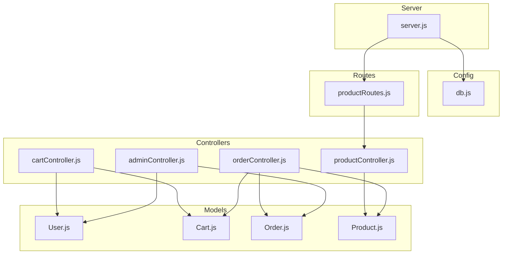
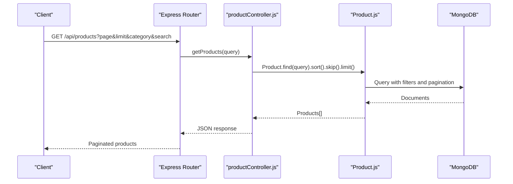
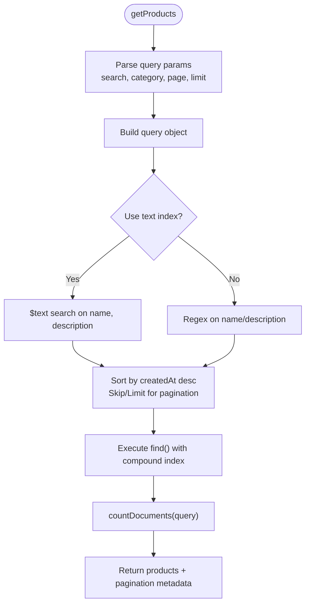
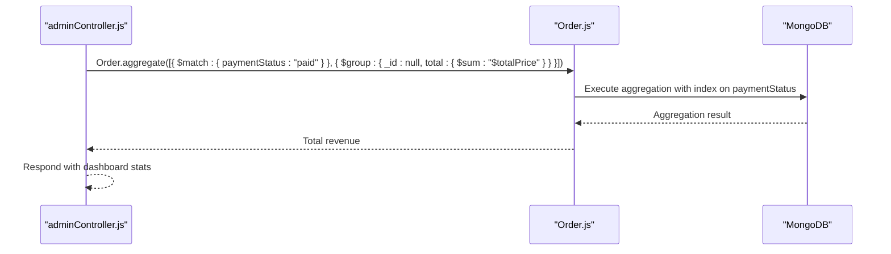
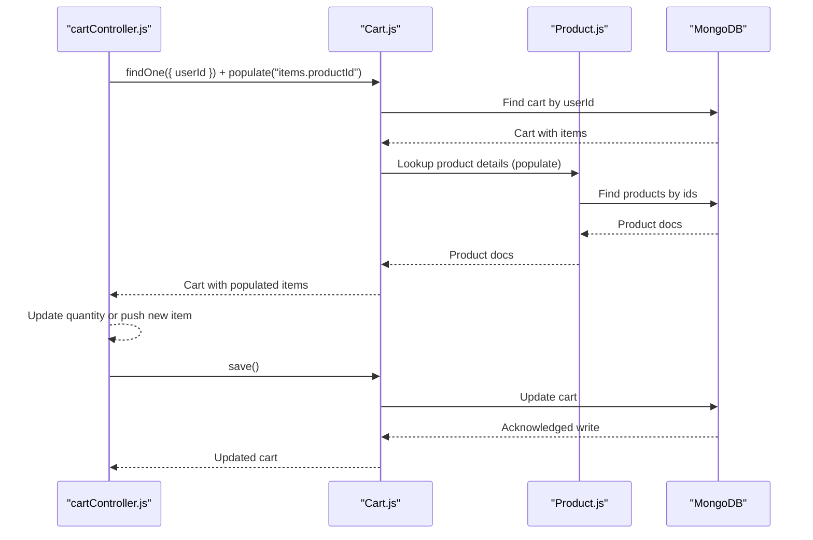
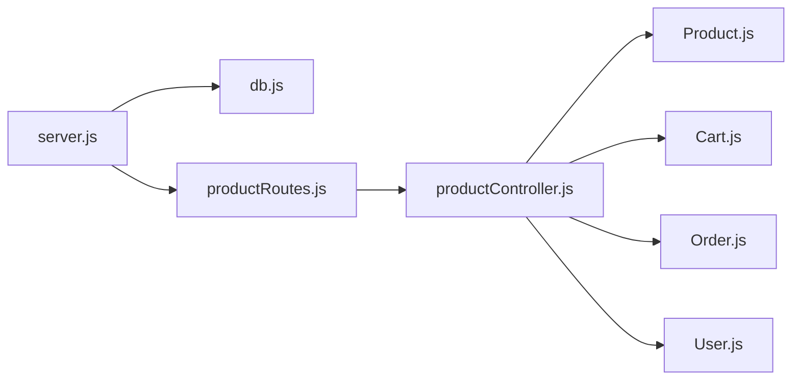

# Database Optimization

<cite>
**Referenced Files in This Document**
- [db.js](file://backend/config/db.js)
- [server.js](file://backend/server.js)
- [Product.js](file://backend/models/Product.js)
- [User.js](file://backend/models/User.js)
- [Cart.js](file://backend/models/Cart.js)
- [Order.js](file://backend/models/Order.js)
- [productController.js](file://backend/controllers/productController.js)
- [cartController.js](file://backend/controllers/cartController.js)
- [orderController.js](file://backend/controllers/orderController.js)
- [adminController.js](file://backend/controllers/adminController.js)
- [productRoutes.js](file://backend/routes/productRoutes.js)
- [package.json](file://backend/package.json)
- [test-mongo.js](file://backend/test-mongo.js)
</cite>

## Table of Contents
1. [Introduction](#introduction)
2. [Project Structure](#project-structure)
3. [Core Components](#core-components)
4. [Architecture Overview](#architecture-overview)
5. [Detailed Component Analysis](#detailed-component-analysis)
6. [Dependency Analysis](#dependency-analysis)
7. [Performance Considerations](#performance-considerations)
8. [Troubleshooting Guide](#troubleshooting-guide)
9. [Conclusion](#conclusion)
10. [Appendices](#appendices)

## Introduction
This document provides comprehensive database optimization guidance tailored to the E-commerce App’s MongoDB-backed Node.js backend. It focuses on indexing strategies (compound, text search, TTL), query optimization (projection, aggregation, joins), connection pooling and timeouts, data modeling best practices (denormalization, embedding vs referencing), monitoring and slow query identification, and caching strategies. Practical examples are referenced from the product controller and other models to illustrate improvements.

## Project Structure
The backend follows a modular structure with clear separation of concerns:
- Configuration: database connection setup
- Models: Mongoose schemas and indexes
- Controllers: business logic and query orchestration
- Routes: endpoint definitions
- Utilities: external integrations (e.g., payment)

**Diagram sources**
- [server.js:1-102](file://backend/server.js#L1-L102)
- [db.js:1-14](file://backend/config/db.js#L1-L14)
- [productRoutes.js:1-23](file://backend/routes/productRoutes.js#L1-L23)
- [productController.js:1-127](file://backend/controllers/productController.js#L1-L127)
- [cartController.js:1-38](file://backend/controllers/cartController.js#L1-L38)
- [orderController.js:1-146](file://backend/controllers/orderController.js#L1-L146)
- [adminController.js:1-24](file://backend/controllers/adminController.js#L1-L24)
- [User.js:1-20](file://backend/models/User.js#L1-L20)
- [Cart.js:1-12](file://backend/models/Cart.js#L1-L12)
- [Order.js:1-33](file://backend/models/Order.js#L1-L33)
- [Product.js:1-12](file://backend/models/Product.js#L1-L12)

**Section sources**
- [server.js:1-102](file://backend/server.js#L1-L102)
- [db.js:1-14](file://backend/config/db.js#L1-L14)
- [productRoutes.js:1-23](file://backend/routes/productRoutes.js#L1-L23)

## Core Components
- Database connection: centralized in the configuration module
- Models: define collections, indexes, and relationships
- Controllers: implement CRUD and aggregation operations
- Routes: expose endpoints for clients

Key observations:
- The connection uses the default Mongoose connection behavior without explicit pool options.
- Indexing is minimal; only a unique index exists on the Cart model.
- Queries commonly use regex-based text search and sorting by timestamps.

**Section sources**
- [db.js:1-14](file://backend/config/db.js#L1-L14)
- [Cart.js:1-12](file://backend/models/Cart.js#L1-L12)
- [productController.js:1-127](file://backend/controllers/productController.js#L1-L127)

## Architecture Overview
The application connects to MongoDB via Mongoose. Requests flow from Express routes to controllers, which interact with models. Aggregation and population are used for reporting and joins.

**Diagram sources**
- [productRoutes.js:14-16](file://backend/routes/productRoutes.js#L14-L16)
- [productController.js:4-37](file://backend/controllers/productController.js#L4-L37)
- [Product.js:1-12](file://backend/models/Product.js#L1-L12)

## Detailed Component Analysis

### Database Connection Pooling and Reuse
- Current behavior: The connection is established once during server startup. No explicit pool configuration is set, relying on Mongoose defaults.
- Recommendations:
  - Configure connection pool size and timeouts to handle concurrent requests efficiently.
  - Enable connection retry and heartbeat intervals for resilience.
  - Use environment-specific connection strings and secrets management.

Practical steps:
- Set connection options in the connection function to tune poolMaxIdleTime, maxPoolSize, minPoolSize, serverSelectionTimeoutMS, socketTimeoutMS, and heartbeatFrequencyMS.
- Centralize connection configuration and export a shared connection instance if needed.

**Section sources**
- [db.js:5-13](file://backend/config/db.js#L5-L13)
- [server.js:17-18](file://backend/server.js#L17-L18)

### Indexing Strategies

#### Compound Indexes
- Product listing with category and createdAt:
  - Create a compound index on { category: 1, createdAt: -1 } to accelerate paginated category filtering.
- Product search and category:
  - Create a compound index on { category: 1, name: 1, description: 1 } to support text-like queries on name/description within a category.
- Cart operations:
  - The unique index on { userId: 1 } is appropriate for fast lookups by user.
- Orders:
  - Create indexes on { userId: 1, createdAt: -1 } for user order history.
  - Create indexes on { paymentStatus: 1, createdAt: -1 } for revenue aggregation and status reporting.

#### Text Search Indexes
- Current search uses regex on name and description. To improve performance:
  - Create a text index on { name: "text", description: "text" }.
  - Replace regex queries with $text search for better performance.
  - Use project() to return only necessary fields.

#### TTL Indexes
- For ephemeral data (e.g., temporary carts):
  - Add an expiresAfterSeconds field and a TTL index to auto-remove stale carts after a period.

Implementation references:
- Add indexes in the model definitions and apply migrations to create them in the database.

**Section sources**
- [Product.js:1-12](file://backend/models/Product.js#L1-L12)
- [Cart.js:1-12](file://backend/models/Cart.js#L1-L12)
- [Order.js:1-33](file://backend/models/Order.js#L1-L33)
- [productController.js:9-17](file://backend/controllers/productController.js#L9-L17)

### Query Optimization Techniques

#### Projection Optimization
- Avoid returning unnecessary fields. Use select() or lean() for read-heavy endpoints.
- Example: Return only name, price, images for product listings; avoid full documents when not needed.

#### Aggregation Pipeline Efficiency
- Revenue calculation aggregates paid orders; ensure an index on { paymentStatus: 1 } for fast filtering.
- Populate selectively and limit fields projected from populated documents.

#### Efficient Join Patterns
- Use populate() for small reference sets (e.g., cart items).
- For large datasets, consider embedding frequently accessed fields (e.g., product name/price inside order items) to reduce joins.

References:
- Aggregation for revenue and populate usage in admin and order controllers.

**Section sources**
- [adminController.js:8-11](file://backend/controllers/adminController.js#L8-L11)
- [orderController.js:30-36](file://backend/controllers/orderController.js#L30-L36)
- [orderController.js:98-107](file://backend/controllers/orderController.js#L98-L107)

### Data Modeling Best Practices

#### Embedding vs Referencing
- Current approach:
  - Cart items reference Product via ObjectId.
  - Order items embed product metadata (name, price) but store productId as string in one place; align this for consistency.
- Recommendations:
  - Embed frequently accessed immutable fields (e.g., product name, price) inside order items to avoid joins.
  - Keep references for mutable or shared entities (e.g., product inventory updates).

#### Denormalization
- Denormalize product pricing and name into order items to eliminate joins during order retrieval.
- Store computed totals (subtotal, shippingCharge, totalPrice) to avoid recalculations.

#### Schema Design for High-Performance Queries
- Add indexes for all commonly filtered/sorted fields (category, userId, createdAt, paymentStatus).
- Normalize only when necessary; prefer embedded reads for hot paths.

**Section sources**
- [Order.js:6-11](file://backend/models/Order.js#L6-L11)
- [orderController.js:102-107](file://backend/controllers/orderController.js#L102-L107)

### Monitoring, Slow Query Identification, and Metrics
- Enable MongoDB slow query log and profiling to capture queries exceeding thresholds.
- Use database monitoring dashboards to track index usage, query latency, and collection sizes.
- Instrument application logs with query durations and error rates for correlation.

[No sources needed since this section provides general guidance]

### Caching Strategies
- Database-level caching:
  - Use MongoDB read preferences and replica set secondary reads for read-heavy workloads.
- Query result caching:
  - Cache product listings with query parameters as keys; invalidate on product updates.
- Cache invalidation:
  - Use cache tags or keyspace notifications to evict cached lists when products change.
- Application-level caches:
  - Use in-memory or Redis for session carts and recent product lists.

[No sources needed since this section provides general guidance]

### Practical Examples and Plan Analysis

#### Example: Optimizing Product Listing
- Current query pattern:
  - Filters by category and optional text search; sorts by createdAt descending; paginates.
- Suggested improvements:
  - Create compound index { category: 1, createdAt: -1 }.
  - If text search is frequent, add a text index { name: "text", description: "text" } and switch to $text.
  - Use lean() and selective projections to minimize payload size.

**Diagram sources**
- [productController.js:4-37](file://backend/controllers/productController.js#L4-L37)
- [Product.js:1-12](file://backend/models/Product.js#L1-L12)

**Section sources**
- [productController.js:4-37](file://backend/controllers/productController.js#L4-L37)

#### Example: Aggregation for Revenue
- Current aggregation:
  - Matches paid orders and groups by total revenue.
- Suggested improvements:
  - Ensure index on { paymentStatus: 1 } for efficient matching.
  - Consider adding date range filters to limit scanned documents.

**Diagram sources**
- [adminController.js:8-11](file://backend/controllers/adminController.js#L8-L11)
- [Order.js:1-33](file://backend/models/Order.js#L1-L33)

**Section sources**
- [adminController.js:8-11](file://backend/controllers/adminController.js#L8-L11)

#### Example: Cart Joins and Updates
- Current behavior:
  - Populates cart items to product details; updates quantities inline.
- Suggested improvements:
  - Ensure productId references are indexed in Cart.
  - Consider embedding product name/price into cart items to avoid populate() for read-heavy flows.

**Diagram sources**
- [cartController.js:4-21](file://backend/controllers/cartController.js#L4-L21)
- [Cart.js:1-12](file://backend/models/Cart.js#L1-L12)
- [Product.js:1-12](file://backend/models/Product.js#L1-L12)

**Section sources**
- [cartController.js:4-21](file://backend/controllers/cartController.js#L4-L21)

## Dependency Analysis
- Controllers depend on models for data access.
- Routes depend on controllers for request handling.
- Server initializes the database connection and registers routes.

**Diagram sources**
- [server.js:1-102](file://backend/server.js#L1-L102)
- [db.js:1-14](file://backend/config/db.js#L1-L14)
- [productRoutes.js:1-23](file://backend/routes/productRoutes.js#L1-L23)
- [productController.js:1-127](file://backend/controllers/productController.js#L1-L127)
- [Cart.js:1-12](file://backend/models/Cart.js#L1-L12)
- [Order.js:1-33](file://backend/models/Order.js#L1-L33)
- [User.js:1-20](file://backend/models/User.js#L1-L20)

**Section sources**
- [server.js:1-102](file://backend/server.js#L1-L102)
- [productController.js:1-127](file://backend/controllers/productController.js#L1-L127)

## Performance Considerations
- Connection pooling:
  - Tune maxPoolSize, minPoolSize, serverSelectionTimeoutMS, socketTimeoutMS, and heartbeatFrequencyMS.
- Query performance:
  - Add targeted indexes for filters/sorts; prefer compound indexes for multi-field queries.
  - Use lean() and projections to reduce payload size.
- Aggregation:
  - Filter early with $match; avoid expensive $lookup unless necessary.
- Data modeling:
  - Embed immutable fields; reference mutable entities.
  - Denormalize for read-heavy hot paths.

[No sources needed since this section provides general guidance]

## Troubleshooting Guide
- Connection failures:
  - Verify MONGO_URI correctness and network access.
  - Use the test script to validate connectivity and credentials.
- Slow queries:
  - Enable MongoDB profiling; analyze slow query logs.
  - Review query plans and add missing indexes.
- Authentication and permissions:
  - Confirm user privileges and IP whitelist settings.

**Section sources**
- [test-mongo.js:1-28](file://backend/test-mongo.js#L1-L28)
- [db.js:5-13](file://backend/config/db.js#L5-L13)

## Conclusion
By implementing targeted indexing strategies, optimizing queries with projections and lean() usage, refining data models to embed frequently accessed fields, and leveraging aggregation pipelines effectively, the E-commerce App can achieve significant performance gains. Establish robust monitoring and caching strategies to sustain performance under load. The referenced controller and model files provide concrete starting points for applying these optimizations.

## Appendices
- Environment variables to configure:
  - MONGO_URI: MongoDB connection string
  - PORT: Server port
  - FRONTEND_URL: Allowed origin for CORS
  - RAZORPAY_KEY_SECRET: Payment verification secret

**Section sources**
- [server.js:17](file://backend/server.js#L17)
- [package.json:8-22](file://backend/package.json#L8-L22)