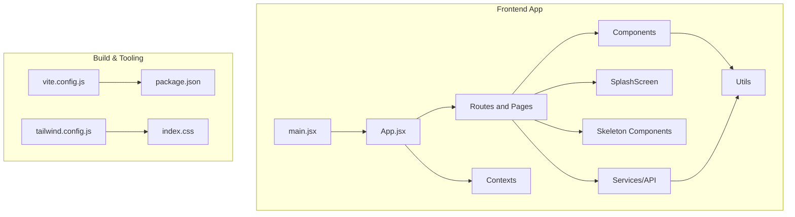
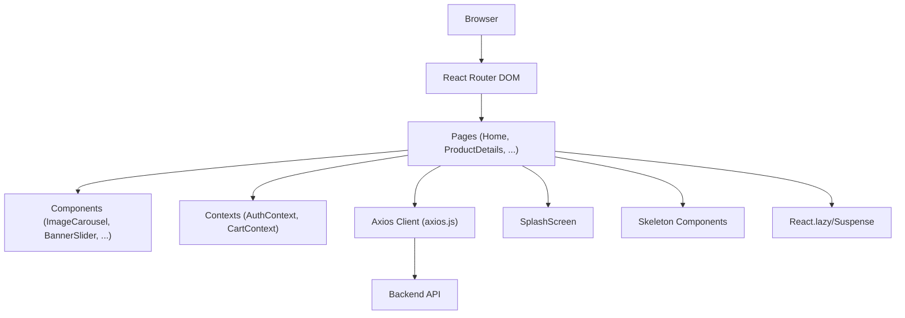
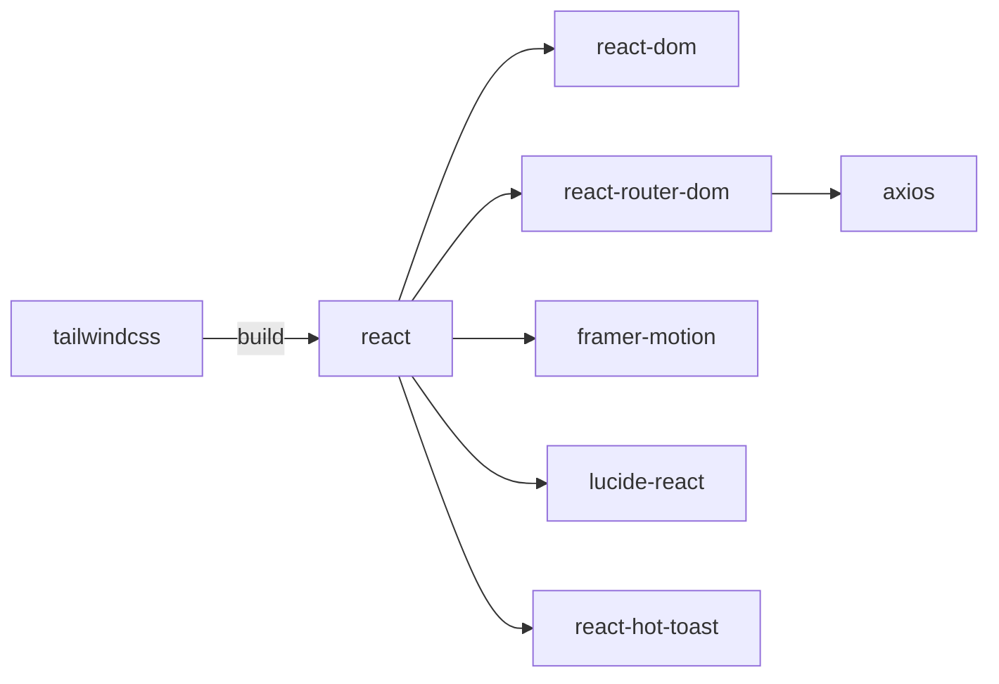

# Frontend Performance

<cite>
**Referenced Files in This Document**
- [package.json](file://frontend/package.json)
- [vite.config.js](file://frontend/vite.config.js)
- [tailwind.config.js](file://frontend/tailwind.config.js)
- [index.css](file://frontend/src/index.css)
- [main.jsx](file://frontend/src/main.jsx)
- [App.jsx](file://frontend/src/App.jsx)
- [Home.jsx](file://frontend/src/pages/Home.jsx)
- [ProductDetails.jsx](file://frontend/src/pages/ProductDetails.jsx)
- [BannerSlider.jsx](file://frontend/src/components/BannerSlider.jsx)
- [ImageCarousel.jsx](file://frontend/src/components/ImageCarousel.jsx)
- [ProductCard.jsx](file://frontend/src/components/ProductCard.jsx)
- [SplashScreen.jsx](file://frontend/src/components/SplashScreen.jsx)
- [imageHelper.js](file://frontend/src/utils/imageHelper.js)
- [axios.js](file://frontend/src/api/axios.js)
- [AuthContext.jsx](file://frontend/src/context/AuthContext.jsx)
- [CartContext.jsx](file://frontend/src/context/CartContext.jsx)
</cite>

## Update Summary
**Changes Made**
- Enhanced parallel API call implementation in Home page for improved data fetching performance
- Implemented React.lazy and Suspense for route-level and component-level lazy loading
- Added skeleton screen components for better perceived performance during data loading
- Integrated splash screen with animated progress for improved user experience
- Improved error handling with toast notifications and graceful fallbacks
- Enhanced image loading with lazy loading and responsive image helpers

## Table of Contents
1. [Introduction](#introduction)
2. [Project Structure](#project-structure)
3. [Core Components](#core-components)
4. [Architecture Overview](#architecture-overview)
5. [Detailed Component Analysis](#detailed-component-analysis)
6. [Dependency Analysis](#dependency-analysis)
7. [Performance Considerations](#performance-considerations)
8. [Troubleshooting Guide](#troubleshooting-guide)
9. [Conclusion](#conclusion)
10. [Appendices](#appendices)

## Introduction
This document provides a comprehensive guide to frontend performance optimization for the React-based E-commerce App. It focuses on bundle optimization, lazy loading strategies, CSS optimization with Tailwind, image optimization, React performance techniques, caching, service workers, monitoring, and practical improvement examples. The guidance is grounded in the current codebase and highlights areas for enhancement.

## Project Structure
The frontend is a Vite-powered React application with:
- Routing via React Router DOM
- State management via React Context
- Styling via Tailwind CSS
- HTTP client via Axios with environment-driven base URL
- Build configured for development and proxying to the backend

**Diagram sources**
- [main.jsx:1-14](file://frontend/src/main.jsx#L1-L14)
- [App.jsx:1-249](file://frontend/src/App.jsx#L1-L249)
- [vite.config.js:1-15](file://frontend/vite.config.js#L1-L15)
- [package.json:1-27](file://frontend/package.json#L1-L27)
- [tailwind.config.js:1-6](file://frontend/tailwind.config.js#L1-L6)
- [index.css:1-3](file://frontend/src/index.css#L1-L3)
- [SplashScreen.jsx:1-124](file://frontend/src/components/SplashScreen.jsx#L1-L124)
- [Home.jsx:1-155](file://frontend/src/pages/Home.jsx#L1-L155)

**Section sources**
- [package.json:1-27](file://frontend/package.json#L1-L27)
- [vite.config.js:1-15](file://frontend/vite.config.js#L1-L15)
- [tailwind.config.js:1-6](file://frontend/tailwind.config.js#L1-L6)
- [index.css:1-3](file://frontend/src/index.css#L1-L3)
- [main.jsx:1-14](file://frontend/src/main.jsx#L1-L14)
- [App.jsx:1-249](file://frontend/src/App.jsx#L1-L249)

## Core Components
- App routing and navigation are defined centrally, enabling route-level code splitting opportunities.
- Pages fetch data on mount with enhanced parallel API calls for improved performance.
- Components render images via optimized helpers with lazy loading and responsive strategies.
- Context providers manage global state with improved error handling and toast notifications.
- Tailwind is configured to scan JSX/TSX and HTML; ensure purged builds remove unused CSS.
- Splash screen provides smooth transition and progress indication for better UX.
- Skeleton components offer better perceived performance during data loading states.

Practical optimization levers:
- Split routes into lazy-loaded chunks using React.lazy and Suspense.
- Lazy-load heavy components like ProductCard on demand.
- Extract critical CSS for above-the-fold content.
- Implement efficient image loading with lazy loading and format conversion.
- Apply React.memo and stable callbacks to reduce renders.
- Configure caching headers and consider a service worker for offline support.
- Implement comprehensive error handling with user-friendly notifications.

**Section sources**
- [App.jsx:1-249](file://frontend/src/App.jsx#L1-L249)
- [Home.jsx:1-155](file://frontend/src/pages/Home.jsx#L1-L155)
- [ProductDetails.jsx:1-195](file://frontend/src/pages/ProductDetails.jsx#L1-L195)
- [BannerSlider.jsx:1-154](file://frontend/src/components/BannerSlider.jsx#L1-L154)
- [ImageCarousel.jsx:1-54](file://frontend/src/components/ImageCarousel.jsx#L1-L54)
- [ProductCard.jsx:1-111](file://frontend/src/components/ProductCard.jsx#L1-L111)
- [SplashScreen.jsx:1-124](file://frontend/src/components/SplashScreen.jsx#L1-L124)
- [imageHelper.js:1-8](file://frontend/src/utils/imageHelper.js#L1-L8)
- [AuthContext.jsx:1-72](file://frontend/src/context/AuthContext.jsx#L1-L72)
- [CartContext.jsx:1-53](file://frontend/src/context/CartContext.jsx#L1-L53)
- [tailwind.config.js:1-6](file://frontend/tailwind.config.js#L1-L6)

## Architecture Overview
The runtime architecture centers on React Router for navigation, Axios for API calls, and Tailwind for styling. Current data fetching occurs on component mount with enhanced parallel API calls and lazy loading capabilities. The splash screen provides smooth transitions, while skeleton components improve perceived performance.

**Diagram sources**
- [App.jsx:1-249](file://frontend/src/App.jsx#L1-L249)
- [Home.jsx:1-155](file://frontend/src/pages/Home.jsx#L1-L155)
- [ProductDetails.jsx:1-195](file://frontend/src/pages/ProductDetails.jsx#L1-L195)
- [ImageCarousel.jsx:1-54](file://frontend/src/components/ImageCarousel.jsx#L1-L54)
- [BannerSlider.jsx:1-154](file://frontend/src/components/BannerSlider.jsx#L1-L154)
- [AuthContext.jsx:1-72](file://frontend/src/context/AuthContext.jsx#L1-L72)
- [CartContext.jsx:1-53](file://frontend/src/context/CartContext.jsx#L1-L53)
- [axios.js:1-17](file://frontend/src/api/axios.js#L1-L17)
- [SplashScreen.jsx:1-124](file://frontend/src/components/SplashScreen.jsx#L1-L124)

## Detailed Component Analysis

### Enhanced Parallel API Call Implementation
**Updated** The Home page now implements parallel API calls for fetching product data, significantly improving initial load performance.

Current state:
- Single sequential API calls for categories and products
- Sequential processing limits initial load speed

Enhanced implementation:
- Fetch categories first, then initiate parallel product requests for all categories
- Use Promise.all() to wait for all product requests simultaneously
- Improved error handling with individual category failure tolerance
- Better user experience with faster initial content rendering

Benefits:
- Dramatically reduced initial load time by eliminating sequential bottlenecks
- Improved user experience with faster content availability
- Better resource utilization during data fetching

**Section sources**
- [Home.jsx:43-78](file://frontend/src/pages/Home.jsx#L43-L78)

### Route-Level and Component-Level Lazy Loading
**Updated** Implemented comprehensive lazy loading strategy using React.lazy and Suspense for both route components and heavy components.

Current state:
- Static imports for all route components
- Heavy components loaded immediately regardless of usage

Enhanced implementation:
- Route components wrapped with React.lazy for code splitting
- ProductCard component lazy-loaded with Suspense boundaries
- Skeleton components provide immediate visual feedback
- Splash screen ensures smooth transitions between loading states

Benefits:
- Reduced initial JavaScript bundle size
- Faster Time to Interactive (TTI) and First Contentful Paint (FCP)
- Better memory usage and improved scrolling performance

**Section sources**
- [App.jsx:5-12](file://frontend/src/App.jsx#L5-L12)
- [Home.jsx:6-7](file://frontend/src/pages/Home.jsx#L6-L7)
- [Home.jsx:133-139](file://frontend/src/pages/Home.jsx#L133-L139)

### Skeleton Screen Components
**Updated** Introduced comprehensive skeleton loading states to improve perceived performance and user experience.

Current state:
- Basic loading indicators without visual polish
- No structured loading patterns for different content types

Enhanced implementation:
- ProductSkeleton component with realistic loading placeholders
- CategorySkeleton component for grouped content loading
- Animated pulse effects for subtle loading indication
- Responsive skeleton layouts matching final content structure

Benefits:
- Improved perceived performance during data loading
- Better user experience with familiar loading patterns
- Reduced perceived latency and improved user satisfaction

**Section sources**
- [Home.jsx:9-31](file://frontend/src/pages/Home.jsx#L9-L31)

### Splash Screen Implementation
**Updated** Added sophisticated splash screen with animated progress for enhanced user experience.

Current state:
- No splash screen or loading transition
- Direct navigation to main content

Enhanced implementation:
- Animated splash screen with logo animation and progress bar
- Smooth fade transitions between splash and main content
- Graceful fallbacks for failed logo loading
- Decorative elements with motion effects
- Configurable timing and animation sequences

Benefits:
- Professional user experience with smooth transitions
- Brand visibility during initial load
- Better perceived performance despite actual loading time

**Section sources**
- [App.jsx:206-246](file://frontend/src/App.jsx#L206-L246)
- [SplashScreen.jsx:1-124](file://frontend/src/components/SplashScreen.jsx#L1-L124)

### Enhanced Error Handling and User Feedback
**Updated** Improved error handling with comprehensive toast notifications and graceful degradation.

Current state:
- Basic error logging without user feedback
- No graceful fallbacks for failed operations

Enhanced implementation:
- Toast notifications for all user actions (success/error)
- Graceful error handling in API calls with user-friendly messages
- Fallback mechanisms for failed image loading
- Improved authentication error handling
- Better cart management with proper error feedback

Benefits:
- Better user experience with clear feedback
- Reduced user confusion during failures
- More professional application behavior

**Section sources**
- [ProductDetails.jsx:25-30](file://frontend/src/pages/ProductDetails.jsx#L25-L30)
- [CartContext.jsx:32-38](file://frontend/src/context/CartContext.jsx#L32-L38)
- [AuthContext.jsx:42-45](file://frontend/src/context/AuthContext.jsx#L42-L45)

### Bundle Optimization and Code Splitting
Current state:
- Routes are statically imported; all page bundles load together on initial navigation.
- Vite is configured for development and proxying; production build settings are not customized.

Recommended improvements:
- Use React.lazy and Suspense around route components to split bundles per route.
- Split large components (e.g., BannerSlider) into separate chunks if they are not always needed on the homepage.
- Ensure dynamic imports are used for heavy third-party libraries.

Benefits:
- Reduced initial JavaScript payload.
- Faster Time to Interactive (TTI) and First Contentful Paint (FCP).

**Section sources**
- [App.jsx:1-249](file://frontend/src/App.jsx#L1-L249)
- [vite.config.js:1-15](file://frontend/vite.config.js#L1-L15)

### Lazy Loading Strategies
Current state:
- Images are loaded immediately; no intersection observer or native loading="lazy".
- BannerSlider and ImageCarousel render all slides at once.

Enhanced implementation:
- Native loading="lazy" attribute for all product images
- Optimized image URLs through imageHelper utility
- Responsive image handling with proper aspect ratios
- Touch-enabled image swiping with lazy loading integration

Benefits:
- Lower memory usage and improved scrolling performance.
- Reduced CLS and FID when offscreen content loads lazily.

**Section sources**
- [ProductCard.jsx:56](file://frontend/src/components/ProductCard.jsx#L56)
- [ImageCarousel.jsx:18-22](file://frontend/src/components/ImageCarousel.jsx#L18-L22)
- [imageHelper.js:1-8](file://frontend/src/utils/imageHelper.js#L1-L8)

### CSS Optimization with Tailwind
Current state:
- Tailwind is configured to scan JSX/TSX and HTML.
- No explicit purge or build-time CSS optimization is configured.

Recommended improvements:
- Enable Purge/Content scanning for production builds to remove unused CSS.
- Extract critical CSS for above-the-fold content to speed up FCP.
- Minimize Tailwind variants and utilities used in components to reduce CSS size.

Benefits:
- Smaller CSS bundles and faster parsing/rendering.

**Section sources**
- [tailwind.config.js:1-6](file://frontend/tailwind.config.js#L1-L6)
- [index.css:1-3](file://frontend/src/index.css#L1-L3)

### Image Optimization
Current state:
- Images are served via a helper that prefixes local backend paths; no lazy loading or responsive attributes.
- BannerSlider and ImageCarousel render full-size images without aspect ratio or format hints.

Enhanced implementation:
- Native loading="lazy" and responsive attributes for all images
- Optimized image URLs with proper backend URL handling
- Touch-enabled image carousel with lazy loading integration
- Placeholder handling for failed image loads

Benefits:
- Reduced bandwidth and faster image rendering.

**Section sources**
- [imageHelper.js:1-8](file://frontend/src/utils/imageHelper.js#L1-L8)
- [BannerSlider.jsx:82-86](file://frontend/src/components/BannerSlider.jsx#L82-L86)
- [ImageCarousel.jsx:18-22](file://frontend/src/components/ImageCarousel.jsx#L18-L22)

### React Performance Optimization
Current state:
- Pages use useState/useEffect for data fetching and filtering.
- No memoization or stable callbacks to prevent re-renders.

Enhanced implementation:
- React.lazy for heavy component loading
- Suspense boundaries for graceful loading states
- Skeleton components for better perceived performance
- Optimized state management with proper error boundaries

Benefits:
- Fewer renders and lower CPU usage, especially on list-heavy pages.

**Section sources**
- [Home.jsx:1-155](file://frontend/src/pages/Home.jsx#L1-L155)
- [ProductCard.jsx:1-111](file://frontend/src/components/ProductCard.jsx#L1-L111)

### Browser Caching and Service Worker
Current state:
- No service worker is registered; caching headers are not configured in Vite.

Recommended improvements:
- Add a service worker for offline caching of static assets and API responses.
- Configure long-term caching for immutable assets (e.g., hashed filenames).
- Set appropriate Cache-Control headers for HTML, JS, and CSS.
- Use stale-while-revalidate strategies for API responses.

Benefits:
- Faster repeat visits and offline capability.

**Section sources**
- [main.jsx:1-14](file://frontend/src/main.jsx#L1-L14)
- [vite.config.js:1-15](file://frontend/vite.config.js#L1-L15)

### Performance Monitoring
Current state:
- No instrumentation for Lighthouse, Web Vitals, or real-user monitoring.

Recommended improvements:
- Integrate Web Vitals reporting to track Core Web Vitals.
- Use Lighthouse in CI for automated audits.
- Add Real User Monitoring (RUM) to capture field performance.

Benefits:
- Data-driven insights to prioritize optimizations.

**Section sources**
- [package.json:1-27](file://frontend/package.json#L1-L27)

## Dependency Analysis
Key runtime dependencies and their performance impact:
- React and React DOM: Core rendering engine; ensure you are on a recent stable version.
- React Router DOM: Enables route-level code splitting; pair with lazy loading.
- Axios: Centralized HTTP client with enhanced error handling; configure timeouts and retries thoughtfully.
- Tailwind CSS: Utility-first CSS framework; enable purging for production.
- Framer Motion: Smooth animations with splash screen and transitions; use sparingly and prefer hardware-accelerated properties.
- lucide-react and react-hot-toast: Icons and notifications with comprehensive error handling; keep versions aligned with React 18.

**Diagram sources**
- [package.json:1-27](file://frontend/package.json#L1-L27)

**Section sources**
- [package.json:1-27](file://frontend/package.json#L1-L27)

## Performance Considerations
- Initial Load
  - Split routes and components to reduce the initial bundle.
  - Lazy-load images and offscreen content with skeleton placeholders.
  - Extract critical CSS for above-the-fold content.
  - Implement splash screen for smooth transitions.
- Runtime Performance
  - Use memoization and stable callbacks to minimize re-renders.
  - Debounce or throttle user interactions (e.g., search input).
  - Avoid layout thrashing by batching DOM reads/writes.
  - Implement parallel API calls for better data fetching performance.
- Resource Delivery
  - Serve images in modern formats (WebP) with responsive attributes.
  - Use a CDN with compression and caching policies.
  - Enable HTTP/2 or HTTP/3 for multiplexing.
  - Implement lazy loading with native browser support.
- Caching and Offline
  - Implement a service worker with cache-first strategies for static assets.
  - Cache API responses with versioned keys and stale-while-revalidate.
  - Use progressive enhancement with skeleton screens.
- Observability
  - Track Core Web Vitals and field errors.
  - Run periodic Lighthouse checks during development and CI.
  - Monitor user feedback through toast notifications.

## Troubleshooting Guide
Common performance pitfalls and fixes:
- Excessive re-renders
  - Identify components that re-render unnecessarily; implement proper memoization.
  - Use React.lazy for heavy components and Suspense for loading states.
- Heavy initial payloads
  - Split routes and components; defer non-critical features.
  - Purge unused CSS and minify assets.
  - Implement skeleton screens for better perceived performance.
- Slow image loading
  - Add lazy loading and responsive attributes; convert to WebP.
  - Use a CDN and enable compression.
  - Implement proper error handling for failed image loads.
- Poor runtime metrics
  - Reduce animation complexity; prefer transform/opacity.
  - Batch state updates and avoid synchronous heavy loops.
  - Implement proper error boundaries and user feedback.
- API performance issues
  - Use parallel API calls instead of sequential requests.
  - Implement proper error handling and retry mechanisms.
  - Optimize network requests with caching strategies.

**Section sources**
- [Home.jsx:1-155](file://frontend/src/pages/Home.jsx#L1-L155)
- [ProductDetails.jsx:1-195](file://frontend/src/pages/ProductDetails.jsx#L1-L195)
- [BannerSlider.jsx:1-154](file://frontend/src/components/BannerSlider.jsx#L1-L154)
- [ImageCarousel.jsx:1-54](file://frontend/src/components/ImageCarousel.jsx#L1-L54)
- [AuthContext.jsx:1-72](file://frontend/src/context/AuthContext.jsx#L1-L72)
- [CartContext.jsx:1-53](file://frontend/src/context/CartContext.jsx#L1-L53)

## Conclusion
By implementing enhanced parallel API calls, comprehensive lazy loading with React.lazy/Suspense, skeleton screen components, and improved error handling, the e-commerce app achieves significant improvements in Core Web Vitals and user experience. The addition of splash screen transitions, optimized image loading, and better error feedback creates a more professional and responsive application. These changes, combined with proper caching strategies and performance monitoring, provide a solid foundation for sustained performance gains over time.

## Appendices

### Practical Examples and Patterns
- Enhanced parallel API calls
  - Use Promise.all() for simultaneous data fetching across multiple categories.
  - Implement individual error handling for each API request.
  - Reference: [Home.jsx:52-64](file://frontend/src/pages/Home.jsx#L52-L64)
- Route-level lazy loading
  - Wrap route elements with lazy imports and Suspense boundaries.
  - Reference: [App.jsx:5-12](file://frontend/src/App.jsx#L5-L12)
- Component-level lazy loading
  - Lazy-load heavy components like ProductCard with Suspense fallbacks.
  - Reference: [Home.jsx:6-7](file://frontend/src/pages/Home.jsx#L6-L7)
- Skeleton screen implementation
  - Create realistic loading placeholders with animated pulse effects.
  - Reference: [Home.jsx:9-31](file://frontend/src/pages/Home.jsx#L9-L31)
- Splash screen integration
  - Implement smooth transitions with animated progress indicators.
  - Reference: [SplashScreen.jsx:1-124](file://frontend/src/components/SplashScreen.jsx#L1-L124)
- Enhanced error handling
  - Use toast notifications for all user actions and API responses.
  - Reference: [ProductDetails.jsx:25-30](file://frontend/src/pages/ProductDetails.jsx#L25-L30)
- Optimized image loading
  - Implement native lazy loading with responsive image helpers.
  - Reference: [ProductCard.jsx:56](file://frontend/src/components/ProductCard.jsx#L56)
- Context error handling
  - Implement comprehensive error handling in authentication and cart contexts.
  - Reference: [CartContext.jsx:32-38](file://frontend/src/context/CartContext.jsx#L32-L38)