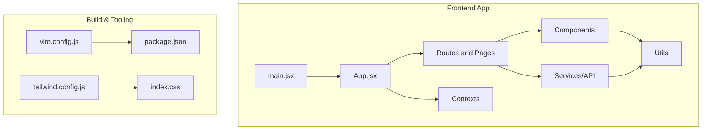
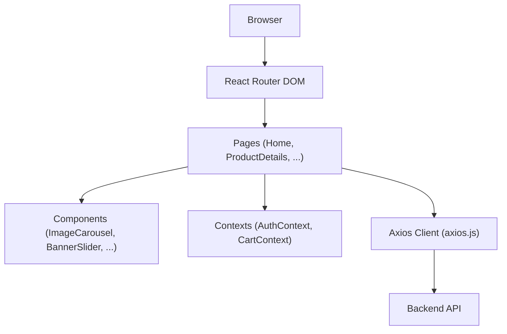
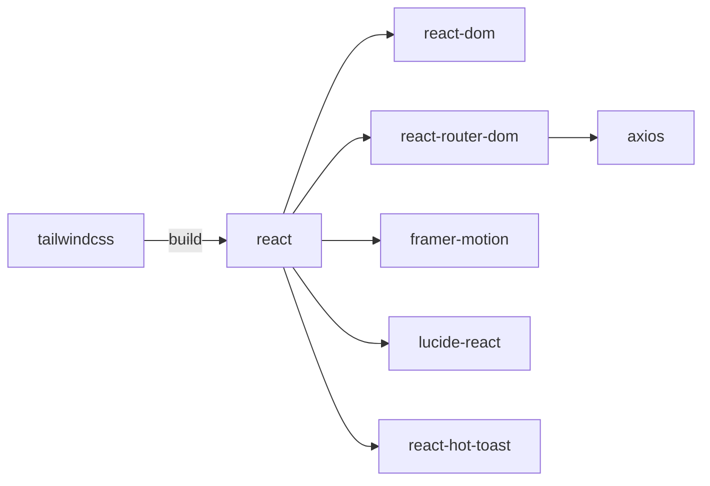

# Frontend Performance

<cite>
**Referenced Files in This Document**
- [package.json](file://frontend/package.json)
- [vite.config.js](file://frontend/vite.config.js)
- [tailwind.config.js](file://frontend/tailwind.config.js)
- [index.css](file://frontend/src/index.css)
- [main.jsx](file://frontend/src/main.jsx)
- [App.jsx](file://frontend/src/App.jsx)
- [Home.jsx](file://frontend/src/pages/Home.jsx)
- [ProductDetails.jsx](file://frontend/src/pages/ProductDetails.jsx)
- [BannerSlider.jsx](file://frontend/src/components/BannerSlider.jsx)
- [ImageCarousel.jsx](file://frontend/src/components/ImageCarousel.jsx)
- [ProductCard.jsx](file://frontend/src/components/ProductCard.jsx)
- [imageHelper.js](file://frontend/src/utils/imageHelper.js)
- [axios.js](file://frontend/src/api/axios.js)
- [AuthContext.jsx](file://frontend/src/context/AuthContext.jsx)
- [CartContext.jsx](file://frontend/src/context/CartContext.jsx)
</cite>

## Table of Contents
1. [Introduction](#introduction)
2. [Project Structure](#project-structure)
3. [Core Components](#core-components)
4. [Architecture Overview](#architecture-overview)
5. [Detailed Component Analysis](#detailed-component-analysis)
6. [Dependency Analysis](#dependency-analysis)
7. [Performance Considerations](#performance-considerations)
8. [Troubleshooting Guide](#troubleshooting-guide)
9. [Conclusion](#conclusion)
10. [Appendices](#appendices)

## Introduction
This document provides a comprehensive guide to frontend performance optimization for the React-based E-commerce App. It focuses on bundle optimization, lazy loading strategies, CSS optimization with Tailwind, image optimization, React performance techniques, caching, service workers, monitoring, and practical improvement examples. The guidance is grounded in the current codebase and highlights areas for enhancement.

## Project Structure
The frontend is a Vite-powered React application with:
- Routing via React Router DOM
- State management via React Context
- Styling via Tailwind CSS
- HTTP client via Axios with environment-driven base URL
- Build configured for development and proxying to the backend

**Diagram sources**
- [main.jsx:1-10](file://frontend/src/main.jsx#L1-L10)
- [App.jsx:1-66](file://frontend/src/App.jsx#L1-L66)
- [vite.config.js:1-15](file://frontend/vite.config.js#L1-L15)
- [package.json:1-25](file://frontend/package.json#L1-L25)
- [tailwind.config.js:1-6](file://frontend/tailwind.config.js#L1-L6)
- [index.css:1-3](file://frontend/src/index.css#L1-L3)

**Section sources**
- [package.json:1-25](file://frontend/package.json#L1-L25)
- [vite.config.js:1-15](file://frontend/vite.config.js#L1-L15)
- [tailwind.config.js:1-6](file://frontend/tailwind.config.js#L1-L6)
- [index.css:1-3](file://frontend/src/index.css#L1-L3)
- [main.jsx:1-10](file://frontend/src/main.jsx#L1-L10)
- [App.jsx:1-66](file://frontend/src/App.jsx#L1-L66)

## Core Components
- App routing and navigation are defined centrally, enabling route-level code splitting opportunities.
- Pages fetch data on mount; consider deferring non-critical data and adding skeleton loaders.
- Components render images via helpers; introduce lazy loading and responsive image strategies.
- Context providers manage global state; optimize updates and avoid unnecessary re-renders.
- Tailwind is configured to scan JSX/TSX and HTML; ensure purged builds remove unused CSS.

Practical optimization levers:
- Split routes into lazy-loaded chunks.
- Lazy-load heavy components and images.
- Extract critical CSS for above-the-fold content.
- Implement efficient image loading and format conversion.
- Apply React.memo and stable callbacks to reduce renders.
- Configure caching headers and consider a service worker for offline support.

**Section sources**
- [App.jsx:1-66](file://frontend/src/App.jsx#L1-L66)
- [Home.jsx:1-108](file://frontend/src/pages/Home.jsx#L1-L108)
- [ProductDetails.jsx:1-80](file://frontend/src/pages/ProductDetails.jsx#L1-L80)
- [BannerSlider.jsx:1-153](file://frontend/src/components/BannerSlider.jsx#L1-L153)
- [ImageCarousel.jsx:1-54](file://frontend/src/components/ImageCarousel.jsx#L1-L54)
- [imageHelper.js:1-5](file://frontend/src/utils/imageHelper.js#L1-L5)
- [AuthContext.jsx:1-33](file://frontend/src/context/AuthContext.jsx#L1-L33)
- [CartContext.jsx:1-53](file://frontend/src/context/CartContext.jsx#L1-L53)
- [tailwind.config.js:1-6](file://frontend/tailwind.config.js#L1-L6)

## Architecture Overview
The runtime architecture centers on React Router for navigation, Axios for API calls, and Tailwind for styling. Current data fetching occurs on component mount; introducing lazy loading and code splitting can significantly improve initial load performance.

**Diagram sources**
- [App.jsx:1-66](file://frontend/src/App.jsx#L1-L66)
- [Home.jsx:1-108](file://frontend/src/pages/Home.jsx#L1-L108)
- [ProductDetails.jsx:1-80](file://frontend/src/pages/ProductDetails.jsx#L1-L80)
- [ImageCarousel.jsx:1-54](file://frontend/src/components/ImageCarousel.jsx#L1-L54)
- [BannerSlider.jsx:1-153](file://frontend/src/components/BannerSlider.jsx#L1-L153)
- [AuthContext.jsx:1-33](file://frontend/src/context/AuthContext.jsx#L1-L33)
- [CartContext.jsx:1-53](file://frontend/src/context/CartContext.jsx#L1-L53)
- [axios.js:1-17](file://frontend/src/api/axios.js#L1-L17)

## Detailed Component Analysis

### Bundle Optimization and Code Splitting
Current state:
- Routes are statically imported; all page bundles load together on initial navigation.
- Vite is configured for development and proxying; production build settings are not customized.

Recommended improvements:
- Use React.lazy and Suspense around route components to split bundles per route.
- Split large components (e.g., BannerSlider) into separate chunks if they are not always needed on the homepage.
- Ensure dynamic imports are used for heavy third-party libraries.

Benefits:
- Reduced initial JavaScript payload.
- Faster Time to Interactive (TTI) and First Contentful Paint (FCP).

**Section sources**
- [App.jsx:1-66](file://frontend/src/App.jsx#L1-L66)
- [vite.config.js:1-15](file://frontend/vite.config.js#L1-L15)

### Lazy Loading Strategies
Current state:
- Images are loaded immediately; no intersection observer or native loading="lazy".
- BannerSlider and ImageCarousel render all slides at once.

Recommended improvements:
- Replace static img tags with native loading="lazy" and sizes/wildcards for responsive images.
- Introduce IntersectionObserver to defer rendering until near viewport.
- For route-level lazy loading, wrap route elements with React.lazy and Suspense boundaries.

Benefits:
- Lower memory usage and improved scrolling performance.
- Reduced CLS and FID when offscreen content loads lazily.

**Section sources**
- [BannerSlider.jsx:1-153](file://frontend/src/components/BannerSlider.jsx#L1-L153)
- [ImageCarousel.jsx:1-54](file://frontend/src/components/ImageCarousel.jsx#L1-L54)
- [App.jsx:1-66](file://frontend/src/App.jsx#L1-L66)

### CSS Optimization with Tailwind
Current state:
- Tailwind is configured to scan JSX/TSX and HTML.
- No explicit purge or build-time CSS optimization is configured.

Recommended improvements:
- Enable Purge/Content scanning for production builds to remove unused CSS.
- Extract critical CSS for above-the-fold content to speed up FCP.
- Minimize Tailwind variants and utilities used in components to reduce CSS size.

Benefits:
- Smaller CSS bundles and faster parsing/rendering.

**Section sources**
- [tailwind.config.js:1-6](file://frontend/tailwind.config.js#L1-L6)
- [index.css:1-3](file://frontend/src/index.css#L1-L3)

### Image Optimization
Current state:
- Images are served via a helper that prefixes local backend paths; no lazy loading or responsive attributes.
- BannerSlider and ImageCarousel render full-size images without aspect ratio or format hints.

Recommended improvements:
- Use native loading="lazy" and sizes attributes for responsive images.
- Convert images to WebP where supported and provide fallbacks.
- Serve via a CDN with automatic format selection and compression.
- Implement srcset and sizes for responsive breakpoints.
- Add blur-up or low-quality image placeholders (LQIP) to reduce perceived load time.

Benefits:
- Reduced bandwidth and faster image rendering.

**Section sources**
- [imageHelper.js:1-5](file://frontend/src/utils/imageHelper.js#L1-L5)
- [BannerSlider.jsx:1-153](file://frontend/src/components/BannerSlider.jsx#L1-L153)
- [ImageCarousel.jsx:1-54](file://frontend/src/components/ImageCarousel.jsx#L1-L54)

### React Performance Optimization
Current state:
- Pages use useState/useEffect for data fetching and filtering.
- No memoization or stable callbacks to prevent re-renders.

Recommended improvements:
- Wrap expensive computations (e.g., filters) with useMemo to avoid recomputation on every render.
- Memoize handlers passed to child components with useCallback to prevent prop drift.
- Apply React.memo to components that render frequently but rarely change (e.g., ProductCard).
- Split stateful logic into smaller components to localize re-renders.

Benefits:
- Fewer renders and lower CPU usage, especially on list-heavy pages.

**Section sources**
- [Home.jsx:1-108](file://frontend/src/pages/Home.jsx#L1-L108)
- [ProductCard.jsx:1-28](file://frontend/src/components/ProductCard.jsx#L1-L28)

### Browser Caching and Service Worker
Current state:
- No service worker is registered; caching headers are not configured in Vite.

Recommended improvements:
- Add a service worker for offline caching of static assets and API responses.
- Configure long-term caching for immutable assets (e.g., hashed filenames).
- Set appropriate Cache-Control headers for HTML, JS, and CSS.
- Use stale-while-revalidate strategies for API responses.

Benefits:
- Faster repeat visits and offline capability.

**Section sources**
- [main.jsx:1-10](file://frontend/src/main.jsx#L1-L10)
- [vite.config.js:1-15](file://frontend/vite.config.js#L1-L15)

### Performance Monitoring
Current state:
- No instrumentation for Lighthouse, Web Vitals, or real-user monitoring.

Recommended improvements:
- Integrate Web Vitals reporting to track Core Web Vitals.
- Use Lighthouse in CI for automated audits.
- Add Real User Monitoring (RUM) to capture field performance.

Benefits:
- Data-driven insights to prioritize optimizations.

**Section sources**
- [package.json:1-25](file://frontend/package.json#L1-L25)

## Dependency Analysis
Key runtime dependencies and their performance impact:
- React and React DOM: Core rendering engine; ensure you are on a recent stable version.
- React Router DOM: Enables route-level code splitting; pair with lazy loading.
- Axios: Centralized HTTP client; configure timeouts and retries thoughtfully.
- Tailwind CSS: Utility-first CSS framework; enable purging for production.
- Framer Motion: Smooth animations; use sparingly and prefer hardware-accelerated properties.
- lucide-react and react-hot-toast: Icons and notifications; keep versions aligned with React 18.

**Diagram sources**
- [package.json:1-25](file://frontend/package.json#L1-L25)

**Section sources**
- [package.json:1-25](file://frontend/package.json#L1-L25)

## Performance Considerations
- Initial Load
  - Split routes and components to reduce the initial bundle.
  - Lazy-load images and offscreen content.
  - Extract critical CSS for above-the-fold content.
- Runtime Performance
  - Use memoization and stable callbacks to minimize re-renders.
  - Debounce or throttle user interactions (e.g., search input).
  - Avoid layout thrashing by batching DOM reads/writes.
- Resource Delivery
  - Serve images in modern formats (WebP) with responsive attributes.
  - Use a CDN with compression and caching policies.
  - Enable HTTP/2 or HTTP/3 for multiplexing.
- Caching and Offline
  - Implement a service worker with cache-first strategies for static assets.
  - Cache API responses with versioned keys and stale-while-revalidate.
- Observability
  - Track Core Web Vitals and field errors.
  - Run periodic Lighthouse checks during development and CI.

[No sources needed since this section provides general guidance]

## Troubleshooting Guide
Common performance pitfalls and fixes:
- Excessive re-renders
  - Identify components that re-render unnecessarily; wrap with React.memo.
  - Memoize handlers with useCallback and pass stable refs.
- Heavy initial payloads
  - Split routes and components; defer non-critical features.
  - Purge unused CSS and minify assets.
- Slow image loading
  - Add lazy loading and responsive attributes; convert to WebP.
  - Use a CDN and enable compression.
- Poor runtime metrics
  - Reduce animation complexity; prefer transform/opacity.
  - Batch state updates and avoid synchronous heavy loops.

**Section sources**
- [Home.jsx:1-108](file://frontend/src/pages/Home.jsx#L1-L108)
- [ProductDetails.jsx:1-80](file://frontend/src/pages/ProductDetails.jsx#L1-L80)
- [BannerSlider.jsx:1-153](file://frontend/src/components/BannerSlider.jsx#L1-L153)
- [ImageCarousel.jsx:1-54](file://frontend/src/components/ImageCarousel.jsx#L1-L54)
- [AuthContext.jsx:1-33](file://frontend/src/context/AuthContext.jsx#L1-L33)
- [CartContext.jsx:1-53](file://frontend/src/context/CartContext.jsx#L1-L53)

## Conclusion
By implementing route-level code splitting, lazy-loading images and components, optimizing CSS with Tailwind purging, converting images to modern formats, and applying React.memo/useCallback patterns, the e-commerce app can achieve significant improvements in Core Web Vitals and user experience. Pair these changes with robust caching, a service worker, and continuous monitoring to sustain performance gains over time.

[No sources needed since this section summarizes without analyzing specific files]

## Appendices

### Practical Examples and Patterns
- Route-level lazy loading
  - Wrap route elements with lazy imports and Suspense boundaries.
  - Reference: [App.jsx:48-57](file://frontend/src/App.jsx#L48-L57)
- Memoized filtering
  - Compute filtered lists with useMemo to avoid re-filtering on every render.
  - Reference: [Home.jsx:39-44](file://frontend/src/pages/Home.jsx#L39-L44)
- Stable callbacks
  - Memoize event handlers with useCallback to prevent prop drift.
  - Reference: [Home.jsx:30-37](file://frontend/src/pages/Home.jsx#L30-L37)
- Critical CSS extraction
  - Extract critical CSS for above-the-fold content and inline it.
  - Reference: [index.css:1-3](file://frontend/src/index.css#L1-L3)
- Image lazy loading
  - Add native lazy loading and responsive attributes.
  - Reference: [ImageCarousel.jsx:18-22](file://frontend/src/components/ImageCarousel.jsx#L18-L22)
- Context updates
  - Keep context providers minimal and avoid frequent deep updates.
  - Reference: [CartContext.jsx:44-46](file://frontend/src/context/CartContext.jsx#L44-L46)

[No sources needed since this section aggregates patterns already cited above]