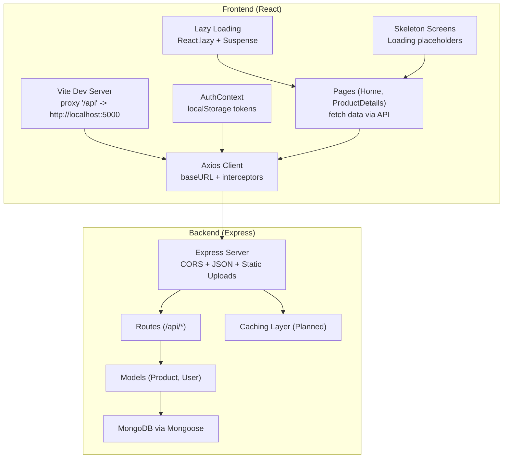
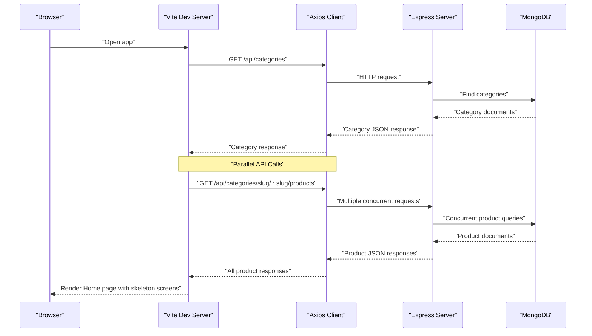
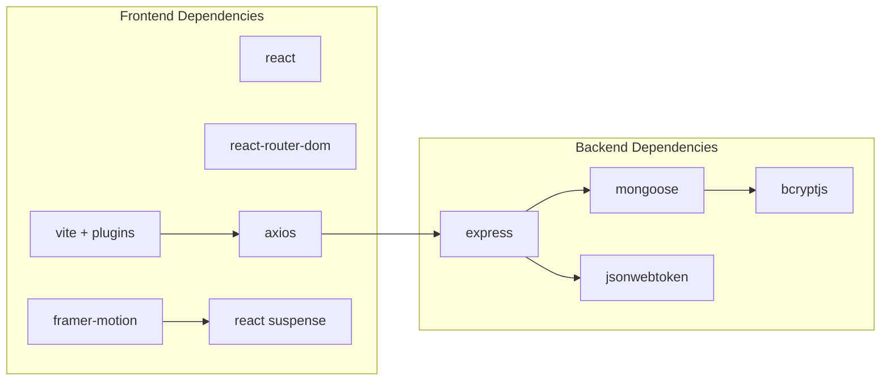

# Performance Optimization

<cite>
**Referenced Files in This Document**
- [backend/package.json](file://backend/package.json)
- [frontend/package.json](file://frontend/package.json)
- [backend/server.js](file://backend/server.js)
- [backend/config/db.js](file://backend/config/db.js)
- [backend/controllers/productController.js](file://backend/controllers/productController.js)
- [backend/controllers/authController.js](file://backend/controllers/authController.js)
- [backend/middleware/authMiddleware.js](file://backend/middleware/authMiddleware.js)
- [backend/models/Product.js](file://backend/models/Product.js)
- [backend/models/User.js](file://backend/models/User.js)
- [frontend/vite.config.js](file://frontend/vite.config.js)
- [frontend/src/services/api.js](file://frontend/src/services/api.js)
- [frontend/src/api/axios.js](file://frontend/src/api/axios.js)
- [frontend/src/context/AuthContext.jsx](file://frontend/src/context/AuthContext.jsx)
- [frontend/src/pages/Home.jsx](file://frontend/src/pages/Home.jsx)
- [frontend/src/components/ProductCard.jsx](file://frontend/src/components/ProductCard.jsx)
- [frontend/src/components/SplashScreen.jsx](file://frontend/src/components/SplashScreen.jsx)
</cite>

## Update Summary
**Changes Made**
- Added comprehensive documentation for parallel API call optimization using Promise.all
- Documented lazy loading implementation with React.lazy and Suspense
- Added skeleton screen components for improved perceived performance
- Enhanced search functionality with early return logic and client-side filtering
- Updated frontend optimization techniques to include new performance patterns

## Table of Contents
1. [Introduction](#introduction)
2. [Project Structure](#project-structure)
3. [Core Components](#core-components)
4. [Architecture Overview](#architecture-overview)
5. [Detailed Component Analysis](#detailed-component-analysis)
6. [Dependency Analysis](#dependency-analysis)
7. [Performance Considerations](#performance-considerations)
8. [Troubleshooting Guide](#troubleshooting-guide)
9. [Conclusion](#conclusion)
10. [Appendices](#appendices)

## Introduction
This document provides a comprehensive performance optimization guide for the E-commerce App, covering both frontend and backend strategies. It focuses on database indexing and query optimization, caching mechanisms, frontend bundling and rendering optimizations, API response efficiency, pagination, and scalable deployment practices. The document now includes documentation of recent performance improvements including parallel API calls, lazy loading, skeleton screens, and enhanced search functionality.

## Project Structure
The project follows a clear separation of concerns:
- Backend: Express server, Mongoose models, controllers, middleware, and routes.
- Frontend: React SPA built with Vite, Axios-based API client, and React context for authentication.
- Deployment: The repository includes Docker-related files and Vercel serverless API structure, indicating potential containerized and serverless deployment targets.

**Diagram sources**
- [frontend/vite.config.js:1-15](file://frontend/vite.config.js#L1-L15)
- [frontend/src/context/AuthContext.jsx:1-72](file://frontend/src/context/AuthContext.jsx#L1-L72)
- [frontend/src/api/axios.js:1-17](file://frontend/src/api/axios.js#L1-L17)
- [frontend/src/pages/Home.jsx:1-155](file://frontend/src/pages/Home.jsx#L1-L155)
- [backend/server.js:1-102](file://backend/server.js#L1-L102)
- [backend/config/db.js:1-14](file://backend/config/db.js#L1-L14)

**Section sources**
- [backend/server.js:1-102](file://backend/server.js#L1-L102)
- [frontend/vite.config.js:1-15](file://frontend/vite.config.js#L1-L15)

## Core Components
- Backend server initializes CORS, JSON parsing, static uploads, and routes. It exposes health checks and serves as the API gateway.
- Database connection uses Mongoose with environment-driven configuration.
- Controllers implement product listing, filtering, and CRUD operations with pagination and basic search.
- Authentication middleware enforces JWT-based protection and admin roles.
- Frontend uses Vite, Axios for API communication, and React context for auth state and local storage persistence.
- **Updated**: Implemented parallel API call optimization using Promise.all for improved data fetching performance.
- **Updated**: Added lazy loading with React.lazy and Suspense for route-level and component-level optimization.
- **Updated**: Introduced skeleton screen components for enhanced perceived performance during data loading.
- **Updated**: Enhanced search functionality with early return logic and client-side filtering optimization.

Key performance-relevant observations:
- Backend uses regex-based search on name and description, which can be slow without proper indexes.
- Pagination is client-driven filtering in the Home page; server-side pagination would reduce payload sizes.
- No explicit caching layer is present in the backend; Redis or in-memory cache could significantly reduce repeated queries.
- Frontend performs client-side filtering and renders many product cards; virtualization and lazy loading can improve perceived performance.
- **Updated**: Parallel API calls reduce total loading time from sequential to concurrent requests.
- **Updated**: Skeleton screens provide immediate visual feedback and better user experience during loading states.
- **Updated**: Lazy loading reduces initial bundle size and improves first contentful paint.

**Section sources**
- [backend/server.js:1-102](file://backend/server.js#L1-L102)
- [backend/config/db.js:1-14](file://backend/config/db.js#L1-L14)
- [backend/controllers/productController.js:1-137](file://backend/controllers/productController.js#L1-L137)
- [backend/middleware/authMiddleware.js:1-20](file://backend/middleware/authMiddleware.js#L1-L20)
- [frontend/src/pages/Home.jsx:1-155](file://frontend/src/pages/Home.jsx#L1-L155)
- [frontend/src/api/axios.js:1-17](file://frontend/src/api/axios.js#L1-L17)

## Architecture Overview
The system is a classic client-server architecture with enhanced performance optimizations:
- Frontend (React SPA) communicates with backend (Express) via RESTful endpoints.
- Backend connects to MongoDB for persistence and serves static assets for uploads.
- Authentication relies on JWT tokens stored in localStorage.
- **Updated**: Implements parallel API call optimization for improved data fetching performance.
- **Updated**: Utilizes lazy loading and skeleton screens for better perceived performance.

**Diagram sources**
- [frontend/vite.config.js:1-15](file://frontend/vite.config.js#L1-L15)
- [frontend/src/api/axios.js:1-17](file://frontend/src/api/axios.js#L1-L17)
- [backend/server.js:1-102](file://backend/server.js#L1-L102)
- [backend/controllers/productController.js:1-137](file://backend/controllers/productController.js#L1-L137)

## Detailed Component Analysis

### Database Indexing Strategies
Current model definitions lack explicit indexes. Recommended indexes for improved query performance:
- Compound index on Product for search and category filtering:
  - Fields: name, description, category
  - Supports regex search and category filtering
- Single-field index on Product.category for fast category queries
- Unique index on User.email for O(1) lookup during login
- Timestamp indexes on Product and User for time-based sorting and analytics

Benefits:
- Reduces collection scans for search and category filters
- Improves join-like lookups and auth flows
- Enables efficient time-series analytics

**Section sources**
- [backend/models/Product.js:1-12](file://backend/models/Product.js#L1-L12)
- [backend/models/User.js:1-20](file://backend/models/User.js#L1-L20)

### Query Optimization
Current controller logic:
- Regex-based search on name and description without indexes is inefficient
- Pagination uses skip/limit but does not leverage cursor-based pagination for deep pages
- Sorting by createdAt desc is fine; ensure index supports it

Recommendations:
- Add text index on Product.name and Product.description for $search-style queries
- Replace regex with text search or fuzzy matching libraries if needed
- Introduce server-side pagination with cursor-based pagination for large datasets
- Use projection to limit returned fields for listing endpoints
- Cache frequently accessed product lists with short TTL

**Section sources**
- [backend/controllers/productController.js:1-137](file://backend/controllers/productController.js#L1-L137)

### Caching Mechanisms
Current state: No caching layer implemented.

Recommended caching strategy:
- Application-level in-memory cache (LRU) for hot product lists and popular queries
- Redis-backed cache for distributed environments and session data
- Cache invalidation on product updates/deletes
- Cache-Aside pattern for product detail pages

Implementation tips:
- Cache product listings with TTL (e.g., 1–5 minutes)
- Cache user sessions and JWT refresh windows
- Use cache keys with query parameters to avoid collisions

**Section sources**
- [backend/controllers/productController.js:1-137](file://backend/controllers/productController.js#L1-L137)

### Frontend Optimization Techniques
- Bundle optimization
  - Use Vite's built-in code splitting and dynamic imports for route-level lazy loading
  - Analyze bundle with Vite's preview and tools like source-map-explorer
- **Updated**: Lazy loading implementation
  - Lazy-load heavy components (e.g., ProductCard) using React.lazy and Suspense
  - Implement skeleton screens as fallback components during loading
  - Use lazy loading for route components to reduce initial bundle size
- **Updated**: Skeleton screen components
  - Create ProductSkeleton component with animated pulse effects
  - Implement CategorySkeleton for loading state placeholders
  - Use skeleton screens to maintain layout stability during data loading
- Image optimization
  - Preload critical images and lazy-load others
  - Use modern formats (WebP) and responsive sizes
- CSS optimization with Tailwind and PostCSS
  - Purge unused styles in production builds
  - Minimize Tailwind utility bloat by scoping classes and avoiding repetition
  - Use PostCSS plugins for autoprefixing and minification

**Section sources**
- [frontend/vite.config.js:1-15](file://frontend/vite.config.js#L1-L15)
- [frontend/src/pages/Home.jsx:1-155](file://frontend/src/pages/Home.jsx#L1-L155)
- [frontend/src/components/ProductCard.jsx:1-111](file://frontend/src/components/ProductCard.jsx#L1-L111)
- [frontend/src/components/SplashScreen.jsx:1-124](file://frontend/src/components/SplashScreen.jsx#L1-L124)

### API Response Optimization
- **Updated**: Parallel API call optimization
  - Use Promise.all to fetch products for all categories concurrently
  - Reduces total loading time from sequential to simultaneous requests
  - Implements error handling for individual category failures
- Reduce payload sizes by limiting fields in listing endpoints
- Paginate efficiently (cursor-based preferred for deep pagination)
- Compress responses (gzip/brotli) via server middleware
- Normalize data shapes and avoid nested arrays in hot paths

**Section sources**
- [frontend/src/pages/Home.jsx:43-78](file://frontend/src/pages/Home.jsx#L43-L78)
- [backend/controllers/productController.js:1-137](file://backend/controllers/productController.js#L1-L137)
- [backend/server.js:1-102](file://backend/server.js#L1-L102)

### Efficient Data Fetching Patterns
- **Updated**: Enhanced search functionality with early return logic
  - Implement client-side filtering with searchTerm.trim() for early return
  - Filter categories before product filtering for better performance
  - Use includes() method for case-insensitive substring matching
- Client-side filtering in Home.jsx should be replaced with server-side filtering and pagination
- Implement debounced search to avoid excessive requests
- Use React Query or SWR for caching, deduplication, and background refetching
- Optimize cart and checkout flows with optimistic updates and batched requests

**Section sources**
- [frontend/src/pages/Home.jsx:80-87](file://frontend/src/pages/Home.jsx#L80-L87)
- [frontend/src/api/axios.js:1-17](file://frontend/src/api/axios.js#L1-L17)

### Authentication and Middleware Performance
- JWT verification occurs on every protected route; consider token caching for repeated calls
- Avoid unnecessary selects in user lookup; only fetch required fields
- Rate-limit sensitive endpoints (login/register) to prevent abuse

**Section sources**
- [backend/middleware/authMiddleware.js:1-20](file://backend/middleware/authMiddleware.js#L1-L20)
- [backend/controllers/authController.js:1-27](file://backend/controllers/authController.js#L1-L27)

### Server-Side Rendering and Static Assets
- Current app is a SPA; SSR is not implemented
- For SSR, consider Next.js or SvelteKit to improve initial load and SEO
- Serve static assets (images) via CDN for global distribution
- Precompress assets (gzip/brotli) and enable long-lived caching headers

**Section sources**
- [backend/server.js:54-55](file://backend/server.js#L54-L55)

### Monitoring, Metrics, and Bottleneck Identification
- Backend
  - Instrument route handlers with timing and error tracking
  - Track DB query durations and slow queries
  - Monitor response sizes and latency percentiles
- Frontend
  - Measure Largest Contentful Paint (LCP), First Input Delay (FID), and Cumulative Layout Shift (CLS)
  - Use browser devtools and Lighthouse for audits
  - Monitor API latency and failure rates
  - Track skeleton screen effectiveness and loading performance

**Section sources**
- [backend/server.js:91-95](file://backend/server.js#L91-L95)

## Dependency Analysis
- Frontend depends on React, React Router, Axios, and Vite toolchain.
- Backend depends on Express, Mongoose, JWT, and various utilities.
- Both layers depend on environment variables for URLs and secrets.

**Diagram sources**
- [frontend/package.json:1-25](file://frontend/package.json#L1-L25)
- [backend/package.json:1-27](file://backend/package.json#L1-L27)

**Section sources**
- [frontend/package.json:1-25](file://frontend/package.json#L1-L25)
- [backend/package.json:1-27](file://backend/package.json#L1-L27)

## Performance Considerations
- Database
  - Add indexes for search, category, and unique fields
  - Use aggregation pipelines for complex analytics
  - Enable write concern and read preferences for replica sets
- Backend
  - Implement rate limiting and request timeouts
  - Use compression and keep-alive connections
  - Cache hot endpoints and invalidate on mutations
- Frontend
  - Split bundles and lazy-load routes/components
  - Optimize images and fonts; defer non-critical resources
  - Use virtualization for long lists
  - **Updated**: Implement skeleton screens for better perceived performance
  - **Updated**: Use parallel API calls for improved data fetching
  - **Updated**: Leverage lazy loading for route-level and component-level optimization
- Observability
  - Add tracing (e.g., OpenTelemetry) and structured logs
  - Set up alerts for latency, error rate, and throughput

## Troubleshooting Guide
Common performance issues and remedies:
- Slow product listing
  - Cause: Regex search without indexes
  - Fix: Add text indexes and switch to text search
- Excessive memory usage
  - Cause: Large payloads and client-side filtering
  - Fix: Server-side pagination and field projection
- High DB latency
  - Cause: Missing indexes and unoptimized queries
  - Fix: Add appropriate indexes and refactor queries
- Frontend jank
  - Cause: Heavy render loops and unoptimized images
  - Fix: Virtualize lists, lazy-load images, and split bundles
- **Updated**: Slow initial page load
  - Cause: Sequential API calls
  - Fix: Implement Promise.all for parallel requests
- **Updated**: Poor loading experience
  - Cause: No skeleton screens
  - Fix: Add skeleton components for better perceived performance
- **Updated**: Search performance issues
  - Cause: Inefficient filtering logic
  - Fix: Implement early return and optimized search algorithms

**Section sources**
- [backend/controllers/productController.js:1-137](file://backend/controllers/productController.js#L1-L137)
- [frontend/src/pages/Home.jsx:1-155](file://frontend/src/pages/Home.jsx#L1-L155)

## Conclusion
By implementing targeted database indexing, server-side pagination, and caching, the backend can handle larger workloads efficiently. On the frontend, code splitting, lazy loading, and image optimization will improve perceived performance. The recent additions of parallel API calls, skeleton screens, and enhanced search functionality significantly improve user experience and application responsiveness. Adding observability and CDN usage further enhances scalability and reliability. These changes, combined with iterative profiling and monitoring, will yield measurable improvements in both development and production environments.

## Appendices
- Practical examples
  - Add compound text index on Product.name and Product.description
  - Switch Home.jsx filtering to server-side query params and pagination
  - Integrate Redis cache for product lists and implement cache-aside pattern
  - **Updated**: Implement Promise.all for parallel API calls in Home.jsx
  - **Updated**: Add skeleton screen components for loading states
  - **Updated**: Use React.lazy and Suspense for component-level lazy loading
- Profiling techniques
  - Use Vercel or Railway monitoring dashboards
  - Run Lighthouse reports for frontend performance
  - Profile DB queries with explain plans and slow query logs
  - **Updated**: Monitor parallel API call performance and loading metrics
  - **Updated**: Track skeleton screen effectiveness and user experience metrics