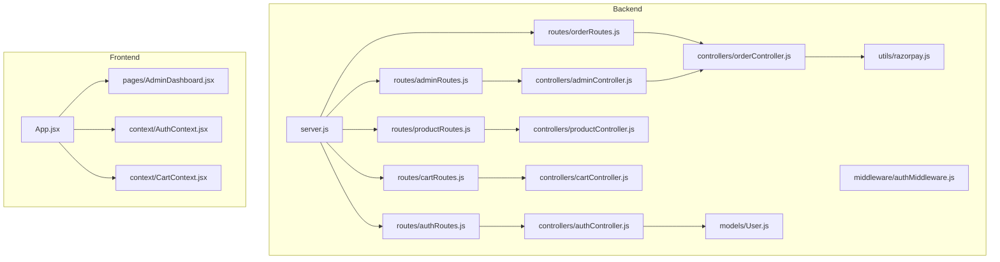
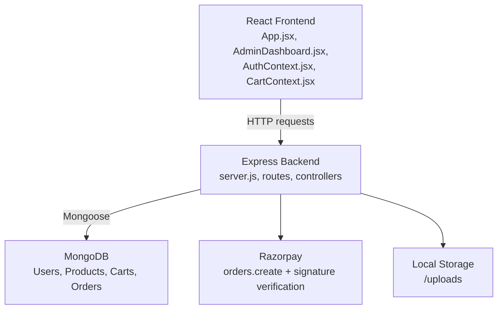
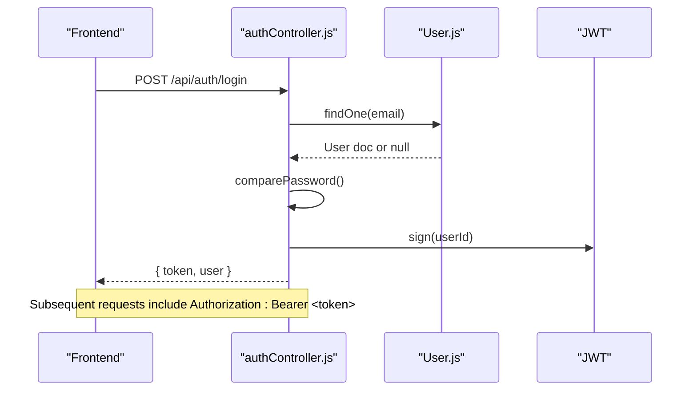
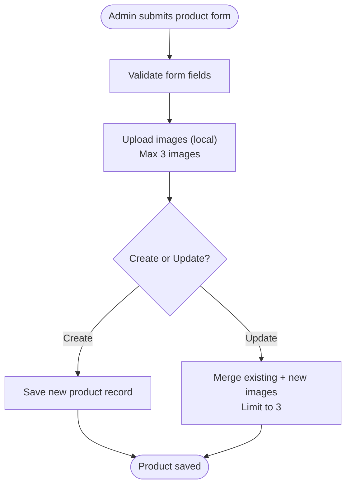
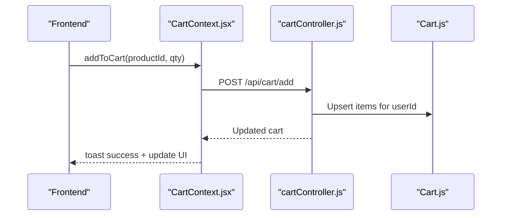
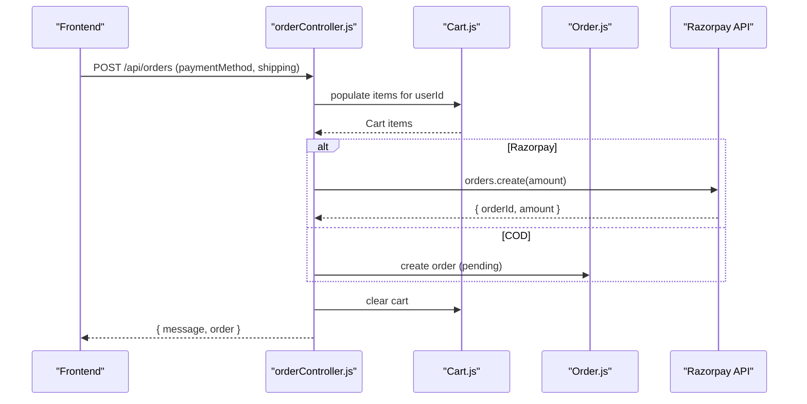
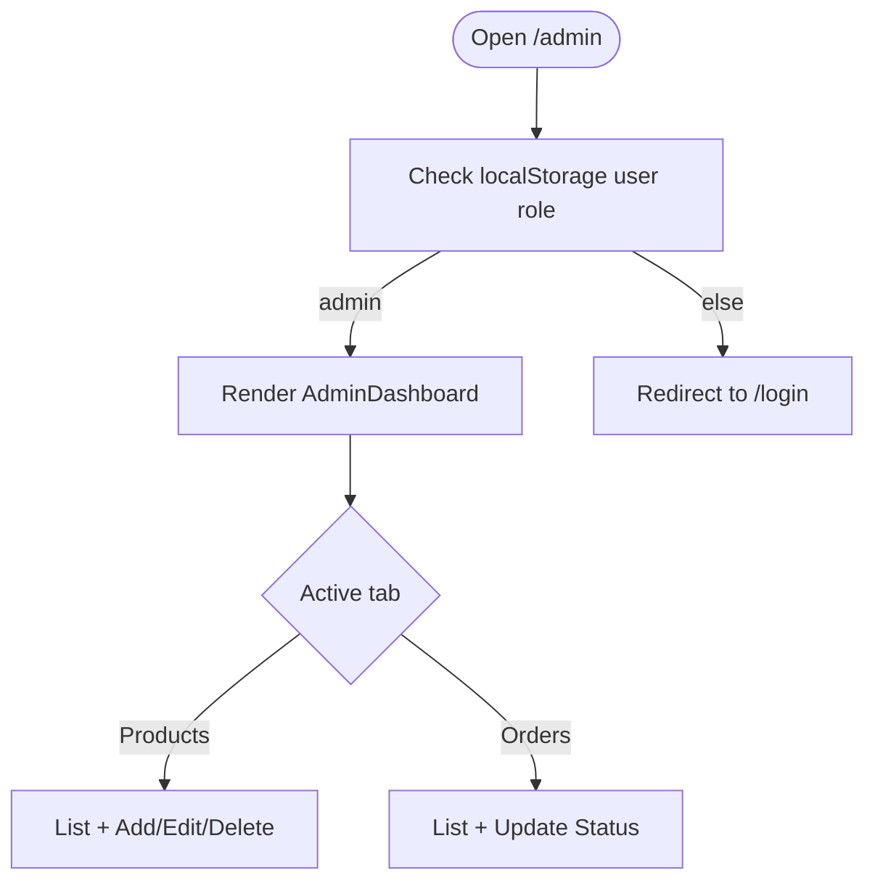
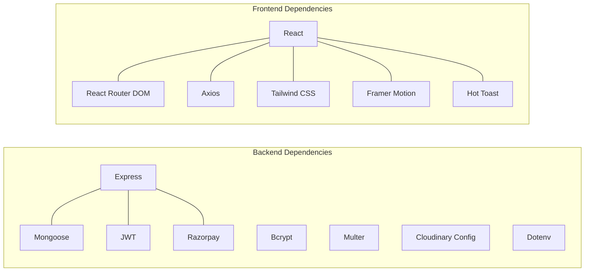

# Project Overview

<cite>
**Referenced Files in This Document**
- [backend/package.json](file://backend/package.json)
- [frontend/package.json](file://frontend/package.json)
- [backend/server.js](file://backend/server.js)
- [backend/config/db.js](file://backend/config/db.js)
- [backend/middleware/authMiddleware.js](file://backend/middleware/authMiddleware.js)
- [backend/controllers/authController.js](file://backend/controllers/authController.js)
- [backend/controllers/productController.js](file://backend/controllers/productController.js)
- [backend/controllers/cartController.js](file://backend/controllers/cartController.js)
- [backend/controllers/orderController.js](file://backend/controllers/orderController.js)
- [backend/controllers/adminController.js](file://backend/controllers/adminController.js)
- [backend/models/User.js](file://backend/models/User.js)
- [backend/utils/razorpay.js](file://backend/utils/razorpay.js)
- [backend/config/cloudinary.js](file://backend/config/cloudinary.js)
- [backend/routes/adminRoutes.js](file://backend/routes/adminRoutes.js)
- [backend/routes/authRoutes.js](file://backend/routes/authRoutes.js)
- [backend/routes/cartRoutes.js](file://backend/routes/cartRoutes.js)
- [backend/routes/orderRoutes.js](file://backend/routes/orderRoutes.js)
- [backend/routes/productRoutes.js](file://backend/routes/productRoutes.js)
- [frontend/src/App.jsx](file://frontend/src/App.jsx)
- [frontend/src/pages/AdminDashboard.jsx](file://frontend/src/pages/AdminDashboard.jsx)
- [frontend/src/context/AuthContext.jsx](file://frontend/src/context/AuthContext.jsx)
- [frontend/src/context/CartContext.jsx](file://frontend/src/context/CartContext.jsx)
</cite>

## Table of Contents
1. [Introduction](#introduction)
2. [Project Structure](#project-structure)
3. [Core Components](#core-components)
4. [Architecture Overview](#architecture-overview)
5. [Detailed Component Analysis](#detailed-component-analysis)
6. [Dependency Analysis](#dependency-analysis)
7. [Performance Considerations](#performance-considerations)
8. [Troubleshooting Guide](#troubleshooting-guide)
9. [Conclusion](#conclusion)

## Introduction
This e-commerce application is a full-stack platform designed to serve both customers and administrators. It enables users to browse products, manage shopping carts, place orders, and track order status, while providing admins with a dedicated dashboard to manage products and orders. The platform integrates secure authentication, MongoDB-backed persistence, payment processing via Razorpay, and local image storage for product media.

Key capabilities demonstrated by the codebase:
- Customer-facing: product browsing, cart management, checkout, and order history
- Admin-facing: product CRUD operations, order listing, and order status updates
- Payments: Razorpay order creation and verification, with support for Cash on Delivery
- Security: JWT-based authentication and role-based access control
- Infrastructure: Express backend, React frontend, MongoDB, and local file uploads

## Project Structure
The repository is organized into three primary areas:
- backend: Node.js/Express server, controllers, models, routes, middleware, and utilities
- frontend: React SPA with routing, context providers, and UI components
- vercel-serverless: Optional serverless API surface (not covered in depth here)

High-level layout:
- Backend entrypoint initializes Express, connects to MongoDB, configures CORS, and mounts API routes
- Frontend entrypoint sets up routing, navigation, and context providers for authentication and cart
- Controllers encapsulate business logic per domain (auth, product, cart, order, admin)
- Models define data schemas and hooks for hashing passwords and protecting fields
- Middleware enforces authentication and admin-only access
- Utilities integrate third-party services (Razorpay, Cloudinary configuration)

**Diagram sources**
- [backend/server.js:1-85](file://backend/server.js#L1-L85)
- [backend/routes/authRoutes.js](file://backend/routes/authRoutes.js)
- [backend/routes/productRoutes.js](file://backend/routes/productRoutes.js)
- [backend/routes/cartRoutes.js](file://backend/routes/cartRoutes.js)
- [backend/routes/orderRoutes.js](file://backend/routes/orderRoutes.js)
- [backend/routes/adminRoutes.js](file://backend/routes/adminRoutes.js)
- [backend/controllers/authController.js:1-27](file://backend/controllers/authController.js#L1-L27)
- [backend/controllers/productController.js:1-127](file://backend/controllers/productController.js#L1-L127)
- [backend/controllers/cartController.js:1-38](file://backend/controllers/cartController.js#L1-L38)
- [backend/controllers/orderController.js:1-146](file://backend/controllers/orderController.js#L1-L146)
- [backend/controllers/adminController.js:1-24](file://backend/controllers/adminController.js#L1-L24)
- [backend/middleware/authMiddleware.js:1-20](file://backend/middleware/authMiddleware.js#L1-L20)
- [backend/models/User.js:1-20](file://backend/models/User.js#L1-L20)
- [backend/utils/razorpay.js](file://backend/utils/razorpay.js)
- [frontend/src/App.jsx:1-66](file://frontend/src/App.jsx#L1-L66)
- [frontend/src/pages/AdminDashboard.jsx:1-259](file://frontend/src/pages/AdminDashboard.jsx#L1-L259)
- [frontend/src/context/AuthContext.jsx:1-33](file://frontend/src/context/AuthContext.jsx#L1-L33)
- [frontend/src/context/CartContext.jsx:1-53](file://frontend/src/context/CartContext.jsx#L1-L53)

**Section sources**
- [backend/server.js:1-85](file://backend/server.js#L1-L85)
- [frontend/src/App.jsx:1-66](file://frontend/src/App.jsx#L1-L66)

## Core Components
- Authentication and Authorization
  - JWT-based login/register flow with protected routes and admin guard
  - Password hashing via bcrypt and role field (user/admin) in User model
- Product Catalog
  - Search, filtering, pagination, and CRUD operations with local image storage
- Shopping Cart
  - Persistent cart per user with add/update/remove/clear operations
- Orders and Payments
  - Order creation, status management, and Razorpay integration with signature verification
  - Support for Cash on Delivery and dynamic shipping zones
- Admin Dashboard
  - Product management UI with image upload preview and limits
  - Order listing and status updates

Practical examples:
- Place an order with a selected payment method and shipping zone
- Update product stock and images from the admin panel
- Add items to the cart and proceed to checkout

**Section sources**
- [backend/controllers/authController.js:1-27](file://backend/controllers/authController.js#L1-L27)
- [backend/middleware/authMiddleware.js:1-20](file://backend/middleware/authMiddleware.js#L1-L20)
- [backend/models/User.js:1-20](file://backend/models/User.js#L1-L20)
- [backend/controllers/productController.js:1-127](file://backend/controllers/productController.js#L1-L127)
- [backend/controllers/cartController.js:1-38](file://backend/controllers/cartController.js#L1-L38)
- [backend/controllers/orderController.js:1-146](file://backend/controllers/orderController.js#L1-L146)
- [backend/controllers/adminController.js:1-24](file://backend/controllers/adminController.js#L1-L24)
- [frontend/src/pages/AdminDashboard.jsx:1-259](file://frontend/src/pages/AdminDashboard.jsx#L1-L259)

## Architecture Overview
The system follows a classic full-stack separation:
- Backend: Express server exposing RESTful APIs, enforcing auth/admin policies, and interacting with MongoDB via Mongoose
- Frontend: React SPA handling UI, routing, and state via context providers
- Persistence: MongoDB collections for Users, Products, Carts, and Orders
- Integrations: Razorpay for payments and Cloudinary configuration present for optional cloud storage

**Diagram sources**
- [backend/server.js:1-85](file://backend/server.js#L1-L85)
- [backend/controllers/orderController.js:1-146](file://backend/controllers/orderController.js#L1-L146)
- [backend/config/db.js:1-14](file://backend/config/db.js#L1-L14)
- [backend/config/cloudinary.js](file://backend/config/cloudinary.js)
- [frontend/src/App.jsx:1-66](file://frontend/src/App.jsx#L1-L66)
- [frontend/src/pages/AdminDashboard.jsx:1-259](file://frontend/src/pages/AdminDashboard.jsx#L1-L259)

## Detailed Component Analysis

### Authentication and Authorization
- JWT tokens are generated on successful login/register and stored client-side
- Protected routes enforce bearer token validation and decode user identity
- Admin-only endpoints restrict access to users with role=admin

**Diagram sources**
- [backend/controllers/authController.js:1-27](file://backend/controllers/authController.js#L1-L27)
- [backend/models/User.js:1-20](file://backend/models/User.js#L1-L20)
- [backend/middleware/authMiddleware.js:1-20](file://backend/middleware/authMiddleware.js#L1-L20)

**Section sources**
- [backend/controllers/authController.js:1-27](file://backend/controllers/authController.js#L1-L27)
- [backend/middleware/authMiddleware.js:1-20](file://backend/middleware/authMiddleware.js#L1-L20)
- [backend/models/User.js:1-20](file://backend/models/User.js#L1-L20)
- [frontend/src/context/AuthContext.jsx:1-33](file://frontend/src/context/AuthContext.jsx#L1-L33)

### Product Management
- Fetch paginated, searchable, and filterable product lists
- Create/update/delete products with local image uploads
- Enforces a maximum of three images per product

**Diagram sources**
- [backend/controllers/productController.js:52-113](file://backend/controllers/productController.js#L52-L113)
- [frontend/src/pages/AdminDashboard.jsx:69-95](file://frontend/src/pages/AdminDashboard.jsx#L69-L95)

**Section sources**
- [backend/controllers/productController.js:1-127](file://backend/controllers/productController.js#L1-L127)
- [frontend/src/pages/AdminDashboard.jsx:1-259](file://frontend/src/pages/AdminDashboard.jsx#L1-L259)

### Cart Operations
- Per-user cart persisted in MongoDB
- Add items, adjust quantities, remove items, and clear the cart
- Cart state synchronized via context provider

**Diagram sources**
- [frontend/src/context/CartContext.jsx:31-38](file://frontend/src/context/CartContext.jsx#L31-L38)
- [backend/controllers/cartController.js:9-22](file://backend/controllers/cartController.js#L9-L22)

**Section sources**
- [backend/controllers/cartController.js:1-38](file://backend/controllers/cartController.js#L1-L38)
- [frontend/src/context/CartContext.jsx:1-53](file://frontend/src/context/CartContext.jsx#L1-L53)

### Order Processing and Payments
- Create orders from cart contents with configurable payment method
- Integrate with Razorpay for online payments and verify signatures
- Support COD with order status set appropriately
- Admin can update order statuses

**Diagram sources**
- [backend/controllers/orderController.js:84-146](file://backend/controllers/orderController.js#L84-L146)
- [backend/utils/razorpay.js](file://backend/utils/razorpay.js)

**Section sources**
- [backend/controllers/orderController.js:1-146](file://backend/controllers/orderController.js#L1-L146)
- [backend/utils/razorpay.js](file://backend/utils/razorpay.js)

### Admin Dashboard
- Product CRUD with image preview and upload limits
- Order listing and status updates
- Role-based redirection to prevent non-admin access

**Diagram sources**
- [frontend/src/pages/AdminDashboard.jsx:34-40](file://frontend/src/pages/AdminDashboard.jsx#L34-L40)
- [frontend/src/pages/AdminDashboard.jsx:146-256](file://frontend/src/pages/AdminDashboard.jsx#L146-L256)

**Section sources**
- [frontend/src/pages/AdminDashboard.jsx:1-259](file://frontend/src/pages/AdminDashboard.jsx#L1-L259)
- [backend/controllers/adminController.js:1-24](file://backend/controllers/adminController.js#L1-L24)

## Dependency Analysis
Technology stack and key dependencies:
- Backend
  - Express for HTTP server and routing
  - Mongoose for MongoDB ODM
  - JWT for authentication
  - Bcrypt for password hashing
  - Multer/Multer-Cloudinary for image uploads (Cloudinary config present)
  - Razorpay for payment processing
  - Dotenv for environment variables
- Frontend
  - React + React Router DOM for routing
  - Axios for HTTP requests
  - Tailwind CSS + Framer Motion for UI
  - react-hot-toast for notifications

**Diagram sources**
- [backend/package.json:8-22](file://backend/package.json#L8-L22)
- [frontend/package.json:8-16](file://frontend/package.json#L8-L16)

**Section sources**
- [backend/package.json:1-27](file://backend/package.json#L1-L27)
- [frontend/package.json:1-25](file://frontend/package.json#L1-L25)

## Performance Considerations
- Database queries
  - Product listing uses pagination and indexing-friendly filters; consider adding compound indexes for frequent search/filter combinations
  - Populate operations in cart/order retrieval should be minimized; ensure only necessary fields are populated
- Caching
  - Implement server-side caching for frequently accessed product lists and static assets
- Network
  - Compress responses and enable gzip where appropriate
  - Batch cart updates to reduce round trips
- Frontend
  - Lazy-load images and avoid unnecessary re-renders in cart/product lists
  - Debounce search inputs to reduce backend load

## Troubleshooting Guide
Common issues and resolutions:
- CORS errors
  - Verify allowed origins and credentials configuration in the server’s CORS setup
- Authentication failures
  - Confirm JWT secret, token presence in Authorization header, and user role checks
- Payment verification failures
  - Ensure Razorpay key and secret are configured and signature verification matches HMAC-SHA256
- Cart synchronization
  - Confirm token availability and that cart fetch/update handlers are invoked after login and actions
- Image uploads
  - Respect the maximum image count per product and ensure local upload directory permissions

**Section sources**
- [backend/server.js:22-49](file://backend/server.js#L22-L49)
- [backend/middleware/authMiddleware.js:4-15](file://backend/middleware/authMiddleware.js#L4-L15)
- [backend/controllers/orderController.js:52-67](file://backend/controllers/orderController.js#L52-L67)
- [frontend/src/context/CartContext.jsx:31-38](file://frontend/src/context/CartContext.jsx#L31-L38)
- [backend/controllers/productController.js:92-94](file://backend/controllers/productController.js#L92-L94)

## Conclusion
This e-commerce platform provides a solid foundation for a customer-facing shop with robust admin capabilities. Its modular backend and React frontend enable clear separation of concerns, while MongoDB and Mongoose offer flexible data modeling. The integration of JWT, Mongoose, Razorpay, and local image storage aligns with modern full-stack practices. With further enhancements in caching, indexing, and frontend performance, the platform can scale effectively to meet growing demands.