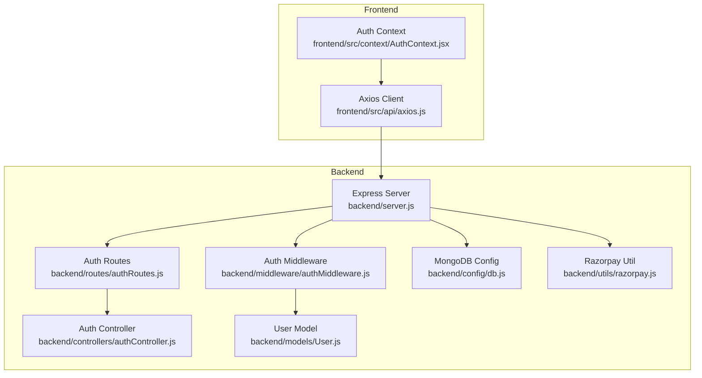
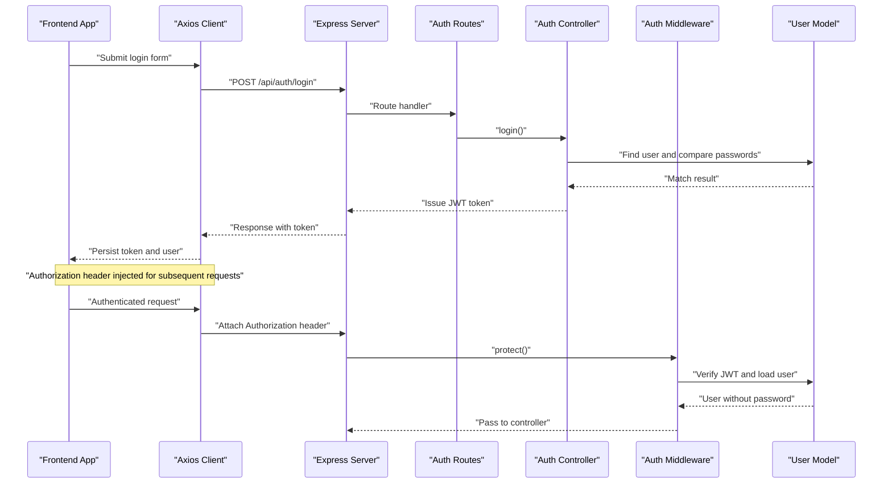
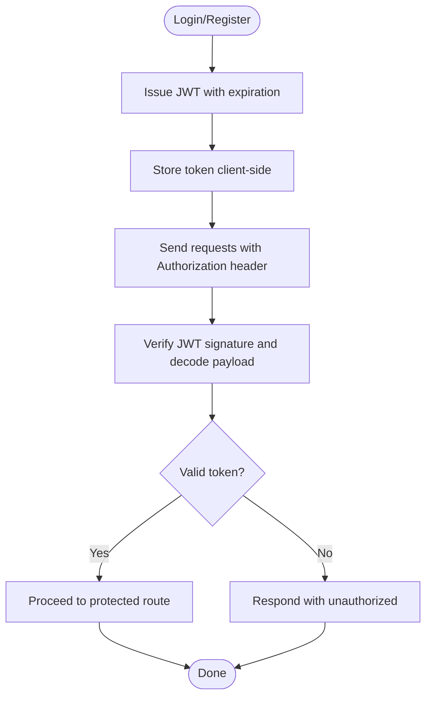
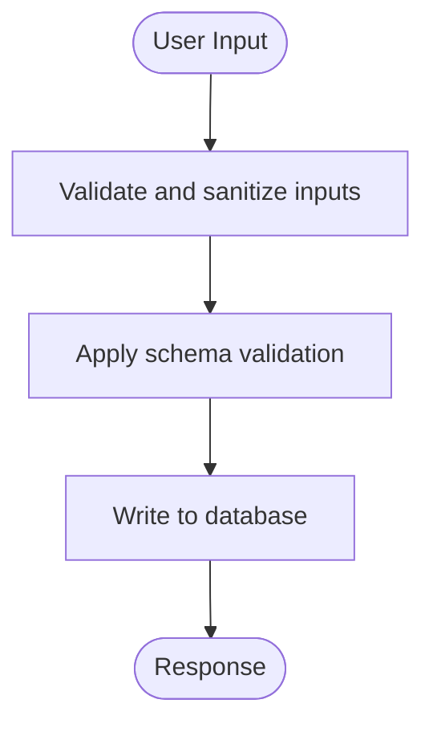
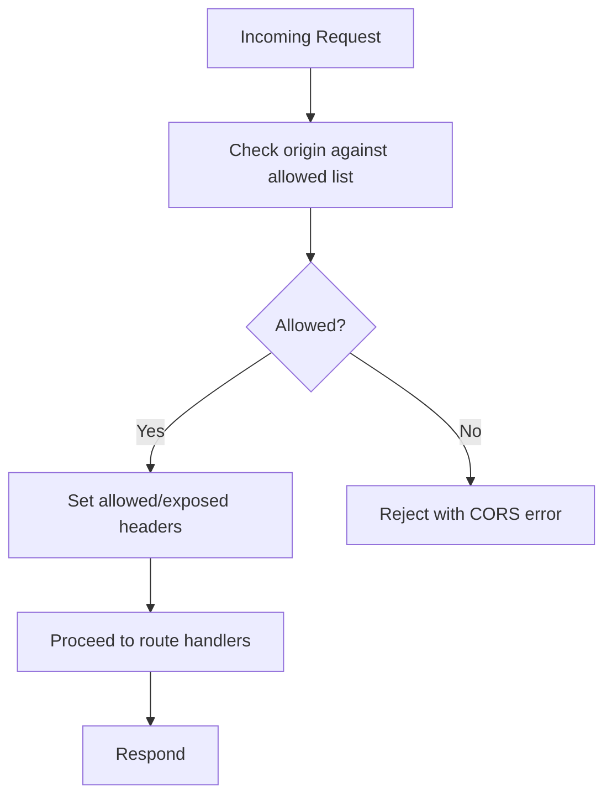
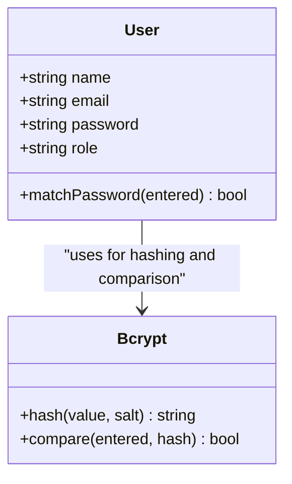
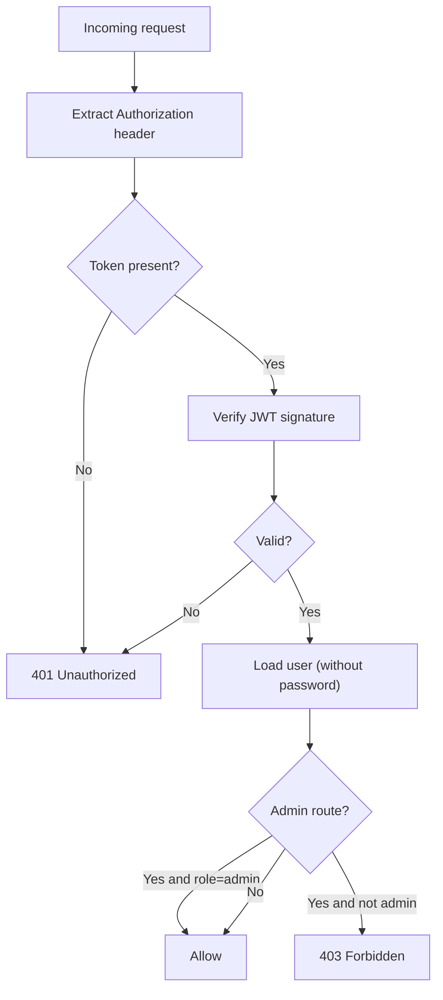
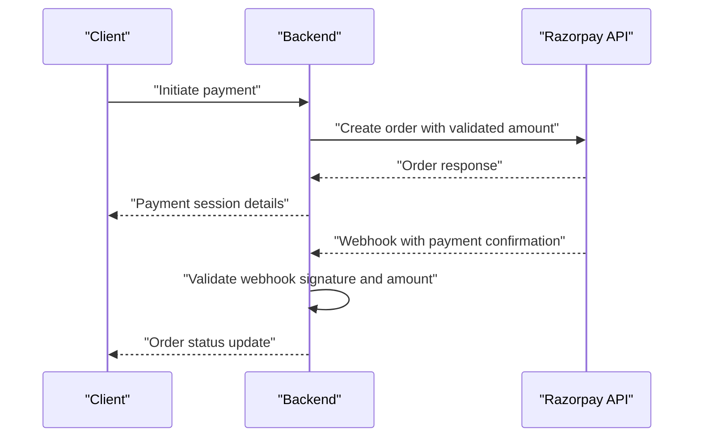
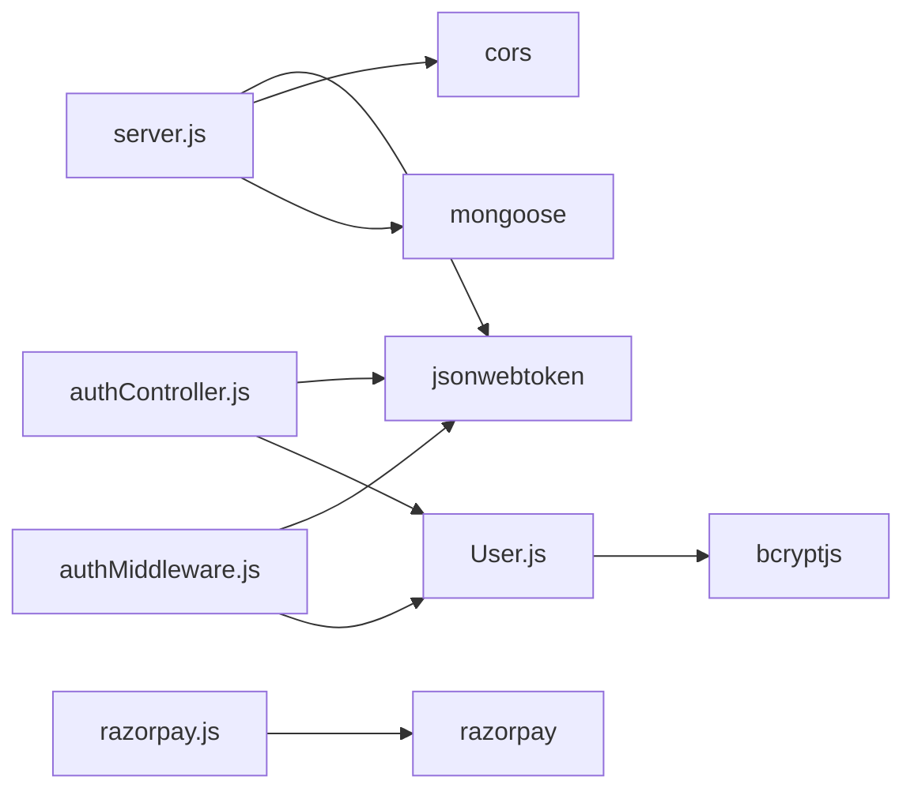

# Security Considerations

<cite>
**Referenced Files in This Document**
- [server.js](file://backend/server.js)
- [authController.js](file://backend/controllers/authController.js)
- [authMiddleware.js](file://backend/middleware/authMiddleware.js)
- [User.js](file://backend/models/User.js)
- [authRoutes.js](file://backend/routes/authRoutes.js)
- [db.js](file://backend/config/db.js)
- [razorpay.js](file://backend/utils/razorpay.js)
- [AuthContext.jsx](file://frontend/src/context/AuthContext.jsx)
- [axios.js](file://frontend/src/api/axios.js)
- [cartController.js](file://backend/controllers/cartController.js)
- [productController.js](file://backend/controllers/productController.js)
- [adminController.js](file://backend/controllers/adminController.js)
- [package.json](file://backend/package.json)
- [package.json](file://frontend/package.json)
</cite>

## Table of Contents
1. [Introduction](#introduction)
2. [Project Structure](#project-structure)
3. [Core Components](#core-components)
4. [Architecture Overview](#architecture-overview)
5. [Detailed Component Analysis](#detailed-component-analysis)
6. [Dependency Analysis](#dependency-analysis)
7. [Performance Considerations](#performance-considerations)
8. [Troubleshooting Guide](#troubleshooting-guide)
9. [Conclusion](#conclusion)
10. [Appendices](#appendices)

## Introduction
This document provides comprehensive security documentation for the e-commerce application. It focuses on JWT token lifecycle and secure storage, input validation and sanitization, CORS configuration, password hashing and policies, authentication and authorization middleware, and payment processing security. It also outlines best practices for protecting sensitive data, mitigating common web vulnerabilities, and establishing secure development and testing practices.

## Project Structure
The application follows a modular backend built with Express and Mongoose, complemented by a React frontend using Axios for HTTP communication. Authentication and authorization are handled via JWT tokens, while payment processing integrates external providers.

**Diagram sources**
- [server.js:1-102](file://backend/server.js#L1-L102)
- [authRoutes.js:1-9](file://backend/routes/authRoutes.js#L1-L9)
- [authController.js:1-27](file://backend/controllers/authController.js#L1-L27)
- [authMiddleware.js:1-20](file://backend/middleware/authMiddleware.js#L1-L20)
- [User.js:1-20](file://backend/models/User.js#L1-L20)
- [db.js:1-14](file://backend/config/db.js#L1-L14)
- [razorpay.js:1-10](file://backend/utils/razorpay.js#L1-L10)
- [axios.js:1-17](file://frontend/src/api/axios.js#L1-L17)
- [AuthContext.jsx:1-33](file://frontend/src/context/AuthContext.jsx#L1-L33)

**Section sources**
- [server.js:1-102](file://backend/server.js#L1-L102)
- [package.json:1-27](file://backend/package.json#L1-L27)
- [package.json:1-25](file://frontend/package.json#L1-L25)

## Core Components
- JWT-based authentication with signed tokens and middleware protection.
- Password hashing using bcrypt with pre-save hooks.
- CORS configuration allowing controlled origins and credentials.
- Payment integration via external provider utilities.
- Frontend token storage and Authorization header injection.

**Section sources**
- [authController.js:4-16](file://backend/controllers/authController.js#L4-L16)
- [authMiddleware.js:4-15](file://backend/middleware/authMiddleware.js#L4-L15)
- [User.js:11-18](file://backend/models/User.js#L11-L18)
- [server.js:22-49](file://backend/server.js#L22-L49)
- [razorpay.js:5-8](file://backend/utils/razorpay.js#L5-L8)
- [axios.js:4-8](file://frontend/src/api/axios.js#L4-L8)
- [AuthContext.jsx:16-22](file://frontend/src/context/AuthContext.jsx#L16-L22)

## Architecture Overview
The system enforces authentication at the route level using middleware, verifies JWT signatures, and restricts access to admin resources. Tokens are issued on successful registration/login and stored client-side. Requests automatically attach Authorization headers. Payment operations rely on provider SDKs configured via environment variables.

**Diagram sources**
- [authRoutes.js:6-7](file://backend/routes/authRoutes.js#L6-L7)
- [authController.js:18-27](file://backend/controllers/authController.js#L18-L27)
- [authMiddleware.js:4-15](file://backend/middleware/authMiddleware.js#L4-L15)
- [User.js:16-18](file://backend/models/User.js#L16-L18)
- [axios.js:4-8](file://frontend/src/api/axios.js#L4-L8)
- [AuthContext.jsx:16-22](file://frontend/src/context/AuthContext.jsx#L16-L22)

## Detailed Component Analysis

### JWT Token Security
- Token issuance: Tokens are signed with a secret and set to expire in seven days.
- Token verification: Middleware extracts the Bearer token from Authorization headers and validates the signature.
- Token storage: Client stores the token in local storage and attaches it to all authenticated requests.
- Refresh mechanism: No explicit refresh token flow is implemented; consider implementing a short-lived access token with a long-lived refresh token stored securely.

**Diagram sources**
- [authController.js:4](file://backend/controllers/authController.js#L4)
- [authMiddleware.js:5-14](file://backend/middleware/authMiddleware.js#L5-L14)
- [axios.js:4-8](file://frontend/src/api/axios.js#L4-L8)
- [AuthContext.jsx:18-21](file://frontend/src/context/AuthContext.jsx#L18-L21)

**Section sources**
- [authController.js:4](file://backend/controllers/authController.js#L4)
- [authMiddleware.js:5-14](file://backend/middleware/authMiddleware.js#L5-L14)
- [axios.js:4-8](file://frontend/src/api/axios.js#L4-L8)
- [AuthContext.jsx:18-21](file://frontend/src/context/AuthContext.jsx#L18-L21)

### Input Validation, Sanitization, and Vulnerability Mitigation
- Query sanitization: Product search uses regex queries; ensure input is validated and bounded to prevent regex injection and excessive resource consumption.
- Body parsing: Express body parsers are enabled; ensure schema validation and sanitization are applied before database writes.
- Regex-based search: While convenient, regex queries can be expensive; consider indexing and rate limiting.
- CSRF: Not implemented; consider adding CSRF protection for state-changing forms or enable SameSite cookies for session cookies if applicable.
- XSS: No explicit sanitization pipeline; sanitize HTML outputs and escape user-generated content on the frontend and backend.
- SQL injection: Uses MongoDB ODM; ensure all dynamic queries use parameterized forms and avoid raw aggregation pipelines with unsanitized user input.

**Diagram sources**
- [productController.js:9-17](file://backend/controllers/productController.js#L9-L17)
- [productController.js:54-66](file://backend/controllers/productController.js#L54-L66)

**Section sources**
- [productController.js:9-17](file://backend/controllers/productController.js#L9-L17)
- [productController.js:54-66](file://backend/controllers/productController.js#L54-L66)

### CORS Configuration and Header Management
- Origins: Explicitly lists allowed origins and allows credentials.
- Methods and headers: Restricts methods and allowed headers to essential ones.
- Preflight caching: Sets max-age to cache preflight results.
- Recommendations: Keep allowed origins minimal, avoid wildcard origins, and review exposed headers.

**Diagram sources**
- [server.js:22-49](file://backend/server.js#L22-L49)

**Section sources**
- [server.js:22-49](file://backend/server.js#L22-L49)

### Password Security and Policies
- Hashing: Pre-save hook hashes passwords using bcrypt with a work factor suitable for the environment.
- Comparison: Uses bcrypt to compare entered passwords with stored hash.
- Policy recommendations: Enforce minimum length, mixed character sets, and rotation policies; consider rate limiting login attempts.

**Diagram sources**
- [User.js:11-18](file://backend/models/User.js#L11-L18)

**Section sources**
- [User.js:11-18](file://backend/models/User.js#L11-L18)

### Authentication Middleware and Authorization Controls
- Protection: Middleware extracts token from Authorization header, verifies it, and attaches user without password to the request.
- Role-based access: Admin guard checks user role and denies access otherwise.
- Recommendations: Add token blacklisting, IP/device binding, and audit logs for elevated actions.

**Diagram sources**
- [authMiddleware.js:4-20](file://backend/middleware/authMiddleware.js#L4-L20)

**Section sources**
- [authMiddleware.js:4-20](file://backend/middleware/authMiddleware.js#L4-L20)

### Payment Processing Security
- Provider integration: Razorpay client initialized with environment variables for keys.
- Best practices: Never log or transmit raw payment data; use server-side callbacks; validate amounts and currency; enforce HTTPS and signed webhooks.

**Diagram sources**
- [razorpay.js:5-8](file://backend/utils/razorpay.js#L5-L8)

**Section sources**
- [razorpay.js:5-8](file://backend/utils/razorpay.js#L5-L8)

### Sensitive Information Handling
- Environment variables: Database URI, JWT secret, and provider keys are loaded from environment variables.
- Recommendations: Use secrets managers, rotate keys regularly, and restrict environment exposure.

**Section sources**
- [db.js:7](file://backend/config/db.js#L7)
- [authController.js:4](file://backend/controllers/authController.js#L4)
- [razorpay.js:6-7](file://backend/utils/razorpay.js#L6-L7)

### Additional Controllers Security Notes
- Cart operations: Ensure productId and quantity are validated before updates; handle missing cart gracefully.
- Product CRUD: Apply runValidators during updates and sanitize arrays of images; limit image count and enforce allowed types.

**Section sources**
- [cartController.js:9-32](file://backend/controllers/cartController.js#L9-L32)
- [productController.js:75-112](file://backend/controllers/productController.js#L75-L112)

## Dependency Analysis
External libraries relevant to security:
- jsonwebtoken: JWT signing and verification.
- bcryptjs: Password hashing and comparison.
- cors: Cross-origin policy enforcement.
- mongoose: ODM for MongoDB with schema-based validation.
- razorpay: Payment provider integration.

**Diagram sources**
- [server.js:1-102](file://backend/server.js#L1-L102)
- [authController.js:1-27](file://backend/controllers/authController.js#L1-L27)
- [authMiddleware.js:1-20](file://backend/middleware/authMiddleware.js#L1-L20)
- [User.js:1-20](file://backend/models/User.js#L1-L20)
- [razorpay.js:1-10](file://backend/utils/razorpay.js#L1-L10)
- [package.json:8-22](file://backend/package.json#L8-L22)

**Section sources**
- [package.json:8-22](file://backend/package.json#L8-L22)

## Performance Considerations
- JWT verification overhead: Keep token verification fast; avoid heavy per-request computations.
- Regex queries: Limit regex complexity and consider full-text search indexes for product search.
- Rate limiting: Implement rate limits for login and token refresh to mitigate brute force attacks.
- Database queries: Use projections and pagination; avoid N+1 queries in populated routes.

## Troubleshooting Guide
- CORS errors: Verify origin list and credentials flag; confirm preflight caching and allowed headers.
- 401 Unauthorized: Check Authorization header format and token validity; ensure JWT secret matches.
- 403 Forbidden: Confirm user role and admin guard logic.
- 5xx errors: Review centralized error handler and logs; ensure sensitive data is not leaked.

**Section sources**
- [server.js:91-95](file://backend/server.js#L91-L95)
- [authMiddleware.js:6](file://backend/middleware/authMiddleware.js#L6)
- [authMiddleware.js:12-14](file://backend/middleware/authMiddleware.js#L12-L14)

## Conclusion
The application implements foundational security measures including JWT authentication, bcrypt-based password hashing, and CORS configuration. To strengthen security posture, implement CSRF protection, robust input validation and sanitization, token refresh mechanisms, strict password policies, and comprehensive error handling. For production, integrate secrets management, monitor and audit access, and adopt secure coding practices across the stack.

## Appendices

### Practical Secure Implementation Patterns
- Token storage: Store access tokens in httpOnly cookies when feasible; keep refresh tokens secure and scoped.
- Validation: Use schema validation libraries and sanitize untrusted inputs before processing.
- Logging: Avoid logging tokens or sensitive PII; mask sensitive fields in logs.
- Testing: Perform authenticated and unauthorized request tests; simulate token expiry and invalid signatures; test CORS and header configurations.

### Security Testing Approaches
- Static analysis: Scan for hardcoded secrets and unsafe deserialization.
- Dynamic analysis: Penetration test endpoints for injection, CSRF, and broken authentication.
- Configuration review: Validate environment variables and CORS settings.
- Dependency audit: Regularly audit third-party packages for known vulnerabilities.