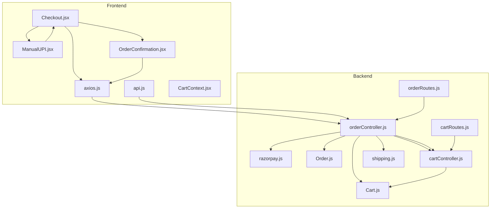
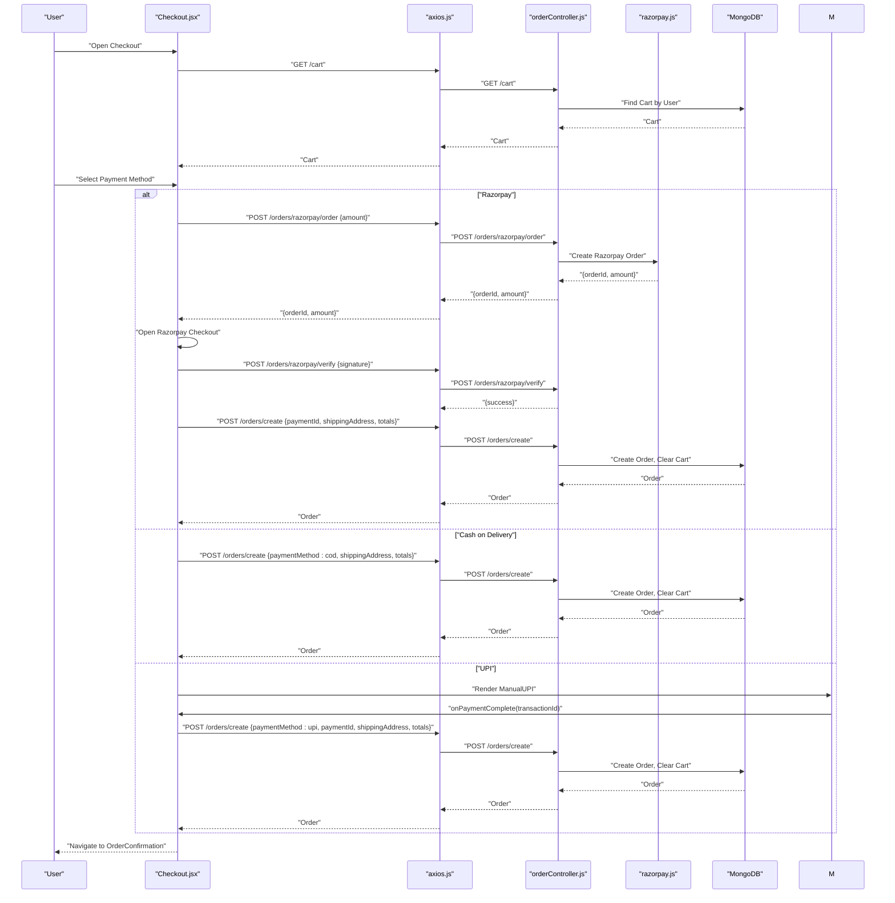
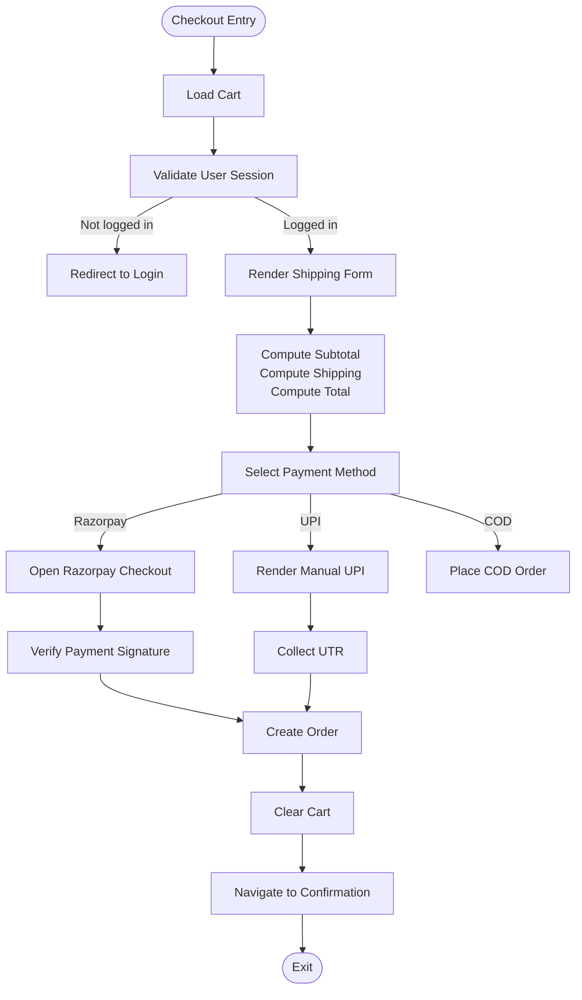
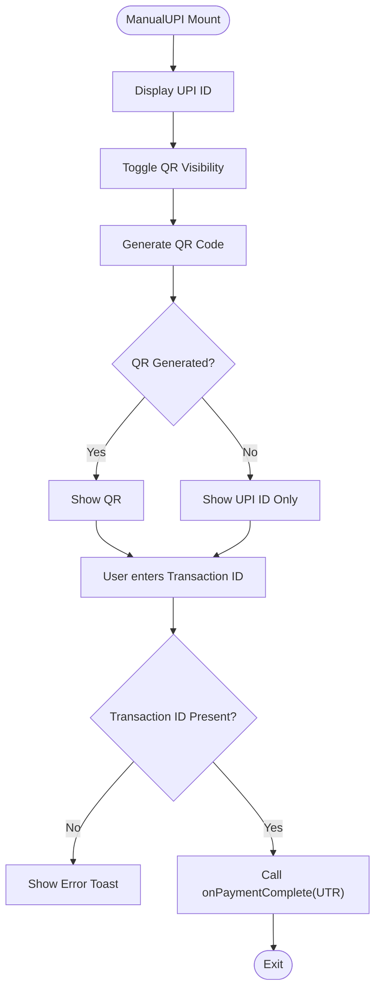
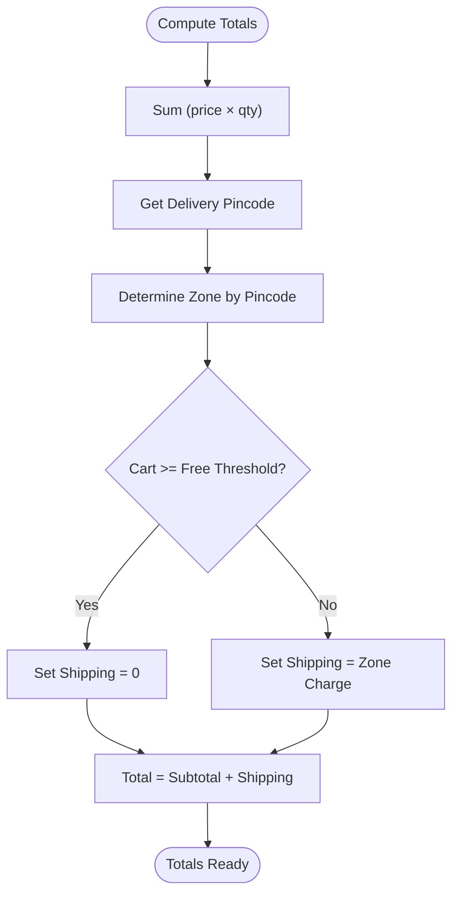
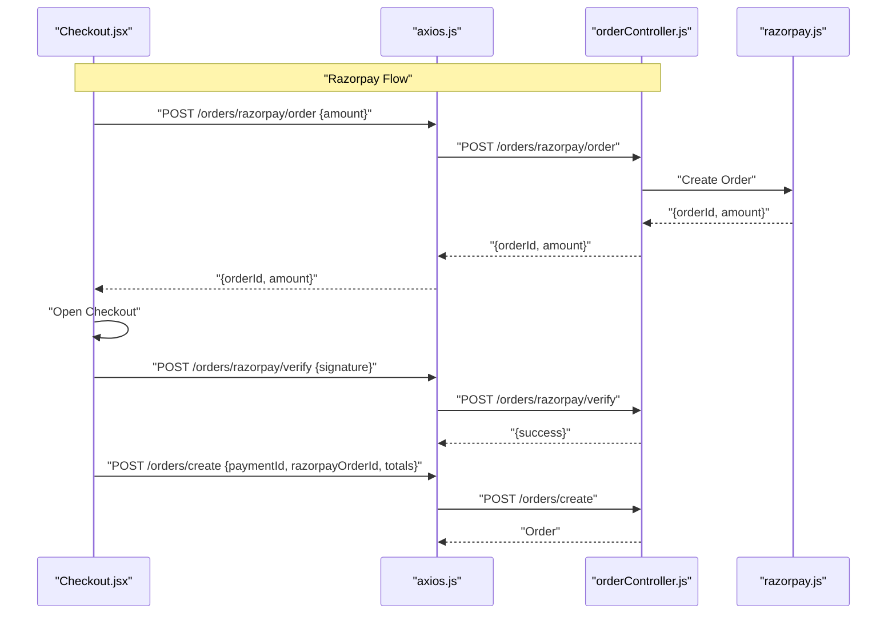
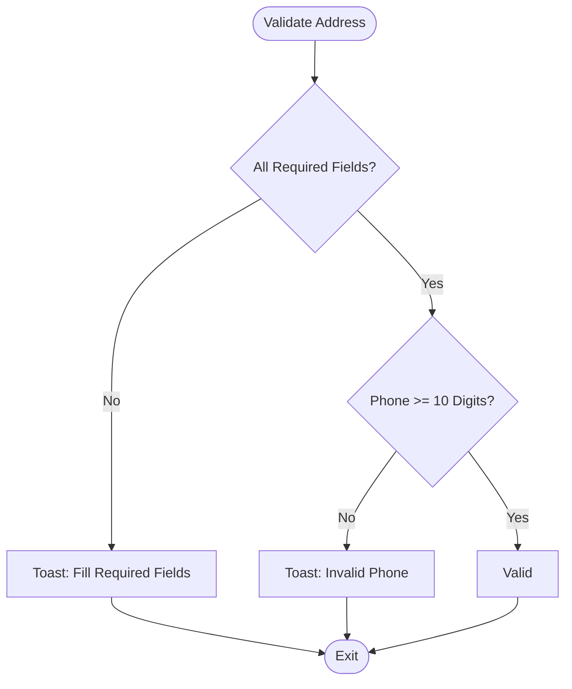
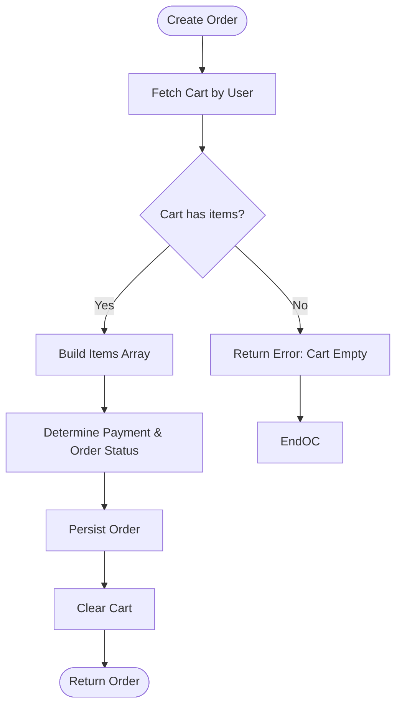
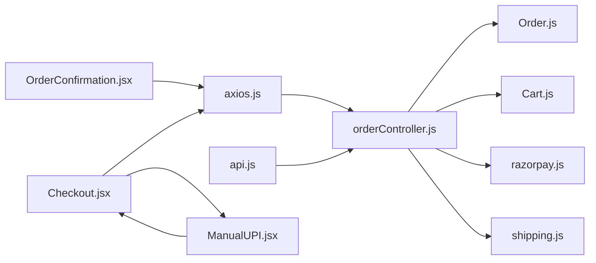

# Checkout & Payment Processing

<cite>
**Referenced Files in This Document**
- [Checkout.jsx](file://frontend/src/pages/Checkout.jsx)
- [ManualUPI.jsx](file://frontend/src/components/ManualUPI.jsx)
- [OrderConfirmation.jsx](file://frontend/src/pages/OrderConfirmation.jsx)
- [axios.js](file://frontend/src/api/axios.js)
- [api.js](file://frontend/src/services/api.js)
- [CartContext.jsx](file://frontend/src/context/CartContext.jsx)
- [orderController.js](file://backend/controllers/orderController.js)
- [orderRoutes.js](file://backend/routes/orderRoutes.js)
- [razorpay.js](file://backend/utils/razorpay.js)
- [Order.js](file://backend/models/Order.js)
- [cartRoutes.js](file://backend/routes/cartRoutes.js)
- [cartController.js](file://backend/controllers/cartController.js)
- [Cart.js](file://backend/models/Cart.js)
- [shipping.js](file://backend/config/shipping.js)
</cite>

## Table of Contents
1. [Introduction](#introduction)
2. [Project Structure](#project-structure)
3. [Core Components](#core-components)
4. [Architecture Overview](#architecture-overview)
5. [Detailed Component Analysis](#detailed-component-analysis)
6. [Dependency Analysis](#dependency-analysis)
7. [Performance Considerations](#performance-considerations)
8. [Troubleshooting Guide](#troubleshooting-guide)
9. [Conclusion](#conclusion)
10. [Appendices](#appendices)

## Introduction
This document explains the checkout and payment processing workflow for an e-commerce application. It covers the checkout page implementation, including the shipping address form, order review, and payment method selection. It documents UPI payment integration with a manual UPI component for QR code display and payment verification. It also details form validation, order summary calculations, payment method processing, error handling, security considerations, and user experience patterns for checkout completion and progress indication.

## Project Structure
The checkout and payment flow spans the frontend React application and the backend Node.js/Express APIs. Key components include:
- Frontend pages and components for checkout, UPI payment, and order confirmation
- Frontend API client with token-based authentication
- Backend controllers and routes for orders, carts, and Razorpay integration
- Backend models for orders and carts
- Shipping configuration for calculating shipping costs

**Diagram sources**
- [Checkout.jsx:1-301](file://frontend/src/pages/Checkout.jsx#L1-L301)
- [ManualUPI.jsx:1-125](file://frontend/src/components/ManualUPI.jsx#L1-L125)
- [OrderConfirmation.jsx:1-73](file://frontend/src/pages/OrderConfirmation.jsx#L1-L73)
- [axios.js:1-17](file://frontend/src/api/axios.js#L1-L17)
- [api.js:1-8](file://frontend/src/services/api.js#L1-L8)
- [CartContext.jsx:1-53](file://frontend/src/context/CartContext.jsx#L1-L53)
- [orderController.js:1-146](file://backend/controllers/orderController.js#L1-L146)
- [orderRoutes.js:1-28](file://backend/routes/orderRoutes.js#L1-L28)
- [razorpay.js:1-10](file://backend/utils/razorpay.js#L1-L10)
- [Order.js:1-33](file://backend/models/Order.js#L1-L33)
- [cartController.js:1-38](file://backend/controllers/cartController.js#L1-L38)
- [cartRoutes.js:1-12](file://backend/routes/cartRoutes.js#L1-L12)
- [Cart.js:1-12](file://backend/models/Cart.js#L1-L12)
- [shipping.js:1-73](file://backend/config/shipping.js#L1-L73)

**Section sources**
- [Checkout.jsx:1-301](file://frontend/src/pages/Checkout.jsx#L1-L301)
- [orderController.js:1-146](file://backend/controllers/orderController.js#L1-L146)
- [orderRoutes.js:1-28](file://backend/routes/orderRoutes.js#L1-L28)
- [razorpay.js:1-10](file://backend/utils/razorpay.js#L1-L10)
- [Order.js:1-33](file://backend/models/Order.js#L1-L33)
- [cartController.js:1-38](file://backend/controllers/cartController.js#L1-L38)
- [cartRoutes.js:1-12](file://backend/routes/cartRoutes.js#L1-L12)
- [Cart.js:1-12](file://backend/models/Cart.js#L1-L12)
- [shipping.js:1-73](file://backend/config/shipping.js#L1-L73)

## Core Components
- Checkout page: Collects shipping address, displays order summary, and handles payment method selection (Razorpay, UPI, Cash on Delivery).
- Manual UPI component: Generates a UPI payment link, shows QR code, collects transaction ID, and triggers order creation.
- Order controller: Creates orders, integrates with Razorpay for online payments, verifies payments, and manages order statuses.
- API clients: Axios-based clients with token injection for authenticated requests.
- Models: Order and Cart models define data structures and constraints.
- Shipping configuration: Calculates shipping costs and free shipping thresholds based on pincode.

**Section sources**
- [Checkout.jsx:1-301](file://frontend/src/pages/Checkout.jsx#L1-L301)
- [ManualUPI.jsx:1-125](file://frontend/src/components/ManualUPI.jsx#L1-L125)
- [orderController.js:1-146](file://backend/controllers/orderController.js#L1-L146)
- [axios.js:1-17](file://frontend/src/api/axios.js#L1-L17)
- [api.js:1-8](file://frontend/src/services/api.js#L1-L8)
- [Order.js:1-33](file://backend/models/Order.js#L1-L33)
- [Cart.js:1-12](file://backend/models/Cart.js#L1-L12)
- [shipping.js:1-73](file://backend/config/shipping.js#L1-L73)

## Architecture Overview
The checkout flow is a client-server interaction:
- Frontend loads cart and shipping info, renders the checkout UI, and collects user input.
- On payment selection, frontend calls backend endpoints for Razorpay order creation and verification, or creates orders directly for COD and UPI.
- Backend validates cart contents, calculates totals, persists the order, and clears the cart.
- Frontend navigates to order confirmation and displays order details.

**Diagram sources**
- [Checkout.jsx:67-165](file://frontend/src/pages/Checkout.jsx#L67-L165)
- [axios.js:1-17](file://frontend/src/api/axios.js#L1-L17)
- [orderController.js:39-146](file://backend/controllers/orderController.js#L39-L146)
- [razorpay.js:1-10](file://backend/utils/razorpay.js#L1-L10)
- [Order.js:1-33](file://backend/models/Order.js#L1-L33)

## Detailed Component Analysis

### Checkout Page Implementation
The checkout page orchestrates:
- Loading cart and validating user session
- Rendering shipping address form with required fields
- Calculating order summary (subtotal, shipping, total)
- Payment method selection (Razorpay, UPI, COD)
- Handling payment actions and navigation to confirmation

Key behaviors:
- Validates address fields and phone length before placing orders
- Loads Razorpay script dynamically for secure checkout
- Uses shipping info passed from the cart page to compute shipping cost
- Supports COD and UPI directly; Razorpay uses backend-created order IDs

**Diagram sources**
- [Checkout.jsx:22-165](file://frontend/src/pages/Checkout.jsx#L22-L165)
- [orderController.js:84-146](file://backend/controllers/orderController.js#L84-L146)

**Section sources**
- [Checkout.jsx:1-301](file://frontend/src/pages/Checkout.jsx#L1-L301)

### Manual UPI Component
The manual UPI component provides:
- UPI ID display and copy-to-clipboard
- QR code generation via external service
- Transaction ID input and confirmation
- Help link to customer support

Behavior:
- Generates a UPI payment link with amount and merchant UPI ID
- Toggles QR visibility and handles QR generation failure
- Requires transaction ID before confirming payment
- Invokes parent callback with transaction ID to finalize order

**Diagram sources**
- [ManualUPI.jsx:1-125](file://frontend/src/components/ManualUPI.jsx#L1-L125)

**Section sources**
- [ManualUPI.jsx:1-125](file://frontend/src/components/ManualUPI.jsx#L1-L125)

### Order Summary Calculation
The checkout page computes:
- Subtotal: sum of item prices × quantities
- Shipping: either free or a zone-based fee depending on pincode and cart total
- Total: subtotal + shipping

Shipping determination:
- Uses shipping configuration to select zone by pincode
- Applies free shipping threshold per zone
- Returns shipping zone, message, and estimated delivery days

**Diagram sources**
- [Checkout.jsx:52-61](file://frontend/src/pages/Checkout.jsx#L52-L61)
- [shipping.js:30-73](file://backend/config/shipping.js#L30-L73)

**Section sources**
- [Checkout.jsx:52-61](file://frontend/src/pages/Checkout.jsx#L52-L61)
- [shipping.js:1-73](file://backend/config/shipping.js#L1-L73)

### Payment Method Selection and Processing
- Razorpay:
  - Frontend requests backend to create a Razorpay order
  - Opens Razorpay checkout with order details
  - Verifies payment signature on backend
  - Creates order with payment metadata and clears cart
- Cash on Delivery:
  - Places order with pending payment status and COD method
- UPI:
  - Renders manual UPI component
  - Collects transaction ID
  - Places order with pending payment status and UPI method

**Diagram sources**
- [Checkout.jsx:88-137](file://frontend/src/pages/Checkout.jsx#L88-L137)
- [orderController.js:39-67](file://backend/controllers/orderController.js#L39-L67)
- [razorpay.js:1-10](file://backend/utils/razorpay.js#L1-L10)

**Section sources**
- [Checkout.jsx:88-165](file://frontend/src/pages/Checkout.jsx#L88-L165)
- [orderController.js:39-146](file://backend/controllers/orderController.js#L39-L146)

### Form Validation
Validation rules:
- Shipping address requires full name, phone, street address, and pincode
- Phone number must be at least 10 digits
- UPI requires a non-empty transaction ID
- General UX feedback via toast messages

**Diagram sources**
- [Checkout.jsx:167-177](file://frontend/src/pages/Checkout.jsx#L167-L177)

**Section sources**
- [Checkout.jsx:167-177](file://frontend/src/pages/Checkout.jsx#L167-L177)
- [ManualUPI.jsx:19-25](file://frontend/src/components/ManualUPI.jsx#L19-L25)

### Order Creation and Cart Management
Backend order creation:
- Populates items from cart
- Determines payment and order status based on method
- Persists order with pricing breakdown and shipping details
- Clears cart after successful order

**Diagram sources**
- [orderController.js:84-146](file://backend/controllers/orderController.js#L84-L146)
- [cartController.js:3-7](file://backend/controllers/cartController.js#L3-L7)

**Section sources**
- [orderController.js:84-146](file://backend/controllers/orderController.js#L84-L146)
- [cartController.js:1-38](file://backend/controllers/cartController.js#L1-L38)
- [Cart.js:1-12](file://backend/models/Cart.js#L1-L12)

### Order Confirmation Page
Displays:
- Order ID, total amount, payment status, and order status
- Shipping address details
- Navigation links to continue shopping or view orders

**Section sources**
- [OrderConfirmation.jsx:1-73](file://frontend/src/pages/OrderConfirmation.jsx#L1-L73)

## Dependency Analysis
- Frontend depends on:
  - Axios client for authenticated requests
  - Razorpay SDK loaded dynamically for online payments
  - Manual UPI component for offline UPI flows
- Backend depends on:
  - Razorpay SDK for order creation and verification
  - MongoDB models for cart and order persistence
  - Shipping configuration for cost calculation

**Diagram sources**
- [axios.js:1-17](file://frontend/src/api/axios.js#L1-L17)
- [api.js:1-8](file://frontend/src/services/api.js#L1-L8)
- [orderController.js:1-146](file://backend/controllers/orderController.js#L1-L146)
- [Order.js:1-33](file://backend/models/Order.js#L1-L33)
- [Cart.js:1-12](file://backend/models/Cart.js#L1-L12)
- [razorpay.js:1-10](file://backend/utils/razorpay.js#L1-L10)
- [shipping.js:1-73](file://backend/config/shipping.js#L1-L73)
- [Checkout.jsx:1-301](file://frontend/src/pages/Checkout.jsx#L1-L301)
- [ManualUPI.jsx:1-125](file://frontend/src/components/ManualUPI.jsx#L1-L125)
- [OrderConfirmation.jsx:1-73](file://frontend/src/pages/OrderConfirmation.jsx#L1-L73)

**Section sources**
- [axios.js:1-17](file://frontend/src/api/axios.js#L1-L17)
- [api.js:1-8](file://frontend/src/services/api.js#L1-L8)
- [orderController.js:1-146](file://backend/controllers/orderController.js#L1-L146)
- [Checkout.jsx:1-301](file://frontend/src/pages/Checkout.jsx#L1-L301)

## Performance Considerations
- Minimize network calls: load cart once on mount and reuse totals.
- Debounce or batch UI updates during form typing.
- Lazy-load Razorpay script only when needed.
- Cache shipping zone calculations per session to avoid repeated computations.
- Use optimistic UI for immediate feedback while requests resolve.

## Troubleshooting Guide
Common issues and resolutions:
- Authentication errors:
  - Symptom: Requests fail with 401 Unauthorized.
  - Resolution: Ensure token is present in localStorage; axios interceptor adds Authorization header automatically.
- Razorpay verification failures:
  - Symptom: Payment verification endpoint returns invalid signature.
  - Resolution: Verify environment variables for Razorpay key and secret; confirm signature generation matches expected HMAC-SHA256.
- Empty cart errors:
  - Symptom: Backend returns “Cart is empty” when creating orders.
  - Resolution: Ensure cart is populated for the current user before checkout.
- UPI transaction ID missing:
  - Symptom: Toast indicates transaction ID is required.
  - Resolution: Require non-empty UTR before confirming payment.
- QR generation failures:
  - Symptom: QR image fails to load.
  - Resolution: Fall back to UPI ID display; inform user via toast.

**Section sources**
- [axios.js:10-16](file://frontend/src/api/axios.js#L10-L16)
- [orderController.js:52-67](file://backend/controllers/orderController.js#L52-L67)
- [orderController.js:98-100](file://backend/controllers/orderController.js#L98-L100)
- [ManualUPI.jsx:67-77](file://frontend/src/components/ManualUPI.jsx#L67-L77)

## Conclusion
The checkout and payment processing workflow integrates a responsive frontend with robust backend services. It supports multiple payment methods, enforces validation, calculates shipping intelligently, and ensures secure order creation. The manual UPI component provides a seamless offline payment experience with clear user guidance and support.

## Appendices

### API Definitions
- Create Razorpay Order
  - Method: POST
  - Endpoint: /api/orders/razorpay/order
  - Request: { amount }
  - Response: { orderId, amount, currency }
- Verify Razorpay Payment
  - Method: POST
  - Endpoint: /api/orders/razorpay/verify
  - Request: { razorpay_order_id, razorpay_payment_id, razorpay_signature }
  - Response: { success, message }
- Create Order
  - Method: POST
  - Endpoint: /api/orders/create
  - Request: { shippingAddress, paymentId?, paymentStatus?, razorpayOrderId?, paymentMethod, shippingCharge, shippingZone, subtotal, total }
  - Response: { message, order }

**Section sources**
- [orderRoutes.js:15-22](file://backend/routes/orderRoutes.js#L15-L22)
- [orderController.js:39-146](file://backend/controllers/orderController.js#L39-L146)

### Security Considerations
- Token-based authentication: Axios interceptors inject Authorization header for protected routes.
- Razorpay signature verification: Backend recomputes HMAC-SHA256 to validate payment authenticity.
- Sensitive data handling: Frontend does not handle card details; UPI flows rely on user-entered transaction IDs and QR/UPI IDs.
- Environment variables: Razorpay keys and secrets are loaded from environment variables.

**Section sources**
- [axios.js:4-8](file://frontend/src/api/axios.js#L4-L8)
- [orderController.js:52-67](file://backend/controllers/orderController.js#L52-L67)
- [razorpay.js:1-10](file://backend/utils/razorpay.js#L1-L10)

### User Experience Patterns
- Progress indication: Loading states during cart fetch and processing states during payment.
- Immediate feedback: Toast notifications for validation errors and success messages.
- Clear CTAs: Prominent buttons for payment actions with disabled states when unavailable.
- Order confirmation: Dedicated page with order details and navigation options.

**Section sources**
- [Checkout.jsx:179-179](file://frontend/src/pages/Checkout.jsx#L179-L179)
- [Checkout.jsx:285-293](file://frontend/src/pages/Checkout.jsx#L285-L293)
- [OrderConfirmation.jsx:16-73](file://frontend/src/pages/OrderConfirmation.jsx#L16-L73)