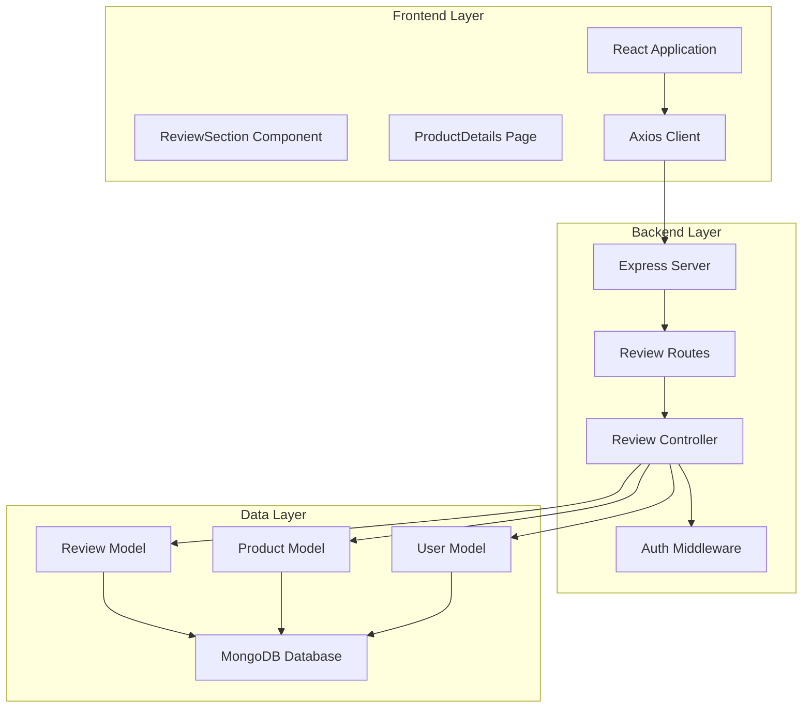
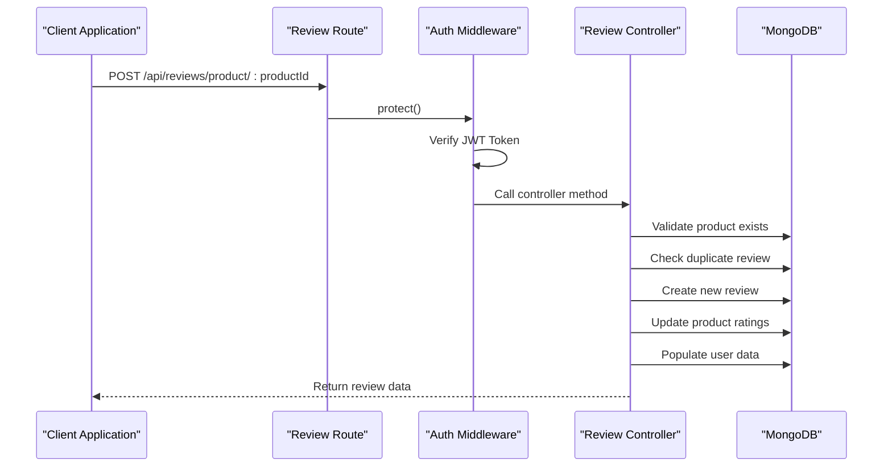
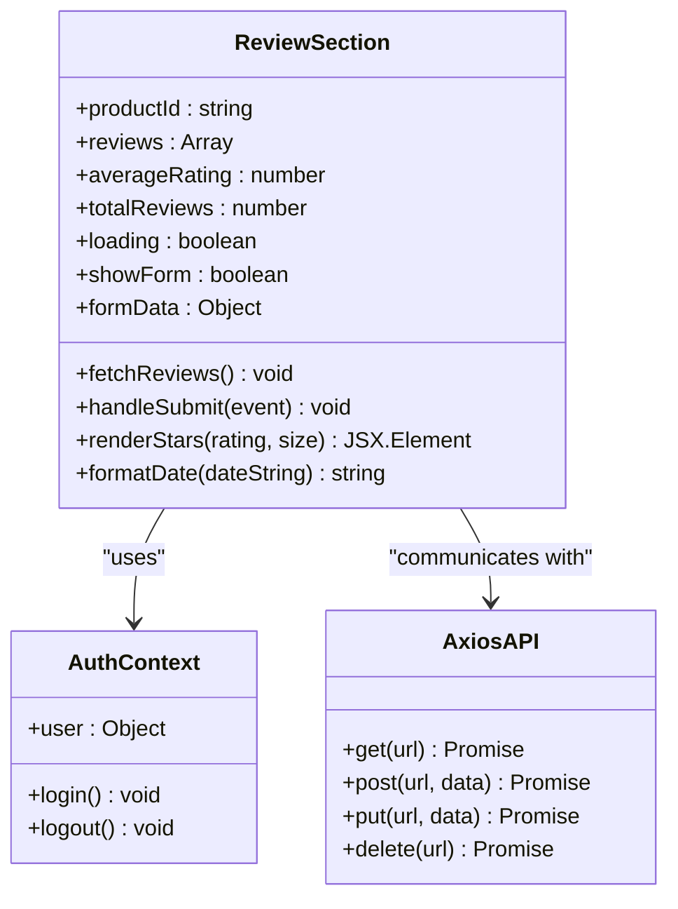
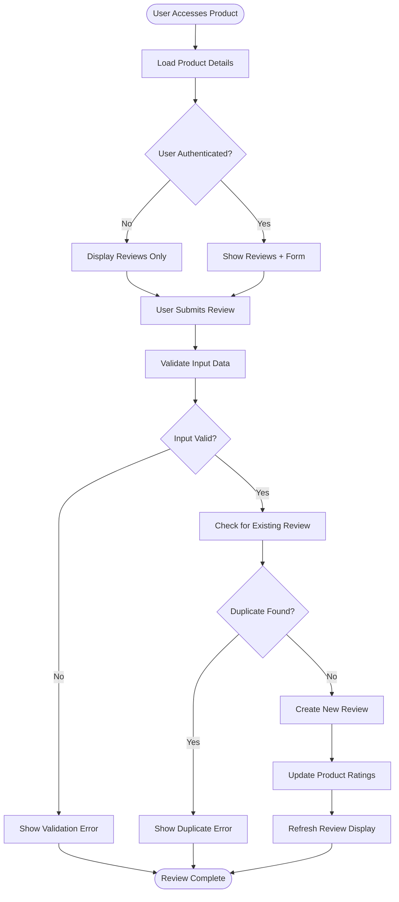
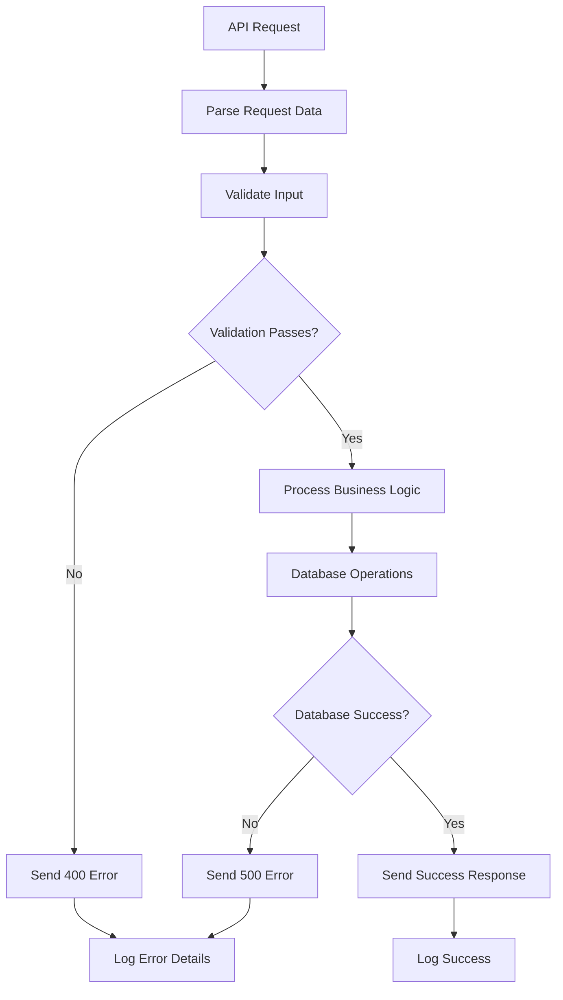

# Customer Review System

<cite>
**Referenced Files in This Document**
- [Review.js](file://backend/models/Review.js)
- [reviewController.js](file://backend/controllers/reviewController.js)
- [reviewRoutes.js](file://backend/routes/reviewRoutes.js)
- [ReviewSection.jsx](file://frontend/src/components/ReviewSection.jsx)
- [ProductDetails.jsx](file://frontend/src/pages/ProductDetails.jsx)
- [authMiddleware.js](file://backend/middleware/authMiddleware.js)
- [server.js](file://backend/server.js)
- [axios.js](file://frontend/src/api/axios.js)
- [db.js](file://backend/config/db.js)
</cite>

## Table of Contents
1. [Introduction](#introduction)
2. [System Architecture](#system-architecture)
3. [Core Components](#core-components)
4. [Review Data Model](#review-data-model)
5. [Backend API Endpoints](#backend-api-endpoints)
6. [Frontend Integration](#frontend-integration)
7. [Authentication and Authorization](#authentication-and-authorization)
8. [Data Flow Analysis](#data-flow-analysis)
9. [Performance Considerations](#performance-considerations)
10. [Error Handling](#error-handling)
11. [Security Implementation](#security-implementation)
12. [Conclusion](#conclusion)

## Introduction

The Customer Review System is a comprehensive feature within an e-commerce platform that enables customers to provide feedback and ratings for products. This system facilitates user-generated content, enhances product discoverability through social proof, and provides valuable insights for both customers and administrators. The implementation follows modern web development practices with a React frontend and Node.js/Express backend, utilizing MongoDB for data persistence.

The system supports full CRUD operations for reviews, includes robust validation mechanisms, implements proper authentication and authorization controls, and maintains product rating statistics. It provides an intuitive user interface for customers to view existing reviews, submit new reviews, and manage their own review content.

## System Architecture

The review system follows a client-server architecture with clear separation of concerns between frontend presentation and backend business logic.



**Diagram sources**
- [server.js:72-81](file://backend/server.js#L72-L81)
- [reviewRoutes.js:10-20](file://backend/routes/reviewRoutes.js#L10-L20)
- [reviewController.js:1-150](file://backend/controllers/reviewController.js#L1-L150)

The architecture ensures scalability, maintainability, and clear data flow between components. The frontend handles user interactions and displays review data, while the backend manages business logic, data validation, and persistence.

## Core Components

### Backend Components

The backend implements a three-layer architecture pattern:

1. **Route Handlers**: Define API endpoints and request routing
2. **Controllers**: Contain business logic and coordinate between models
3. **Models**: Define data structures and database interactions

### Frontend Components

The frontend consists of two primary components:

1. **ReviewSection Component**: Handles review display, submission, and user interactions
2. **ProductDetails Page**: Integrates reviews into the product viewing experience

**Section sources**
- [reviewController.js:1-150](file://backend/controllers/reviewController.js#L1-L150)
- [ReviewSection.jsx:1-216](file://frontend/src/components/ReviewSection.jsx#L1-L216)

## Review Data Model

The review system utilizes a well-structured MongoDB schema with proper indexing and validation:

```mermaid
erDiagram
REVIEW {
ObjectId _id PK
ObjectId product FK
ObjectId user FK
Number rating
String comment
Date createdAt
Date updatedAt
}
PRODUCT {
ObjectId _id PK
String name
Number price
Number rating
Number numReviews
Date createdAt
Date updatedAt
}
USER {
ObjectId _id PK
String name
String email
String role
}
REVIEW ||-->> PRODUCT : "belongs to"
REVIEW ||-->> USER : "created by"
```

**Diagram sources**
- [Review.js:3-32](file://backend/models/Review.js#L3-L32)
- [Product.js:3-12](file://backend/models/Product.js#L3-L12)

Key features of the data model:
- **Unique Constraint**: Prevents duplicate reviews from the same user for the same product
- **Reference Integrity**: Links reviews to both products and users
- **Validation**: Enforces rating bounds (1-5 stars) and required fields
- **Timestamps**: Automatic creation and modification tracking

**Section sources**
- [Review.js:1-33](file://backend/models/Review.js#L1-L33)

## Backend API Endpoints

The review system exposes four primary RESTful endpoints:

| Method | Endpoint | Authentication | Purpose |
|--------|----------|----------------|---------|
| GET | `/api/reviews/product/:productId` | None | Retrieve all reviews for a product |
| POST | `/api/reviews/product/:productId` | JWT Required | Create a new review |
| PUT | `/api/reviews/:reviewId` | JWT Required | Update an existing review |
| DELETE | `/api/reviews/:reviewId` | JWT Required | Delete a review |

### Endpoint Security Implementation



**Diagram sources**
- [reviewRoutes.js:15-18](file://backend/routes/reviewRoutes.js#L15-L18)
- [authMiddleware.js:4-15](file://backend/middleware/authMiddleware.js#L4-L15)
- [reviewController.js:28-72](file://backend/controllers/reviewController.js#L28-L72)

**Section sources**
- [reviewRoutes.js:1-21](file://backend/routes/reviewRoutes.js#L1-L21)
- [reviewController.js:1-150](file://backend/controllers/reviewController.js#L1-L150)

## Frontend Integration

### ReviewSection Component Architecture

The frontend implements a comprehensive review interface with the following features:



**Diagram sources**
- [ReviewSection.jsx:6-216](file://frontend/src/components/ReviewSection.jsx#L6-L216)

### User Interaction Flow

The frontend provides an intuitive user experience with the following interaction patterns:

1. **Review Display**: Shows product ratings, review count, and individual customer reviews
2. **Review Submission**: Provides star rating selection and comment input
3. **Real-time Updates**: Automatically refreshes review data after submissions
4. **Form Validation**: Validates user input before submission attempts

**Section sources**
- [ReviewSection.jsx:17-98](file://frontend/src/components/ReviewSection.jsx#L17-L98)
- [ProductDetails.jsx:182-183](file://frontend/src/pages/ProductDetails.jsx#L182-L183)

## Authentication and Authorization

The review system implements layered security controls:

### JWT Authentication
- Token verification middleware validates user identity
- Automatic token extraction from Authorization headers
- Protected routes require valid authentication

### Authorization Controls
- **Review Creation**: Requires authenticated users
- **Review Modification**: Restricted to review owners or administrators
- **Review Deletion**: Owners can delete own reviews, admins have broader permissions

### Security Features
- Duplicate review prevention prevents spam and abuse
- Input sanitization and validation prevent data corruption
- Role-based access control ensures appropriate permissions

**Section sources**
- [authMiddleware.js:1-20](file://backend/middleware/authMiddleware.js#L1-L20)
- [reviewController.js:40-48](file://backend/controllers/reviewController.js#L40-L48)
- [reviewController.js:86-89](file://backend/controllers/reviewController.js#L86-L89)
- [reviewController.js:123-126](file://backend/controllers/reviewController.js#L123-L126)

## Data Flow Analysis

### Complete Review Lifecycle



**Diagram sources**
- [ReviewSection.jsx:34-59](file://frontend/src/components/ReviewSection.jsx#L34-L59)
- [reviewController.js:28-72](file://backend/controllers/reviewController.js#L28-L72)

### Database Operations

The system performs efficient database operations with proper indexing:

1. **Review Retrieval**: Uses product ID with sorted timestamp ordering
2. **Duplicate Prevention**: Leverages unique compound index on product-user pairs
3. **Rating Calculation**: Aggregates all product reviews for average calculation
4. **User Population**: Efficiently joins user data for display

**Section sources**
- [Review.js:29-30](file://backend/models/Review.js#L29-L30)
- [reviewController.js:9-11](file://backend/controllers/reviewController.js#L9-L11)
- [reviewController.js:57-64](file://backend/controllers/reviewController.js#L57-L64)

## Performance Considerations

### Database Optimization
- **Compound Index**: Unique index on product-user pair prevents duplicates efficiently
- **Query Optimization**: Product-based queries with timestamp sorting
- **Population Strategy**: Selective field population reduces payload size

### Frontend Performance
- **Loading States**: Proper loading indicators improve perceived performance
- **Conditional Rendering**: Only renders review form when user is authenticated
- **Efficient Updates**: Single API call refreshes entire review section

### Scalability Factors
- **Modular Design**: Clear separation allows independent scaling
- **Caching Opportunities**: Potential for Redis caching of popular product reviews
- **Pagination Support**: Can be added for products with very high review volumes

## Error Handling

### Backend Error Management
The system implements comprehensive error handling:



**Diagram sources**
- [reviewController.js:23-25](file://backend/controllers/reviewController.js#L23-L25)
- [reviewController.js:69-71](file://backend/controllers/reviewController.js#L69-L71)

### Frontend Error Handling
- **Toast Notifications**: User-friendly error messaging
- **Form Validation**: Real-time input validation
- **Network Error Handling**: Graceful degradation for connectivity issues

**Section sources**
- [ReviewSection.jsx:27-28](file://frontend/src/components/ReviewSection.jsx#L27-L28)
- [ReviewSection.jsx:54-55](file://frontend/src/components/ReviewSection.jsx#L54-L55)

## Security Implementation

### Input Validation
- **Server-side Validation**: Comprehensive validation in controllers
- **Client-side Validation**: Immediate user feedback
- **Data Sanitization**: Prevents injection attacks and data corruption

### Access Control
- **Role-based Permissions**: Admin privileges for moderation
- **Ownership Verification**: Ensures users can only modify their own reviews
- **Rate Limiting**: Can be implemented to prevent spam

### Data Protection
- **Token-based Authentication**: Secure session management
- **HTTPS Enforcement**: Production-ready CORS configuration
- **Sensitive Data Handling**: Passwords and tokens never leave secure contexts

**Section sources**
- [authMiddleware.js:17-20](file://backend/middleware/authMiddleware.js#L17-L20)
- [reviewController.js:86-89](file://backend/controllers/reviewController.js#L86-L89)

## Conclusion

The Customer Review System represents a robust, scalable solution for e-commerce platforms seeking to implement user-generated content. The system successfully balances functionality with security, providing:

### Key Strengths
- **Comprehensive Feature Set**: Full CRUD operations with proper validation
- **User Experience**: Intuitive interface with real-time updates
- **Security**: Multi-layered authentication and authorization
- **Performance**: Optimized database queries and efficient data flow
- **Maintainability**: Clean architecture with clear separation of concerns

### Technical Achievements
- **Scalable Architecture**: Modular design supports future enhancements
- **Production Ready**: Robust error handling and security measures
- **Developer Friendly**: Clear API contracts and comprehensive documentation
- **User Focused**: Thoughtful interface design with accessibility considerations

### Future Enhancement Opportunities
- **Advanced Filtering**: Sort reviews by helpfulness, recency, or rating
- **Media Support**: Image/video attachments to reviews
- **Review Moderation**: Admin approval workflows for content
- **Analytics Integration**: Review sentiment analysis and insights
- **Mobile Optimization**: Enhanced mobile experience and offline support

The system provides a solid foundation for building customer trust, improving product discoverability, and fostering community engagement around e-commerce products.