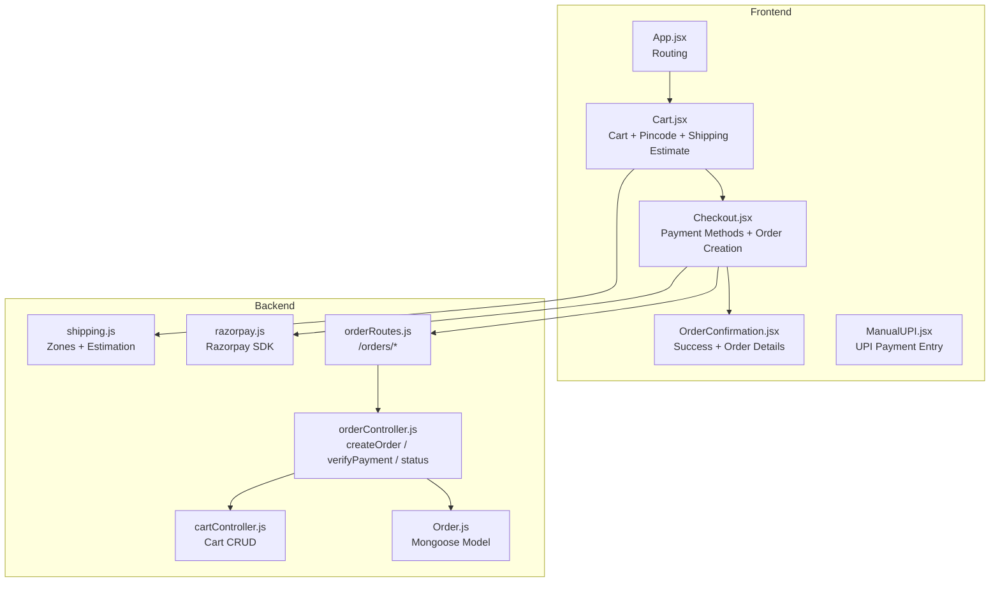
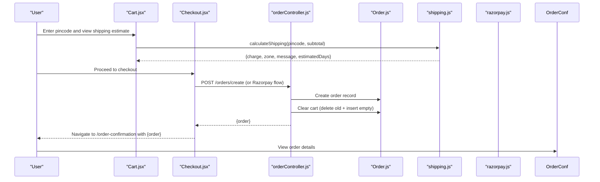
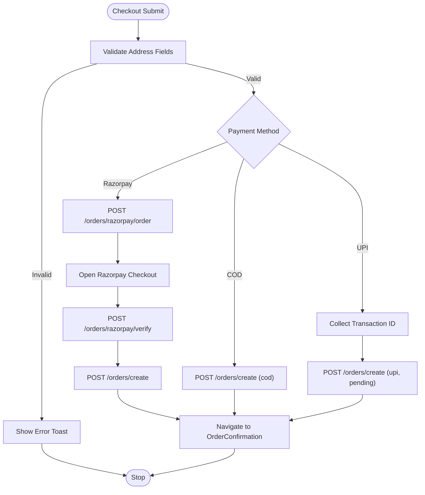
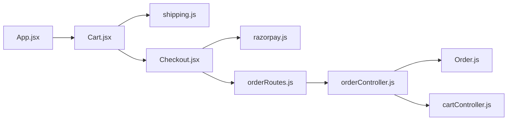

# Order Confirmation & Completion

<cite>
**Referenced Files in This Document**
- [OrderConfirmation.jsx](file://frontend/src/pages/OrderConfirmation.jsx)
- [Checkout.jsx](file://frontend/src/pages/Checkout.jsx)
- [Cart.jsx](file://frontend/src/pages/Cart.jsx)
- [App.jsx](file://frontend/src/App.jsx)
- [ManualUPI.jsx](file://frontend/src/components/ManualUPI.jsx)
- [orderController.js](file://backend/controllers/orderController.js)
- [orderRoutes.js](file://backend/routes/orderRoutes.js)
- [Order.js](file://backend/models/Order.js)
- [shipping.js](file://backend/config/shipping.js)
- [cartController.js](file://backend/controllers/cartController.js)
- [razorpay.js](file://backend/utils/razorpay.js)
</cite>

## Table of Contents
1. [Introduction](#introduction)
2. [Project Structure](#project-structure)
3. [Core Components](#core-components)
4. [Architecture Overview](#architecture-overview)
5. [Detailed Component Analysis](#detailed-component-analysis)
6. [Dependency Analysis](#dependency-analysis)
7. [Performance Considerations](#performance-considerations)
8. [Troubleshooting Guide](#troubleshooting-guide)
9. [Conclusion](#conclusion)

## Introduction
This document explains the end-to-end order confirmation and completion flow in the application. It covers how the OrderConfirmation page displays order details, how order IDs are generated and formatted, how the order summary appears (items, shipping, payments), how the cart is reset after placing an order, and how order status and delivery estimates are presented. It also documents user experience patterns for post-purchase actions, customer support touchpoints, and the integration points with the order management system and payment providers.

## Project Structure
The order completion flow spans frontend pages and backend controllers/routing. The frontend routes include Cart, Checkout, and OrderConfirmation. The backend exposes order creation, Razorpay integration, and order retrieval endpoints. Shipping calculation logic is centralized in a configuration module.

**Diagram sources**
- [App.jsx](file://frontend/src/App.jsx)
- [Cart.jsx](file://frontend/src/pages/Cart.jsx)
- [Checkout.jsx](file://frontend/src/pages/Checkout.jsx)
- [OrderConfirmation.jsx](file://frontend/src/pages/OrderConfirmation.jsx)
- [ManualUPI.jsx](file://frontend/src/components/ManualUPI.jsx)
- [orderRoutes.js](file://backend/routes/orderRoutes.js)
- [orderController.js](file://backend/controllers/orderController.js)
- [Order.js](file://backend/models/Order.js)
- [shipping.js](file://backend/config/shipping.js)
- [cartController.js](file://backend/controllers/cartController.js)
- [razorpay.js](file://backend/utils/razorpay.js)

**Section sources**
- [App.jsx](file://frontend/src/App.jsx)
- [Cart.jsx](file://frontend/src/pages/Cart.jsx)
- [Checkout.jsx](file://frontend/src/pages/Checkout.jsx)
- [OrderConfirmation.jsx](file://frontend/src/pages/OrderConfirmation.jsx)
- [orderRoutes.js](file://backend/routes/orderRoutes.js)
- [orderController.js](file://backend/controllers/orderController.js)
- [Order.js](file://backend/models/Order.js)
- [shipping.js](file://backend/config/shipping.js)
- [cartController.js](file://backend/controllers/cartController.js)
- [razorpay.js](file://backend/utils/razorpay.js)

## Core Components
- OrderConfirmation page renders order metadata, shipping address, and navigation actions.
- Checkout page collects shipping address, displays order summary, and handles multiple payment methods (Razorpay, UPI, Cash on Delivery).
- Backend order controller creates orders, integrates with Razorpay, and updates order status.
- Shipping configuration computes zone, charges, and delivery estimates based on pincode.
- Cart is cleared upon successful order placement.

**Section sources**
- [OrderConfirmation.jsx](file://frontend/src/pages/OrderConfirmation.jsx)
- [Checkout.jsx](file://frontend/src/pages/Checkout.jsx)
- [orderController.js](file://backend/controllers/orderController.js)
- [shipping.js](file://backend/config/shipping.js)
- [cartController.js](file://backend/controllers/cartController.js)

## Architecture Overview
The flow begins on the Cart page where the customer enters a pincode to compute shipping. They proceed to Checkout, select a payment method, and submit the order. Depending on the method, the backend either records the order immediately or verifies payment via Razorpay. After successful order creation, the frontend navigates to OrderConfirmation, displaying order details and next steps.

**Diagram sources**
- [Cart.jsx](file://frontend/src/pages/Cart.jsx)
- [Checkout.jsx](file://frontend/src/pages/Checkout.jsx)
- [orderController.js](file://backend/controllers/orderController.js)
- [Order.js](file://backend/models/Order.js)
- [shipping.js](file://backend/config/shipping.js)
- [razorpay.js](file://backend/utils/razorpay.js)

## Detailed Component Analysis

### OrderConfirmation Page
- Purpose: Display order success, order ID, totals, payment/order statuses, and shipping address. Provide quick links to continue shopping and view orders.
- Data display:
  - Order ID: shown as a monospace identifier.
  - Total amount: formatted to two decimal places.
  - Payment status and order status: styled badges with semantic colors.
  - Shipping address: full address block with city/state/pincode/country.
- Navigation:
  - Continue Shopping: routes to home.
  - View Orders: routes to cart (intended as a placeholder; user order history is fetched via API elsewhere).
- Edge case: If no order data is present in location state, shows a friendly “Order Not Found” message with a link to shop.

**Section sources**
- [OrderConfirmation.jsx](file://frontend/src/pages/OrderConfirmation.jsx)

### Checkout Page and Payment Methods
- Address collection: Full name, phone, street, city, state, pincode, country. Validation ensures required fields and a minimum phone length.
- Order summary:
  - Shows shipping zone and message.
  - Displays subtotal, shipping cost (free or charged), and total.
- Payment options:
  - Razorpay: Creates a remote order, opens the Razorpay checkout, verifies payment server-side, then creates the order.
  - Cash on Delivery (COD): Submits order with pending payment and order status.
  - UPI (Manual): Collects UPI transaction ID, sets payment status to pending, and creates the order.
- Navigation:
  - On success, navigates to OrderConfirmation with the created order object in state.

**Diagram sources**
- [Checkout.jsx](file://frontend/src/pages/Checkout.jsx)
- [orderRoutes.js](file://backend/routes/orderRoutes.js)
- [orderController.js](file://backend/controllers/orderController.js)
- [razorpay.js](file://backend/utils/razorpay.js)

**Section sources**
- [Checkout.jsx](file://frontend/src/pages/Checkout.jsx)
- [orderRoutes.js](file://backend/routes/orderRoutes.js)
- [orderController.js](file://backend/controllers/orderController.js)
- [razorpay.js](file://backend/utils/razorpay.js)

### Order Model and Status Management
- Fields include items, pricing breakdown (subtotal, shippingCharge, totalPrice), shippingAddress, shippingZone, deliveryPincode, payment details (paymentStatus, paymentMethod, paymentId, razorpayOrderId), and orderStatus.
- Order status lifecycle:
  - COD: orderStatus starts as Pending; paymentStatus remains pending until later action.
  - Razorpay: orderStatus set to Confirmed when payment is verified.
  - Manual UPI: orderStatus starts as Pending; requires admin verification.

**Section sources**
- [Order.js](file://backend/models/Order.js)
- [orderController.js](file://backend/controllers/orderController.js)

### Cart Reset After Order Placement
- After successful order creation, the backend deletes the previous cart and re-creates an empty cart for the user, ensuring the cart is fresh for future purchases.

**Section sources**
- [orderController.js](file://backend/controllers/orderController.js)
- [cartController.js](file://backend/controllers/cartController.js)

### Shipping Estimation and Delivery Indicators
- Shipping zones are computed based on pincode:
  - Local (Hyderabad core), State (Telangana/Andhra Pradesh), National (rest of India).
- Thresholds and charges define whether shipping is free and the estimated delivery window.
- The frontend surfaces the zone name, message, and estimated days during checkout and order confirmation.

**Section sources**
- [shipping.js](file://backend/config/shipping.js)
- [Cart.jsx](file://frontend/src/pages/Cart.jsx)
- [Checkout.jsx](file://frontend/src/pages/Checkout.jsx)
- [OrderConfirmation.jsx](file://frontend/src/pages/OrderConfirmation.jsx)

### Post-Purchase UX and Next Steps
- OrderConfirmation provides:
  - Clear success messaging and icon.
  - Order ID and totals.
  - Payment and order status badges.
  - Shipping address display.
  - Two primary actions: Continue Shopping and View Orders.
- Customer support:
  - ManualUPI component offers a WhatsApp link for UPI-related assistance.
  - Checkout and UPI flows include contextual help and notes.

**Section sources**
- [OrderConfirmation.jsx](file://frontend/src/pages/OrderConfirmation.jsx)
- [ManualUPI.jsx](file://frontend/src/components/ManualUPI.jsx)
- [Checkout.jsx](file://frontend/src/pages/Checkout.jsx)

### Order History Tracking
- Users can retrieve their orders via the backend endpoint that lists orders for the authenticated user.
- The admin panel displays order history with filters and status updates.

**Section sources**
- [orderRoutes.js](file://backend/routes/orderRoutes.js)
- [orderController.js](file://backend/controllers/orderController.js)

### Email Confirmation and Order Management Integration
- The codebase does not include explicit email confirmation handlers or order history email triggers. The backend focuses on order creation, Razorpay verification, and status updates. No email service integration is visible in the repository snapshot.

**Section sources**
- [orderController.js](file://backend/controllers/orderController.js)
- [orderRoutes.js](file://backend/routes/orderRoutes.js)

## Dependency Analysis
- Frontend routing depends on React Router and exposes routes for Cart, Checkout, and OrderConfirmation.
- Checkout depends on:
  - Cart data and shipping computation.
  - Payment provider integrations (Razorpay SDK and ManualUPI component).
- Backend controllers depend on:
  - Mongoose models (Order, Cart).
  - Razorpay SDK for payment verification.
  - Shipping configuration for zone and delivery estimates.

**Diagram sources**
- [App.jsx](file://frontend/src/App.jsx)
- [Cart.jsx](file://frontend/src/pages/Cart.jsx)
- [Checkout.jsx](file://frontend/src/pages/Checkout.jsx)
- [orderRoutes.js](file://backend/routes/orderRoutes.js)
- [orderController.js](file://backend/controllers/orderController.js)
- [Order.js](file://backend/models/Order.js)
- [shipping.js](file://backend/config/shipping.js)
- [cartController.js](file://backend/controllers/cartController.js)
- [razorpay.js](file://backend/utils/razorpay.js)

**Section sources**
- [App.jsx](file://frontend/src/App.jsx)
- [orderRoutes.js](file://backend/routes/orderRoutes.js)
- [orderController.js](file://backend/controllers/orderController.js)
- [Order.js](file://backend/models/Order.js)
- [shipping.js](file://backend/config/shipping.js)
- [cartController.js](file://backend/controllers/cartController.js)
- [razorpay.js](file://backend/utils/razorpay.js)

## Performance Considerations
- Minimize redundant network requests by computing shipping locally on the frontend after pincode input.
- Cache shipping estimates per session to avoid repeated backend calls.
- Keep order payloads lean; only transmit necessary fields (shippingAddress, totals, payment metadata).
- Use optimistic UI for cart operations and revert on failure to maintain responsiveness.

## Troubleshooting Guide
- Order not found on confirmation page:
  - Cause: Missing order object in location state.
  - Resolution: Ensure navigation passes { order } in state from Checkout.
- Payment failures:
  - Razorpay verification failure: Check signature validation and server logs.
  - COD/UPI errors: Validate address fields and transaction ID presence.
- Cart not resetting:
  - Verify backend order creation clears the cart after order creation.
- Shipping estimate issues:
  - Confirm pincode length and numeric format.
  - Validate thresholds and zone mappings.

**Section sources**
- [OrderConfirmation.jsx](file://frontend/src/pages/OrderConfirmation.jsx)
- [Checkout.jsx](file://frontend/src/pages/Checkout.jsx)
- [orderController.js](file://backend/controllers/orderController.js)
- [cartController.js](file://backend/controllers/cartController.js)
- [shipping.js](file://backend/config/shipping.js)

## Conclusion
The order confirmation and completion flow integrates frontend UX with backend order management and payment processing. The OrderConfirmation page provides a clear summary and next steps, while Checkout centralizes payment selection and order submission. Shipping estimation and cart reset enhance the user experience. While the backend supports order creation, Razorpay verification, and status updates, email confirmation and order history emails are not implemented in the current codebase.