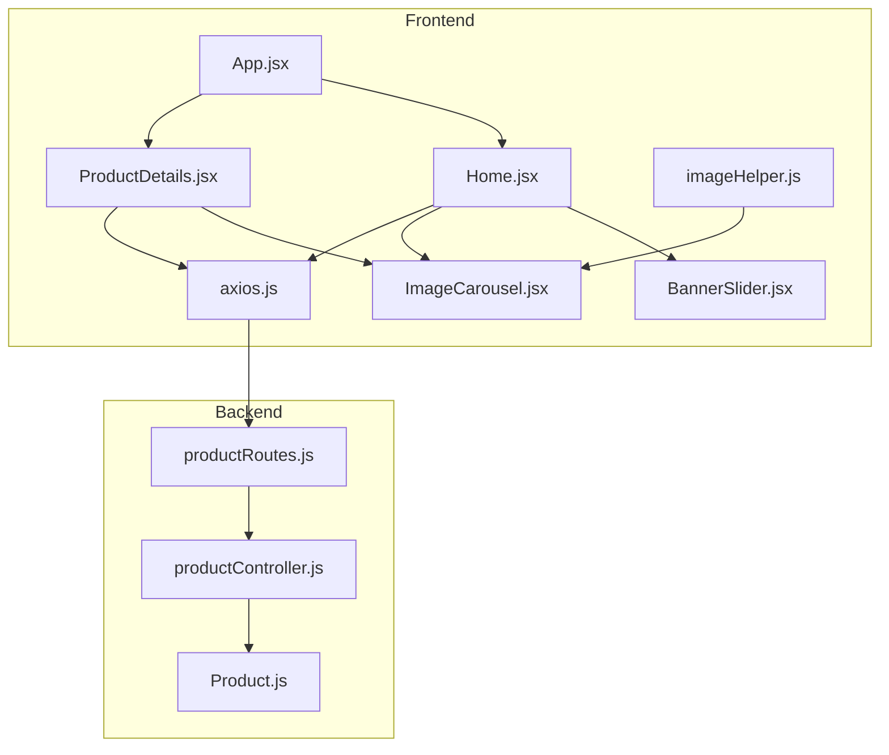
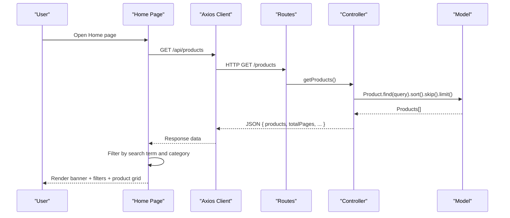
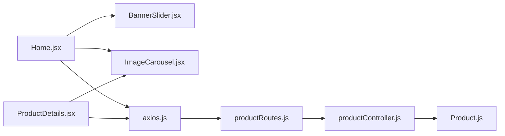

# Product Browsing & Discovery

<cite>
**Referenced Files in This Document**
- [Home.jsx](file://frontend/src/pages/Home.jsx)
- [ProductCard.jsx](file://frontend/src/components/ProductCard.jsx)
- [BannerSlider.jsx](file://frontend/src/components/BannerSlider.jsx)
- [ImageCarousel.jsx](file://frontend/src/components/ImageCarousel.jsx)
- [productController.js](file://backend/controllers/productController.js)
- [productRoutes.js](file://backend/routes/productRoutes.js)
- [Product.js](file://backend/models/Product.js)
- [axios.js](file://frontend/src/api/axios.js)
- [imageHelper.js](file://frontend/src/utils/imageHelper.js)
- [App.jsx](file://frontend/src/App.jsx)
- [ProductDetails.jsx](file://frontend/src/pages/ProductDetails.jsx)
- [index.css](file://frontend/src/index.css)
- [tailwind.config.js](file://frontend/tailwind.config.js)
- [postcss.config.js](file://frontend/postcss.config.js)
</cite>

## Table of Contents
1. [Introduction](#introduction)
2. [Project Structure](#project-structure)
3. [Core Components](#core-components)
4. [Architecture Overview](#architecture-overview)
5. [Detailed Component Analysis](#detailed-component-analysis)
6. [Dependency Analysis](#dependency-analysis)
7. [Performance Considerations](#performance-considerations)
8. [Troubleshooting Guide](#troubleshooting-guide)
9. [Conclusion](#conclusion)
10. [Appendices](#appendices)

## Introduction
This document explains the product browsing and discovery functionality implemented in the application. It covers the Home page’s product listing, search, and category filtering; the search bar’s real-time filtering behavior; the category filtering system; the product card layout including image carousel and interactive elements; and the banner slider for promotional content. It also documents responsive design and mobile-first considerations, performance optimization strategies, and user experience patterns for product discovery and navigation.

## Project Structure
The product browsing experience spans the frontend React application and the backend API:
- Frontend pages and components handle UI, state, and user interactions.
- Backend routes and controllers manage product data retrieval and filtering.
- Tailwind CSS provides responsive styling and mobile-first design.

**Diagram sources**
- [App.jsx:19-66](file://frontend/src/App.jsx#L19-L66)
- [Home.jsx:1-108](file://frontend/src/pages/Home.jsx#L1-L108)
- [ProductDetails.jsx:1-80](file://frontend/src/pages/ProductDetails.jsx#L1-L80)
- [BannerSlider.jsx:1-153](file://frontend/src/components/BannerSlider.jsx#L1-L153)
- [ImageCarousel.jsx:1-54](file://frontend/src/components/ImageCarousel.jsx#L1-L54)
- [axios.js:1-17](file://frontend/src/api/axios.js#L1-L17)
- [imageHelper.js:1-5](file://frontend/src/utils/imageHelper.js#L1-L5)
- [productRoutes.js:1-23](file://backend/routes/productRoutes.js#L1-L23)
- [productController.js:1-127](file://backend/controllers/productController.js#L1-L127)
- [Product.js:1-12](file://backend/models/Product.js#L1-L12)

**Section sources**
- [App.jsx:19-66](file://frontend/src/App.jsx#L19-L66)
- [Home.jsx:1-108](file://frontend/src/pages/Home.jsx#L1-L108)
- [ProductDetails.jsx:1-80](file://frontend/src/pages/ProductDetails.jsx#L1-L80)
- [BannerSlider.jsx:1-153](file://frontend/src/components/BannerSlider.jsx#L1-L153)
- [ImageCarousel.jsx:1-54](file://frontend/src/components/ImageCarousel.jsx#L1-L54)
- [axios.js:1-17](file://frontend/src/api/axios.js#L1-L17)
- [imageHelper.js:1-5](file://frontend/src/utils/imageHelper.js#L1-L5)
- [productRoutes.js:1-23](file://backend/routes/productRoutes.js#L1-L23)
- [productController.js:1-127](file://backend/controllers/productController.js#L1-L127)
- [Product.js:1-12](file://backend/models/Product.js#L1-L12)

## Core Components
- Home page: Fetches products, renders banner slider, search input, category filters, and product grid with cards.
- Banner slider: Auto-advancing promotional slides with manual controls and progress indicator.
- Image carousel: Multi-image product preview with navigation and dot indicators.
- Product card: Grid item displaying image, pricing, description, and action buttons.
- Backend product controller: Implements server-side search and category filtering with pagination.

Key implementation references:
- Home page state and filtering logic: [Home.jsx:10-44](file://frontend/src/pages/Home.jsx#L10-L44)
- Banner slider auto-play and navigation: [BannerSlider.jsx:31-62](file://frontend/src/components/BannerSlider.jsx#L31-L62)
- Image carousel navigation and dots: [ImageCarousel.jsx:15-51](file://frontend/src/components/ImageCarousel.jsx#L15-L51)
- Backend search and category filters: [productController.js:4-37](file://backend/controllers/productController.js#L4-L37)

**Section sources**
- [Home.jsx:10-44](file://frontend/src/pages/Home.jsx#L10-L44)
- [BannerSlider.jsx:31-62](file://frontend/src/components/BannerSlider.jsx#L31-L62)
- [ImageCarousel.jsx:15-51](file://frontend/src/components/ImageCarousel.jsx#L15-L51)
- [productController.js:4-37](file://backend/controllers/productController.js#L4-L37)

## Architecture Overview
The product browsing flow connects frontend UI to backend APIs:

**Diagram sources**
- [Home.jsx:19-28](file://frontend/src/pages/Home.jsx#L19-L28)
- [axios.js:1-17](file://frontend/src/api/axios.js#L1-L17)
- [productRoutes.js:14-16](file://backend/routes/productRoutes.js#L14-L16)
- [productController.js:4-37](file://backend/controllers/productController.js#L4-L37)
- [Product.js:1-12](file://backend/models/Product.js#L1-L12)

## Detailed Component Analysis

### Home Page: Product Listing, Search, and Category Filtering
- State management: Maintains products, loading state, search term, and selected category.
- Fetching: On mount, retrieves all products from the backend.
- Filtering: Real-time client-side filtering combining search term and category selection.
- Rendering: Displays a banner slider, search input, horizontal category chips, and a responsive grid of product cards.

Filtering logic:
- Search term matches product name or description (case-insensitive substring).
- Category filter matches either “all” or exact category equality (case-insensitive).

Responsive grid: Uses Tailwind grid classes to adapt from 1 column on small screens to 3 columns on large screens.

Interactive elements:
- Add to Cart button triggers a cart endpoint call.
- View Details links to the product details page.

**Section sources**
- [Home.jsx:7-108](file://frontend/src/pages/Home.jsx#L7-L108)
- [axios.js:1-17](file://frontend/src/api/axios.js#L1-L17)
- [App.jsx:48-57](file://frontend/src/App.jsx#L48-L57)

### Search Bar Implementation and Real-Time Filtering
- Controlled input: The search term is stored in component state and updates on change.
- Real-time filtering: The filtered product list recomputes on every keystroke by checking name and description.
- Case-insensitive matching: Converts both search term and product fields to lowercase before comparison.

Performance note: Client-side filtering is efficient for moderate product counts. For larger datasets, consider moving filtering to the backend with query parameters.

**Section sources**
- [Home.jsx:10-44](file://frontend/src/pages/Home.jsx#L10-L44)

### Category Filtering System
- Predefined categories: “all”, “electronics”, “clothing”, “men”, “women”, “accessories”, “home”.
- Horizontal chip-style UI: Buttons render category names with active state styling.
- Selection logic: When a category is selected, the filter applies to the product list.

**Section sources**
- [Home.jsx:13](file://frontend/src/pages/Home.jsx#L13)
- [Home.jsx:62-76](file://frontend/src/pages/Home.jsx#L62-L76)

### Product Card Layout and Interactive Elements
- Image carousel: Displays multiple product images with navigation arrows and dot indicators.
- Pricing display: Shows formatted price in a prominent badge.
- Description and title: Truncated and clamped for readability.
- Action buttons: “View Details” navigates to product details; “Add to Cart” triggers a cart API call.

Hover and focus effects: Cards elevate and lift on hover; inputs receive focus rings and transitions.

**Section sources**
- [Home.jsx:78-97](file://frontend/src/pages/Home.jsx#L78-L97)
- [ImageCarousel.jsx:15-51](file://frontend/src/components/ImageCarousel.jsx#L15-L51)
- [imageHelper.js:1-5](file://frontend/src/utils/imageHelper.js#L1-L5)

### Banner Slider Component
- Auto-play: Rotates slides every 5 seconds while the mouse is not hovering.
- Manual controls: Previous/next buttons and dot indicators allow user control.
- Progress indicator: A colored bar shows current position.
- Content overlay: Gradient overlay with heading, subtitle, and call-to-action link.

Behavior:
- Auto-play pauses on hover and resumes after a delay.
- Clicking a dot or navigating manually disables auto-play temporarily.

**Section sources**
- [BannerSlider.jsx:31-153](file://frontend/src/components/BannerSlider.jsx#L31-L153)

### Backend Product Controller: Search and Category Filtering
- Query parameters: Supports search, category, page, and limit.
- Search: Uses MongoDB regex with case-insensitive option on name and description.
- Category: Filters by exact category match when provided and not equal to “all”.
- Pagination: Sorts by creation date, skips records, and limits results.

Response shape: Returns products array plus pagination metadata.

**Section sources**
- [productController.js:4-37](file://backend/controllers/productController.js#L4-L37)

### Product Details Page
- Fetches a single product by ID.
- Renders large image carousel, category tag, name, price, description, stock availability, and add-to-cart button.
- Back-to-collection link returns to the Home page.

**Section sources**
- [ProductDetails.jsx:1-80](file://frontend/src/pages/ProductDetails.jsx#L1-L80)

## Dependency Analysis
- Frontend depends on Axios for HTTP requests and Tailwind for responsive styling.
- Home page composes BannerSlider and ImageCarousel components.
- Backend routes expose public endpoints for product listing and details.
- Product model defines the schema used by the controller.

**Diagram sources**
- [Home.jsx:1-108](file://frontend/src/pages/Home.jsx#L1-L108)
- [BannerSlider.jsx:1-153](file://frontend/src/components/BannerSlider.jsx#L1-L153)
- [ImageCarousel.jsx:1-54](file://frontend/src/components/ImageCarousel.jsx#L1-L54)
- [axios.js:1-17](file://frontend/src/api/axios.js#L1-L17)
- [productRoutes.js:1-23](file://backend/routes/productRoutes.js#L1-L23)
- [productController.js:1-127](file://backend/controllers/productController.js#L1-L127)
- [Product.js:1-12](file://backend/models/Product.js#L1-L12)

**Section sources**
- [Home.jsx:1-108](file://frontend/src/pages/Home.jsx#L1-L108)
- [BannerSlider.jsx:1-153](file://frontend/src/components/BannerSlider.jsx#L1-L153)
- [ImageCarousel.jsx:1-54](file://frontend/src/components/ImageCarousel.jsx#L1-L54)
- [axios.js:1-17](file://frontend/src/api/axios.js#L1-L17)
- [productRoutes.js:1-23](file://backend/routes/productRoutes.js#L1-L23)
- [productController.js:1-127](file://backend/controllers/productController.js#L1-L127)
- [Product.js:1-12](file://backend/models/Product.js#L1-L12)

## Performance Considerations
- Client-side filtering: Efficient for small to medium datasets. For large catalogs, move filtering to the backend using query parameters to reduce payload size.
- Image optimization: Use the helper to resolve local or remote image URLs and ensure appropriate image sizes and formats.
- Rendering: Product grid uses Tailwind utilities for responsive layouts; consider virtualization for very large lists.
- Network: Centralized Axios client adds auth headers automatically; ensure API endpoints support pagination and filtering to minimize bandwidth.
- Auto-play banners: Pausing on hover prevents unnecessary animations during user interaction.

[No sources needed since this section provides general guidance]

## Troubleshooting Guide
- No products displayed:
  - Verify the backend endpoint returns products and the frontend fetches correctly.
  - Check network tab for errors and confirm API URL environment variable.
- Search yields no results:
  - Confirm search term matches product name or description (case-insensitive).
  - Consider backend regex search if client-side filtering appears incorrect.
- Category filter not working:
  - Ensure category values match the predefined list and are normalized to lowercase.
- Images not loading:
  - Confirm image URLs are valid and accessible; the helper resolves local paths with the backend host.
- Banner slider not rotating:
  - Check auto-play logic and ensure mouse events pause/resume correctly.

**Section sources**
- [Home.jsx:19-28](file://frontend/src/pages/Home.jsx#L19-L28)
- [axios.js:1-17](file://frontend/src/api/axios.js#L1-L17)
- [imageHelper.js:1-5](file://frontend/src/utils/imageHelper.js#L1-L5)
- [BannerSlider.jsx:36-62](file://frontend/src/components/BannerSlider.jsx#L36-L62)

## Conclusion
The product browsing and discovery system combines a responsive Home page with real-time search and category filtering, a visually engaging banner slider, and robust product cards featuring image carousels. The backend provides scalable filtering and pagination, while the frontend ensures a smooth, mobile-first user experience. For large-scale deployments, consider shifting filtering to the backend and adding virtualization to optimize rendering performance.

[No sources needed since this section summarizes without analyzing specific files]

## Appendices

### Responsive Design and Mobile-First Approach
- Tailwind CSS is configured for responsive breakpoints and utilities.
- Home page grid adapts from single to triple columns based on screen size.
- Inputs and buttons use padding and spacing scales suitable for touch targets.
- Banner slider and carousels include hover-triggered visibility adjustments for mobile.

**Section sources**
- [index.css:1-3](file://frontend/src/index.css#L1-L3)
- [tailwind.config.js:1-6](file://frontend/tailwind.config.js#L1-L6)
- [postcss.config.js:1-6](file://frontend/postcss.config.js#L1-L6)
- [Home.jsx:49-97](file://frontend/src/pages/Home.jsx#L49-L97)
- [BannerSlider.jsx:67-151](file://frontend/src/components/BannerSlider.jsx#L67-L151)
- [ImageCarousel.jsx:15-51](file://frontend/src/components/ImageCarousel.jsx#L15-L51)

### Example Search Algorithms and Filter Logic
- Client-side search: Substring matching against name and description (case-insensitive).
- Category filter: Exact match against normalized category values.
- Backend search: MongoDB regex with case-insensitive options on name and description.

**Section sources**
- [Home.jsx:39-44](file://frontend/src/pages/Home.jsx#L39-L44)
- [productController.js:9-17](file://backend/controllers/productController.js#L9-L17)

### Product Rendering Performance Optimization
- Move filtering to backend with query parameters to reduce payload size.
- Lazy-load images and use appropriate image dimensions.
- Virtualize long lists to limit DOM nodes.
- Debounce search input to avoid frequent re-renders.

[No sources needed since this section provides general guidance]