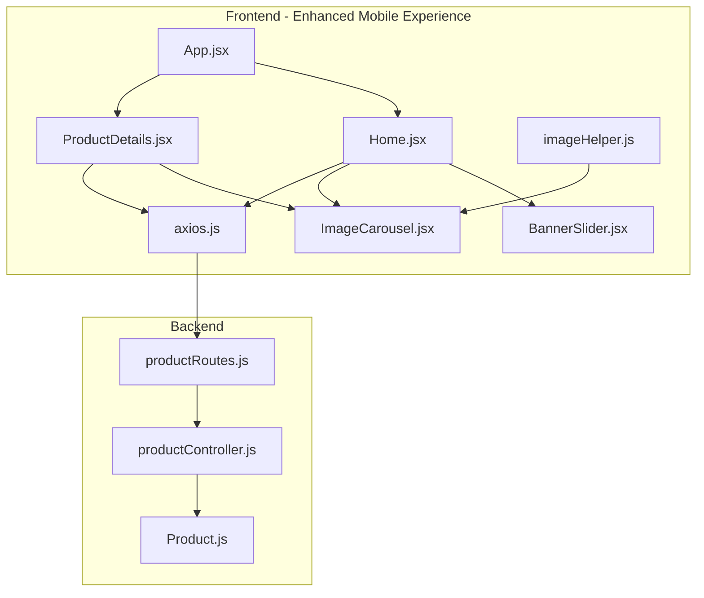
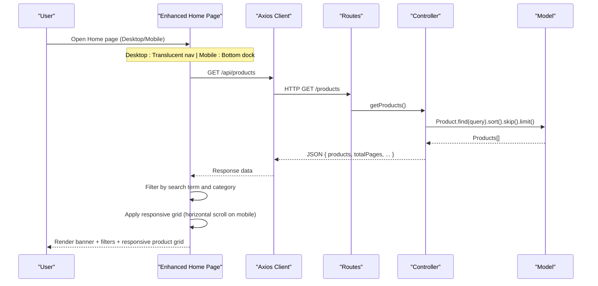
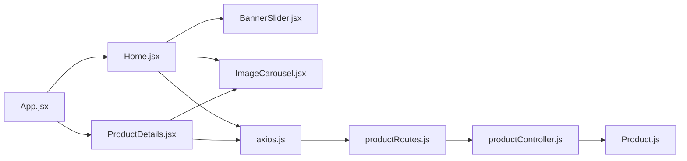

# Product Browsing & Discovery

<cite>
**Referenced Files in This Document**
- [Home.jsx](file://frontend/src/pages/Home.jsx)
- [ProductCard.jsx](file://frontend/src/components/ProductCard.jsx)
- [BannerSlider.jsx](file://frontend/src/components/BannerSlider.jsx)
- [ImageCarousel.jsx](file://frontend/src/components/ImageCarousel.jsx)
- [productController.js](file://backend/controllers/productController.js)
- [productRoutes.js](file://backend/routes/productRoutes.js)
- [Product.js](file://backend/models/Product.js)
- [axios.js](file://frontend/src/api/axios.js)
- [imageHelper.js](file://frontend/src/utils/imageHelper.js)
- [App.jsx](file://frontend/src/App.jsx)
- [ProductDetails.jsx](file://frontend/src/pages/ProductDetails.jsx)
- [index.css](file://frontend/src/index.css)
- [tailwind.config.js](file://frontend/tailwind.config.js)
- [postcss.config.js](file://frontend/postcss.config.js)
</cite>

## Update Summary
**Changes Made**
- Enhanced Home page responsive design with mobile-first horizontal scrolling capabilities
- Updated product grid implementation to feature horizontal scrolling on mobile devices
- Added snap-scrolling behavior for improved mobile user experience
- Maintained responsive grid layout for desktop and tablet screens
- Improved mobile navigation with floating bottom dock and translucent top navigation

## Table of Contents
1. [Introduction](#introduction)
2. [Project Structure](#project-structure)
3. [Core Components](#core-components)
4. [Architecture Overview](#architecture-overview)
5. [Detailed Component Analysis](#detailed-component-analysis)
6. [Mobile-First Responsive Design](#mobile-first-responsive-design)
7. [Dependency Analysis](#dependency-analysis)
8. [Performance Considerations](#performance-considerations)
9. [Troubleshooting Guide](#troubleshooting-guide)
10. [Conclusion](#conclusion)
11. [Appendices](#appendices)

## Introduction
This document explains the product browsing and discovery functionality implemented in the application. It covers the Home page's enhanced mobile-responsive design featuring horizontal scrolling capabilities for product grids on mobile devices while maintaining responsive grid layout on larger screens. The system includes product listing display, search functionality, category filtering, real-time filtering based on product names and descriptions, and category filtering with predefined categories (electronics, clothing, men, women, accessories, home). It also documents the product card layout with image carousel, pricing display, and interactive elements, the banner slider component for promotional content, and comprehensive responsive design considerations with mobile-first approach.

## Project Structure
The product browsing experience spans the frontend React application and the backend API with enhanced mobile responsiveness:
- Frontend pages and components handle UI, state, and user interactions with responsive design patterns.
- Backend routes and controllers manage product data retrieval and filtering.
- Tailwind CSS provides responsive styling and mobile-first design with advanced utility classes.
- Mobile-first approach implemented through floating bottom navigation and horizontal scrolling grids.



**Diagram sources**
- [App.jsx:19-66](file://frontend/src/App.jsx#L19-L66)
- [Home.jsx:1-87](file://frontend/src/pages/Home.jsx#L1-L87)
- [ProductDetails.jsx:1-162](file://frontend/src/pages/ProductDetails.jsx#L1-L162)
- [BannerSlider.jsx:1-154](file://frontend/src/components/BannerSlider.jsx#L1-L154)
- [ImageCarousel.jsx:1-54](file://frontend/src/components/ImageCarousel.jsx#L1-L54)
- [axios.js:1-17](file://frontend/src/api/axios.js#L1-L17)
- [imageHelper.js:1-8](file://frontend/src/utils/imageHelper.js#L1-L8)
- [productRoutes.js:1-23](file://backend/routes/productRoutes.js#L1-L23)
- [productController.js:1-127](file://backend/controllers/productController.js#L1-L127)
- [Product.js:1-12](file://backend/models/Product.js#L1-L12)

**Section sources**
- [App.jsx:19-66](file://frontend/src/App.jsx#L19-L66)
- [Home.jsx:1-87](file://frontend/src/pages/Home.jsx#L1-L87)
- [ProductDetails.jsx:1-162](file://frontend/src/pages/ProductDetails.jsx#L1-L162)
- [BannerSlider.jsx:1-154](file://frontend/src/components/BannerSlider.jsx#L1-L154)
- [ImageCarousel.jsx:1-54](file://frontend/src/components/ImageCarousel.jsx#L1-L54)
- [axios.js:1-17](file://frontend/src/api/axios.js#L1-L17)
- [imageHelper.js:1-8](file://frontend/src/utils/imageHelper.js#L1-L8)
- [productRoutes.js:1-23](file://backend/routes/productRoutes.js#L1-L23)
- [productController.js:1-127](file://backend/controllers/productController.js#L1-L127)
- [Product.js:1-12](file://backend/models/Product.js#L1-L12)

## Core Components
- **Enhanced Home page**: Features mobile-responsive design with horizontal scrolling product grids, translucent top navigation for desktop, and floating bottom dock for mobile.
- **Banner slider**: Auto-advancing promotional slides with manual controls and progress indicator.
- **Image carousel**: Multi-image product preview with navigation and dot indicators.
- **Product card**: Grid item displaying image, pricing, description, and action buttons with hover effects.
- **Backend product controller**: Implements server-side search and category filtering with pagination.

Key implementation references:
- Enhanced Home page responsive grid with horizontal scrolling: [Home.jsx:71-78](file://frontend/src/pages/Home.jsx#L71-L78)
- Mobile-first responsive design patterns: [Home.jsx:55-69](file://frontend/src/pages/Home.jsx#L55-L69)
- Translucent desktop navigation: [App.jsx:56-61](file://frontend/src/App.jsx#L56-L61)
- Floating mobile navigation: [App.jsx:139-201](file://frontend/src/App.jsx#L139-L201)

**Section sources**
- [Home.jsx:71-78](file://frontend/src/pages/Home.jsx#L71-L78)
- [Home.jsx:55-69](file://frontend/src/pages/Home.jsx#L55-L69)
- [App.jsx:56-61](file://frontend/src/App.jsx#L56-L61)
- [App.jsx:139-201](file://frontend/src/App.jsx#L139-L201)

## Architecture Overview
The product browsing flow connects frontend UI to backend APIs with enhanced mobile responsiveness:



**Diagram sources**
- [Home.jsx:19-28](file://frontend/src/pages/Home.jsx#L19-L28)
- [axios.js:1-17](file://frontend/src/api/axios.js#L1-L17)
- [productRoutes.js:14-16](file://backend/routes/productRoutes.js#L14-L16)
- [productController.js:4-37](file://backend/controllers/productController.js#L4-L37)
- [Product.js:1-12](file://backend/models/Product.js#L1-L12)

## Detailed Component Analysis

### Enhanced Home Page: Mobile-Responsive Product Grid and Filtering
- **State management**: Maintains products, loading state, search term, and selected category.
- **Enhanced fetching**: On mount, retrieves all products from the backend.
- **Real-time filtering**: Combines search term and category selection with client-side filtering.
- **Responsive rendering**: Displays banner slider, search input, horizontal category chips, and responsive product grid with horizontal scrolling on mobile.

**Updated** Enhanced with mobile-first responsive design featuring horizontal scrolling product grids.

**Mobile Grid Implementation**:
- Horizontal scrolling container with snap behavior: `md:grid md:grid-cols-2 lg:grid-cols-3`
- Individual product cards with fixed width: `w-[280px] flex-shrink-0`
- Snap scrolling for smooth mobile navigation: `snap-x snap-mandatory md:snap-none`
- Scrollbar hiding for clean appearance: `overflow-x-auto scrollbar-hide`

**Desktop Grid Implementation**:
- Responsive grid layout: `md:grid md:grid-cols-2 lg:grid-cols-3`
- Automatic width adjustment: `md:w-auto`
- Overflow handling for mobile: `md:overflow-visible overflow-x-auto`

**Section sources**
- [Home.jsx:7-87](file://frontend/src/pages/Home.jsx#L7-L87)
- [axios.js:1-17](file://frontend/src/api/axios.js#L1-L17)
- [App.jsx:48-57](file://frontend/src/App.jsx#L48-L57)

### Search Bar Implementation and Real-Time Filtering
- **Controlled input**: The search term is stored in component state and updates on change.
- **Real-time filtering**: The filtered product list recomputes on every keystroke by checking name and description.
- **Case-insensitive matching**: Converts both search term and product fields to lowercase before comparison.

Performance note: Client-side filtering is efficient for moderate product counts. For larger datasets, consider moving filtering to the backend with query parameters.

**Section sources**
- [Home.jsx:10-44](file://frontend/src/pages/Home.jsx#L10-L44)

### Category Filtering System
- **Predefined categories**: "all", "electronics", "clothing", "men", "women", "accessories", "home".
- **Horizontal chip-style UI**: Buttons render category names with active state styling and horizontal scrolling capability.
- **Selection logic**: When a category is selected, the filter applies to the product list.

**Section sources**
- [Home.jsx:13](file://frontend/src/pages/Home.jsx#L13)
- [Home.jsx:62-76](file://frontend/src/pages/Home.jsx#L62-L76)

### Product Card Layout and Interactive Elements
- **Image carousel**: Displays multiple product images with navigation arrows and dot indicators.
- **Pricing display**: Shows formatted price in a prominent badge.
- **Description and title**: Truncated and clamped for readability.
- **Action buttons**: "View Details" navigates to product details; "Add to Cart" triggers a cart API call.
- **Hover effects**: Cards elevate and lift on hover with subtle transitions.

**Section sources**
- [Home.jsx:78-97](file://frontend/src/pages/Home.jsx#L78-L97)
- [ImageCarousel.jsx:15-51](file://frontend/src/components/ImageCarousel.jsx#L15-L51)
- [imageHelper.js:1-8](file://frontend/src/utils/imageHelper.js#L1-L8)

### Banner Slider Component
- **Auto-play**: Rotates slides every 5 seconds while the mouse is not hovering.
- **Manual controls**: Previous/next buttons and dot indicators allow user control.
- **Progress indicator**: A colored bar shows current position.
- **Content overlay**: Gradient overlay with heading, subtitle, and call-to-action link.

Behavior:
- Auto-play pauses on hover and resumes after a delay.
- Clicking a dot or navigating manually disables auto-play temporarily.

**Section sources**
- [BannerSlider.jsx:31-154](file://frontend/src/components/BannerSlider.jsx#L31-L154)

### Backend Product Controller: Search and Category Filtering
- **Query parameters**: Supports search, category, page, and limit.
- **Search**: Uses MongoDB regex with case-insensitive option on name and description.
- **Category**: Filters by exact category match when provided and not equal to "all".
- **Pagination**: Sorts by creation date, skips records, and limits results.

Response shape: Returns products array plus pagination metadata.

**Section sources**
- [productController.js:4-37](file://backend/controllers/productController.js#L4-L37)

### Product Details Page
- **Fetches a single product by ID**.
- **Renders large image carousel, category tag, name, price, description, stock availability, and add-to-cart button**.
- **Back-to-collection link returns to the Home page**.

**Section sources**
- [ProductDetails.jsx:1-162](file://frontend/src/pages/ProductDetails.jsx#L1-L162)

## Mobile-First Responsive Design

### Enhanced Product Grid Implementation
The Home page now features a sophisticated responsive grid system that adapts seamlessly across device sizes:

**Mobile Experience**:
- Horizontal scrolling container with snap behavior for smooth navigation
- Fixed-width product cards (`w-[280px]`) for consistent mobile viewing
- `overflow-x-auto` enables horizontal scrolling
- `scrollbar-hide` removes default scrollbars for clean appearance
- `snap-x snap-mandatory` ensures smooth snapping between products

**Desktop Experience**:
- Responsive grid layout (`md:grid md:grid-cols-2 lg:grid-cols-3`)
- Automatic width adjustment (`md:w-auto`)
- `md:overflow-visible` allows normal grid overflow
- `md:snap-none` disables snap behavior on larger screens

**Implementation Details**:
```html
<div className="md:grid md:grid-cols-2 lg:grid-cols-3 gap-6 md:overflow-visible overflow-x-auto scrollbar-hide -mx-4 px-4 md:mx-0 md:px-0 snap-x snap-mandatory md:snap-none">
  {filteredProducts.map(product => (
    <div key={product._id} className="md:w-auto w-[280px] flex-shrink-0 snap-start">
      <ProductCard product={product} />
    </div>
  ))}
</div>
```

### Advanced Navigation System
The application features a dual-navigation system optimized for different screen sizes:

**Desktop Navigation**:
- Translucent glass-like navigation bar (`bg-slate-950/90 backdrop-blur-xl`)
- Fixed position at the top with smooth scroll effects
- Enhanced visual depth with gradient backgrounds and borders
- Responsive layout with hidden elements on smaller screens

**Mobile Navigation**:
- Floating bottom dock navigation (`fixed bottom-6 left-4 right-4`)
- Glass-like design with backdrop blur effect
- Touch-friendly icon-based interface
- Animated cart counter with bounce effects

**Section sources**
- [Home.jsx:71-78](file://frontend/src/pages/Home.jsx#L71-L78)
- [App.jsx:56-61](file://frontend/src/App.jsx#L56-L61)
- [App.jsx:139-201](file://frontend/src/App.jsx#L139-L201)

### Category Filtering with Horizontal Scrolling
The category filter system has been enhanced for mobile usability:

**Horizontal Chip Implementation**:
- `overflow-x-auto` enables horizontal scrolling
- `pb-4` provides bottom padding for scroll area
- `scrollbar-hide` removes default scrollbars
- `whitespace-nowrap` prevents text wrapping in chips
- Responsive padding and sizing for different devices

**Visual Enhancements**:
- Active state with scaling effect (`scale-105`)
- Smooth transitions for hover states
- Consistent spacing and typography
- Mobile-friendly touch targets

**Section sources**
- [Home.jsx:55-69](file://frontend/src/pages/Home.jsx#L55-L69)

## Dependency Analysis
- Frontend depends on Axios for HTTP requests and Tailwind CSS for responsive styling with advanced utility classes.
- Home page composes BannerSlider and ImageCarousel components with enhanced responsive behavior.
- Backend routes expose public endpoints for product listing and details.
- Product model defines the schema used by the controller.



**Diagram sources**
- [Home.jsx:1-87](file://frontend/src/pages/Home.jsx#L1-L87)
- [BannerSlider.jsx:1-154](file://frontend/src/components/BannerSlider.jsx#L1-L154)
- [ImageCarousel.jsx:1-54](file://frontend/src/components/ImageCarousel.jsx#L1-L54)
- [axios.js:1-17](file://frontend/src/api/axios.js#L1-L17)
- [productRoutes.js:1-23](file://backend/routes/productRoutes.js#L1-L23)
- [productController.js:1-127](file://backend/controllers/productController.js#L1-L127)
- [Product.js:1-12](file://backend/models/Product.js#L1-L12)
- [App.jsx:1-235](file://frontend/src/App.jsx#L1-L235)

**Section sources**
- [Home.jsx:1-87](file://frontend/src/pages/Home.jsx#L1-L87)
- [BannerSlider.jsx:1-154](file://frontend/src/components/BannerSlider.jsx#L1-L154)
- [ImageCarousel.jsx:1-54](file://frontend/src/components/ImageCarousel.jsx#L1-L54)
- [axios.js:1-17](file://frontend/src/api/axios.js#L1-L17)
- [productRoutes.js:1-23](file://backend/routes/productRoutes.js#L1-L23)
- [productController.js:1-127](file://backend/controllers/productController.js#L1-L127)
- [Product.js:1-12](file://backend/models/Product.js#L1-L12)
- [App.jsx:1-235](file://frontend/src/App.jsx#L1-L235)

## Performance Considerations
- **Client-side filtering**: Efficient for small to medium datasets. For large catalogs, consider moving filtering to the backend using query parameters to reduce payload size.
- **Image optimization**: Use the helper to resolve local or remote image URLs and ensure appropriate image sizes and formats.
- **Rendering optimization**: Product grid uses Tailwind utilities for responsive layouts; consider virtualization for very large lists.
- **Mobile performance**: Horizontal scrolling with snap behavior optimized for touch devices; consider lazy loading for images.
- **Network efficiency**: Centralized Axios client adds auth headers automatically; ensure API endpoints support pagination and filtering to minimize bandwidth.
- **Auto-play banners**: Pausing on hover prevents unnecessary animations during user interaction.
- **Responsive design**: Mobile-first approach reduces unnecessary CSS for smaller screens while maintaining desktop functionality.

## Troubleshooting Guide
- **No products displayed**:
  - Verify the backend endpoint returns products and the frontend fetches correctly.
  - Check network tab for errors and confirm API URL environment variable.
- **Search yields no results**:
  - Confirm search term matches product name or description (case-insensitive).
  - Consider backend regex search if client-side filtering appears incorrect.
- **Category filter not working**:
  - Ensure category values match the predefined list and are normalized to lowercase.
- **Images not loading**:
  - Confirm image URLs are valid and accessible; the helper resolves local paths with the backend host.
- **Banner slider not rotating**:
  - Check auto-play logic and ensure mouse events pause/resume correctly.
- **Mobile grid not scrolling**:
  - Verify `overflow-x-auto` and `snap-x` classes are properly applied.
  - Check for CSS conflicts with parent containers.
- **Navigation issues on mobile**:
  - Ensure floating bottom dock is positioned correctly with proper z-index.
  - Verify touch event handlers are functioning on mobile devices.

**Section sources**
- [Home.jsx:19-28](file://frontend/src/pages/Home.jsx#L19-L28)
- [axios.js:1-17](file://frontend/src/api/axios.js#L1-L17)
- [imageHelper.js:1-8](file://frontend/src/utils/imageHelper.js#L1-L8)
- [BannerSlider.jsx:36-62](file://frontend/src/components/BannerSlider.jsx#L36-L62)
- [Home.jsx:71-78](file://frontend/src/pages/Home.jsx#L71-L78)
- [App.jsx:139-201](file://frontend/src/App.jsx#L139-L201)

## Conclusion
The enhanced product browsing and discovery system combines a mobile-first responsive Home page with real-time search and category filtering, a visually engaging banner slider, and robust product cards featuring image carousels. The new horizontal scrolling product grid provides an optimal mobile experience while maintaining responsive grid layout on larger screens. The dual-navigation system (translucent desktop navigation and floating mobile dock) ensures seamless user experience across all devices. The backend provides scalable filtering and pagination, while the frontend ensures smooth, mobile-first user experience with advanced responsive design patterns. For large-scale deployments, consider shifting filtering to the backend and adding virtualization to optimize rendering performance.

## Appendices

### Enhanced Responsive Design and Mobile-First Approach
- **Tailwind CSS configuration**: Configured for responsive breakpoints and advanced utility classes.
- **Mobile-first grid system**: Home page grid adapts from horizontal scrolling to triple columns based on screen size.
- **Touch-optimized components**: Inputs and buttons use appropriate sizing for touch targets.
- **Advanced navigation patterns**: Translucent desktop navigation and floating mobile dock with smooth animations.
- **Snap scrolling implementation**: Smooth horizontal scrolling with snap behavior for better mobile UX.

**Section sources**
- [index.css:1-3](file://frontend/src/index.css#L1-L3)
- [tailwind.config.js:1-6](file://frontend/tailwind.config.js#L1-L6)
- [postcss.config.js:1-6](file://frontend/postcss.config.js#L1-L6)
- [Home.jsx:49-97](file://frontend/src/pages/Home.jsx#L49-L97)
- [BannerSlider.jsx:67-154](file://frontend/src/components/BannerSlider.jsx#L67-L154)
- [ImageCarousel.jsx:15-51](file://frontend/src/components/ImageCarousel.jsx#L15-L51)
- [App.jsx:56-61](file://frontend/src/App.jsx#L56-L61)
- [App.jsx:139-201](file://frontend/src/App.jsx#L139-L201)

### Example Search Algorithms and Filter Logic
- **Client-side search**: Substring matching against name and description (case-insensitive).
- **Category filter**: Exact match against normalized category values.
- **Backend search**: MongoDB regex with case-insensitive options on name and description.

**Section sources**
- [Home.jsx:39-44](file://frontend/src/pages/Home.jsx#L39-L44)
- [productController.js:9-17](file://backend/controllers/productController.js#L9-L17)

### Product Rendering Performance Optimization
- **Move filtering to backend**: Use query parameters to reduce payload size.
- **Lazy-load images**: Implement intersection observer for image loading.
- **Virtualize long lists**: Consider react-window for very large product catalogs.
- **Debounce search input**: Avoid frequent re-renders with debounced input handling.
- **Optimize mobile grid**: Horizontal scrolling with snap behavior for better performance on touch devices.

### Advanced Mobile Experience Features
- **Snap scrolling**: Smooth horizontal product navigation with snap behavior.
- **Floating navigation**: Bottom dock for easy thumb access on mobile devices.
- **Translucent effects**: Glass-like navigation with backdrop blur for modern aesthetics.
- **Responsive typography**: Adaptive text sizing for different screen densities.
- **Touch-friendly interactions**: Appropriate sizing and spacing for mobile touch targets.

**Section sources**
- [Home.jsx:71-78](file://frontend/src/pages/Home.jsx#L71-L78)
- [App.jsx:139-201](file://frontend/src/App.jsx#L139-L201)
- [App.jsx:56-61](file://frontend/src/App.jsx#L56-L61)