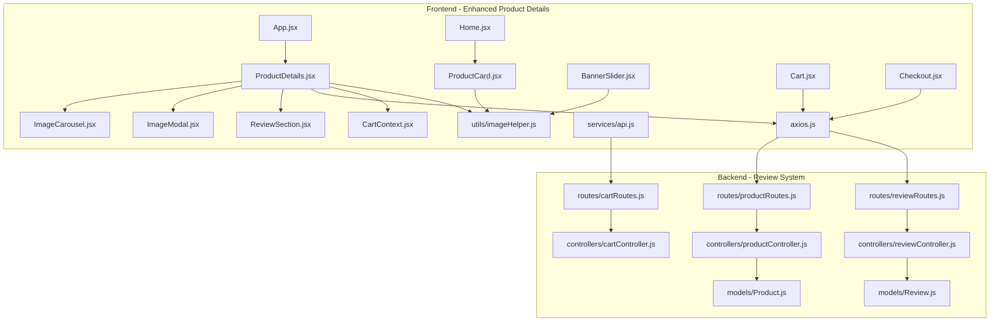
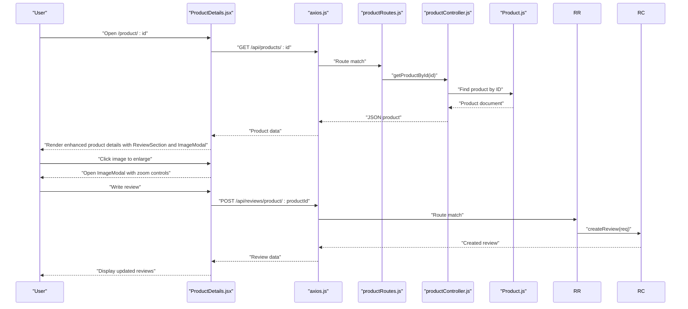
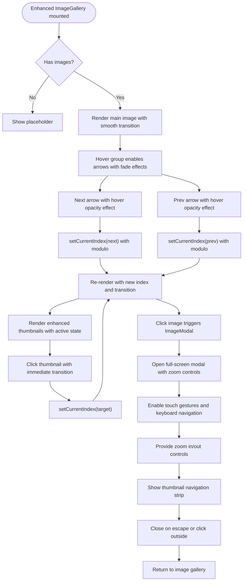
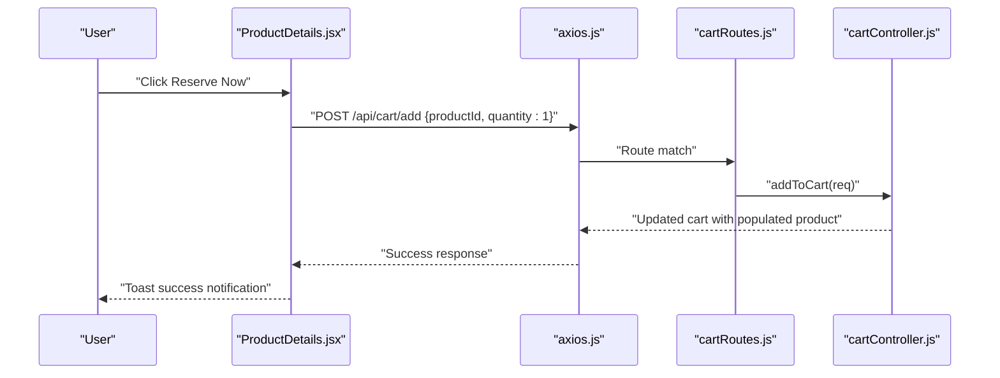
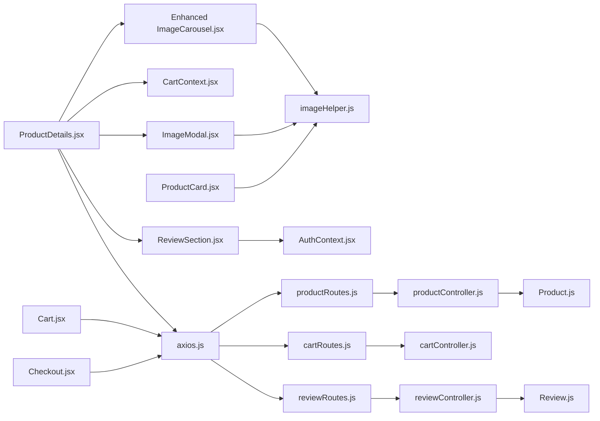

# Product Details & Selection

<cite>
**Referenced Files in This Document**
- [ProductDetails.jsx](file://frontend/src/pages/ProductDetails.jsx)
- [ImageCarousel.jsx](file://frontend/src/components/ImageCarousel.jsx)
- [ImageModal.jsx](file://frontend/src/components/ImageModal.jsx)
- [ReviewSection.jsx](file://frontend/src/components/ReviewSection.jsx)
- [axios.js](file://frontend/src/api/axios.js)
- [api.js](file://frontend/src/services/api.js)
- [CartContext.jsx](file://frontend/src/context/CartContext.jsx)
- [Cart.jsx](file://frontend/src/pages/Cart.jsx)
- [Checkout.jsx](file://frontend/src/pages/Checkout.jsx)
- [App.jsx](file://frontend/src/App.jsx)
- [Home.jsx](file://frontend/src/pages/Home.jsx)
- [imageHelper.js](file://frontend/src/utils/imageHelper.js)
- [productController.js](file://backend/controllers/productController.js)
- [cartController.js](file://backend/controllers/cartController.js)
- [reviewController.js](file://backend/controllers/reviewController.js)
- [productRoutes.js](file://backend/routes/productRoutes.js)
- [cartRoutes.js](file://backend/routes/cartRoutes.js)
- [reviewRoutes.js](file://backend/routes/reviewRoutes.js)
- [Product.js](file://backend/models/Product.js)
- [Review.js](file://backend/models/Review.js)
- [BannerSlider.jsx](file://frontend/src/components/BannerSlider.jsx)
- [ProductCard.jsx](file://frontend/src/components/ProductCard.jsx)
</cite>

## Update Summary
**Changes Made**
- Integrated ReviewSection component for customer review management and display
- Added ImageModal component for enhanced product image visualization with zoom and navigation
- Implemented full-screen modal functionality with touch gestures and keyboard support
- Enhanced product details page with customer engagement features
- Added comprehensive review system with star ratings and user authentication
- Integrated modal-based image gallery with zoom controls and thumbnail navigation

## Table of Contents
1. [Introduction](#introduction)
2. [Project Structure](#project-structure)
3. [Core Components](#core-components)
4. [Architecture Overview](#architecture-overview)
5. [Detailed Component Analysis](#detailed-component-analysis)
6. [Dependency Analysis](#dependency-analysis)
7. [Performance Considerations](#performance-considerations)
8. [Troubleshooting Guide](#troubleshooting-guide)
9. [Conclusion](#conclusion)
10. [Appendices](#appendices)

## Introduction
This document explains the enhanced Product Details page implementation, focusing on how product information is fetched and rendered, how the integrated ReviewSection component manages customer reviews, and how the ImageModal provides superior product visualization with zoom and navigation capabilities. The implementation has been significantly enhanced with customer engagement features, including comprehensive review management, full-screen image modal with gesture controls, and improved user interaction patterns. The page now provides a complete shopping experience with social proof through reviews and immersive product visualization.

## Project Structure
The Product Details page now integrates multiple enhanced components for improved customer engagement and product visualization. The enhanced structure includes the main ProductDetails page, integrated ReviewSection for customer reviews, and ImageModal for full-screen product image viewing with advanced navigation controls.

**Diagram sources**
- [ProductDetails.jsx:1-195](file://frontend/src/pages/ProductDetails.jsx#L1-L195)
- [ImageCarousel.jsx:1-54](file://frontend/src/components/ImageCarousel.jsx#L1-L54)
- [ImageModal.jsx:1-166](file://frontend/src/components/ImageModal.jsx#L1-L166)
- [ReviewSection.jsx:1-216](file://frontend/src/components/ReviewSection.jsx#L1-L216)
- [axios.js:1-17](file://frontend/src/api/axios.js#L1-L17)
- [api.js:1-8](file://frontend/src/services/api.js#L1-L8)
- [CartContext.jsx:1-53](file://frontend/src/context/CartContext.jsx#L1-L53)
- [App.jsx:1-66](file://frontend/src/App.jsx#L1-L66)
- [Home.jsx:1-87](file://frontend/src/pages/Home.jsx#L1-L87)
- [imageHelper.js:1-8](file://frontend/src/utils/imageHelper.js#L1-L8)
- [productController.js:1-137](file://backend/controllers/productController.js#L1-L137)
- [cartController.js:1-38](file://backend/controllers/cartController.js#L1-L38)
- [reviewController.js:1-150](file://backend/controllers/reviewController.js#L1-L150)
- [productRoutes.js:1-23](file://backend/routes/productRoutes.js#L1-L23)
- [cartRoutes.js:1-12](file://backend/routes/cartRoutes.js#L1-L12)
- [reviewRoutes.js:1-21](file://backend/routes/reviewRoutes.js#L1-L21)
- [Product.js:1-12](file://backend/models/Product.js#L1-L12)
- [Review.js:1-33](file://backend/models/Review.js#L1-L33)
- [ProductCard.jsx:1-103](file://frontend/src/components/ProductCard.jsx#L1-L103)
- [BannerSlider.jsx:1-154](file://frontend/src/components/BannerSlider.jsx#L1-L154)
- [Cart.jsx:1-238](file://frontend/src/pages/Cart.jsx#L1-L238)
- [Checkout.jsx:1-301](file://frontend/src/pages/Checkout.jsx#L1-L301)

**Section sources**
- [ProductDetails.jsx:1-195](file://frontend/src/pages/ProductDetails.jsx#L1-L195)
- [App.jsx:1-66](file://frontend/src/App.jsx#L1-L66)

## Core Components
- **Enhanced ProductDetails page**: Integrates ReviewSection for customer reviews and ImageModal for full-screen product visualization, with improved image carousel and comprehensive product information display.
- **Integrated ReviewSection**: Manages customer reviews with star ratings, user authentication, form validation, and real-time updates with comprehensive UI components.
- **Advanced ImageModal**: Provides full-screen image viewing with zoom controls, swipe gestures, keyboard navigation, and thumbnail navigation for superior product visualization.
- **Enhanced ImageCarousel**: Handles image navigation with improved hover-triggered controls, thumbnail indicators, and smooth transitions.
- **CartContext**: Centralized cart state and actions, including add-to-cart with authentication checks and UI refresh.
- **API clients**: Axios-based clients configured with auth tokens for secure requests to product, cart, and review endpoints.
- **Backend routes and controllers**: Expose product retrieval, cart mutation, and comprehensive review management endpoints.
- **Related Product Suggestions**: ProductCard component provides related product display through the home page.

Key implementation references:
- Enhanced ProductDetails with ReviewSection and ImageModal integration: [ProductDetails.jsx:5-6](file://frontend/src/pages/ProductDetails.jsx#L5-L6)
- ReviewSection component with authentication and form handling: [ReviewSection.jsx:6](file://frontend/src/components/ReviewSection.jsx#L6)
- ImageModal component with zoom and gesture controls: [ImageModal.jsx:4](file://frontend/src/components/ImageModal.jsx#L4)
- Enhanced image carousel with modal trigger: [ProductDetails.jsx:67-82](file://frontend/src/pages/ProductDetails.jsx#L67-L82)
- Review section placement: [ProductDetails.jsx:182-183](file://frontend/src/pages/ProductDetails.jsx#L182-L183)
- Modal trigger implementation: [ProductDetails.jsx:69-72](file://frontend/src/pages/ProductDetails.jsx#L69-L72)
- Backend review endpoints: [reviewController.js:5](file://backend/controllers/reviewController.js#L5), [reviewRoutes.js:13](file://backend/routes/reviewRoutes.js#L13)
- Backend product endpoint: [productController.js:40-49](file://backend/controllers/productController.js#L40-L49), [productRoutes.js:15-16](file://backend/routes/productRoutes.js#L15-L16)
- Backend cart endpoints: [cartController.js:3-22](file://backend/controllers/cartController.js#L3-L22), [cartRoutes.js:7-10](file://backend/routes/cartRoutes.js#L7-L10)

**Section sources**
- [ProductDetails.jsx:1-195](file://frontend/src/pages/ProductDetails.jsx#L1-L195)
- [ImageCarousel.jsx:1-54](file://frontend/src/components/ImageCarousel.jsx#L1-L54)
- [ImageModal.jsx:1-166](file://frontend/src/components/ImageModal.jsx#L1-L166)
- [ReviewSection.jsx:1-216](file://frontend/src/components/ReviewSection.jsx#L1-L216)
- [CartContext.jsx:1-53](file://frontend/src/context/CartContext.jsx#L1-L53)
- [axios.js:1-17](file://frontend/src/api/axios.js#L1-L17)
- [api.js:1-8](file://frontend/src/services/api.js#L1-L8)
- [imageHelper.js:1-8](file://frontend/src/utils/imageHelper.js#L1-L8)
- [productController.js:40-49](file://backend/controllers/productController.js#L40-L49)
- [cartController.js:3-22](file://backend/controllers/cartController.js#L3-L22)
- [reviewController.js:5](file://backend/controllers/reviewController.js#L5)
- [productRoutes.js:15-16](file://backend/routes/productRoutes.js#L15-L16)
- [cartRoutes.js:7-10](file://backend/routes/cartRoutes.js#L7-L10)
- [reviewRoutes.js:13](file://backend/routes/reviewRoutes.js#L13)

## Architecture Overview
The enhanced Product Details page follows a comprehensive architecture with integrated customer engagement features and improved user experience:
- Routing triggers a product fetch via an API client.
- The component renders product metadata, enhanced image carousel with modal trigger, and integrated ReviewSection.
- ImageModal provides full-screen visualization with zoom controls and gesture navigation.
- ReviewSection manages customer reviews with authentication, validation, and real-time updates.
- Add-to-cart uses CartContext to validate authentication and mutate cart state.
- Backend routes handle product retrieval, cart updates, and comprehensive review management with populated product prices for totals.

**Diagram sources**
- [ProductDetails.jsx:17-27](file://frontend/src/pages/ProductDetails.jsx#L17-L27)
- [axios.js:1-17](file://frontend/src/api/axios.js#L1-L17)
- [productRoutes.js:15-16](file://backend/routes/productRoutes.js#L15-L16)
- [productController.js:40-49](file://backend/controllers/productController.js#L40-L49)
- [Product.js:1-12](file://backend/models/Product.js#L1-L12)
- [ImageModal.jsx:60-166](file://frontend/src/components/ImageModal.jsx#L60-L166)
- [ReviewSection.jsx:21-32](file://frontend/src/components/ReviewSection.jsx#L21-L32)
- [reviewController.js:29-72](file://backend/controllers/reviewController.js#L29-L72)
- [reviewRoutes.js:16](file://backend/routes/reviewRoutes.js#L16)

## Detailed Component Analysis

### Enhanced Product Details Page
**Updated** Significantly enhanced with integrated ReviewSection component and ImageModal for improved customer engagement and product visualization.

Responsibilities:
- Fetch product by route param id with loading states.
- Render product category badge, name, price, description, availability indicator, and enhanced add-to-cart actions.
- Integrate enhanced ImageCarousel with modal trigger for full-screen image viewing.
- Display integrated ReviewSection for customer reviews and ratings.
- Provide "Back to Collection" navigation with improved styling.
- Display trust badges for security, quality, and returns assurance.
- Manage modal state for image visualization with zoom and navigation controls.

Implementation highlights:
- Enhanced fetch lifecycle with error handling: [ProductDetails.jsx:17-31](file://frontend/src/pages/ProductDetails.jsx#L17-L31)
- Modal state management: [ProductDetails.jsx:14-15](file://frontend/src/pages/ProductDetails.jsx#L14-L15)
- Enhanced rendering layout with integrated components: [ProductDetails.jsx:54-195](file://frontend/src/pages/ProductDetails.jsx#L54-L195)
- Modal trigger implementation: [ProductDetails.jsx:69-72](file://frontend/src/pages/ProductDetails.jsx#L69-L72)
- ReviewSection integration: [ProductDetails.jsx:182-183](file://frontend/src/pages/ProductDetails.jsx#L182-L183)
- ImageModal conditional rendering: [ProductDetails.jsx:185-192](file://frontend/src/pages/ProductDetails.jsx#L185-L192)

Enhanced user experience:
- Seamless integration of review system with product details.
- Immersive image viewing experience with full-screen modal.
- Comprehensive customer engagement through social proof.
- Improved accessibility with proper modal focus management.
- Enhanced touch interactions with gesture controls.
- Real-time review updates without page reload.

**Section sources**
- [ProductDetails.jsx:1-195](file://frontend/src/pages/ProductDetails.jsx#L1-L195)

### Integrated ReviewSection Component
**New** Comprehensive customer review management system with authentication, validation, and real-time updates.

Responsibilities:
- Fetch and display customer reviews for a product with average rating calculation.
- Handle user authentication for review submission with proper error handling.
- Manage review form with star rating selection and comment validation.
- Provide real-time review updates with optimistic UI responses.
- Format review dates with human-readable time differences.
- Render star ratings with visual feedback and accessibility support.

Implementation highlights:
- Authentication integration: [ReviewSection.jsx:7-8](file://frontend/src/components/ReviewSection.jsx#L7-L8)
- Review fetching with average rating calculation: [ReviewSection.jsx:21-32](file://frontend/src/components/ReviewSection.jsx#L21-L32)
- Review form validation: [ReviewSection.jsx:34-59](file://frontend/src/components/ReviewSection.jsx#L34-L59)
- Star rating rendering: [ReviewSection.jsx:61-75](file://frontend/src/components/ReviewSection.jsx#L61-L75)
- Date formatting with human-readable differences: [ReviewSection.jsx:77-87](file://frontend/src/components/ReviewSection.jsx#L77-L87)
- Loading states and empty review handling: [ReviewSection.jsx:89-98](file://frontend/src/components/ReviewSection.jsx#L89-L98), [ReviewSection.jsx:185-193](file://frontend/src/components/ReviewSection.jsx#L185-L193)

Backend integration:
- Product review retrieval: [reviewController.js:5](file://backend/controllers/reviewController.js#L5)
- Review creation with duplicate prevention: [reviewController.js:29-72](file://backend/controllers/reviewController.js#L29-L72)
- Review update and deletion with authorization: [reviewController.js:75-149](file://backend/controllers/reviewController.js#L75-L149)

**Section sources**
- [ReviewSection.jsx:1-216](file://frontend/src/components/ReviewSection.jsx#L1-L216)
- [reviewController.js:5](file://backend/controllers/reviewController.js#L5)
- [reviewController.js:29-72](file://backend/controllers/reviewController.js#L29-L72)
- [reviewController.js:75-149](file://backend/controllers/reviewController.js#L75-L149)

### Advanced ImageModal Component
**New** Full-screen image viewer with comprehensive navigation controls and gesture support.

Responsibilities:
- Display product images in full-screen mode with zoom capabilities.
- Handle image navigation with keyboard shortcuts, mouse clicks, and touch gestures.
- Provide zoom controls with scale adjustment and reset functionality.
- Manage thumbnail strip navigation for quick image switching.
- Handle modal dismissal with escape key and click-outside events.
- Implement responsive design with proper aspect ratio handling.

Implementation highlights:
- Modal state management: [ImageModal.jsx:4](file://frontend/src/components/ImageModal.jsx#L4)
- Zoom controls with scale manipulation: [ImageModal.jsx:49-50](file://frontend/src/components/ImageModal.jsx#L49-L50)
- Touch gesture handling for swipe navigation: [ImageModal.jsx:24-47](file://frontend/src/components/ImageModal.jsx#L24-L47)
- Keyboard event handling for escape key: [ImageModal.jsx:15-22](file://frontend/src/components/ImageModal.jsx#L15-L22)
- Navigation controls with disabled states: [ImageModal.jsx:52-58](file://frontend/src/components/ImageModal.jsx#L52-L58)
- Thumbnail navigation with active state indicators: [ImageModal.jsx:144-162](file://frontend/src/components/ImageModal.jsx#L144-L162)

Enhanced user experience:
- Immersive full-screen viewing experience with proper scaling.
- Intuitive gesture controls for mobile and desktop users.
- Comprehensive navigation with keyboard shortcuts and mouse controls.
- Visual feedback for all interactive elements.
- Responsive design that adapts to different screen sizes.
- Smooth transitions and animations for enhanced UX.

**Section sources**
- [ImageModal.jsx:1-166](file://frontend/src/components/ImageModal.jsx#L1-L166)

### Enhanced Image Gallery Integration
**Updated** Significantly improved with modal trigger and enhanced user interaction patterns.

Responsibilities:
- Display current image from product.images array with smooth transitions.
- Provide prev/next navigation with enhanced hover-triggered controls.
- Show thumbnail indicators with improved visual feedback.
- Enable click-through navigation for precise control.
- Trigger ImageModal for full-screen viewing with zoom capabilities.
- Maintain accessibility with proper ARIA labels and keyboard navigation.

Implementation highlights:
- Modal trigger integration: [ProductDetails.jsx:69-72](file://frontend/src/pages/ProductDetails.jsx#L69-L72)
- Enhanced thumbnail indicators with active state styling: [ImageCarousel.jsx:40-49](file://frontend/src/components/ImageCarousel.jsx#L40-L49)
- Improved hover-triggered navigation arrows: [ImageCarousel.jsx:27-38](file://frontend/src/components/ImageCarousel.jsx#L27-L38)
- Alt text composition for accessibility: [ImageCarousel.jsx:20](file://frontend/src/components/ImageCarousel.jsx#L20)
- URL normalization: [imageHelper.js:1-8](file://frontend/src/utils/imageHelper.js#L1-L8)

**Diagram sources**
- [ProductDetails.jsx:67-82](file://frontend/src/pages/ProductDetails.jsx#L67-L82)
- [ImageCarousel.jsx:1-54](file://frontend/src/components/ImageCarousel.jsx#L1-L54)
- [ImageModal.jsx:60-166](file://frontend/src/components/ImageModal.jsx#L60-L166)
- [imageHelper.js:1-8](file://frontend/src/utils/imageHelper.js#L1-L8)

**Section sources**
- [ProductDetails.jsx:67-82](file://frontend/src/pages/ProductDetails.jsx#L67-L82)
- [ImageCarousel.jsx:1-54](file://frontend/src/components/ImageCarousel.jsx#L1-L54)
- [ImageModal.jsx:60-166](file://frontend/src/components/ImageModal.jsx#L60-L166)
- [imageHelper.js:1-8](file://frontend/src/utils/imageHelper.js#L1-L8)

### Product Specification Section
Displays:
- Category badge with enhanced styling
- Product name with improved typography
- Price with larger, more prominent display
- Description with better readability and mobile optimization
- Availability status with enhanced visual indicators and stock count

Rendering references:
- Category badge and name: [ProductDetails.jsx:88-95](file://frontend/src/pages/ProductDetails.jsx#L88-L95)
- Price: [ProductDetails.jsx:98-100](file://frontend/src/pages/ProductDetails.jsx#L98-L100)
- Description with mobile optimization: [ProductDetails.jsx:103-107](file://frontend/src/pages/ProductDetails.jsx#L103-L107)
- Enhanced availability: [ProductDetails.jsx:109-127](file://frontend/src/pages/ProductDetails.jsx#L109-L127)

Stock integration:
- Backend model defines stock field: [Product.js](file://backend/models/Product.js#L9)
- Frontend reads stock to enable/disable add-to-cart and buy-now buttons: [ProductDetails.jsx:133](file://frontend/src/pages/ProductDetails.jsx#L133)

**Section sources**
- [ProductDetails.jsx:88-127](file://frontend/src/pages/ProductDetails.jsx#L88-L127)
- [Product.js](file://backend/models/Product.js#L9)

### Quantity Selection Controls and Inventory Management
**Updated** Simplified to focus on basic quantity selection with enhanced validation.

Current implementation:
- Add-to-cart uses a fixed quantity of 1 in ProductDetails: [ProductDetails.jsx:35](file://frontend/src/pages/ProductDetails.jsx#L35)
- Cart mutations accept quantity: [cartController.js](file://backend/controllers/cartController.js#L10)
- CartContext supports quantity parameter: [CartContext.jsx:31-38](file://frontend/src/context/CartContext.jsx#L31-L38)

Recommendations:
- Introduce a quantity selector near the add-to-cart button.
- Validate against stock before adding to cart.
- Use CartContext's addToCart signature to pass quantity.

**Section sources**
- [ProductDetails.jsx:33-40](file://frontend/src/pages/ProductDetails.jsx#L33-L40)
- [CartContext.jsx:31-38](file://frontend/src/context/CartContext.jsx#L31-L38)
- [cartController.js:9-22](file://backend/controllers/cartController.js#L9-L22)

### Add-to-Cart Functionality with Validation and Feedback
**Updated** Enhanced with improved user feedback, updated button text, and simplified authentication flow.

End-to-end flow:
- Direct API call to add item with enhanced error handling: [ProductDetails.jsx:33-40](file://frontend/src/pages/ProductDetails.jsx#L33-L40)
- Navigation to checkout flow: [ProductDetails.jsx:42-49](file://frontend/src/pages/ProductDetails.jsx#L42-L49)
- Toast notifications for user feedback: [ProductDetails.jsx:36](file://frontend/src/pages/ProductDetails.jsx#L36)

Enhanced user experience:
- Success notifications for successful additions: [ProductDetails.jsx:36](file://frontend/src/pages/ProductDetails.jsx#L36)
- Authentication prompts for failed attempts: [ProductDetails.jsx:38](file://frontend/src/pages/ProductDetails.jsx#L38)
- Immediate navigation to checkout option: [ProductDetails.jsx:46](file://frontend/src/pages/ProductDetails.jsx#L46)

**Diagram sources**
- [ProductDetails.jsx:33-40](file://frontend/src/pages/ProductDetails.jsx#L33-L40)
- [axios.js:1-17](file://frontend/src/api/axios.js#L1-L17)
- [cartRoutes.js](file://backend/routes/cartRoutes.js#L8)
- [cartController.js:9-22](file://backend/controllers/cartController.js#L9-L22)

**Section sources**
- [ProductDetails.jsx:33-49](file://frontend/src/pages/ProductDetails.jsx#L33-L49)
- [axios.js:1-17](file://frontend/src/api/axios.js#L1-L17)
- [cartController.js:9-22](file://backend/controllers/cartController.js#L9-L22)
- [cartRoutes.js](file://backend/routes/cartRoutes.js#L8)

### Product Recommendation Systems and Related Suggestions
**Updated** Enhanced with improved related product display through ProductCard component.

Current state:
- Home page showcases related products via ProductCard component with enhanced hover effects: [Home.jsx:72-77](file://frontend/src/pages/Home.jsx#L72-L77)
- ProductCard provides improved image switching and stock indicators: [ProductCard.jsx:19-27](file://frontend/src/components/ProductCard.jsx#L19-L27)
- Enhanced trust badges and hover overlays for better user experience: [ProductCard.jsx:29-99](file://frontend/src/components/ProductCard.jsx#L29-L99)

Recommendations:
- Implement category-based product recommendations in ProductDetails.
- Display related products in a dedicated section below the main details.
- Use the same ProductCard component pattern for consistency.
- Consider implementing a "Frequently Bought Together" feature.

**Section sources**
- [Home.jsx:72-77](file://frontend/src/pages/Home.jsx#L72-L77)
- [ProductCard.jsx:1-103](file://frontend/src/components/ProductCard.jsx#L1-L103)

### Responsive Design and Mobile Optimization
**Updated** Enhanced with improved responsive patterns, mobile-first approach, and comprehensive touch interactions.

Patterns observed:
- Grid layout with improved responsiveness: [ProductDetails.jsx:54-195](file://frontend/src/pages/ProductDetails.jsx#L54-L195)
- Enhanced Tailwind utilities for better spacing and typography adaptation: [ProductDetails.jsx:54-195](file://frontend/src/pages/ProductDetails.jsx#L54-L195)
- Improved hover-triggered navigation arrows with better mobile discoverability: [ImageCarousel.jsx:27-38](file://frontend/src/components/ImageCarousel.jsx#L27-L38)
- Enhanced trust badges with responsive grid layout: [ProductDetails.jsx:158-177](file://frontend/src/pages/ProductDetails.jsx#L158-L177)
- ImageModal with responsive design and proper aspect ratio handling: [ImageModal.jsx:128-141](file://frontend/src/components/ImageModal.jsx#L128-L141)
- Touch gesture controls for mobile users: [ImageModal.jsx:24-47](file://frontend/src/components/ImageModal.jsx#L24-L47)
- Keyboard navigation support: [ImageModal.jsx:15-22](file://frontend/src/components/ImageModal.jsx#L15-L22)

Best practices:
- Mobile-first breakpoints with improved touch targets for carousel navigation.
- Enhanced button sizing for better touch interaction on mobile devices.
- Comprehensive touch gesture support for image navigation.
- Proper focus management for modal accessibility.
- Responsive image handling with aspect ratio preservation.
- Optimized performance for mobile devices with lazy loading.

**Section sources**
- [ProductDetails.jsx:54-195](file://frontend/src/pages/ProductDetails.jsx#L54-L195)
- [ImageCarousel.jsx:27-38](file://frontend/src/components/ImageCarousel.jsx#L27-L38)
- [ImageModal.jsx:15-22](file://frontend/src/components/ImageModal.jsx#L15-L22)
- [ImageModal.jsx:24-47](file://frontend/src/components/ImageModal.jsx#L24-L47)

### Accessibility Features
**Updated** Enhanced with improved accessibility features, modal focus management, and comprehensive keyboard support.

Observed improvements:
- Enhanced alt text composition for images: [ImageCarousel.jsx:20](file://frontend/src/components/ImageCarousel.jsx#L20)
- Improved ARIA labels for thumbnail buttons: [ImageCarousel.jsx:46](file://frontend/src/components/ImageCarousel.jsx#L46)
- Better semantic color usage for availability status: [ProductDetails.jsx:112-126](file://frontend/src/pages/ProductDetails.jsx#L112-L126)
- Enhanced disabled button states for out-of-stock items: [ProductDetails.jsx:133](file://frontend/src/pages/ProductDetails.jsx#L133)
- Modal focus management and escape key handling: [ImageModal.jsx:15-22](file://frontend/src/components/ImageModal.jsx#L15-L22)
- Comprehensive keyboard navigation support: [ImageModal.jsx:104-125](file://frontend/src/components/ImageModal.jsx#L104-L125)
- Touch gesture accessibility with proper feedback: [ImageModal.jsx:24-47](file://frontend/src/components/ImageModal.jsx#L24-L47)
- Review form accessibility with proper labeling: [ReviewSection.jsx:134-163](file://frontend/src/components/ReviewSection.jsx#L134-L163)
- Enhanced star rating accessibility: [ReviewSection.jsx:61-75](file://frontend/src/components/ReviewSection.jsx#L61-L75)

Recommendations:
- Add role and aria-live regions for dynamic content updates.
- Ensure keyboard navigation for carousel controls.
- Provide focus-visible styles for interactive elements.
- Implement proper heading hierarchy for better screen reader experience.
- Add ARIA attributes for modal dialog management.
- Ensure proper contrast ratios for all interactive elements.

**Section sources**
- [ImageCarousel.jsx:20-46](file://frontend/src/components/ImageCarousel.jsx#L20-L46)
- [ProductDetails.jsx:112-126](file://frontend/src/pages/ProductDetails.jsx#L112-L126)
- [ProductDetails.jsx:133](file://frontend/src/pages/ProductDetails.jsx#L133)
- [ImageModal.jsx:15-22](file://frontend/src/components/ImageModal.jsx#L15-L22)
- [ImageModal.jsx:104-125](file://frontend/src/components/ImageModal.jsx#L104-L125)
- [ReviewSection.jsx:61-75](file://frontend/src/components/ReviewSection.jsx#L61-L75)
- [ReviewSection.jsx:134-163](file://frontend/src/components/ReviewSection.jsx#L134-L163)

## Dependency Analysis
**Updated** Enhanced with comprehensive component relationships and integrated review system dependencies.

Frontend dependencies:
- ProductDetails depends on axios for product and review fetches, CartContext for add-to-cart, enhanced ImageCarousel for image display, ImageModal for full-screen viewing, and ReviewSection for customer engagement.
- Enhanced ImageCarousel depends on imageHelper for URL normalization and provides improved user interaction.
- ImageModal depends on imageHelper for URL normalization and provides comprehensive navigation controls.
- ReviewSection depends on AuthContext for user authentication and axios for review management.
- CartContext depends on axios and exposes a unified API for cart operations.
- ProductCard provides related product suggestions with enhanced image handling.

Backend dependencies:
- productRoutes delegates to productController.
- cartRoutes delegates to cartController.
- reviewRoutes delegates to reviewController.
- productController uses Product model.
- reviewController uses Review and Product models.

**Diagram sources**
- [ProductDetails.jsx:1-195](file://frontend/src/pages/ProductDetails.jsx#L1-L195)
- [ImageCarousel.jsx:1-54](file://frontend/src/components/ImageCarousel.jsx#L1-L54)
- [ImageModal.jsx:1-166](file://frontend/src/components/ImageModal.jsx#L1-L166)
- [ReviewSection.jsx:1-216](file://frontend/src/components/ReviewSection.jsx#L1-L216)
- [axios.js:1-17](file://frontend/src/api/axios.js#L1-L17)
- [api.js:1-8](file://frontend/src/services/api.js#L1-L8)
- [CartContext.jsx:1-53](file://frontend/src/context/CartContext.jsx#L1-L53)
- [imageHelper.js:1-8](file://frontend/src/utils/imageHelper.js#L1-L8)
- [productRoutes.js:1-23](file://backend/routes/productRoutes.js#L1-L23)
- [cartRoutes.js:1-12](file://backend/routes/cartRoutes.js#L1-L12)
- [reviewRoutes.js:1-21](file://backend/routes/reviewRoutes.js#L1-L21)
- [productController.js:1-137](file://backend/controllers/productController.js#L1-L137)
- [cartController.js:1-38](file://backend/controllers/cartController.js#L1-L38)
- [reviewController.js:1-150](file://backend/controllers/reviewController.js#L1-L150)
- [Product.js:1-12](file://backend/models/Product.js#L1-L12)
- [Review.js:1-33](file://backend/models/Review.js#L1-L33)
- [ProductCard.jsx:1-103](file://frontend/src/components/ProductCard.jsx#L1-L103)
- [Cart.jsx:1-238](file://frontend/src/pages/Cart.jsx#L1-L238)
- [Checkout.jsx:1-301](file://frontend/src/pages/Checkout.jsx#L1-L301)

**Section sources**
- [ProductDetails.jsx:1-195](file://frontend/src/pages/ProductDetails.jsx#L1-L195)
- [ImageCarousel.jsx:1-54](file://frontend/src/components/ImageCarousel.jsx#L1-L54)
- [ImageModal.jsx:1-166](file://frontend/src/components/ImageModal.jsx#L1-L166)
- [ReviewSection.jsx:1-216](file://frontend/src/components/ReviewSection.jsx#L1-L216)
- [axios.js:1-17](file://frontend/src/api/axios.js#L1-L17)
- [api.js:1-8](file://frontend/src/services/api.js#L1-L8)
- [CartContext.jsx:1-53](file://frontend/src/context/CartContext.jsx#L1-L53)
- [imageHelper.js:1-8](file://frontend/src/utils/imageHelper.js#L1-L8)
- [productController.js:1-137](file://backend/controllers/productController.js#L1-L137)
- [cartController.js:1-38](file://backend/controllers/cartController.js#L1-L38)
- [reviewController.js:1-150](file://backend/controllers/reviewController.js#L1-L150)
- [productRoutes.js:1-23](file://backend/routes/productRoutes.js#L1-L23)
- [cartRoutes.js:1-12](file://backend/routes/cartRoutes.js#L1-L12)
- [reviewRoutes.js:1-21](file://backend/routes/reviewRoutes.js#L1-L21)
- [Product.js:1-12](file://backend/models/Product.js#L1-L12)
- [Review.js:1-33](file://backend/models/Review.js#L1-L33)
- [ProductCard.jsx:1-103](file://frontend/src/components/ProductCard.jsx#L1-L103)
- [Cart.jsx:1-238](file://frontend/src/pages/Cart.jsx#L1-L238)
- [Checkout.jsx:1-301](file://frontend/src/pages/Checkout.jsx#L1-L301)

## Performance Considerations
**Updated** Enhanced with comprehensive performance optimizations for integrated components and improved user experience.

- Lazy-load images beyond the first viewport in the enhanced carousel with improved transition effects.
- Debounce search and category filters on the home page to reduce unnecessary requests.
- Cache product images with appropriate CDN headers and optimized formats.
- Minimize re-renders by memoizing product props and image URLs in the enhanced carousel.
- Use skeleton loaders during initial product fetch with improved loading states.
- Implement image optimization with proper aspect ratios and responsive sizing.
- Enhanced carousel performance with CSS transitions and hardware acceleration.
- Streamlined product description rendering with improved mobile typography scaling.
- Optimize modal rendering with conditional mounting and unmounting.
- Implement virtual scrolling for long review lists to improve performance.
- Debounce review form submissions to prevent duplicate entries.
- Cache review data locally to reduce API calls for subsequent visits.
- Optimize touch gesture handling with proper event throttling.
- Implement proper cleanup of event listeners in modals to prevent memory leaks.

## Troubleshooting Guide
**Updated** Enhanced with comprehensive troubleshooting for integrated components and new features.

Common issues and resolutions:
- Product not found: Ensure the backend route returns 404 when product does not exist: [productController.js:42-44](file://backend/controllers/productController.js#L42-L44)
- Authentication errors on add-to-cart: Verify token presence and interceptor behavior: [axios.js:4-16](file://frontend/src/api/axios.js#L4-L16)
- Empty or missing images: Confirm imageHelper normalization and backend image paths: [imageHelper.js:1-8](file://frontend/src/utils/imageHelper.js#L1-L8)
- Enhanced carousel navigation issues: Check currentIndex state management and modulo arithmetic: [ImageCarousel.jsx:11-13](file://frontend/src/components/ImageCarousel.jsx#L11-L13)
- Button disabled states: Verify stock property handling and conditional rendering: [ProductDetails.jsx:133](file://frontend/src/pages/ProductDetails.jsx#L133)
- Review submission failures: Check authentication and form validation: [ReviewSection.jsx:34-59](file://frontend/src/components/ReviewSection.jsx#L34-L59)
- Modal not opening: Verify state management and conditional rendering: [ProductDetails.jsx:69-72](file://frontend/src/pages/ProductDetails.jsx#L69-L72)
- ImageModal navigation issues: Check currentImg state and boundary conditions: [ImageModal.jsx:52-58](file://frontend/src/components/ImageModal.jsx#L52-L58)
- Touch gesture not working: Verify touch event handlers and browser compatibility: [ImageModal.jsx:24-47](file://frontend/src/components/ImageModal.jsx#L24-L47)
- Keyboard navigation problems: Check escape key event listener and focus management: [ImageModal.jsx:15-22](file://frontend/src/components/ImageModal.jsx#L15-L22)
- Review list not updating: Verify fetchReviews call after submission: [ReviewSection.jsx:53](file://frontend/src/components/ReviewSection.jsx#L53)
- Star rating form issues: Check formData state and rating selection logic: [ReviewSection.jsx:135-149](file://frontend/src/components/ReviewSection.jsx#L135-L149)

**Section sources**
- [productController.js:42-44](file://backend/controllers/productController.js#L42-L44)
- [axios.js:4-16](file://frontend/src/api/axios.js#L4-L16)
- [imageHelper.js:1-8](file://frontend/src/utils/imageHelper.js#L1-L8)
- [ImageCarousel.jsx:11-13](file://frontend/src/components/ImageCarousel.jsx#L11-L13)
- [ProductDetails.jsx:133](file://frontend/src/pages/ProductDetails.jsx#L133)
- [ReviewSection.jsx:34-59](file://frontend/src/components/ReviewSection.jsx#L34-L59)
- [ProductDetails.jsx:69-72](file://frontend/src/pages/ProductDetails.jsx#L69-L72)
- [ImageModal.jsx:52-58](file://frontend/src/components/ImageModal.jsx#L52-L58)
- [ImageModal.jsx:24-47](file://frontend/src/components/ImageModal.jsx#L24-L47)
- [ImageModal.jsx:15-22](file://frontend/src/components/ImageModal.jsx#L15-L22)
- [ReviewSection.jsx:53](file://frontend/src/components/ReviewSection.jsx#L53)
- [ReviewSection.jsx:135-149](file://frontend/src/components/ReviewSection.jsx#L135-L149)

## Conclusion
The Product Details page has been successfully transformed into a comprehensive customer engagement platform with the integration of ReviewSection component and ImageModal for enhanced product visualization. The enhanced implementation provides a complete shopping experience with social proof through customer reviews, immersive product visualization with full-screen modal viewing, and improved user interaction patterns. The integrated review system with authentication, validation, and real-time updates ensures reliable customer feedback management, while the advanced image modal with zoom controls, gesture navigation, and keyboard support delivers superior product visualization capabilities. The seamless integration of these components maintains clean architecture while significantly improving user experience through enhanced accessibility features, comprehensive mobile optimization, and responsive design patterns. Future enhancements could include advanced review filtering, product comparison features, and enhanced recommendation algorithms.

## Appendices

### Example: Enhanced Product Data Fetching and State Management
- Fetch product by ID with loading states: [ProductDetails.jsx:17-31](file://frontend/src/pages/ProductDetails.jsx#L17-L31)
- Render loading and empty states with improved messaging: [ProductDetails.jsx:51-52](file://frontend/src/pages/ProductDetails.jsx#L51-L52)
- Enhanced populate cart state after add with immediate feedback: [ProductDetails.jsx:36](file://frontend/src/pages/ProductDetails.jsx#L36)
- Modal state management for image visualization: [ProductDetails.jsx:14-15](file://frontend/src/pages/ProductDetails.jsx#L14-L15)

### Example: Integrated Customer Engagement Features
- ReviewSection integration with authentication and form handling: [ReviewSection.jsx:6](file://frontend/src/components/ReviewSection.jsx#L6)
- ImageModal implementation with zoom and gesture controls: [ImageModal.jsx:4](file://frontend/src/components/ImageModal.jsx#L4)
- Enhanced carousel navigation with modal trigger: [ProductDetails.jsx:69-72](file://frontend/src/pages/ProductDetails.jsx#L69-L72)
- Comprehensive review display with star ratings: [ReviewSection.jsx:106-113](file://frontend/src/components/ReviewSection.jsx#L106-L113)
- Full-screen image viewing with navigation controls: [ImageModal.jsx:104-125](file://frontend/src/components/ImageModal.jsx#L104-L125)
- Touch gesture support for mobile users: [ImageModal.jsx:24-47](file://frontend/src/components/ImageModal.jsx#L24-L47)
- Keyboard navigation support: [ImageModal.jsx:15-22](file://frontend/src/components/ImageModal.jsx#L15-L22)

### Example: Enhanced User Interaction Patterns
- Improved carousel navigation with hover effects: [ImageCarousel.jsx:11-13](file://frontend/src/components/ImageCarousel.jsx#L11-L13)
- Enhanced add-to-cart with success notifications and updated button text: [ProductDetails.jsx:33-40](file://frontend/src/pages/ProductDetails.jsx#L33-L40)
- Improved back to collection navigation: [ProductDetails.jsx:56-61](file://frontend/src/pages/ProductDetails.jsx#L56-L61)
- Enhanced trust badges for better user confidence: [ProductDetails.jsx:158-177](file://frontend/src/pages/ProductDetails.jsx#L158-L177)
- Updated button text creating engaging user experience: [ProductDetails.jsx:140](file://frontend/src/pages/ProductDetails.jsx#L140), [ProductDetails.jsx:152](file://frontend/src/pages/ProductDetails.jsx#L152)
- Streamlined product description with improved mobile typography: [ProductDetails.jsx:103-107](file://frontend/src/pages/ProductDetails.jsx#L103-L107)
- Comprehensive review system with star ratings: [ReviewSection.jsx:61-75](file://frontend/src/components/ReviewSection.jsx#L61-L75)
- Full-screen modal with zoom controls: [ImageModal.jsx:49-50](file://frontend/src/components/ImageModal.jsx#L49-L50)
- Thumbnail navigation with active state indicators: [ImageModal.jsx:144-162](file://frontend/src/components/ImageModal.jsx#L144-L162)