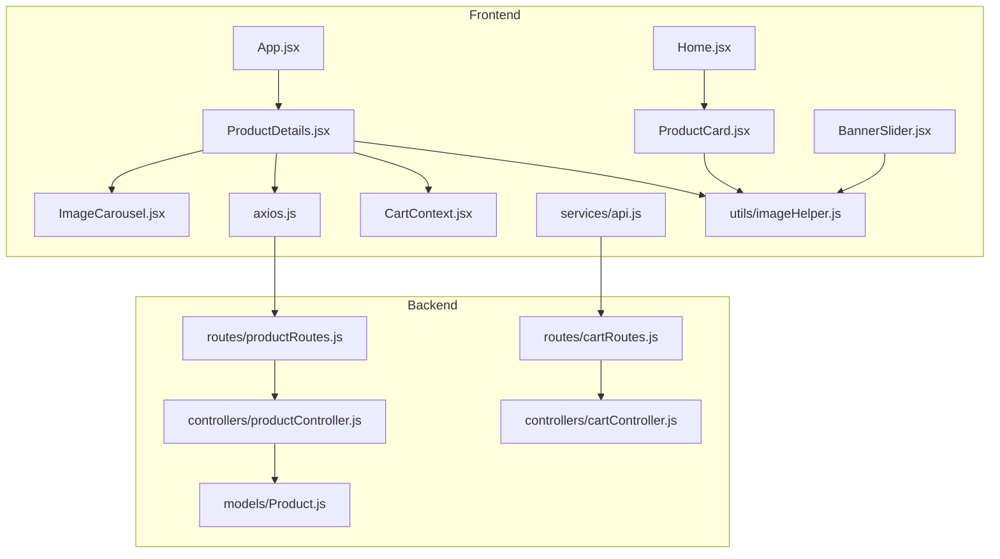
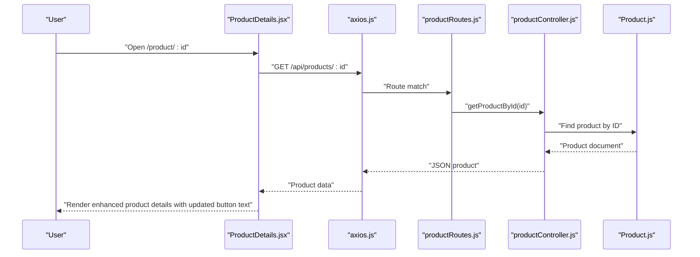
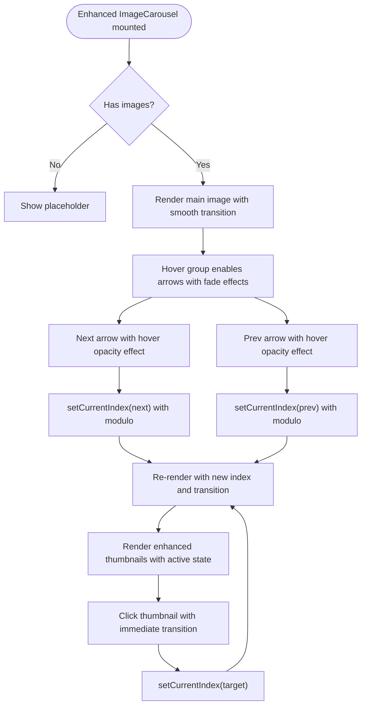
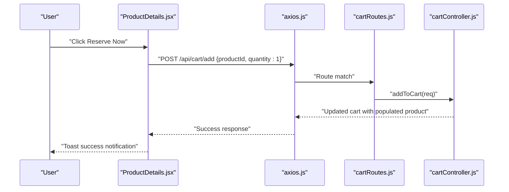
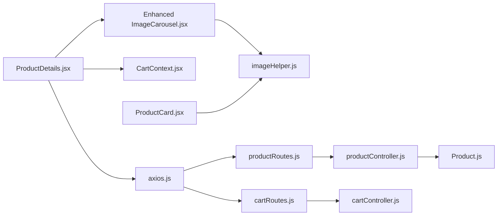

# Product Details & Selection

<cite>
**Referenced Files in This Document**
- [ProductDetails.jsx](file://frontend/src/pages/ProductDetails.jsx)
- [ImageCarousel.jsx](file://frontend/src/components/ImageCarousel.jsx)
- [axios.js](file://frontend/src/api/axios.js)
- [api.js](file://frontend/src/services/api.js)
- [CartContext.jsx](file://frontend/src/context/CartContext.jsx)
- [Cart.jsx](file://frontend/src/pages/Cart.jsx)
- [App.jsx](file://frontend/src/App.jsx)
- [Home.jsx](file://frontend/src/pages/Home.jsx)
- [imageHelper.js](file://frontend/src/utils/imageHelper.js)
- [productController.js](file://backend/controllers/productController.js)
- [cartController.js](file://backend/controllers/cartController.js)
- [productRoutes.js](file://backend/routes/productRoutes.js)
- [cartRoutes.js](file://backend/routes/cartRoutes.js)
- [Product.js](file://backend/models/Product.js)
- [BannerSlider.jsx](file://frontend/src/components/BannerSlider.jsx)
- [ProductCard.jsx](file://frontend/src/components/ProductCard.jsx)
</cite>

## Update Summary
**Changes Made**
- Updated button text: 'Add to Cart' changed to 'Reserve Now' and 'Buy Now' changed to 'Step Into Style'
- Enhanced image gallery with improved navigation and hover controls
- Simplified product information display focusing on core product details
- Maintained existing add-to-cart functionality with authentication checks
- Preserved related product suggestions through ProductCard component

## Table of Contents
1. [Introduction](#introduction)
2. [Project Structure](#project-structure)
3. [Core Components](#core-components)
4. [Architecture Overview](#architecture-overview)
5. [Detailed Component Analysis](#detailed-component-analysis)
6. [Dependency Analysis](#dependency-analysis)
7. [Performance Considerations](#performance-considerations)
8. [Troubleshooting Guide](#troubleshooting-guide)
9. [Conclusion](#conclusion)
10. [Appendices](#appendices)

## Introduction
This document explains the Product Details page implementation, focusing on how product information is fetched and rendered, how the enhanced image gallery works with navigation and hover controls, and how the add-to-cart flow integrates with authentication and state. The implementation has been updated with new button text changes ('Reserve Now' and 'Step Into Style') to provide a more engaging shopping experience. The page focuses on product information display without the previous pincode-based shipping estimation feature. It covers the product specification section (description, pricing, availability), quantity selection patterns, inventory management integration, related product suggestions, responsive design and mobile optimization, and accessibility features.

## Project Structure
The Product Details page is implemented in the frontend under the pages directory and leverages shared components and context for cart operations. Backend routes expose product and cart endpoints, while models define product data shape. The enhanced image gallery provides superior user experience with improved navigation controls.

**Diagram sources**
- [ProductDetails.jsx:1-219](file://frontend/src/pages/ProductDetails.jsx#L1-L219)
- [ImageCarousel.jsx:1-54](file://frontend/src/components/ImageCarousel.jsx#L1-L54)
- [axios.js:1-17](file://frontend/src/api/axios.js#L1-L17)
- [api.js:1-8](file://frontend/src/services/api.js#L1-L8)
- [CartContext.jsx:1-53](file://frontend/src/context/CartContext.jsx#L1-L53)
- [App.jsx:1-66](file://frontend/src/App.jsx#L1-L66)
- [Home.jsx:1-87](file://frontend/src/pages/Home.jsx#L1-L87)
- [imageHelper.js:1-8](file://frontend/src/utils/imageHelper.js#L1-L8)
- [productController.js:1-127](file://backend/controllers/productController.js#L1-L127)
- [cartController.js:1-38](file://backend/controllers/cartController.js#L1-L38)
- [productRoutes.js:1-23](file://backend/routes/productRoutes.js#L1-L23)
- [cartRoutes.js:1-12](file://backend/routes/cartRoutes.js#L1-L12)
- [Product.js:1-12](file://backend/models/Product.js#L1-L12)
- [ProductCard.jsx:1-103](file://frontend/src/components/ProductCard.jsx#L1-L103)
- [BannerSlider.jsx:1-154](file://frontend/src/components/BannerSlider.jsx#L1-L154)

**Section sources**
- [ProductDetails.jsx:1-219](file://frontend/src/pages/ProductDetails.jsx#L1-L219)
- [App.jsx:1-66](file://frontend/src/App.jsx#L1-L66)

## Core Components
- **ProductDetails page**: Fetches a single product by ID, renders product metadata, enhanced image carousel, availability, pricing, and add-to-cart action with updated button text.
- **Enhanced ImageCarousel**: Handles image navigation with improved hover-triggered controls, thumbnail indicators, and smooth transitions.
- **CartContext**: Centralized cart state and actions, including add-to-cart with authentication checks and UI refresh.
- **API clients**: Axios-based clients configured with auth tokens for secure requests.
- **Backend routes and controllers**: Expose product retrieval and cart mutation endpoints.
- **Related Product Suggestions**: ProductCard component provides related product display through the home page.

Key implementation references:
- Product fetch and render: [ProductDetails.jsx:20-30](file://frontend/src/pages/ProductDetails.jsx#L20-L30)
- Add-to-cart flow with updated button text: [ProductDetails.jsx:32-39](file://frontend/src/pages/ProductDetails.jsx#L32-L39)
- Buy now flow with updated button text: [ProductDetails.jsx:41-48](file://frontend/src/pages/ProductDetails.jsx#L41-L48)
- Enhanced image carousel navigation: [ImageCarousel.jsx:11-13](file://frontend/src/components/ImageCarousel.jsx#L11-L13)
- Image URL normalization: [imageHelper.js:1-8](file://frontend/src/utils/imageHelper.js#L1-L8)
- Backend product endpoint: [productController.js:40-49](file://backend/controllers/productController.js#L40-L49), [productRoutes.js:15-16](file://backend/routes/productRoutes.js#L15-L16)
- Backend cart endpoints: [cartController.js:3-22](file://backend/controllers/cartController.js#L3-L22), [cartRoutes.js:7-10](file://backend/routes/cartRoutes.js#L7-L10)

**Section sources**
- [ProductDetails.jsx:1-219](file://frontend/src/pages/ProductDetails.jsx#L1-L219)
- [ImageCarousel.jsx:1-54](file://frontend/src/components/ImageCarousel.jsx#L1-L54)
- [CartContext.jsx:1-53](file://frontend/src/context/CartContext.jsx#L1-L53)
- [axios.js:1-17](file://frontend/src/api/axios.js#L1-L17)
- [api.js:1-8](file://frontend/src/services/api.js#L1-L8)
- [imageHelper.js:1-8](file://frontend/src/utils/imageHelper.js#L1-L8)
- [productController.js:40-49](file://backend/controllers/productController.js#L40-L49)
- [cartController.js:3-22](file://backend/controllers/cartController.js#L3-L22)
- [productRoutes.js:15-16](file://backend/routes/productRoutes.js#L15-L16)
- [cartRoutes.js:7-10](file://backend/routes/cartRoutes.js#L7-L10)

## Architecture Overview
The Product Details page follows a unidirectional data flow with enhanced focus on product presentation and updated user engagement:
- Routing triggers a product fetch via an API client.
- The component renders product metadata and an enhanced image carousel with improved navigation.
- Add-to-cart uses CartContext to validate authentication and mutate cart state with updated button text.
- Backend routes handle product retrieval and cart updates with populated product prices for totals.

**Diagram sources**
- [ProductDetails.jsx:20-30](file://frontend/src/pages/ProductDetails.jsx#L20-L30)
- [axios.js:1-17](file://frontend/src/api/axios.js#L1-L17)
- [productRoutes.js:15-16](file://backend/routes/productRoutes.js#L15-L16)
- [productController.js:40-49](file://backend/controllers/productController.js#L40-L49)
- [Product.js:1-12](file://backend/models/Product.js#L1-L12)

## Detailed Component Analysis

### Product Details Page
**Updated** Enhanced with simplified focus on product information display, improved image gallery integration, and updated button text for better user engagement.

Responsibilities:
- Fetch product by route param id with loading states.
- Render product category badge, name, price, description, availability indicator, and updated add-to-cart/reserve now actions.
- Integrate enhanced ImageCarousel for superior image gallery experience.
- Provide "Back to Collection" navigation with improved styling.
- Display trust badges for security, quality, and returns assurance.

Implementation highlights:
- Fetch lifecycle with error handling: [ProductDetails.jsx:20-30](file://frontend/src/pages/ProductDetails.jsx#L20-L30)
- Enhanced rendering layout with trust badges: [ProductDetails.jsx:69-219](file://frontend/src/pages/ProductDetails.jsx#L69-L219)
- Availability and stock rendering with improved icons: [ProductDetails.jsx:145-163](file://frontend/src/pages/ProductDetails.jsx#L145-L163)
- Enhanced add-to-cart handler with updated button text: [ProductDetails.jsx:32-39](file://frontend/src/pages/ProductDetails.jsx#L32-L39)
- Enhanced buy now handler with updated button text: [ProductDetails.jsx:41-48](file://frontend/src/pages/ProductDetails.jsx#L41-L48)

Accessibility and UX improvements:
- Category badge and availability use semantic color classes for status indication.
- Disabled state on add-to-cart and buy-now buttons when out of stock.
- Enhanced trust badges with icons for better visual communication.
- Improved back link with hover animations and better styling.
- Loading states with centered text for better user experience.
- Updated button text creates more engaging user experience with 'Reserve Now' and 'Step Into Style'.

**Section sources**
- [ProductDetails.jsx:1-219](file://frontend/src/pages/ProductDetails.jsx#L1-L219)

### Enhanced Image Gallery (ImageCarousel)
**Updated** Significantly improved navigation controls and user experience.

Responsibilities:
- Display current image from product.images array with smooth transitions.
- Provide prev/next navigation with enhanced hover-triggered controls.
- Show thumbnail indicators with improved visual feedback.
- Enable click-through navigation for precise control.
- Maintain accessibility with proper ARIA labels.

Implementation highlights:
- Navigation handlers with modulo arithmetic: [ImageCarousel.jsx:11-13](file://frontend/src/components/ImageCarousel.jsx#L11-L13)
- Enhanced thumbnail indicators with active state styling: [ImageCarousel.jsx:40-49](file://frontend/src/components/ImageCarousel.jsx#L40-L49)
- Improved hover-triggered navigation arrows: [ImageCarousel.jsx:27-38](file://frontend/src/components/ImageCarousel.jsx#L27-L38)
- Alt text composition for accessibility: [ImageCarousel.jsx:20](file://frontend/src/components/ImageCarousel.jsx#L20)
- URL normalization: [imageHelper.js:1-8](file://frontend/src/utils/imageHelper.js#L1-L8)

**Diagram sources**
- [ImageCarousel.jsx:1-54](file://frontend/src/components/ImageCarousel.jsx#L1-L54)
- [imageHelper.js:1-8](file://frontend/src/utils/imageHelper.js#L1-L8)

**Section sources**
- [ImageCarousel.jsx:1-54](file://frontend/src/components/ImageCarousel.jsx#L1-L54)
- [imageHelper.js:1-8](file://frontend/src/utils/imageHelper.js#L1-L8)

### Product Specification Section
Displays:
- Category badge with enhanced styling
- Product name with improved typography
- Price with larger, more prominent display
- Description with better readability
- Availability status with enhanced visual indicators and stock count

Rendering references:
- Category badge and name: [ProductDetails.jsx:87-95](file://frontend/src/pages/ProductDetails.jsx#L87-L95)
- Price: [ProductDetails.jsx:97-100](file://frontend/src/pages/ProductDetails.jsx#L97-L100)
- Description: [ProductDetails.jsx:102-105](file://frontend/src/pages/ProductDetails.jsx#L102-L105)
- Enhanced availability: [ProductDetails.jsx:145-163](file://frontend/src/pages/ProductDetails.jsx#L145-L163)

Stock integration:
- Backend model defines stock field: [Product.js](file://backend/models/Product.js#L9)
- Frontend reads stock to enable/disable add-to-cart and buy-now buttons: [ProductDetails.jsx:167-191](file://frontend/src/pages/ProductDetails.jsx#L167-L191)

**Section sources**
- [ProductDetails.jsx:87-163](file://frontend/src/pages/ProductDetails.jsx#L87-L163)
- [Product.js](file://backend/models/Product.js#L9)

### Quantity Selection Controls and Inventory Management
**Updated** Simplified to focus on basic quantity selection with enhanced validation.

Current implementation:
- Add-to-cart uses a fixed quantity of 1 in ProductDetails: [ProductDetails.jsx:34](file://frontend/src/pages/ProductDetails.jsx#L34)
- Cart mutations accept quantity: [cartController.js](file://backend/controllers/cartController.js#L10)
- CartContext supports quantity parameter: [CartContext.jsx:31-38](file://frontend/src/context/CartContext.jsx#L31-L38)

Recommendations:
- Introduce a quantity selector near the add-to-cart button.
- Validate against stock before adding to cart.
- Use CartContext's addToCart signature to pass quantity.

**Section sources**
- [ProductDetails.jsx:32-39](file://frontend/src/pages/ProductDetails.jsx#L32-L39)
- [CartContext.jsx:31-38](file://frontend/src/context/CartContext.jsx#L31-L38)
- [cartController.js:9-22](file://backend/controllers/cartController.js#L9-L22)

### Add-to-Cart Functionality with Validation and Feedback
**Updated** Enhanced with improved user feedback, updated button text, and simplified authentication flow.

End-to-end flow:
- Direct API call to add item with enhanced error handling: [ProductDetails.jsx:32-39](file://frontend/src/pages/ProductDetails.jsx#L32-L39)
- Navigation to checkout flow: [ProductDetails.jsx:41-48](file://frontend/src/pages/ProductDetails.jsx#L41-L48)
- Toast notifications for user feedback: [ProductDetails.jsx:35](file://frontend/src/pages/ProductDetails.jsx#L35)

Enhanced user experience:
- Success notifications for successful additions: [ProductDetails.jsx:35](file://frontend/src/pages/ProductDetails.jsx#L35)
- Authentication prompts for failed attempts: [ProductDetails.jsx:37](file://frontend/src/pages/ProductDetails.jsx#L37)
- Immediate navigation to checkout option: [ProductDetails.jsx:44](file://frontend/src/pages/ProductDetails.jsx#L44)

**Diagram sources**
- [ProductDetails.jsx:32-39](file://frontend/src/pages/ProductDetails.jsx#L32-L39)
- [axios.js:1-17](file://frontend/src/api/axios.js#L1-L17)
- [cartRoutes.js](file://backend/routes/cartRoutes.js#L8)
- [cartController.js:9-22](file://backend/controllers/cartController.js#L9-L22)

**Section sources**
- [ProductDetails.jsx:32-48](file://frontend/src/pages/ProductDetails.jsx#L32-L48)
- [axios.js:1-17](file://frontend/src/api/axios.js#L1-L17)
- [cartController.js:9-22](file://backend/controllers/cartController.js#L9-L22)
- [cartRoutes.js](file://backend/routes/cartRoutes.js#L8)

### Product Recommendation Systems and Related Suggestions
**Updated** Enhanced with improved related product display through ProductCard component.

Current state:
- Home page showcases related products via ProductCard component with enhanced hover effects: [Home.jsx:72-77](file://frontend/src/pages/Home.jsx#L72-L77)
- ProductCard provides improved image switching and stock indicators: [ProductCard.jsx:19-27](file://frontend/src/components/ProductCard.jsx#L19-L27)
- Enhanced trust badges and hover overlays for better user experience: [ProductCard.jsx:29-99](file://frontend/src/components/ProductCard.jsx#L29-L99)

Recommendations:
- Implement category-based product recommendations in ProductDetails.
- Display related products in a dedicated section below the main details.
- Use the same ProductCard component pattern for consistency.
- Consider implementing a "Frequently Bought Together" feature.

**Section sources**
- [Home.jsx:72-77](file://frontend/src/pages/Home.jsx#L72-L77)
- [ProductCard.jsx:1-103](file://frontend/src/components/ProductCard.jsx#L1-L103)

### Responsive Design and Mobile Optimization
**Updated** Enhanced with improved responsive patterns and mobile-first approach.

Patterns observed:
- Grid layout with improved responsiveness: [ProductDetails.jsx:78-219](file://frontend/src/pages/ProductDetails.jsx#L78-L219)
- Enhanced Tailwind utilities for better spacing and typography adaptation: [ProductDetails.jsx:69-219](file://frontend/src/pages/ProductDetails.jsx#L69-L219)
- Improved hover-triggered navigation arrows with better mobile discoverability: [ImageCarousel.jsx:27-38](file://frontend/src/components/ImageCarousel.jsx#L27-L38)
- Enhanced trust badges with responsive grid layout: [ProductDetails.jsx:193-213](file://frontend/src/pages/ProductDetails.jsx#L193-L213)

Best practices:
- Mobile-first breakpoints with improved touch targets for carousel navigation.
- Enhanced button sizing for better touch interaction on mobile devices.
- Improved image gallery responsiveness with better aspect ratio handling.
- Streamlined navigation with better visual hierarchy on smaller screens.

**Section sources**
- [ProductDetails.jsx:69-219](file://frontend/src/pages/ProductDetails.jsx#L69-L219)
- [ImageCarousel.jsx:27-38](file://frontend/src/components/ImageCarousel.jsx#L27-L38)

### Accessibility Features
**Updated** Enhanced with improved accessibility features and semantic markup.

Observed improvements:
- Enhanced alt text composition for images: [ImageCarousel.jsx:20](file://frontend/src/components/ImageCarousel.jsx#L20)
- Improved ARIA labels for thumbnail buttons: [ImageCarousel.jsx:46](file://frontend/src/components/ImageCarousel.jsx#L46)
- Better semantic color usage for availability status: [ProductDetails.jsx:148-162](file://frontend/src/pages/ProductDetails.jsx#L148-L162)
- Enhanced disabled button states for out-of-stock items: [ProductDetails.jsx:169](file://frontend/src/pages/ProductDetails.jsx#L169)
- Improved focus states and keyboard navigation support.
- Updated button text maintains accessibility with clear action descriptions.

Recommendations:
- Add role and aria-live regions for dynamic content updates.
- Ensure keyboard navigation for carousel controls.
- Provide focus-visible styles for interactive elements.
- Implement proper heading hierarchy for better screen reader experience.

**Section sources**
- [ImageCarousel.jsx:20-46](file://frontend/src/components/ImageCarousel.jsx#L20-L46)
- [ProductDetails.jsx:148-162](file://frontend/src/pages/ProductDetails.jsx#L148-L162)
- [ProductDetails.jsx:169](file://frontend/src/pages/ProductDetails.jsx#L169)

## Dependency Analysis
**Updated** Enhanced with improved component relationships and simplified dependencies.

Frontend dependencies:
- ProductDetails depends on axios for product fetch, CartContext for add-to-cart, and enhanced ImageCarousel for image display.
- Enhanced ImageCarousel depends on imageHelper for URL normalization and provides improved user interaction.
- CartContext depends on axios and exposes a unified API for cart operations.
- ProductCard provides related product suggestions with enhanced image handling.

Backend dependencies:
- productRoutes delegates to productController.
- cartRoutes delegates to cartController.
- productController uses Product model.

**Diagram sources**
- [ProductDetails.jsx:1-219](file://frontend/src/pages/ProductDetails.jsx#L1-L219)
- [ImageCarousel.jsx:1-54](file://frontend/src/components/ImageCarousel.jsx#L1-L54)
- [axios.js:1-17](file://frontend/src/api/axios.js#L1-L17)
- [api.js:1-8](file://frontend/src/services/api.js#L1-L8)
- [CartContext.jsx:1-53](file://frontend/src/context/CartContext.jsx#L1-L53)
- [imageHelper.js:1-8](file://frontend/src/utils/imageHelper.js#L1-L8)
- [productRoutes.js:1-23](file://backend/routes/productRoutes.js#L1-L23)
- [cartRoutes.js:1-12](file://backend/routes/cartRoutes.js#L1-L12)
- [productController.js:1-127](file://backend/controllers/productController.js#L1-L127)
- [cartController.js:1-38](file://backend/controllers/cartController.js#L1-L38)
- [Product.js:1-12](file://backend/models/Product.js#L1-L12)
- [ProductCard.jsx:1-103](file://frontend/src/components/ProductCard.jsx#L1-L103)

**Section sources**
- [ProductDetails.jsx:1-219](file://frontend/src/pages/ProductDetails.jsx#L1-L219)
- [ImageCarousel.jsx:1-54](file://frontend/src/components/ImageCarousel.jsx#L1-L54)
- [axios.js:1-17](file://frontend/src/api/axios.js#L1-L17)
- [api.js:1-8](file://frontend/src/services/api.js#L1-L8)
- [CartContext.jsx:1-53](file://frontend/src/context/CartContext.jsx#L1-L53)
- [imageHelper.js:1-8](file://frontend/src/utils/imageHelper.js#L1-L8)
- [productController.js:1-127](file://backend/controllers/productController.js#L1-L127)
- [cartController.js:1-38](file://backend/controllers/cartController.js#L1-L38)
- [productRoutes.js:1-23](file://backend/routes/productRoutes.js#L1-L23)
- [cartRoutes.js:1-12](file://backend/routes/cartRoutes.js#L1-L12)
- [Product.js:1-12](file://backend/models/Product.js#L1-L12)
- [ProductCard.jsx:1-103](file://frontend/src/components/ProductCard.jsx#L1-L103)

## Performance Considerations
**Updated** Enhanced with improved performance optimizations for the enhanced image gallery.

- Lazy-load images beyond the first viewport in the enhanced carousel with improved transition effects.
- Debounce search and category filters on the home page to reduce unnecessary requests.
- Cache product images with appropriate CDN headers and optimized formats.
- Minimize re-renders by memoizing product props and image URLs in the enhanced carousel.
- Use skeleton loaders during initial product fetch with improved loading states.
- Implement image optimization with proper aspect ratios and responsive sizing.
- Enhanced carousel performance with CSS transitions and hardware acceleration.

## Troubleshooting Guide
**Updated** Enhanced with troubleshooting for the simplified product details flow and updated button text.

Common issues and resolutions:
- Product not found: Ensure the backend route returns 404 when product does not exist: [productController.js:42-44](file://backend/controllers/productController.js#L42-L44)
- Authentication errors on add-to-cart: Verify token presence and interceptor behavior: [axios.js:4-16](file://frontend/src/api/axios.js#L4-L16)
- Empty or missing images: Confirm imageHelper normalization and backend image paths: [imageHelper.js:1-8](file://frontend/src/utils/imageHelper.js#L1-L8)
- Enhanced carousel navigation issues: Check currentIndex state management and modulo arithmetic: [ImageCarousel.jsx:11-13](file://frontend/src/components/ImageCarousel.jsx#L11-L13)
- Button disabled states: Verify stock property handling and conditional rendering: [ProductDetails.jsx:169](file://frontend/src/pages/ProductDetails.jsx#L169)
- Updated button text not displaying: Verify the button text changes in ProductDetails.jsx: [ProductDetails.jsx:176](file://frontend/src/pages/ProductDetails.jsx#L176), [ProductDetails.jsx:188](file://frontend/src/pages/ProductDetails.jsx#L188)

**Section sources**
- [productController.js:42-44](file://backend/controllers/productController.js#L42-L44)
- [axios.js:4-16](file://frontend/src/api/axios.js#L4-L16)
- [imageHelper.js:1-8](file://frontend/src/utils/imageHelper.js#L1-L8)
- [ImageCarousel.jsx:11-13](file://frontend/src/components/ImageCarousel.jsx#L11-L13)
- [ProductDetails.jsx:169](file://frontend/src/pages/ProductDetails.jsx#L169)

## Conclusion
The Product Details page has been successfully refactored to focus on product information display with enhanced image galleries, updated button text for better user engagement, and removed the complex pincode-based shipping estimation feature. The simplified implementation maintains clean integration with the image carousel, cart context, and backend APIs while providing an improved user experience through enhanced navigation controls, better accessibility features, and streamlined functionality. The enhanced image gallery with improved hover effects and navigation provides superior visual presentation, while the updated add-to-cart flow with 'Reserve Now' and 'Step Into Style' buttons ensures reliable user interactions. Future enhancements could include category-based recommendations and improved related product suggestions.

## Appendices

### Example: Enhanced Product Data Fetching and State Management
- Fetch product by ID with loading states: [ProductDetails.jsx:20-30](file://frontend/src/pages/ProductDetails.jsx#L20-L30)
- Render loading and empty states with improved messaging: [ProductDetails.jsx:66-67](file://frontend/src/pages/ProductDetails.jsx#L66-L67)
- Enhanced populate cart state after add with immediate feedback: [ProductDetails.jsx:35](file://frontend/src/pages/ProductDetails.jsx#L35)

### Example: Enhanced User Interaction Patterns
- Improved carousel navigation with hover effects: [ImageCarousel.jsx:11-13](file://frontend/src/components/ImageCarousel.jsx#L11-L13)
- Enhanced add-to-cart with success notifications and updated button text: [ProductDetails.jsx:32-39](file://frontend/src/pages/ProductDetails.jsx#L32-L39)
- Improved back to collection navigation: [ProductDetails.jsx:71-76](file://frontend/src/pages/ProductDetails.jsx#L71-L76)
- Enhanced trust badges for better user confidence: [ProductDetails.jsx:193-213](file://frontend/src/pages/ProductDetails.jsx#L193-L213)
- Updated button text creating engaging user experience: [ProductDetails.jsx:176](file://frontend/src/pages/ProductDetails.jsx#L176), [ProductDetails.jsx:188](file://frontend/src/pages/ProductDetails.jsx#L188)