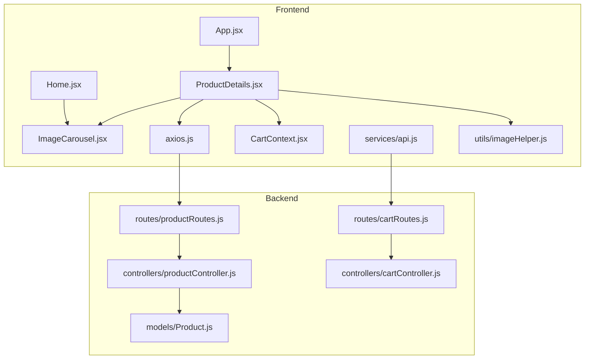
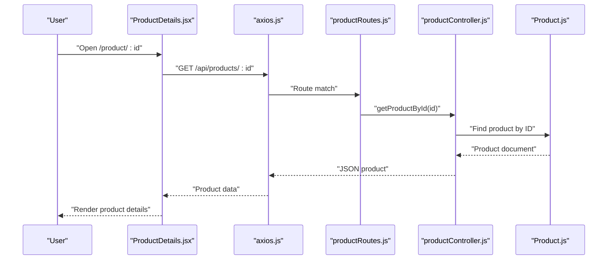
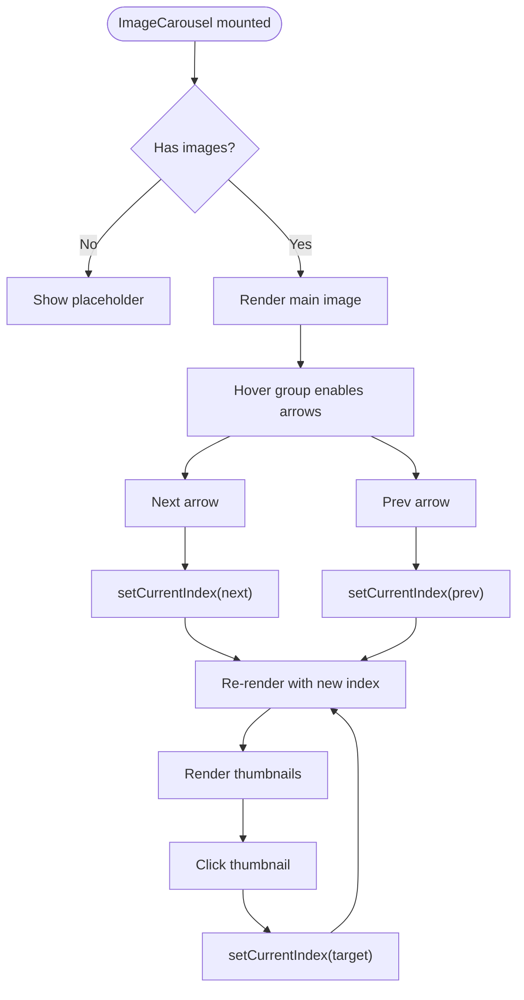
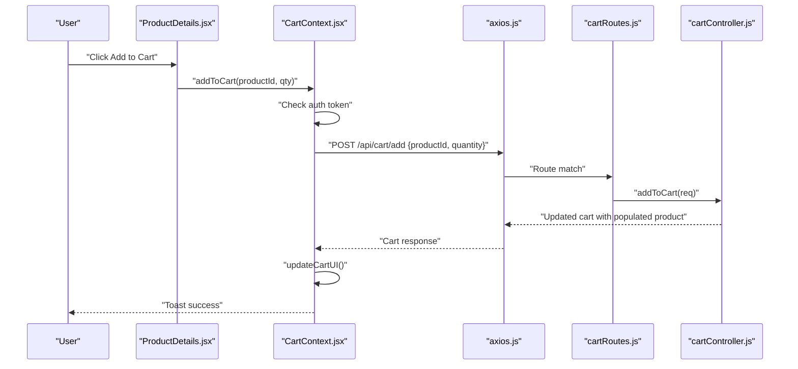
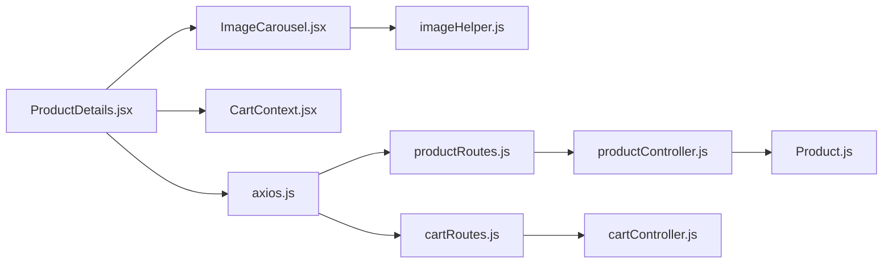

# Product Details & Selection

<cite>
**Referenced Files in This Document**
- [ProductDetails.jsx](file://frontend/src/pages/ProductDetails.jsx)
- [ImageCarousel.jsx](file://frontend/src/components/ImageCarousel.jsx)
- [axios.js](file://frontend/src/api/axios.js)
- [api.js](file://frontend/src/services/api.js)
- [CartContext.jsx](file://frontend/src/context/CartContext.jsx)
- [Cart.jsx](file://frontend/src/pages/Cart.jsx)
- [App.jsx](file://frontend/src/App.jsx)
- [Home.jsx](file://frontend/src/pages/Home.jsx)
- [imageHelper.js](file://frontend/src/utils/imageHelper.js)
- [productController.js](file://backend/controllers/productController.js)
- [cartController.js](file://backend/controllers/cartController.js)
- [productRoutes.js](file://backend/routes/productRoutes.js)
- [cartRoutes.js](file://backend/routes/cartRoutes.js)
- [Product.js](file://backend/models/Product.js)
</cite>

## Table of Contents
1. [Introduction](#introduction)
2. [Project Structure](#project-structure)
3. [Core Components](#core-components)
4. [Architecture Overview](#architecture-overview)
5. [Detailed Component Analysis](#detailed-component-analysis)
6. [Dependency Analysis](#dependency-analysis)
7. [Performance Considerations](#performance-considerations)
8. [Troubleshooting Guide](#troubleshooting-guide)
9. [Conclusion](#conclusion)
10. [Appendices](#appendices)

## Introduction
This document explains the Product Details page implementation, focusing on how product information is fetched and rendered, how the image gallery works with navigation and hover controls, and how the add-to-cart flow integrates with authentication and state. It also covers the product specification section (description, pricing, availability), quantity selection patterns, inventory management integration, recommendations and related suggestions, responsive design and mobile optimization, and accessibility features.

## Project Structure
The Product Details page is implemented in the frontend under the pages directory and leverages shared components and context for cart operations. Backend routes expose product and cart endpoints, while models define product data shape.

**Diagram sources**
- [ProductDetails.jsx:1-80](file://frontend/src/pages/ProductDetails.jsx#L1-L80)
- [ImageCarousel.jsx:1-54](file://frontend/src/components/ImageCarousel.jsx#L1-L54)
- [axios.js:1-17](file://frontend/src/api/axios.js#L1-L17)
- [api.js:1-8](file://frontend/src/services/api.js#L1-L8)
- [CartContext.jsx:1-53](file://frontend/src/context/CartContext.jsx#L1-L53)
- [App.jsx:1-66](file://frontend/src/App.jsx#L1-L66)
- [Home.jsx:1-108](file://frontend/src/pages/Home.jsx#L1-L108)
- [imageHelper.js:1-5](file://frontend/src/utils/imageHelper.js#L1-L5)
- [productController.js:1-127](file://backend/controllers/productController.js#L1-L127)
- [cartController.js:1-38](file://backend/controllers/cartController.js#L1-L38)
- [productRoutes.js:1-23](file://backend/routes/productRoutes.js#L1-L23)
- [cartRoutes.js:1-12](file://backend/routes/cartRoutes.js#L1-L12)
- [Product.js:1-12](file://backend/models/Product.js#L1-L12)

**Section sources**
- [ProductDetails.jsx:1-80](file://frontend/src/pages/ProductDetails.jsx#L1-L80)
- [App.jsx:1-66](file://frontend/src/App.jsx#L1-L66)

## Core Components
- ProductDetails page: Fetches a single product by ID, renders product metadata, image carousel, availability, pricing, and add-to-cart action.
- ImageCarousel: Handles image navigation, prev/next buttons, and thumbnail indicators with hover-triggered controls.
- CartContext: Centralized cart state and actions, including add-to-cart with authentication checks and UI refresh.
- API clients: Axios-based clients configured with auth tokens for secure requests.
- Backend routes and controllers: Expose product retrieval and cart mutation endpoints.

Key implementation references:
- Product fetch and render: [ProductDetails.jsx:11-36](file://frontend/src/pages/ProductDetails.jsx#L11-L36)
- Add-to-cart flow: [ProductDetails.jsx:26-33](file://frontend/src/pages/ProductDetails.jsx#L26-L33), [CartContext.jsx:31-38](file://frontend/src/context/CartContext.jsx#L31-L38)
- Image carousel navigation: [ImageCarousel.jsx:11-13](file://frontend/src/components/ImageCarousel.jsx#L11-L13)
- Image URL normalization: [imageHelper.js:1-5](file://frontend/src/utils/imageHelper.js#L1-L5)
- Backend product endpoint: [productController.js:39-49](file://backend/controllers/productController.js#L39-L49), [productRoutes.js:14-16](file://backend/routes/productRoutes.js#L14-L16)
- Backend cart endpoints: [cartController.js:3-22](file://backend/controllers/cartController.js#L3-L22), [cartRoutes.js:7-10](file://backend/routes/cartRoutes.js#L7-L10)

**Section sources**
- [ProductDetails.jsx:1-80](file://frontend/src/pages/ProductDetails.jsx#L1-L80)
- [ImageCarousel.jsx:1-54](file://frontend/src/components/ImageCarousel.jsx#L1-L54)
- [CartContext.jsx:1-53](file://frontend/src/context/CartContext.jsx#L1-L53)
- [axios.js:1-17](file://frontend/src/api/axios.js#L1-L17)
- [api.js:1-8](file://frontend/src/services/api.js#L1-L8)
- [imageHelper.js:1-5](file://frontend/src/utils/imageHelper.js#L1-L5)
- [productController.js:39-49](file://backend/controllers/productController.js#L39-L49)
- [cartController.js:3-22](file://backend/controllers/cartController.js#L3-L22)
- [productRoutes.js:14-16](file://backend/routes/productRoutes.js#L14-L16)
- [cartRoutes.js:7-10](file://backend/routes/cartRoutes.js#L7-L10)

## Architecture Overview
The Product Details page follows a unidirectional data flow:
- Routing triggers a product fetch via an API client.
- The component renders product metadata and an image carousel.
- Add-to-cart uses CartContext to validate authentication and mutate cart state.
- Backend routes handle product retrieval and cart updates with populated product prices for totals.

**Diagram sources**
- [ProductDetails.jsx:15-24](file://frontend/src/pages/ProductDetails.jsx#L15-L24)
- [axios.js:1-17](file://frontend/src/api/axios.js#L1-L17)
- [productRoutes.js:14-16](file://backend/routes/productRoutes.js#L14-L16)
- [productController.js:39-49](file://backend/controllers/productController.js#L39-L49)
- [Product.js:1-12](file://backend/models/Product.js#L1-L12)

## Detailed Component Analysis

### Product Details Page
Responsibilities:
- Fetch product by route param id.
- Render product category badge, name, price, description, availability indicator, and add-to-cart button.
- Integrate ImageCarousel for image gallery.
- Provide “Back to Collection” navigation.

Implementation highlights:
- Fetch lifecycle: [ProductDetails.jsx:11-24](file://frontend/src/pages/ProductDetails.jsx#L11-L24)
- Rendering layout and content: [ProductDetails.jsx:38-77](file://frontend/src/pages/ProductDetails.jsx#L38-L77)
- Availability and stock rendering: [ProductDetails.jsx:57-62](file://frontend/src/pages/ProductDetails.jsx#L57-L62)
- Add-to-cart handler: [ProductDetails.jsx:26-33](file://frontend/src/pages/ProductDetails.jsx#L26-L33)

Accessibility and UX:
- Category badge and availability use semantic color classes for status indication.
- Disabled state on add-to-cart when out of stock.
- Back link improves navigation context.

**Section sources**
- [ProductDetails.jsx:1-80](file://frontend/src/pages/ProductDetails.jsx#L1-L80)

### Image Gallery (ImageCarousel)
Responsibilities:
- Display current image from product.images array.
- Provide prev/next navigation and thumbnail indicators.
- Show navigation arrows on hover for discoverability.

Implementation highlights:
- Navigation handlers: [ImageCarousel.jsx:11-13](file://frontend/src/components/ImageCarousel.jsx#L11-L13)
- Thumbnail indicators and click handlers: [ImageCarousel.jsx:40-49](file://frontend/src/components/ImageCarousel.jsx#L40-L49)
- Alt text composition for accessibility: [ImageCarousel.jsx](file://frontend/src/components/ImageCarousel.jsx#L20)
- URL normalization: [imageHelper.js:1-5](file://frontend/src/utils/imageHelper.js#L1-L5)

**Diagram sources**
- [ImageCarousel.jsx:1-54](file://frontend/src/components/ImageCarousel.jsx#L1-L54)
- [imageHelper.js:1-5](file://frontend/src/utils/imageHelper.js#L1-L5)

**Section sources**
- [ImageCarousel.jsx:1-54](file://frontend/src/components/ImageCarousel.jsx#L1-L54)
- [imageHelper.js:1-5](file://frontend/src/utils/imageHelper.js#L1-L5)

### Product Specification Section
Displays:
- Category badge
- Product name
- Price
- Description
- Availability status with stock count

Rendering references:
- Category badge and name: [ProductDetails.jsx:50-53](file://frontend/src/pages/ProductDetails.jsx#L50-L53)
- Price: [ProductDetails.jsx](file://frontend/src/pages/ProductDetails.jsx#L54)
- Description: [ProductDetails.jsx](file://frontend/src/pages/ProductDetails.jsx#L55)
- Availability: [ProductDetails.jsx:57-62](file://frontend/src/pages/ProductDetails.jsx#L57-L62)

Stock integration:
- Backend model defines stock field: [Product.js](file://backend/models/Product.js#L9)
- Frontend reads stock to enable/disable add-to-cart: [ProductDetails.jsx:64-70](file://frontend/src/pages/ProductDetails.jsx#L64-L70)

**Section sources**
- [ProductDetails.jsx:50-62](file://frontend/src/pages/ProductDetails.jsx#L50-L62)
- [Product.js](file://backend/models/Product.js#L9)

### Quantity Selection Controls and Inventory Management
Current implementation:
- Add-to-cart uses a fixed quantity of 1 in ProductDetails: [ProductDetails.jsx](file://frontend/src/pages/ProductDetails.jsx#L28)
- Cart mutations accept quantity: [cartController.js](file://backend/controllers/cartController.js#L10)
- CartContext supports quantity parameter: [CartContext.jsx:31-38](file://frontend/src/context/CartContext.jsx#L31-L38)

Recommendations:
- Introduce a quantity selector near the add-to-cart button.
- Validate against stock before adding to cart.
- Use CartContext’s addToCart signature to pass quantity.

**Section sources**
- [ProductDetails.jsx:26-33](file://frontend/src/pages/ProductDetails.jsx#L26-L33)
- [CartContext.jsx:31-38](file://frontend/src/context/CartContext.jsx#L31-L38)
- [cartController.js:9-22](file://backend/controllers/cartController.js#L9-L22)

### Add-to-Cart Functionality with Validation and Feedback
End-to-end flow:
- Authentication check via CartContext: [CartContext.jsx](file://frontend/src/context/CartContext.jsx#L32)
- API call to add item: [CartContext.jsx](file://frontend/src/context/CartContext.jsx#L34)
- UI refresh via updateCartUI: [CartContext.jsx:22-29](file://frontend/src/context/CartContext.jsx#L22-L29)
- User feedback via toast notifications: [CartContext.jsx:35-37](file://frontend/src/context/CartContext.jsx#L35-L37)

Fallback behavior in ProductDetails:
- Direct API call with alert fallback: [ProductDetails.jsx:26-33](file://frontend/src/pages/ProductDetails.jsx#L26-L33)

**Diagram sources**
- [ProductDetails.jsx:26-33](file://frontend/src/pages/ProductDetails.jsx#L26-L33)
- [CartContext.jsx:31-38](file://frontend/src/context/CartContext.jsx#L31-L38)
- [axios.js:1-17](file://frontend/src/api/axios.js#L1-L17)
- [cartRoutes.js](file://backend/routes/cartRoutes.js#L8)
- [cartController.js:9-22](file://backend/controllers/cartController.js#L9-L22)

**Section sources**
- [ProductDetails.jsx:26-33](file://frontend/src/pages/ProductDetails.jsx#L26-L33)
- [CartContext.jsx:31-38](file://frontend/src/context/CartContext.jsx#L31-L38)
- [axios.js:1-17](file://frontend/src/api/axios.js#L1-L17)
- [cartController.js:9-22](file://backend/controllers/cartController.js#L9-L22)
- [cartRoutes.js](file://backend/routes/cartRoutes.js#L8)

### Product Recommendation Systems and Related Suggestions
Current state:
- No explicit recommendation engine is implemented in the Product Details page.
- Home page showcases related products via a grid and links to details: [Home.jsx:78-96](file://frontend/src/pages/Home.jsx#L78-L96)

Recommendations:
- Fetch related products by category or tags from backend.
- Display a small carousel or grid below the main details.
- Use the same ProductCard component pattern for consistency.

**Section sources**
- [Home.jsx:78-96](file://frontend/src/pages/Home.jsx#L78-L96)

### Responsive Design and Mobile Optimization
Patterns observed:
- Grid layout collapses to single column on smaller screens: [ProductDetails.jsx:39-47](file://frontend/src/pages/ProductDetails.jsx#L39-L47)
- Tailwind utilities for padding, spacing, and typography adaptivity: [ProductDetails.jsx:39-77](file://frontend/src/pages/ProductDetails.jsx#L39-L77)
- Hover-triggered navigation arrows in ImageCarousel improve mobile discoverability: [ImageCarousel.jsx:25-38](file://frontend/src/components/ImageCarousel.jsx#L25-L38)

Best practices:
- Prefer mobile-first breakpoints and minimal interactivity for small screens.
- Ensure touch-friendly targets for carousel navigation and add-to-cart.

**Section sources**
- [ProductDetails.jsx:39-77](file://frontend/src/pages/ProductDetails.jsx#L39-L77)
- [ImageCarousel.jsx:25-38](file://frontend/src/components/ImageCarousel.jsx#L25-L38)

### Accessibility Features
Observed:
- Proper alt text composition for images: [ImageCarousel.jsx](file://frontend/src/components/ImageCarousel.jsx#L20)
- ARIA label for thumbnail buttons: [ImageCarousel.jsx](file://frontend/src/components/ImageCarousel.jsx#L46)
- Semantic color usage for availability status: [ProductDetails.jsx:59-61](file://frontend/src/pages/ProductDetails.jsx#L59-L61)
- Disabled button states for out-of-stock: [ProductDetails.jsx](file://frontend/src/pages/ProductDetails.jsx#L66)

Recommendations:
- Add role and aria-live regions for dynamic content updates.
- Ensure keyboard navigation for carousel controls.
- Provide focus-visible styles for interactive elements.

**Section sources**
- [ImageCarousel.jsx:20-46](file://frontend/src/components/ImageCarousel.jsx#L20-L46)
- [ProductDetails.jsx:59-61](file://frontend/src/pages/ProductDetails.jsx#L59-L61)
- [ProductDetails.jsx](file://frontend/src/pages/ProductDetails.jsx#L66)

## Dependency Analysis
Frontend dependencies:
- ProductDetails depends on axios for product fetch and CartContext for add-to-cart.
- ImageCarousel depends on imageHelper for URL normalization.
- CartContext depends on axios and exposes a unified API for cart operations.

Backend dependencies:
- productRoutes delegates to productController.
- cartRoutes delegates to cartController.
- productController uses Product model.

**Diagram sources**
- [ProductDetails.jsx:1-80](file://frontend/src/pages/ProductDetails.jsx#L1-L80)
- [ImageCarousel.jsx:1-54](file://frontend/src/components/ImageCarousel.jsx#L1-L54)
- [axios.js:1-17](file://frontend/src/api/axios.js#L1-L17)
- [api.js:1-8](file://frontend/src/services/api.js#L1-L8)
- [CartContext.jsx:1-53](file://frontend/src/context/CartContext.jsx#L1-L53)
- [imageHelper.js:1-5](file://frontend/src/utils/imageHelper.js#L1-L5)
- [productRoutes.js:1-23](file://backend/routes/productRoutes.js#L1-L23)
- [cartRoutes.js:1-12](file://backend/routes/cartRoutes.js#L1-L12)
- [productController.js:1-127](file://backend/controllers/productController.js#L1-L127)
- [cartController.js:1-38](file://backend/controllers/cartController.js#L1-L38)
- [Product.js:1-12](file://backend/models/Product.js#L1-L12)

**Section sources**
- [ProductDetails.jsx:1-80](file://frontend/src/pages/ProductDetails.jsx#L1-L80)
- [ImageCarousel.jsx:1-54](file://frontend/src/components/ImageCarousel.jsx#L1-L54)
- [axios.js:1-17](file://frontend/src/api/axios.js#L1-L17)
- [api.js:1-8](file://frontend/src/services/api.js#L1-L8)
- [CartContext.jsx:1-53](file://frontend/src/context/CartContext.jsx#L1-L53)
- [imageHelper.js:1-5](file://frontend/src/utils/imageHelper.js#L1-L5)
- [productController.js:1-127](file://backend/controllers/productController.js#L1-L127)
- [cartController.js:1-38](file://backend/controllers/cartController.js#L1-L38)
- [productRoutes.js:1-23](file://backend/routes/productRoutes.js#L1-L23)
- [cartRoutes.js:1-12](file://backend/routes/cartRoutes.js#L1-L12)
- [Product.js:1-12](file://backend/models/Product.js#L1-L12)

## Performance Considerations
- Lazy-load images beyond the first viewport in the carousel.
- Debounce search and category filters on the home page to reduce unnecessary requests.
- Cache product images with appropriate CDN headers.
- Minimize re-renders by memoizing product props and image URLs.
- Use skeleton loaders during initial product fetch.

## Troubleshooting Guide
Common issues and resolutions:
- Product not found: Ensure the backend route returns 404 when product does not exist: [productController.js:42-44](file://backend/controllers/productController.js#L42-L44)
- Authentication errors on add-to-cart: Verify token presence and interceptor behavior: [axios.js:4-16](file://frontend/src/api/axios.js#L4-L16), [CartContext.jsx](file://frontend/src/context/CartContext.jsx#L32)
- Empty or missing images: Confirm imageHelper normalization and backend image paths: [imageHelper.js:1-5](file://frontend/src/utils/imageHelper.js#L1-L5)
- Cart not updating after add: Check updateCartUI invocation and response population: [CartContext.jsx:22-29](file://frontend/src/context/CartContext.jsx#L22-L29), [cartController.js](file://backend/controllers/cartController.js#L21)

**Section sources**
- [productController.js:42-44](file://backend/controllers/productController.js#L42-L44)
- [axios.js:4-16](file://frontend/src/api/axios.js#L4-L16)
- [CartContext.jsx](file://frontend/src/context/CartContext.jsx#L32)
- [imageHelper.js:1-5](file://frontend/src/utils/imageHelper.js#L1-L5)
- [CartContext.jsx:22-29](file://frontend/src/context/CartContext.jsx#L22-L29)
- [cartController.js](file://backend/controllers/cartController.js#L21)

## Conclusion
The Product Details page integrates cleanly with the image carousel, cart context, and backend APIs. It displays essential product information and provides a functional add-to-cart flow with authentication checks. Enhancements such as quantity selection, inventory validation, and related product suggestions would further improve the user experience while maintaining responsive design and accessibility standards.

## Appendices

### Example: Product Data Fetching and State Management
- Fetch product by ID: [ProductDetails.jsx:15-24](file://frontend/src/pages/ProductDetails.jsx#L15-L24)
- Render loading and empty states: [ProductDetails.jsx:35-36](file://frontend/src/pages/ProductDetails.jsx#L35-L36)
- Populate cart state after add: [CartContext.jsx:22-29](file://frontend/src/context/CartContext.jsx#L22-L29)

### Example: User Interaction Patterns
- Carousel navigation: [ImageCarousel.jsx:11-13](file://frontend/src/components/ImageCarousel.jsx#L11-L13)
- Add-to-cart with feedback: [CartContext.jsx:31-38](file://frontend/src/context/CartContext.jsx#L31-L38)
- Back to collection: [ProductDetails.jsx:40-42](file://frontend/src/pages/ProductDetails.jsx#L40-L42)