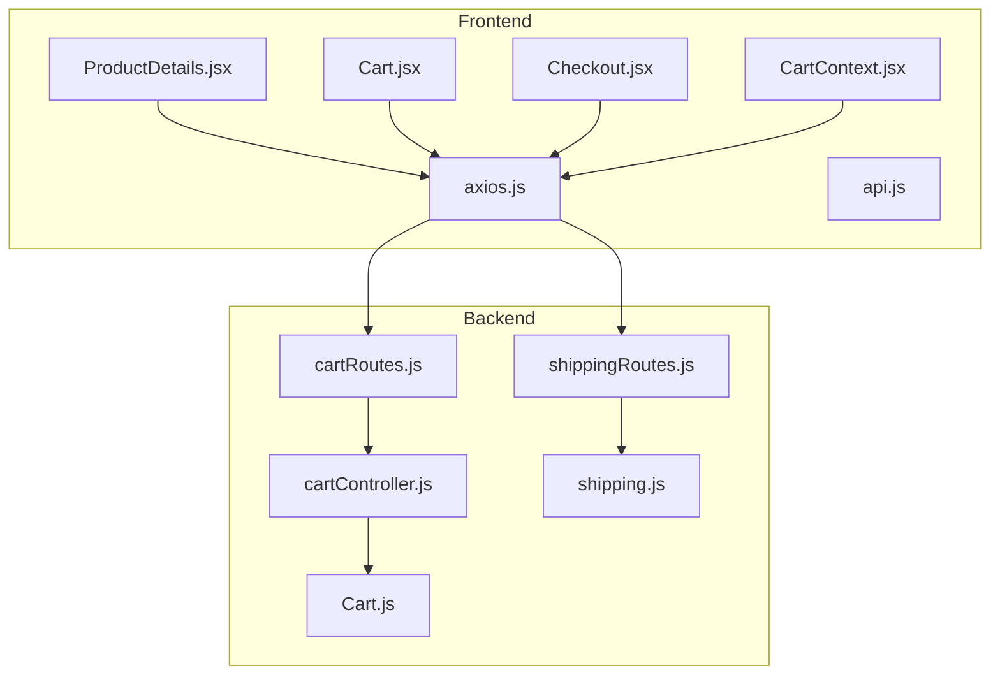
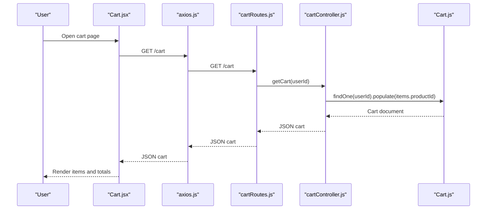
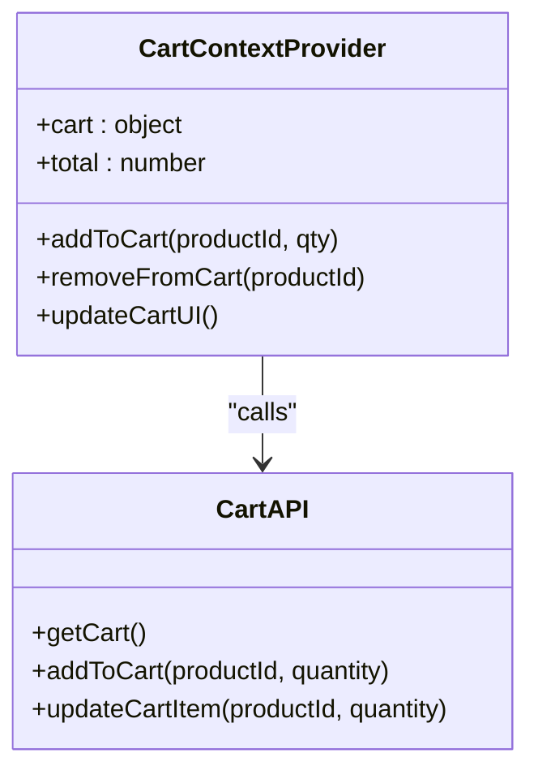
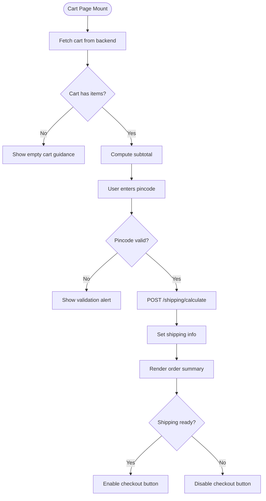
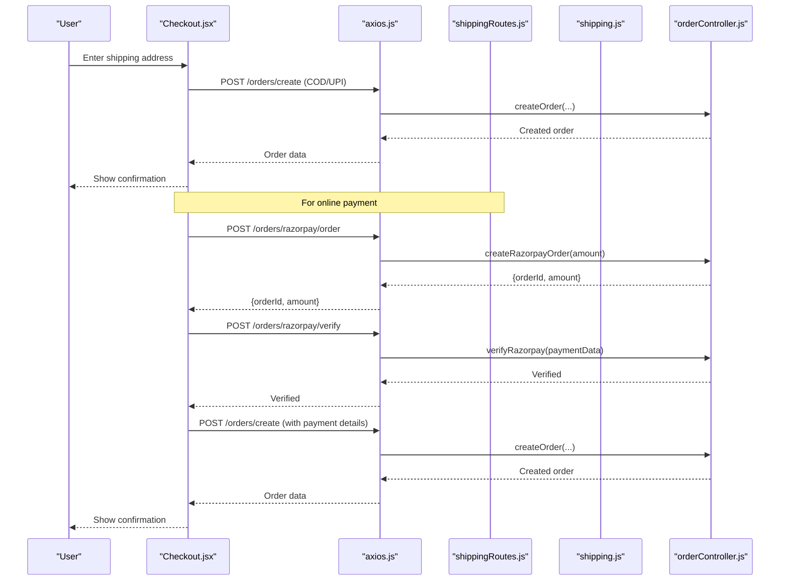
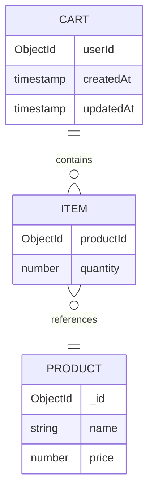
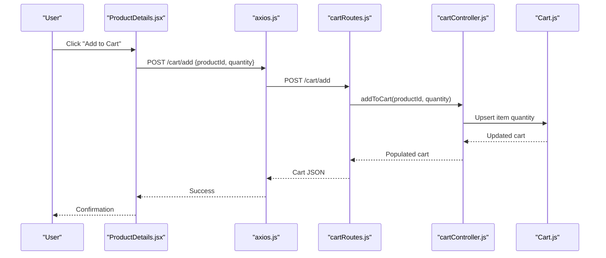
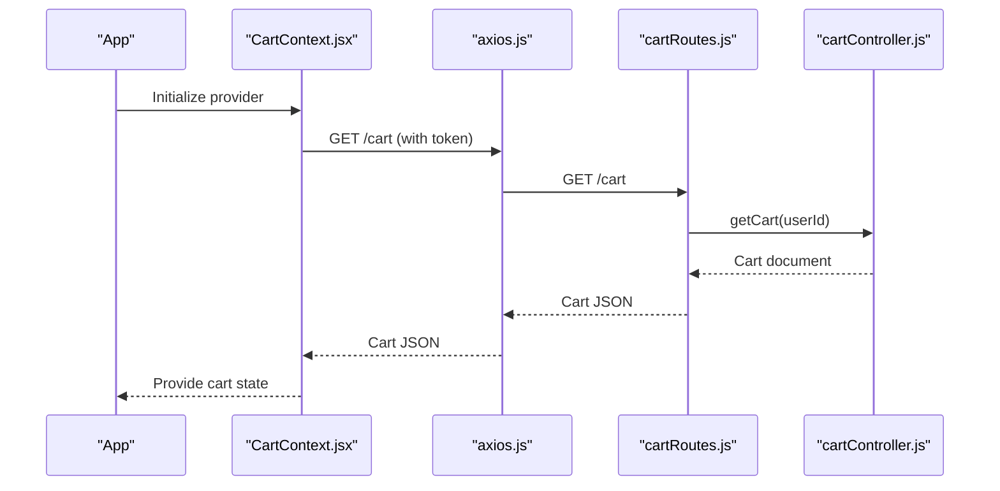
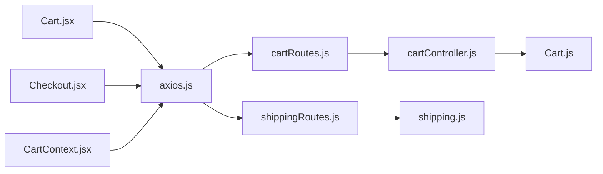

# Shopping Cart Management

<cite>
**Referenced Files in This Document**
- [CartContext.jsx](file://frontend/src/context/CartContext.jsx)
- [Cart.jsx](file://frontend/src/pages/Cart.jsx)
- [Checkout.jsx](file://frontend/src/pages/Checkout.jsx)
- [axios.js](file://frontend/src/api/axios.js)
- [api.js](file://frontend/src/services/api.js)
- [cartController.js](file://backend/controllers/cartController.js)
- [Cart.js](file://backend/models/Cart.js)
- [cartRoutes.js](file://backend/routes/cartRoutes.js)
- [shippingRoutes.js](file://backend/routes/shippingRoutes.js)
- [shipping.js](file://backend/config/shipping.js)
- [ProductDetails.jsx](file://frontend/src/pages/ProductDetails.jsx)
</cite>

## Table of Contents
1. [Introduction](#introduction)
2. [Project Structure](#project-structure)
3. [Core Components](#core-components)
4. [Architecture Overview](#architecture-overview)
5. [Detailed Component Analysis](#detailed-component-analysis)
6. [Dependency Analysis](#dependency-analysis)
7. [Performance Considerations](#performance-considerations)
8. [Troubleshooting Guide](#troubleshooting-guide)
9. [Conclusion](#conclusion)

## Introduction
This document explains the shopping cart functionality end-to-end. It covers the cart page implementation with item listing, quantity adjustment, and price calculation, the CartContext provider for global cart state management, item removal, cart persistence across sessions, quantity modification controls with validation and inventory checking, cart totals including subtotal, taxes, and shipping estimates, empty cart state handling, cart item synchronization with backend storage, examples of cart state updates, local storage integration, cart item validation, and user experience patterns for cart management and checkout initiation.

## Project Structure
The cart system spans frontend React components and backend APIs:
- Frontend: Cart page, checkout page, cart context provider, API client with interceptors
- Backend: Cart controller and model, shipping calculation utilities, cart routes

**Diagram sources**
- [CartContext.jsx:1-53](file://frontend/src/context/CartContext.jsx#L1-L53)
- [Cart.jsx:1-152](file://frontend/src/pages/Cart.jsx#L1-L152)
- [Checkout.jsx:1-301](file://frontend/src/pages/Checkout.jsx#L1-L301)
- [axios.js:1-17](file://frontend/src/api/axios.js#L1-L17)
- [api.js:1-8](file://frontend/src/services/api.js#L1-L8)
- [cartRoutes.js:1-12](file://backend/routes/cartRoutes.js#L1-L12)
- [cartController.js:1-38](file://backend/controllers/cartController.js#L1-L38)
- [Cart.js:1-12](file://backend/models/Cart.js#L1-L12)
- [shippingRoutes.js:1-32](file://backend/routes/shippingRoutes.js#L1-L32)
- [shipping.js:1-73](file://backend/config/shipping.js#L1-L73)

**Section sources**
- [CartContext.jsx:1-53](file://frontend/src/context/CartContext.jsx#L1-L53)
- [Cart.jsx:1-152](file://frontend/src/pages/Cart.jsx#L1-L152)
- [Checkout.jsx:1-301](file://frontend/src/pages/Checkout.jsx#L1-L301)
- [axios.js:1-17](file://frontend/src/api/axios.js#L1-L17)
- [api.js:1-8](file://frontend/src/services/api.js#L1-L8)
- [cartRoutes.js:1-12](file://backend/routes/cartRoutes.js#L1-L12)
- [cartController.js:1-38](file://backend/controllers/cartController.js#L1-L38)
- [Cart.js:1-12](file://backend/models/Cart.js#L1-L12)
- [shippingRoutes.js:1-32](file://backend/routes/shippingRoutes.js#L1-L32)
- [shipping.js:1-73](file://backend/config/shipping.js#L1-L73)

## Core Components
- CartContext provider manages global cart state, persists to backend, and exposes actions to add/remove items and compute totals.
- Cart page lists items, computes subtotal and total, checks shipping eligibility via pincode, and navigates to checkout.
- Checkout page loads current cart, validates address, supports multiple payment methods, and creates orders.
- Backend cart controller and model manage cart persistence per user, including item addition, updates, and removal.
- Shipping utilities calculate charges based on pincode zones and thresholds.

Key capabilities:
- Session persistence: cart loaded from backend on app start using stored tokens.
- Item removal: updates backend and refreshes UI.
- Quantity handling: backend enforces minimum quantity; frontend triggers backend updates.
- Shipping estimation: frontend requests backend shipping service with cart total and pincode.
- Order creation: backend derives items from cart and constructs order records.

**Section sources**
- [CartContext.jsx:7-51](file://frontend/src/context/CartContext.jsx#L7-L51)
- [Cart.jsx:6-151](file://frontend/src/pages/Cart.jsx#L6-L151)
- [Checkout.jsx:7-300](file://frontend/src/pages/Checkout.jsx#L7-L300)
- [cartController.js:3-32](file://backend/controllers/cartController.js#L3-L32)
- [Cart.js:3-11](file://backend/models/Cart.js#L3-L11)
- [shippingRoutes.js:6-30](file://backend/routes/shippingRoutes.js#L6-L30)
- [shipping.js:31-73](file://backend/config/shipping.js#L31-L73)

## Architecture Overview
The cart architecture follows a clear separation of concerns:
- Frontend components call REST endpoints via an Axios instance configured with Authorization headers.
- Backend routes delegate to controllers that operate on the Cart model, ensuring per-user cart isolation.
- Shipping calculations are handled by a dedicated utility module and exposed via a route.

**Diagram sources**
- [Cart.jsx:17-26](file://frontend/src/pages/Cart.jsx#L17-L26)
- [axios.js:4-8](file://frontend/src/api/axios.js#L4-L8)
- [cartRoutes.js:7-7](file://backend/routes/cartRoutes.js#L7-L7)
- [cartController.js:3-7](file://backend/controllers/cartController.js#L3-L7)
- [Cart.js:3-11](file://backend/models/Cart.js#L3-L11)

## Detailed Component Analysis

### CartContext Provider
The CartContext provider centralizes cart state and actions:
- Initializes cart from backend on app start using stored token.
- Exposes add/remove actions that call backend endpoints and refresh UI.
- Computes total cost from current cart items.

Implementation highlights:
- Token-based initialization ensures session persistence.
- updateCartUI re-fetches cart after mutations to keep UI synchronized.
- addToCart and removeFromCart trigger backend updates and show user feedback.

**Diagram sources**
- [CartContext.jsx:7-51](file://frontend/src/context/CartContext.jsx#L7-L51)

**Section sources**
- [CartContext.jsx:7-51](file://frontend/src/context/CartContext.jsx#L7-L51)

### Cart Page Implementation
The cart page renders items, computes totals, and handles shipping estimation:
- Loads cart on mount and displays loading state.
- Calculates subtotal from item prices and quantities.
- Validates pincode length and requests shipping cost from backend.
- Shows order summary with subtotal, shipping, and total.
- Disables checkout until shipping info is available.

**Diagram sources**
- [Cart.jsx:13-53](file://frontend/src/pages/Cart.jsx#L13-L53)

**Section sources**
- [Cart.jsx:6-151](file://frontend/src/pages/Cart.jsx#L6-L151)

### Checkout Page and Order Creation
The checkout page validates address, computes totals, and processes payments:
- Loads cart and validates user presence.
- Uses shipping info passed from cart page to compute totals.
- Supports multiple payment methods: online (Razorpay), COD, and manual UPI.
- Creates orders via backend endpoints and navigates to confirmation.

**Diagram sources**
- [Checkout.jsx:67-137](file://frontend/src/pages/Checkout.jsx#L67-L137)
- [shippingRoutes.js:6-30](file://backend/routes/shippingRoutes.js#L6-L30)
- [shipping.js:52-73](file://backend/config/shipping.js#L52-L73)
- [orderController.js:84-133](file://backend/controllers/orderController.js#L84-L133)

**Section sources**
- [Checkout.jsx:7-300](file://frontend/src/pages/Checkout.jsx#L7-L300)

### Backend Cart Management
Backend ensures robust cart persistence and validation:
- Cart retrieval populates product references for accurate pricing.
- Add-to-cart increments existing item quantities or adds new items.
- Update-cart removes items when quantity reaches zero.
- Clear-cart resets user cart to empty.

**Diagram sources**
- [Cart.js:3-11](file://backend/models/Cart.js#L3-L11)
- [cartController.js:3-32](file://backend/controllers/cartController.js#L3-L32)

**Section sources**
- [cartController.js:3-32](file://backend/controllers/cartController.js#L3-L32)
- [Cart.js:3-11](file://backend/models/Cart.js#L3-L11)
- [cartRoutes.js:7-10](file://backend/routes/cartRoutes.js#L7-L10)

### Shipping Estimation and Calculation
Shipping estimation integrates frontend UX with backend logic:
- Frontend validates pincode and sends subtotal to backend.
- Backend selects zone based on pincode and applies free shipping thresholds.
- Returns shipping charge, zone, message, and estimated delivery days.

**Diagram sources**
- [Cart.jsx:35-53](file://frontend/src/pages/Cart.jsx#L35-L53)
- [shippingRoutes.js:8-30](file://backend/routes/shippingRoutes.js#L8-L30)
- [shipping.js:31-73](file://backend/config/shipping.js#L31-L73)

**Section sources**
- [Cart.jsx:35-53](file://frontend/src/pages/Cart.jsx#L35-L53)
- [shippingRoutes.js:8-30](file://backend/routes/shippingRoutes.js#L8-L30)
- [shipping.js:31-73](file://backend/config/shipping.js#L31-L73)

### Quantity Modification Controls and Validation
Quantity modification is coordinated between frontend and backend:
- Frontend triggers backend updates via add and update endpoints.
- Backend enforces minimum quantity and removes items when quantity drops to zero.
- Product details page prevents adding out-of-stock items.

**Diagram sources**
- [ProductDetails.jsx:26-33](file://frontend/src/pages/ProductDetails.jsx#L26-L33)
- [cartRoutes.js:8-9](file://backend/routes/cartRoutes.js#L8-L9)
- [cartController.js:9-22](file://backend/controllers/cartController.js#L9-L22)
- [Cart.js:7-7](file://backend/models/Cart.js#L7-L7)

**Section sources**
- [ProductDetails.jsx:26-33](file://frontend/src/pages/ProductDetails.jsx#L26-L33)
- [cartController.js:9-22](file://backend/controllers/cartController.js#L9-L22)
- [Cart.js:7-7](file://backend/models/Cart.js#L7-L7)

### Cart Persistence Across Sessions
Persistence relies on:
- Authorization interceptor attaching token to requests.
- CartContext fetching cart on app start when a token exists.
- Cart page also fetching cart on mount for redundancy.

**Diagram sources**
- [CartContext.jsx:10-20](file://frontend/src/context/CartContext.jsx#L10-L20)
- [axios.js:4-8](file://frontend/src/api/axios.js#L4-L8)
- [cartRoutes.js:7-7](file://backend/routes/cartRoutes.js#L7-L7)
- [cartController.js:3-7](file://backend/controllers/cartController.js#L3-L7)

**Section sources**
- [CartContext.jsx:10-20](file://frontend/src/context/CartContext.jsx#L10-L20)
- [axios.js:4-8](file://frontend/src/api/axios.js#L4-L8)
- [cartController.js:3-7](file://backend/controllers/cartController.js#L3-L7)

### Empty Cart State Handling and User Guidance
Empty cart state:
- Cart page shows a centered message and a "Continue Shopping" link.
- Checkout page redirects to login if user is not authenticated.

**Section sources**
- [Cart.jsx:61-66](file://frontend/src/pages/Cart.jsx#L61-L66)
- [Checkout.jsx:22-31](file://frontend/src/pages/Checkout.jsx#L22-L31)

### Cart Item Synchronization with Backend Storage
Synchronization occurs through:
- Initial fetch on app start and page mount.
- After add/remove actions, UI refreshes by re-fetching cart.
- Backend operations ensure atomic updates and referential integrity.

**Section sources**
- [CartContext.jsx:22-29](file://frontend/src/context/CartContext.jsx#L22-L29)
- [Cart.jsx:17-26](file://frontend/src/pages/Cart.jsx#L17-L26)
- [cartController.js:24-32](file://backend/controllers/cartController.js#L24-L32)

### Examples of Cart State Updates, Local Storage Integration, and Validation
- Local storage integration: Authorization interceptor reads token; logout on 401 response.
- State updates: CartContext manages items and computed totals; Cart page recomputes subtotal and total.
- Validation: ProductDetails disables add-to-cart when stock is zero; Cart page validates pincode length.

**Section sources**
- [axios.js:4-16](file://frontend/src/api/axios.js#L4-L16)
- [CartContext.jsx:44-44](file://frontend/src/context/CartContext.jsx#L44-L44)
- [Cart.jsx:28-33](file://frontend/src/pages/Cart.jsx#L28-L33)
- [ProductDetails.jsx:64-70](file://frontend/src/pages/ProductDetails.jsx#L64-L70)

### User Experience Patterns for Cart Management and Checkout Initiation
- Immediate feedback: toasts for add/remove actions.
- Progressive disclosure: shipping estimator appears after pincode submission.
- Clear CTAs: "Proceed to Checkout" enabled only when shipping info is available.
- Multi-method checkout: online, COD, and manual UPI options with appropriate UX.

**Section sources**
- [CartContext.jsx:32-42](file://frontend/src/context/CartContext.jsx#L32-L42)
- [Cart.jsx:99-144](file://frontend/src/pages/Cart.jsx#L99-L144)
- [Checkout.jsx:238-295](file://frontend/src/pages/Checkout.jsx#L238-L295)

## Dependency Analysis
Frontend-backend dependencies:
- Cart page depends on cart and shipping routes.
- Checkout depends on order and shipping routes.
- CartContext depends on cart routes.
- Backend routes depend on controllers and models.
- Shipping routes depend on shipping utilities.

**Diagram sources**
- [axios.js:1-17](file://frontend/src/api/axios.js#L1-L17)
- [cartRoutes.js:1-12](file://backend/routes/cartRoutes.js#L1-L12)
- [cartController.js:1-38](file://backend/controllers/cartController.js#L1-L38)
- [Cart.js:1-12](file://backend/models/Cart.js#L1-L12)
- [shippingRoutes.js:1-32](file://backend/routes/shippingRoutes.js#L1-L32)
- [shipping.js:1-73](file://backend/config/shipping.js#L1-L73)
- [Cart.jsx:1-152](file://frontend/src/pages/Cart.jsx#L1-L152)
- [Checkout.jsx:1-301](file://frontend/src/pages/Checkout.jsx#L1-L301)
- [CartContext.jsx:1-53](file://frontend/src/context/CartContext.jsx#L1-L53)

**Section sources**
- [axios.js:1-17](file://frontend/src/api/axios.js#L1-L17)
- [cartRoutes.js:1-12](file://backend/routes/cartRoutes.js#L1-L12)
- [cartController.js:1-38](file://backend/controllers/cartController.js#L1-L38)
- [Cart.js:1-12](file://backend/models/Cart.js#L1-L12)
- [shippingRoutes.js:1-32](file://backend/routes/shippingRoutes.js#L1-L32)
- [shipping.js:1-73](file://backend/config/shipping.js#L1-L73)
- [Cart.jsx:1-152](file://frontend/src/pages/Cart.jsx#L1-L152)
- [Checkout.jsx:1-301](file://frontend/src/pages/Checkout.jsx#L1-L301)
- [CartContext.jsx:1-53](file://frontend/src/context/CartContext.jsx#L1-L53)

## Performance Considerations
- Minimize re-renders: compute totals in components using memoized values derived from cart items.
- Debounce shipping estimation: avoid repeated requests while user types pincode.
- Efficient backend queries: ensure cart population and shipping zone lookups are indexed.
- Lazy loading: defer heavy images in cart items until visible.

## Troubleshooting Guide
Common issues and resolutions:
- Unauthorized access: 401 responses remove token; redirect to login.
- Empty cart on reload: ensure token is present and cart fetch succeeds.
- Shipping calculation errors: verify pincode format and backend availability.
- Payment failures: confirm address validation and payment method selection.

**Section sources**
- [axios.js:10-16](file://frontend/src/api/axios.js#L10-L16)
- [CartContext.jsx:10-20](file://frontend/src/context/CartContext.jsx#L10-L20)
- [shippingRoutes.js:12-29](file://backend/routes/shippingRoutes.js#L12-L29)

## Conclusion
The cart system provides a cohesive, session-aware shopping experience with robust backend persistence, clear UI patterns, and flexible payment options. Frontend components coordinate with backend APIs to maintain accurate state, while shipping logic offers transparent cost estimation. The design emphasizes user feedback, validation, and seamless transitions from cart to checkout.