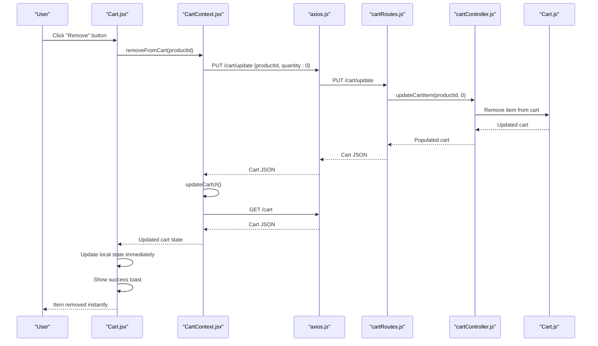
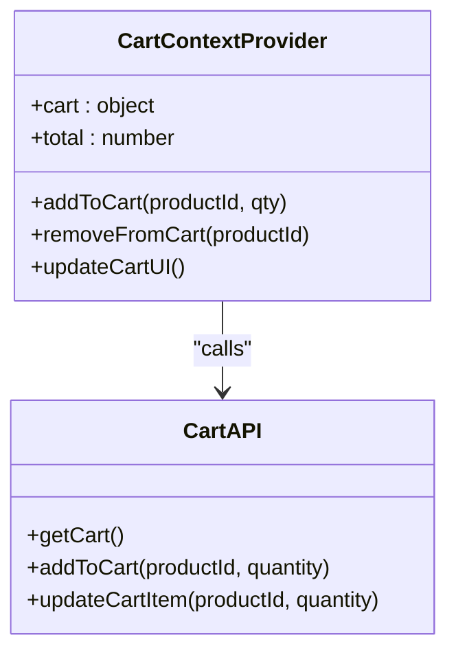
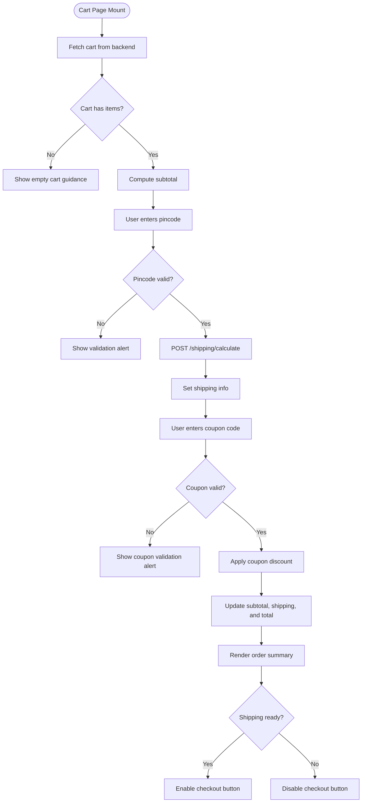
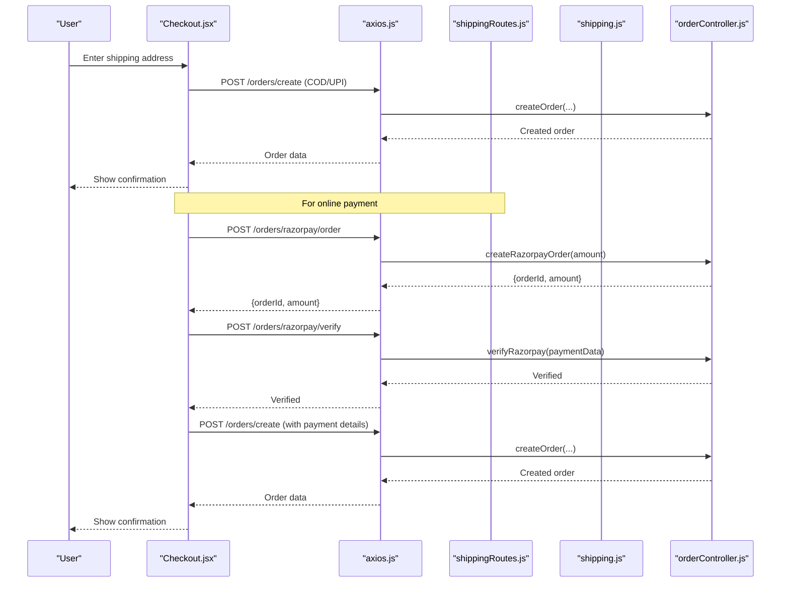
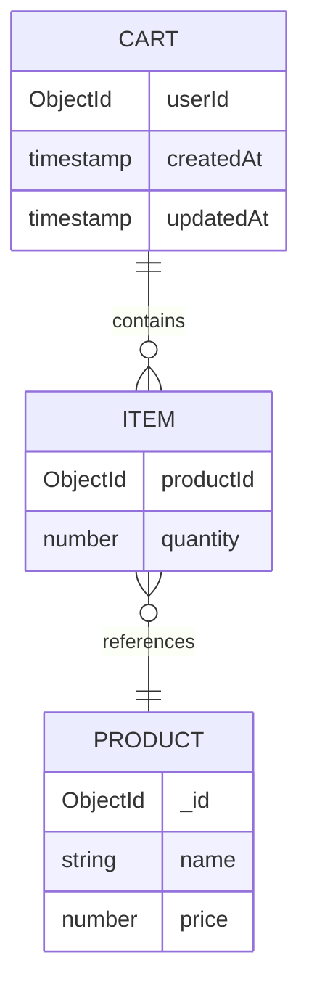
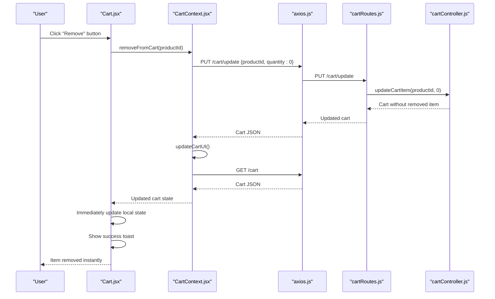
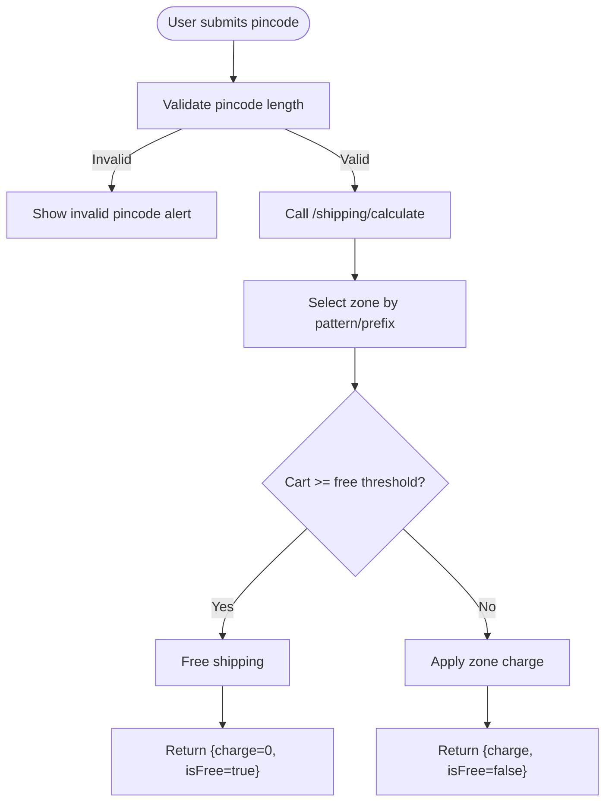
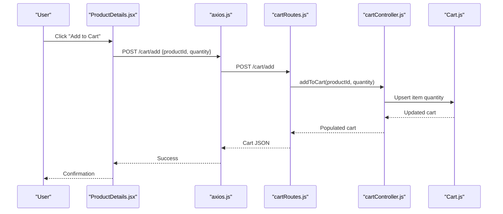
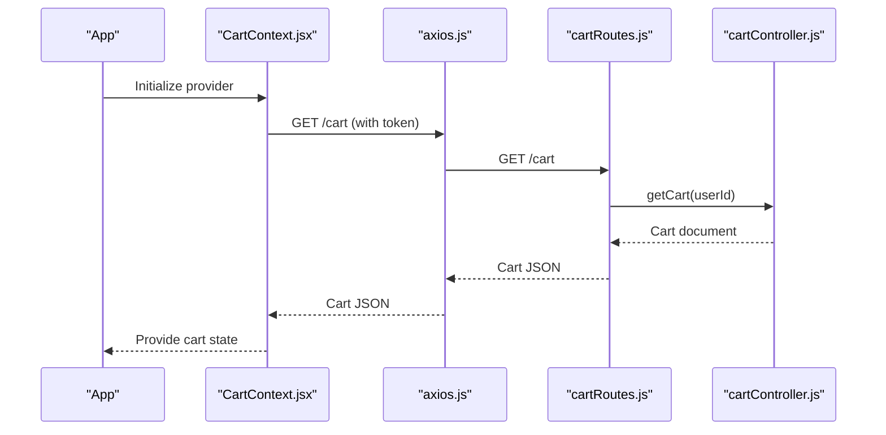
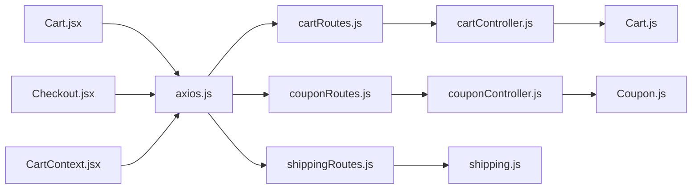

# Shopping Cart Management

<cite>
**Referenced Files in This Document**
- [CartContext.jsx](file://frontend/src/context/CartContext.jsx)
- [Cart.jsx](file://frontend/src/pages/Cart.jsx)
- [Checkout.jsx](file://frontend/src/pages/Checkout.jsx)
- [ProductDetails.jsx](file://frontend/src/pages/ProductDetails.jsx)
- [axios.js](file://frontend/src/api/axios.js)
- [cartController.js](file://backend/controllers/cartController.js)
- [cartRoutes.js](file://backend/routes/cartRoutes.js)
- [Cart.js](file://backend/models/Cart.js)
- [couponController.js](file://backend/controllers/couponController.js)
- [couponRoutes.js](file://backend/routes/couponRoutes.js)
- [Coupon.js](file://backend/models/Coupon.js)
- [shippingRoutes.js](file://backend/routes/shippingRoutes.js)
- [shipping.js](file://backend/config/shipping.js)
- [seedCoupons.js](file://backend/seedCoupons.js)
</cite>

## Update Summary
**Changes Made**
- Enhanced cart item removal functionality with handleRemoveItem function that integrates with existing removeFromCart and updateCartUI functions
- Added immediate UI updates and proper error handling with toast notifications for seamless user experience
- Implemented asynchronous operation handling for item removal from cart page
- Improved cart state synchronization with dual-layer approach (backend + frontend)

## Table of Contents
1. [Introduction](#introduction)
2. [Project Structure](#project-structure)
3. [Core Components](#core-components)
4. [Architecture Overview](#architecture-overview)
5. [Detailed Component Analysis](#detailed-component-analysis)
6. [Enhanced Cart Item Removal](#enhanced-cart-item-removal)
7. [Coupon System Integration](#coupon-system-integration)
8. [Dependency Analysis](#dependency-analysis)
9. [Performance Considerations](#performance-considerations)
10. [Troubleshooting Guide](#troubleshooting-guide)
11. [Conclusion](#conclusion)

## Introduction
This document explains the shopping cart functionality end-to-end. It covers the cart page implementation with item listing, quantity adjustment, and price calculation, the CartContext provider for global cart state management, item removal with enhanced user experience, cart persistence across sessions, quantity modification controls with validation and inventory checking, cart totals including subtotal, taxes, shipping estimates, and coupon discounts, empty cart state handling, cart item synchronization with backend storage, examples of cart state updates, local storage integration, cart item validation, and user experience patterns for cart management and checkout initiation.

**Updated** Enhanced with comprehensive cart item removal functionality featuring immediate UI updates, proper error handling, and seamless integration with existing cart management system.

## Project Structure
The cart system spans frontend React components and backend APIs with integrated coupon management:
- Frontend: Cart page with enhanced item removal, checkout page, cart context provider, API client with interceptors
- Backend: Cart controller and model, coupon controller and model, shipping calculation utilities, cart and coupon routes

```mermaid
graph TB
subgraph "Frontend"
CC["CartContext.jsx"]
CART["Cart.jsx"]
CHECKOUT["Checkout.jsx"]
AXIOS["axios.js"]
PD["ProductDetails.jsx"]
END
subgraph "Backend"
ROUTES_CART["cartRoutes.js"]
CTRL_CART["cartController.js"]
MODEL_CART["Cart.js"]
ROUTES_COUPON["couponRoutes.js"]
CTRL_COUPON["couponController.js"]
MODEL_COUPON["Coupon.js"]
ROUTES_SHIP["shippingRoutes.js"]
UTIL_SHIP["shipping.js"]
END
PD --> AXIOS
CART --> AXIOS
CHECKOUT --> AXIOS
CC --> AXIOS
AXIOS --> ROUTES_CART
AXIOS --> ROUTES_COUPON
AXIOS --> ROUTES_SHIP
ROUTES_CART --> CTRL_CART
CTRL_CART --> MODEL_CART
ROUTES_COUPON --> CTRL_COUPON
CTRL_COUPON --> MODEL_COUPON
ROUTES_SHIP --> UTIL_SHIP
```

**Diagram sources**
- [CartContext.jsx:1-52](file://frontend/src/context/CartContext.jsx#L1-L52)
- [Cart.jsx:1-265](file://frontend/src/pages/Cart.jsx#L1-L265)
- [Checkout.jsx:1-301](file://frontend/src/pages/Checkout.jsx#L1-L301)
- [axios.js:1-17](file://frontend/src/api/axios.js#L1-L17)
- [cartRoutes.js:1-12](file://backend/routes/cartRoutes.js#L1-L12)
- [cartController.js:1-38](file://backend/controllers/cartController.js#L1-L38)
- [Cart.js:1-12](file://backend/models/Cart.js#L1-L12)
- [couponRoutes.js:1-17](file://backend/routes/couponRoutes.js#L1-L17)
- [couponController.js:1-98](file://backend/controllers/couponController.js#L1-L98)
- [Coupon.js:1-36](file://backend/models/Coupon.js#L1-L36)
- [shippingRoutes.js:1-32](file://backend/routes/shippingRoutes.js#L1-L32)
- [shipping.js:1-73](file://backend/config/shipping.js#L1-L73)

**Section sources**
- [CartContext.jsx:1-52](file://frontend/src/context/CartContext.jsx#L1-L52)
- [Cart.jsx:1-265](file://frontend/src/pages/Cart.jsx#L1-L265)
- [Checkout.jsx:1-301](file://frontend/src/pages/Checkout.jsx#L1-L301)
- [axios.js:1-17](file://frontend/src/api/axios.js#L1-L17)
- [cartRoutes.js:1-12](file://backend/routes/cartRoutes.js#L1-L12)
- [cartController.js:1-38](file://backend/controllers/cartController.js#L1-L38)
- [Cart.js:1-12](file://backend/models/Cart.js#L1-L12)
- [couponRoutes.js:1-17](file://backend/routes/couponRoutes.js#L1-L17)
- [couponController.js:1-98](file://backend/controllers/couponController.js#L1-L98)
- [Coupon.js:1-36](file://backend/models/Coupon.js#L1-L36)
- [shippingRoutes.js:1-32](file://backend/routes/shippingRoutes.js#L1-L32)
- [shipping.js:1-73](file://backend/config/shipping.js#L1-L73)

## Core Components
- CartContext provider manages global cart state, persists to backend, and exposes actions to add/remove items and compute totals.
- Cart page lists items with enhanced removal functionality, computes subtotal and total, checks shipping eligibility via pincode, integrates coupon validation and discount application, and navigates to checkout.
- Checkout page loads current cart with coupon information, validates address, supports multiple payment methods, and creates orders.
- Backend cart controller and model manage cart persistence per user, including item addition, updates, and removal.
- Coupon controller and model handle coupon validation, discount calculations, and administrative management.
- Shipping utilities calculate charges based on pincode zones and thresholds.

Key capabilities:
- Session persistence: cart loaded from backend on app start using stored tokens.
- Enhanced item removal: updates backend and refreshes UI with immediate local state updates.
- Quantity handling: backend enforces minimum quantity; frontend triggers backend updates.
- Shipping estimation: frontend requests backend shipping service with cart total and pincode.
- Coupon integration: real-time coupon validation with discount calculations and styled banners.
- Order creation: backend derives items from cart and constructs order records with coupon information.

**Updated** Enhanced with comprehensive cart item removal functionality featuring immediate UI updates and proper error handling.

**Section sources**
- [CartContext.jsx:7-51](file://frontend/src/context/CartContext.jsx#L7-L51)
- [Cart.jsx:6-265](file://frontend/src/pages/Cart.jsx#L6-L265)
- [Checkout.jsx:7-300](file://frontend/src/pages/Checkout.jsx#L7-L300)
- [cartController.js:3-32](file://backend/controllers/cartController.js#L3-L32)
- [couponController.js:4-51](file://backend/controllers/couponController.js#L4-L51)
- [Cart.js:3-11](file://backend/models/Cart.js#L3-L11)
- [Coupon.js:3-36](file://backend/models/Coupon.js#L3-L36)
- [shippingRoutes.js:6-30](file://backend/routes/shippingRoutes.js#L6-L30)
- [shipping.js:31-73](file://backend/config/shipping.js#L31-L73)

## Architecture Overview
The cart architecture follows a clear separation of concerns with integrated coupon management and enhanced item removal:
- Frontend components call REST endpoints via an Axios instance configured with Authorization headers.
- Backend routes delegate to controllers that operate on the Cart and Coupon models, ensuring per-user cart isolation and coupon validation.
- Shipping calculations are handled by a dedicated utility module and exposed via a route.
- Coupon validation integrates with cart totals to provide real-time discount calculations.
- Enhanced item removal provides immediate UI feedback while maintaining backend synchronization.



**Diagram sources**
- [Cart.jsx:99-113](file://frontend/src/pages/Cart.jsx#L99-L113)
- [CartContext.jsx:39-41](file://frontend/src/context/CartContext.jsx#L39-L41)
- [cartRoutes.js:9-9](file://backend/routes/cartRoutes.js#L9-L9)
- [cartController.js:24-32](file://backend/controllers/cartController.js#L24-L32)
- [Cart.js:7-7](file://backend/models/Cart.js#L7-L7)

## Detailed Component Analysis

### CartContext Provider
The CartContext provider centralizes cart state and actions:
- Initializes cart from backend on app start using stored token.
- Exposes add/remove actions that call backend endpoints and refresh UI.
- Computes total cost from current cart items.

Implementation highlights:
- Token-based initialization ensures session persistence.
- updateCartUI re-fetches cart after mutations to keep UI synchronized.
- addToCart and removeFromCart trigger backend updates and show user feedback.



**Diagram sources**
- [CartContext.jsx:7-51](file://frontend/src/context/CartContext.jsx#L7-L51)

**Section sources**
- [CartContext.jsx:7-51](file://frontend/src/context/CartContext.jsx#L7-L51)

### Cart Page Implementation
The cart page renders items with enhanced removal functionality, computes totals, handles shipping estimation, and integrates coupon functionality:
- Loads cart on mount and displays loading state.
- Calculates subtotal from item prices and quantities.
- Validates pincode length and requests shipping cost from backend.
- Integrates coupon validation with real-time discount calculations.
- Shows order summary with subtotal, shipping, coupon discount, and total.
- Disables checkout until shipping info is available.

**Updated** Enhanced with comprehensive cart item removal functionality including immediate UI updates and proper error handling.



**Diagram sources**
- [Cart.jsx:13-265](file://frontend/src/pages/Cart.jsx#L13-L265)

**Section sources**
- [Cart.jsx:6-265](file://frontend/src/pages/Cart.jsx#L6-L265)

### Checkout Page and Order Creation
The checkout page validates address, computes totals with coupon information, and processes payments:
- Loads cart and validates user presence.
- Uses shipping info and coupon information passed from cart page to compute totals.
- Supports multiple payment methods: online (Razorpay), COD, and manual UPI.
- Creates orders via backend endpoints and navigates to confirmation.



**Diagram sources**
- [Checkout.jsx:67-137](file://frontend/src/pages/Checkout.jsx#L67-L137)
- [shippingRoutes.js:6-30](file://backend/routes/shippingRoutes.js#L6-L30)
- [shipping.js:52-73](file://backend/config/shipping.js#L52-L73)
- [orderController.js:84-133](file://backend/controllers/orderController.js#L84-L133)

**Section sources**
- [Checkout.jsx:7-300](file://frontend/src/pages/Checkout.jsx#L7-L300)

### Backend Cart Management
Backend ensures robust cart persistence and validation:
- Cart retrieval populates product references for accurate pricing.
- Add-to-cart increments existing item quantities or adds new items.
- Update-cart removes items when quantity reaches zero.
- Clear-cart resets user cart to empty.



**Diagram sources**
- [Cart.js:3-11](file://backend/models/Cart.js#L3-L11)
- [cartController.js:3-32](file://backend/controllers/cartController.js#L3-L32)

**Section sources**
- [cartController.js:3-32](file://backend/controllers/cartController.js#L3-L32)
- [Cart.js:3-11](file://backend/models/Cart.js#L3-L11)
- [cartRoutes.js:7-10](file://backend/routes/cartRoutes.js#L7-L10)

### Enhanced Cart Item Removal
The enhanced cart item removal functionality provides seamless user experience:
- handleRemoveItem function coordinates between CartContext and local state management.
- Immediate UI updates occur while backend operations complete asynchronously.
- Proper error handling with toast notifications for both success and failure states.
- Asynchronous operation handling ensures reliable cart synchronization.

Implementation highlights:
- Integrates with existing removeFromCart and updateCartUI functions from CartContext.
- Updates local cart state immediately for instant user feedback.
- Maintains backend synchronization through updateCartUI after successful removal.
- Provides comprehensive error handling with user-friendly toast notifications.



**Diagram sources**
- [Cart.jsx:99-113](file://frontend/src/pages/Cart.jsx#L99-L113)
- [CartContext.jsx:39-41](file://frontend/src/context/CartContext.jsx#L39-L41)
- [cartController.js:24-32](file://backend/controllers/cartController.js#L24-L32)

**Section sources**
- [Cart.jsx:99-113](file://frontend/src/pages/Cart.jsx#L99-L113)
- [CartContext.jsx:39-41](file://frontend/src/context/CartContext.jsx#L39-L41)

### Shipping Estimation and Calculation
Shipping estimation integrates frontend UX with backend logic:
- Frontend validates pincode and sends subtotal to backend.
- Backend selects zone based on pincode and applies free shipping thresholds.
- Returns shipping charge, zone, message, and estimated delivery days.



**Diagram sources**
- [Cart.jsx:42-69](file://frontend/src/pages/Cart.jsx#L42-L69)
- [shippingRoutes.js:8-30](file://backend/routes/shippingRoutes.js#L8-L30)
- [shipping.js:31-73](file://backend/config/shipping.js#L31-L73)

**Section sources**
- [Cart.jsx:42-69](file://frontend/src/pages/Cart.jsx#L42-L69)
- [shippingRoutes.js:8-30](file://backend/routes/shippingRoutes.js#L8-L30)
- [shipping.js:31-73](file://backend/config/shipping.js#L31-L73)

### Quantity Modification Controls and Validation
Quantity modification is coordinated between frontend and backend:
- Frontend triggers backend updates via add and update endpoints.
- Backend enforces minimum quantity and removes items when quantity drops to zero.
- Product details page prevents adding out-of-stock items.



**Diagram sources**
- [ProductDetails.jsx:33-40](file://frontend/src/pages/ProductDetails.jsx#L33-L40)
- [cartRoutes.js:8-9](file://backend/routes/cartRoutes.js#L8-L9)
- [cartController.js:9-22](file://backend/controllers/cartController.js#L9-L22)
- [Cart.js:7-7](file://backend/models/Cart.js#L7-L7)

**Section sources**
- [ProductDetails.jsx:33-40](file://frontend/src/pages/ProductDetails.jsx#L33-L40)
- [cartController.js:9-22](file://backend/controllers/cartController.js#L9-L22)
- [Cart.js:7-7](file://backend/models/Cart.js#L7-L7)

### Cart Persistence Across Sessions
Persistence relies on:
- Authorization interceptor attaching token to requests.
- CartContext fetching cart on app start when a token exists.
- Cart page also fetching cart on mount for redundancy.



**Diagram sources**
- [CartContext.jsx:11-20](file://frontend/src/context/CartContext.jsx#L11-L20)
- [axios.js:4-8](file://frontend/src/api/axios.js#L4-L8)
- [cartRoutes.js:7-7](file://backend/routes/cartRoutes.js#L7-L7)
- [cartController.js:3-7](file://backend/controllers/cartController.js#L3-L7)

**Section sources**
- [CartContext.jsx:11-20](file://frontend/src/context/CartContext.jsx#L11-L20)
- [axios.js:4-8](file://frontend/src/api/axios.js#L4-L8)
- [cartController.js:3-7](file://backend/controllers/cartController.js#L3-L7)

### Empty Cart State Handling and User Guidance
Empty cart state:
- Cart page shows a centered message and a "Continue Shopping" link.
- Checkout page redirects to login if user is not authenticated.

**Section sources**
- [Cart.jsx:121-126](file://frontend/src/pages/Cart.jsx#L121-L126)
- [Checkout.jsx:22-31](file://frontend/src/pages/Checkout.jsx#L22-L31)

### Cart Item Synchronization with Backend Storage
Synchronization occurs through:
- Initial fetch on app start and page mount.
- After add/remove actions, UI refreshes by re-fetching cart.
- Backend operations ensure atomic updates and referential integrity.

**Section sources**
- [CartContext.jsx:22-29](file://frontend/src/context/CartContext.jsx#L22-L29)
- [Cart.jsx:23-32](file://frontend/src/pages/Cart.jsx#L23-L32)
- [cartController.js:24-32](file://backend/controllers/cartController.js#L24-L32)

### Examples of Cart State Updates, Local Storage Integration, and Validation
- Local storage integration: Authorization interceptor reads token; logout on 401 response.
- State updates: CartContext manages items and computed totals; Cart page recomputes subtotal, shipping, and total with coupon discounts.
- Validation: ProductDetails disables add-to-cart when stock is zero; Cart page validates pincode length and coupon codes.
- Enhanced removal: handleRemoveItem provides immediate UI feedback while maintaining backend synchronization.

**Updated** Enhanced with cart item removal examples and immediate UI update demonstrations.

**Section sources**
- [axios.js:4-16](file://frontend/src/api/axios.js#L4-L16)
- [CartContext.jsx:43-43](file://frontend/src/context/CartContext.jsx#L43-L43)
- [Cart.jsx:34-40](file://frontend/src/pages/Cart.jsx#L34-L40)
- [ProductDetails.jsx:130-134](file://frontend/src/pages/ProductDetails.jsx#L130-L134)
- [Cart.jsx:99-113](file://frontend/src/pages/Cart.jsx#L99-L113)

### User Experience Patterns for Cart Management and Checkout Initiation
- Immediate feedback: toasts for add/remove actions and coupon validation.
- Progressive disclosure: shipping estimator appears after pincode submission; coupon banner shows discount details.
- Clear CTAs: "Proceed to Checkout" enabled only when shipping info is available.
- Multi-method checkout: online, COD, and manual UPI options with appropriate UX.
- Styled coupon banners: green success banners with discount information and remove functionality.
- Instant item removal: immediate UI updates with proper error handling for seamless cart management.

**Updated** Enhanced with comprehensive cart item removal UX patterns including instant feedback and error handling.

**Section sources**
- [CartContext.jsx:30-41](file://frontend/src/context/CartContext.jsx#L30-L41)
- [Cart.jsx:129-150](file://frontend/src/pages/Cart.jsx#L129-L150)
- [Checkout.jsx:238-295](file://frontend/src/pages/Checkout.jsx#L238-L295)

## Enhanced Cart Item Removal

### handleRemoveItem Function Implementation
The handleRemoveItem function provides seamless item removal from the cart page:
- Integrates with existing CartContext removeFromCart and updateCartUI functions.
- Implements immediate local state updates for instant user feedback.
- Handles asynchronous operations with proper error handling and toast notifications.
- Maintains backend synchronization while providing responsive user experience.

### User Experience Improvements
- Instant visual feedback when removing items from cart.
- Immediate UI updates without waiting for backend response.
- Comprehensive error handling with user-friendly toast notifications.
- Seamless integration with existing cart management workflows.

### Technical Implementation Details
- Coordinates between CartContext and local component state.
- Ensures both frontend and backend cart states remain synchronized.
- Provides immediate success feedback while backend operations complete.
- Handles edge cases and error scenarios gracefully.

**Section sources**
- [Cart.jsx:99-113](file://frontend/src/pages/Cart.jsx#L99-L113)
- [CartContext.jsx:39-41](file://frontend/src/context/CartContext.jsx#L39-L41)

## Coupon System Integration

### Coupon Validation Logic
The coupon validation system provides comprehensive discount management:
- Case-insensitive coupon code validation with automatic uppercase conversion
- Expiration date checking with future date validation
- Minimum order value enforcement based on cart subtotal
- Discount type validation (percentage vs fixed amount)
- Maximum discount cap for percentage-based coupons
- Usage limit tracking and enforcement

### Coupon Data Model
The Coupon model supports flexible discount configurations:
- Unique coupon codes with uppercase formatting
- Descriptive coupon information for user communication
- Discount type enumeration (percentage/fixed)
- Flexible discount value configuration
- Minimum order value thresholds
- Maximum discount caps for percentage discounts
- Usage limits and counters
- Active status and validity periods

### Coupon Administration
Administrative functionality enables coupon management:
- Create new coupons with validation
- View all coupons with sorting and filtering
- Update existing coupon configurations
- Delete coupons when no longer needed
- Protected routes with authentication and authorization

### Sample Coupon Configuration
The system includes pre-seeded coupons for demonstration:
- WELCOME10: 10% off first order with ₹100 maximum discount
- SAVE50: ₹50 off orders above ₹499
- MEGA20: 20% off all products with ₹300 maximum discount
- FREESHIP: ₹50 off with free shipping on orders above ₹199

**Section sources**
- [couponController.js:4-51](file://backend/controllers/couponController.js#L4-L51)
- [Coupon.js:3-36](file://backend/models/Coupon.js#L3-L36)
- [couponRoutes.js:1-17](file://backend/routes/couponRoutes.js#L1-L17)
- [seedCoupons.js:20-62](file://backend/seedCoupons.js#L20-L62)

## Dependency Analysis
Frontend-backend dependencies with enhanced cart item removal:
- Cart page depends on cart, shipping, and coupon routes.
- Checkout depends on order and shipping routes.
- CartContext depends on cart routes.
- Backend routes depend on controllers and models.
- Shipping routes depend on shipping utilities.
- Coupon routes depend on coupon controller and model.



**Diagram sources**
- [axios.js:1-17](file://frontend/src/api/axios.js#L1-L17)
- [cartRoutes.js:1-12](file://backend/routes/cartRoutes.js#L1-L12)
- [couponRoutes.js:1-17](file://backend/routes/couponRoutes.js#L1-L17)
- [cartController.js:1-38](file://backend/controllers/cartController.js#L1-L38)
- [couponController.js:1-98](file://backend/controllers/couponController.js#L1-L98)
- [Cart.js:1-12](file://backend/models/Cart.js#L1-L12)
- [Coupon.js:1-36](file://backend/models/Coupon.js#L1-L36)
- [shippingRoutes.js:1-32](file://backend/routes/shippingRoutes.js#L1-L32)
- [shipping.js:1-73](file://backend/config/shipping.js#L1-L73)
- [Cart.jsx:1-265](file://frontend/src/pages/Cart.jsx#L1-L265)
- [Checkout.jsx:1-301](file://frontend/src/pages/Checkout.jsx#L1-L301)
- [CartContext.jsx:1-52](file://frontend/src/context/CartContext.jsx#L1-L52)

**Section sources**
- [axios.js:1-17](file://frontend/src/api/axios.js#L1-L17)
- [cartRoutes.js:1-12](file://backend/routes/cartRoutes.js#L1-L12)
- [couponRoutes.js:1-17](file://backend/routes/couponRoutes.js#L1-L17)
- [cartController.js:1-38](file://backend/controllers/cartController.js#L1-L38)
- [couponController.js:1-98](file://backend/controllers/couponController.js#L1-L98)
- [Cart.js:1-12](file://backend/models/Cart.js#L1-L12)
- [Coupon.js:1-36](file://backend/models/Coupon.js#L1-L36)
- [shippingRoutes.js:1-32](file://backend/routes/shippingRoutes.js#L1-L32)
- [shipping.js:1-73](file://backend/config/shipping.js#L1-L73)
- [Cart.jsx:1-265](file://frontend/src/pages/Cart.jsx#L1-L265)
- [Checkout.jsx:1-301](file://frontend/src/pages/Checkout.jsx#L1-L301)
- [CartContext.jsx:1-52](file://frontend/src/context/CartContext.jsx#L1-L52)

## Performance Considerations
- Minimize re-renders: compute totals in components using memoized values derived from cart items and coupon information.
- Debounce shipping estimation: avoid repeated requests while user types pincode.
- Efficient backend queries: ensure cart population, coupon validation, and shipping zone lookups are indexed.
- Lazy loading: defer heavy images in cart items until visible.
- Coupon caching: consider caching frequently used coupon validations to reduce database queries.
- Real-time validation: debounce coupon input to prevent excessive API calls during typing.
- Enhanced item removal: immediate UI updates reduce perceived latency while maintaining backend synchronization.

**Updated** Enhanced performance considerations for cart item removal functionality including immediate UI updates and backend synchronization strategies.

## Troubleshooting Guide
Common issues and resolutions:
- Unauthorized access: 401 responses remove token; redirect to login.
- Empty cart on reload: ensure token is present and cart fetch succeeds.
- Shipping calculation errors: verify pincode format and backend availability.
- Payment failures: confirm address validation and payment method selection.
- Coupon validation errors: check coupon code format, expiration dates, and minimum order requirements.
- Discount calculation issues: verify coupon type (percentage/fixed) and maximum discount limits.
- Coupon usage limits: ensure coupon hasn't exceeded usage count or daily limits.
- Item removal failures: verify network connectivity and backend response status.
- UI desynchronization: ensure updateCartUI is called after successful backend operations.

**Updated** Enhanced troubleshooting guide with cart item removal specific issues and resolutions.

**Section sources**
- [axios.js:10-16](file://frontend/src/api/axios.js#L10-L16)
- [CartContext.jsx:11-20](file://frontend/src/context/CartContext.jsx#L11-L20)
- [shippingRoutes.js:12-29](file://backend/routes/shippingRoutes.js#L12-L29)
- [couponController.js:10-22](file://backend/controllers/couponController.js#L10-L22)
- [Cart.jsx:99-113](file://frontend/src/pages/Cart.jsx#L99-L113)

## Conclusion
The cart system provides a cohesive, session-aware shopping experience with robust backend persistence, clear UI patterns, flexible payment options, comprehensive coupon integration, and enhanced cart item removal functionality. Frontend components coordinate with backend APIs to maintain accurate state, while shipping logic offers transparent cost estimation, coupon validation provides dynamic discount calculations, and the enhanced item removal system delivers seamless user experience with immediate feedback. The design emphasizes user feedback, validation, seamless transitions from cart to checkout, and enhanced promotional capabilities through the integrated coupon system with improved cart management workflows.