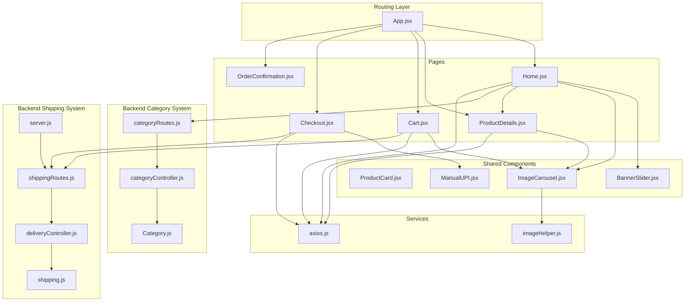
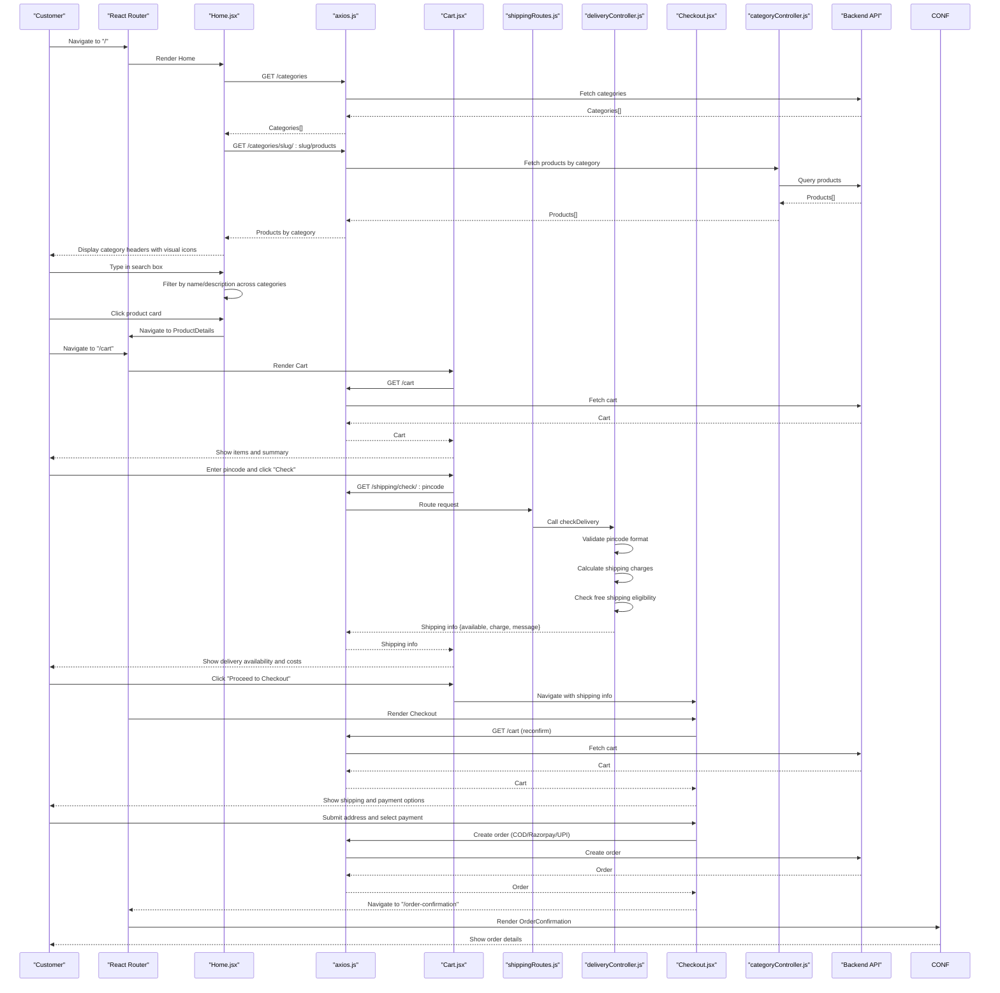
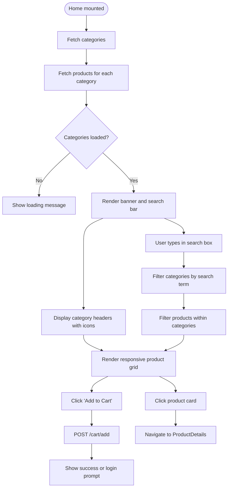
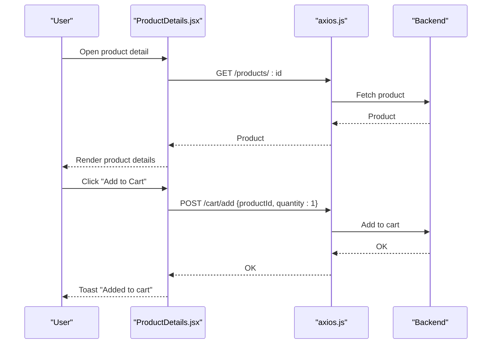
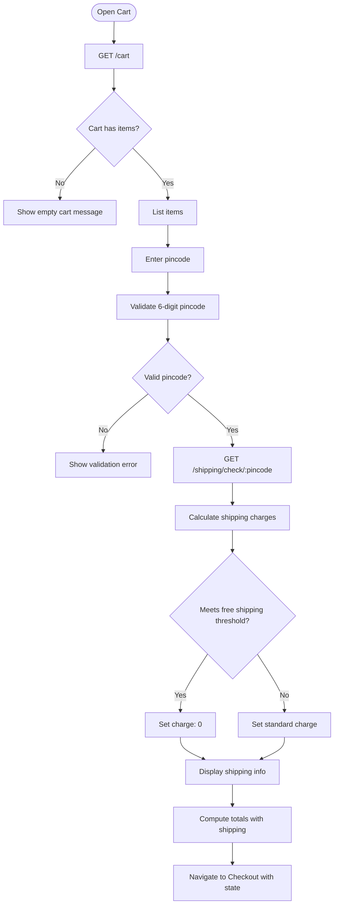
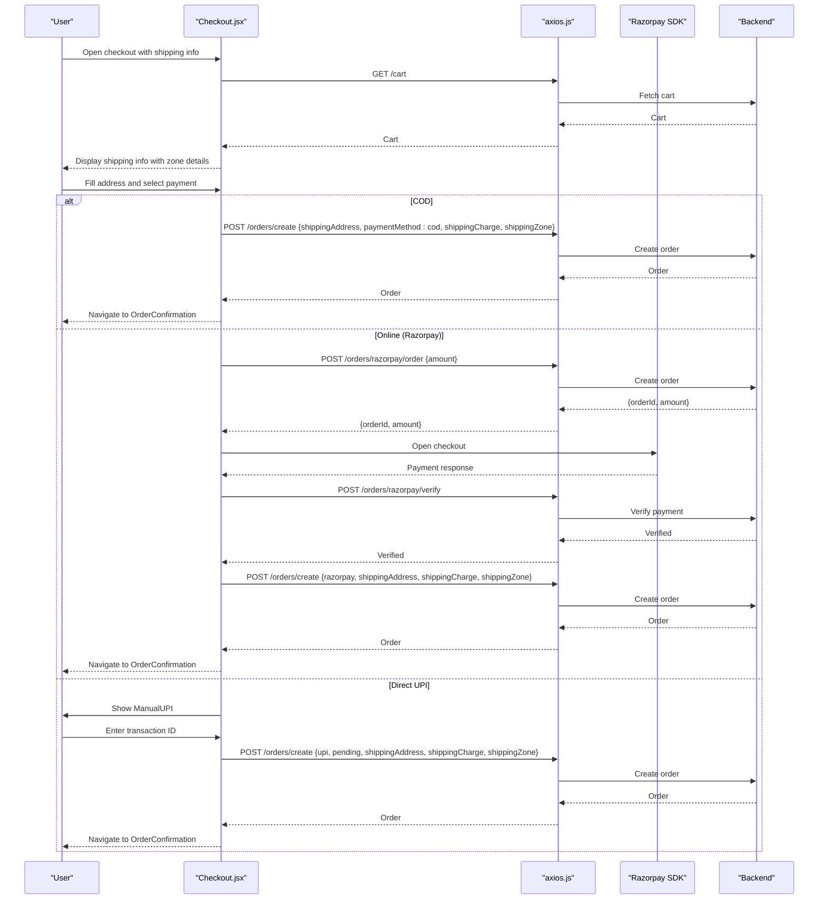
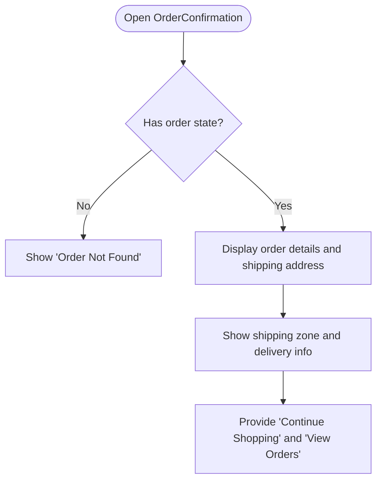
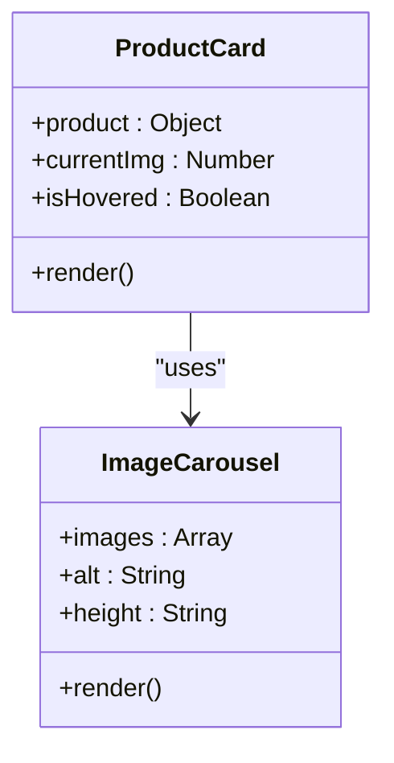
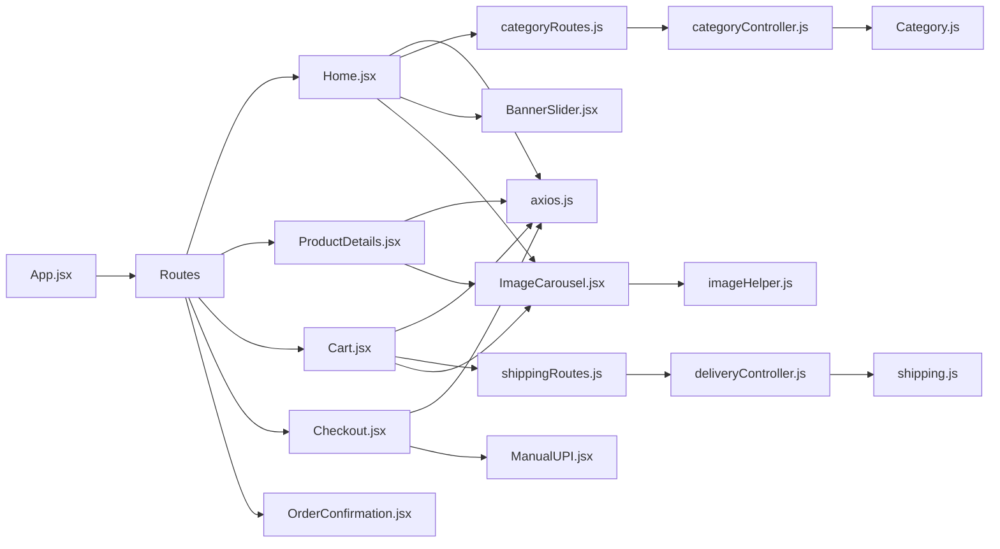

# Shopping Experience

<cite>
**Referenced Files in This Document**
- [App.jsx](file://frontend/src/App.jsx)
- [Home.jsx](file://frontend/src/pages/Home.jsx)
- [ProductDetails.jsx](file://frontend/src/pages/ProductDetails.jsx)
- [Cart.jsx](file://frontend/src/pages/Cart.jsx)
- [Checkout.jsx](file://frontend/src/pages/Checkout.jsx)
- [OrderConfirmation.jsx](file://frontend/src/pages/OrderConfirmation.jsx)
- [ProductCard.jsx](file://frontend/src/components/ProductCard.jsx)
- [ImageCarousel.jsx](file://frontend/src/components/ImageCarousel.jsx)
- [BannerSlider.jsx](file://frontend/src/components/BannerSlider.jsx)
- [ManualUPI.jsx](file://frontend/src/components/ManualUPI.jsx)
- [axios.js](file://frontend/src/api/axios.js)
- [imageHelper.js](file://frontend/src/utils/imageHelper.js)
- [categoryController.js](file://backend/controllers/categoryController.js)
- [categoryRoutes.js](file://backend/routes/categoryRoutes.js)
- [Category.js](file://backend/models/Category.js)
- [shippingRoutes.js](file://backend/routes/shippingRoutes.js)
- [deliveryController.js](file://backend/controllers/deliveryController.js)
- [shipping.js](file://backend/config/shipping.js)
- [server.js](file://backend/server.js)
</cite>

## Update Summary
**Changes Made**
- Updated Home page section to reflect the complete redesign with category-based organization and visual category headers
- Enhanced search functionality documentation to show integration with category filtering
- Added new section documenting the category-based product browsing architecture
- Updated ProductCard component documentation to reflect improved hover effects and stock indicators
- Added backend category management system documentation
- Enhanced troubleshooting guide with category-related error handling

## Table of Contents
1. [Introduction](#introduction)
2. [Project Structure](#project-structure)
3. [Core Components](#core-components)
4. [Architecture Overview](#architecture-overview)
5. [Detailed Component Analysis](#detailed-component-analysis)
6. [Dependency Analysis](#dependency-analysis)
7. [Performance Considerations](#performance-considerations)
8. [Accessibility and UX](#accessibility-and-ux)
9. [Troubleshooting Guide](#troubleshooting-guide)
10. [Conclusion](#conclusion)

## Introduction
This document explains the complete customer shopping experience in the e-commerce application, covering the end-to-end journey from browsing products to order confirmation. The application has undergone a complete redesign featuring category-based product organization with visual category headers, integrated search functionality that filters across categories, and an enhanced user interface. The Home page now organizes products by category with prominent visual headers, the ProductDetails page provides rich item information, the Cart page streamlines item management with real-time shipping calculations, the Checkout process supports secure and flexible payment methods, and the OrderConfirmation page closes the loop with clear order details. The new architecture features a robust category management system with icons, descriptions, and display ordering.

## Project Structure
The frontend is organized by pages and shared components with enhanced category management:
- Pages: Home, ProductDetails, Cart, Checkout, OrderConfirmation, Login, Register, AdminDashboard
- Shared components: ProductCard, ImageCarousel, BannerSlider, ManualUPI, Footer, Navbar
- Services and utilities: axios client, image helper
- Routing and layout: App sets up routes and navigation
- Backend category system: Dedicated category routes, controllers, and models
- Backend shipping system: Dedicated shipping routes and controllers

**Diagram sources**
- [App.jsx:19-66](file://frontend/src/App.jsx#L19-L66)
- [Home.jsx:1-107](file://frontend/src/pages/Home.jsx#L1-L107)
- [ProductDetails.jsx:1-80](file://frontend/src/pages/ProductDetails.jsx#L1-L80)
- [Cart.jsx:1-161](file://frontend/src/pages/Cart.jsx#L1-L161)
- [Checkout.jsx:1-301](file://frontend/src/pages/Checkout.jsx#L1-L301)
- [OrderConfirmation.jsx:1-73](file://frontend/src/pages/OrderConfirmation.jsx#L1-L73)
- [ProductCard.jsx:1-103](file://frontend/src/components/ProductCard.jsx#L1-L103)
- [ImageCarousel.jsx:1-54](file://frontend/src/components/ImageCarousel.jsx#L1-L54)
- [BannerSlider.jsx:1-153](file://frontend/src/components/BannerSlider.jsx#L1-L153)
- [ManualUPI.jsx:1-125](file://frontend/src/components/ManualUPI.jsx#L1-L125)
- [axios.js:1-17](file://frontend/src/api/axios.js#L1-L17)
- [imageHelper.js:1-5](file://frontend/src/utils/imageHelper.js#L1-L5)
- [categoryRoutes.js:1-27](file://backend/routes/categoryRoutes.js#L1-L27)
- [categoryController.js:1-134](file://backend/controllers/categoryController.js#L1-L134)
- [Category.js:1-46](file://backend/models/Category.js#L1-L46)
- [shippingRoutes.js:1-12](file://backend/routes/shippingRoutes.js#L1-L12)
- [deliveryController.js:1-118](file://backend/controllers/deliveryController.js#L1-L118)
- [shipping.js:1-73](file://backend/config/shipping.js#L1-L73)
- [server.js:64](file://backend/server.js#L64)

**Section sources**
- [App.jsx:19-66](file://frontend/src/App.jsx#L19-L66)

## Core Components
- **Enhanced Home Page**: Category-based product organization with visual headers, integrated search, and responsive grid layout.
- ProductCard: Reusable card for product preview with improved hover effects, stock badges, and category tags.
- ImageCarousel: Generic image viewer with navigation and indicators.
- BannerSlider: Promotional banner carousel with auto-play and manual controls.
- ManualUPI: UPI payment component for manual UPI transactions with QR and transaction ID capture.
- Axios client: Centralized HTTP client with auth token injection and 401 handling.
- **Enhanced Category System**: Backend category management with icons, descriptions, display ordering, and active status control.
- **Enhanced Shipping System**: Dedicated shipping routes, controllers, and configuration for comprehensive delivery calculation.

**Section sources**
- [Home.jsx:1-107](file://frontend/src/pages/Home.jsx#L1-L107)
- [ProductCard.jsx:1-103](file://frontend/src/components/ProductCard.jsx#L1-L103)
- [ImageCarousel.jsx:1-54](file://frontend/src/components/ImageCarousel.jsx#L1-L54)
- [BannerSlider.jsx:1-153](file://frontend/src/components/BannerSlider.jsx#L1-L153)
- [ManualUPI.jsx:1-125](file://frontend/src/components/ManualUPI.jsx#L1-L125)
- [axios.js:1-17](file://frontend/src/api/axios.js#L1-L17)
- [categoryController.js:1-134](file://backend/controllers/categoryController.js#L1-L134)
- [Category.js:1-46](file://backend/models/Category.js#L1-L46)
- [shippingRoutes.js:1-12](file://backend/routes/shippingRoutes.js#L1-L12)
- [deliveryController.js:1-118](file://backend/controllers/deliveryController.js#L1-L118)
- [shipping.js:1-73](file://backend/config/shipping.js#L1-L73)

## Architecture Overview
The customer journey is routed through React components that communicate with the backend via a centralized axios client. The redesigned Home page now features category-based organization with visual headers and integrated search functionality. Authentication tokens are stored in localStorage and automatically attached to requests. The UI is responsive and uses Tailwind classes for consistent styling. The enhanced category system provides structured product organization with icons and descriptions. The enhanced shipping system provides real-time delivery availability checking with comprehensive zone-based pricing and free shipping thresholds.

**Diagram sources**
- [App.jsx:48-57](file://frontend/src/App.jsx#L48-L57)
- [Home.jsx:13-41](file://frontend/src/pages/Home.jsx#L13-L41)
- [Home.jsx:20-32](file://frontend/src/pages/Home.jsx#L20-L32)
- [Home.jsx:44-50](file://frontend/src/pages/Home.jsx#L44-L50)
- [Home.jsx:70-76](file://frontend/src/pages/Home.jsx#L70-L76)
- [Home.jsx:71-74](file://frontend/src/pages/Home.jsx#L71-L74)
- [Cart.jsx:13-26](file://frontend/src/pages/Cart.jsx#L13-L26)
- [Cart.jsx:35-62](file://frontend/src/pages/Cart.jsx#L35-L62)
- [shippingRoutes.js:7](file://backend/routes/shippingRoutes.js#L7)
- [deliveryController.js:2](file://backend/controllers/deliveryController.js#L2)
- [Checkout.jsx:33-43](file://frontend/src/pages/Checkout.jsx#L33-L43)
- [OrderConfirmation.jsx:3-14](file://frontend/src/pages/OrderConfirmation.jsx#L3-L14)
- [axios.js:4-16](file://frontend/src/api/axios.js#L4-L16)

## Detailed Component Analysis

### Home Page: Redesigned Category-Based Product Browsing
**Updated** Complete redesign featuring category-based organization with visual category headers and integrated search functionality.

Key behaviors:
- Loads categories and products for each category on mount with error handling.
- Provides a prominent search bar at the top with real-time filtering across all categories.
- **New**: Displays products grouped by category with visual category headers featuring icons and gradient dividers.
- **Enhanced**: Responsive grid layout with horizontal scrolling on mobile and grid layout on desktop.
- **Improved**: Category filtering that shows only categories containing products matching the search term.
- Renders product cards with enhanced hover effects and stock indicators.
- Integrates a promotional BannerSlider at the top.

User flow highlights:
- Search updates filtered results instantly across all categories.
- Category selection narrows results dynamically with visual feedback.
- "Add to Cart" triggers a cart add API call and shows a toast/alert.
- "View Details" navigates to the product's detail page.
- Visual category headers provide clear product categorization.

**Diagram sources**
- [Home.jsx:13-41](file://frontend/src/pages/Home.jsx#L13-L41)
- [Home.jsx:44-50](file://frontend/src/pages/Home.jsx#L44-L50)
- [Home.jsx:70-76](file://frontend/src/pages/Home.jsx#L70-L76)
- [Home.jsx:71-74](file://frontend/src/pages/Home.jsx#L71-L74)
- [Home.jsx:88-94](file://frontend/src/pages/Home.jsx#L88-L94)
- [BannerSlider.jsx:31-62](file://frontend/src/components/BannerSlider.jsx#L31-L62)

**Section sources**
- [Home.jsx:1-107](file://frontend/src/pages/Home.jsx#L1-L107)
- [BannerSlider.jsx:1-153](file://frontend/src/components/BannerSlider.jsx#L1-L153)

### ProductDetails Page: Item Presentation and Add-to-Cart
Key behaviors:
- Loads a single product by ID and shows loading/error states.
- Displays product images via ImageCarousel, pricing, availability, and description.
- Adds the product to the cart with a single quantity.
- Disables the add button when out of stock.

**Diagram sources**
- [ProductDetails.jsx:11-33](file://frontend/src/pages/ProductDetails.jsx#L11-L33)
- [ImageCarousel.jsx:4-23](file://frontend/src/components/ImageCarousel.jsx#L4-L23)
- [axios.js:4-16](file://frontend/src/api/axios.js#L4-L16)

**Section sources**
- [ProductDetails.jsx:1-80](file://frontend/src/pages/ProductDetails.jsx#L1-L80)
- [ImageCarousel.jsx:1-54](file://frontend/src/components/ImageCarousel.jsx#L1-L54)

### Cart Page: Item Management and Enhanced Shipping Calculation
**Updated** Enhanced with comprehensive shipping calculation system featuring real-time delivery checking and zone-based pricing.

Key behaviors:
- Loads the current cart and computes subtotal and total.
- **New**: Allows entering a pincode to check delivery availability via `/shipping/check/{pincode}` endpoint.
- **Enhanced**: Displays shipping information with free shipping eligibility, delivery estimates, and zone details.
- **Improved**: Real-time shipping cost calculation with different thresholds for various shipping zones.
- **Better UX**: Visual feedback for free shipping eligibility with green indicators.
- Enables proceeding to checkout with pre-filled shipping info.

**Diagram sources**
- [Cart.jsx:13-26](file://frontend/src/pages/Cart.jsx#L13-L26)
- [Cart.jsx:35-62](file://frontend/src/pages/Cart.jsx#L35-L62)
- [Cart.jsx:99-124](file://frontend/src/pages/Cart.jsx#L99-L124)
- [Cart.jsx:127-152](file://frontend/src/pages/Cart.jsx#L127-L152)

**Section sources**
- [Cart.jsx:1-161](file://frontend/src/pages/Cart.jsx#L1-L161)

### Checkout: Shipping, Payment, and Order Review
**Updated** Enhanced with improved shipping information handling and better user feedback.

Key behaviors:
- Validates user authentication and loads cart.
- Receives shipping info from the Cart page and displays it with zone details.
- **Enhanced**: Shows detailed shipping information including zone name, delivery estimates, and free shipping status.
- Supports three payment methods:
  - Cash on Delivery (COD): Places order immediately with shipping details.
  - Online Payment (Razorpay): Opens Razorpay checkout and verifies payment server-side.
  - Direct UPI: Uses ManualUPI component to collect transaction ID and places order with pending verification.
- Validates required address fields and enforces phone length.

**Diagram sources**
- [Checkout.jsx:22-43](file://frontend/src/pages/Checkout.jsx#L22-L43)
- [Checkout.jsx:67-86](file://frontend/src/pages/Checkout.jsx#L67-L86)
- [Checkout.jsx:88-137](file://frontend/src/pages/Checkout.jsx#L88-L137)
- [Checkout.jsx:139-165](file://frontend/src/pages/Checkout.jsx#L139-L165)
- [ManualUPI.jsx:19-25](file://frontend/src/components/ManualUPI.jsx#L19-L25)

**Section sources**
- [Checkout.jsx:1-301](file://frontend/src/pages/Checkout.jsx#L1-L301)
- [ManualUPI.jsx:1-125](file://frontend/src/components/ManualUPI.jsx#L1-L125)

### OrderConfirmation: Purchase Completion
Key behaviors:
- Receives order data from the previous page via location state.
- Displays order ID, total amount, payment status, and shipping address.
- **Enhanced**: Shows shipping zone information and delivery estimates.
- Provides navigation to continue shopping or view orders.

**Diagram sources**
- [OrderConfirmation.jsx:3-14](file://frontend/src/pages/OrderConfirmation.jsx#L3-L14)
- [OrderConfirmation.jsx:16-72](file://frontend/src/pages/OrderConfirmation.jsx#L16-L72)

**Section sources**
- [OrderConfirmation.jsx:1-73](file://frontend/src/pages/OrderConfirmation.jsx#L1-L73)

### ProductCard Component: Enhanced Product Presentation
**Updated** Improved hover effects, stock indicators, and category tagging for better user experience.

Key behaviors:
- Displays a product preview with enhanced hover animations and overlay effects.
- Shows stock status with visual badges (In Stock/Sold Out).
- Provides category tag display for quick product categorization.
- Uses a shared ImageCarousel component for consistent image handling.
- Implements smooth hover transitions with elevation and border highlighting.

**Diagram sources**
- [ProductCard.jsx:5-103](file://frontend/src/components/ProductCard.jsx#L5-L103)
- [ImageCarousel.jsx:4-53](file://frontend/src/components/ImageCarousel.jsx#L4-L53)

**Section sources**
- [ProductCard.jsx:1-103](file://frontend/src/components/ProductCard.jsx#L1-L103)
- [ImageCarousel.jsx:1-54](file://frontend/src/components/ImageCarousel.jsx#L1-L54)

### Enhanced Category Management System: Backend Architecture
**New Section** The application now features a comprehensive category management system with icons, descriptions, and display ordering.

#### Category Model Features
The Category model includes:
- **Name**: Unique category identifier with automatic slug generation
- **Slug**: URL-friendly identifier for category URLs
- **Description**: Optional category description for marketing
- **Icon**: Unicode icon for visual category representation
- **IsActive**: Toggle to hide/show categories in frontend
- **DisplayOrder**: Numeric ordering for category appearance

#### Category Operations
The system supports full CRUD operations:
- **Get Categories**: Fetches active categories with display ordering
- **Get Products by Category**: Retrieves products filtered by category with pagination
- **Create/Update/Delete**: Admin-only operations for category management
- **Get All Categories**: Admin-only access to inactive categories

#### Frontend Integration
- **Visual Headers**: Category headers display icons and gradient dividers
- **Search Integration**: Search filters across all categories and products
- **Responsive Layout**: Grid layout adapts to different screen sizes
- **Error Handling**: Graceful fallbacks when category products fail to load

**Section sources**
- [categoryController.js:1-134](file://backend/controllers/categoryController.js#L1-L134)
- [categoryRoutes.js:1-27](file://backend/routes/categoryRoutes.js#L1-L27)
- [Category.js:1-46](file://backend/models/Category.js#L1-L46)
- [Home.jsx:80-85](file://frontend/src/pages/Home.jsx#L80-L85)

### Enhanced Shipping System: Comprehensive Delivery Calculation
**New Section** The application now features a sophisticated shipping calculation system with multiple tiers and real-time delivery checking.

#### Shipping Zones and Pricing
The system implements three-tier shipping zones with different pricing and free shipping thresholds:

- **Local Delivery (Hyderabad core areas)**: ₹40 with free shipping at ₹500+
- **State Delivery (Telangana & Andhra Pradesh)**: ₹80 with free shipping at ₹799+
- **National Delivery (Rest of India)**: ₹120 with free shipping at ₹1499+

#### Delivery Availability Checking
The `/shipping/check/{pincode}` endpoint provides:
- Real-time delivery availability validation
- Zone-based shipping charge calculation
- Free shipping eligibility determination
- Estimated delivery timeframes
- Comprehensive error handling for invalid inputs

#### Implementation Details
- **Frontend**: Cart page integrates pincode validation and real-time shipping calculation
- **Backend**: Dedicated shipping routes and controllers handle complex zone logic
- **Configuration**: Centralized shipping zone definitions with helper functions
- **User Experience**: Immediate feedback with visual indicators for free shipping eligibility

**Section sources**
- [shippingRoutes.js:1-12](file://backend/routes/shippingRoutes.js#L1-L12)
- [deliveryController.js:1-118](file://backend/controllers/deliveryController.js#L1-L118)
- [shipping.js:1-73](file://backend/config/shipping.js#L1-L73)
- [Cart.jsx:35-62](file://frontend/src/pages/Cart.jsx#L35-L62)

## Dependency Analysis
- Routing and layout: App defines routes and navigation.
- Pages depend on the axios client for API communication.
- Components share ImageCarousel and imageHelper for image rendering.
- Checkout integrates ManualUPI and Razorpay SDK for payments.
- **Enhanced**: Home page depends on the new category system for product organization.
- **Enhanced**: Cart page depends on the new shipping system for delivery calculations.
- **Enhanced**: Category system provides structured product data for frontend consumption.

**Diagram sources**
- [App.jsx:48-57](file://frontend/src/App.jsx#L48-L57)
- [axios.js:1-17](file://frontend/src/api/axios.js#L1-L17)
- [imageHelper.js:1-5](file://frontend/src/utils/imageHelper.js#L1-L5)
- [categoryRoutes.js:1-27](file://backend/routes/categoryRoutes.js#L1-L27)
- [categoryController.js:1-134](file://backend/controllers/categoryController.js#L1-L134)
- [Category.js:1-46](file://backend/models/Category.js#L1-L46)
- [shippingRoutes.js:1-12](file://backend/routes/shippingRoutes.js#L1-L12)
- [deliveryController.js:1-118](file://backend/controllers/deliveryController.js#L1-L118)
- [shipping.js:1-73](file://backend/config/shipping.js#L1-L73)

**Section sources**
- [App.jsx:19-66](file://frontend/src/App.jsx#L19-L66)
- [axios.js:1-17](file://frontend/src/api/axios.js#L1-L17)
- [imageHelper.js:1-5](file://frontend/src/utils/imageHelper.js#L1-L5)

## Performance Considerations
- Minimize re-renders by keeping product lists and cart state local to their pages.
- **Enhanced**: Debounce search input to reduce API calls while maintaining responsiveness.
- Lazy-load images and banners to improve initial render performance.
- **Enhanced**: Cache category data locally to avoid repeated category fetches.
- **Enhanced**: Implement virtualized rendering for large product lists within categories.
- **Enhanced**: Cache shipping calculations per session to avoid repeated network requests to `/shipping/check/{pincode}`.
- **Optimized**: Implement debounced pincode checking to prevent excessive API calls during rapid typing.
- Use skeleton loaders during fetches for perceived performance.
- **Enhanced**: Optimize category header rendering with memoization for frequently accessed categories.

## Accessibility and UX
- Keyboard navigation: Ensure focus styles and tab order are logical across forms and buttons.
- Screen reader support: Use aria-labels for carousel navigation and buttons.
- Color contrast: Maintain sufficient contrast for text and interactive elements.
- Responsive breakpoints: Tailwind utilities ensure mobile-first layouts; verify touch targets are adequately sized.
- Form validation feedback: Provide inline, visible error messages for address and payment steps.
- **Enhanced**: Clear shipping status indicators with color-coded feedback for free shipping eligibility.
- **Improved**: Visual cues for delivery availability with immediate user feedback.
- **Enhanced**: Category headers provide clear visual hierarchy and product categorization.
- **Improved**: Search functionality provides instant feedback with filtered results.
- Clear CTAs: Use descriptive labels like "Add to Cart," "Proceed to Checkout," and "Place Order."

## Troubleshooting Guide
**Updated** Enhanced with category-related and shipping system troubleshooting.

Common issues and remedies:
- Authentication errors: Unauthorized requests remove the token; redirect to login and show a toast.
- Empty cart scenarios: Cart page shows a friendly message and a link to continue shopping.
- **Enhanced**: Category loading failures: Handle backend errors gracefully with fallback empty states.
- **Enhanced**: Search functionality issues: Validate search input and provide clear error messages for invalid terms.
- **Enhanced**: Pincode validation errors: Display specific error messages for invalid 6-digit inputs.
- **New**: Category filtering failures: Ensure category products are properly loaded and handle edge cases.
- **New**: Category icon display issues: Validate icon unicode characters and provide fallback icons.
- **New**: Category ordering problems: Check displayOrder values and ensure proper sorting in backend.
- **New**: Category activation issues: Verify isActive flag affects category visibility in frontend.
- **New**: Category slug generation failures: Handle special characters and ensure unique slugs.
- **New**: Category product loading errors: Implement graceful fallbacks when individual category requests fail.
- **New**: Category search integration issues: Ensure search filters work across all categories and products.
- **New**: Category responsive layout problems: Test grid layout across different screen sizes and orientations.
- **New**: Category header styling issues: Verify CSS classes for icons, gradients, and responsive behavior.
- **Enhanced**: Shipping calculation failures: Handle backend errors gracefully with user-friendly messages.
- **Improved**: Delivery availability issues: Provide clear explanations when delivery is not available in certain areas.
- Payment failures: Display user-friendly messages and allow retry or alternate payment method.
- UPI QR generation failures: Fallback to copying UPI ID and provide a WhatsApp help link.
- **Enhanced**: Shipping zone mismatches: Ensure proper zone detection and display appropriate shipping costs.

**Section sources**
- [axios.js:10-16](file://frontend/src/api/axios.js#L10-L16)
- [Home.jsx:29-31](file://frontend/src/pages/Home.jsx#L29-L31)
- [Home.jsx:44-50](file://frontend/src/pages/Home.jsx#L44-L50)
- [Home.jsx:70-76](file://frontend/src/pages/Home.jsx#L70-L76)
- [Home.jsx:71-74](file://frontend/src/pages/Home.jsx#L71-L74)
- [Cart.jsx:35-53](file://frontend/src/pages/Cart.jsx#L35-L53)
- [Cart.jsx:57-62](file://frontend/src/pages/Cart.jsx#L57-L62)
- [Checkout.jsx:167-177](file://frontend/src/pages/Checkout.jsx#L167-L177)
- [ManualUPI.jsx:67-78](file://frontend/src/components/ManualUPI.jsx#L67-L78)

## Conclusion
The e-commerce application delivers a cohesive shopping experience from browsing to confirmation, now enhanced with a sophisticated category-based organization system and improved search functionality. The redesigned Home page features category-based product organization with visual headers, integrated search that filters across all categories, and responsive grid layouts. The enhanced ProductCard component provides improved user interaction with hover effects and stock indicators. The new category management system offers comprehensive backend support with icons, descriptions, and display ordering. The ProductDetails page provides rich item information, the Cart page streamlines item management and shipping estimation with real-time delivery checking, the Checkout process supports secure and flexible payment methods with comprehensive shipping information, and the OrderConfirmation page closes the loop with clear order details. The new shipping system provides zone-based pricing with free shipping thresholds, real-time delivery availability checking, and improved user feedback throughout the shopping experience. Shared components like ImageCarousel and BannerSlider ensure consistent visuals, while the centralized axios client and dedicated category and shipping routes simplify API interactions and authentication handling.