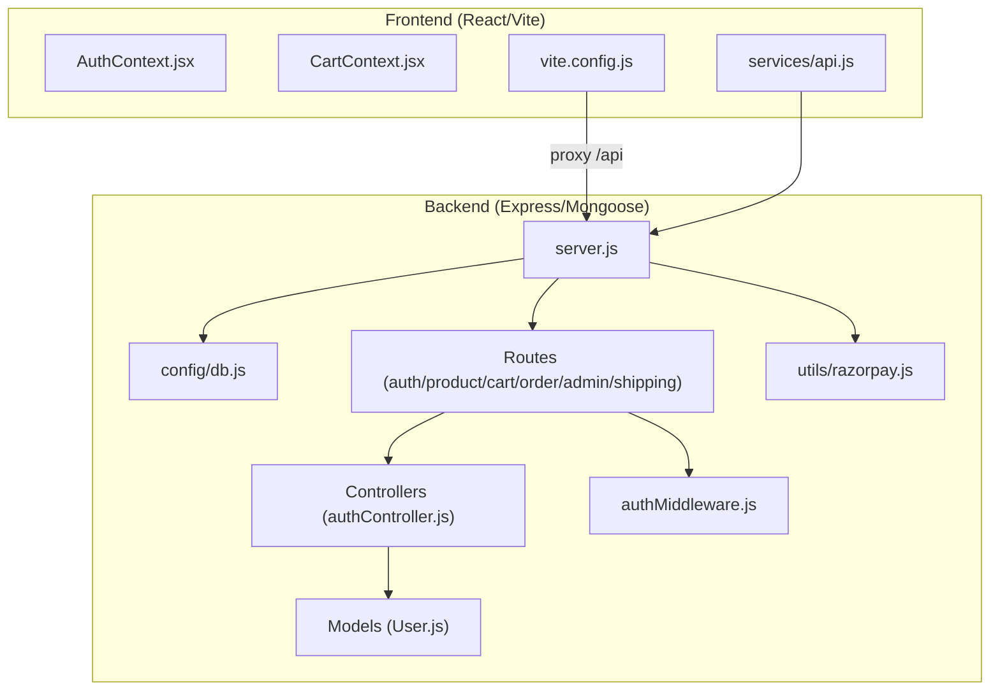
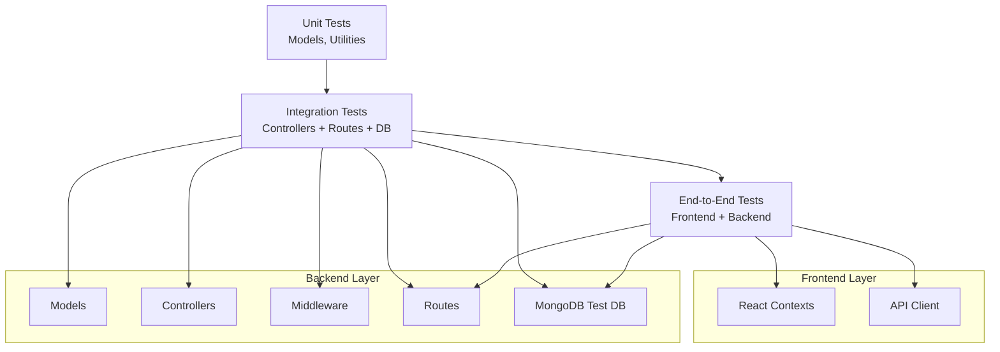
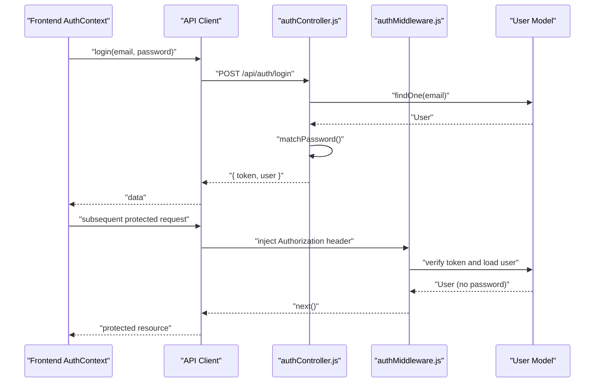
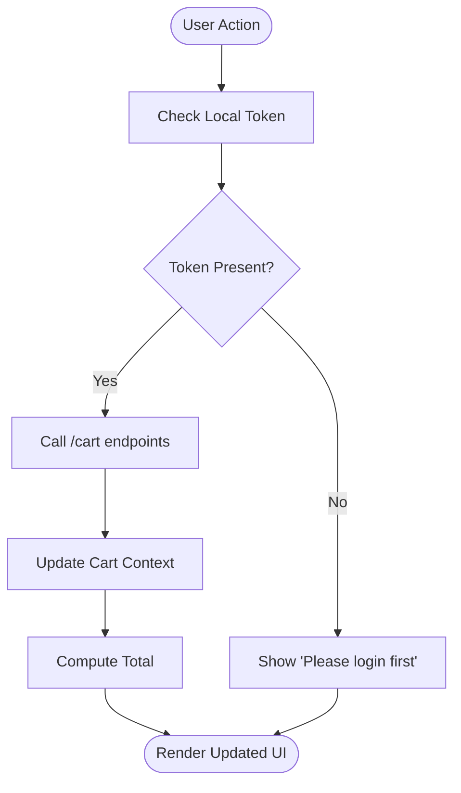
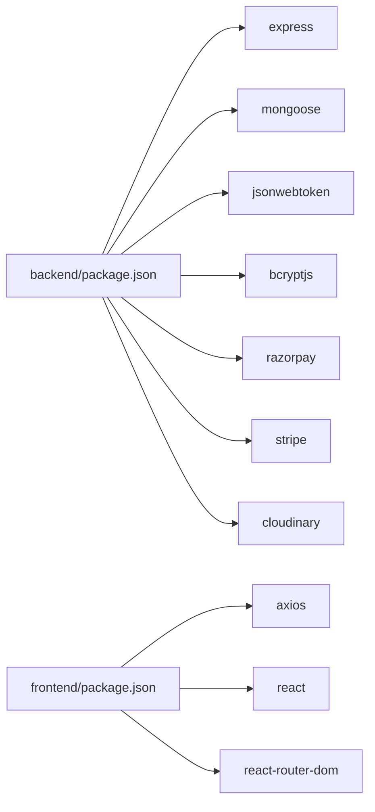

# Testing Strategy

<cite>
**Referenced Files in This Document**
- [backend/package.json](file://backend/package.json)
- [frontend/package.json](file://frontend/package.json)
- [backend/test-mongo.js](file://backend/test-mongo.js)
- [backend/server.js](file://backend/server.js)
- [backend/config/db.js](file://backend/config/db.js)
- [backend/controllers/authController.js](file://backend/controllers/authController.js)
- [backend/models/User.js](file://backend/models/User.js)
- [backend/middleware/authMiddleware.js](file://backend/middleware/authMiddleware.js)
- [backend/utils/razorpay.js](file://backend/utils/razorpay.js)
- [frontend/vite.config.js](file://frontend/vite.config.js)
- [frontend/src/context/AuthContext.jsx](file://frontend/src/context/AuthContext.jsx)
- [frontend/src/context/CartContext.jsx](file://frontend/src/context/CartContext.jsx)
- [frontend/src/services/api.js](file://frontend/src/services/api.js)
</cite>

## Table of Contents
1. [Introduction](#introduction)
2. [Project Structure](#project-structure)
3. [Core Components](#core-components)
4. [Architecture Overview](#architecture-overview)
5. [Detailed Component Analysis](#detailed-component-analysis)
6. [Dependency Analysis](#dependency-analysis)
7. [Performance Considerations](#performance-considerations)
8. [Troubleshooting Guide](#troubleshooting-guide)
9. [Conclusion](#conclusion)
10. [Appendices](#appendices)

## Introduction
This document outlines a comprehensive testing strategy for the E-commerce App, covering backend unit and integration tests, frontend component and integration tests, MongoDB test setup and database isolation, and testing utilities for external services. It also provides testing patterns for authentication flows, user interactions, and business logic validation, along with practical examples for key features such as user authentication, product management, cart operations, and order processing. Guidance on best practices, continuous integration setup, and automated testing workflows is included.

## Project Structure
The repository is split into a backend (Node.js/Express/Mongoose) and a frontend (React/Vite). The backend exposes REST APIs, manages authentication and authorization via JWT, and integrates with MongoDB. The frontend consumes these APIs and maintains application state via React Context providers. The development environment proxies frontend requests to the backend during local development.

**Diagram sources**
- [backend/server.js:1-85](file://backend/server.js#L1-L85)
- [backend/config/db.js:1-14](file://backend/config/db.js#L1-L14)
- [backend/controllers/authController.js:1-27](file://backend/controllers/authController.js#L1-L27)
- [backend/models/User.js:1-20](file://backend/models/User.js#L1-L20)
- [backend/middleware/authMiddleware.js:1-20](file://backend/middleware/authMiddleware.js#L1-L20)
- [backend/utils/razorpay.js:1-10](file://backend/utils/razorpay.js#L1-L10)
- [frontend/vite.config.js:1-15](file://frontend/vite.config.js#L1-L15)
- [frontend/src/context/AuthContext.jsx:1-33](file://frontend/src/context/AuthContext.jsx#L1-L33)
- [frontend/src/context/CartContext.jsx:1-53](file://frontend/src/context/CartContext.jsx#L1-L53)
- [frontend/src/services/api.js:1-8](file://frontend/src/services/api.js#L1-L8)

**Section sources**
- [backend/server.js:1-85](file://backend/server.js#L1-L85)
- [frontend/vite.config.js:1-15](file://frontend/vite.config.js#L1-L15)

## Core Components
- Backend database connection and health checks
- Authentication controller and middleware
- User model with password hashing and comparison
- Payment gateway integration (Razorpay)
- Frontend authentication and cart contexts
- Frontend API client with token injection

Key testing targets:
- Controllers: validate request handling, response shape, and error propagation
- Models: validate schema constraints, hooks, and methods
- Middleware: validate token extraction, verification, and role checks
- Services: validate integration with external services (payment)
- Frontend contexts: validate state updates, persistence, and API interactions

**Section sources**
- [backend/config/db.js:1-14](file://backend/config/db.js#L1-L14)
- [backend/controllers/authController.js:1-27](file://backend/controllers/authController.js#L1-L27)
- [backend/models/User.js:1-20](file://backend/models/User.js#L1-L20)
- [backend/middleware/authMiddleware.js:1-20](file://backend/middleware/authMiddleware.js#L1-L20)
- [backend/utils/razorpay.js:1-10](file://backend/utils/razorpay.js#L1-L10)
- [frontend/src/context/AuthContext.jsx:1-33](file://frontend/src/context/AuthContext.jsx#L1-L33)
- [frontend/src/context/CartContext.jsx:1-53](file://frontend/src/context/CartContext.jsx#L1-L53)
- [frontend/src/services/api.js:1-8](file://frontend/src/services/api.js#L1-L8)

## Architecture Overview
The testing architecture separates concerns across unit, integration, and end-to-end layers. Unit tests focus on pure functions, models, and small units. Integration tests validate controller-to-model flows and route-level behavior against a test database. End-to-end tests validate frontend interactions and backend API integrations.

[No sources needed since this diagram shows conceptual workflow, not actual code structure]

## Detailed Component Analysis

### Authentication Testing Strategy
Authentication spans the frontend context and backend controller/middleware. Tests should cover:
- Successful registration and login flows
- Token generation and persistence
- Protected route access and admin-only routes
- Password hashing and comparison behavior
- Error scenarios (invalid credentials, missing tokens, invalid tokens)

Recommended approaches:
- Use isolated test databases per suite to avoid cross-test contamination
- Mock JWT verification and external services for deterministic tests
- Verify Authorization header injection in API client

**Diagram sources**
- [frontend/src/context/AuthContext.jsx:16-22](file://frontend/src/context/AuthContext.jsx#L16-L22)
- [frontend/src/services/api.js:3-7](file://frontend/src/services/api.js#L3-L7)
- [backend/controllers/authController.js:18-27](file://backend/controllers/authController.js#L18-L27)
- [backend/middleware/authMiddleware.js:4-15](file://backend/middleware/authMiddleware.js#L4-L15)
- [backend/models/User.js:16-18](file://backend/models/User.js#L16-L18)

Practical examples (paths only):
- Registration success: [backend/controllers/authController.js:6-16](file://backend/controllers/authController.js#L6-L16)
- Login success: [backend/controllers/authController.js:18-27](file://backend/controllers/authController.js#L18-L27)
- Token verification middleware: [backend/middleware/authMiddleware.js:4-15](file://backend/middleware/authMiddleware.js#L4-L15)
- Password hashing hook: [backend/models/User.js:11-14](file://backend/models/User.js#L11-L14)
- Frontend login flow: [frontend/src/context/AuthContext.jsx:16-22](file://frontend/src/context/AuthContext.jsx#L16-L22)
- Authorization header injection: [frontend/src/services/api.js:3-7](file://frontend/src/services/api.js#L3-L7)

**Section sources**
- [backend/controllers/authController.js:1-27](file://backend/controllers/authController.js#L1-L27)
- [backend/middleware/authMiddleware.js:1-20](file://backend/middleware/authMiddleware.js#L1-L20)
- [backend/models/User.js:1-20](file://backend/models/User.js#L1-L20)
- [frontend/src/context/AuthContext.jsx:1-33](file://frontend/src/context/AuthContext.jsx#L1-L33)
- [frontend/src/services/api.js:1-8](file://frontend/src/services/api.js#L1-L8)

### Product Management Testing Strategy
Focus areas:
- CRUD operations for products
- Validation of request payloads and responses
- Access control (admin-only creation/modification)
- Image upload handling and Cloudinary integration (if applicable)

Recommended approaches:
- Use separate test collections or drop-and-recreate collections per test
- Mock file upload middleware for unit tests
- Validate route-level permissions via admin middleware

[No sources needed since this section doesn't analyze specific files]

### Cart Operations Testing Strategy
Focus areas:
- Add/remove items from cart
- Quantity updates and totals computation
- Persistence synchronization with backend
- Guest vs authenticated user behavior

Recommended approaches:
- Simulate token presence to test authenticated flows
- Mock backend cart endpoints to isolate UI logic
- Verify toast notifications and UI updates

**Diagram sources**
- [frontend/src/context/CartContext.jsx:31-42](file://frontend/src/context/CartContext.jsx#L31-L42)
- [frontend/src/context/CartContext.jsx:44](file://frontend/src/context/CartContext.jsx#L44)

Practical examples (paths only):
- Add to cart: [frontend/src/context/CartContext.jsx:31-38](file://frontend/src/context/CartContext.jsx#L31-L38)
- Remove from cart: [frontend/src/context/CartContext.jsx:40-42](file://frontend/src/context/CartContext.jsx#L40-L42)
- Cart total calculation: [frontend/src/context/CartContext.jsx:44](file://frontend/src/context/CartContext.jsx#L44)

**Section sources**
- [frontend/src/context/CartContext.jsx:1-53](file://frontend/src/context/CartContext.jsx#L1-L53)

### Order Processing Testing Strategy
Focus areas:
- Order creation from cart
- Payment initiation via external provider
- Order status transitions and persistence
- Admin order management

Recommended approaches:
- Mock payment provider SDK to simulate success/failure scenarios
- Use transaction-like patterns in tests to rollback changes
- Validate order model schema and populated relations

[No sources needed since this section doesn't analyze specific files]

### Payment Gateway Testing Strategy
Focus areas:
- Payment initialization and confirmation
- Error handling for network failures and invalid data
- Idempotency and retry logic (conceptual)

Recommended approaches:
- Wrap provider SDK in a service module for easy mocking
- Use fake keys and stubbed responses for unit tests
- Validate webhook handlers separately with event fixtures

Practical examples (paths only):
- Razorpay client initialization: [backend/utils/razorpay.js:5-8](file://backend/utils/razorpay.js#L5-L8)

**Section sources**
- [backend/utils/razorpay.js:1-10](file://backend/utils/razorpay.js#L1-L10)

### Cloud Storage Testing Strategy
Focus areas:
- Upload middleware behavior
- Cloudinary integration reliability
- Cleanup and fallback strategies

Recommended approaches:
- Mock multer and Cloudinary SDK in unit tests
- Use local disk storage override for tests
- Validate error paths for upload failures

[No sources needed since this section doesn't analyze specific files]

## Dependency Analysis
External dependencies relevant to testing:
- Backend: Express, Mongoose, jsonwebtoken, bcryptjs, razorpay, stripe, cloudinary
- Frontend: axios, react, react-router-dom

Testing frameworks and tools commonly used in similar stacks:
- Backend: Jest, Supertest, MongoDB Memory Server
- Frontend: Vitest, React Testing Library, MSW or Mock Service Worker

**Diagram sources**
- [backend/package.json:8-22](file://backend/package.json#L8-L22)
- [frontend/package.json:8-16](file://frontend/package.json#L8-L16)

**Section sources**
- [backend/package.json:1-27](file://backend/package.json#L1-L27)
- [frontend/package.json:1-25](file://frontend/package.json#L1-L25)

## Performance Considerations
- Prefer in-memory or ephemeral databases for fast test runs
- Use database transactions or collection-level isolation to reduce teardown overhead
- Parallelize independent tests while avoiding shared mutable state
- Cache static assets and avoid real network calls in unit tests

[No sources needed since this section provides general guidance]

## Troubleshooting Guide
Common testing pitfalls and remedies:
- MongoDB connection errors: Use a dedicated test URI and ensure environment variables are loaded before connecting
  - Reference: [backend/test-mongo.js:8](file://backend/test-mongo.js#L8)
- CORS mismatches in tests: Configure allowed origins consistently across environments
  - Reference: [backend/server.js:23-49](file://backend/server.js#L23-L49)
- Frontend proxy misconfiguration: Ensure Vite proxy target matches backend port
  - Reference: [frontend/vite.config.js:8-12](file://frontend/vite.config.js#L8-L12)
- Missing Authorization header: Verify interceptor injection and token persistence
  - Reference: [frontend/src/services/api.js:3-7](file://frontend/src/services/api.js#L3-L7), [frontend/src/context/AuthContext.jsx:18-20](file://frontend/src/context/AuthContext.jsx#L18-L20)

**Section sources**
- [backend/test-mongo.js:1-28](file://backend/test-mongo.js#L1-L28)
- [backend/server.js:23-49](file://backend/server.js#L23-L49)
- [frontend/vite.config.js:1-15](file://frontend/vite.config.js#L1-L15)
- [frontend/src/services/api.js:1-8](file://frontend/src/services/api.js#L1-L8)
- [frontend/src/context/AuthContext.jsx:1-33](file://frontend/src/context/AuthContext.jsx#L1-L33)

## Conclusion
A robust testing strategy for the E-commerce App requires layered coverage: unit tests for models and utilities, integration tests for controllers and routes, and end-to-end tests for frontend interactions. MongoDB isolation and deterministic mocks for external services are essential. By following the recommended patterns and leveraging the provided references, teams can achieve reliable, maintainable, and fast test suites.

[No sources needed since this section summarizes without analyzing specific files]

## Appendices

### MongoDB Test Setup and Isolation
- Use a separate test database URI for CI/local testing
- Initialize the database connection early in test setup
- Drop collections or use unique prefixes per test to prevent cross-contamination
- For local verification, use the provided test script to validate connectivity

References:
- [backend/test-mongo.js:8](file://backend/test-mongo.js#L8)
- [backend/config/db.js:7](file://backend/config/db.js#L7)

**Section sources**
- [backend/test-mongo.js:1-28](file://backend/test-mongo.js#L1-L28)
- [backend/config/db.js:1-14](file://backend/config/db.js#L1-L14)

### Testing Utilities and Mocks
- Mock JWT verification to bypass cryptographic overhead
- Stub external SDKs (Razorpay, Stripe, Cloudinary) with deterministic responses
- Use fake tokens and minimal user fixtures for authentication tests
- For frontend, mock API endpoints with libraries like MSW or Vitest’s fetch mocks

[No sources needed since this section provides general guidance]

### Continuous Integration and Automated Workflows
- Run unit tests on push; run integration tests on pull requests targeting main
- Cache dependencies and use ephemeral test databases per job
- Export test coverage and attach artifacts for regression tracking
- Gate deployments on passing tests and linters

[No sources needed since this section provides general guidance]