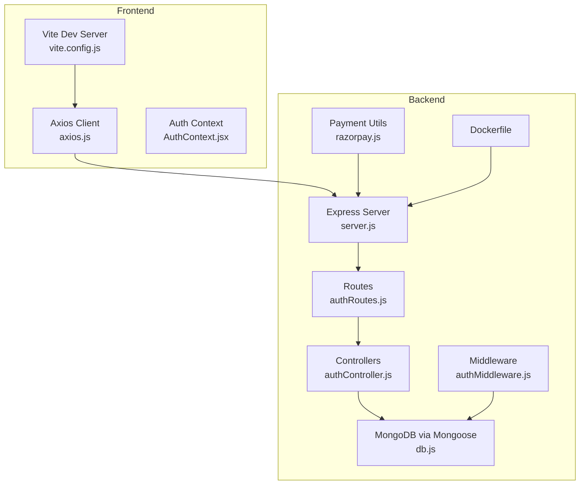
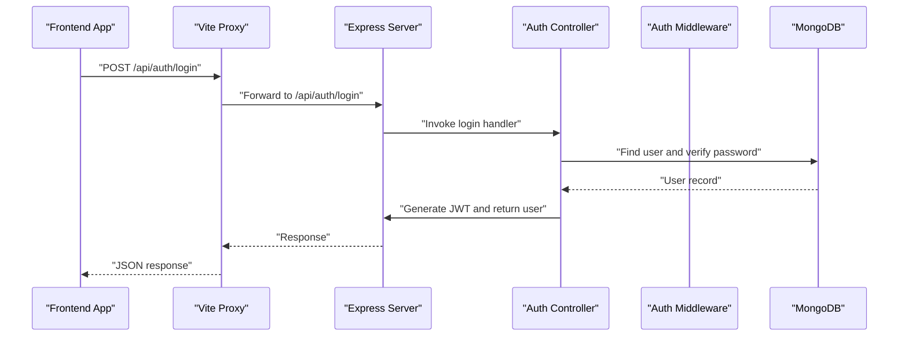
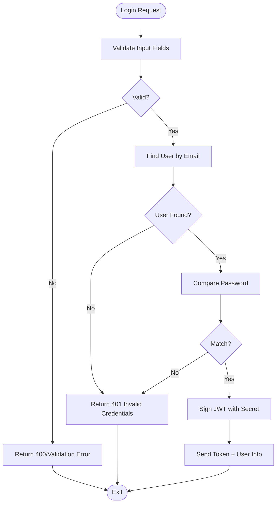
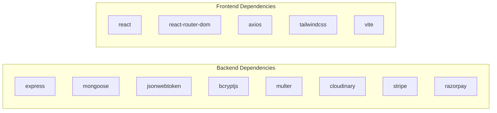

# Troubleshooting Guide

<cite>
**Referenced Files in This Document**
- [backend/package.json](file://backend/package.json)
- [frontend/package.json](file://frontend/package.json)
- [backend/server.js](file://backend/server.js)
- [backend/config/db.js](file://backend/config/db.js)
- [backend/controllers/authController.js](file://backend/controllers/authController.js)
- [backend/middleware/authMiddleware.js](file://backend/middleware/authMiddleware.js)
- [backend/routes/authRoutes.js](file://backend/routes/authRoutes.js)
- [frontend/src/api/axios.js](file://frontend/src/api/axios.js)
- [frontend/vite.config.js](file://frontend/vite.config.js)
- [backend/Dockerfile](file://backend/Dockerfile)
- [backend/utils/razorpay.js](file://backend/utils/razorpay.js)
- [backend/models/User.js](file://backend/models/User.js)
- [frontend/src/context/AuthContext.jsx](file://frontend/src/context/AuthContext.jsx)
- [backend/test-mongo.js](file://backend/test-mongo.js)
- [backend/createAdmin.js](file://backend/createAdmin.js)
</cite>

## Table of Contents
1. [Introduction](#introduction)
2. [Project Structure](#project-structure)
3. [Core Components](#core-components)
4. [Architecture Overview](#architecture-overview)
5. [Detailed Component Analysis](#detailed-component-analysis)
6. [Dependency Analysis](#dependency-analysis)
7. [Performance Considerations](#performance-considerations)
8. [Troubleshooting Guide](#troubleshooting-guide)
9. [Conclusion](#conclusion)
10. [Appendices](#appendices)

## Introduction
This guide provides a comprehensive troubleshooting resource for the E-commerce App covering development environment issues, runtime errors, debugging techniques, and production concerns. It focuses on common problems such as port conflicts, dependency issues, database connectivity, authentication flows, API endpoint failures, and frontend component issues. It also outlines systematic approaches to interpret error messages, analyze logs, and resolve problems efficiently. Preventive measures and best practices are included to reduce recurring issues during development and deployment.

## Project Structure
The project consists of:
- Backend: Express server with REST APIs, authentication, routing, middleware, database connection, and payment integrations.
- Frontend: React application using Vite, Axios for API communication, and React Context for authentication state.
- Shared configuration: Environment variables via dotenv, CORS policy, and proxy settings for local development.

**Diagram sources**
- [backend/server.js:1-102](file://backend/server.js#L1-L102)
- [backend/routes/authRoutes.js:1-9](file://backend/routes/authRoutes.js#L1-L9)
- [backend/controllers/authController.js:1-27](file://backend/controllers/authController.js#L1-L27)
- [backend/middleware/authMiddleware.js:1-20](file://backend/middleware/authMiddleware.js#L1-L20)
- [backend/config/db.js:1-14](file://backend/config/db.js#L1-L14)
- [backend/utils/razorpay.js:1-10](file://backend/utils/razorpay.js#L1-L10)
- [frontend/vite.config.js:1-15](file://frontend/vite.config.js#L1-L15)
- [frontend/src/api/axios.js:1-17](file://frontend/src/api/axios.js#L1-L17)
- [frontend/src/context/AuthContext.jsx:1-33](file://frontend/src/context/AuthContext.jsx#L1-L33)
- [backend/Dockerfile:1-18](file://backend/Dockerfile#L1-L18)

**Section sources**
- [backend/server.js:1-102](file://backend/server.js#L1-L102)
- [frontend/vite.config.js:1-15](file://frontend/vite.config.js#L1-L15)

## Core Components
- Backend Express server initializes environment, connects to MongoDB, configures CORS, serves static uploads, mounts routes, exposes health checks, and applies global error handling.
- Authentication controller handles registration and login, JWT signing, and user validation.
- Authentication middleware enforces protected routes and admin-only access.
- Frontend Axios client sets base URL and attaches Authorization headers; response interceptor handles 401 scenarios.
- Vite proxy forwards API calls to the backend during development.
- Payment utilities integrate external providers using environment variables.
- Dockerfile defines containerization for production deployments.

**Section sources**
- [backend/server.js:1-102](file://backend/server.js#L1-L102)
- [backend/controllers/authController.js:1-27](file://backend/controllers/authController.js#L1-L27)
- [backend/middleware/authMiddleware.js:1-20](file://backend/middleware/authMiddleware.js#L1-L20)
- [frontend/src/api/axios.js:1-17](file://frontend/src/api/axios.js#L1-L17)
- [frontend/vite.config.js:1-15](file://frontend/vite.config.js#L1-L15)
- [backend/utils/razorpay.js:1-10](file://backend/utils/razorpay.js#L1-L10)
- [backend/Dockerfile:1-18](file://backend/Dockerfile#L1-L18)

## Architecture Overview
The system follows a classic client-server architecture:
- Frontend (React/Vite) communicates with backend (Express) via HTTPS.
- Backend validates requests, authenticates users, accesses MongoDB, and integrates payment providers.
- Static assets are served from the backend uploads directory.
- Production builds are containerized using the provided Dockerfile.

**Diagram sources**
- [frontend/vite.config.js:1-15](file://frontend/vite.config.js#L1-L15)
- [backend/server.js:58-63](file://backend/server.js#L58-L63)
- [backend/routes/authRoutes.js:1-9](file://backend/routes/authRoutes.js#L1-L9)
- [backend/controllers/authController.js:18-27](file://backend/controllers/authController.js#L18-L27)
- [backend/middleware/authMiddleware.js:4-15](file://backend/middleware/authMiddleware.js#L4-L15)
- [backend/config/db.js:5-13](file://backend/config/db.js#L5-L13)

## Detailed Component Analysis

### Authentication Flow
Common issues:
- Invalid credentials or missing fields lead to 401 responses.
- Missing or invalid JWT tokens cause authorization failures.
- Password hashing and comparison must be consistent.

**Diagram sources**
- [backend/controllers/authController.js:18-27](file://backend/controllers/authController.js#L18-L27)
- [backend/models/User.js:16-18](file://backend/models/User.js#L16-L18)

**Section sources**
- [backend/controllers/authController.js:1-27](file://backend/controllers/authController.js#L1-L27)
- [backend/middleware/authMiddleware.js:1-20](file://backend/middleware/authMiddleware.js#L1-L20)
- [backend/models/User.js:1-20](file://backend/models/User.js#L1-L20)
- [frontend/src/context/AuthContext.jsx:16-22](file://frontend/src/context/AuthContext.jsx#L16-L22)

### API Endpoint Failures
Typical symptoms:
- 500 Internal Server Error from global error handler.
- Route not found or incorrect method.
- CORS blocked requests.

Resolution steps:
- Verify route mounting and controller exports.
- Confirm environment variables for secrets and URIs.
- Check CORS allowed origins and credentials.

**Section sources**
- [backend/server.js:58-95](file://backend/server.js#L58-L95)
- [backend/server.js:22-49](file://backend/server.js#L22-L49)
- [backend/routes/authRoutes.js:1-9](file://backend/routes/authRoutes.js#L1-L9)

### Frontend Component Issues
Symptoms:
- Axios requests fail due to base URL misconfiguration.
- Missing Authorization header despite logged-in state.
- Vite proxy not forwarding requests.

Resolution steps:
- Ensure VITE_API_URL is set in the frontend environment.
- Confirm token presence in localStorage and Authorization header injection.
- Validate Vite proxy target matches backend port.

**Section sources**
- [frontend/src/api/axios.js:1-17](file://frontend/src/api/axios.js#L1-L17)
- [frontend/vite.config.js:6-14](file://frontend/vite.config.js#L6-L14)
- [frontend/src/context/AuthContext.jsx:16-22](file://frontend/src/context/AuthContext.jsx#L16-L22)

### Database Connectivity
Symptoms:
- Application exits on startup with database connection error.
- MongoDB connection test script fails with credential or network errors.

Resolution steps:
- Verify MONGO_URI in environment variables.
- Run the connection test script to validate credentials and network.
- Confirm IP whitelist and user creation timing for managed clusters.

**Section sources**
- [backend/config/db.js:5-13](file://backend/config/db.js#L5-L13)
- [backend/test-mongo.js:1-28](file://backend/test-mongo.js#L1-L28)

### Payment Integration
Symptoms:
- Payment provider initialization errors due to missing keys.
- Runtime errors when processing payments.

Resolution steps:
- Set RAZORPAY_KEY_ID and RAZORPAY_KEY_SECRET in environment variables.
- Validate keys and ensure correct usage in controllers/services.

**Section sources**
- [backend/utils/razorpay.js:5-8](file://backend/utils/razorpay.js#L5-L8)

## Dependency Analysis
- Backend depends on Express, Mongoose, JWT, Bcrypt, Multer, Cloudinary, Stripe, and Razorpay.
- Frontend depends on React, React Router, Axios, Tailwind, and Vite.
- Scripts define development and production commands for both apps.

**Diagram sources**
- [backend/package.json:8-22](file://backend/package.json#L8-L22)
- [frontend/package.json:8-16](file://frontend/package.json#L8-L16)

**Section sources**
- [backend/package.json:1-27](file://backend/package.json#L1-L27)
- [frontend/package.json:1-25](file://frontend/package.json#L1-L25)

## Performance Considerations
- Use production-grade logging and structured error handling.
- Enable caching for preflight CORS requests and optimize image uploads.
- Monitor database queries and connection pooling.
- Containerize with minimal base images and expose only necessary ports.
- Minimize frontend bundle size and lazy-load components where appropriate.

[No sources needed since this section provides general guidance]

## Troubleshooting Guide

### Development Environment Problems

#### Port Conflicts
Symptoms:
- Backend fails to start on default port.
- Vite proxy conflicts with other local servers.

Resolution steps:
- Change backend port via environment variable and update frontend proxy target accordingly.
- Stop conflicting services or choose alternate ports.

**Section sources**
- [backend/server.js:97-102](file://backend/server.js#L97-L102)
- [frontend/vite.config.js:7-13](file://frontend/vite.config.js#L7-L13)

#### Dependency Issues
Symptoms:
- Module not found errors or peer dependency warnings.
- Scripts failing to run.

Resolution steps:
- Reinstall dependencies in both backend and frontend.
- Ensure Node.js version compatibility and lockfile integrity.
- Clear node_modules and reinstall if necessary.

**Section sources**
- [backend/package.json:1-27](file://backend/package.json#L1-L27)
- [frontend/package.json:1-25](file://frontend/package.json#L1-L25)

#### Database Connection Errors
Symptoms:
- Immediate exit after DB connection failure.
- MongoDB connection test fails with credentials/network errors.

Resolution steps:
- Confirm MONGO_URI is set and correct.
- Run the connection test script to validate credentials and cluster accessibility.
- Check IP whitelist and wait for user provisioning to propagate.

**Section sources**
- [backend/config/db.js:5-13](file://backend/config/db.js#L5-L13)
- [backend/test-mongo.js:12-28](file://backend/test-mongo.js#L12-L28)

### Runtime Errors

#### Authentication Flow Failures
Symptoms:
- Registration returns “Email exists”.
- Login returns “Invalid credentials”.
- Protected routes return “Not authorized” or “Invalid token”.

Resolution steps:
- Ensure JWT secret is configured and consistent.
- Verify user creation and password hashing pipeline.
- Confirm Authorization header presence and token validity.

**Section sources**
- [backend/controllers/authController.js:6-16](file://backend/controllers/authController.js#L6-L16)
- [backend/controllers/authController.js:18-27](file://backend/controllers/authController.js#L18-L27)
- [backend/middleware/authMiddleware.js:4-15](file://backend/middleware/authMiddleware.js#L4-L15)
- [backend/models/User.js:11-18](file://backend/models/User.js#L11-L18)

#### API Endpoint Failures
Symptoms:
- 500 Internal Server Error.
- CORS blocked requests.
- Route not found.

Resolution steps:
- Verify route mounting and controller exports.
- Check CORS allowed origins and credentials.
- Confirm environment variables for secrets and URLs.

**Section sources**
- [backend/server.js:58-95](file://backend/server.js#L58-L95)
- [backend/server.js:22-49](file://backend/server.js#L22-L49)
- [backend/routes/authRoutes.js:1-9](file://backend/routes/authRoutes.js#L1-L9)

#### Frontend Component Issues
Symptoms:
- Requests fail due to wrong base URL.
- Unauthorized requests despite logged-in state.
- Proxy not forwarding API calls.

Resolution steps:
- Set VITE_API_URL in frontend environment.
- Ensure token is present and Authorization header is attached.
- Validate Vite proxy target and port alignment.

**Section sources**
- [frontend/src/api/axios.js:1-17](file://frontend/src/api/axios.js#L1-L17)
- [frontend/vite.config.js:6-14](file://frontend/vite.config.js#L6-L14)
- [frontend/src/context/AuthContext.jsx:16-22](file://frontend/src/context/AuthContext.jsx#L16-L22)

### Debugging Techniques

#### Backend Express Server
- Use development scripts to auto-reload on changes.
- Inspect global error handler logs for stack traces.
- Add targeted console logs around controllers and middleware.
- Validate environment variables at startup.

**Section sources**
- [backend/server.js:1-18](file://backend/server.js#L1-L18)
- [backend/server.js:91-95](file://backend/server.js#L91-L95)

#### Frontend React Application
- Inspect browser network tab for failed requests and headers.
- Log request/response data in Axios interceptors.
- Verify context state updates and localStorage persistence.
- Use React DevTools to inspect component props and state.

**Section sources**
- [frontend/src/api/axios.js:4-16](file://frontend/src/api/axios.js#L4-L16)
- [frontend/src/context/AuthContext.jsx:10-31](file://frontend/src/context/AuthContext.jsx#L10-L31)

### Error Message Interpretation and Log Analysis
- Global error handler prints stack traces; use them to locate failing middleware/controller.
- DB connection errors indicate misconfigured URI or authentication issues.
- CORS errors show mismatched origin or missing credentials.
- 401 responses often mean missing/expired token or invalid JWT signature.

**Section sources**
- [backend/server.js:91-95](file://backend/server.js#L91-L95)
- [backend/config/db.js:9-12](file://backend/config/db.js#L9-L12)
- [frontend/src/api/axios.js:12-15](file://frontend/src/api/axios.js#L12-L15)

### Systematic Problem-Solving Approaches
- Isolate the issue: backend vs. frontend vs. environment.
- Reproduce with minimal request/response cycle.
- Check environment variables and configuration files.
- Review recent changes and dependency updates.
- Use health endpoints and connection tests to confirm service status.

**Section sources**
- [backend/server.js:65-73](file://backend/server.js#L65-L73)
- [backend/test-mongo.js:8-17](file://backend/test-mongo.js#L8-L17)

### Production Issues

#### Deployment Failures
Symptoms:
- Build fails or container does not start.
- Port exposure or dependency installation issues.

Resolution steps:
- Validate Dockerfile and build context.
- Ensure production dependencies are installed.
- Confirm port exposure and environment variables in container.

**Section sources**
- [backend/Dockerfile:1-18](file://backend/Dockerfile#L1-L18)

#### Performance Bottlenecks
Symptoms:
- Slow response times, high memory usage, or frequent timeouts.

Resolution steps:
- Profile backend endpoints and database queries.
- Optimize image uploads and CDN usage.
- Scale horizontally and monitor resource utilization.

**Section sources**
- [backend/server.js:54-55](file://backend/server.js#L54-L55)

#### Security Vulnerabilities
Symptoms:
- Missing CSRF protection, weak secrets, or insecure headers.

Resolution steps:
- Enforce HTTPS, secure cookies, and strict CSP headers.
- Rotate secrets regularly and restrict CORS origins.
- Sanitize inputs and enforce rate limiting.

**Section sources**
- [backend/server.js:22-49](file://backend/server.js#L22-L49)

### Step-by-Step Resolution Guides

#### Resolve Port Conflicts
1. Change backend port via environment variable.
2. Update Vite proxy target to match new backend port.
3. Restart both backend and frontend.

**Section sources**
- [backend/server.js:97-102](file://backend/server.js#L97-L102)
- [frontend/vite.config.js:7-13](file://frontend/vite.config.js#L7-L13)

#### Fix Database Connection
1. Verify MONGO_URI in environment.
2. Run the connection test script to validate credentials.
3. Whitelist IP if using managed clusters and wait for user provisioning.

**Section sources**
- [backend/config/db.js:5-13](file://backend/config/db.js#L5-L13)
- [backend/test-mongo.js:12-28](file://backend/test-mongo.js#L12-L28)

#### Resolve Authentication Failures
1. Confirm JWT secret is set and consistent.
2. Ensure user registration completes and password hashing runs.
3. Validate Authorization header presence and token validity.

**Section sources**
- [backend/controllers/authController.js:4-14](file://backend/controllers/authController.js#L4-L14)
- [backend/middleware/authMiddleware.js:4-15](file://backend/middleware/authMiddleware.js#L4-L15)
- [backend/models/User.js:11-18](file://backend/models/User.js#L11-L18)

#### Fix API Endpoint Failures
1. Verify route mounting and controller exports.
2. Check CORS allowed origins and credentials.
3. Confirm environment variables for secrets and URLs.

**Section sources**
- [backend/server.js:58-95](file://backend/server.js#L58-L95)
- [backend/server.js:22-49](file://backend/server.js#L22-L49)
- [backend/routes/authRoutes.js:1-9](file://backend/routes/authRoutes.js#L1-L9)

#### Resolve Frontend API Issues
1. Set VITE_API_URL in frontend environment.
2. Ensure token is persisted and Authorization header is injected.
3. Validate Vite proxy configuration.

**Section sources**
- [frontend/src/api/axios.js:1-17](file://frontend/src/api/axios.js#L1-L17)
- [frontend/vite.config.js:6-14](file://frontend/vite.config.js#L6-L14)
- [frontend/src/context/AuthContext.jsx:16-22](file://frontend/src/context/AuthContext.jsx#L16-L22)

### Debugging Tools, Monitoring, and Error Tracking
- Backend: Use console logs, global error handler, and health endpoints.
- Frontend: Use browser DevTools, Axios interceptors, and React DevTools.
- Monitoring: Track response times, error rates, and resource usage.
- Error tracking: Integrate structured logging and error reporting in production.

**Section sources**
- [backend/server.js:65-73](file://backend/server.js#L65-L73)
- [backend/server.js:91-95](file://backend/server.js#L91-L95)
- [frontend/src/api/axios.js:4-16](file://frontend/src/api/axios.js#L4-L16)

### Preventive Measures and Best Practices
- Keep environment variables in separate files and never commit secrets.
- Validate inputs and sanitize data on both frontend and backend.
- Use HTTPS, secure cookies, and strict CORS policies.
- Regularly update dependencies and audit for vulnerabilities.
- Implement health checks and readiness probes in containers.
- Use CI/CD to automate testing and deployment.

**Section sources**
- [backend/server.js:22-49](file://backend/server.js#L22-L49)
- [backend/Dockerfile:1-18](file://backend/Dockerfile#L1-L18)

## Conclusion
This guide consolidates practical troubleshooting strategies for the E-commerce App across development, runtime, and production environments. By following the diagnostic steps, interpreting error messages, and adopting preventive practices, teams can quickly resolve issues and maintain a robust system.

[No sources needed since this section summarizes without analyzing specific files]

## Appendices

### Environment Variables Reference
- Backend:
  - MONGO_URI: MongoDB connection string.
  - JWT_SECRET: Secret for signing JWT tokens.
  - FRONTEND_URL: Allowed origin for CORS.
  - RAZORPAY_KEY_ID, RAZORPAY_KEY_SECRET: Payment provider keys.
- Frontend:
  - VITE_API_URL: Base URL for API requests.

**Section sources**
- [backend/config/db.js:5-13](file://backend/config/db.js#L5-L13)
- [backend/controllers/authController.js](file://backend/controllers/authController.js#L4)
- [backend/server.js:23-30](file://backend/server.js#L23-L30)
- [backend/utils/razorpay.js:5-8](file://backend/utils/razorpay.js#L5-L8)
- [frontend/src/api/axios.js](file://frontend/src/api/axios.js#L2)
- [frontend/vite.config.js:6-14](file://frontend/vite.config.js#L6-L14)

### Useful Commands
- Backend:
  - Development: Use the development script to start with hot reload.
  - Test DB connection: Use the provided connection test script.
  - Create admin user: Use the admin creation script.
- Frontend:
  - Development: Use the Vite dev server.
  - Build: Use the build script for production bundles.

**Section sources**
- [backend/package.json:4-6](file://backend/package.json#L4-L6)
- [backend/test-mongo.js:1-28](file://backend/test-mongo.js#L1-L28)
- [backend/createAdmin.js:8-34](file://backend/createAdmin.js#L8-L34)
- [frontend/package.json:4-6](file://frontend/package.json#L4-L6)